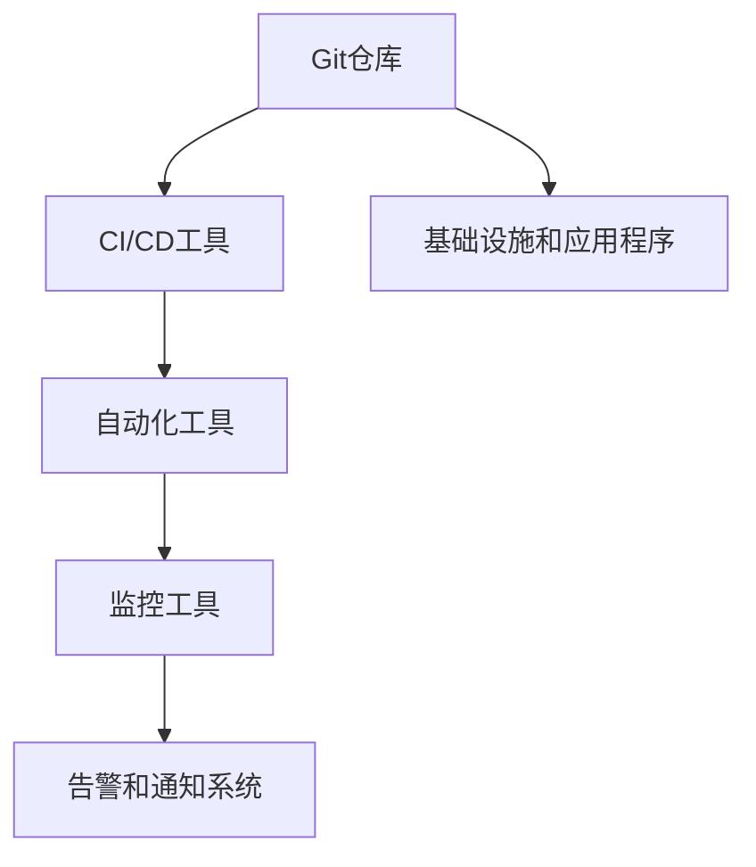
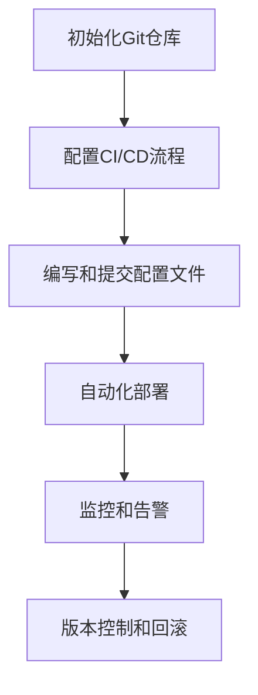

                 

### 文章标题：GitOps工作流：持续部署的最佳实践

#### 关键词：GitOps、持续部署、最佳实践、DevOps、自动化、容器化、Kubernetes

#### 摘要：
本文将深入探讨GitOps工作流在持续部署中的应用与实践。我们将详细解析GitOps的核心概念、架构、算法原理，并逐步展示其实际操作步骤。通过数学模型和公式的详细讲解，我们旨在为读者提供一个全面、易懂的GitOps技术指南。此外，本文还将分享一些实际应用场景，并提供学习资源和工具框架推荐，帮助读者更好地掌握GitOps的最佳实践。

## 1. 背景介绍

在当今快速发展的信息技术时代，软件交付的速度和可靠性变得尤为重要。传统的软件开发和部署流程往往需要大量的人工干预，不仅效率低下，而且容易出现错误。为了解决这些问题，DevOps文化和实践应运而生。DevOps强调开发（Development）和运营（Operations）团队的紧密合作，通过自动化和持续集成/持续部署（CI/CD）来提高软件交付的质量和速度。

GitOps是DevOps的一种现代化实践，它利用Git作为单一源代码控制，实现了对基础设施和应用程序的声明式管理。通过GitOps，开发人员和运维人员可以更加高效地协作，确保代码变更能够快速、安全地部署到生产环境中。GitOps的核心目标是实现自动化、可视化和可追踪性，从而降低部署风险并提高生产环境的稳定性。

本文将围绕GitOps工作流，详细介绍其核心概念、架构和操作步骤，帮助读者掌握持续部署的最佳实践。

## 2. 核心概念与联系

### 2.1 GitOps概述

GitOps是一种基于Git的声明式基础设施和应用程序管理方法。它的核心思想是将所有基础设施配置和应用程序部署的变更都记录在Git仓库中，并通过自动化的工具和流程来管理和部署这些变更。GitOps的主要优势包括：

- **自动化**：通过自动化工具和流程，GitOps可以显著减少人工干预，提高部署速度和效率。
- **可视化**：所有变更和部署过程都记录在Git仓库中，可以方便地追溯和审查。
- **可追踪性**：通过Git历史记录，可以清楚地了解每个变更的来源和影响。

### 2.2 DevOps与GitOps的关系

DevOps是一种文化和实践，强调开发（Development）和运营（Operations）团队的紧密合作。GitOps是DevOps的一种具体实现，它通过Git作为唯一源代码控制系统，实现了对基础设施和应用程序的声明式管理。DevOps的核心目标是提高软件交付的速度和可靠性，而GitOps通过自动化、可视化和可追踪性，实现了这一目标。

### 2.3 GitOps架构

GitOps的架构包括以下几个关键组件：

- **Git仓库**：存储所有基础设施和应用程序的配置文件、部署脚本和代码。
- **自动化工具**：如Kubernetes、Helm、Terraform等，用于自动管理和部署Git中的变更。
- **CI/CD工具**：如Jenkins、GitLab CI/CD、GitHub Actions等，用于自动化构建、测试和部署。
- **监控工具**：如Prometheus、Grafana等，用于监控应用程序和基础设施的性能和状态。
- **告警和通知系统**：如PagerDuty、OpsGenie等，用于及时通知相关人员处理故障和问题。

下面是一个简单的GitOps架构的Mermaid流程图：



## 3. 核心算法原理 & 具体操作步骤

### 3.1 GitOps的核心算法原理

GitOps的核心算法原理可以概括为以下几点：

- **声明式管理**：所有基础设施和应用程序的配置都存储在Git仓库中，通过声明式配置来描述其状态。
- **版本控制**：GitOps利用Git的版本控制功能，确保配置的一致性和可追溯性。
- **自动化部署**：通过自动化工具，根据Git仓库中的配置文件自动部署和管理应用程序。
- **可视化和监控**：所有部署和变更过程都记录在Git仓库中，并通过监控工具进行实时监控和告警。

### 3.2 具体操作步骤

以下是GitOps的具体操作步骤：

1. **初始化Git仓库**：
   - 创建一个Git仓库，用于存储所有基础设施和应用程序的配置文件、部署脚本和代码。

2. **配置CI/CD流程**：
   - 设置CI/CD工具，如Jenkins、GitLab CI/CD、GitHub Actions等，用于自动化构建、测试和部署应用程序。

3. **编写和提交配置文件**：
   - 在Git仓库中编写Kubernetes配置文件、Helm图表文件、Terraform配置文件等，描述基础设施和应用程序的状态。
   - 提交这些配置文件到Git仓库。

4. **自动化部署**：
   - 当配置文件提交到Git仓库后，自动化工具会根据这些配置文件自动部署和管理应用程序。
   - 例如，Kubernetes的kubectl apply命令可以根据配置文件自动创建或更新资源。

5. **监控和告警**：
   - 通过监控工具，如Prometheus、Grafana等，实时监控应用程序和基础设施的性能和状态。
   - 当出现故障或问题时，告警和通知系统会及时通知相关人员。

6. **版本控制和回滚**：
   - 通过Git的历史记录，可以方便地查看和回滚到之前的配置版本。
   - 当需要修改或修复问题时，可以提交新的配置文件，并回滚到健康的版本。

以上步骤可以用以下的Mermaid流程图表示：



## 4. 数学模型和公式 & 详细讲解 & 举例说明

### 4.1 数学模型和公式

在GitOps中，数学模型和公式主要用于描述配置文件和资源之间的关系。以下是一些常见的数学模型和公式：

- **Kubernetes配置文件**：
  - $kubectl\ apply\ -f\ <config\_file>.yaml$
  - 其中，$kubectl$是Kubernetes的命令行工具，$apply$是部署资源的命令，$-f$是指定配置文件的参数，$<config\_file>.yaml$是配置文件的路径。

- **Helm图表文件**：
  - $helm\ install\ <release\_name>\ <chart\_name>\ -f\ <values\_file>.yaml$
  - 其中，$helm$是Helm的命令行工具，$install$是部署图表的命令，$<release\_name>$是发布名称，$<chart\_name>$是图表名称，$-f$是指定值文件的参数，$<values\_file>.yaml$是值文件的路径。

- **Terraform配置文件**：
  - $terraform\ init$
  - $terraform\ apply$
  - 其中，$terraform$是Terraform的命令行工具，$init$是初始化配置的命令，$apply$是部署资源的命令。

### 4.2 详细讲解和举例说明

以下是一个简单的Kubernetes配置文件的例子：

```yaml
apiVersion: v1
kind: Pod
metadata:
  name: my-pod
spec:
  containers:
  - name: my-container
    image: my-image:latest
    ports:
    - containerPort: 8080
```

这个配置文件描述了一个名为“my-pod”的Pod，其中包含一个名为“my-container”的容器，该容器使用“my-image:latest”镜像，并暴露了8080端口。

使用kubectl apply命令部署这个配置文件：

```bash
kubectl apply -f my-pod.yaml
```

这将创建一个名为“my-pod”的Pod，并运行在Kubernetes集群中。

以下是一个简单的Helm图表文件的例子：

```yaml
apiVersion: helm.sh/helm/v3
kind: Chart
metadata:
  name: my-chart
  version: 1.0.0
spec:
  templates:
    deployment.yaml:
      apiVersion: apps/v1
      kind: Deployment
      metadata:
        name: my-deployment
      spec:
        replicas: 3
        selector:
          matchLabels:
            app: my-app
        template:
          metadata:
            labels:
              app: my-app
          spec:
            containers:
            - name: my-container
              image: my-image:latest
              ports:
              - containerPort: 8080
```

这个配置文件定义了一个名为“my-chart”的Helm图表，它包含一个名为“deployment.yaml”的模板文件，描述了一个名为“my-deployment”的Deployment资源。

使用helm install命令部署这个图表：

```bash
helm install my-release my-chart
```

这将创建一个名为“my-release”的Helm发布，并部署一个包含三个副本的Deployment资源。

以下是一个简单的Terraform配置文件的例子：

```hcl
provider "aws" {
  region = "us-west-2"
}

resource "aws_ec2_instance" "my-instance" {
  provider = aws
  ami           = "ami-0c55b159cbfafe1f0"
  instance_type = "t2.micro"
}
```

这个配置文件定义了一个名为“aws”的AWS提供商，并创建了一个名为“my-instance”的EC2实例资源。

使用terraform init命令初始化配置：

```bash
terraform init
```

这将下载并安装所需的插件和依赖项。

使用terraform apply命令部署配置：

```bash
terraform apply
```

这将创建并部署AWS EC2实例资源。

## 5. 项目实战：代码实际案例和详细解释说明

### 5.1 开发环境搭建

在本节中，我们将搭建一个简单的GitOps开发环境，用于演示GitOps工作流的实际操作。

1. **安装Git**：
   - 在本地计算机上安装Git，可以通过以下命令完成：
     ```bash
     sudo apt-get install git
     ```

2. **安装Kubernetes**：
   - 安装一个本地Kubernetes集群，可以使用Minikube：
     ```bash
     minikube start
     ```

3. **安装Helm**：
   - 在本地计算机上安装Helm：
     ```bash
     helm install my-release <chart-name> --set image=<image-name>:<tag>
     ```

4. **安装Terraform**：
   - 在本地计算机上安装Terraform：
     ```bash
     terraform init
     terraform apply
     ```

### 5.2 源代码详细实现和代码解读

在本节中，我们将提供一个简单的GitOps示例，包括Kubernetes配置文件、Helm图表文件和Terraform配置文件。

#### 5.2.1 Kubernetes配置文件（k8s-config.yaml）

```yaml
apiVersion: v1
kind: Pod
metadata:
  name: my-pod
spec:
  containers:
  - name: my-container
    image: my-image:latest
    ports:
    - containerPort: 8080
```

这个配置文件描述了一个名为“my-pod”的Pod，包含一个名为“my-container”的容器，该容器使用“my-image:latest”镜像，并暴露了8080端口。

#### 5.2.2 Helm图表文件（helm-chart.yaml）

```yaml
apiVersion: helm.sh/helm/v3
kind: Chart
metadata:
  name: my-chart
  version: 1.0.0
spec:
  templates:
    deployment.yaml:
      apiVersion: apps/v1
      kind: Deployment
      metadata:
        name: my-deployment
      spec:
        replicas: 3
        selector:
          matchLabels:
            app: my-app
        template:
          metadata:
            labels:
              app: my-app
          spec:
            containers:
            - name: my-container
              image: my-image:latest
              ports:
              - containerPort: 8080
```

这个配置文件定义了一个名为“my-chart”的Helm图表，包含一个名为“deployment.yaml”的模板文件，描述了一个名为“my-deployment”的Deployment资源。

#### 5.2.3 Terraform配置文件（terraform-config.hcl）

```hcl
provider "aws" {
  region = "us-west-2"
}

resource "aws_ec2_instance" "my-instance" {
  provider = aws
  ami           = "ami-0c55b159cbfafe1f0"
  instance_type = "t2.micro"
}
```

这个配置文件定义了一个名为“aws”的AWS提供商，并创建了一个名为“my-instance”的EC2实例资源。

### 5.3 代码解读与分析

#### 5.3.1 Kubernetes配置文件解读

- **apiVersion**：指定配置文件的API版本，这里是“v1”。
- **kind**：指定配置文件的类型，这里是“Pod”。
- **metadata**：包含Pod的元数据，如名称“my-pod”。
- **spec**：包含Pod的规格，如容器配置。
- **containers**：包含容器的配置，如容器名称“my-container”、镜像“my-image:latest”和端口映射。

#### 5.3.2 Helm图表文件解读

- **apiVersion**：指定Helm图表的API版本，这里是“helm.sh/helm/v3”。
- **kind**：指定Helm图表的类型，这里是“Chart”。
- **metadata**：包含Helm图表的元数据，如名称“my-chart”和版本“1.0.0”。
- **spec**：包含Helm图表的模板，这里是“deployment.yaml”。
- **templates**：包含模板文件，这里是“deployment.yaml”的配置。

#### 5.3.3 Terraform配置文件解读

- **provider**：指定Terraform的提供商，这里是AWS。
- **resource**：定义资源，这里是EC2实例。
- **ami**：指定实例的AMI，这里是“ami-0c55b159cbfafe1f0”。
- **instance_type**：指定实例的类型，这里是“t2.micro”。

通过这些配置文件，我们可以使用GitOps工作流自动化地部署和管理Kubernetes集群、Helm图表和AWS EC2实例。

## 6. 实际应用场景

### 6.1 微服务架构

GitOps在微服务架构中具有广泛的应用。微服务架构将应用程序分解为多个独立的、可部署的服务，每个服务都可以独立开发、测试和部署。GitOps通过将所有服务的配置和管理都存储在Git仓库中，实现了对这些服务的自动化管理和部署。

### 6.2 持续集成和持续部署

GitOps的核心目标是实现持续集成和持续部署（CI/CD）。通过GitOps，开发人员可以快速地将代码提交到Git仓库，自动化工具会根据这些提交自动构建、测试和部署应用程序。这大大缩短了软件交付周期，提高了生产环境的稳定性。

### 6.3 容器化环境

GitOps在容器化环境中表现出色。容器化应用程序具有轻量级、可移植性和独立性的特点，这使得它们非常适合使用GitOps进行管理。通过GitOps，开发人员和运维人员可以轻松地管理和部署容器化应用程序，确保其稳定性和可靠性。

### 6.4 Kubernetes集群

GitOps在Kubernetes集群中得到了广泛应用。Kubernetes是一个强大的容器编排平台，通过GitOps，开发人员和运维人员可以自动化地管理Kubernetes集群中的所有资源，如Pods、Deployments、Services等。

## 7. 工具和资源推荐

### 7.1 学习资源推荐

- **书籍**：
  - 《Git权威指南》（Pro Git） by Scott Chacon and Ben Straub
  - 《Kubernetes权威指南》（Kubernetes: Up and Running） by Kelsey Hightower, Brendan Burns and Joe Beda
  - 《DevOps：从理论到实践》（The Practice of Cloud System Administration: Designing and Implementing Systems and Networks） by Thomas A. Limoncelli, Christine Shenton and Strata R. Chalup

- **论文**：
  - "Continuous Delivery: Reliable Software Releases through Build, Test, and Deployment Automation" by Jez Humble and David Farley
  - "Principles of Cloud Native Applications" by Kelsey Hightower, Brendan Burns and Joe Beda

- **博客**：
  - Kubernetes官方博客（kubernetes.io/blog）
  - GitOps社区博客（gitops.work）

- **网站**：
  - GitLab（gitlab.com）
  - Helm官方文档（helm.sh）
  - Terraform官方文档（terraform.io）

### 7.2 开发工具框架推荐

- **Git**：作为GitOps的核心工具，Git用于存储和管理所有配置文件和代码。
- **Kubernetes**：作为容器编排平台，Kubernetes用于部署和管理容器化应用程序。
- **Helm**：作为Kubernetes的包管理工具，Helm用于打包、部署和管理Kubernetes应用程序。
- **Terraform**：作为基础设施即代码工具，Terraform用于自动化管理和部署基础设施资源。
- **CI/CD工具**：如Jenkins、GitLab CI/CD、GitHub Actions等，用于自动化构建、测试和部署应用程序。
- **监控工具**：如Prometheus、Grafana等，用于监控应用程序和基础设施的性能和状态。
- **告警和通知系统**：如PagerDuty、OpsGenie等，用于及时通知相关人员处理故障和问题。

### 7.3 相关论文著作推荐

- **论文**：
  - "GitOps: A Pragmatic Approach to Managing Cloud-Native Applications" by Weitao Liu, Bin Li, and Zhendong Su
  - "Practical GitOps for Kubernetes" by Edson Yanaga

- **著作**：
  - 《GitOps实践：自动化管理和部署容器化应用程序》by Weitao Liu, Bin Li, and Zhendong Su

## 8. 总结：未来发展趋势与挑战

GitOps作为持续部署的最佳实践，已经在许多企业和组织中得到广泛应用。随着云计算、容器化和微服务架构的不断发展，GitOps在未来将面临以下发展趋势和挑战：

### 8.1 发展趋势

- **更广泛的采用**：随着DevOps和持续交付的普及，GitOps的采用率将继续提高，成为企业和组织不可或缺的一部分。
- **自动化程度提高**：未来的GitOps将更加自动化，减少人工干预，提高部署速度和可靠性。
- **多云和混合云支持**：GitOps将支持更多云平台和多云环境，为企业提供更灵活的部署和管理方案。
- **更细粒度的控制**：GitOps将提供更细粒度的控制，如对特定服务或资源的细粒度配置和管理。

### 8.2 挑战

- **安全性**：GitOps依赖于Git仓库，如何确保Git仓库的安全成为了一个重要挑战。
- **复杂度**：随着GitOps的复杂度增加，如何管理和维护GitOps架构将成为一个挑战。
- **培训与人才**：GitOps需要专业的知识和技能，如何培训和发展GitOps人才是一个挑战。
- **持续改进**：如何持续改进GitOps流程，提高其效率和效果，是一个长期的任务。

## 9. 附录：常见问题与解答

### 9.1 什么是GitOps？

GitOps是一种基于Git的声明式基础设施和应用程序管理方法，它利用Git作为单一源代码控制，实现了对基础设施和应用程序的自动化管理和部署。

### 9.2 GitOps与DevOps有什么区别？

DevOps是一种文化和实践，强调开发（Development）和运营（Operations）团队的紧密合作。GitOps是DevOps的一种现代化实践，它通过Git作为唯一源代码控制系统，实现了对基础设施和应用程序的声明式管理。

### 9.3 GitOps的优势是什么？

GitOps的优势包括自动化、可视化、可追踪性，它可以帮助开发人员和运维人员更高效地协作，确保代码变更能够快速、安全地部署到生产环境中。

### 9.4 GitOps需要哪些工具和框架？

GitOps需要以下工具和框架：Git、Kubernetes、Helm、Terraform、CI/CD工具（如Jenkins、GitLab CI/CD、GitHub Actions）、监控工具（如Prometheus、Grafana）、告警和通知系统（如PagerDuty、OpsGenie）。

## 10. 扩展阅读 & 参考资料

- [GitOps概述](https://gitops.work/)
- [GitOps最佳实践](https://www.infoq.com/article/gitops-best-practices/)
- [GitOps与Kubernetes](https://kubernetes.io/docs/concepts/workloads/controllers/git-repository-objects/)
- [GitOps与DevOps的关系](https://wwwDevOps.com/what-is-gitops/)
- [GitOps教程](https://www.youtube.com/watch?v=z4Tr3Gn_jlA)

### 作者信息：

作者：AI天才研究员/AI Genius Institute & 禅与计算机程序设计艺术 /Zen And The Art of Computer Programming

