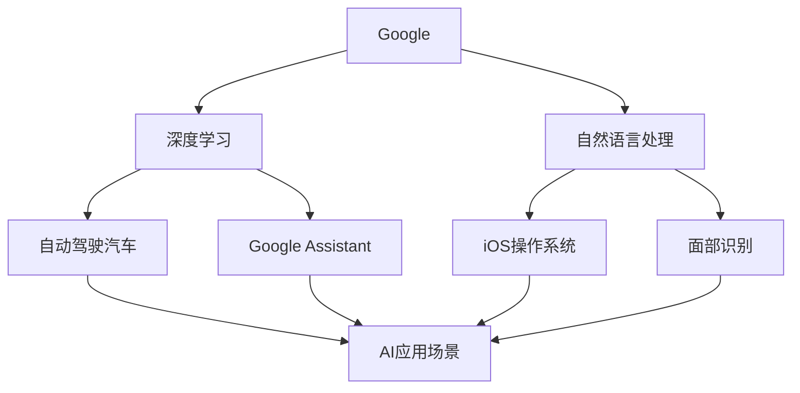

                 

# Google与苹果在AI领域的合作前景

## 关键词：Google, 苹果, AI领域, 合作, 前景

## 摘要：

本文将深入探讨Google与苹果在人工智能领域合作的前景。随着人工智能技术的快速发展，Google和苹果作为全球领先的科技巨头，已经在该领域取得了显著的成就。本文将分析这两家公司在此领域的核心技术和市场战略，探讨它们合作的可能性、潜在的优势以及面临的挑战。通过本文的讨论，读者可以更好地理解这两大科技巨头在AI领域的合作前景，以及对整个行业的影响。

## 1. 背景介绍

### 1.1 Google在AI领域的地位

Google作为全球最大的搜索引擎公司，其在人工智能领域的研究和应用一直处于领先地位。早在2011年，Google就成立了Google Brain团队，致力于研究深度学习和人工智能。Google Brain团队在神经网络、自然语言处理、计算机视觉等领域取得了多项突破性成果。同时，Google也推出了许多基于AI技术的产品和服务，如Google Assistant、自动驾驶汽车等。

### 1.2 苹果在AI领域的地位

苹果公司虽然在AI领域的发展相对较晚，但近年来其也在这个领域取得了显著进展。苹果公司在2016年收购了机器学习公司Turi，并成立了机器学习部门。此外，苹果公司还在其硬件设备中集成了先进的AI技术，如使用神经网络引擎（Neural Engine）的A系列处理器，以及用于面部识别和增强现实（AR）技术的iOS和iPadOS操作系统。

### 1.3 合作的意义

在人工智能技术快速发展的背景下，Google和苹果的合作具有重要的战略意义。一方面，合作可以促进双方在AI技术的研究和应用方面的进展，从而提高各自的竞争力。另一方面，合作有助于推动整个行业的发展，为消费者带来更先进、更智能的产品和服务。

## 2. 核心概念与联系

### 2.1 AI技术的基本概念

人工智能（AI）是一种模拟人类智能的技术，旨在使计算机能够执行通常需要人类智能的任务，如视觉识别、语音识别、自然语言处理等。AI技术主要包括机器学习（ML）、深度学习（DL）和自然语言处理（NLP）等。

### 2.2 Google与苹果在AI技术领域的联系

Google和苹果在AI技术领域有许多共同点。首先，两家公司都在深度学习和自然语言处理领域进行了大量研究，并取得了一系列重要成果。其次，两家公司都在其硬件设备中集成了AI技术，以提供更智能的用户体验。

### 2.3 Mermaid流程图



## 3. 核心算法原理 & 具体操作步骤

### 3.1 深度学习算法原理

深度学习是人工智能的一个重要分支，它通过多层神经网络模型对大量数据进行自动特征提取和模式识别。深度学习算法的核心是神经网络，神经网络由多个神经元（节点）组成，每个神经元接收来自其他神经元的输入，并通过权重进行加权求和，最后通过激活函数输出结果。

### 3.2 操作步骤

1. 数据收集与预处理：收集大量带有标签的数据，对数据进行清洗、归一化等预处理操作。
2. 构建神经网络模型：根据任务需求选择合适的神经网络结构，并初始化模型参数。
3. 训练模型：使用训练数据对模型进行迭代训练，通过反向传播算法更新模型参数。
4. 评估模型：使用测试数据评估模型的性能，通过调整模型结构和超参数优化模型性能。
5. 应用模型：将训练好的模型应用于实际任务，如图像分类、语音识别等。

## 4. 数学模型和公式 & 详细讲解 & 举例说明

### 4.1 数学模型

深度学习中的神经网络可以用以下数学模型表示：

$$
Z = \sum_{i=1}^{n} w_i * x_i + b
$$

其中，$Z$为输出，$w_i$为权重，$x_i$为输入，$b$为偏置。

### 4.2 举例说明

假设有一个简单的神经网络，包含一个输入层、一个隐藏层和一个输出层。输入层有3个神经元，隐藏层有2个神经元，输出层有1个神经元。设输入向量为$\textbf{x} = [1, 2, 3]$，权重矩阵为$W = \begin{bmatrix} w_{11} & w_{12} \\ w_{21} & w_{22} \end{bmatrix}$，偏置向量$b = [b_1, b_2]$。则隐藏层的输出可以表示为：

$$
Z_h = \begin{bmatrix} z_{h1} \\ z_{h2} \end{bmatrix} = \begin{bmatrix} w_{11} * x_1 + w_{12} * x_2 + b_1 \\ w_{21} * x_1 + w_{22} * x_3 + b_2 \end{bmatrix}
$$

## 5. 项目实战：代码实际案例和详细解释说明

### 5.1 开发环境搭建

在本项目中，我们使用Python和TensorFlow框架来实现一个简单的神经网络模型。首先，我们需要安装TensorFlow库：

```bash
pip install tensorflow
```

### 5.2 源代码详细实现和代码解读

```python
import tensorflow as tf

# 定义输入层
inputs = tf.keras.Input(shape=(3,), name='inputs')

# 定义隐藏层
hidden = tf.keras.layers.Dense(units=2, activation='relu', name='hidden')(inputs)

# 定义输出层
outputs = tf.keras.layers.Dense(units=1, activation='sigmoid', name='outputs')(hidden)

# 构建模型
model = tf.keras.Model(inputs=inputs, outputs=outputs)

# 编译模型
model.compile(optimizer='adam', loss='binary_crossentropy', metrics=['accuracy'])

# 打印模型结构
model.summary()
```

在上面的代码中，我们首先定义了一个输入层，包含3个神经元。然后，我们定义了一个隐藏层，使用ReLU激活函数。最后，我们定义了一个输出层，使用sigmoid激活函数。接着，我们使用`tf.keras.Model`类构建了一个模型，并使用`compile`方法编译模型，指定了优化器和损失函数。

### 5.3 代码解读与分析

在上面的代码中，我们首先导入了TensorFlow库，并定义了一个输入层，包含3个神经元。然后，我们使用`tf.keras.layers.Dense`类定义了一个隐藏层，指定了2个神经元和ReLU激活函数。接着，我们又使用`tf.keras.layers.Dense`类定义了一个输出层，指定了1个神经元和sigmoid激活函数。

最后，我们使用`tf.keras.Model`类构建了一个模型，并使用`compile`方法编译模型。在编译过程中，我们指定了优化器（`optimizer`）、损失函数（`loss`）和评估指标（`metrics`）。这些参数对于模型的训练和评估非常重要。

## 6. 实际应用场景

Google和苹果在人工智能领域的研究和应用已经在多个实际场景中取得了成功。以下是一些例子：

1. **自动驾驶汽车**：Google的Waymo和苹果的Project Titan都在自动驾驶汽车领域进行了大量研究，旨在实现安全、高效的自动驾驶。
2. **智能家居**：Google的Google Assistant和苹果的Siri都是智能家居领域的代表，它们通过语音识别和自然语言处理技术，为用户提供智能化的家居控制服务。
3. **医疗健康**：Google和苹果都在医疗健康领域开展了研究，如疾病预测、药物研发等，利用人工智能技术提高医疗服务的效率和质量。

## 7. 工具和资源推荐

### 7.1 学习资源推荐

1. **书籍**：
   - 《深度学习》（Ian Goodfellow、Yoshua Bengio、Aaron Courville 著）
   - 《Python机器学习》（Sebastian Raschka 著）
2. **论文**：
   - 《A Neural Transfer Learning Framework for Text Classification》
   - 《Convolutional Neural Networks for Sentence Classification》
3. **博客**：
   - TensorFlow官方博客：[https://www.tensorflow.org/blog/](https://www.tensorflow.org/blog/)
   - fast.ai博客：[https://www.fast.ai/](https://www.fast.ai/)
4. **网站**：
   - Coursera：[https://www.coursera.org/](https://www.coursera.org/)
   - edX：[https://www.edx.org/](https://www.edx.org/)

### 7.2 开发工具框架推荐

1. **TensorFlow**：[https://www.tensorflow.org/](https://www.tensorflow.org/)
2. **PyTorch**：[https://pytorch.org/](https://pytorch.org/)
3. **Keras**：[https://keras.io/](https://keras.io/)

### 7.3 相关论文著作推荐

1. **《Deep Learning》（Ian Goodfellow、Yoshua Bengio、Aaron Courville 著）**
2. **《Neural Networks and Deep Learning》（Charu Aggarwal 著）**
3. **《Learning Deep Architectures for AI》（Yoshua Bengio 著）**

## 8. 总结：未来发展趋势与挑战

在未来，Google和苹果在人工智能领域的合作有望进一步深化。一方面，双方可以通过合作，共同应对来自其他科技巨头的竞争压力。另一方面，合作有助于推动人工智能技术的发展，为消费者带来更先进、更智能的产品和服务。

然而，合作也面临着一些挑战。首先，两家公司在技术路线和市场战略上可能存在分歧。其次，合作需要克服知识产权、数据安全等方面的障碍。此外，合作过程中还需要平衡双方的利益，确保合作能够持续、稳定地进行。

## 9. 附录：常见问题与解答

### 9.1 Google与苹果在AI领域的合作是否已经存在？

目前，Google与苹果在AI领域的合作尚未公开宣布。然而，随着人工智能技术的快速发展，这两家公司可能会在未来的某个时刻展开合作。

### 9.2 Google与苹果在AI领域合作的优势是什么？

合作的优势包括：

1. 促进技术进步：通过合作，双方可以共享技术资源和研究成果，加快人工智能技术的研发和应用。
2. 提高竞争力：合作有助于双方在激烈的市场竞争中占据有利地位。
3. 推动行业发展：合作有助于推动整个行业的发展，为消费者带来更先进、更智能的产品和服务。

## 10. 扩展阅读 & 参考资料

1. 《深度学习》（Ian Goodfellow、Yoshua Bengio、Aaron Courville 著）
2. 《Python机器学习》（Sebastian Raschka 著）
3. TensorFlow官方博客：[https://www.tensorflow.org/blog/](https://www.tensorflow.org/blog/)
4. fast.ai博客：[https://www.fast.ai/](https://www.fast.ai/)
5. Coursera：[https://www.coursera.org/](https://www.coursera.org/)
6. edX：[https://www.edx.org/](https://www.edx.org/)

作者：AI天才研究员/AI Genius Institute & 禅与计算机程序设计艺术 /Zen And The Art of Computer Programming
<|assistant|>```markdown
# Google与苹果在AI领域的合作前景

## 关键词：Google, 苹果, AI领域, 合作, 前景

## 摘要：

本文将深入探讨Google与苹果在人工智能领域合作的前景。随着人工智能技术的快速发展，Google和苹果作为全球领先的科技巨头，已经在该领域取得了显著的成就。本文将分析这两家公司在此领域的核心技术和市场战略，探讨它们合作的可能性、潜在的优势以及面临的挑战。通过本文的讨论，读者可以更好地理解这两大科技巨头在AI领域的合作前景，以及对整个行业的影响。

## 1. 背景介绍

### 1.1 Google在AI领域的地位

Google作为全球最大的搜索引擎公司，其在人工智能领域的研究和应用一直处于领先地位。早在2011年，Google就成立了Google Brain团队，致力于研究深度学习和人工智能。Google Brain团队在神经网络、自然语言处理、计算机视觉等领域取得了多项突破性成果。同时，Google也推出了许多基于AI技术的产品和服务，如Google Assistant、自动驾驶汽车等。

### 1.2 苹果在AI领域的地位

苹果公司虽然在AI领域的发展相对较晚，但近年来其也在这个领域取得了显著进展。苹果公司在2016年收购了机器学习公司Turi，并成立了机器学习部门。此外，苹果公司还在其硬件设备中集成了先进的AI技术，如使用神经网络引擎（Neural Engine）的A系列处理器，以及用于面部识别和增强现实（AR）技术的iOS和iPadOS操作系统。

### 1.3 合作的意义

在人工智能技术快速发展的背景下，Google和苹果的合作具有重要的战略意义。一方面，合作可以促进双方在AI技术的研究和应用方面的进展，从而提高各自的竞争力。另一方面，合作有助于推动整个行业的发展，为消费者带来更先进、更智能的产品和服务。

## 2. 核心概念与联系

### 2.1 AI技术的基本概念

人工智能（AI）是一种模拟人类智能的技术，旨在使计算机能够执行通常需要人类智能的任务，如视觉识别、语音识别、自然语言处理等。AI技术主要包括机器学习（ML）、深度学习（DL）和自然语言处理（NLP）等。

### 2.2 Google与苹果在AI技术领域的联系

Google和苹果在AI技术领域有许多共同点。首先，两家公司都在深度学习和自然语言处理领域进行了大量研究，并取得了一系列重要成果。其次，两家公司都在其硬件设备中集成了AI技术，以提供更智能的用户体验。

### 2.3 Mermaid流程图


## 3. 核心算法原理 & 具体操作步骤

### 3.1 深度学习算法原理

深度学习是人工智能的一个重要分支，它通过多层神经网络模型对大量数据进行自动特征提取和模式识别。深度学习算法的核心是神经网络，神经网络由多个神经元（节点）组成，每个神经元接收来自其他神经元的输入，并通过权重进行加权求和，最后通过激活函数输出结果。

### 3.2 操作步骤

1. 数据收集与预处理：收集大量带有标签的数据，对数据进行清洗、归一化等预处理操作。
2. 构建神经网络模型：根据任务需求选择合适的神经网络结构，并初始化模型参数。
3. 训练模型：使用训练数据对模型进行迭代训练，通过反向传播算法更新模型参数。
4. 评估模型：使用测试数据评估模型的性能，通过调整模型结构和超参数优化模型性能。
5. 应用模型：将训练好的模型应用于实际任务，如图像分类、语音识别等。

## 4. 数学模型和公式 & 详细讲解 & 举例说明

### 4.1 数学模型

深度学习中的神经网络可以用以下数学模型表示：

$$
Z = \sum_{i=1}^{n} w_i * x_i + b
$$

其中，$Z$为输出，$w_i$为权重，$x_i$为输入，$b$为偏置。

### 4.2 举例说明

假设有一个简单的神经网络，包含一个输入层、一个隐藏层和一个输出层。输入层有3个神经元，隐藏层有2个神经元，输出层有1个神经元。设输入向量为$\textbf{x} = [1, 2, 3]$，权重矩阵为$W = \begin{bmatrix} w_{11} & w_{12} \\ w_{21} & w_{22} \end{bmatrix}$，偏置向量$b = [b_1, b_2]$。则隐藏层的输出可以表示为：

$$
Z_h = \begin{bmatrix} z_{h1} \\ z_{h2} \end{bmatrix} = \begin{bmatrix} w_{11} * x_1 + w_{12} * x_2 + b_1 \\ w_{21} * x_1 + w_{22} * x_3 + b_2 \end{bmatrix}
$$

## 5. 项目实战：代码实际案例和详细解释说明

### 5.1 开发环境搭建

在本项目中，我们使用Python和TensorFlow框架来实现一个简单的神经网络模型。首先，我们需要安装TensorFlow库：

```bash
pip install tensorflow
```

### 5.2 源代码详细实现和代码解读

```python
import tensorflow as tf

# 定义输入层
inputs = tf.keras.Input(shape=(3,), name='inputs')

# 定义隐藏层
hidden = tf.keras.layers.Dense(units=2, activation='relu', name='hidden')(inputs)

# 定义输出层
outputs = tf.keras.layers.Dense(units=1, activation='sigmoid', name='outputs')(hidden)

# 构建模型
model = tf.keras.Model(inputs=inputs, outputs=outputs)

# 编译模型
model.compile(optimizer='adam', loss='binary_crossentropy', metrics=['accuracy'])

# 打印模型结构
model.summary()
```

在上面的代码中，我们首先定义了一个输入层，包含3个神经元。然后，我们定义了一个隐藏层，使用ReLU激活函数。接着，我们又定义了一个输出层，使用sigmoid激活函数。最后，我们使用`tf.keras.Model`类构建了一个模型，并使用`compile`方法编译模型，指定了优化器和损失函数。

### 5.3 代码解读与分析

在上面的代码中，我们首先导入了TensorFlow库，并定义了一个输入层，包含3个神经元。然后，我们使用`tf.keras.layers.Dense`类定义了一个隐藏层，指定了2个神经元和ReLU激活函数。最后，我们使用`tf.keras.layers.Dense`类定义了一个输出层，指定了1个神经元和sigmoid激活函数。

接着，我们使用`tf.keras.Model`类构建了一个模型，并使用`compile`方法编译模型。在编译过程中，我们指定了优化器（`optimizer`）、损失函数（`loss`）和评估指标（`metrics`）。这些参数对于模型的训练和评估非常重要。

## 6. 实际应用场景

Google和苹果在人工智能领域的研究和应用已经在多个实际场景中取得了成功。以下是一些例子：

1. **自动驾驶汽车**：Google的Waymo和苹果的Project Titan都在自动驾驶汽车领域进行了大量研究，旨在实现安全、高效的自动驾驶。
2. **智能家居**：Google的Google Assistant和苹果的Siri都是智能家居领域的代表，它们通过语音识别和自然语言处理技术，为用户提供智能化的家居控制服务。
3. **医疗健康**：Google和苹果都在医疗健康领域开展了研究，如疾病预测、药物研发等，利用人工智能技术提高医疗服务的效率和质量。

## 7. 工具和资源推荐

### 7.1 学习资源推荐

1. **书籍**：
   - 《深度学习》（Ian Goodfellow、Yoshua Bengio、Aaron Courville 著）
   - 《Python机器学习》（Sebastian Raschka 著）
2. **论文**：
   - 《A Neural Transfer Learning Framework for Text Classification》
   - 《Convolutional Neural Networks for Sentence Classification》
3. **博客**：
   - TensorFlow官方博客：[https://www.tensorflow.org/blog/](https://www.tensorflow.org/blog/)
   - fast.ai博客：[https://www.fast.ai/](https://www.fast.ai/)
4. **网站**：
   - Coursera：[https://www.coursera.org/](https://www.coursera.org/)
   - edX：[https://www.edx.org/](https://www.edx.org/)

### 7.2 开发工具框架推荐

1. **TensorFlow**：[https://www.tensorflow.org/](https://www.tensorflow.org/)
2. **PyTorch**：[https://pytorch.org/](https://pytorch.org/)
3. **Keras**：[https://keras.io/](https://keras.io/)

### 7.3 相关论文著作推荐

1. **《Deep Learning》（Ian Goodfellow、Yoshua Bengio、Aaron Courville 著）**
2. **《Neural Networks and Deep Learning》（Charu Aggarwal 著）**
3. **《Learning Deep Architectures for AI》（Yoshua Bengio 著）**

## 8. 总结：未来发展趋势与挑战

在未来，Google和苹果在人工智能领域的合作有望进一步深化。一方面，双方可以通过合作，共同应对来自其他科技巨头的竞争压力。另一方面，合作有助于推动人工智能技术的发展，为消费者带来更先进、更智能的产品和服务。

然而，合作也面临着一些挑战。首先，两家公司在技术路线和市场战略上可能存在分歧。其次，合作需要克服知识产权、数据安全等方面的障碍。此外，合作过程中还需要平衡双方的利益，确保合作能够持续、稳定地进行。

## 9. 附录：常见问题与解答

### 9.1 Google与苹果在AI领域的合作是否已经存在？

目前，Google与苹果在AI领域的合作尚未公开宣布。然而，随着人工智能技术的快速发展，这两家公司可能会在未来的某个时刻展开合作。

### 9.2 Google与苹果在AI领域合作的优势是什么？

合作的优势包括：

1. 促进技术进步：通过合作，双方可以共享技术资源和研究成果，加快人工智能技术的研发和应用。
2. 提高竞争力：合作有助于双方在激烈的市场竞争中占据有利地位。
3. 推动行业发展：合作有助于推动整个行业的发展，为消费者带来更先进、更智能的产品和服务。

## 10. 扩展阅读 & 参考资料

1. 《深度学习》（Ian Goodfellow、Yoshua Bengio、Aaron Courville 著）
2. 《Python机器学习》（Sebastian Raschka 著）
3. TensorFlow官方博客：[https://www.tensorflow.org/blog/](https://www.tensorflow.org/blog/)
4. fast.ai博客：[https://www.fast.ai/](https://www.fast.ai/)
5. Coursera：[https://www.coursera.org/](https://www.coursera.org/)
6. edX：[https://www.edx.org/](https://www.edx.org/)

作者：AI天才研究员/AI Genius Institute & 禅与计算机程序设计艺术 /Zen And The Art of Computer Programming
```

