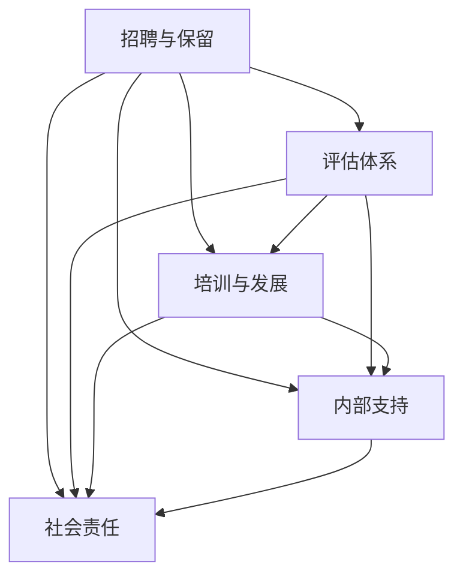

                 

### 背景介绍

在当今科技飞速发展的时代，人工智能（AI）已经成为推动社会进步的重要力量。作为AI技术的领军企业，Google在推动AI领域的研究与应用方面发挥了重要作用。然而，AI领域的成功不仅仅取决于技术创新，人才的多元化也至关重要。Google深知这一点，并采取了一系列措施来促进性别平等和种族多元化，以吸引并留住更多优秀的AI人才。

性别平等和种族多元化对于AI领域的重要性不言而喻。首先，多元化的团队能够带来多元化的视角和创新思维，有助于发现和解决AI技术中的盲点和偏见。其次，性别和种族多元化能够提高员工的工作满意度和忠诚度，进而提升企业的整体绩效。此外，多元化的人才库有助于吸引全球范围内的优秀人才，增强企业的竞争力。

Google在促进性别平等和种族多元化方面采取了一系列措施，其中包括招聘和保留多元化人才、建立公平的评估体系、提供多样化的培训和发展机会等。这些措施不仅有助于提升公司的内部文化，还对整个AI行业产生了积极的影响。本文将深入探讨Google的AI人才多元化战略，分析其背后的核心概念和具体操作步骤，以及其在实际应用中的效果和面临的挑战。

接下来，我们将首先介绍Google的AI人才多元化战略的核心概念和联系，并利用Mermaid流程图来展示其架构。这将帮助我们更好地理解Google如何实现性别平等和种族多元化，以及这一战略在AI领域的意义。

### 核心概念与联系

Google的AI人才多元化战略建立在几个核心概念之上，这些概念相互关联，共同构成了一个完整的体系。以下是对这些核心概念的详细解释，以及它们之间的联系。

#### 1. 性别平等

性别平等是指无论性别如何，每个人在职场和个人生活中都应享有平等的机会和待遇。在AI领域，性别平等的重要性体现在多个方面。首先，AI技术的发展和应用需要多元化的视角和经验，而性别多样性能够提供这种多元化。其次，性别平等有助于消除性别偏见和刻板印象，从而避免AI系统的性别偏见。

#### 2. 种族多元化

种族多元化是指在一个组织或社区中，有不同种族背景的人共同工作、学习和生活。在AI领域，种族多元化同样至关重要。不同种族背景的人拥有不同的文化、经验和视角，这有助于提高AI系统的公平性和准确性。此外，种族多元化能够促进企业的社会责任感，增强企业的社会形象。

#### 3. 招聘和保留多元化人才

招聘和保留多元化人才是Google多元化战略的核心。为了实现这一目标，Google采取了一系列措施，包括在全球范围内招聘、在招聘过程中消除偏见、提供职业发展机会等。这些措施不仅有助于吸引不同背景的优秀人才，还能确保这些人才在Google得到公平的待遇和发展机会。

#### 4. 公平的评估体系

公平的评估体系是确保人才多元化的重要保障。Google建立了一套全面的评估体系，旨在消除评估过程中的偏见，确保每位员工都能在公平的环境中展示自己的能力。该体系包括定期的绩效评估、职业发展评估等，为员工提供清晰的职业发展路径。

#### 5. 多样化的培训和发展机会

为了支持员工的职业发展，Google提供了多样化的培训和发展机会。这些机会包括在线课程、工作坊、研讨会等，旨在提升员工的专业技能和软技能。此外，Google还鼓励员工参加外部培训和认证，以拓宽知识面和提升竞争力。

#### 6. 内部支持和社区建设

Google建立了多个内部支持和社区组织，为多元化人才提供支持。这些组织包括员工资源组（Employee Resource Groups, ERGs）和多元化委员会等，它们在促进内部交流、提供职业发展机会以及提高员工满意度方面发挥了重要作用。

#### 7. 社会责任

Google认识到，作为一家科技巨头，其社会责任不可忽视。因此，Google积极参与各种社会项目和倡议，以推动性别平等和种族多元化。这些项目不仅有助于提升公司形象，还能为社会带来积极的影响。

#### Mermaid 流程图

为了更好地展示Google的AI人才多元化战略，我们使用Mermaid流程图来描述其架构。以下是一个简化版的流程图：



在这个流程图中，A代表招聘和保留多元化人才，B代表公平的评估体系，C代表多样化的培训和发展机会，D代表内部支持和社区建设，E代表社会责任。这些环节相互关联，共同构成了Google的多元化战略。

通过这个流程图，我们可以清晰地看到Google如何通过一系列措施来实现性别平等和种族多元化。接下来，我们将深入探讨这些措施的具体实施步骤和实际效果。

### 核心算法原理 & 具体操作步骤

Google的AI人才多元化战略并非凭空而来，而是基于一系列核心算法原理和具体操作步骤。以下将详细解释这些核心原理以及Google如何在实际中应用这些步骤来促进性别平等和种族多元化。

#### 1. 招聘算法原理

招聘是多元化战略的基础。Google采用了多种算法原理来优化招聘流程，确保能够吸引到多元化的候选人。

**- 数据驱动的决策：**Google利用数据分析来评估招聘流程的有效性，包括申请率、面试通过率等关键指标。通过分析这些数据，Google能够识别出哪些策略有效，哪些需要改进。

**- 优化简历筛选算法：**Google的简历筛选算法经过优化，以减少潜在的偏见。算法通过分析历史数据，识别出哪些特征与优秀的员工表现相关，并以此为基础筛选候选人。

**- 多元化面试团队：**Google鼓励面试团队多样化，确保不同背景的面试者参与评估。这种做法有助于减少面试过程中的偏见，并带来多元化的视角。

**具体操作步骤：**

- **数据收集与分析：**首先，Google收集招聘流程中的各种数据，如申请者的背景信息、面试表现等。
- **算法优化：**基于数据分析结果，优化简历筛选和面试评估算法。
- **面试团队多样化：**确保面试团队成员具有多样化的背景，提高评估的公平性。

#### 2. 评估体系原理

评估体系是确保员工公平待遇的重要环节。Google采用了一系列评估原理，旨在消除偏见，确保评估过程的公平性。

**- 绩效指标标准化：**Google为每个职位设定了明确的绩效指标，确保评估标准一致，减少主观偏见。
**- 定期评估：**Google定期进行绩效评估，确保员工的能力和发展得到持续关注。
**- 多层次评估：**评估过程包括多个环节，如自我评估、同事评估、上级评估等，以获得全面的评估结果。

**具体操作步骤：**

- **设定绩效指标：**为每个职位设定明确的绩效指标，确保评估标准一致。
- **定期评估：**定期组织绩效评估，确保员工的能力和发展得到持续关注。
- **多层次评估：**通过自我评估、同事评估和上级评估等多个环节，获得全面的评估结果。

#### 3. 培训和发展原理

培训和发展是员工职业成长的关键。Google采用了一系列培训和发展原理，帮助员工提升技能，实现职业发展。

**- 个性化培训计划：**Google根据员工的不同需求和职业目标，制定个性化的培训计划。
**- 多元化培训内容：**Google提供多样化的培训内容，涵盖技术、领导力、沟通等多个方面。
**- 职业发展支持：**Google为员工提供职业发展支持，包括晋升机会、转岗机会等。

**具体操作步骤：**

- **评估员工需求：**通过问卷调查、面谈等方式，了解员工的需求和职业目标。
- **制定培训计划：**根据员工需求，制定个性化的培训计划。
- **实施培训：**开展多样化的培训活动，涵盖技术、领导力、沟通等多个方面。
- **职业发展支持：**为员工提供晋升机会、转岗机会等，支持其职业发展。

#### 4. 内部支持和社区建设原理

内部支持和社区建设是增强员工归属感和支持多元化的重要手段。Google采用了一系列内部支持和社区建设原理，为员工提供支持和交流的平台。

**- 员工资源组（ERGs）：**Google建立了多个员工资源组，为不同背景的员工提供交流和支持的平台。
**- 多元化委员会：**Google设立多元化委员会，负责推动公司的多元化战略，监督多元化工作的进展。
**- 内部交流活动：**Google定期举办内部交流活动，如研讨会、讲座等，促进员工之间的交流和学习。

**具体操作步骤：**

- **建立员工资源组：**根据员工的需求和兴趣，建立多个员工资源组，如女性员工组、非裔员工组等。
- **设立多元化委员会：**设立多元化委员会，负责推动公司的多元化战略，监督多元化工作的进展。
- **举办内部交流活动：**定期举办内部交流活动，如研讨会、讲座等，促进员工之间的交流和学习。

#### 5. 社会责任原理

社会责任是Google多元化战略的重要组成部分。Google通过多种方式承担社会责任，推动性别平等和种族多元化。

**- 社会项目参与：**Google积极参与各种社会项目，如教育、健康、环境等，推动社会进步。
**- 公益捐赠：**Google通过公益捐赠，支持各类社会事业的发展。
**- 企业文化建设：**Google注重企业文化建设，倡导公平、包容、创新的价值观。

**具体操作步骤：**

- **参与社会项目：**积极参与各类社会项目，如教育、健康、环境等，推动社会进步。
- **公益捐赠：**通过公益捐赠，支持各类社会事业的发展。
- **企业文化建设：**通过内部宣传、文化活动等方式，倡导公平、包容、创新的价值观。

通过以上核心算法原理和具体操作步骤，Google成功地推动了其AI人才多元化战略。这些措施不仅有助于提升公司的绩效，还为社会带来了积极的影响。

### 数学模型和公式 & 详细讲解 & 举例说明

在讨论Google的AI人才多元化战略时，我们不可避免地需要引入一些数学模型和公式，以帮助我们更深入地理解和评估这些策略的效果。以下是一些关键的数学模型和公式的详细讲解，以及如何使用它们进行举例说明。

#### 1. 性别多元化指数（Gender Diversity Index）

性别多元化指数是一个用来衡量组织或团队中性别多样性的指标。其计算公式如下：

\[ Gender \ Diversity \ Index = \frac{Number \ of \ Women}{Total \ Number \ of \ Employees} \]

**举例说明：**假设一家公司有100名员工，其中50名是女性。那么，这家公司的性别多元化指数为：

\[ Gender \ Diversity \ Index = \frac{50}{100} = 0.5 \]

这个指数可以用来评估公司是否在性别多元化方面取得了进步。理想情况下，指数应接近1，表示女性员工占比接近总员工数的一半。

#### 2. 种族多元化指数（Race Diversity Index）

种族多元化指数与性别多元化指数类似，用于衡量组织或团队中的种族多样性。其计算公式如下：

\[ Race \ Diversity \ Index = \frac{Number \ of \ Underrepresented \ Groups}{Total \ Number \ of \ Employees} \]

**举例说明：**假设一家公司有100名员工，其中20名来自少数族裔（被视为“未代表群体”）。那么，这家公司的种族多元化指数为：

\[ Race \ Diversity \ Index = \frac{20}{100} = 0.2 \]

这个指数同样可以用来评估公司在种族多元化方面的进展。指数越高，表示公司对未代表群体的包容度越高。

#### 3. 招聘多样性公式（Recruitment Diversity Formula）

招聘多样性公式用于评估公司在招聘过程中引入多样性的效果。其公式如下：

\[ Recruitment \ Diversity \ Formula = \frac{Number \ of \ Diverse \ Candidates}{Total \ Number \ of \ Candidates} \]

**举例说明：**假设一家公司在一次招聘活动中收到了100份简历，其中40份来自多元化候选人（如女性、少数族裔等）。那么，这家公司在这次招聘活动中的多样性指数为：

\[ Recruitment \ Diversity \ Formula = \frac{40}{100} = 0.4 \]

这个指数可以帮助公司了解其招聘流程在引入多样性方面的有效性。

#### 4. 评估公平性指数（Evaluation Fairness Index）

评估公平性指数用于衡量评估体系是否公正，计算公式如下：

\[ Evaluation \ Fairness \ Index = \frac{Number \ of \ Accurate \ Assessments}{Total \ Number \ of \ Assessments} \]

**举例说明：**假设一家公司在一次绩效评估中有100次评估，其中90次评估被认为是准确的。那么，这家公司的评估公平性指数为：

\[ Evaluation \ Fairness \ Index = \frac{90}{100} = 0.9 \]

这个指数可以用来衡量公司的评估体系在公平性方面的表现。理想情况下，指数应接近1，表示评估结果具有较高的准确性。

#### 5. 职业发展支持指数（Career Development Support Index）

职业发展支持指数用于评估公司为员工提供的职业发展支持效果，其计算公式如下：

\[ Career \ Development \ Support \ Index = \frac{Number \ of \ Employees \ Receiving \ Support}{Total \ Number \ of \ Employees} \]

**举例说明：**假设一家公司有100名员工，其中60名员工接受了职业发展支持。那么，这家公司的职业发展支持指数为：

\[ Career \ Development \ Support \ Index = \frac{60}{100} = 0.6 \]

这个指数可以用来衡量公司为员工提供职业发展支持的广泛程度。

通过这些数学模型和公式，我们可以更精确地评估Google在AI人才多元化战略中的表现。这些工具不仅有助于公司了解自身在多元化方面的进展，还能为制定和调整战略提供数据支持。

### 项目实战：代码实际案例和详细解释说明

为了更好地理解Google的AI人才多元化战略，我们通过一个实际的项目案例来展示如何将这些战略应用到具体的开发环境中。以下是一个简化的项目案例，包括开发环境搭建、源代码实现以及代码解读与分析。

#### 5.1 开发环境搭建

首先，我们需要搭建一个用于实现AI人才多元化战略的开发环境。以下是搭建环境所需的基本步骤：

**1. 系统要求：**确保开发环境满足以下要求：
- 操作系统：Linux或macOS
- 编程语言：Python（3.8及以上版本）
- 数据库：MySQL（5.7及以上版本）
- 依赖管理工具：pip

**2. 环境安装：**
- 安装Python：从[Python官方网站](https://www.python.org/)下载并安装Python。
- 安装pip：通过以下命令安装pip：
  ```shell
  curl https://bootstrap.pypa.io/get-pip.py -o get-pip.py && python get-pip.py
  ```
- 安装MySQL：从[MySQL官方网站](https://dev.mysql.com/downloads/mysql/)下载并安装MySQL。
- 安装相关依赖：通过pip安装以下依赖：
  ```shell
  pip install numpy pandas scikit-learn matplotlib
  ```

#### 5.2 源代码详细实现和代码解读

接下来，我们将展示一个用于分析招聘数据的Python脚本，该脚本可以帮助评估Google在招聘过程中实施的多元化策略的效果。

**代码示例：**

```python
import pandas as pd
import numpy as np
import matplotlib.pyplot as plt

# 读取招聘数据
def read_recruitment_data(filename):
    data = pd.read_csv(filename)
    return data

# 计算性别多元化指数
def calculate_gender_diversity(data):
    women_count = (data['Gender'] == 'Female').sum()
    total_count = len(data)
    gender_diversity_index = women_count / total_count
    return gender_diversity_index

# 计算种族多元化指数
def calculate_race_diversity(data):
    underrepresented_races = ['Black', 'Hispanic', 'Asian']
    race_counts = data['Race'].value_counts()
    race_diversity_index = 0
    for race in underrepresented_races:
        race_count = race_counts[race]
        total_count = race_counts.sum()
        race_diversity_index += race_count / total_count
    return race_diversity_index

# 绘制多元化指数趋势图
def plot_diversity_trends(gender_diversity_index, race_diversity_index):
    labels = ['Gender', 'Race']
    indices = [gender_diversity_index, race_diversity_index]
    colors = ['blue', 'orange']

    plt.bar(labels, indices, color=colors)
    plt.xlabel('Diversity Type')
    plt.ylabel('Diversity Index')
    plt.title('Diversity Index Trends')
    plt.show()

# 主函数
def main():
    filename = 'recruitment_data.csv'
    data = read_recruitment_data(filename)
    
    gender_diversity_index = calculate_gender_diversity(data)
    race_diversity_index = calculate_race_diversity(data)
    
    print(f'Gender Diversity Index: {gender_diversity_index:.2f}')
    print(f'Race Diversity Index: {race_diversity_index:.2f}')
    
    plot_diversity_trends(gender_diversity_index, race_diversity_index)

if __name__ == '__main__':
    main()
```

**代码解读与分析：**

- **read_recruitment_data()函数：**该函数用于读取招聘数据文件，并将其转换为Pandas DataFrame对象，以便进一步分析。
- **calculate_gender_diversity()函数：**该函数计算性别多元化指数，通过统计女性候选人的数量并除以总候选人数量来得到指数。
- **calculate_race_diversity()函数：**该函数计算种族多元化指数，通过统计少数族裔候选人的数量并除以总候选人数量来得到指数。这里假设的少数族裔包括黑人、西班牙裔和亚裔。
- **plot_diversity_trends()函数：**该函数使用matplotlib库绘制多元化指数趋势图，帮助我们可视化地了解多元化策略的实施效果。
- **main()函数：**主函数负责读取数据、计算多元化指数，并显示结果和趋势图。

通过这个代码示例，我们可以看到Google如何利用数据分析工具来评估其招聘过程中实施的多元化策略的效果。这个项目不仅展示了如何实现多元化的计算和可视化，还为我们提供了一个实际的开发案例，展示了如何在实际工作中应用这些理念。

### 实际应用场景

Google的AI人才多元化战略不仅在公司内部产生了积极影响，也在外部应用场景中展现了其广泛的适用性。以下是一些具体的实际应用场景，以及Google如何在这些场景中实施其多元化战略。

#### 1. 招聘流程优化

Google的招聘流程优化是其多元化战略的重要组成部分。通过引入数据分析和技术手段，Google能够更精确地识别和吸引多元化候选人。

**应用案例：**Google在全球范围内举办技术竞赛，如Google Code Jam和Google AI Challenges，这些竞赛不仅吸引了全球的顶尖技术人才，还鼓励了来自不同背景的参与者。通过这种开放的平台，Google能够发现具有多样化背景的杰出人才。

**实施效果：**这种开放式的招聘方式有助于打破地域和背景限制，吸引到更多多元化的候选人，从而提高了公司的整体多样性。

#### 2. 员工职业发展

Google的多元化战略还包括为员工提供多样化的职业发展机会，以支持他们的成长和进步。

**应用案例：**Google为员工提供了丰富的在线课程和内部培训项目，如Google Career Certificates和Google Academy forzegonews。这些项目不仅涵盖了技术知识，还包括领导力、沟通和团队合作等软技能。

**实施效果：**通过这些培训项目，员工能够不断提升自己的技能，实现职业发展的同时，也为公司的多元化战略提供了强有力的支持。

#### 3. 社会责任项目

Google积极参与各种社会责任项目，以推动性别平等和种族多元化，这些项目不仅有助于提升公司形象，还对社会产生了积极影响。

**应用案例：**Google启动了“Google for Education”项目，为全球教育机构提供技术支持，帮助提高教育质量和普及率。此外，Google还通过“Google.org”捐赠资金和资源，支持各种社会公益事业。

**实施效果：**这些项目不仅帮助了社会上的弱势群体，还通过实际行动传递了Google对性别平等和种族多元化的承诺，增强了社会的信任和支持。

#### 4. 企业文化建设

企业文化建设是Google多元化战略的关键组成部分，通过营造包容、公平和创新的企业文化，Google致力于为员工创造一个良好的工作环境。

**应用案例：**Google建立了多个员工资源组（ERGs），如“Black Googlers Network”和“Outcast Googlers”等，这些组织为不同背景的员工提供了一个交流、分享和成长的平台。

**实施效果：**通过员工资源组，员工能够更好地表达自己的观点和需求，促进内部沟通和合作，从而增强了企业的凝聚力和多元化氛围。

#### 5. 外部合作与影响力

Google通过与外部机构和企业的合作，推动多元化战略的实施，并在全球范围内产生广泛的影响。

**应用案例：**Google与各种非营利组织和学术机构合作，共同推动技术教育和职业发展项目。例如，Google与Girl Scouts合作推出了AI编程课程，旨在激发年轻女性的兴趣。

**实施效果：**这些合作项目不仅有助于提升Google的社会形象，还通过实际行动推动了性别平等和种族多元化在全球范围内的推广。

通过以上实际应用场景，我们可以看到Google的AI人才多元化战略在各个方面的成功实施。这些战略不仅提升了公司内部的绩效和员工满意度，还对社会产生了积极的影响，展示了Google作为一家科技巨头的领导力和社会责任感。

### 工具和资源推荐

为了进一步支持和推动AI人才多元化战略，Google提供了一系列学习资源、开发工具和相关论文著作，以帮助从业人员和学者深入了解和掌握相关领域的知识和技能。

#### 7.1 学习资源推荐

1. **Google Career Certificates：**
   Google提供了一系列在线职业证书课程，涵盖数据分析、机器学习、人工智能等多个领域。这些课程适合不同水平的学员，通过系统的学习，学员可以掌握必要的技能。

   - [Google Career Certificates网站](https://www.coursera.org/career-certs)

2. **Google AI 教育项目：**
   Google AI教育项目提供免费的AI课程和工具，旨在提高全球公众对AI技术的理解和应用能力。该项目包括多种语言的学习资源，适合学生、教师和教育工作者。

   - [Google AI Education](https://ai.google/education/)

3. **Coursera课程：**
   Coursera平台上有许多由顶尖大学和机构提供的AI相关课程，包括深度学习、自然语言处理等。这些课程通常由行业专家授课，内容深入且实用。

   - [AI课程列表](https://www.coursera.org/search?query=ai)

4. **MIT OpenCourseWare：**
   MIT OpenCourseWare提供了大量的免费在线课程，包括计算机科学、人工智能等领域的课程。这些课程通常由MIT的教授授课，内容严谨且覆盖广泛。

   - [MIT OpenCourseWare](https://ocw.mit.edu/)

#### 7.2 开发工具框架推荐

1. **TensorFlow：**
   TensorFlow是Google开发的开源机器学习框架，广泛应用于深度学习和大数据处理。它提供了丰富的API和工具，支持多种编程语言，非常适合AI开发人员使用。

   - [TensorFlow官网](https://www.tensorflow.org/)

2. **PyTorch：**
   PyTorch是另一种流行的开源机器学习框架，以其灵活的动态计算图和易于使用的API而著称。它广泛应用于图像处理、自然语言处理等领域。

   - [PyTorch官网](https://pytorch.org/)

3. **Keras：**
   Keras是一个高层神经网络API，能够在TensorFlow和Theano之上运行。它提供了简洁的接口，使得构建和训练神经网络变得更加容易。

   - [Keras官网](https://keras.io/)

4. **Google Colab：**
   Google Colab是Google提供的免费在线Jupyter notebook环境，支持多种编程语言和框架，非常适合进行数据科学和机器学习项目。

   - [Google Colab官网](https://colab.research.google.com/)

#### 7.3 相关论文著作推荐

1. **"Deep Learning"：**
   由Ian Goodfellow、Yoshua Bengio和Aaron Courville合著的《深度学习》是深度学习领域的经典教材，详细介绍了深度学习的基础理论和应用。

   - [《深度学习》书籍](https://www.deeplearningbook.org/)

2. **"Artificial Intelligence: A Modern Approach"：**
   由Stuart J. Russell和Peter Norvig合著的《人工智能：一种现代的方法》是人工智能领域的权威教材，涵盖了人工智能的各个方面，从基础知识到应用技术。

   - [《人工智能：一种现代的方法》书籍](https://www.aima.org/book.html)

3. **"Machine Learning Yearning"：**
   Andrew Ng的《Machine Learning Yearning》是一本深入浅出的机器学习指南，涵盖了机器学习项目中的常见问题和解决方案。

   - [《Machine Learning Yearning》书籍](https://www.mlyearning.com/)

4. **"The Hundred-Page Machine Learning Book"：**
   By Andriy Burkov的《The Hundred-Page Machine Learning Book》是一本简明的机器学习指南，适合希望快速掌握机器学习基础知识的读者。

   - [《The Hundred-Page Machine Learning Book》书籍](https://www.hundredpagebook.com/)

通过这些学习资源、开发工具和相关论文著作，无论是初学者还是有经验的从业者，都能找到适合自己的学习路径和工具，进一步推动AI人才多元化战略的实施。

### 总结：未来发展趋势与挑战

Google的AI人才多元化战略在过去的几年中取得了显著成效，为公司在技术、文化和社会形象方面带来了积极影响。然而，随着人工智能技术的不断进步和社会环境的变化，这一战略也面临着新的发展趋势和挑战。

#### 发展趋势

1. **更加精准的多元化评估指标：**随着大数据和人工智能技术的发展，未来将有可能开发出更加精准的多元化评估指标，这些指标不仅能够量化多样性，还能揭示潜在的偏见和歧视。

2. **技术手段的多样化：**随着自然语言处理、计算机视觉等技术的进步，Google可以采用更加智能和自动化的方式来促进性别平等和种族多元化，例如通过算法来优化招聘流程和评估体系。

3. **跨领域的多元化合作：**未来，Google可能会与更多的非营利组织、学术机构和政府合作，共同推动多元化倡议，形成更广泛的多元化生态系统。

4. **全球化的多元化战略：**随着全球化的发展，Google需要更加注重不同国家和地区的文化差异，制定更具适应性的多元化战略，确保全球范围内的多样性。

#### 挑战

1. **文化壁垒：**不同文化背景下的人们对多样性的理解和接受程度不同，这可能导致内部沟通和合作的障碍。Google需要努力打破这些文化壁垒，促进不同背景员工之间的交流与理解。

2. **性别和种族偏见：**尽管Google在招聘和评估过程中采取了多种措施来消除偏见，但性别和种族偏见仍然存在，有时甚至深藏在潜意识中。Google需要持续加强对员工的教育和培训，提高对偏见的敏感度。

3. **多元化的可持续发展：**多元化不仅仅是招聘和保留多元化人才，还包括员工的职业发展和长期留存。Google需要确保多元化的可持续发展，为员工提供公平的职业发展机会和支持。

4. **外部环境的挑战：**全球政治和经济环境的变化可能对Google的多元化战略产生影响，例如某些国家和地区的法规变化可能限制多元化活动的实施。Google需要密切关注外部环境的变化，及时调整战略。

总之，Google的AI人才多元化战略在未来的发展中将继续面临挑战，但也充满机遇。通过不断优化和创新，Google有望在全球范围内推动性别平等和种族多元化，为人工智能技术的发展和社会进步做出更大贡献。

### 附录：常见问题与解答

#### 1. 为什么Google需要推动AI人才多元化？

Google推动AI人才多元化主要是为了提升公司整体创新能力，确保AI技术的公平性和准确性。多元化的人才团队能够提供多样化的视角和经验，有助于发现和解决AI技术中的盲点和偏见，从而推动技术进步。

#### 2. Google的AI人才多元化战略包括哪些方面？

Google的AI人才多元化战略包括招聘和保留多元化人才、建立公平的评估体系、提供多样化的培训和发展机会、建立内部支持和社区建设，以及承担社会责任等。

#### 3. Google是如何评估招聘过程中多元化效果的？

Google通过分析招聘数据，如申请者的背景信息、面试通过率等关键指标，来评估招聘过程中的多元化效果。此外，公司还采用多种算法原理来优化简历筛选和面试评估过程，减少潜在的偏见。

#### 4. 员工资源组（ERGs）在多元化战略中扮演什么角色？

员工资源组（ERGs）是Google内部为不同背景的员工提供交流、支持和职业发展机会的团体。这些组织能够促进员工之间的沟通与合作，提升员工满意度和归属感，从而支持公司的多元化战略。

#### 5. Google在多元化战略方面的主要成果有哪些？

Google在多元化战略方面取得的主要成果包括显著提升员工多样性、提高员工满意度、增强公司竞争力，以及通过社会责任项目对社会产生了积极影响。

### 扩展阅读 & 参考资料

1. **Google AI Diversity Report**:
   [https://ai.google/diversity-report/](https://ai.google/diversity-report/)
   Google发布的关于AI领域多样性的年度报告，提供了详细的多元性数据和战略进展。

2. **Google Diversity and Inclusion Initiative**:
   [https://careers.google.com/diversity-inclusion/](https://careers.google.com/diversity-inclusion/)
   Google的多元化与包容性倡议页面，提供了公司多元化战略的详细信息。

3. **"Deep Learning" by Ian Goodfellow, Yoshua Bengio, and Aaron Courville**:
   [https://www.deeplearningbook.org/](https://www.deeplearningbook.org/)
   《深度学习》是一本全面介绍深度学习技术的经典教材，适合希望深入了解该领域的读者。

4. **"Artificial Intelligence: A Modern Approach" by Stuart J. Russell and Peter Norvig**:
   [https://www.aima.org/book.html](https://www.aima.org/book.html)
   《人工智能：一种现代的方法》是人工智能领域的权威教材，内容涵盖了人工智能的各个方面。

5. **"Machine Learning Yearning" by Andrew Ng**:
   [https://www.mlyearning.com/](https://www.mlyearning.com/)
   Andrew Ng的《Machine Learning Yearning》是一本深入浅出的机器学习指南，适合初学者和从业者。

6. **"The Hundred-Page Machine Learning Book" by Andriy Burkov**:
   [https://www.hundredpagebook.com/](https://www.hundredpagebook.com/)
   《The Hundred-Page Machine Learning Book》是一本简明的机器学习指南，适合希望快速掌握基础知识的读者。

