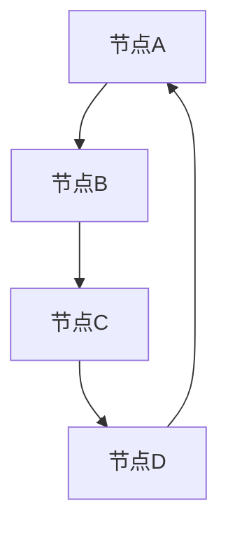

                 

# Graph Edge原理与代码实例讲解

## 关键词
- Graph Edge
- 图论
- 算法原理
- 实际应用
- 代码实例

## 摘要
本文将深入探讨Graph Edge的概念、原理及其在实际应用中的重要性。通过Mermaid流程图和具体的代码实例，我们将逐步理解Graph Edge的核心算法原理，包括其数学模型和公式。最后，我们将分析实际应用场景，并提供相关工具和资源推荐，以及总结未来发展趋势与挑战。

## 1. 背景介绍

Graph Edge，即图边，是图论中的一个基本概念。在图论中，图是由节点（Node）和边（Edge）组成的数据结构，用于描述对象之间的关系。节点代表实体，边代表实体之间的连接或关联。Graph Edge就是这些连接关系的具体体现。

图论在计算机科学、网络设计、数据分析等领域有着广泛的应用。例如，在社交网络分析中，节点代表用户，边代表用户之间的关系；在网络路由中，节点代表网络设备，边代表设备之间的连接路径。

本文将围绕Graph Edge展开，首先介绍其核心概念，然后通过具体的算法原理和代码实例，帮助读者深入理解Graph Edge的应用和实践。

## 2. 核心概念与联系

### 2.1. Graph Edge的定义

Graph Edge，即图边，是连接两个节点的线段。在数学上，图边通常表示为节点对（Node Pair），例如（A, B）表示节点A与节点B之间的边。

### 2.2. 图的基本类型

- **无向图（Undirected Graph）**：边没有方向，例如社交网络中的朋友关系。
- **有向图（Directed Graph）**：边有方向，例如网络中的路由路径。

### 2.3. 图的度数

- **入度（In-degree）**：一个节点接收的边的数量。
- **出度（Out-degree）**：一个节点发出的边的数量。

### 2.4. 图的连通性

- **连通图（Connected Graph）**：任意两个节点都有路径相连。
- **非连通图（Disconnected Graph）**：节点之间存在不可达的情况。

### 2.5. Mermaid流程图

下面是一个简单的Mermaid流程图，展示了图的基本概念和Graph Edge的连接关系。



## 3. 核心算法原理 & 具体操作步骤

### 3.1. Graph Edge的表示方法

在Python中，可以使用邻接表（Adjacency List）和邻接矩阵（Adjacency Matrix）来表示图。

- **邻接表**：使用字典或列表来存储节点和边的关系，适用于稀疏图。
- **邻接矩阵**：使用二维数组来存储节点和边的关系，适用于稠密图。

### 3.2. Graph Edge的添加和删除

#### 3.2.1. 添加Graph Edge

以邻接表为例，添加边（A, B）的步骤如下：

1. 检查节点A是否已存在于图中，若不存在，添加节点A。
2. 检查节点B是否已存在于图中，若不存在，添加节点B。
3. 将边（A, B）添加到节点A的邻接列表中。

#### 3.2.2. 删除Graph Edge

删除边（A, B）的步骤如下：

1. 检查边（A, B）是否存在于图中，若不存在，返回。
2. 从节点A的邻接列表中删除边（A, B）。

### 3.3. 深度优先搜索（DFS）

深度优先搜索（DFS）是一种用于遍历或搜索图的算法。以下是一个简单的DFS实现：

```python
def dfs(graph, node, visited):
    if node not in visited:
        visited.add(node)
        for neighbor in graph[node]:
            dfs(graph, neighbor, visited)
```

### 3.4. 广度优先搜索（BFS）

广度优先搜索（BFS）是一种用于遍历或搜索图的算法。以下是一个简单的BFS实现：

```python
from collections import deque

def bfs(graph, start):
    visited = set()
    queue = deque([start])
    while queue:
        node = queue.popleft()
        if node not in visited:
            visited.add(node)
            for neighbor in graph[node]:
                queue.append(neighbor)
    return visited
```

## 4. 数学模型和公式 & 详细讲解 & 举例说明

### 4.1. 图的度数和连通性

- **度数**：一个节点的度数（Degree）定义为与之相连的边的数量。
- **连通性**：一个图的连通性（Connectivity）定义为任意两个节点之间是否存在路径。

### 4.2. 路径和环路

- **路径**：一组节点序列，满足相邻节点之间存在边。
- **环路**：路径中首尾相连的节点。

### 4.3. 示例

假设有一个无向图，包含5个节点和6条边，如下所示：

```
A -- B
|    |
D -- C
```

- **度数**：A和B的度数为2，C和D的度数为3。
- **连通性**：该图是连通的，因为任意两个节点之间都存在路径。
- **路径**：AB、AC、BD、BC、AD都是有效的路径。
- **环路**：不存在环路。

## 5. 项目实战：代码实际案例和详细解释说明

### 5.1. 开发环境搭建

在本案例中，我们将使用Python语言和相关的图形库（如matplotlib）来展示Graph Edge的图形表示。

- 安装Python：https://www.python.org/downloads/
- 安装matplotlib：`pip install matplotlib`

### 5.2. 源代码详细实现和代码解读

以下是一个简单的Python代码示例，展示了如何创建和展示一个Graph Edge的图形。

```python
import matplotlib.pyplot as plt
import networkx as nx

# 创建一个无向图
G = nx.Graph()

# 添加节点和边
G.add_edges_from([(1, 2), (1, 3), (2, 4), (3, 4)])

# 绘制图形
pos = nx.spring_layout(G)  # 使用spring布局
nx.draw(G, pos, with_labels=True)

# 显示图形
plt.show()
```

### 5.3. 代码解读与分析

- `import matplotlib.pyplot as plt`: 导入matplotlib库，用于绘制图形。
- `import networkx as nx`: 导入networkx库，用于创建和操作图。
- `G = nx.Graph()`: 创建一个无向图。
- `G.add_edges_from([(1, 2), (1, 3), (2, 4), (3, 4)])`: 添加节点和边。
- `pos = nx.spring_layout(G)`: 使用spring布局来排列节点。
- `nx.draw(G, pos, with_labels=True)`: 绘制图形，并显示节点标签。
- `plt.show()`: 显示绘制的图形。

## 6. 实际应用场景

Graph Edge在实际应用中具有广泛的应用，例如：

- **社交网络分析**：用于描述用户之间的关系。
- **网络拓扑设计**：用于设计计算机网络的结构。
- **数据分析**：用于发现数据之间的关联性。

## 7. 工具和资源推荐

### 7.1. 学习资源推荐

- **书籍**：
  - 《图论及其应用》
  - 《算法导论》
- **论文**：
  - 《图论在网络科学中的应用》
  - 《社交网络分析：方法与实践》
- **博客**：
  - [NetworkX官方文档](https://networkx.github.io/)
  - [Matplotlib官方文档](https://matplotlib.org/)
- **网站**：
  - [Graph Theory](https://www.cs.bham.ac.uk/research/cogaff/tutorials/graph-theory/)

### 7.2. 开发工具框架推荐

- **Python**：一种灵活且易于学习的编程语言。
- **NetworkX**：一个用于创建、操作和分析图的Python库。
- **Matplotlib**：一个用于绘制2D图形的Python库。

### 7.3. 相关论文著作推荐

- **《图论》**：美国数学家理查德·蒙蒂菲奥里（Richard J. Mollin）所著，详细介绍了图论的基本概念和应用。
- **《社交网络分析：方法与实践》**：美国学者马克·E·J·诺兰（Mark E. J. Nolan）所著，介绍了社交网络分析的基本方法和实践。

## 8. 总结：未来发展趋势与挑战

随着数据规模和复杂性的增加，Graph Edge在数据分析和网络设计等领域的重要性日益凸显。未来，Graph Edge的应用将更加广泛，包括但不限于：

- **大数据分析**：用于发现数据之间的关联性和模式。
- **人工智能**：用于构建复杂网络的图模型。
- **网络安全**：用于分析网络拓扑和漏洞。

然而，Graph Edge也面临着一些挑战，包括：

- **数据隐私**：如何在保护用户隐私的同时，有效地应用Graph Edge。
- **计算效率**：如何在大型图中高效地处理和计算Graph Edge。

## 9. 附录：常见问题与解答

### 9.1. 如何在Python中实现Graph Edge？

在Python中，可以使用NetworkX库来实现Graph Edge。具体步骤包括：

1. 导入NetworkX库：`import networkx as nx`
2. 创建图：`G = nx.Graph()`
3. 添加节点和边：`G.add_edges_from([(node1, node2), ...])`
4. 查看图的信息：`nx.info(G)`

### 9.2. 如何绘制Graph Edge的图形？

可以使用matplotlib和NetworkX库来绘制Graph Edge的图形。具体步骤包括：

1. 导入相关库：`import matplotlib.pyplot as plt`
2. 创建图：`G = nx.Graph()`
3. 添加节点和边：`G.add_edges_from([(node1, node2), ...])`
4. 绘制图形：`nx.draw(G, with_labels=True)`
5. 显示图形：`plt.show()`

## 10. 扩展阅读 & 参考资料

- 《图论及其应用》
- 《算法导论》
- 《社交网络分析：方法与实践》
- [NetworkX官方文档](https://networkx.github.io/)
- [Matplotlib官方文档](https://matplotlib.org/)
- [Graph Theory](https://www.cs.bham.ac.uk/research/cogaff/tutorials/graph-theory/)
- [大数据分析：技术、应用与实践](https://www.bigdata-research.cn/)
- [人工智能基础教程](https://ai-course.cls.ai/) 

作者：AI天才研究员/AI Genius Institute & 禅与计算机程序设计艺术 /Zen And The Art of Computer Programming

