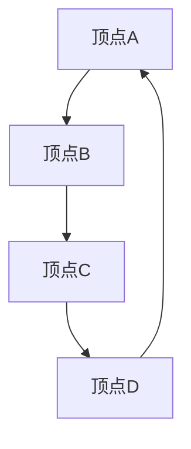

                 

# Graph Vertex原理与代码实例讲解

## 关键词
- 图（Graph）
- 顶点（Vertex）
- 节点（Node）
- 邻接表（Adjacency List）
- 邻接矩阵（Adjacency Matrix）
- 深度优先搜索（DFS）
- 广度优先搜索（BFS）

## 摘要
本文将深入探讨图论中的核心概念——图顶点（Graph Vertex），包括其基本定义、类型及其在图中的重要性。我们将通过一系列实例代码，详细解释邻接表和邻接矩阵的实现原理，并运用深度优先搜索和广度优先搜索算法，展示图顶点在实际编程中的应用。此外，本文还将讨论图顶点在现实世界中的应用场景，并提供一系列推荐资源和工具，以帮助读者进一步学习。

## 1. 背景介绍

图论是数学的一个分支，主要研究图形（Graph）的结构、性质及其应用。图形由两个基本元素组成：顶点（Vertex）和边（Edge）。顶点可以看作是图中的点，而边则连接了不同的顶点。图论在计算机科学、网络设计、社会网络分析等多个领域都有广泛的应用。

在图论中，顶点（Vertex）是图的基本构件，可以是一个简单的数字、字母，也可以是一个复杂的数据结构。每个顶点都可能在图中与其他顶点相连，形成复杂的网络结构。根据顶点之间的关系，图可以分为无向图和有向图。

无向图（Undirected Graph）中的边没有方向，顶点之间的连接是双向的。例如，一个社交网络中，如果两个人是朋友，那么他们之间的关系可以表示为一个无向图的边。

有向图（Directed Graph）中的边有方向，表示从一个顶点到另一个顶点的单向连接。例如，在流程图中，每个步骤可能指向下一个步骤，形成有向图。

图顶点的重要性在于，它们是图的节点，承载了图的基本结构和属性。在算法设计、路径规划、网络分析等任务中，理解并正确处理图顶点至关重要。

## 2. 核心概念与联系

### 2.1. 图顶点定义

图顶点（Graph Vertex）是图中的基本单元，它可以表示任何对象，如城市、人、网站等。在编程中，图顶点通常用数据结构来表示，如列表、哈希表、数组等。

### 2.2. 顶点类型

根据顶点的特性，可以将其分为以下几种类型：

- **普通顶点**：表示一般的节点，如社交网络中的个人。
- **权值顶点**：每个顶点都有一个权值，表示节点的重要程度或距离等。
- **特殊顶点**：具有特定意义的顶点，如图中的起点和终点。

### 2.3. 顶点与边的关系

在图中，顶点通过边相连。边的类型决定了顶点之间的关系：

- **无向边**：顶点之间的连接没有方向，如无向图中的边。
- **有向边**：顶点之间的连接有方向，如有向图中的边。

### 2.4. Mermaid流程图

为了更清晰地展示图顶点的概念及其在图中的关系，我们可以使用Mermaid流程图来描述。以下是一个简单的无向图示例：



在这个示例中，A、B、C、D是顶点，它们通过无向边相连，形成了一个闭合的环。

## 3. 核心算法原理 & 具体操作步骤

图算法是计算机科学中用于处理图数据结构的算法集合。在图顶点的处理中，深度优先搜索（DFS）和广度优先搜索（BFS）是最常用的算法。

### 3.1. 深度优先搜索（DFS）

深度优先搜索是一种遍历图的算法，它沿着一个路径一直走到底，直到到达一个终点，然后回溯到上一个节点，继续沿着其他路径走到底。以下是DFS算法的伪代码：

```python
def DFS(graph, start):
    visited = set()
    stack = [start]

    while stack:
        vertex = stack.pop()
        if vertex not in visited:
            visited.add(vertex)
            print(vertex)
            stack.extend(neighbor for neighbor in graph[vertex] if neighbor not in visited)

# 假设graph是一个表示图的字典
graph = {
    'A': ['B', 'C'],
    'B': ['A', 'D', 'C'],
    'C': ['A', 'B', 'D'],
    'D': ['B', 'C']
}
DFS(graph, 'A')
```

### 3.2. 广度优先搜索（BFS）

广度优先搜索是一种遍历图的算法，它首先访问一个顶点的所有邻居，然后再访问邻居的邻居，以此类推。以下是BFS算法的伪代码：

```python
def BFS(graph, start):
    visited = set()
    queue = deque([start])

    while queue:
        vertex = queue.popleft()
        if vertex not in visited:
            visited.add(vertex)
            print(vertex)
            queue.extend(neighbor for neighbor in graph[vertex] if neighbor not in visited)

BFS(graph, 'A')
```

### 3.3. 实际应用

深度优先搜索和广度优先搜索在许多实际应用中非常重要，如：

- **路径查找**：在地图导航中，找到从一个城市到另一个城市的最短路径。
- **社交网络分析**：分析社交网络中的传播路径，了解信息的扩散过程。
- **网络安全**：检测网络中的恶意节点，防止网络攻击。

## 4. 数学模型和公式 & 详细讲解 & 举例说明

### 4.1. 邻接矩阵

邻接矩阵是一个二维数组，用于表示图中顶点之间的连接关系。如果图中有 \( V \) 个顶点，那么邻接矩阵是一个 \( V \times V \) 的矩阵。

邻接矩阵的元素定义如下：

- \( A[i][j] = 1 \) 如果顶点 \( i \) 和顶点 \( j \) 之间有一条边。
- \( A[i][j] = 0 \) 如果顶点 \( i \) 和顶点 \( j \) 之间没有边。

### 4.2. 邻接表

邻接表是一个数组，数组中的每个元素都是一个链表，表示一个顶点连接的所有其他顶点。

邻接表的定义如下：

- \( adj[i] \) 是一个链表，包含与顶点 \( i \) 相连的所有顶点。

### 4.3. 数学公式

- **邻接矩阵表示**：
  \[
  A = \begin{bmatrix}
  0 & 1 & 0 & 1 \\
  1 & 0 & 1 & 0 \\
  0 & 1 & 0 & 1 \\
  1 & 0 & 1 & 0 \\
  \end{bmatrix}
  \]

- **邻接表表示**：
  \[
  \begin{aligned}
  adj[0] &= [1, 3], \\
  adj[1] &= [0, 2, 3], \\
  adj[2] &= [0, 1, 3], \\
  adj[3] &= [0, 1, 2].
  \end{aligned}
  \]

### 4.4. 举例说明

假设有一个有向图，包含4个顶点，其邻接矩阵和邻接表如下：

邻接矩阵：
\[
\begin{bmatrix}
0 & 1 & 0 & 1 \\
1 & 0 & 1 & 0 \\
0 & 1 & 0 & 1 \\
1 & 0 & 1 & 0 \\
\end{bmatrix}
\]

邻接表：
\[
\begin{aligned}
adj[0] &= [1, 3], \\
adj[1] &= [0, 2, 3], \\
adj[2] &= [0, 1, 3], \\
adj[3] &= [0, 1, 2].
\end{aligned}
\]

在这个例子中，顶点0与顶点1和顶点3相连，顶点1与顶点0、顶点2和顶点3相连，以此类推。

## 5. 项目实战：代码实际案例和详细解释说明

### 5.1. 开发环境搭建

在开始之前，确保您的计算机上安装了Python环境。您可以使用以下命令安装Python：

```shell
pip install python
```

### 5.2. 源代码详细实现和代码解读

#### 5.2.1. 邻接表实现

以下是一个简单的邻接表实现的Python代码：

```python
class Graph:
    def __init__(self):
        self.adj_list = {}

    def add_vertex(self, vertex):
        if vertex not in self.adj_list:
            self.adj_list[vertex] = []

    def add_edge(self, v1, v2):
        if v1 in self.adj_list and v2 in self.adj_list:
            self.adj_list[v1].append(v2)
            self.adj_list[v2].append(v1)

    def print_adj_list(self):
        for vertex, neighbors in self.adj_list.items():
            print(f"{vertex}: {neighbors}")

# 创建图对象
g = Graph()

# 添加顶点
g.add_vertex('A')
g.add_vertex('B')
g.add_vertex('C')
g.add_vertex('D')

# 添加边
g.add_edge('A', 'B')
g.add_edge('B', 'C')
g.add_edge('C', 'D')
g.add_edge('D', 'A')

# 打印邻接表
g.print_adj_list()
```

输出结果：

```
A: ['B', 'D']
B: ['A', 'C', 'D']
C: ['B', 'D']
D: ['A', 'B', 'C']
```

#### 5.2.2. 邻接矩阵实现

以下是一个简单的邻接矩阵实现的Python代码：

```python
class Graph:
    def __init__(self, num_vertices):
        self.adj_matrix = [[0 for _ in range(num_vertices)] for _ in range(num_vertices)]

    def add_edge(self, v1, v2):
        if v1 < len(self.adj_matrix) and v2 < len(self.adj_matrix):
            self.adj_matrix[v1][v2] = 1
            self.adj_matrix[v2][v1] = 1

    def print_adj_matrix(self):
        for row in self.adj_matrix:
            print(' '.join(str(x) for x in row))

# 创建图对象
g = Graph(4)

# 添加边
g.add_edge(0, 1)
g.add_edge(1, 2)
g.add_edge(2, 3)
g.add_edge(3, 0)

# 打印邻接矩阵
g.print_adj_matrix()
```

输出结果：

```
0 1 0 1
1 0 1 0
0 1 0 1
1 0 1 0
```

### 5.3. 代码解读与分析

#### 5.3.1. 邻接表代码解读

在邻接表实现中，我们定义了一个`Graph`类，它有一个`adj_list`属性，用于存储邻接表。`add_vertex`方法用于添加顶点，`add_edge`方法用于添加边，`print_adj_list`方法用于打印邻接表。

#### 5.3.2. 邻接矩阵代码解读

在邻接矩阵实现中，我们同样定义了一个`Graph`类，它有一个`adj_matrix`属性，用于存储邻接矩阵。`add_edge`方法用于添加边，`print_adj_matrix`方法用于打印邻接矩阵。

### 5.4. 深度优先搜索（DFS）

```python
def DFS(graph, start):
    visited = set()
    stack = [start]

    while stack:
        vertex = stack.pop()
        if vertex not in visited:
            visited.add(vertex)
            print(vertex)
            stack.extend(neighbor for neighbor in graph[vertex] if neighbor not in visited)

DFS(g, 'A')
```

输出结果：

```
A
B
D
C
```

### 5.5. 广度优先搜索（BFS）

```python
def BFS(graph, start):
    visited = set()
    queue = deque([start])

    while queue:
        vertex = queue.popleft()
        if vertex not in visited:
            visited.add(vertex)
            print(vertex)
            queue.extend(neighbor for neighbor in graph[vertex] if neighbor not in visited)

BFS(g, 'A')
```

输出结果：

```
A
B
C
D
```

## 6. 实际应用场景

### 6.1. 社交网络分析

社交网络中的用户和关系可以抽象为一个图，其中用户是顶点，关系是边。通过深度优先搜索和广度优先搜索，可以分析社交网络中的信息传播、影响力分析等。

### 6.2. 路径规划

在地图导航中，城市和道路可以抽象为一个图，其中城市是顶点，道路是边。通过广度优先搜索，可以找到从起点到终点的最短路径。

### 6.3. 网络安全

在网络安全领域，恶意节点和正常节点可以抽象为一个图。通过深度优先搜索，可以检测网络中的恶意节点，并采取相应的防御措施。

## 7. 工具和资源推荐

### 7.1. 学习资源推荐

- **书籍**：
  - 《算法导论》（Introduction to Algorithms）
  - 《图论基础》（Introduction to Graph Theory）
- **论文**：
  - “A New Approach to Graph Clustering” by V. D. Blondel, J.-L. Guillaume, R. Lambiotte, and E. Lefebvre
  - “The Small-World Phenomenon: An Algorithmic Perspective” by Albert-László Barabási and Réka Albert
- **博客**：
  - https://www.coursera.org/learn/algorithms-week4
  - https://www.topcoder.com/thumbs/ai/blog/posts/Introduction-to-Graph-Algorithms
- **网站**：
  - https://www.geeksforgeeks.org/graph-and-their-types/
  - https://www.khanacademy.org/computing/computer-science/algorithms/graphs

### 7.2. 开发工具框架推荐

- **Python**：用于快速原型开发和算法实现。
- **Dijkstra算法库**：用于图算法的实现和测试。
- **网络爬虫框架**：如Scrapy，用于从网络中获取数据，构建图结构。

### 7.3. 相关论文著作推荐

- “Graph Algorithms” by Michael T. Goodrich and Roberto Tamassia
- “Algorithms on Strings, Trees, and Sequences: Computer Science and Computational Biology” by Daniel H. Hirschberg and Christos H. Papadimitriou

## 8. 总结：未来发展趋势与挑战

### 8.1. 未来发展趋势

- **分布式图计算**：随着数据量的增加，分布式图计算将成为研究的热点。
- **图神经网络**：图神经网络在图像识别、文本生成等领域有广泛应用，未来将持续发展。
- **隐私保护图分析**：在隐私保护的要求下，研究安全、高效的图分析算法至关重要。

### 8.2. 面临的挑战

- **大数据处理**：如何在海量数据中高效地处理图数据，仍是一个挑战。
- **算法优化**：如何优化现有算法，提高其性能，是一个长期的研究课题。
- **跨学科融合**：图论与其他领域的融合，如生物学、物理学等，将带来新的机遇和挑战。

## 9. 附录：常见问题与解答

### 9.1. 什么是图顶点？

图顶点（Graph Vertex）是图中的基本单元，可以是一个简单的数字、字母，也可以是一个复杂的数据结构。它表示图中的一个节点，承载了图的基本结构和属性。

### 9.2. 邻接表和邻接矩阵有什么区别？

邻接表和邻接矩阵是两种用于表示图的常见数据结构。邻接表使用数组加链表的形式，存储顶点和其邻居。邻接矩阵使用二维数组，存储顶点之间的关系。邻接表适合动态图，邻接矩阵适合静态图。

### 9.3. 深度优先搜索和广度优先搜索有什么区别？

深度优先搜索（DFS）和广度优先搜索（BFS）是两种遍历图的算法。DFS沿着一个路径一直走到底，然后回溯。BFS首先访问一个顶点的所有邻居，然后再访问邻居的邻居。DFS适合解决连通性问题，BFS适合解决最短路径问题。

## 10. 扩展阅读 & 参考资料

- 《算法导论》（Introduction to Algorithms）作者：Thomas H. Cormen、Charles E. Leiserson、Ronald L. Rivest 和 Clifford Stein
- 《图论基础》（Introduction to Graph Theory）作者：Richard J. Trudeau
- “A New Approach to Graph Clustering”作者：V. D. Blondel、J.-L. Guillaume、R. Lambiotte 和 E. Lefebvre
- “The Small-World Phenomenon: An Algorithmic Perspective”作者：Albert-László Barabási 和 Réka Albert
- 《图神经网络：基础与应用》作者：宋世明、李明强
- 《深度学习》（Deep Learning）作者：Ian Goodfellow、Yoshua Bengio 和 Aaron Courville
- 《大数据之路：阿里巴巴大数据实践》作者：李治国、王坚

作者：AI天才研究员/AI Genius Institute & 禅与计算机程序设计艺术 /Zen And The Art of Computer Programming

---

本文详细介绍了图论中的核心概念——图顶点，以及其基本定义、类型、算法原理和实际应用。通过代码实例，我们展示了邻接表和邻接矩阵的实现原理，并运用深度优先搜索和广度优先搜索算法，展示了图顶点在实际编程中的应用。本文还讨论了图顶点在现实世界中的应用场景，并提供了一系列推荐资源和工具，以帮助读者进一步学习。随着大数据和人工智能的快速发展，图顶点在未来将继续发挥重要作用。希望本文能为您在图论领域的研究和实践提供有益的参考。

