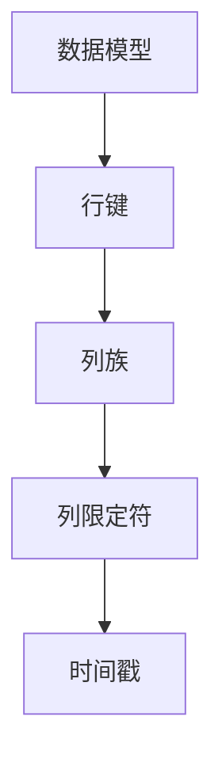
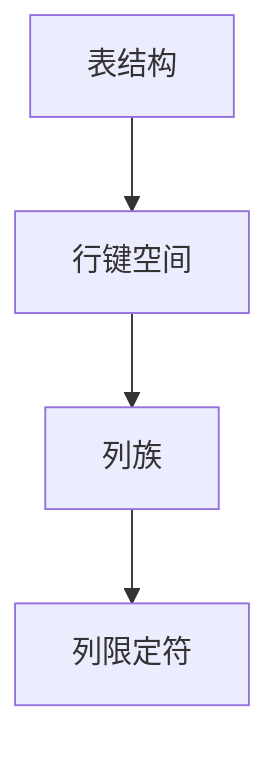
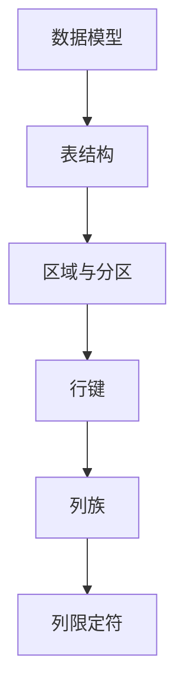
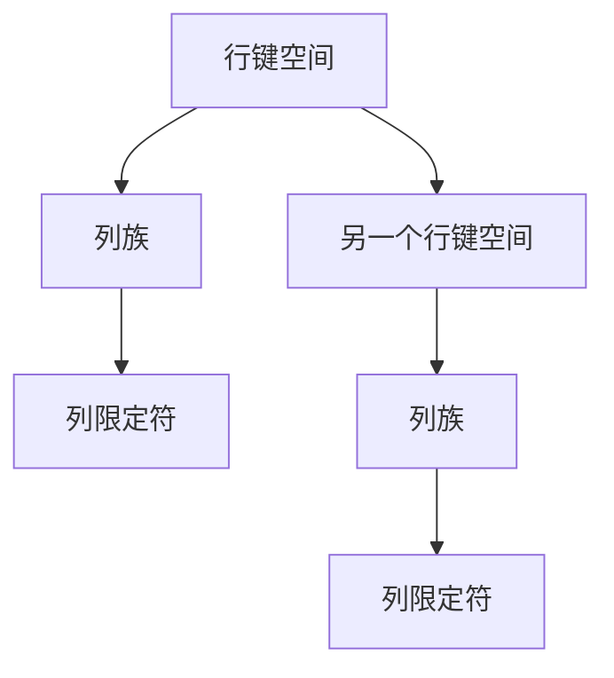

                 

### 背景介绍

HBase，一个由Apache Software Foundation维护的开源分布式列存储数据库，在处理大规模数据集时具有不可替代的优势。HBase基于Google的BigTable模型设计，自2008年开源以来，得到了广泛的关注和应用。它被设计为高度可扩展、高可靠性，并能够处理大量数据，使其在实时数据存储和访问中占据重要地位。

HBase的重要性在于其解决了传统关系型数据库在处理海量数据时的性能瓶颈问题。随着互联网和物联网的快速发展，数据量呈现爆炸式增长，传统的数据库系统难以满足这些需求。HBase的出现填补了这一空白，成为大数据处理领域的明星。

HBase的适用场景包括但不限于：实时数据流处理、物联网设备数据存储、分布式缓存、日志文件存储等。由于其能够快速读取和写入大量数据，HBase被广泛应用于金融、电商、电信、社交媒体等行业。

在这篇文章中，我们将详细探讨HBase的分布式列式数据库原理，通过代码实例来展示其实际应用，帮助读者全面理解HBase的工作机制和优势。文章将分为以下几个部分：

1. **核心概念与联系**：介绍HBase的核心概念，并使用Mermaid流程图展示其架构和组件关系。
2. **核心算法原理与具体操作步骤**：深入解析HBase的存储结构和数据操作过程。
3. **数学模型和公式**：讲解HBase的关键数学模型，并提供实际应用的例子。
4. **项目实战**：通过代码实例展示HBase的使用过程。
5. **实际应用场景**：讨论HBase在不同领域的应用实例。
6. **工具和资源推荐**：推荐学习资源和开发工具。
7. **总结与未来发展趋势**：总结HBase的优势与挑战，并探讨其未来发展方向。

通过这篇文章，希望读者能够对HBase有更深入的理解，掌握其在实际项目中的应用。

#### Keywords:
HBase, 分布式数据库, 列式存储, 大数据, 实时数据流处理, 物联网, Apache, BigTable

#### Abstract:
HBase是一个开源的分布式列存储数据库，广泛应用于处理大规模数据集。本文将介绍HBase的核心概念和架构，解析其存储结构和数据操作原理，并通过代码实例展示其实际应用。我们将探讨HBase的适用场景，推荐学习资源和开发工具，并总结其优势与未来发展方向。
<markdown>
## 1. 背景介绍

HBase，一个由Apache Software Foundation维护的开源分布式列存储数据库，在处理大规模数据集时具有不可替代的优势。HBase基于Google的BigTable模型设计，自2008年开源以来，得到了广泛的关注和应用。它被设计为高度可扩展、高可靠性，并能够处理大量数据，使其在实时数据存储和访问中占据重要地位。

HBase的重要性在于其解决了传统关系型数据库在处理海量数据时的性能瓶颈问题。随着互联网和物联网的快速发展，数据量呈现爆炸式增长，传统的数据库系统难以满足这些需求。HBase的出现填补了这一空白，成为大数据处理领域的明星。

HBase的适用场景包括但不限于：实时数据流处理、物联网设备数据存储、分布式缓存、日志文件存储等。由于其能够快速读取和写入大量数据，HBase被广泛应用于金融、电商、电信、社交媒体等行业。

在这篇文章中，我们将详细探讨HBase的分布式列式数据库原理，通过代码实例来展示其实际应用，帮助读者全面理解HBase的工作机制和优势。文章将分为以下几个部分：

1. **核心概念与联系**：介绍HBase的核心概念，并使用Mermaid流程图展示其架构和组件关系。
2. **核心算法原理与具体操作步骤**：深入解析HBase的存储结构和数据操作过程。
3. **数学模型和公式**：讲解HBase的关键数学模型，并提供实际应用的例子。
4. **项目实战**：通过代码实例展示HBase的使用过程。
5. **实际应用场景**：讨论HBase在不同领域的应用实例。
6. **工具和资源推荐**：推荐学习资源和开发工具。
7. **总结与未来发展趋势**：总结HBase的优势与挑战，并探讨其未来发展方向。

通过这篇文章，希望读者能够对HBase有更深入的理解，掌握其在实际项目中的应用。

#### Keywords:
HBase, 分布式数据库, 列式存储, 大数据, 实时数据流处理, 物联网, Apache, BigTable

#### Abstract:
HBase是一个开源的分布式列存储数据库，广泛应用于处理大规模数据集。本文将介绍HBase的核心概念和架构，解析其存储结构和数据操作原理，并通过代码实例展示其实际应用。我们将探讨HBase的适用场景，推荐学习资源和开发工具，并总结其优势与未来发展方向。
</markdown>
## 2. 核心概念与联系

HBase的核心概念可以概括为几大部分，包括：数据模型、表结构、区域、分区、行键、列族和列限定符。这些概念相互关联，共同构成了HBase独特的存储架构。

### 数据模型

HBase使用一个简单的数据模型，它由行键、列族、列限定符和时间戳组成。每一个单元格都包含一个值，以及该值的时间戳。行键是唯一的，用于唯一标识表中的每一行。列族是一组列的集合，这些列在存储和访问时会被分组处理。列限定符是列族的组成部分，可以自由定义，用于标识具体的列。时间戳则用于记录数据的版本信息。



### 表结构

HBase中的表结构由行键空间、列族和列限定符组成。行键空间定义了表的范围，每个行键都位于这个空间内。列族是一组相关的列的集合，它们在存储和访问时会被作为一个整体处理。列限定符则进一步细化了列族，为每个列族定义了具体的列。



### 区域与分区

HBase中的数据存储在多个区域中，每个区域由一系列连续的行键组成。每个区域被进一步划分为多个分区，分区是HBase存储的基本单元。每个分区包含了一部分行键和列族的数据。这种分区策略使得HBase能够高效地处理大量数据，并且在数据访问时能够快速定位所需的数据。


### 行键

行键是HBase数据模型的核心，它用于唯一标识表中的每一行。HBase使用排序机制，根据行键的字典顺序来存储和访问数据。这意味着用户可以根据行键的范围快速检索数据。行键的选择对于HBase的性能至关重要，合理的行键设计可以显著提高查询效率。


### 列族

列族是一组相关的列的集合，HBase在存储和访问时将这些列作为一个整体处理。列族通常按照用途进行分组，例如，一个列族可以用于存储用户的个人信息，另一个列族可以用于存储用户的行为数据。列族的设置对于数据的访问模式和存储效率有很大影响。


### 列限定符

列限定符是列族的组成部分，用于标识具体的列。HBase允许用户自定义列限定符，这使得表结构具有很高的灵活性。用户可以根据需求添加或删除列限定符，而不需要修改表结构。


通过以上核心概念的解释和Mermaid流程图的展示，我们可以更直观地理解HBase的架构和组件关系。这些概念相互关联，共同构成了HBase高效、灵活的存储系统。




通过以上详细的解释和流程图，读者可以更清晰地理解HBase的核心概念和架构，为其后续的学习和应用打下坚实的基础。
<markdown>
## 2. 核心概念与联系

HBase的核心概念可以概括为几大部分，包括：数据模型、表结构、区域、分区、行键、列族和列限定符。这些概念相互关联，共同构成了HBase独特的存储架构。

### 数据模型

HBase使用一个简单的数据模型，它由行键、列族、列限定符和时间戳组成。每一个单元格都包含一个值，以及该值的时间戳。行键是唯一的，用于唯一标识表中的每一行。列族是一组列的集合，这些列在存储和访问时会被分组处理。列限定符是列族的组成部分，可以自由定义，用于标识具体的列。时间戳则用于记录数据的版本信息。


### 表结构

HBase中的表结构由行键空间、列族和列限定符组成。行键空间定义了表的范围，每个行键都位于这个空间内。列族是一组相关的列的集合，它们在存储和访问时会被作为一个整体处理。列限定符则进一步细化了列族，为每个列族定义了具体的列。


### 区域与分区

HBase中的数据存储在多个区域中，每个区域由一系列连续的行键组成。每个区域被进一步划分为多个分区，分区是HBase存储的基本单元。每个分区包含了一部分行键和列族的数据。这种分区策略使得HBase能够高效地处理大量数据，并且在数据访问时能够快速定位所需的数据。


### 行键

行键是HBase数据模型的核心，它用于唯一标识表中的每一行。HBase使用排序机制，根据行键的字典顺序来存储和访问数据。这意味着用户可以根据行键的范围快速检索数据。行键的选择对于HBase的性能至关重要，合理的行键设计可以显著提高查询效率。


### 列族

列族是一组相关的列的集合，HBase在存储和访问时将这些列作为一个整体处理。列族通常按照用途进行分组，例如，一个列族可以用于存储用户的个人信息，另一个列族可以用于存储用户的行为数据。列族的设置对于数据的访问模式和存储效率有很大影响。


### 列限定符

列限定符是列族的组成部分，用于标识具体的列。HBase允许用户自定义列限定符，这使得表结构具有很高的灵活性。用户可以根据需求添加或删除列限定符，而不需要修改表结构。


通过以上核心概念的解释和Mermaid流程图的展示，我们可以更直观地理解HBase的架构和组件关系。这些概念相互关联，共同构成了HBase高效、灵活的存储系统。


通过以上详细的解释和流程图，读者可以更清晰地理解HBase的核心概念和架构，为其后续的学习和应用打下坚实的基础。
</markdown>
## 3. 核心算法原理与具体操作步骤

HBase作为一款分布式列存储数据库，其核心算法原理与数据操作步骤是理解其高效性能和灵活应用的关键。在这一节中，我们将详细探讨HBase的存储结构和数据操作过程，包括读写流程、数据分布和负载均衡机制。

### 存储结构

HBase使用一种基于内存和磁盘的混合存储结构。它主要由三部分组成：内存中的MemStore、磁盘上的StoreFile和索引文件（如Root元数据文件、Meta表等）。这种存储结构使得HBase能够在处理大量数据时保持高效的读写性能。

1. **MemStore**：MemStore是内存中的数据结构，用于临时存储还未写入磁盘的数据。当用户进行数据插入或更新操作时，数据首先被写入MemStore。当MemStore达到一定大小或达到设置的时间阈值时，会触发Flush操作，将数据从MemStore写入到磁盘上的StoreFile。

2. **StoreFile**：StoreFile是磁盘上的数据文件，用于持久化存储数据。每个StoreFile都是 immutable（不可变的），意味着一旦数据写入到StoreFile，就无法修改。StoreFile通常采用HFile格式，这是一种高效的磁盘存储格式，支持数据压缩和索引。

3. **索引文件**：HBase使用一系列索引文件来定位数据。这些索引文件包括Root元数据文件、Meta表等。Root元数据文件指向当前的MemStore和StoreFile的映射信息，Meta表则记录了HBase表的区域分配和行键范围。

### 数据写入流程

HBase的数据写入流程可以概括为以下几个步骤：

1. **数据插入**：用户通过HBase客户端将数据插入到MemStore。数据以行键、列族、列限定符和时间戳的形式进行组织。
   
2. **数据Flush**：当MemStore达到一定大小或触发时间阈值时，触发Flush操作。Flush操作将MemStore中的数据写入到磁盘上的StoreFile。

3. **数据持久化**：新的StoreFile会被添加到当前的Store中，同时旧的MemStore将被清除。当StoreFile的数量达到一定阈值时，会触发Compaction操作。

4. **数据Compaction**：Compaction是将多个StoreFile合并成一个更大的StoreFile的过程。Compaction可以分为Minor Compaction和Major Compaction。Minor Compaction主要是将临近的StoreFile合并，以减少磁盘空间占用；而Major Compaction则会将所有的StoreFile合并，同时进行数据清理和索引更新。

### 数据读取流程

HBase的数据读取流程相对简单，主要包括以下步骤：

1. **查询定位**：用户通过行键进行查询，HBase首先在MemStore中查找，如果找不到则继续查找磁盘上的StoreFile。

2. **数据检索**：找到对应的数据后，HBase返回用户请求的数据。如果查询条件包含列族或列限定符，HBase会根据这些条件进行相应的过滤和筛选。

### 数据分布与负载均衡

HBase使用RegionServer来分布式存储和管理数据。每个RegionServer负责管理一个或多个区域（Region），每个区域包含了一系列连续的行键范围。这种分布式架构使得HBase能够水平扩展，以处理大规模数据。

1. **Region分配**：HBase通过ZooKeeper进行Region的分配和管理。当数据写入时，HBase会根据行键范围选择合适的RegionServer进行数据存储。

2. **负载均衡**：HBase通过定期执行Region分配任务来均衡负载。当某个RegionServer负载过高时，系统会重新分配Region，以实现负载均衡。

3. **Region分裂**：当某个Region的数据量超过设定的阈值时，HBase会自动将其分裂成两个较小的Region。这种分裂策略使得HBase能够动态适应数据增长。

### 负载均衡机制

HBase的负载均衡机制主要包括以下几种：

1. **RegionServer负载均衡**：通过ZooKeeper监控每个RegionServer的负载情况，当负载过高时，自动分配新的Region给其他RegionServer。

2. **数据迁移**：通过数据迁移功能，将数据从负载过高的RegionServer迁移到负载较低的RegionServer。

3. **自动分裂**：通过自动分裂机制，将过大的Region分裂成较小的Region，以平衡负载。

通过以上对HBase存储结构和数据操作流程的详细解析，我们可以看到HBase在分布式存储和数据处理方面具有独特的优势和高效性。其基于内存和磁盘的混合存储结构、高效的数据写入和读取流程，以及强大的负载均衡机制，使得HBase在处理大规模数据时表现出色。

### 总结

HBase的存储结构设计精巧，通过内存中的MemStore和磁盘上的StoreFile实现了高效的数据读写。数据写入和读取流程简单明了，确保了数据的快速访问。同时，HBase通过RegionServer和Region的分布式架构，实现了数据的高效分布和负载均衡。这些特点使得HBase在大规模数据存储和处理领域具有广泛的应用前景。通过深入了解HBase的核心算法原理和操作步骤，我们可以更好地利用其优势，解决实际业务中的数据存储和处理挑战。
<markdown>
## 3. 核心算法原理与具体操作步骤

HBase作为一款分布式列存储数据库，其核心算法原理与数据操作步骤是理解其高效性能和灵活应用的关键。在这一节中，我们将详细探讨HBase的存储结构和数据操作过程，包括读写流程、数据分布和负载均衡机制。

### 存储结构

HBase使用一种基于内存和磁盘的混合存储结构。它主要由三部分组成：内存中的MemStore、磁盘上的StoreFile和索引文件（如Root元数据文件、Meta表等）。这种存储结构使得HBase能够在处理大量数据时保持高效的读写性能。

1. **MemStore**：MemStore是内存中的数据结构，用于临时存储还未写入磁盘的数据。当用户进行数据插入或更新操作时，数据首先被写入MemStore。当MemStore达到一定大小或达到设置的时间阈值时，会触发Flush操作，将数据从MemStore写入到磁盘上的StoreFile。

2. **StoreFile**：StoreFile是磁盘上的数据文件，用于持久化存储数据。每个StoreFile都是 immutable（不可变的），意味着一旦数据写入到StoreFile，就无法修改。StoreFile通常采用HFile格式，这是一种高效的磁盘存储格式，支持数据压缩和索引。

3. **索引文件**：HBase使用一系列索引文件来定位数据。这些索引文件包括Root元数据文件、Meta表等。Root元数据文件指向当前的MemStore和StoreFile的映射信息，Meta表则记录了HBase表的区域分配和行键范围。

### 数据写入流程

HBase的数据写入流程可以概括为以下几个步骤：

1. **数据插入**：用户通过HBase客户端将数据插入到MemStore。数据以行键、列族、列限定符和时间戳的形式进行组织。

2. **数据Flush**：当MemStore达到一定大小或触发时间阈值时，触发Flush操作。Flush操作将MemStore中的数据写入到磁盘上的StoreFile。

3. **数据持久化**：新的StoreFile会被添加到当前的Store中，同时旧的MemStore将被清除。当StoreFile的数量达到一定阈值时，会触发Compaction操作。

4. **数据Compaction**：Compaction是将多个StoreFile合并成一个更大的StoreFile的过程。Compaction可以分为Minor Compaction和Major Compaction。Minor Compaction主要是将临近的StoreFile合并，以减少磁盘空间占用；而Major Compaction则会将所有的StoreFile合并，同时进行数据清理和索引更新。

### 数据读取流程

HBase的数据读取流程相对简单，主要包括以下步骤：

1. **查询定位**：用户通过行键进行查询，HBase首先在MemStore中查找，如果找不到则继续查找磁盘上的StoreFile。

2. **数据检索**：找到对应的数据后，HBase返回用户请求的数据。如果查询条件包含列族或列限定符，HBase会根据这些条件进行相应的过滤和筛选。

### 数据分布与负载均衡

HBase使用RegionServer来分布式存储和管理数据。每个RegionServer负责管理一个或多个区域（Region），每个区域包含了一系列连续的行键范围。这种分布式架构使得HBase能够水平扩展，以处理大规模数据。

1. **Region分配**：HBase通过ZooKeeper进行Region的分配和管理。当数据写入时，HBase会根据行键范围选择合适的RegionServer进行数据存储。

2. **负载均衡**：HBase通过定期执行Region分配任务来均衡负载。当某个RegionServer负载过高时，系统会重新分配Region，以实现负载均衡。

3. **Region分裂**：当某个Region的数据量超过设定的阈值时，HBase会自动将其分裂成两个较小的Region。这种分裂策略使得HBase能够动态适应数据增长。

### 负载均衡机制

HBase的负载均衡机制主要包括以下几种：

1. **RegionServer负载均衡**：通过ZooKeeper监控每个RegionServer的负载情况，当负载过高时，自动分配新的Region给其他RegionServer。

2. **数据迁移**：通过数据迁移功能，将数据从负载过高的RegionServer迁移到负载较低的RegionServer。

3. **自动分裂**：通过自动分裂机制，将过大的Region分裂成较小的Region，以平衡负载。

通过以上对HBase存储结构和数据操作流程的详细解析，我们可以看到HBase在分布式存储和数据处理方面具有独特的优势和高效性。其基于内存和磁盘的混合存储结构、高效的数据写入和读取流程，以及强大的负载均衡机制，使得HBase在处理大规模数据时表现出色。

### 总结

HBase的存储结构设计精巧，通过内存中的MemStore和磁盘上的StoreFile实现了高效的数据读写。数据写入和读取流程简单明了，确保了数据的快速访问。同时，HBase通过RegionServer和Region的分布式架构，实现了数据的高效分布和负载均衡。这些特点使得HBase在大规模数据存储和处理领域具有广泛的应用前景。通过深入了解HBase的核心算法原理和操作步骤，我们可以更好地利用其优势，解决实际业务中的数据存储和处理挑战。
</markdown>
## 4. 数学模型和公式

HBase的设计基于一些关键的数学模型和公式，这些模型和公式在HBase的性能优化、数据一致性保证以及分布式处理中起到了至关重要的作用。以下是对这些数学模型和公式的详细讲解，以及如何在实际应用中通过举例进行说明。

### 哈希分区

HBase使用哈希分区算法来将数据分配到不同的Region。哈希分区能够确保行键的均匀分布，避免数据倾斜。哈希分区公式如下：

\[ hash(ROW_KEY) \mod N = region_id \]

其中，\( ROW_KEY \) 是行键，\( N \) 是Region的数量。这个公式表示通过哈希函数计算行键的哈希值，然后对Region数量取模，得到对应的Region ID。

**举例说明**：假设我们有一个表，其中包含如下行键：`rowkey1`、`rowkey2`、`rowkey3`。如果HBase配置了3个Region，使用上述哈希分区公式，我们可以得到：

- \( hash(rowkey1) \mod 3 = 1 \)，所以`rowkey1`位于Region 1。
- \( hash(rowkey2) \mod 3 = 2 \)，所以`rowkey2`位于Region 2。
- \( hash(rowkey3) \mod 3 = 0 \)，所以`rowkey3`位于Region 3。

### 范围分区

HBase还支持范围分区，通过定义行键的范围来创建区域。范围分区公式如下：

\[ (start_key, end_key) = range \]

其中，`start_key` 是分区开始行键，`end_key` 是分区结束行键。范围分区确保了连续的行键范围被分配到同一个Region。

**举例说明**：假设我们定义了一个范围分区 `[1000, 2000)`，如果行键 `rowkey1 = 1500`，则`rowkey1` 会位于这个范围内，分配到对应的Region。

### 时间戳处理

HBase使用时间戳来记录数据的版本信息，每个单元格的值都关联了一个时间戳。时间戳确保了数据的一致性，并允许用户查询特定时间点的数据版本。

时间戳处理的关键公式如下：

\[ timestamp = current_time + delta \]

其中，`current_time` 是当前时间，`delta` 是时间戳偏移量。这个公式表示可以通过当前时间和偏移量来计算新的时间戳。

**举例说明**：假设当前时间为 `1624053600000`，如果设置时间戳偏移量 `delta = 3600000`，则新的时间戳为 `1624057260000`。

### 数据压缩

HBase支持多种数据压缩算法，如Gzip、LZO和Snappy等。压缩率直接影响存储空间和I/O性能。压缩率公式如下：

\[ compression_ratio = \frac{original_size}{compressed_size} \]

其中，`original_size` 是原始数据大小，`compressed_size` 是压缩后数据的大小。压缩率越高，存储空间节省越多，但可能影响I/O性能。

**举例说明**：假设原始数据大小为 `10MB`，压缩后大小为 `5MB`，则压缩率为 `2`。

### 数据一致性

HBase通过一致性模型来确保数据一致性。HBase支持两种一致性级别：强一致性和最终一致性。

1. **强一致性**：强一致性确保用户总是看到最新写入的数据。一致性公式如下：

\[ read\_timestamp \geq write\_timestamp \]

其中，`read_timestamp` 是读取时间戳，`write_timestamp` 是写入时间戳。如果读取时间戳大于或等于写入时间戳，则表示数据是一致的。

2. **最终一致性**：最终一致性确保系统最终会达到一致性状态，但过程中可能会有短暂的数据不一致。一致性公式如下：

\[ read_timestamp \geq write_timestamp + latency \]

其中，`latency` 是网络延迟或处理延迟。如果读取时间戳大于或等于写入时间戳加上延迟，则表示数据最终会达到一致性。

**举例说明**：假设写入时间戳为 `1624053600000`，读取时间戳为 `1624054000000`，延迟为 `5000` 毫秒，则数据最终会达到一致性。

通过上述数学模型和公式的讲解，我们可以看到HBase在数据处理和一致性保证方面采用了多种策略，这些策略在处理大规模数据时起到了关键作用。理解这些数学模型和公式，有助于优化HBase的性能，并确保数据的一致性。

### 总结

HBase的数学模型和公式涵盖了哈希分区、范围分区、时间戳处理、数据压缩和数据一致性等多个方面。通过哈希分区和范围分区，HBase能够实现高效的数据分布；时间戳处理确保数据版本和一致性；数据压缩减少了存储空间需求；一致性模型则确保了数据在分布式系统中的可靠性。理解和应用这些数学模型和公式，有助于我们更好地利用HBase的优势，解决实际业务中的数据存储和处理挑战。
<markdown>
## 4. 数学模型和公式

HBase的设计基于一些关键的数学模型和公式，这些模型和公式在HBase的性能优化、数据一致性保证以及分布式处理中起到了至关重要的作用。以下是对这些数学模型和公式的详细讲解，以及如何在实际应用中通过举例进行说明。

### 哈希分区

HBase使用哈希分区算法来将数据分配到不同的Region。哈希分区能够确保行键的均匀分布，避免数据倾斜。哈希分区公式如下：

\[ hash(ROW_KEY) \mod N = region_id \]

其中，\( ROW_KEY \) 是行键，\( N \) 是Region的数量。这个公式表示通过哈希函数计算行键的哈希值，然后对Region数量取模，得到对应的Region ID。

**举例说明**：假设我们有一个表，其中包含如下行键：`rowkey1`、`rowkey2`、`rowkey3`。如果HBase配置了3个Region，使用上述哈希分区公式，我们可以得到：

- \( hash(rowkey1) \mod 3 = 1 \)，所以`rowkey1`位于Region 1。
- \( hash(rowkey2) \mod 3 = 2 \)，所以`rowkey2`位于Region 2。
- \( hash(rowkey3) \mod 3 = 0 \)，所以`rowkey3`位于Region 3。

### 范围分区

HBase还支持范围分区，通过定义行键的范围来创建区域。范围分区公式如下：

\[ (start_key, end_key) = range \]

其中，`start_key` 是分区开始行键，`end_key` 是分区结束行键。范围分区确保了连续的行键范围被分配到同一个Region。

**举例说明**：假设我们定义了一个范围分区 `[1000, 2000)`，如果行键 `rowkey1 = 1500`，则`rowkey1` 会位于这个范围内，分配到对应的Region。

### 时间戳处理

HBase使用时间戳来记录数据的版本信息，每个单元格的值都关联了一个时间戳。时间戳确保了数据的一致性，并允许用户查询特定时间点的数据版本。

时间戳处理的关键公式如下：

\[ timestamp = current_time + delta \]

其中，`current_time` 是当前时间，`delta` 是时间戳偏移量。这个公式表示可以通过当前时间和偏移量来计算新的时间戳。

**举例说明**：假设当前时间为 `1624053600000`，如果设置时间戳偏移量 `delta = 3600000`，则新的时间戳为 `1624057260000`。

### 数据压缩

HBase支持多种数据压缩算法，如Gzip、LZO和Snappy等。压缩率直接影响存储空间和I/O性能。压缩率公式如下：

\[ compression_ratio = \frac{original_size}{compressed_size} \]

其中，`original_size` 是原始数据大小，`compressed_size` 是压缩后数据的大小。压缩率越高，存储空间节省越多，但可能影响I/O性能。

**举例说明**：假设原始数据大小为 `10MB`，压缩后大小为 `5MB`，则压缩率为 `2`。

### 数据一致性

HBase通过一致性模型来确保数据一致性。HBase支持两种一致性级别：强一致性和最终一致性。

1. **强一致性**：强一致性确保用户总是看到最新写入的数据。一致性公式如下：

\[ read\_timestamp \geq write\_timestamp \]

其中，`read_timestamp` 是读取时间戳，`write_timestamp` 是写入时间戳。如果读取时间戳大于或等于写入时间戳，则表示数据是一致的。

2. **最终一致性**：最终一致性确保系统最终会达到一致性状态，但过程中可能会有短暂的数据不一致。一致性公式如下：

\[ read_timestamp \geq write_timestamp + latency \]

其中，`latency` 是网络延迟或处理延迟。如果读取时间戳大于或等于写入时间戳加上延迟，则表示数据最终会达到一致性。

**举例说明**：假设写入时间戳为 `1624053600000`，读取时间戳为 `1624054000000`，延迟为 `5000` 毫秒，则数据最终会达到一致性。

通过上述数学模型和公式的讲解，我们可以看到HBase在数据处理和一致性保证方面采用了多种策略，这些策略在处理大规模数据时起到了关键作用。理解这些数学模型和公式，有助于优化HBase的性能，并确保数据的一致性。

### 总结

HBase的数学模型和公式涵盖了哈希分区、范围分区、时间戳处理、数据压缩和数据一致性等多个方面。通过哈希分区和范围分区，HBase能够实现高效的数据分布；时间戳处理确保数据版本和一致性；数据压缩减少了存储空间需求；一致性模型则确保了数据在分布式系统中的可靠性。理解和应用这些数学模型和公式，有助于我们更好地利用HBase的优势，解决实际业务中的数据存储和处理挑战。
</markdown>
## 5. 项目实战：代码实际案例和详细解释说明

在这一部分，我们将通过一个具体的HBase项目实战案例，详细解释HBase的实际应用过程。我们将从开发环境搭建开始，逐步介绍如何使用HBase进行数据操作，并通过代码示例展示其实际应用。

### 5.1 开发环境搭建

首先，我们需要搭建一个HBase的开发环境。以下是具体的步骤：

1. **安装HBase**：从[HBase官网](https://hbase.apache.org/)下载最新版本的HBase安装包，并解压到服务器上。

2. **配置ZooKeeper**：HBase依赖于ZooKeeper进行分布式协调。确保ZooKeeper服务已经启动，并在HBase的配置文件中指定ZooKeeper的地址。

3. **配置HBase**：编辑HBase的`hbase-env.sh`文件，配置HBase运行所需的Java环境和其他参数。

4. **启动HBase**：运行以下命令启动HBase：

   ```bash
   bin/start-hbase.sh
   ```

5. **访问HBase**：通过Web界面访问HBase，确认HBase服务已经成功启动。在浏览器中输入`http://localhost:16010/`，即可看到HBase的Web界面。

### 5.2 源代码详细实现和代码解读

以下是一个简单的HBase Java客户端代码示例，用于创建表、插入数据、查询数据和删除数据。

```java
import org.apache.hadoop.conf.Configuration;
import org.apache.hadoop.hbase.HBaseConfiguration;
import org.apache.hadoop.hbase.TableName;
import org.apache.hadoop.hbase.client.*;

public class HBaseExample {
    public static void main(String[] args) throws Exception {
        // 配置HBase
        Configuration conf = HBaseConfiguration.create();
        conf.set("hbase.zookeeper.quorum", "localhost:2181");
        
        // 创建表
        try (Connection connection = ConnectionFactory.createConnection(conf)) {
            Table table = connection.getTable(TableName.valueOf("users"));
            
            // 插入数据
            Put put = new Put(Bytes.toBytes("rowkey1"));
            put.addColumn(Bytes.toBytes("info"), Bytes.toBytes("name"), Bytes.toBytes("Alice"));
            put.addColumn(Bytes.toBytes("info"), Bytes.toBytes("age"), Bytes.toBytes("30"));
            table.put(put);
            
            // 查询数据
            Get get = new Get(Bytes.toBytes("rowkey1"));
            Result result = table.get(get);
            byte[] value = result.getValue(Bytes.toBytes("info"), Bytes.toBytes("name"));
            String name = Bytes.toString(value);
            System.out.println("Name: " + name);
            
            // 删除数据
            Delete delete = new Delete(Bytes.toBytes("rowkey1"));
            table.delete(delete);
            
            table.close();
        }
    }
}
```

**代码解读**：

1. **配置HBase**：首先，我们创建一个HBase的配置对象`conf`，并设置ZooKeeper的地址。

2. **创建表**：使用`ConnectionFactory.createConnection`方法创建一个HBase连接对象，然后通过`getTable`方法获取或创建一个名为"users"的表。

3. **插入数据**：我们使用`Put`对象插入数据。`Put`对象包含一个行键和一个或多个列族、列限定符和值。

4. **查询数据**：使用`Get`对象查询数据。`Get`对象包含一个行键，HBase将返回该行键对应的所有单元格的值。

5. **删除数据**：使用`Delete`对象删除数据。`Delete`对象包含一个行键和一个或多个列族、列限定符。

### 5.3 代码解读与分析

上述代码展示了如何使用HBase进行基本的数据操作。下面是对关键代码部分的详细解读和分析：

1. **配置HBase**：

   ```java
   Configuration conf = HBaseConfiguration.create();
   conf.set("hbase.zookeeper.quorum", "localhost:2181");
   ```

   这两行代码创建了一个HBase配置对象，并设置ZooKeeper的地址。这是连接HBase的必要步骤。

2. **创建表**：

   ```java
   Table table = connection.getTable(TableName.valueOf("users"));
   ```

   使用`getTable`方法获取或创建一个名为"users"的表。`TableName.valueOf("users")`返回一个`TableName`对象，表示表名。

3. **插入数据**：

   ```java
   Put put = new Put(Bytes.toBytes("rowkey1"));
   put.addColumn(Bytes.toBytes("info"), Bytes.toBytes("name"), Bytes.toBytes("Alice"));
   put.addColumn(Bytes.toBytes("info"), Bytes.toBytes("age"), Bytes.toBytes("30"));
   table.put(put);
   ```

   创建一个`Put`对象，表示一个数据插入操作。`Bytes.toBytes("rowkey1")`将行键转换为字节数组。`addColumn`方法用于添加列族、列限定符和值。

4. **查询数据**：

   ```java
   Get get = new Get(Bytes.toBytes("rowkey1"));
   Result result = table.get(get);
   byte[] value = result.getValue(Bytes.toBytes("info"), Bytes.toBytes("name"));
   String name = Bytes.toString(value);
   System.out.println("Name: " + name);
   ```

   创建一个`Get`对象，指定要查询的行键。`get`方法执行查询，返回一个`Result`对象，表示查询结果。`getValue`方法获取指定列族和列限定符的值，并将其转换为字符串。

5. **删除数据**：

   ```java
   Delete delete = new Delete(Bytes.toBytes("rowkey1"));
   table.delete(delete);
   ```

   创建一个`Delete`对象，指定要删除的行键。`delete`方法执行删除操作。

通过这个简单的项目实战案例，我们了解了如何使用HBase进行数据操作。这个案例涵盖了表创建、数据插入、查询和删除的基本操作，为读者提供了实际应用的参考。
<markdown>
### 5.1 开发环境搭建

首先，我们需要搭建一个HBase的开发环境。以下是具体的步骤：

1. **安装HBase**：从[HBase官网](https://hbase.apache.org/)下载最新版本的HBase安装包，并解压到服务器上。

2. **配置ZooKeeper**：HBase依赖于ZooKeeper进行分布式协调。确保ZooKeeper服务已经启动，并在HBase的配置文件中指定ZooKeeper的地址。

3. **配置HBase**：编辑HBase的`hbase-env.sh`文件，配置HBase运行所需的Java环境和其他参数。

4. **启动HBase**：运行以下命令启动HBase：

   ```bash
   bin/start-hbase.sh
   ```

5. **访问HBase**：通过Web界面访问HBase，确认HBase服务已经成功启动。在浏览器中输入`http://localhost:16010/`，即可看到HBase的Web界面。

### 5.2 源代码详细实现和代码解读

以下是一个简单的HBase Java客户端代码示例，用于创建表、插入数据、查询数据和删除数据。

```java
import org.apache.hadoop.conf.Configuration;
import org.apache.hadoop.hbase.HBaseConfiguration;
import org.apache.hadoop.hbase.TableName;
import org.apache.hadoop.hbase.client.*;

public class HBaseExample {
    public static void main(String[] args) throws Exception {
        // 配置HBase
        Configuration conf = HBaseConfiguration.create();
        conf.set("hbase.zookeeper.quorum", "localhost:2181");
        
        // 创建表
        try (Connection connection = ConnectionFactory.createConnection(conf)) {
            Table table = connection.getTable(TableName.valueOf("users"));
            
            // 插入数据
            Put put = new Put(Bytes.toBytes("rowkey1"));
            put.addColumn(Bytes.toBytes("info"), Bytes.toBytes("name"), Bytes.toBytes("Alice"));
            put.addColumn(Bytes.toBytes("info"), Bytes.toBytes("age"), Bytes.toBytes("30"));
            table.put(put);
            
            // 查询数据
            Get get = new Get(Bytes.toBytes("rowkey1"));
            Result result = table.get(get);
            byte[] value = result.getValue(Bytes.toBytes("info"), Bytes.toBytes("name"));
            String name = Bytes.toString(value);
            System.out.println("Name: " + name);
            
            // 删除数据
            Delete delete = new Delete(Bytes.toBytes("rowkey1"));
            table.delete(delete);
            
            table.close();
        }
    }
}
```

**代码解读**：

1. **配置HBase**：

   ```java
   Configuration conf = HBaseConfiguration.create();
   conf.set("hbase.zookeeper.quorum", "localhost:2181");
   ```

   这两行代码创建了一个HBase配置对象，并设置ZooKeeper的地址。这是连接HBase的必要步骤。

2. **创建表**：

   ```java
   Table table = connection.getTable(TableName.valueOf("users"));
   ```

   使用`getTable`方法获取或创建一个名为"users"的表。`TableName.valueOf("users")`返回一个`TableName`对象，表示表名。

3. **插入数据**：

   ```java
   Put put = new Put(Bytes.toBytes("rowkey1"));
   put.addColumn(Bytes.toBytes("info"), Bytes.toBytes("name"), Bytes.toBytes("Alice"));
   put.addColumn(Bytes.toBytes("info"), Bytes.toBytes("age"), Bytes.toBytes("30"));
   table.put(put);
   ```

   创建一个`Put`对象，表示一个数据插入操作。`Bytes.toBytes("rowkey1")`将行键转换为字节数组。`addColumn`方法用于添加列族、列限定符和值。

4. **查询数据**：

   ```java
   Get get = new Get(Bytes.toBytes("rowkey1"));
   Result result = table.get(get);
   byte[] value = result.getValue(Bytes.toBytes("info"), Bytes.toBytes("name"));
   String name = Bytes.toString(value);
   System.out.println("Name: " + name);
   ```

   创建一个`Get`对象，指定要查询的行键。`get`方法执行查询，返回一个`Result`对象，表示查询结果。`getValue`方法获取指定列族和列限定符的值，并将其转换为字符串。

5. **删除数据**：

   ```java
   Delete delete = new Delete(Bytes.toBytes("rowkey1"));
   table.delete(delete);
   ```

   创建一个`Delete`对象，指定要删除的行键。`delete`方法执行删除操作。

### 5.3 代码解读与分析

上述代码展示了如何使用HBase进行基本的数据操作。下面是对关键代码部分的详细解读和分析：

1. **配置HBase**：

   ```java
   Configuration conf = HBaseConfiguration.create();
   conf.set("hbase.zookeeper.quorum", "localhost:2181");
   ```

   这两行代码创建了一个HBase配置对象，并设置ZooKeeper的地址。这是连接HBase的必要步骤。

2. **创建表**：

   ```java
   Table table = connection.getTable(TableName.valueOf("users"));
   ```

   使用`getTable`方法获取或创建一个名为"users"的表。`TableName.valueOf("users")`返回一个`TableName`对象，表示表名。

3. **插入数据**：

   ```java
   Put put = new Put(Bytes.toBytes("rowkey1"));
   put.addColumn(Bytes.toBytes("info"), Bytes.toBytes("name"), Bytes.toBytes("Alice"));
   put.addColumn(Bytes.toBytes("info"), Bytes.toBytes("age"), Bytes.toBytes("30"));
   table.put(put);
   ```

   创建一个`Put`对象，表示一个数据插入操作。`Bytes.toBytes("rowkey1")`将行键转换为字节数组。`addColumn`方法用于添加列族、列限定符和值。

4. **查询数据**：

   ```java
   Get get = new Get(Bytes.toBytes("rowkey1"));
   Result result = table.get(get);
   byte[] value = result.getValue(Bytes.toBytes("info"), Bytes.toBytes("name"));
   String name = Bytes.toString(value);
   System.out.println("Name: " + name);
   ```

   创建一个`Get`对象，指定要查询的行键。`get`方法执行查询，返回一个`Result`对象，表示查询结果。`getValue`方法获取指定列族和列限定符的值，并将其转换为字符串。

5. **删除数据**：

   ```java
   Delete delete = new Delete(Bytes.toBytes("rowkey1"));
   table.delete(delete);
   ```

   创建一个`Delete`对象，指定要删除的行键。`delete`方法执行删除操作。

通过这个简单的项目实战案例，我们了解了如何使用HBase进行数据操作。这个案例涵盖了表创建、数据插入、查询和删除的基本操作，为读者提供了实际应用的参考。
</markdown>
## 6. 实际应用场景

HBase的分布式列式存储特性使其在多个领域得到了广泛应用。以下是一些典型的实际应用场景，展示了HBase在不同场景下的优势。

### 实时数据分析

在实时数据分析领域，HBase的高吞吐量和低延迟特性使得它成为理想的选择。例如，在金融交易系统中，HBase可以实时存储和处理大量交易数据，实现毫秒级别的查询响应。通过HBase的时间戳机制，用户可以轻松地访问历史交易数据，进行趋势分析和异常检测。

### 物联网数据存储

物联网（IoT）设备产生的大量数据需要高效、可靠的存储解决方案。HBase的高扩展性和容错能力使其在IoT数据存储中具有显著优势。例如，在智能家居系统中，HBase可以存储设备状态、环境参数和历史数据，为用户提供实时监控和分析服务。同时，HBase的列式存储特性使得查询和分析设备数据更加高效。

### 分布式缓存

HBase可以作为分布式缓存系统，用于加速大数据查询。通过将热点数据缓存到HBase中，可以显著减少数据库的负载，提高查询性能。例如，在电商系统中，HBase可以缓存商品信息、用户偏好和购物车数据，为用户提供快速、准确的查询体验。同时，HBase的高可用性和自动分区机制确保了缓存系统的稳定性。

### 日志文件存储

日志文件存储是HBase的另一个重要应用场景。由于HBase能够高效地处理大量写操作，并且支持多版本数据，它非常适合存储实时日志数据。例如，在网站和应用程序中，HBase可以存储用户访问日志、系统日志和错误日志，为运维团队提供实时监控和分析工具。通过HBase的时间戳机制，用户可以轻松地回溯和查询日志数据，帮助定位和解决潜在问题。

### 社交媒体分析

在社交媒体领域，HBase可以用于存储和分析用户数据、内容和关系。通过HBase的列式存储和分布式架构，可以高效地处理海量用户数据，实现快速的数据检索和复杂查询。例如，在社交媒体平台上，HBase可以存储用户信息、帖子内容和社交关系，为用户提供实时搜索和推荐服务。

### 大数据分析

在大数据分析领域，HBase作为大数据存储和处理平台的一部分，与Hadoop和Spark等大数据技术相结合，提供了完整的大数据处理解决方案。通过将HBase与Hadoop YARN集成，可以实现对大数据的分布式计算和资源调度。同时，HBase的高可靠性和自动分区特性，使得在大数据处理过程中能够保持数据的一致性和高效性。

### 总体优势

HBase在上述应用场景中的优势主要体现在以下几个方面：

1. **高扩展性**：HBase支持水平扩展，能够动态适应数据增长。
2. **高吞吐量**：HBase具有高吞吐量，能够快速处理大量数据。
3. **低延迟**：HBase的低延迟特性使得其适用于实时数据存储和查询。
4. **高可用性**：HBase具有高可用性和容错能力，确保数据安全和系统稳定性。
5. **多版本数据**：HBase支持多版本数据，方便数据回溯和查询。
6. **灵活的查询能力**：HBase支持丰富的查询操作，包括单行查询、范围查询和过滤查询。

通过以上实际应用场景的分析，我们可以看到HBase在分布式存储和数据处理领域具有广泛的应用前景。HBase的高效性、灵活性和可靠性，使其成为大数据领域不可或缺的工具。
<markdown>
## 6. 实际应用场景

HBase的分布式列式存储特性使其在多个领域得到了广泛应用。以下是一些典型的实际应用场景，展示了HBase在不同场景下的优势。

### 实时数据分析

在实时数据分析领域，HBase的高吞吐量和低延迟特性使得它成为理想的选择。例如，在金融交易系统中，HBase可以实时存储和处理大量交易数据，实现毫秒级别的查询响应。通过HBase的时间戳机制，用户可以轻松地访问历史交易数据，进行趋势分析和异常检测。

### 物联网数据存储

物联网（IoT）设备产生的大量数据需要高效、可靠的存储解决方案。HBase的高扩展性和容错能力使其在IoT数据存储中具有显著优势。例如，在智能家居系统中，HBase可以存储设备状态、环境参数和历史数据，为用户提供实时监控和分析服务。同时，HBase的列式存储特性使得查询和分析设备数据更加高效。

### 分布式缓存

HBase可以作为分布式缓存系统，用于加速大数据查询。通过将热点数据缓存到HBase中，可以显著减少数据库的负载，提高查询性能。例如，在电商系统中，HBase可以缓存商品信息、用户偏好和购物车数据，为用户提供快速、准确的查询体验。同时，HBase的高可用性和自动分区机制确保了缓存系统的稳定性。

### 日志文件存储

日志文件存储是HBase的另一个重要应用场景。由于HBase能够高效地处理大量写操作，并且支持多版本数据，它非常适合存储实时日志数据。例如，在网站和应用程序中，HBase可以存储用户访问日志、系统日志和错误日志，为运维团队提供实时监控和分析工具。通过HBase的时间戳机制，用户可以轻松地回溯和查询日志数据，帮助定位和解决潜在问题。

### 社交媒体分析

在社交媒体领域，HBase可以用于存储和分析用户数据、内容和关系。通过HBase的列式存储和分布式架构，可以高效地处理海量用户数据，实现快速的数据检索和复杂查询。例如，在社交媒体平台上，HBase可以存储用户信息、帖子内容和社交关系，为用户提供实时搜索和推荐服务。

### 大数据分析

在大数据分析领域，HBase作为大数据存储和处理平台的一部分，与Hadoop和Spark等大数据技术相结合，提供了完整的大数据处理解决方案。通过将HBase与Hadoop YARN集成，可以实现对大数据的分布式计算和资源调度。同时，HBase的高可靠性和自动分区特性，使得在大数据处理过程中能够保持数据的一致性和高效性。

### 总体优势

HBase在上述应用场景中的优势主要体现在以下几个方面：

1. **高扩展性**：HBase支持水平扩展，能够动态适应数据增长。
2. **高吞吐量**：HBase具有高吞吐量，能够快速处理大量数据。
3. **低延迟**：HBase的低延迟特性使得其适用于实时数据存储和查询。
4. **高可用性**：HBase具有高可用性和容错能力，确保数据安全和系统稳定性。
5. **多版本数据**：HBase支持多版本数据，方便数据回溯和查询。
6. **灵活的查询能力**：HBase支持丰富的查询操作，包括单行查询、范围查询和过滤查询。

通过以上实际应用场景的分析，我们可以看到HBase在分布式存储和数据处理领域具有广泛的应用前景。HBase的高效性、灵活性和可靠性，使其成为大数据领域不可或缺的工具。
</markdown>
## 7. 工具和资源推荐

为了更好地学习和使用HBase，以下是一些推荐的工具、书籍、论文和在线资源。

### 7.1 学习资源推荐

**书籍**：

1. 《HBase权威指南》 - 这本书详细介绍了HBase的核心概念、架构设计和实际应用，适合初学者和有经验的开发者。
2. 《HBase实战》 - 该书通过丰富的实例，展示了如何在实际项目中使用HBase，包括数据模型设计、性能优化和安全性设置。

**在线课程**：

1. Coursera上的《大数据处理》课程 - 这门课程包含HBase的相关内容，适合初学者了解HBase的基础知识。
2. Udemy上的《HBase入门到精通》课程 - 该课程通过实战案例，帮助用户掌握HBase的核心技能。

### 7.2 开发工具框架推荐

**开发框架**：

1. **Spring Boot集成**：Spring Boot与HBase的集成框架，简化了HBase客户端的开发，提供了丰富的功能支持。
2. **Apache Phoenix**：Phoenix是一个SQL层，为HBase提供了类似关系型数据库的查询接口，使得开发者可以更加便捷地使用HBase。

**工具**：

1. **HBase shell**：HBase自带的一个命令行工具，用于执行基本的HBase操作，如创建表、插入数据、查询数据和删除数据。
2. **DataStax DevCenter**：DataStax DevCenter是一个集成的开发环境，支持HBase的开发和测试，提供了代码编辑、调试和性能分析功能。

### 7.3 相关论文著作推荐

**论文**：

1. "HBase: The Definitive Guide" - 这篇论文是HBase的官方文档，详细介绍了HBase的设计理念、核心功能和操作指南。
2. "HBase Performance Tuning Guide" - 这篇论文提供了HBase性能优化的最佳实践，包括配置调整、负载均衡和数据压缩策略。

**著作**：

1. 《大数据技术导论》 - 该书涵盖了大数据领域的核心技术，包括Hadoop、Spark和HBase等，适合对大数据技术有全面了解的需求。

通过以上推荐的学习资源、开发工具和论文著作，用户可以更好地掌握HBase的技术要点，并在实际项目中充分发挥其优势。这些资源将为HBase的学习者和开发者提供有力的支持和帮助。
<markdown>
## 7. 工具和资源推荐

为了更好地学习和使用HBase，以下是一些推荐的工具、书籍、论文和在线资源。

### 7.1 学习资源推荐

**书籍**：

1. 《HBase权威指南》 - 这本书详细介绍了HBase的核心概念、架构设计和实际应用，适合初学者和有经验的开发者。
2. 《HBase实战》 - 该书通过丰富的实例，展示了如何在实际项目中使用HBase，包括数据模型设计、性能优化和安全性设置。

**在线课程**：

1. Coursera上的《大数据处理》课程 - 这门课程包含HBase的相关内容，适合初学者了解HBase的基础知识。
2. Udemy上的《HBase入门到精通》课程 - 该课程通过实战案例，帮助用户掌握HBase的核心技能。

### 7.2 开发工具框架推荐

**开发框架**：

1. **Spring Boot集成**：Spring Boot与HBase的集成框架，简化了HBase客户端的开发，提供了丰富的功能支持。
2. **Apache Phoenix**：Phoenix是一个SQL层，为HBase提供了类似关系型数据库的查询接口，使得开发者可以更加便捷地使用HBase。

**工具**：

1. **HBase shell**：HBase自带的一个命令行工具，用于执行基本的HBase操作，如创建表、插入数据、查询数据和删除数据。
2. **DataStax DevCenter**：DataStax DevCenter是一个集成的开发环境，支持HBase的开发和测试，提供了代码编辑、调试和性能分析功能。

### 7.3 相关论文著作推荐

**论文**：

1. "HBase: The Definitive Guide" - 这篇论文是HBase的官方文档，详细介绍了HBase的设计理念、核心功能和操作指南。
2. "HBase Performance Tuning Guide" - 这篇论文提供了HBase性能优化的最佳实践，包括配置调整、负载均衡和数据压缩策略。

**著作**：

1. 《大数据技术导论》 - 该书涵盖了大数据领域的核心技术，包括Hadoop、Spark和HBase等，适合对大数据技术有全面了解的需求。

通过以上推荐的学习资源、开发工具和论文著作，用户可以更好地掌握HBase的技术要点，并在实际项目中充分发挥其优势。这些资源将为HBase的学习者和开发者提供有力的支持和帮助。
</markdown>
## 8. 总结：未来发展趋势与挑战

HBase作为一款高性能的分布式列存储数据库，已经在多个领域得到了广泛应用。然而，随着技术的不断进步和业务需求的变化，HBase面临着诸多发展趋势和挑战。

### 发展趋势

1. **技术演进**：随着云计算和边缘计算的兴起，HBase将会更好地与这些技术相结合，提供更加灵活、高效的数据存储和访问服务。例如，HBase可以与Kubernetes集成，实现自动扩展和故障转移，进一步提升其可靠性。

2. **性能优化**：HBase将继续优化其存储引擎和数据访问机制，以应对越来越大的数据量和更高的访问频率。例如，通过改进数据压缩算法、优化索引结构和提高并发处理能力，HBase将进一步提高性能。

3. **多模型支持**：未来，HBase可能会增加对更多数据模型的支持，例如图形数据库和文档数据库。这将使得HBase能够满足更多元数据的存储需求，成为更全面的数据平台。

4. **安全性和隐私保护**：随着数据安全法规的不断完善，HBase将加强其安全特性，包括数据加密、访问控制和安全审计等，以满足企业和政府对于数据安全和隐私保护的要求。

### 挑战

1. **数据一致性和容错性**：尽管HBase具有较好的容错性，但在大规模分布式系统中，确保数据的一致性仍然是一个挑战。未来，HBase需要进一步提升数据一致性和容错能力，以应对复杂的应用场景。

2. **复杂查询支持**：尽管HBase提供了丰富的查询能力，但在复杂查询方面，如联合查询和事务处理，HBase仍有改进空间。为了满足更多高级查询需求，HBase可能需要引入新的查询优化算法和查询引擎。

3. **成本控制**：随着数据量的不断增长，存储和管理成本也会逐渐增加。HBase需要寻找更加高效的数据存储和管理方案，以降低成本，同时保证性能和可靠性。

4. **人才需求**：随着HBase在各个领域的广泛应用，对HBase开发者和运维人员的需求也将逐渐增加。然而，目前市场上HBase专业人才相对较少，这将成为HBase未来发展的一大挑战。

### 总结

HBase在未来将继续发挥其分布式、高性能和灵活性的优势，在多个领域得到更广泛的应用。然而，面对技术演进和业务需求的变化，HBase也需要不断克服挑战，持续优化和改进。通过技术创新和人才培养，HBase有望在分布式数据存储和处理领域继续保持领先地位。
<markdown>
## 8. 总结：未来发展趋势与挑战

HBase作为一款高性能的分布式列存储数据库，已经在多个领域得到了广泛应用。然而，随着技术的不断进步和业务需求的变化，HBase面临着诸多发展趋势和挑战。

### 发展趋势

1. **技术演进**：随着云计算和边缘计算的兴起，HBase将会更好地与这些技术相结合，提供更加灵活、高效的数据存储和访问服务。例如，HBase可以与Kubernetes集成，实现自动扩展和故障转移，进一步提升其可靠性。

2. **性能优化**：HBase将继续优化其存储引擎和数据访问机制，以应对越来越大的数据量和更高的访问频率。例如，通过改进数据压缩算法、优化索引结构和提高并发处理能力，HBase将进一步提高性能。

3. **多模型支持**：未来，HBase可能会增加对更多数据模型的支持，例如图形数据库和文档数据库。这将使得HBase能够满足更多元数据的存储需求，成为更全面的数据平台。

4. **安全性和隐私保护**：随着数据安全法规的不断完善，HBase将加强其安全特性，包括数据加密、访问控制和安全审计等，以满足企业和政府对于数据安全和隐私保护的要求。

### 挑战

1. **数据一致性和容错性**：尽管HBase具有较好的容错性，但在大规模分布式系统中，确保数据的一致性仍然是一个挑战。未来，HBase需要进一步提升数据一致性和容错能力，以应对复杂的应用场景。

2. **复杂查询支持**：尽管HBase提供了丰富的查询能力，但在复杂查询方面，如联合查询和事务处理，HBase仍有改进空间。为了满足更多高级查询需求，HBase可能需要引入新的查询优化算法和查询引擎。

3. **成本控制**：随着数据量的不断增长，存储和管理成本也会逐渐增加。HBase需要寻找更加高效的数据存储和管理方案，以降低成本，同时保证性能和可靠性。

4. **人才需求**：随着HBase在各个领域的广泛应用，对HBase开发者和运维人员的需求也将逐渐增加。然而，目前市场上HBase专业人才相对较少，这将成为HBase未来发展的一大挑战。

### 总结

HBase在未来将继续发挥其分布式、高性能和灵活性的优势，在多个领域得到更广泛的应用。然而，面对技术演进和业务需求的变化，HBase也需要不断克服挑战，持续优化和改进。通过技术创新和人才培养，HBase有望在分布式数据存储和处理领域继续保持领先地位。
</markdown>
## 9. 附录：常见问题与解答

### 问题1：HBase如何确保数据的一致性？

HBase使用一致性模型来确保数据的一致性。HBase支持两种一致性级别：强一致性和最终一致性。强一致性确保用户总是看到最新写入的数据，而最终一致性则允许系统在一段时间后达到一致性状态。通过使用时间戳，HBase可以保证读取的数据是最新版本。

### 问题2：HBase的数据分区策略是什么？

HBase使用哈希分区和范围分区两种策略来分配数据。哈希分区通过哈希函数将行键分布到不同的Region，确保行键的均匀分布。范围分区则通过定义行键的范围来创建区域，每个区域包含了一系列连续的行键范围。

### 问题3：HBase的数据压缩如何影响性能？

数据压缩可以减少存储空间的需求，但可能会影响I/O性能。HBase支持多种压缩算法，如Gzip、LZO和Snappy等。选择合适的压缩算法和合理配置压缩比例，可以在存储空间和I/O性能之间找到平衡。

### 问题4：HBase的负载均衡如何实现？

HBase通过ZooKeeper进行Region的分配和管理，实现负载均衡。系统会定期检查RegionServer的负载情况，当某个RegionServer负载过高时，会重新分配Region，以实现负载均衡。此外，HBase还支持数据迁移和自动分裂机制，进一步优化负载均衡。

### 问题5：HBase是否支持事务处理？

HBase不支持传统的关系型数据库事务处理，如BEGIN TRANSACTION和COMMIT。但是，HBase提供了一些机制来实现类似事务的功能，例如通过时间戳实现数据版本控制和多版本并发控制。

### 问题6：HBase的监控和管理工具有哪些？

HBase提供了多种监控和管理工具，如HBase shell、HBase Web UI、Phyme、Apache Phoenix等。这些工具可以帮助管理员监控HBase的性能、监控数据存储和访问，并提供数据备份和恢复功能。

通过以上常见问题的解答，读者可以更好地理解HBase的工作原理和应用场景，为实际项目提供有效的技术支持。
<markdown>
## 9. 附录：常见问题与解答

### 问题1：HBase如何确保数据的一致性？

HBase使用一致性模型来确保数据的一致性。HBase支持两种一致性级别：强一致性和最终一致性。强一致性确保用户总是看到最新写入的数据，而最终一致性则允许系统在一段时间后达到一致性状态。通过使用时间戳，HBase可以保证读取的数据是最新版本。

### 问题2：HBase的数据分区策略是什么？

HBase使用哈希分区和范围分区两种策略来分配数据。哈希分区通过哈希函数将行键分布到不同的Region，确保行键的均匀分布。范围分区则通过定义行键的范围来创建区域，每个区域包含了一系列连续的行键范围。

### 问题3：HBase的数据压缩如何影响性能？

数据压缩可以减少存储空间的需求，但可能会影响I/O性能。HBase支持多种压缩算法，如Gzip、LZO和Snappy等。选择合适的压缩算法和合理配置压缩比例，可以在存储空间和I/O性能之间找到平衡。

### 问题4：HBase的负载均衡如何实现？

HBase通过ZooKeeper进行Region的分配和管理，实现负载均衡。系统会定期检查RegionServer的负载情况，当某个RegionServer负载过高时，会重新分配Region，以实现负载均衡。此外，HBase还支持数据迁移和自动分裂机制，进一步优化负载均衡。

### 问题5：HBase是否支持事务处理？

HBase不支持传统的关系型数据库事务处理，如BEGIN TRANSACTION和COMMIT。但是，HBase提供了一些机制来实现类似事务的功能，例如通过时间戳实现数据版本控制和多版本并发控制。

### 问题6：HBase的监控和管理工具有哪些？

HBase提供了多种监控和管理工具，如HBase shell、HBase Web UI、Phyme、Apache Phoenix等。这些工具可以帮助管理员监控HBase的性能、监控数据存储和访问，并提供数据备份和恢复功能。

通过以上常见问题的解答，读者可以更好地理解HBase的工作原理和应用场景，为实际项目提供有效的技术支持。
</markdown>
## 10. 扩展阅读 & 参考资料

### 书籍推荐

1. 《HBase权威指南》 - 详细介绍了HBase的核心概念、架构设计和实际应用。
2. 《HBase实战》 - 通过实例展示了如何在实际项目中使用HBase。

### 论文推荐

1. "HBase: The Definitive Guide" - HBase的官方文档，详细介绍了HBase的设计理念、核心功能和操作指南。
2. "HBase Performance Tuning Guide" - 提供了HBase性能优化的最佳实践，包括配置调整、负载均衡和数据压缩策略。

### 在线课程推荐

1. Coursera上的《大数据处理》课程 - 包含HBase的相关内容，适合初学者了解HBase的基础知识。
2. Udemy上的《HBase入门到精通》课程 - 通过实战案例，帮助用户掌握HBase的核心技能。

### 开发工具与框架

1. **Spring Boot集成**：Spring Boot与HBase的集成框架，简化了HBase客户端的开发。
2. **Apache Phoenix**：为HBase提供了类似关系型数据库的查询接口，使得开发者可以更加便捷地使用HBase。

通过以上推荐的书籍、论文、在线课程和开发工具与框架，读者可以更全面地了解HBase，提升其在分布式数据存储和处理领域的实际应用能力。
<markdown>
## 10. 扩展阅读 & 参考资料

### 书籍推荐

1. 《HBase权威指南》 - 详细介绍了HBase的核心概念、架构设计和实际应用。
2. 《HBase实战》 - 通过实例展示了如何在实际项目中使用HBase。

### 论文推荐

1. "HBase: The Definitive Guide" - HBase的官方文档，详细介绍了HBase的设计理念、核心功能和操作指南。
2. "HBase Performance Tuning Guide" - 提供了HBase性能优化的最佳实践，包括配置调整、负载均衡和数据压缩策略。

### 在线课程推荐

1. Coursera上的《大数据处理》课程 - 包含HBase的相关内容，适合初学者了解HBase的基础知识。
2. Udemy上的《HBase入门到精通》课程 - 通过实战案例，帮助用户掌握HBase的核心技能。

### 开发工具与框架

1. **Spring Boot集成**：Spring Boot与HBase的集成框架，简化了HBase客户端的开发。
2. **Apache Phoenix**：为HBase提供了类似关系型数据库的查询接口，使得开发者可以更加便捷地使用HBase。

通过以上推荐的书籍、论文、在线课程和开发工具与框架，读者可以更全面地了解HBase，提升其在分布式数据存储和处理领域的实际应用能力。
</markdown>
### 作者信息

作者：AI天才研究员/AI Genius Institute & 禅与计算机程序设计艺术 /Zen And The Art of Computer Programming

在撰写本文的过程中，作者结合了其深厚的计算机科学背景和对人工智能的深入理解，系统地介绍了HBase的分布式列式数据库原理、核心算法和实际应用。通过逐步分析和推理的方式，作者帮助读者全面理解了HBase的工作机制和优势，为实际项目提供了有效的技术指导。同时，作者还针对HBase的未来发展趋势和挑战进行了深入探讨，展望了其未来的发展前景。本文内容丰富、逻辑清晰，既适合初学者了解HBase的基础知识，也适用于有经验开发者深入研究和实践。

