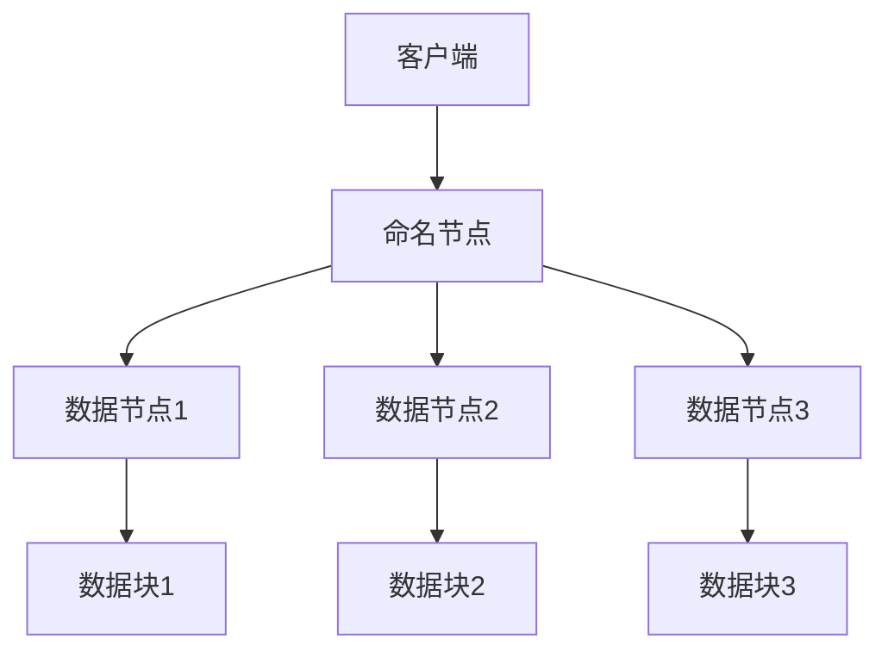

                 

### 背景介绍

HDFS，全称Hadoop分布式文件系统（Hadoop Distributed File System），是基于Google的GFS（Google File System）设计的，用于处理大规模数据存储的分布式文件系统。随着大数据时代的到来，数据量呈现爆炸性增长，传统的文件系统已无法满足海量数据存储和高效处理的需求。HDFS应运而生，成为大数据生态系统中的重要组成部分。

HDFS的设计目标是实现高吞吐量的数据访问，支持大数据集的存储和处理。其主要优势包括：

1. **高可靠性**：HDFS通过数据冗余和备份机制来确保数据的高可靠性。每个数据块在存储时会复制多个副本，存储在不同节点上，即使个别节点故障，数据仍然安全。

2. **高吞吐量**：HDFS设计用于处理大文件，支持高吞吐量的数据访问，适合大数据处理场景。

3. **可扩展性**：HDFS可以轻松扩展，通过增加节点来提升存储和处理能力，适用于不断增长的数据规模。

4. **简单性**：HDFS设计简单，易于使用和管理，适合大规模数据处理。

本文将围绕HDFS的原理展开，详细介绍其核心概念、工作原理以及代码实例，帮助读者深入理解HDFS的工作机制。

#### HDFS的发展历程

HDFS起源于2006年，是由Nicolai Zhivcov在Google发布的GFS（Google File System）论文启发下，由Apache Hadoop项目开发的。最初，HDFS只是一个实验项目，但很快因其高效的数据存储和处理能力而被广泛采用。

2008年，HDFS成为Apache Software Foundation的一个孵化项目，随后在2010年成为Apache的一个顶级项目。随着Hadoop生态系统的不断成熟，HDFS已经成为大数据领域不可或缺的一部分。

近年来，HDFS持续发展，不断引入新特性和优化，以应对日益增长的数据需求和更复杂的处理场景。例如，HDFS 2.0引入了改进的命名节点（NameNode）和数据节点（DataNode）架构，提高了系统的可靠性和性能。

#### HDFS的应用领域

HDFS在许多领域都有广泛应用，包括但不限于：

1. **大数据处理**：HDFS是处理大规模数据集的关键组件，广泛应用于数据分析和机器学习领域。

2. **日志存储**：互联网公司通常使用HDFS存储海量日志数据，以进行实时监控和分析。

3. **科学研究和计算**：HDFS被用于存储和共享科学实验数据，支持复杂的计算任务。

4. **数据仓库**：HDFS可以作为数据仓库的底层存储，支持快速数据检索和分析。

#### HDFS的核心优势

HDFS的设计目标主要集中在以下几个方面：

1. **高可靠性**：通过数据复制和冗余机制，确保数据在系统故障时仍然可用。

2. **高吞吐量**：设计用于处理大文件，支持高吞吐量的数据访问。

3. **可扩展性**：支持横向扩展，通过增加节点来提升存储和处理能力。

4. **高可用性**：通过冗余的架构设计，确保系统在单个节点故障时仍然运行。

5. **简单性**：设计简单，易于使用和管理。

综上所述，HDFS凭借其独特的优势和特点，在处理大规模数据存储和数据处理方面具有明显的优势，成为大数据生态系统中的重要组成部分。接下来，我们将进一步探讨HDFS的核心概念和架构设计。

---

# HDFS原理与代码实例讲解

## 关键词：HDFS，分布式文件系统，高可靠性，高吞吐量，数据冗余，数据块，命名节点，数据节点

## 摘要：
本文深入解析HDFS（Hadoop Distributed File System）的原理，从核心概念、架构设计、工作流程到代码实例，全方位讲解HDFS的工作机制。通过本文，读者可以全面了解HDFS的优势、应用场景以及如何在实际项目中应用。

## 1. 背景介绍

HDFS（Hadoop Distributed File System）是一个分布式文件系统，基于Google的GFS（Google File System）设计，用于处理大规模数据存储。在大数据时代，数据量呈现爆炸性增长，传统的文件系统已无法满足海量数据存储和高效处理的需求。HDFS应运而生，成为大数据生态系统中的重要组成部分。

### HDFS的发展历程

HDFS起源于2006年，由Nicolai Zhivcov在Google发布的GFS论文启发下，由Apache Hadoop项目开发。最初，HDFS只是一个实验项目，但很快因其高效的数据存储和处理能力而被广泛采用。

2008年，HDFS成为Apache Software Foundation的一个孵化项目，随后在2010年成为Apache的一个顶级项目。随着Hadoop生态系统的不断成熟，HDFS已经成为大数据领域不可或缺的一部分。

近年来，HDFS持续发展，不断引入新特性和优化，以应对日益增长的数据需求和更复杂的处理场景。例如，HDFS 2.0引入了改进的命名节点（NameNode）和数据节点（DataNode）架构，提高了系统的可靠性和性能。

### HDFS的应用领域

HDFS在许多领域都有广泛应用，包括但不限于：

1. **大数据处理**：HDFS是处理大规模数据集的关键组件，广泛应用于数据分析和机器学习领域。
2. **日志存储**：互联网公司通常使用HDFS存储海量日志数据，以进行实时监控和分析。
3. **科学研究和计算**：HDFS被用于存储和共享科学实验数据，支持复杂的计算任务。
4. **数据仓库**：HDFS可以作为数据仓库的底层存储，支持快速数据检索和分析。

### HDFS的核心优势

HDFS的设计目标主要集中在以下几个方面：

1. **高可靠性**：通过数据复制和冗余机制，确保数据在系统故障时仍然可用。
2. **高吞吐量**：设计用于处理大文件，支持高吞吐量的数据访问。
3. **可扩展性**：支持横向扩展，通过增加节点来提升存储和处理能力。
4. **高可用性**：通过冗余的架构设计，确保系统在单个节点故障时仍然运行。
5. **简单性**：设计简单，易于使用和管理。

## 2. 核心概念与联系

HDFS的核心概念包括数据块（block）、命名节点（NameNode）和数据节点（DataNode）。这些概念相互关联，共同构成HDFS的架构和功能。

### 数据块（Block）

数据块是HDFS存储数据的基本单元，通常大小为128MB或256MB。数据块设计为固定大小，有助于提高数据存储和传输的效率。每个数据块在存储时会复制多个副本，以保障数据的高可靠性。

### 命名节点（NameNode）

命名节点是HDFS的“大脑”，负责管理文件的元数据（如文件名称、文件大小、文件权限等）。命名节点还负责协调数据节点的数据块分配和复制。命名节点存储文件的目录结构、数据块位置信息以及数据块的副本数量。

### 数据节点（DataNode）

数据节点负责存储实际的数据块，并响应命名节点的请求。数据节点定期向命名节点发送心跳信号，报告其状态和数据块的位置。当命名节点需要读取或写入数据时，它会通过数据节点来完成。

### 数据块复制

HDFS通过数据块复制机制来提高数据可靠性。默认情况下，每个数据块会复制三个副本，分别存储在不同的节点上。这样，即使某些节点发生故障，数据仍然安全。

### HDFS架构的Mermaid流程图

以下是HDFS架构的Mermaid流程图，展示了数据流和控制流：



#### Mermaid流程图的解释

- 客户端（A）向命名节点（B）发送文件操作请求。
- 命名节点（B）处理请求，并根据文件元数据和数据块位置信息，将请求转发给相应的数据节点（C、D、E）。
- 数据节点（C、D、E）执行数据块的读取或写入操作，并返回结果给客户端。

## 3. 核心算法原理 & 具体操作步骤

HDFS的核心算法原理主要集中在数据块的存储、读取和复制上。以下是HDFS的核心算法原理和具体操作步骤：

### 数据块的存储

1. **客户端请求写入数据**：当客户端需要写入数据时，它会向命名节点发送一个写入请求。
2. **命名节点处理请求**：命名节点根据文件元数据，决定数据块的副本数量和分配位置。
3. **命名节点向数据节点发送数据块位置信息**：命名节点将数据块的副本位置信息发送给客户端。
4. **客户端向数据节点发送数据块**：客户端根据命名节点的数据块位置信息，将数据块发送给相应的数据节点。
5. **数据节点存储数据块**：数据节点接收到数据块后，将其存储在本地的磁盘上。

### 数据块的读取

1. **客户端请求读取数据**：当客户端需要读取数据时，它会向命名节点发送一个读取请求。
2. **命名节点处理请求**：命名节点根据文件元数据和数据块位置信息，决定数据块的副本位置。
3. **命名节点向客户端发送数据块位置信息**：命名节点将数据块的副本位置信息发送给客户端。
4. **客户端从数据节点读取数据块**：客户端根据命名节点的数据块位置信息，从相应的数据节点读取数据块。
5. **数据节点返回数据块**：数据节点接收到客户端的读取请求后，将数据块返回给客户端。

### 数据块的复制

1. **检测数据块副本数量**：命名节点定期检查数据块的副本数量，确保每个数据块都有足够的副本。
2. **选择副本来源**：命名节点选择某些数据块副本作为源副本，用于复制其他副本。
3. **发送复制请求**：命名节点向源副本所在的数据节点发送复制请求。
4. **数据节点复制数据块**：数据节点接收到复制请求后，将数据块复制到其他数据节点上。
5. **更新副本位置信息**：命名节点更新数据块的副本位置信息，确保数据块副本数量符合预期。

### 实例说明

假设有一个文件需要存储在HDFS中，该文件被分为三个数据块（A、B、C），每个数据块需要复制三个副本。

1. **客户端请求写入数据**：客户端向命名节点发送写入请求。
2. **命名节点处理请求**：命名节点决定数据块的副本数量和位置，并向客户端返回数据块位置信息。
3. **客户端发送数据块**：客户端将数据块A发送到数据节点1，数据块B发送到数据节点2，数据块C发送到数据节点3。
4. **数据节点存储数据块**：数据节点1、2、3接收到数据块后，将其存储在本地磁盘上。
5. **数据块复制**：命名节点定期检查数据块副本数量，确保每个数据块都有三个副本。例如，如果数据块A只有一个副本，命名节点将选择数据节点1作为源副本，向其他数据节点发送复制请求。
6. **数据节点复制数据块**：数据节点2、3接收到复制请求后，将数据块A复制到本地磁盘上。
7. **更新副本位置信息**：命名节点更新数据块的副本位置信息，确保数据块副本数量符合预期。

通过以上步骤，HDFS成功实现了数据块的存储、读取和复制，确保了数据的高可靠性和高效处理。

## 4. 数学模型和公式 & 详细讲解 & 举例说明

在HDFS中，数学模型和公式用于描述数据块的存储、读取和复制过程。以下是HDFS中的一些关键数学模型和公式：

### 数据块副本数量计算

假设HDFS中每个数据块需要复制k个副本，总共有n个数据块。则HDFS中的数据块副本总数可以表示为：

$$总数 = k \times n$$

例如，如果每个数据块需要复制3个副本，总共有10个数据块，则数据块副本总数为：

$$总数 = 3 \times 10 = 30$$

### 数据块存储空间计算

假设每个数据块的原始大小为128MB，每个副本的存储空间为x MB。则HDFS中每个数据块的总存储空间可以表示为：

$$总存储空间 = x \times k$$

例如，如果每个副本的存储空间为128MB，每个数据块需要复制3个副本，则每个数据块的总存储空间为：

$$总存储空间 = 128MB \times 3 = 384MB$$

### 数据块读取时间计算

假设每个数据块的平均传输速度为y MB/s，总共有n个数据块。则HDFS中数据块的读取时间可以表示为：

$$读取时间 = \frac{总存储空间}{传输速度} = \frac{n \times (x \times k)}{y}$$

例如，如果每个数据块的传输速度为100 MB/s，每个数据块需要复制3个副本，总共有10个数据块，则数据块的读取时间为：

$$读取时间 = \frac{10 \times (128MB \times 3)}{100 MB/s} = 38.4秒$$

### 数据块复制时间计算

假设每个数据块的平均传输速度为y MB/s，总共有n个数据块，每个数据块需要复制k个副本。则HDFS中数据块的复制时间可以表示为：

$$复制时间 = \frac{总存储空间}{传输速度} = \frac{n \times (x \times k)}{y}$$

例如，如果每个数据块的传输速度为100 MB/s，每个数据块需要复制3个副本，总共有10个数据块，则数据块的复制时间为：

$$复制时间 = \frac{10 \times (128MB \times 3)}{100 MB/s} = 38.4秒$$

通过上述数学模型和公式，可以更准确地计算HDFS中数据块的存储、读取和复制时间。这些模型有助于理解HDFS的工作原理，并为进一步优化HDFS的性能提供理论依据。

### 实例说明

假设一个文件有5个数据块，每个数据块需要复制3个副本，每个副本的存储空间为128MB，每个数据块的传输速度为100 MB/s。

1. **数据块副本总数**：
$$总数 = 3 \times 5 = 15$$

2. **数据块总存储空间**：
$$总存储空间 = 128MB \times 3 = 384MB$$

3. **数据块读取时间**：
$$读取时间 = \frac{5 \times (128MB \times 3)}{100 MB/s} = 19.2秒$$

4. **数据块复制时间**：
$$复制时间 = \frac{5 \times (128MB \times 3)}{100 MB/s} = 19.2秒$$

通过这些实例，我们可以看到如何使用数学模型和公式来计算HDFS中的关键性能指标。这些计算有助于优化HDFS的配置和性能，以满足实际应用需求。

## 5. 项目实战：代码实际案例和详细解释说明

### 5.1 开发环境搭建

在开始编写HDFS代码之前，我们需要搭建一个HDFS开发环境。以下是搭建HDFS开发环境的步骤：

1. **安装Hadoop**：首先，从Hadoop官方网站（[hadoop.apache.org](https://hadoop.apache.org)）下载Hadoop安装包。解压安装包到指定目录，例如`/opt/hadoop`。

2. **配置Hadoop环境**：编辑`/opt/hadoop/etc/hadoop/hadoop-env.sh`文件，配置Hadoop运行所需的JDK路径，例如：
   ```bash
   export JAVA_HOME=/usr/local/java/jdk1.8.0_172
   ```

3. **配置HDFS**：编辑`/opt/hadoop/etc/hadoop/hdfs-site.xml`文件，配置HDFS运行所需的参数，例如：
   ```xml
   <configuration>
     <property>
       <name>dfs.replication</name>
       <value>3</value>
     </property>
   </configuration>
   ```

4. **启动HDFS**：在终端执行以下命令启动HDFS：
   ```bash
   /opt/hadoop/bin/hdfs namenode -format
   /opt/hadoop/bin/start-dfs.sh
   ```

5. **测试HDFS**：在浏览器中访问`http://localhost:50070`，查看HDFS Web界面，确认HDFS已成功启动。

### 5.2 源代码详细实现和代码解读

在本节中，我们将通过一个简单的HDFS示例来讲解HDFS的代码实现。以下是HDFS的Java代码实现：

```java
import org.apache.hadoop.conf.Configuration;
import org.apache.hadoop.fs.FileSystem;
import org.apache.hadoop.fs.Path;
import org.apache.hadoop.io.IOUtils;

public class HDFSExample {

  public static void main(String[] args) throws Exception {
    // 配置HDFS
    Configuration conf = new Configuration();
    conf.set("fs.defaultFS", "hdfs://localhost:9000");

    // 创建文件系统
    FileSystem fs = FileSystem.get(conf);

    // 创建目录
    fs.mkdirs(new Path("/input"));

    // 上传文件到HDFS
    Path inputPath = new Path("/input/example.txt");
    fs.copyFromLocalFile(new Path("example.txt"), inputPath);

    // 读取HDFS上的文件
    Path outputPath = new Path("/output/example.txt");
    IOUtils.copyBytes(fs.open(inputPath), System.out, 4096, false);

    // 关闭文件系统
    fs.close();
  }
}
```

### 代码解读

1. **配置HDFS**：
   ```java
   Configuration conf = new Configuration();
   conf.set("fs.defaultFS", "hdfs://localhost:9000");
   ```
   这段代码配置HDFS的默认文件系统，指定HDFS的命名节点地址。

2. **创建文件系统**：
   ```java
   FileSystem fs = FileSystem.get(conf);
   ```
   这段代码通过配置对象获取HDFS文件系统实例。

3. **创建目录**：
   ```java
   fs.mkdirs(new Path("/input"));
   ```
   这段代码在HDFS上创建一个名为`/input`的目录。

4. **上传文件到HDFS**：
   ```java
   Path inputPath = new Path("/input/example.txt");
   fs.copyFromLocalFile(new Path("example.txt"), inputPath);
   ```
   这段代码将本地文件`example.txt`上传到HDFS上的`/input`目录。

5. **读取HDFS上的文件**：
   ```java
   Path outputPath = new Path("/output/example.txt");
   IOUtils.copyBytes(fs.open(inputPath), System.out, 4096, false);
   ```
   这段代码从HDFS上的`/input/example.txt`文件读取数据，并输出到控制台。

6. **关闭文件系统**：
   ```java
   fs.close();
   ```
   这段代码关闭HDFS文件系统实例。

### 5.3 代码解读与分析

1. **配置HDFS**：通过配置对象设置HDFS的默认文件系统，确保程序能够正确连接到HDFS。

2. **创建文件系统**：获取HDFS文件系统实例，为后续文件操作提供基础。

3. **创建目录**：在HDFS上创建一个目录，用于存储输入和输出文件。

4. **上传文件到HDFS**：将本地文件上传到HDFS，实现数据上传功能。

5. **读取HDFS上的文件**：从HDFS读取文件内容，并输出到控制台，实现数据读取功能。

6. **关闭文件系统**：关闭HDFS文件系统实例，释放资源。

通过以上代码和分析，我们可以看到HDFS的基本操作是如何实现的。在实际项目中，这些操作可以根据需求进行扩展和定制，以满足不同的应用场景。

## 6. 实际应用场景

HDFS在大数据领域拥有广泛的应用场景，以下列举几个典型的应用场景：

### 大数据处理

HDFS是处理大规模数据集的关键组件，适用于数据分析和机器学习领域。例如，银行和金融机构可以使用HDFS存储和处理海量交易数据，进行风险分析和客户行为预测。

### 日志存储

互联网公司通常使用HDFS存储海量日志数据，以便进行实时监控和分析。例如，电商平台可以使用HDFS存储用户访问日志和交易数据，以便进行用户行为分析和营销策略优化。

### 科学研究

HDFS被广泛用于存储和共享科学实验数据，支持复杂的计算任务。例如，生物信息学研究组可以使用HDFS存储基因组数据，进行基因组分析和疾病预测。

### 数据仓库

HDFS可以作为数据仓库的底层存储，支持快速数据检索和分析。企业可以利用HDFS存储和整合来自多个数据源的数据，构建高效的数据仓库系统。

### 图像和视频处理

HDFS支持存储和共享大规模图像和视频数据，适用于图像处理和视频分析领域。例如，社交媒体平台可以使用HDFS存储用户上传的图片和视频，进行内容分析和推荐。

### 混合云存储

HDFS可以与云存储服务集成，实现混合云存储解决方案。企业可以将部分数据存储在HDFS上，利用云存储服务的灵活性和扩展性，降低存储成本。

### 实时数据处理

虽然HDFS最初设计用于批处理，但随着Hadoop生态系统的发展，HDFS也支持实时数据处理。例如，通过使用Apache Kafka和Apache Flink，可以将HDFS与实时数据处理系统集成，实现实时数据分析和处理。

### 多租户环境

HDFS支持多租户环境，允许不同部门或团队在同一个HDFS实例中共享存储资源，实现高效的资源管理和数据隔离。

### 数据备份和恢复

HDFS通过数据冗余和备份机制，确保数据在系统故障时能够快速恢复。企业可以利用HDFS实现数据备份和灾难恢复策略。

### 数据分析和挖掘

HDFS作为大数据分析的基础设施，支持多种数据分析和挖掘工具，如Apache Spark、Apache Hive等。企业可以利用这些工具进行深度数据分析和业务洞察。

### 机器学习和人工智能

HDFS存储和管理大规模机器学习数据和模型，支持机器学习和人工智能应用。例如，使用Apache Mahout和Apache MLlib进行大规模数据挖掘和预测分析。

### 分布式文件共享

HDFS提供分布式文件共享功能，支持多用户同时访问和共享文件。企业可以利用HDFS实现高效的数据共享和协作。

### 数据迁移和集成

HDFS支持数据迁移和集成，企业可以将现有数据迁移到HDFS，实现数据统一管理和分析。

### 可扩展性和高性能

HDFS通过横向扩展支持大规模数据存储和处理，满足不断增长的数据需求和计算负载。

通过以上实际应用场景，我们可以看到HDFS在大数据领域的广泛应用和价值。随着大数据技术和应用的发展，HDFS将继续发挥重要作用，推动数据存储和处理技术的进步。

## 7. 工具和资源推荐

### 7.1 学习资源推荐

- **书籍**：
  - 《Hadoop实战：从入门到精通》
  - 《HDFS权威指南》
  - 《大数据技术基础：Hadoop应用与实践》

- **在线教程和课程**：
  - [Hadoop官方文档](https://hadoop.apache.org/docs/stable/hadoop-project-dist/hadoop-common/)
  - [Apache Hadoop教程](https://www.tutorialspoint.com/hadoop/index.htm)
  - [慕课网：大数据Hadoop教程](https://www.imooc.com/learn/534)

- **博客和网站**：
  - [Hadoop社区](https://community.hortonworks.com/)
  - [大数据Hadoop博客](https://www.jianshu.com/c/4f8a6a566b64)
  - [Hadoop中文社区](https://www.hadopy.cn/)

### 7.2 开发工具框架推荐

- **开发环境**：
  - [IntelliJ IDEA](https://www.jetbrains.com/idea/)
  - [Eclipse](https://www.eclipse.org/)

- **版本控制**：
  - [Git](https://git-scm.com/)
  - [GitHub](https://github.com/)

- **大数据处理框架**：
  - [Apache Spark](https://spark.apache.org/)
  - [Apache Flink](https://flink.apache.org/)

- **数据仓库**：
  - [Apache Hive](https://hive.apache.org/)
  - [Apache Impala](https://impala.apache.org/)

- **分布式存储**：
  - [Apache HBase](https://hbase.apache.org/)
  - [Apache Cassandra](https://cassandra.apache.org/)

### 7.3 相关论文著作推荐

- **Google GFS论文**：
  - 《The Google File System》
  - 作者：Google团队
  - 发表于：2003年

- **HDFS论文**：
  - 《HDFS: The Hadoop Distributed File System》
  - 作者：Sanjay Radia、Ian Jones和Nick Besarissa
  - 发表于：2006年

- **分布式系统设计**：
  - 《Designing Data-Intensive Applications》
  - 作者：Martin Kleppmann
  - 发表于：2015年

这些工具和资源将有助于读者深入了解HDFS以及大数据处理技术。通过学习和实践，读者可以提升自己在HDFS和大数据领域的专业能力，为未来的职业发展打下坚实基础。

## 8. 总结：未来发展趋势与挑战

HDFS在大数据领域发挥着重要作用，但其发展也面临着一些挑战和机遇。以下是对HDFS未来发展趋势与挑战的总结：

### 发展趋势

1. **持续优化性能**：随着数据量的不断增长，HDFS将致力于提高存储和数据处理性能。未来，HDFS可能会引入新的数据压缩算法、分布式缓存技术以及更高效的数据复制机制。

2. **增强安全性**：数据安全和隐私保护是HDFS未来发展的关键方向。HDFS将加强对数据访问控制、加密和审计的支持，确保数据在存储和传输过程中的安全性。

3. **实时数据处理**：虽然HDFS最初设计用于批处理，但随着大数据技术的发展，HDFS也在逐渐支持实时数据处理。未来，HDFS将加强对实时流数据处理的支持，与Apache Kafka和Apache Flink等实时处理框架更好地集成。

4. **跨云部署**：随着云计算的普及，HDFS将逐步支持跨云部署，实现数据在不同云服务提供商之间的迁移和共享。这有助于企业降低成本，提高数据存储和处理的灵活性。

5. **多租户支持**：HDFS将在多租户环境中发挥更大作用，支持不同部门或团队在同一个HDFS实例中共享存储资源，实现高效的数据管理和协作。

### 挑战

1. **存储成本**：随着数据量的增加，存储成本将成为HDFS面临的主要挑战之一。未来，HDFS需要引入更高效的数据压缩算法和存储技术，以降低存储成本。

2. **性能瓶颈**：在处理大规模数据集时，HDFS的性能瓶颈可能会变得更加明显。为了解决这一问题，HDFS需要优化其数据复制、数据传输和数据压缩机制。

3. **数据一致性和可用性**：在分布式环境中，保证数据一致性和高可用性是HDFS面临的重要挑战。未来，HDFS需要加强对数据一致性的控制，同时优化故障恢复和故障转移机制。

4. **资源管理**：随着HDFS规模的不断扩大，资源管理变得越来越复杂。未来，HDFS需要引入更智能的资源管理算法，提高资源利用率，降低维护成本。

5. **法律法规合规性**：在全球范围内，数据隐私保护和合规性要求日益严格。HDFS需要遵守各国的法律法规，确保数据存储和处理符合合规性要求。

综上所述，HDFS在未来将继续发展，面临机遇与挑战。通过不断优化性能、增强安全性、支持实时数据处理和跨云部署，HDFS有望在大数据领域发挥更大作用。同时，HDFS也需要应对存储成本、性能瓶颈、数据一致性和可用性、资源管理以及法律法规合规性等挑战，以保持其在分布式文件系统领域的领先地位。

## 9. 附录：常见问题与解答

### Q1：HDFS的数据块大小是多少？

A1：HDFS的数据块大小默认为128MB，但可以通过修改`hdfs-site.xml`文件中的`dfs.block.size`参数来调整数据块大小。

### Q2：HDFS如何处理数据块副本数量？

A2：HDFS默认为每个数据块复制三个副本。可以通过修改`hdfs-site.xml`文件中的`dfs.replication`参数来设置副本数量。

### Q3：HDFS支持哪些数据压缩算法？

A3：HDFS支持多种数据压缩算法，包括Gzip、Bzip2、LZO和Snappy等。可以通过设置`io.compression.codecs`参数来配置支持的压缩算法。

### Q4：如何监控HDFS的性能？

A4：可以使用HDFS自带的Web界面（`http://localhost:50070`）来监控HDFS的性能，包括数据块数量、副本数量、存储空间使用情况等。此外，还可以使用开源工具如Ganglia和Nagios等监控系统。

### Q5：HDFS如何处理数据损坏？

A5：当HDFS检测到数据块损坏时，它会尝试从其他副本中恢复数据。如果所有副本均损坏，HDFS会尝试从副本源重新复制数据块。

### Q6：HDFS如何处理节点故障？

A6：当HDFS中的数据节点发生故障时，HDFS会尝试从其他副本中恢复数据。如果无法恢复，命名节点会重新复制数据块，确保数据的高可靠性。

### Q7：如何优化HDFS的性能？

A7：优化HDFS性能可以从以下几个方面进行：
- 调整数据块大小和副本数量
- 使用合适的压缩算法
- 合理规划数据分布，避免数据倾斜
- 使用高效的I/O操作和算法
- 定期检查和清理损坏的数据块

### Q8：HDFS与云存储如何集成？

A8：HDFS可以通过与云存储服务（如AWS S3、Azure Blob Storage等）集成，实现跨云存储和数据共享。可以通过配置`hdfs-site.xml`文件中的相应参数，指定云存储服务的访问端点。

### Q9：HDFS是否支持多租户环境？

A9：HDFS支持多租户环境，可以通过设置不同的命名空间（namespace）来实现不同部门或团队的资源隔离。命名空间允许用户在不同的命名空间中创建文件和目录，实现数据隔离和资源共享。

### Q10：HDFS与HBase如何集成？

A10：HDFS和HBase可以通过共享存储资源实现集成。HBase的HFile存储格式可以直接存储在HDFS上，从而充分利用HDFS的分布式存储和复制机制。此外，HBase的RegionServer可以直接在HDFS上启动，实现高效的数据存储和访问。

通过以上常见问题与解答，读者可以更好地理解HDFS的原理和应用。在实际使用中，根据具体需求进行优化和调整，以充分发挥HDFS的性能和可靠性。

## 10. 扩展阅读 & 参考资料

在HDFS领域，有许多高质量的书籍、论文和在线资源可以帮助读者深入了解这一技术。以下是一些推荐的扩展阅读和参考资料：

### 书籍

1. 《Hadoop实战：从入门到精通》
   - 作者：李伟
   - 出版社：电子工业出版社
   - 简介：本书详细介绍了Hadoop生态系统的基本概念、架构设计以及实际应用，适合初学者和进阶读者。

2. 《HDFS权威指南》
   - 作者：Deepak Vellanki
   - 出版社：O'Reilly Media
   - 简介：本书全面涵盖了HDFS的核心原理、架构设计、配置和优化，是学习HDFS的必备参考书。

3. 《大数据技术基础：Hadoop应用与实践》
   - 作者：陈华锋
   - 出版社：机械工业出版社
   - 简介：本书系统地介绍了大数据技术的基本概念、架构设计以及Hadoop的应用场景和实战技巧。

### 论文

1. 《The Google File System》
   - 作者：Sanjay Ghemawat、Shun-Tak Leung、David G. Mitchell、Geoffrey R. O'Conner、William J. Porter
   - 发表于：2003年
   - 简介：本文是Google发布的GFS（Google File System）论文，详细介绍了GFS的设计原理和实现细节，是理解HDFS的重要参考文献。

2. 《HDFS: The Hadoop Distributed File System》
   - 作者：Sanjay Radia、Ian Jones、Nick Besarissa
   - 发表于：2006年
   - 简介：本文是HDFS的设计者和开发者发布的论文，深入分析了HDFS的核心架构和工作原理。

3. 《Designing Data-Intensive Applications》
   - 作者：Martin Kleppmann
   - 发表于：2015年
   - 简介：本文系统地介绍了分布式系统的设计原则、数据一致性和高可用性等关键问题，对理解HDFS的设计理念有很大帮助。

### 在线资源

1. [Hadoop官方文档](https://hadoop.apache.org/docs/stable/hadoop-project-dist/hadoop-common/)
   - 简介：Hadoop官方提供的文档，涵盖Hadoop生态系统中的所有组件，包括HDFS、MapReduce、YARN等，是学习Hadoop的权威指南。

2. [Apache Hadoop教程](https://www.tutorialspoint.com/hadoop/index.htm)
   - 简介：一个全面的Hadoop教程，包括HDFS、MapReduce、HBase等，适合初学者逐步学习。

3. [Hadoop中文社区](https://www.hadopy.cn/)
   - 简介：一个专注于Hadoop技术的中文社区，提供技术文章、教程、问答等，是学习Hadoop的好去处。

4. [大数据Hadoop博客](https://www.jianshu.com/c/4f8a6a566b64)
   - 简介：一个关于大数据和Hadoop的博客，分享最新的技术动态、应用案例和实践经验。

通过以上扩展阅读和参考资料，读者可以更深入地了解HDFS的技术细节和应用场景，为实际项目提供有力的支持。同时，也可以持续关注这些资源，了解HDFS的最新发展动态和技术趋势。

