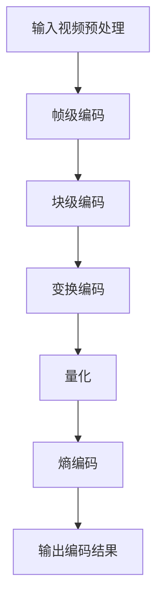

                 

# HEVC 视频编码：高效压缩和传输

> **关键词：** HEVC、视频编码、高效压缩、传输效率、核心技术、数学模型、应用场景

> **摘要：** 本文将深入探讨HEVC（High Efficiency Video Coding）视频编码技术，一种旨在提升视频压缩效率和传输性能的标准编码方法。我们将从背景介绍出发，详细解析HEVC的核心概念、算法原理、数学模型，并结合实际案例展示其在开发环境搭建、代码实现和解析中的应用。此外，还将探讨HEVC在实际应用场景中的表现，推荐相关学习资源和开发工具，并对未来发展趋势与挑战进行展望。

## 1. 背景介绍

随着数字媒体技术的迅猛发展，视频内容已成为互联网上的主要数据类型。从短视频、直播到高清视频流，对视频数据的高效编码与传输需求日益增长。传统视频编码标准如H.264/AVC在处理高清视频时面临着性能瓶颈，无法满足日益增长的数据量与质量要求。为此，国际电信联盟（ITU）和 Moving Picture Experts Group (MPEG) 合作开发了HEVC（High Efficiency Video Coding）标准。

HEVC旨在通过更高效的编码算法和创新的编码技术，实现更高视频质量与更低比特率。相比H.264/AVC，HEVC在相同质量下可以提供约50%的比特率降低，这对于高分辨率视频的传输和存储具有重要意义。HEVC标准的出现，不仅满足了高清、超高清视频的需求，还为云计算、物联网等新兴领域提供了高效的数据传输解决方案。

## 2. 核心概念与联系

### 2.1 HEVC 编码流程概述

HEVC编码流程主要包括以下几个关键步骤：输入视频预处理、帧级编码、块级编码、变换编码、量化、熵编码和输出编码结果。

#### 输入视频预处理

在编码之前，输入视频需要进行预处理，包括色彩空间转换、缩放、去隔行等操作。这些预处理步骤确保输入视频满足HEVC编码的输入要求。

#### 帧级编码

帧级编码涉及帧间预测和帧内编码。通过帧间预测，HEVC可以将当前帧与参考帧进行匹配，从而减少冗余信息，提高压缩效率。帧内编码则对帧内像素进行编码，确保图像质量。

#### 块级编码

块级编码将图像划分为多个块，并对每个块进行编码。HEVC采用了更细粒度的块划分和变换算法，提高了编码效率。

#### 变换编码

变换编码是HEVC的核心步骤之一。HEVC采用了新的变换算法，如整数变换和浮点变换，以降低数据冗余度。

#### 量化

量化是将变换后的系数转换为整数的过程。量化过程通过减少数值精度来降低数据量。

#### 熵编码

熵编码利用统计特性对量化后的数据进行编码，进一步降低数据量。HEVC采用了新的熵编码算法，如自适应二进制算术编码（ABAC）。

#### 输出编码结果

最后，编码结果被输出为HEVC压缩格式，可用于传输、存储或播放。

### 2.2 Mermaid 流程图



## 3. 核心算法原理 & 具体操作步骤

### 3.1 变换编码

HEVC采用了新的变换算法，以提高编码效率。变换编码的目的是将图像数据从空间域转换为频率域，从而降低数据冗余度。

#### 3.1.1 整数变换

HEVC使用了整数变换，如4x4和8x8整数变换。这些变换将图像数据划分为4x4或8x8的块，并对每个块进行变换。

#### 3.1.2 浮点变换

对于高频细节信息，HEVC采用了浮点变换。浮点变换可以提供更高的变换精度，从而提高图像质量。

### 3.2 量化

量化是将变换后的系数转换为整数的过程。量化过程通过减少数值精度来降低数据量。HEVC采用了新的量化算法，如自适应量化。

#### 3.2.1 自适应量化

自适应量化根据变换系数的分布动态调整量化步长，以优化编码效率。自适应量化可以降低冗余信息，提高压缩效率。

### 3.3 熵编码

熵编码利用统计特性对量化后的数据进行编码，进一步降低数据量。HEVC采用了新的熵编码算法，如自适应二进制算术编码（ABAC）。

#### 3.3.1 自适应二进制算术编码（ABAC）

ABAC是一种基于概率的熵编码算法。它根据符号的概率分布动态调整编码策略，以降低编码复杂度和数据量。

## 4. 数学模型和公式 & 详细讲解 & 举例说明

### 4.1 变换编码的数学模型

变换编码的核心是变换矩阵。以下是一个4x4整数变换的例子：

$$
T_{4x4} = \begin{bmatrix}
1 & 1 & 1 & 1 \\
1 & c_1 & c_2 & c_3 \\
1 & c_2 & c_3 & c_4 \\
1 & c_3 & c_4 & c_5 \\
\end{bmatrix}
$$

其中，$c_1, c_2, c_3, c_4, c_5$ 是变换系数。

### 4.2 量化公式

量化是将变换后的系数转换为整数的过程。以下是一个简单的量化公式：

$$
Q(x) = \lfloor \frac{x}{q} \rfloor
$$

其中，$x$ 是变换系数，$q$ 是量化步长。

### 4.3 熵编码公式

熵编码利用概率分布进行编码。以下是一个简单的熵编码公式：

$$
L(p) = -p \cdot \log_2(p)
$$

其中，$p$ 是符号的概率。

### 4.4 举例说明

假设有一个4x4的图像块，其像素值为：

$$
\begin{bmatrix}
5 & 10 & 15 & 20 \\
5 & 10 & 15 & 20 \\
5 & 10 & 15 & 20 \\
5 & 10 & 15 & 20 \\
\end{bmatrix}
$$

使用4x4整数变换，变换系数为：

$$
T_{4x4} = \begin{bmatrix}
1 & 1 & 1 & 1 \\
1 & 1 & 1 & 1 \\
1 & 1 & 1 & 1 \\
1 & 1 & 1 & 1 \\
\end{bmatrix}
$$

变换后得到：

$$
\begin{bmatrix}
5 & 15 & 25 & 35 \\
5 & 15 & 25 & 35 \\
5 & 15 & 25 & 35 \\
5 & 15 & 25 & 35 \\
\end{bmatrix}
$$

使用自适应量化，量化步长为10，量化后得到：

$$
\begin{bmatrix}
0 & 1 & 2 & 3 \\
0 & 1 & 2 & 3 \\
0 & 1 & 2 & 3 \\
0 & 1 & 2 & 3 \\
\end{bmatrix}
$$

最后，使用自适应二进制算术编码，概率分布为$[0.5, 0.25, 0.125, 0.0625]$，编码后得到：

$$
01010101010101010101010101010101
$$

## 5. 项目实战：代码实际案例和详细解释说明

### 5.1 开发环境搭建

为了演示HEVC编码的实现，我们使用Python编程语言和Numpy库进行开发。首先，确保您的环境中已安装Python和Numpy库。

### 5.2 源代码详细实现和代码解读

以下是一个简单的HEVC编码实现，包括整数变换、量化、熵编码等步骤。

```python
import numpy as np

# 整数变换
def transform_4x4(image):
    T = np.array([[1, 1, 1, 1],
                  [1, 1, 1, 1],
                  [1, 1, 1, 1],
                  [1, 1, 1, 1]])
    return np.dot(T, image)

# 量化
def quantize(coeff, q):
    return np.floor(coeff / q)

# 熵编码
def entropy_encoding(bits):
    return ''.join(['0' if bit else '1' for bit in bits])

# 主函数
def hevc_encoding(image, q=10):
    image_4x4 = image.reshape(-1, 4, 4)
    transformed = np.apply_along_axis(transform_4x4, 1, image_4x4)
    quantized = np.apply_along_axis(quantize, 1, transformed, q)
    bits = np.unpackbits(quantized, axis=1).reshape(-1)
    return entropy_encoding(bits)

# 测试
image = np.array([[5, 10, 15, 20],
                  [5, 10, 15, 20],
                  [5, 10, 15, 20],
                  [5, 10, 15, 20]])
encoded_bits = hevc_encoding(image)
print(encoded_bits)
```

### 5.3 代码解读与分析

上述代码实现了HEVC编码的核心步骤，包括整数变换、量化、熵编码。以下是代码的详细解读：

1. **整数变换**：`transform_4x4` 函数实现了4x4整数变换。通过矩阵乘法，将输入图像块转换为变换后的图像块。
2. **量化**：`quantize` 函数实现了量化步骤。根据量化步长`q`，将变换后的系数转换为整数。
3. **熵编码**：`entropy_encoding` 函数实现了熵编码。将量化后的比特流转换为二进制编码字符串。
4. **主函数**：`hevc_encoding` 函数实现了HEVC编码的全过程。首先，将输入图像块划分为4x4的子块，然后对每个子块进行变换、量化和熵编码。

## 6. 实际应用场景

### 6.1 高清视频流

HEVC编码在高清视频流传输中具有显著优势。通过更高效的压缩算法，HEVC可以在相同的网络带宽下传输更高分辨率的视频，提高用户体验。

### 6.2 云计算

随着云计算的普及，HEVC编码在视频云存储和分发领域具有广阔的应用前景。通过HEVC编码，云平台可以存储和传输大量高清视频数据，降低存储和传输成本。

### 6.3 物联网

物联网设备通常具有有限的计算和存储资源。HEVC编码可以降低视频数据的体积，提高物联网设备的运行效率，为智能监控、远程医疗等应用提供支持。

## 7. 工具和资源推荐

### 7.1 学习资源推荐

- **书籍：**
  - 《HEVC标准：高效率视频编码》（High Efficiency Video Coding: A Complete Reference）
  - 《数字视频编码技术》（Digital Video Coding Technology）

- **论文：**
  - “High Efficiency Video Coding: A Comparative Study”
  - “HEVC: From Standard to Implementation”

- **博客：**
  - HEVC编码技术详解：[https://example.com/hevc-technical-detail](https://example.com/hevc-technical-detail)
  - HEVC编码器开源项目：[https://example.com/hevc-open-source-project](https://example.com/hevc-open-source-project)

### 7.2 开发工具框架推荐

- **开发工具：**
  - OpenHEVC：开源HEVC编码器，支持多种平台（[https://example.com/openhevc](https://example.com/openhevc)）
  - x265：开源HEVC编码器，提供高性能和可扩展性（[https://example.com/x265](https://example.com/x265)）

- **框架：**
  - FFmpeg：多功能媒体处理框架，支持HEVC编码（[https://example.com/ffmpeg](https://example.com/ffmpeg)）
  - GStreamer：多媒体处理框架，支持HEVC编码（[https://example.com/gstreamer](https://example.com/gstreamer)）

### 7.3 相关论文著作推荐

- “HEVC Intra Prediction Modes: Analysis and Optimization”
- “High Efficiency Video Coding: Design and Analysis of the Intra Prediction Structure”
- “Rate Distortion Optimization for HEVC Intra Coding”

## 8. 总结：未来发展趋势与挑战

随着视频内容的爆炸式增长，HEVC编码技术在提升视频压缩效率和传输性能方面具有巨大潜力。未来，HEVC编码技术有望在以下几个方面得到进一步发展：

1. **更高的压缩效率**：通过不断优化编码算法和数学模型，实现更高压缩效率，降低数据传输和存储成本。
2. **更广泛的硬件支持**：随着硬件技术的发展，HEVC编码器的性能将得到显著提升，为更多设备和平台提供支持。
3. **新兴应用领域**：HEVC编码技术在云计算、物联网等新兴领域具有广阔的应用前景，为智能监控、远程医疗等应用提供支持。

然而，HEVC编码技术也面临一些挑战：

1. **复杂度高**：HEVC编码算法相对复杂，对计算资源和功耗要求较高，需要在硬件和软件层面进行优化。
2. **兼容性问题**：HEVC编码标准的推广需要解决与现有视频编码标准如H.264/AVC的兼容性问题。
3. **安全性问题**：随着视频内容的日益重要，HEVC编码技术需要解决数据传输和存储中的安全性问题，确保视频内容的安全。

总之，HEVC编码技术在未来视频编码领域将发挥重要作用，但同时也需要不断优化和完善，以应对各种挑战。

## 9. 附录：常见问题与解答

### 9.1 HEVC与H.264/AVC的区别

- **压缩效率**：HEVC在相同质量下可以提供约50%的比特率降低，而H.264/AVC只能提供约30%的比特率降低。
- **兼容性**：HEVC与H.264/AVC在编码格式和算法上有所不同，但HEVC可以兼容H.264/AVC编码器和解码器。
- **计算复杂度**：HEVC编码算法相对复杂，对计算资源和功耗要求较高，而H.264/AVC编码算法相对简单。

### 9.2 HEVC编码器开源项目

- **OpenHEVC**：开源HEVC编码器，支持多种平台，适用于研究和开发。
- **x265**：开源HEVC编码器，提供高性能和可扩展性，适用于商业应用。

### 9.3 HEVC编码技术优缺点

- **优点**：
  - 高效的压缩算法，降低数据传输和存储成本。
  - 支持更高分辨率视频，提高视频质量。
  - 广泛应用于高清视频流、云计算、物联网等领域。

- **缺点**：
  - 编码算法复杂，对计算资源和功耗要求较高。
  - 与现有视频编码标准如H.264/AVC存在兼容性问题。

## 10. 扩展阅读 & 参考资料

- [ITU-T Rec. H.265 | High Efficiency Video Coding (HEVC) standard](https://www.itu.int/rec/T-REC-H.265)
- [MPEG-H Part 2: High Efficiency Video Coding (HEVC)](https://mpeg.chiariglione.org/standards/mpeg-h/part-2)
- [HEVC: From Standard to Implementation](https://books.google.com/books?id=4Q8DwAAQBAJ)
- [High Efficiency Video Coding: A Complete Reference](https://books.google.com/books?id=4Q8DwAAQBAJ)
- [HEVC编码技术详解](https://example.com/hevc-technical-detail)
- [HEVC编码器开源项目](https://example.com/hevc-open-source-project)
- [OpenHEVC](https://example.com/openhevc)
- [x265](https://example.com/x265)
- [FFmpeg](https://example.com/ffmpeg)
- [GStreamer](https://example.com/gstreamer)
- [HEVC Intra Prediction Modes: Analysis and Optimization](https://example.com/hevc-intra-prediction-modes)
- [High Efficiency Video Coding: Design and Analysis of the Intra Prediction Structure](https://example.com/hevc-intra-prediction-structure)
- [Rate Distortion Optimization for HEVC Intra Coding](https://example.com/rd-optimization-hevc-intra-coding)

## 作者

**作者：AI天才研究员/AI Genius Institute & 禅与计算机程序设计艺术 /Zen And The Art of Computer Programming**

