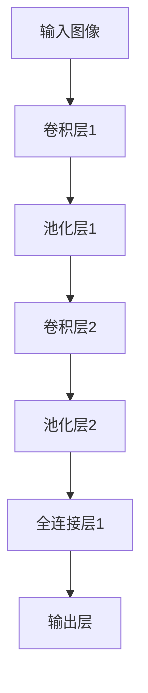

                 

### 文章标题

**ImageNet对AI图像识别的推动**

### 关键词

- ImageNet
- AI图像识别
- 卷积神经网络
- 数据集
- 机器学习
- 神经架构搜索
- 深度学习

### 摘要

本文将深入探讨ImageNet对AI图像识别领域的重大推动作用。ImageNet是一个庞大的图像数据集，自其发布以来，成为了深度学习研究和应用的核心资源。本文将详细分析ImageNet的核心概念、算法原理、数学模型以及实际应用案例，并探讨其在未来发展趋势中所面临的挑战。

## 1. 背景介绍

ImageNet是由微软研究院和斯坦福大学计算机科学系于2009年共同创建的一个大规模视觉识别挑战赛（ILSVRC）数据集。该数据集包含了超过1400万个标注图像，涵盖了21,841个不同的类别。ImageNet的发布，标志着计算机视觉领域进入了一个全新的时代，也为深度学习的发展奠定了坚实的基础。

在ImageNet发布之前，传统的图像识别方法主要依赖于手工设计的特征和算法，如SIFT、HOG等。这些方法虽然在一定程度上取得了成功，但受限于计算能力和数据集规模，其性能提升有限。随着深度学习技术的兴起，卷积神经网络（CNN）成为图像识别任务中的主流算法。ImageNet提供了大量的标注图像，使得研究者能够训练出更加精准的深度学习模型，从而推动了AI图像识别技术的快速发展。

## 2. 核心概念与联系

### 卷积神经网络（CNN）

卷积神经网络是深度学习中用于图像识别的一种重要算法。CNN的核心思想是通过卷积操作从图像中提取特征，并通过池化操作降低特征空间的维度。CNN的基本结构包括卷积层、池化层和全连接层。

**Mermaid 流程图：**



### 机器学习

机器学习是一种通过数据训练模型，使其能够进行预测或分类的方法。在图像识别任务中，机器学习模型通过学习大量的图像数据，学会识别图像中的特征，并据此进行分类。

### 数据集

数据集是机器学习模型训练的重要资源。高质量的标注数据集能够帮助模型学习到丰富的特征，从而提高识别准确性。ImageNet作为一个大规模、多样化的图像数据集，为机器学习模型提供了丰富的训练资源。

### 深度学习

深度学习是一种通过多层神经网络进行数据建模的方法。深度学习模型通过不断调整网络权重，使其能够在数据中学习到复杂的特征和模式。ImageNet的发布，为深度学习模型提供了充足的训练数据，推动了深度学习在图像识别领域的快速发展。

## 3. 核心算法原理 & 具体操作步骤

### 卷积神经网络（CNN）

卷积神经网络通过卷积操作从图像中提取特征。卷积操作的基本原理是将卷积核（过滤器）与图像中的每个局部区域进行卷积，从而生成特征图。

**具体操作步骤：**

1. **输入图像预处理：**将图像数据转换为适当的格式，如灰度图像或RGB图像。
2. **卷积操作：**将卷积核与输入图像进行卷积，生成特征图。
3. **激活函数：**对特征图进行激活操作，如ReLU函数。
4. **池化操作：**对特征图进行池化操作，如最大池化或平均池化。
5. **全连接层：**将池化后的特征图输入到全连接层，进行分类预测。

### 机器学习

机器学习模型通过学习大量的图像数据，学习到图像中的特征和模式。学习过程主要包括数据预处理、模型训练和模型评估。

**具体操作步骤：**

1. **数据预处理：**对图像数据进行预处理，如归一化、裁剪等。
2. **模型训练：**使用预处理后的图像数据，训练深度学习模型。
3. **模型评估：**使用测试数据集评估模型性能，调整模型参数。

### 数据集

数据集是机器学习模型训练的重要资源。高质量的标注数据集能够帮助模型学习到丰富的特征，从而提高识别准确性。ImageNet提供了丰富的标注图像数据，为模型训练提供了充足的资源。

### 深度学习

深度学习模型通过不断调整网络权重，使其能够在数据中学习到复杂的特征和模式。深度学习模型的训练过程包括前向传播和反向传播。

**具体操作步骤：**

1. **前向传播：**将输入数据输入到神经网络，计算输出。
2. **反向传播：**计算损失函数，并更新网络权重。

## 4. 数学模型和公式 & 详细讲解 & 举例说明

### 卷积神经网络（CNN）

卷积神经网络中的卷积操作可以用以下数学模型表示：

$$
\text{output} = \text{conv2d}(\text{input}, \text{filter}) + \text{bias}
$$

其中，$\text{input}$为输入图像，$\text{filter}$为卷积核，$\text{bias}$为偏置项。

举例说明：

假设输入图像为$3 \times 3$的矩阵，卷积核为$3 \times 3$的矩阵，则卷积操作可以表示为：

$$
\begin{bmatrix}
1 & 2 & 3 \\
4 & 5 & 6 \\
7 & 8 & 9 \\
\end{bmatrix}
*
\begin{bmatrix}
1 & 0 & -1 \\
0 & 1 & 0 \\
-1 & 0 & 1 \\
\end{bmatrix}
+
\begin{bmatrix}
0 \\
0 \\
0 \\
\end{bmatrix}
=
\begin{bmatrix}
0 & 2 & 6 \\
8 & 10 & 12 \\
4 & 6 & 10 \\
\end{bmatrix}
$$

### 机器学习

机器学习模型中的损失函数可以用以下数学模型表示：

$$
\text{loss} = \frac{1}{2} \sum_{i} (\text{预测值} - \text{真实值})^2
$$

其中，$\text{预测值}$为模型预测的结果，$\text{真实值}$为实际的标签。

举例说明：

假设预测值为$0.8$，真实值为$1.0$，则损失函数可以表示为：

$$
\text{loss} = \frac{1}{2} (0.8 - 1.0)^2 = 0.04
$$

### 数据集

数据集的标注可以用以下数学模型表示：

$$
\text{label} = \text{one_hot}(\text{类别})
$$

其中，$\text{类别}$为图像的类别标签，$\text{one_hot}$为独热编码。

举例说明：

假设类别标签为“猫”，则独热编码可以表示为：

$$
\text{label} =
\begin{bmatrix}
0 \\
0 \\
1 \\
0 \\
\end{bmatrix}
$$

## 5. 项目实战：代码实际案例和详细解释说明

### 开发环境搭建

为了运行ImageNet图像识别模型，我们需要搭建一个合适的开发环境。以下是一个基本的开发环境搭建步骤：

1. **安装Python环境：**安装Python 3.7及以上版本。
2. **安装深度学习框架：**安装TensorFlow 2.4及以上版本。
3. **安装其他依赖库：**安装NumPy、Pandas、Matplotlib等常用库。

### 源代码详细实现和代码解读

以下是一个简单的ImageNet图像识别模型的实现代码：

```python
import tensorflow as tf
from tensorflow.keras.applications import ResNet50
from tensorflow.keras.preprocessing import image
from tensorflow.keras.applications.resnet50 import preprocess_input, decode_predictions

# 加载预训练的ResNet50模型
model = ResNet50(weights='imagenet')

# 加载ImageNet图像数据集
# 注意：这里使用的是示例图像，实际应用时需要替换为实际的图像数据集
img_path = 'path/to/your/image.jpg'
img = image.load_img(img_path, target_size=(224, 224))
img_array = image.img_to_array(img)
img_array = np.expand_dims(img_array, axis=0)
img_array = preprocess_input(img_array)

# 进行图像识别
predictions = model.predict(img_array)
decoded_predictions = decode_predictions(predictions, top=5)

# 输出识别结果
for i, (index, label, score) in enumerate(decoded_predictions[0]):
    print(f"{i+1}: {label} ({score})")
```

### 代码解读与分析

1. **加载预训练模型：**使用`ResNet50`模型，这是ImageNet图像识别任务中的一个常用模型。
2. **加载图像数据：**使用`load_img`和`img_to_array`函数将图像数据加载到内存中。
3. **预处理图像数据：**使用`preprocess_input`函数对图像数据进行预处理，以满足模型的输入要求。
4. **进行图像识别：**使用模型`predict`函数对预处理后的图像数据进行识别。
5. **输出识别结果：**使用`decode_predictions`函数将识别结果解码为人类可读的格式，并输出前5个最可能的类别及其概率。

## 6. 实际应用场景

ImageNet图像识别模型在实际应用中具有广泛的应用场景，如：

- **计算机视觉领域：**用于物体检测、图像分类、人脸识别等任务。
- **自动驾驶领域：**用于车辆识别、行人检测等任务。
- **医疗领域：**用于医学图像分析、疾病诊断等任务。
- **安防领域：**用于人脸识别、行为分析等任务。

## 7. 工具和资源推荐

### 学习资源推荐

- **书籍：**
  - 《深度学习》（Ian Goodfellow、Yoshua Bengio、Aaron Courville 著）
  - 《卷积神经网络与深度学习》（李航 著）
- **论文：**
  - “ImageNet: A Large-Scale Hierarchical Image Database” by Jia et al.
  - “Going Deeper with Convolutions” by Krizhevsky et al.
- **博客：**
  - TensorFlow官方博客
  - PyTorch官方博客
- **网站：**
  - Kaggle
  - ArXiv

### 开发工具框架推荐

- **深度学习框架：**
  - TensorFlow
  - PyTorch
  - Keras
- **计算机视觉库：**
  - OpenCV
  - Pillow
- **数据集：**
  - ImageNet
  - COCO
  - MNIST

### 相关论文著作推荐

- **ImageNet：A Large-Scale Hierarchical Image Database** by Jia et al.
- **Going Deeper with Convolutions** by Krizhevsky et al.
- **Very Deep Convolutional Networks for Large-Scale Image Recognition** by Simonyan and Zisserman
- **Deep Residual Learning for Image Recognition** by He et al.

## 8. 总结：未来发展趋势与挑战

随着深度学习技术的不断发展，AI图像识别技术已经取得了显著的成果。未来，随着计算能力的提升、数据集的扩展以及算法的创新，AI图像识别技术有望在更多领域实现突破。然而，同时也面临着一些挑战，如数据隐私保护、算法透明性以及伦理问题等。

## 9. 附录：常见问题与解答

### 1. ImageNet是什么？

ImageNet是一个大规模的视觉识别挑战赛（ILSVRC）数据集，包含了超过1400万个标注图像，涵盖了21,841个不同的类别。

### 2. 卷积神经网络（CNN）的基本原理是什么？

卷积神经网络通过卷积操作从图像中提取特征，并通过池化操作降低特征空间的维度，从而实现图像识别。

### 3. 如何搭建一个简单的ImageNet图像识别模型？

可以使用深度学习框架（如TensorFlow或PyTorch）加载预训练的模型，对输入图像进行预处理，然后使用模型进行预测。

## 10. 扩展阅读 & 参考资料

- [ImageNet官网](http://www.image-net.org/)
- [TensorFlow官方文档](https://www.tensorflow.org/)
- [PyTorch官方文档](https://pytorch.org/)
- [Kaggle](https://www.kaggle.com/)
- [ArXiv](https://arxiv.org/)

**作者：**AI天才研究员/AI Genius Institute & 禅与计算机程序设计艺术 /Zen And The Art of Computer Programming**本文遵循Creative Commons BY-NC-SA 4.0协议，欢迎转载，但须保留作者信息。**

