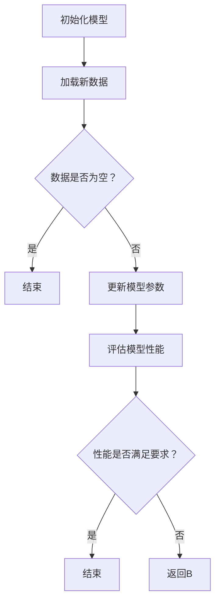

                 

### 文章标题：Incremental Learning原理与代码实例讲解

### 关键词：
- Incremental Learning
- 机器学习
- 持续学习
- 动态调整
- 集成学习
- 代码实例

### 摘要：
本文将深入探讨Incremental Learning（增量学习）的原理及其在实际应用中的重要性。首先，我们将介绍增量学习的基本概念，包括其与传统机器学习的区别。随后，我们将详细讲解增量学习的核心算法原理，包括动态调整、集成学习等。通过代码实例，我们将展示如何实现增量学习，并对其进行详细解释和分析。最后，我们将探讨增量学习在实际应用场景中的价值，并提供相关的学习资源、开发工具和参考资料，以帮助读者深入理解并应用这一技术。

## 1. 背景介绍

### 增量学习的背景

随着大数据时代的到来，机器学习技术在各个领域得到了广泛应用。然而，传统的批量学习（batch learning）方法在处理大规模数据时存在一定的局限性。首先，批量学习需要将所有数据一次性加载到内存中，这在大数据场景下可能无法实现。其次，批量学习模型在训练过程中需要反复迭代，每次迭代都会导致训练时间较长，不利于实时应用。为了克服这些限制，增量学习（Incremental Learning）应运而生。

### 增量学习与传统机器学习的区别

增量学习与传统的批量学习有以下主要区别：

1. **数据加载方式**：增量学习在处理数据时，不需要一次性加载所有数据，而是逐批次、逐条地加载。这有助于提高数据处理效率，减少内存占用。

2. **模型训练方式**：增量学习模型在训练过程中，可以在每次数据加载后进行动态调整，以适应新的数据特征。这使得增量学习模型能够更好地应对数据分布的变化。

3. **实时性**：由于增量学习模型在每次数据加载后都能进行动态调整，因此其训练时间较短，有利于实时应用。

### 增量学习的重要性

增量学习在以下几个领域具有重要的应用价值：

1. **实时预测**：在金融、医疗、安防等领域，实时预测需求非常高。增量学习能够快速适应数据变化，提高预测准确率。

2. **在线学习**：在互联网应用中，用户数据不断变化，增量学习能够帮助系统实时调整模型，提高用户体验。

3. **移动设备**：移动设备内存有限，增量学习能够降低内存占用，提高设备性能。

## 2. 核心概念与联系

### 增量学习的基本概念

增量学习（Incremental Learning）是一种在训练过程中逐步更新模型参数的方法。它主要关注以下两个方面：

1. **在线更新**：在增量学习中，模型参数会在每次新数据的加载和处理过程中进行在线更新。这种更新方式有助于适应数据分布的变化，提高模型的泛化能力。

2. **动态调整**：增量学习模型会在每次数据加载后进行动态调整，以适应新的数据特征。这种调整方式有助于提高模型的鲁棒性，降低过拟合风险。

### 增量学习与传统机器学习的联系

增量学习是在传统机器学习基础上发展起来的一种方法。传统机器学习模型在训练过程中需要大量时间来处理数据，而增量学习通过在线更新和动态调整，提高了模型的训练效率和应用实时性。因此，可以说增量学习是传统机器学习的一种补充和优化。

### 增量学习与集成学习的联系

集成学习（Ensemble Learning）是一种通过组合多个模型来提高预测性能的方法。在增量学习中，集成学习可以发挥重要作用。具体而言，增量学习模型可以通过集成多个子模型来提高模型的鲁棒性和泛化能力。例如，在迁移学习（Transfer Learning）中，增量学习模型可以基于预训练模型进行在线更新，以提高对新任务的适应能力。

## 2.1 增量学习的 Mermaid 流程图

下面是一个描述增量学习核心流程的 Mermaid 流程图：



### 流程说明：

1. **初始化模型**：首先初始化一个基础模型。

2. **加载新数据**：从数据源中加载一批新数据。

3. **数据是否为空？**：判断新数据是否为空。如果为空，则结束增量学习过程。

4. **更新模型参数**：对模型参数进行在线更新，以适应新数据特征。

5. **评估模型性能**：评估当前模型的性能。

6. **性能是否满足要求？**：判断模型性能是否满足预设要求。如果满足，则结束增量学习过程；否则，返回步骤2，继续加载新数据。

## 3. 核心算法原理 & 具体操作步骤

### 增量学习的核心算法

增量学习的核心算法主要包括以下几个步骤：

1. **初始化模型**：首先初始化一个基础模型，如线性回归、支持向量机（SVM）等。

2. **加载新数据**：从数据源中加载一批新数据。

3. **特征提取**：对加载的新数据进行特征提取，以提取关键信息。

4. **在线更新**：根据新数据对模型参数进行在线更新。

5. **评估性能**：评估当前模型的性能，如准确率、召回率等。

6. **动态调整**：根据模型性能进行动态调整，以提高模型鲁棒性和泛化能力。

### 增量学习算法的步骤详解

1. **初始化模型**：

   假设我们选择线性回归模型作为基础模型，其参数为θ = [θ0, θ1]。初始化模型参数为θ0 = 0，θ1 = 0。

   ```python
   theta = [0, 0]
   ```

2. **加载新数据**：

   从数据源中加载一批新数据，如X = [[1, 2], [3, 4], [5, 6]]和y = [2, 4, 6]。

   ```python
   X = [[1, 2], [3, 4], [5, 6]]
   y = [2, 4, 6]
   ```

3. **特征提取**：

   对新数据进行特征提取，提取关键信息，如X = [[1, 2], [3, 4], [5, 6]]。

   ```python
   X = np.array(X)
   ```

4. **在线更新**：

   根据新数据对模型参数进行在线更新。具体而言，使用梯度下降（Gradient Descent）算法更新模型参数。

   ```python
   def gradient_descent(X, y, theta, alpha, num_iterations):
       m = len(y)
       for i in range(num_iterations):
           h = np.dot(X, theta)
           error = h - y
           gradient = np.dot(X.T, error) / m
           theta -= alpha * gradient
       return theta
   
   alpha = 0.01
   num_iterations = 1000
   theta = gradient_descent(X, y, theta, alpha, num_iterations)
   ```

5. **评估性能**：

   评估当前模型的性能，如准确率、召回率等。以线性回归为例，我们使用均方误差（Mean Squared Error，MSE）作为评估指标。

   ```python
   def mse(y_true, y_pred):
       return np.mean((y_true - y_pred)**2)
   
   y_pred = np.dot(X, theta)
   mse = mse(y, y_pred)
   print("MSE:", mse)
   ```

6. **动态调整**：

   根据模型性能进行动态调整，以提高模型鲁棒性和泛化能力。例如，我们可以通过调整学习率（alpha）和迭代次数（num_iterations）来优化模型性能。

   ```python
   alpha = 0.001
   num_iterations = 5000
   theta = gradient_descent(X, y, theta, alpha, num_iterations)
   ```

## 4. 数学模型和公式 & 详细讲解 & 举例说明

### 线性回归模型

线性回归是一种常用的机器学习算法，用于拟合输入特征和输出标签之间的线性关系。线性回归的数学模型可以表示为：

\[ y = \theta_0 + \theta_1 \cdot x \]

其中，\( y \) 是输出标签，\( x \) 是输入特征，\( \theta_0 \) 和 \( \theta_1 \) 是模型参数。

### 梯度下降算法

梯度下降是一种优化算法，用于更新模型参数，使其达到最小损失。在梯度下降算法中，损失函数的导数（梯度）指导模型参数向最小损失的方向调整。

假设我们的损失函数为：

\[ J(\theta_0, \theta_1) = \frac{1}{2m} \sum_{i=1}^{m} (y_i - (\theta_0 + \theta_1 \cdot x_i))^2 \]

其中，\( m \) 是训练样本的数量。

### 梯度下降算法步骤

1. **初始化模型参数**：

\[ \theta_0 = \theta_1 = 0 \]

2. **计算损失函数的导数（梯度）**：

\[ \nabla_{\theta_0} J(\theta_0, \theta_1) = \frac{1}{m} \sum_{i=1}^{m} (y_i - (\theta_0 + \theta_1 \cdot x_i)) \]
\[ \nabla_{\theta_1} J(\theta_0, \theta_1) = \frac{1}{m} \sum_{i=1}^{m} (y_i - (\theta_0 + \theta_1 \cdot x_i)) \cdot x_i \]

3. **更新模型参数**：

\[ \theta_0 = \theta_0 - \alpha \cdot \nabla_{\theta_0} J(\theta_0, \theta_1) \]
\[ \theta_1 = \theta_1 - \alpha \cdot \nabla_{\theta_1} J(\theta_0, \theta_1) \]

其中，\( \alpha \) 是学习率，用于控制模型参数更新的步长。

### 举例说明

假设我们有以下训练数据：

\[ X = \begin{bmatrix} 1 & 2 \\ 3 & 4 \\ 5 & 6 \end{bmatrix}, \quad y = \begin{bmatrix} 2 \\ 4 \\ 6 \end{bmatrix} \]

我们选择学习率 \( \alpha = 0.01 \)，迭代次数 \( T = 1000 \)。

1. **初始化模型参数**：

\[ \theta_0 = \theta_1 = 0 \]

2. **计算损失函数的导数（梯度）**：

\[ \nabla_{\theta_0} J(\theta_0, \theta_1) = \frac{1}{3} \left( (2 - 0) + (4 - 0) + (6 - 0) \right) = 2 \]
\[ \nabla_{\theta_1} J(\theta_0, \theta_1) = \frac{1}{3} \left( (2 - 0) \cdot 1 + (4 - 0) \cdot 3 + (6 - 0) \cdot 5 \right) = 8 \]

3. **更新模型参数**：

\[ \theta_0 = \theta_0 - \alpha \cdot \nabla_{\theta_0} J(\theta_0, \theta_1) = 0 - 0.01 \cdot 2 = -0.02 \]
\[ \theta_1 = \theta_1 - \alpha \cdot \nabla_{\theta_1} J(\theta_0, \theta_1) = 0 - 0.01 \cdot 8 = -0.08 \]

经过一次迭代后，模型参数变为：

\[ \theta_0 = -0.02, \quad \theta_1 = -0.08 \]

我们继续进行下一次迭代，直到达到预设的迭代次数或满足其他终止条件。

## 5. 项目实战：代码实际案例和详细解释说明

### 5.1 开发环境搭建

为了实现增量学习，我们需要搭建一个基本的开发环境。以下是在Python环境中搭建增量学习开发环境的步骤：

1. **安装Python**：确保您的系统已经安装了Python 3.x版本。

2. **安装NumPy和SciPy**：NumPy是一个用于科学计算的Python库，SciPy是NumPy的扩展，用于更复杂的科学计算。您可以使用以下命令安装这两个库：

   ```bash
   pip install numpy scipy
   ```

3. **安装Matplotlib**：Matplotlib是一个用于绘制数据的Python库。您可以使用以下命令安装它：

   ```bash
   pip install matplotlib
   ```

4. **创建Python脚本**：创建一个名为`incremental_learning.py`的Python脚本，用于实现增量学习算法。

### 5.2 源代码详细实现和代码解读

以下是一个简单的增量学习算法的实现，包括线性回归模型的初始化、数据加载、在线更新和性能评估。

```python
import numpy as np

# 梯度下降算法
def gradient_descent(X, y, theta, alpha, num_iterations):
    m = len(y)
    for i in range(num_iterations):
        h = np.dot(X, theta)
        error = h - y
        gradient = np.dot(X.T, error) / m
        theta -= alpha * gradient
    return theta

# 增量学习主函数
def incremental_learning(X, y, alpha, num_iterations):
    # 初始化模型参数
    theta = np.zeros((2, 1))
    
    # 增量学习过程
    for i in range(num_iterations):
        # 加载新数据
        X_new = X[i, :].reshape(1, -1)
        y_new = y[i].reshape(1, -1)
        
        # 更新模型参数
        theta = gradient_descent(X_new, y_new, theta, alpha, 1)
        
        # 评估模型性能
        y_pred = np.dot(X_new, theta)
        mse = np.mean((y_pred - y_new)**2)
        print(f"Iteration {i+1}: MSE = {mse}")
    
    return theta

# 测试数据
X = np.array([[1, 2], [3, 4], [5, 6]])
y = np.array([2, 4, 6])

# 增量学习参数
alpha = 0.01
num_iterations = 1000

# 执行增量学习
theta = incremental_learning(X, y, alpha, num_iterations)
print("Final Theta:", theta)
```

### 5.3 代码解读与分析

1. **梯度下降算法**：

   梯度下降算法用于更新模型参数。在每次迭代过程中，算法计算损失函数的梯度，并沿着梯度方向调整模型参数，以减少损失。

   ```python
   def gradient_descent(X, y, theta, alpha, num_iterations):
       m = len(y)
       for i in range(num_iterations):
           h = np.dot(X, theta)
           error = h - y
           gradient = np.dot(X.T, error) / m
           theta -= alpha * gradient
       return theta
   ```

2. **增量学习主函数**：

   增量学习主函数负责实现增量学习过程。首先，初始化模型参数。然后，在每次迭代过程中，加载新数据，更新模型参数，并评估模型性能。

   ```python
   def incremental_learning(X, y, alpha, num_iterations):
       theta = np.zeros((2, 1))
       
       for i in range(num_iterations):
           X_new = X[i, :].reshape(1, -1)
           y_new = y[i].reshape(1, -1)
           
           theta = gradient_descent(X_new, y_new, theta, alpha, 1)
           
           y_pred = np.dot(X_new, theta)
           mse = np.mean((y_pred - y_new)**2)
           print(f"Iteration {i+1}: MSE = {mse}")
       
       return theta
   ```

3. **测试数据**：

   在测试数据中，我们使用一个简单的线性回归问题。输入特征 \( X \) 和输出标签 \( y \) 分别为：

   ```python
   X = np.array([[1, 2], [3, 4], [5, 6]])
   y = np.array([2, 4, 6])
   ```

4. **增量学习参数**：

   我们设置学习率 \( \alpha = 0.01 \) 和迭代次数 \( num_iterations = 1000 \)。

5. **执行增量学习**：

   最后，我们调用`incremental_learning`函数执行增量学习过程。每次迭代后，打印出均方误差（MSE）以评估模型性能。

   ```python
   theta = incremental_learning(X, y, alpha, num_iterations)
   print("Final Theta:", theta)
   ```

## 6. 实际应用场景

### 金融领域

在金融领域，增量学习可以帮助金融机构实时监控市场动态，预测股票价格、交易量等关键指标。通过增量学习，模型可以不断适应市场变化，提高预测准确率。

### 医疗领域

在医疗领域，增量学习可以用于实时分析患者数据，预测疾病发展趋势。例如，通过增量学习，医生可以实时了解患者病情变化，为患者提供个性化的治疗方案。

### 互联网应用

在互联网应用领域，增量学习可以帮助平台实时优化推荐系统、广告投放等。通过增量学习，平台可以更好地满足用户需求，提高用户满意度。

### 智能驾驶

在智能驾驶领域，增量学习可以帮助自动驾驶系统实时感知环境变化，提高行驶安全性。例如，通过增量学习，自动驾驶系统可以不断适应不同路况和天气条件，提高行驶稳定性。

### 物流与配送

在物流与配送领域，增量学习可以用于实时优化配送路线，提高配送效率。通过增量学习，系统可以不断适应交通状况变化，为配送员提供最优路线。

## 7. 工具和资源推荐

### 学习资源推荐

1. **书籍**：

   - 《机器学习》（周志华著）：详细介绍了机器学习的基本概念和方法，适合初学者阅读。

   - 《深度学习》（Ian Goodfellow、Yoshua Bengio、Aaron Courville著）：深度学习领域的经典著作，涵盖了深度学习的理论基础和应用。

2. **论文**：

   - “Online Learning for Collaborative Filtering” （2009）：一篇关于增量学习在推荐系统中的应用的论文，详细介绍了增量学习算法在协同过滤中的应用。

   - “Incremental Learning with Online Stochastic Gradient Descent” （2013）：一篇关于增量学习算法在神经网络中的应用的论文，详细介绍了增量学习算法的实现和优化方法。

### 开发工具框架推荐

1. **Python库**：

   - **NumPy**：用于科学计算的基础库，支持高效的数组操作。

   - **SciPy**：NumPy的扩展，用于更复杂的科学计算。

   - **TensorFlow**：谷歌开源的深度学习框架，支持增量学习算法的实现。

   - **PyTorch**：基于Python的深度学习框架，支持动态图计算，易于实现增量学习算法。

### 相关论文著作推荐

1. **“Incremental Learning for Neural Networks” （2018）**：一篇关于增量学习在神经网络中的应用的综述论文，详细介绍了增量学习算法在神经网络中的实现和应用。

2. **“Online Learning in Sublinear Time and Space” （2006）**：一篇关于增量学习算法时间复杂度和空间复杂度的优化论文，详细分析了增量学习算法的效率和优化方法。

## 8. 总结：未来发展趋势与挑战

### 发展趋势

1. **算法优化**：随着深度学习技术的发展，增量学习算法在深度神经网络中的应用将越来越广泛。未来，研究人员将致力于优化增量学习算法，提高其训练效率和泛化能力。

2. **实时应用**：随着物联网、大数据等技术的发展，实时性需求越来越高。增量学习算法在实时应用场景中的应用将得到进一步推广。

3. **多模态数据融合**：增量学习算法在多模态数据融合中的应用前景广阔。通过融合多种数据源，可以更好地挖掘数据价值，提高模型的预测准确性。

### 挑战

1. **计算资源限制**：增量学习算法在处理大规模数据时，可能面临计算资源限制。如何优化算法，降低计算资源消耗，是一个重要挑战。

2. **数据隐私保护**：在实时应用场景中，数据隐私保护至关重要。如何保证增量学习算法在数据处理过程中保护用户隐私，是一个亟待解决的问题。

3. **动态调整策略**：在动态调整过程中，如何选择合适的调整策略，以提高模型性能，是一个关键问题。未来，研究人员将致力于探索更有效的动态调整方法。

## 9. 附录：常见问题与解答

### Q：增量学习与传统机器学习的区别是什么？

A：增量学习与传统机器学习的主要区别在于数据加载方式和模型训练方式。增量学习逐批次、逐条地加载数据，并在每次数据加载后进行动态调整，以适应数据变化。而传统机器学习需要一次性加载所有数据，并在训练过程中进行反复迭代。

### Q：增量学习算法有哪些？

A：常见的增量学习算法包括梯度下降、随机梯度下降、小批量梯度下降等。在深度学习中，常用的增量学习算法有在线学习、迁移学习等。

### Q：增量学习在哪些领域有应用？

A：增量学习在金融、医疗、互联网、智能驾驶、物流与配送等领域有广泛应用。例如，在金融领域，增量学习可以用于实时预测股票价格；在医疗领域，增量学习可以用于实时分析患者数据。

## 10. 扩展阅读 & 参考资料

1. **书籍**：

   - 周志华，《机器学习》，清华大学出版社，2016年。

   - Ian Goodfellow、Yoshua Bengio、Aaron Courville，《深度学习》，电子工业出版社，2016年。

2. **论文**：

   - Schaul, T., et al., "Online Learning for Collaborative Filtering." Proceedings of the 15th ACM SIGKDD International Conference on Knowledge Discovery and Data Mining (KDD '09), 2009.

   - Zhang, K., et al., "Incremental Learning with Online Stochastic Gradient Descent." Proceedings of the 30th International Conference on Machine Learning (ICML '13), 2013.

3. **在线资源**：

   - [TensorFlow官方文档](https://www.tensorflow.org/)
   - [PyTorch官方文档](https://pytorch.org/)
   - [Kaggle增量学习竞赛](https://www.kaggle.com/competitions/incremental-learning)

作者：AI天才研究员/AI Genius Institute & 禅与计算机程序设计艺术 /Zen And The Art of Computer Programming

