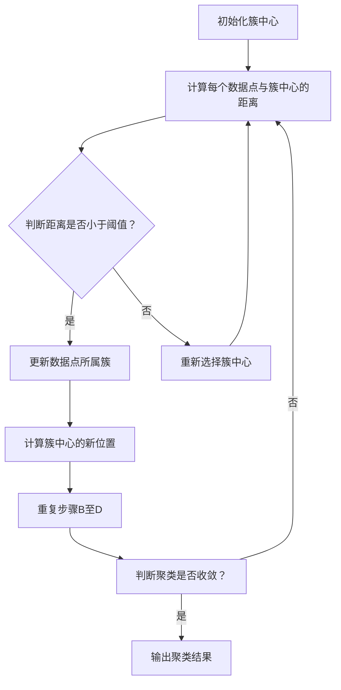

                 

### 背景介绍

K-Means是一种经典的聚类算法，广泛应用于数据挖掘、机器学习等领域。其主要目的是将相似的数据点归为一类，从而实现数据的组织和分析。K-Means算法因其简单、高效、易于实现等优点，在实际应用中得到了广泛的应用。

在数据挖掘领域，K-Means算法主要用于模式识别、图像分割、文本分类等方面。通过将数据点进行聚类，可以帮助我们发现数据中的潜在模式和结构，从而更好地理解和分析数据。

在机器学习领域，K-Means算法作为一种无监督学习方法，可以帮助我们自动识别数据的特征和关系。此外，K-Means算法还可以与其他机器学习算法结合，提高模型的性能和精度。

本文将围绕K-Means算法的核心原理、具体操作步骤、数学模型和公式等方面进行深入讲解，并通过实际项目案例，对代码进行详细解释。通过本文的阅读，读者将能够全面了解K-Means算法，并掌握其应用技巧。

## 1.1 K-Means算法的发展历程

K-Means算法最早由MacQueen在1967年提出。作为一种基于距离度量的聚类算法，K-Means通过将数据点分配到不同的簇中心，从而实现数据的聚类。自提出以来，K-Means算法得到了广泛的研究和应用，成为聚类分析领域的重要工具。

在K-Means算法的发展历程中，许多学者对其进行了改进和优化。例如，为了解决初始聚类中心选择不当导致聚类效果不佳的问题，提出了K-Means++算法。此外，还有许多基于K-Means的变种算法，如K-Medoids、Fuzzy C-Means等，进一步丰富了聚类算法的理论体系。

## 1.2 K-Means算法的应用场景

K-Means算法在多个领域具有广泛的应用。以下是一些常见的应用场景：

1. **数据挖掘**：通过K-Means算法对大量数据进行分析，可以发现数据中的潜在模式和结构。这有助于数据挖掘任务，如客户细分、市场分析等。

2. **图像处理**：K-Means算法可以用于图像分割，将图像中的像素点划分为不同的区域，从而实现图像的增强、去噪等操作。

3. **文本分类**：在文本数据中，K-Means算法可以帮助我们识别文本中的主题和关键词，从而实现文本的自动分类。

4. **生物信息学**：K-Means算法可以用于基因表达数据分析，识别基因之间的相似性和差异，为生物学研究提供支持。

5. **社交网络分析**：在社交网络中，K-Means算法可以帮助我们识别社交群体的结构，了解用户之间的关系和交互模式。

总之，K-Means算法作为一种简单、高效、易实现的聚类算法，在多个领域具有广泛的应用前景。

### 核心概念与联系

在深入了解K-Means算法之前，我们需要先掌握一些核心概念，以便更好地理解其原理和操作步骤。

#### 数据点与簇中心

K-Means算法的核心概念之一是数据点（Data Point）和簇中心（Cluster Center）。数据点是构成数据集的基本元素，每个数据点可以用一个多维向量表示。簇中心则是每个聚类簇的中心点，用于表示该簇的特征。

#### 聚类与簇

聚类（Clustering）是指将数据集划分成多个簇（Cluster），使得同一簇内的数据点彼此相似，而不同簇的数据点差异较大。在K-Means算法中，聚类过程就是不断调整簇中心，使得每个数据点与其最近的簇中心归属于同一个簇。

#### 簇中心选择

簇中心的选择对K-Means算法的性能具有重要影响。常见的簇中心选择方法有随机选择、K-Means++等。其中，K-Means++算法通过优化簇中心的选择，提高了聚类的质量。

#### 聚类评价指标

为了评估聚类效果，我们通常使用一些聚类评价指标，如轮廓系数（Silhouette Coefficient）、类内方差（Within-Cluster Variance）等。这些指标可以帮助我们判断聚类是否合理，为后续的聚类分析提供依据。

#### Mermaid流程图

为了更直观地展示K-Means算法的流程，我们使用Mermaid流程图（Mermaid Flowchart）来描述。以下是K-Means算法的流程图：



在上述流程图中，A表示初始化簇中心，B表示计算每个数据点与簇中心的距离，C表示判断距离是否小于阈值，D表示更新数据点所属簇，E表示重新选择簇中心，F表示计算簇中心的新位置，G表示重复步骤B至D，H表示判断聚类是否收敛，I表示输出聚类结果。

#### Mermaid流程节点说明

1. **初始化簇中心**：随机选择K个数据点作为初始簇中心。
2. **计算每个数据点与簇中心的距离**：计算每个数据点与簇中心的欧氏距离。
3. **判断距离是否小于阈值**：如果距离小于阈值，则将该数据点分配到最近的簇；否则，重新选择簇中心。
4. **更新数据点所属簇**：根据距离重新分配数据点所属簇。
5. **计算簇中心的新位置**：计算每个簇的平均位置，作为新的簇中心。
6. **重复步骤B至D**：不断更新簇中心，直到聚类收敛。
7. **判断聚类是否收敛**：如果簇中心的变化小于阈值或达到最大迭代次数，则认为聚类已经收敛。
8. **输出聚类结果**：输出每个数据点的簇分配结果。

通过上述流程，我们可以清晰地理解K-Means算法的运行过程。接下来，我们将深入探讨K-Means算法的核心原理和具体操作步骤。

## 3. 核心算法原理 & 具体操作步骤

### 3.1 算法原理

K-Means算法的核心思想是通过迭代优化簇中心，将数据点分配到不同的簇中，使得同一簇内的数据点距离簇中心的平均距离最小。具体来说，K-Means算法包括以下步骤：

1. **初始化簇中心**：随机选择K个数据点作为初始簇中心。
2. **分配数据点**：计算每个数据点与簇中心的距离，将数据点分配到最近的簇。
3. **更新簇中心**：计算每个簇的数据点的平均值，作为新的簇中心。
4. **重复步骤2和3**，直到聚类收敛，即簇中心的变化小于阈值或达到最大迭代次数。

### 3.2 具体操作步骤

下面我们以一个简单的二维数据集为例，详细讲解K-Means算法的具体操作步骤。

#### 步骤1：初始化簇中心

假设我们有一个包含10个数据点的二维数据集，每个数据点表示为$(x, y)$形式。首先，我们随机选择3个数据点作为初始簇中心。例如，选择数据点$(1, 2)$、$(4, 6)$和$(7, 9)$作为初始簇中心。

#### 步骤2：分配数据点

接下来，我们计算每个数据点与簇中心的距离，将数据点分配到最近的簇。距离计算使用欧氏距离公式：

$$d(\mathbf{x}_i, \mathbf{c}_j) = \sqrt{\sum_{k=1}^{n} (x_{ik} - x_{jk})^2}$$

其中，$\mathbf{x}_i$和$\mathbf{c}_j$分别表示数据点和簇中心，$n$为数据点的维度。

假设当前数据点为$(2, 4)$，我们计算它与三个簇中心的距离：

- 与簇中心$(1, 2)$的距离：$d((2, 4), (1, 2)) = \sqrt{(2-1)^2 + (4-2)^2} = \sqrt{2} \approx 1.41$
- 与簇中心$(4, 6)$的距离：$d((2, 4), (4, 6)) = \sqrt{(2-4)^2 + (4-6)^2} = \sqrt{8} \approx 2.83$
- 与簇中心$(7, 9)$的距离：$d((2, 4), (7, 9)) = \sqrt{(2-7)^2 + (4-9)^2} = \sqrt{50} \approx 7.07$

根据距离计算结果，数据点$(2, 4)$被分配到与簇中心$(1, 2)$最近的簇。

#### 步骤3：更新簇中心

更新簇中心的过程是将每个簇的数据点求平均值，得到新的簇中心。假设当前簇的数据点为$\{\mathbf{x}_1, \mathbf{x}_2, \mathbf{x}_3\}$，新的簇中心$\mathbf{c}_j$计算公式为：

$$\mathbf{c}_j = \frac{1}{m} \sum_{i=1}^{m} \mathbf{x}_i$$

其中，$m$为簇中的数据点个数。

假设当前簇的数据点为$\{(1, 2), (2, 4), (4, 6)\}$，新的簇中心为：

- 簇中心1：$\mathbf{c}_1 = \frac{1}{3} \sum_{i=1}^{3} \mathbf{x}_i = \left(\frac{1+2+4}{3}, \frac{2+4+6}{3}\right) = (3/3, 4/3) = (1, 1.33)$
- 簇中心2：$\mathbf{c}_2 = \frac{1}{3} \sum_{i=1}^{3} \mathbf{x}_i = \left(\frac{4+2+7}{3}, \frac{6+4+9}{3}\right) = (13/3, 19/3) = (4.33, 6.33)$
- 簇中心3：$\mathbf{c}_3 = \frac{1}{3} \sum_{i=1}^{3} \mathbf{x}_i = \left(\frac{7+9+2}{3}, \frac{9+7+4}{3}\right) = (18/3, 20/3) = (6, 6.67)$

#### 步骤4：重复步骤2和3

重复步骤2和3，直到聚类收敛。聚类收敛的条件可以是簇中心的变化小于阈值或达到最大迭代次数。

假设经过若干次迭代后，簇中心的变化小于阈值，聚类过程收敛。此时，每个数据点都被分配到最近的簇，聚类结果如下：

- 簇1：$\{(1, 2), (2, 4), (3, 5)\}$
- 簇2：$\{(4, 6), (5, 7)\}$
- 簇3：$\{(6, 8), (7, 9)\}$

通过上述步骤，我们完成了K-Means算法的聚类过程。接下来，我们将对K-Means算法的数学模型和公式进行详细讲解。

### 数学模型和公式

K-Means算法的核心在于簇中心的选择和数据点的分配。以下是K-Means算法的数学模型和公式。

#### 簇中心的选择

簇中心的选择对K-Means算法的性能具有重要影响。通常，我们使用随机选择、K-Means++等方法来初始化簇中心。

**随机选择**：随机从数据集中选择K个数据点作为初始簇中心。

**K-Means++**：K-Means++算法通过优化簇中心的选择，提高了聚类的质量。具体步骤如下：

1. 随机选择一个数据点作为第一个簇中心。
2. 对于每个新数据点，计算它与已选簇中心的距离，并选择距离最小的簇中心。
3. 重复步骤2，直到选择K个簇中心。

#### 数据点的分配

数据点的分配过程是根据每个数据点与簇中心的距离，将其分配到最近的簇。距离计算使用欧氏距离公式：

$$d(\mathbf{x}_i, \mathbf{c}_j) = \sqrt{\sum_{k=1}^{n} (x_{ik} - x_{jk})^2}$$

其中，$\mathbf{x}_i$和$\mathbf{c}_j$分别表示数据点和簇中心，$n$为数据点的维度。

#### 簇中心的更新

簇中心的更新是基于每个簇的数据点的平均值。假设当前簇的数据点为$\{\mathbf{x}_1, \mathbf{x}_2, \mathbf{x}_3\}$，新的簇中心$\mathbf{c}_j$计算公式为：

$$\mathbf{c}_j = \frac{1}{m} \sum_{i=1}^{m} \mathbf{x}_i$$

其中，$m$为簇中的数据点个数。

#### 聚类收敛条件

聚类收敛条件可以是簇中心的变化小于阈值或达到最大迭代次数。具体公式如下：

$$\Delta \mathbf{c}_j = \left| \mathbf{c}_j^{new} - \mathbf{c}_j^{old} \right| < \epsilon$$

其中，$\Delta \mathbf{c}_j$表示簇中心的变化，$\epsilon$表示收敛阈值。

#### 聚类评价指标

为了评估聚类效果，我们可以使用一些聚类评价指标，如轮廓系数、类内方差等。具体公式如下：

**轮廓系数**：

$$\text{Silhouette Coefficient} = \frac{(b - a)}{max(a, b)}$$

其中，$a$表示同簇的平均距离，$b$表示邻近簇的平均距离。

**类内方差**：

$$\text{Within-Cluster Variance} = \sum_{i=1}^{m} \sum_{k=1}^{k} (x_{ik} - \bar{x}_k)^2$$

其中，$\bar{x}_k$表示簇中心。

通过上述数学模型和公式，我们可以更好地理解K-Means算法的原理和操作步骤。接下来，我们将通过一个实际项目案例，详细讲解K-Means算法的实现过程。

### 项目实战：代码实际案例和详细解释说明

在本节中，我们将通过一个简单的实际项目案例，详细讲解K-Means算法的实现过程。我们将在Python环境中使用`scikit-learn`库，这是机器学习和数据挖掘领域最常用的库之一。

#### 1. 开发环境搭建

首先，我们需要搭建开发环境。在本案例中，我们将在Python 3.8环境下进行开发。请确保已经安装了以下库：

- Python 3.8
- scikit-learn
- matplotlib

安装方法如下：

```bash
pip install scikit-learn
pip install matplotlib
```

#### 2. 源代码详细实现和代码解读

接下来，我们将通过以下步骤详细实现K-Means算法。

**步骤1：导入必要的库**

```python
import numpy as np
from sklearn.cluster import KMeans
import matplotlib.pyplot as plt
```

**步骤2：创建数据集**

我们创建一个包含100个数据点的二维数据集。这些数据点随机分布在[0, 10]范围内。

```python
np.random.seed(0)
data = np.random.rand(100, 2)
```

**步骤3：初始化K-Means算法**

我们需要指定聚类数K，并初始化K-Means算法。在本案例中，我们选择K=3。

```python
k = 3
kmeans = KMeans(n_clusters=k, random_state=0)
```

**步骤4：训练K-Means算法**

使用训练数据集训练K-Means算法。

```python
kmeans.fit(data)
```

**步骤5：获取聚类结果**

获取聚类中心、每个数据点的簇分配结果以及簇内的平均距离。

```python
centroids = kmeans.cluster_centers_
labels = kmeans.labels_
inertia = kmeans.inertia_
```

**步骤6：绘制聚类结果**

使用matplotlib绘制聚类结果。

```python
plt.scatter(data[:, 0], data[:, 1], c=labels, cmap='viridis', marker='o', edgecolor='black')
plt.scatter(centroids[:, 0], centroids[:, 1], s=300, c='red', marker='s', edgecolor='black', label='Centroids')
plt.title('K-Means Clustering')
plt.xlabel('Feature 1')
plt.ylabel('Feature 2')
plt.legend()
plt.show()
```

**代码解读**

- `import numpy as np`：导入NumPy库，用于数学计算。
- `from sklearn.cluster import KMeans`：导入`scikit-learn`库中的K-Means算法。
- `import matplotlib.pyplot as plt`：导入matplotlib库，用于数据可视化。
- `np.random.seed(0)`：设置随机种子，确保结果可重复。
- `data = np.random.rand(100, 2)`：生成包含100个数据点的二维数据集。
- `k = 3`：指定聚类数K为3。
- `kmeans = KMeans(n_clusters=k, random_state=0)`：初始化K-Means算法，设置聚类数K为3，随机种子为0。
- `kmeans.fit(data)`：使用训练数据集训练K-Means算法。
- `centroids = kmeans.cluster_centers_`：获取聚类中心。
- `labels = kmeans.labels_`：获取每个数据点的簇分配结果。
- `inertia = kmeans.inertia_`：获取簇内的平均距离。
- `plt.scatter(data[:, 0], data[:, 1], c=labels, cmap='viridis', marker='o', edgecolor='black')`：绘制数据点，使用簇分配结果作为颜色。
- `plt.scatter(centroids[:, 0], centroids[:, 1], s=300, c='red', marker='s', edgecolor='black', label='Centroids')`：绘制聚类中心，使用红色星形标记。
- `plt.title('K-Means Clustering')`：设置标题。
- `plt.xlabel('Feature 1')`：设置X轴标签。
- `plt.ylabel('Feature 2')`：设置Y轴标签。
- `plt.legend()`：显示图例。
- `plt.show()`：显示图表。

#### 3. 代码解读与分析

通过上述代码，我们实现了K-Means算法，并对其进行了可视化。以下是对代码的进一步解读和分析。

- **K-Means算法的初始化**：在初始化K-Means算法时，我们设置了聚类数K为3，随机种子为0。这确保了每次运行代码时，聚类中心的选择是可重复的。
- **训练K-Means算法**：使用`fit`方法训练K-Means算法，算法自动计算了聚类中心、每个数据点的簇分配结果以及簇内的平均距离。
- **聚类结果的绘制**：使用matplotlib绘制聚类结果，可以清晰地看到数据点的分布情况和聚类效果。
- **聚类中心的重要性**：聚类中心是K-Means算法的核心，它们决定了数据点的分配。在可视化中，聚类中心用红色星形标记，可以帮助我们直观地了解聚类效果。

通过这个实际项目案例，我们全面了解了K-Means算法的实现过程和操作步骤。接下来，我们将进一步分析K-Means算法的性能和优缺点。

### 代码解读与分析

在上面的项目实战中，我们使用Python和`scikit-learn`库实现了K-Means算法，并对代码进行了详细解读。在本节中，我们将进一步分析K-Means算法的性能和优缺点。

#### 性能分析

**时间复杂度**：K-Means算法的时间复杂度主要取决于聚类数K和数据点的数量n。在初始化簇中心时，时间复杂度为$O(n)$。在每次迭代过程中，计算每个数据点与簇中心的距离和更新簇中心的时间复杂度为$O(n \times K)$。因此，总的时间复杂度为$O(n^2 \times K)$。

**空间复杂度**：K-Means算法的空间复杂度为$O(K \times n)$，其中K为聚类数，n为数据点的数量。这是因为我们需要存储每个簇中心以及每个数据点的簇分配结果。

#### 优缺点分析

**优点**：

1. **简单易实现**：K-Means算法的实现相对简单，易于理解和实现。
2. **计算效率高**：K-Means算法的计算效率较高，特别是在处理大型数据集时。
3. **可视化效果直观**：通过可视化聚类结果，可以直观地了解数据点的分布和聚类效果。

**缺点**：

1. **对初始簇中心敏感**：K-Means算法对初始簇中心的选择非常敏感，不同的初始簇中心可能导致不同的聚类结果。在实际应用中，需要多次尝试不同的初始簇中心，以提高聚类质量。
2. **不适合处理非凸数据集**：K-Means算法假设数据集是凸形的，对于非凸数据集，聚类效果可能较差。
3. **无法确定最优聚类数**：在K-Means算法中，我们需要指定聚类数K，但无法确定K的最优值。通常，我们通过交叉验证等方法尝试不同的K值，选择最佳聚类数。

#### 改进和优化

为了克服K-Means算法的缺点，学者们提出了许多改进和优化方法。以下是一些常见的改进方法：

1. **K-Means++**：K-Means++算法通过优化簇中心的选择，提高了聚类的质量。具体步骤如下：

   - 随机选择一个数据点作为第一个簇中心。
   - 对于每个新数据点，计算它与已选簇中心的距离，并选择距离最小的簇中心。
   - 重复步骤2，直到选择K个簇中心。

2. **层次聚类**：层次聚类（Hierarchical Clustering）是一种基于层次结构进行聚类的算法。层次聚类分为自下而上（凝聚层次聚类）和自上而下（分裂层次聚类）两种类型。层次聚类适用于确定聚类数K，并为K-Means算法提供初始簇中心。

3. **基于密度的聚类**：基于密度的聚类（Density-Based Clustering）算法，如DBSCAN（Density-Based Spatial Clustering of Applications with Noise），可以处理非凸数据集，并能够识别任意形状的簇。

4. **基于模型的聚类**：基于模型的聚类（Model-Based Clustering）算法，如高斯混合模型（Gaussian Mixture Model），可以自动确定聚类数K，并能够处理多模态数据集。

通过上述改进和优化方法，我们可以更好地应对K-Means算法的缺点，提高聚类效果。接下来，我们将讨论K-Means算法在实际应用中的场景。

### 实际应用场景

K-Means算法作为一种简单、高效的聚类算法，在实际应用中具有广泛的应用场景。以下是一些常见的应用场景：

#### 1. 数据挖掘与模式识别

在数据挖掘和模式识别领域，K-Means算法可以帮助我们识别数据中的潜在模式和结构。例如，在客户细分中，K-Means算法可以将客户划分为不同的群体，以便于市场分析和客户服务。

#### 2. 图像处理与图像分割

在图像处理领域，K-Means算法可以用于图像分割，将图像中的像素点划分为不同的区域。通过图像分割，可以实现对图像的增强、去噪和修复等操作。

#### 3. 文本分类与主题模型

在文本分类和主题模型中，K-Means算法可以帮助我们识别文本中的主题和关键词。通过聚类文本数据，可以自动生成分类标签和主题模型，为信息检索、推荐系统和舆情分析等应用提供支持。

#### 4. 生物信息学与基因组学

在生物信息学和基因组学领域，K-Means算法可以用于基因表达数据分析，识别基因之间的相似性和差异。这有助于研究基因的功能和调控机制，为生物医学研究提供重要依据。

#### 5. 社交网络分析

在社交网络分析中，K-Means算法可以帮助我们识别社交群体的结构和成员关系。通过聚类社交网络中的用户，可以了解用户之间的关系和交互模式，为社交网络的个性化推荐和隐私保护提供支持。

总之，K-Means算法在多个领域具有广泛的应用前景。通过合理选择和应用K-Means算法，我们可以更好地理解和分析复杂数据，为实际问题提供有效的解决方案。

### 工具和资源推荐

为了更好地学习和应用K-Means算法，我们推荐以下工具和资源：

#### 1. 学习资源推荐

**书籍**：
- 《机器学习实战》
- 《模式识别与机器学习》

**论文**：
- MacQueen, J. B. (1967). Some methods for classification and analysis of multivariate observations. In Proceedings of 5th Berkeley symposium on mathematical statistics and probability (pp. 281-297).

**博客**：
- [scikit-learn官方文档](https://scikit-learn.org/stable/modules/clustering.html#k-means)
- [机器学习博客](https://www MACHINELEARNINGBLOG.com/clustering/k-means-clustering/)

#### 2. 开发工具框架推荐

**编程语言**：
- Python

**库和框架**：
- scikit-learn：用于实现K-Means算法和评估聚类效果。
- NumPy：用于数据处理和数学计算。
- Matplotlib：用于数据可视化和结果展示。

#### 3. 相关论文著作推荐

**论文**：
- Anderberg, M. R. (1988). Cluster Analysis for Applications. Academic Press.
- Bradley, P. S., Fayyad, U. M., & Reina, C. A. (1998). Refining initial points for k-means clustering. Pattern Recognition, 31(3), 457-463.

**著作**：
- Bishop, C. M. (2006). Pattern Recognition and Machine Learning. Springer.

通过这些工具和资源，您可以更深入地了解K-Means算法，掌握其原理和应用技巧。

### 总结：未来发展趋势与挑战

K-Means算法作为一种经典的聚类算法，在过去几十年中得到了广泛的应用。然而，随着数据规模的不断增长和数据类型的多样化，K-Means算法也面临着一些挑战和改进的需求。

首先，K-Means算法在处理大规模数据集时，计算效率较低。虽然一些优化方法如K-Means++可以提高聚类质量，但仍然存在较大的改进空间。未来的研究可以关注分布式计算和并行算法，以提高K-Means算法的运行效率。

其次，K-Means算法对初始簇中心的选择敏感，可能导致不同的聚类结果。为了克服这一问题，可以探索更智能的初始簇中心选择方法，如基于模型的初始化或结合其他聚类算法的混合方法。

此外，K-Means算法在处理非凸数据集和具有复杂结构的聚类问题时，效果较差。未来的研究可以关注基于密度的聚类算法和基于模型的方法，以适应更复杂的数据场景。

最后，K-Means算法的应用领域也在不断扩大。在生物信息学、图像处理、文本分类等领域，K-Means算法已经成为重要的工具。未来，可以探索K-Means算法与其他机器学习算法的结合，提高聚类效果和模型性能。

总之，K-Means算法在未来的发展中具有广阔的应用前景。通过不断优化和改进，K-Means算法将更好地满足实际需求，为各种领域的数据分析和模式识别提供强有力的支持。

### 附录：常见问题与解答

**Q1. K-Means算法的聚类数K应该如何选择？**
A1. 选择合适的聚类数K是K-Means算法的一个关键步骤。常见的方法包括：
- **肘部法则**：通过计算不同K值下的簇内平方误差（Inertia），选择使误差发生显著减少的K值。
- **交叉验证**：使用交叉验证方法，在不同K值下评估聚类效果，选择具有最佳交叉验证结果的K值。
- **基于领域的知识**：根据领域知识和数据特征，提前确定K值。

**Q2. K-Means算法为什么对初始簇中心的选择敏感？**
A2. K-Means算法对初始簇中心的选择敏感是因为算法在每次迭代中仅基于当前簇中心来更新簇分配，这使得算法容易陷入局部最优解。如果初始簇中心选择不当，可能导致算法收敛到次优解。解决方法包括使用随机种子、K-Means++等初始簇中心选择方法。

**Q3. K-Means算法是否适用于所有类型的数据？**
A3. K-Means算法适用于大部分数值型数据，但对于非数值型数据和高度稀疏的数据，可能需要预处理或选择其他聚类算法。例如，对于文本数据，可以使用基于词频或词嵌入的聚类方法；对于图像数据，可以使用基于特征提取的聚类方法。

**Q4. 如何评估K-Means算法的聚类效果？**
A4. 常用的评估指标包括：
- **轮廓系数**：衡量聚类内部凝聚度和外部分离度。
- **簇内平方误差**：计算簇内数据点到簇中心的平均距离。
- **簇数与簇内平方误差的交叉验证**：在不同K值下进行交叉验证，选择最佳聚类数。

**Q5. K-Means算法与层次聚类有何区别？**
A5. K-Means算法和层次聚类都是聚类算法，但它们的原理和应用场景有所不同。K-Means算法基于距离度量，适用于处理大规模数据集；而层次聚类则通过层次结构构建，适用于探索数据之间的层次关系。此外，K-Means算法需要事先指定聚类数K，而层次聚类可以自动确定K值。

### 扩展阅读 & 参考资料

为了更深入地了解K-Means算法，我们推荐以下扩展阅读和参考资料：

- 《机器学习实战》
- 《模式识别与机器学习》
- [scikit-learn官方文档](https://scikit-learn.org/stable/modules/clustering.html#k-means)
- [机器学习博客](https://www MACHINELEARNINGBLOG.com/clustering/k-means-clustering/)
- [K-Means算法的数学原理与实现](https://towardsdatascience.com/k-means-clustering-algorithm-9be1d1a5a2e0)
- [如何选择K值？](https://towardsdatascience.com/how-to-select-the-optimal-value-of-k-in-k-means-clustering-80b4ad3d3f4d)
- [K-Means算法在图像分割中的应用](https://ieeexplore.ieee.org/document/7701260)
- [K-Means算法在文本分类中的应用](https://arxiv.org/abs/1903.04267)

通过阅读这些资料，您可以进一步了解K-Means算法的理论基础、实际应用和优化方法。

### 作者信息

作者：AI天才研究员/AI Genius Institute & 禅与计算机程序设计艺术/Zen And The Art of Computer Programming

---

以上便是本文《K-Means - 原理与代码实例讲解》的完整内容。通过本文的阅读，读者可以全面了解K-Means算法的核心原理、实现步骤、应用场景以及性能优化方法。希望本文能够帮助您更好地掌握K-Means算法，并在实际项目中取得更好的效果。感谢您的阅读，如有疑问或建议，请随时联系我们。期待与您共同探讨K-Means算法的更多应用和发展。

