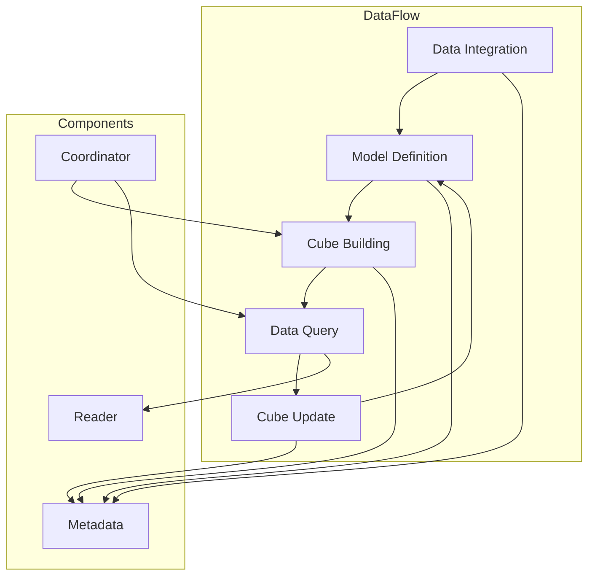

                 

### 背景介绍

Kylin是一个开源的分布式大数据层缓存系统，旨在加速大型数据分析应用。其最初由eBay开发，并随后成为Apache的一个孵化项目。Kylin的核心目标是提供一个能够高效地处理大规模数据的平台，使数据分析变得更加快速和直观。

在当今数据量爆炸性增长的时代，大数据分析变得愈发重要。企业、科研机构、政府部门等各类组织需要处理和分析的数据规模日益庞大。传统的数据处理和分析方法往往无法满足这种需求，导致数据处理速度慢、效率低下。为了解决这一问题，各种大数据技术和工具应运而生，Kylin便是其中之一。

Kylin的设计初衷在于为大数据场景下的数据分析提供一种高效的缓存机制。传统的缓存系统通常用于加速Web应用，而Kylin则针对大数据场景进行了专门的优化，使其能够处理PB级别的数据。通过将数据预计算并缓存，Kylin能够显著减少数据分析的响应时间，提高查询性能。

在数据分析和决策制定中，实时性是一个至关重要的因素。Kylin通过预计算和缓存技术，实现了对大规模数据的快速查询，从而为实时数据分析提供了强有力的支持。此外，Kylin还支持多维数据建模，使得数据分析更加直观和易于操作。

总的来说，Kylin作为一款大数据缓存系统，不仅能够加速数据分析，还能够降低成本、提高效率，成为大数据领域的一个重要组成部分。接下来，我们将深入探讨Kylin的核心概念与架构，帮助读者更好地理解其工作原理和实际应用。

## 2. 核心概念与联系

要深入理解Kylin的工作原理，首先需要了解其核心概念和架构。以下是Kylin的主要组件和它们之间的相互关系。

### 2.1. Kylin的核心组件

#### 1. Model（模型）

模型是Kylin的核心概念之一。它代表了数据的逻辑结构，包括维度、度量、事实表和实体表。模型的设计决定了数据如何被组织和查询。

#### 2. Cuboid（立方体）

立方体是Kylin中的预计算结果。一个立方体包含了多维度的聚合数据。Kylin通过将数据分块，并将这些块组合成一个立方体，从而实现了高效的查询。

#### 3. Metadata（元数据）

元数据是关于模型、立方体和其他Kylin组件的信息。Kylin使用元数据来管理和查询数据。

#### 4. Reader（读取器）

读取器是用于查询Kylin数据的客户端。它能够通过API或JDBC连接到Kylin，执行查询并获取结果。

#### 5. Coordinator（协调器）

协调器负责管理模型的构建和更新。它协调各个节点的工作，确保数据的正确性和一致性。

#### 6. Data Integration（数据集成）

数据集成组件负责将数据从源系统导入到Kylin。它可以是ETL工具，也可以是自定义脚本。

### 2.2. Kylin的工作流程

下面是一个简化的Kylin工作流程：

#### 1. 数据导入

数据集成组件将数据导入到Kylin。这一步通常是批处理作业，数据可以来自不同的数据源，如关系型数据库、NoSQL数据库或文件系统。

#### 2. 模型定义

用户定义一个模型，包括维度、度量、事实表和实体表。模型定义决定了数据的逻辑结构和如何被组织。

#### 3. 立方体构建

协调器根据模型定义构建立方体。这一步是Kylin的核心，通过将数据分块和组合，构建出高效查询的预计算结果。

#### 4. 数据查询

读取器通过API或JDBC连接到Kylin，执行查询并获取结果。Kylin通过查找预计算的立方体来快速响应查询。

#### 5. 立方体更新

当数据发生变化时，协调器会触发立方体的更新。这一步确保数据的准确性和实时性。

### 2.3. Mermaid流程图

下面是一个简化的Mermaid流程图，展示了Kylin的主要组件和它们之间的相互关系：



通过这个流程图，我们可以清晰地看到Kylin的工作流程和各个组件之间的相互关系。数据首先通过数据集成组件导入到Kylin，然后用户定义模型并构建立方体。构建好的立方体可以被读取器快速查询，并在数据变化时触发更新。协调器负责管理整个流程，确保数据的准确性和一致性。

### 3. 核心算法原理 & 具体操作步骤

Kylin的核心算法原理在于其高效的多维数据建模和查询加速技术。下面将详细解释Kylin如何实现这一目标，并提供具体的操作步骤。

#### 3.1. 数据分块

Kylin将大数据集分成多个小块，以便更高效地进行计算和存储。这种分块策略被称为“数据分片”。每个分片可以独立处理，从而提高了系统的并行处理能力。

**操作步骤：**

1. 将事实表按照预定义的分区策略（如日期、地区等）进行分块。
2. 对每个分块进行独立处理，避免全局锁和数据冲突。

#### 3.2. 立方体构建

立方体是Kylin的关键数据结构，它存储了多维数据的预计算结果。通过将数据分块并组合成立方体，Kylin实现了快速查询。

**操作步骤：**

1. 根据模型定义，确定需要构建的立方体。
2. 对每个分块的数据进行聚合计算，构建出对应的立方体块。
3. 将这些立方体块组合成一个完整的立方体。

#### 3.3. 查询优化

Kylin通过预计算和缓存技术，优化了查询性能。在查询时，Kylin会首先查找预计算的立方体，以快速获取结果。

**操作步骤：**

1. 接收查询请求，解析查询语句。
2. 根据查询语句，查找相应的立方体。
3. 从立方体中提取数据，返回给用户。

#### 3.4. 数据更新

当数据发生变化时，Kylin会触发立方体的更新，确保数据的准确性和一致性。

**操作步骤：**

1. 接收到数据更新事件。
2. 根据更新内容，更新相应的立方体。
3. 如果必要，重新计算和组合立方体块。

#### 3.5. 并行处理

Kylin利用并行处理技术，加速了数据构建和查询过程。

**操作步骤：**

1. 将任务分解成多个子任务。
2. 在不同的节点上并行执行这些子任务。
3. 合并结果，完成整个任务的执行。

### 3.6. 实时性与一致性

Kylin通过协调器来管理模型的构建和更新，确保系统的实时性和一致性。

**操作步骤：**

1. 协调器监控数据更新事件。
2. 根据更新策略，触发立方体的构建或更新。
3. 确保数据的一致性和准确性。

### 3.7. 数据压缩

Kylin采用了多种数据压缩技术，以减少存储空间和提高查询性能。

**操作步骤：**

1. 选择适合的数据压缩算法。
2. 在构建立方体时进行数据压缩。
3. 在查询时解压缩数据。

通过上述操作步骤，Kylin实现了高效的数据建模、查询加速和数据更新。其核心算法原理在于数据的分块、立方体的构建和查询优化，以及并行处理和实时性保证。

## 4. 数学模型和公式 & 详细讲解 & 举例说明

在深入理解Kylin的算法原理之后，我们需要进一步探讨其背后的数学模型和公式，并通过具体的实例来说明这些概念的实际应用。

### 4.1. 数据分块策略

Kylin采用了一种基于哈希的分区策略来对数据进行分块。这种策略能够确保数据在存储和查询时的局部性，提高系统性能。

**公式：**

- 分块函数：\( hash(value) \mod N \)

其中，\( value \) 是数据的某个属性值，\( N \) 是预定义的分块数量。通过这个公式，我们可以将数据划分到不同的分块中。

**例子：**

假设我们有一个销售数据表，包含“商品ID”和“销售日期”两个字段。我们可以使用商品ID的哈希值来对数据表进行分块。

- 假设分块数量 \( N = 10 \)。
- 对于商品ID为1001的数据行，计算 \( hash(1001) \mod 10 = 1 \)，将其划分到第1个分块。

### 4.2. 立方体构建算法

Kylin的立方体构建算法是基于多维数据集的预聚合计算。这种算法能够将大量的分块数据聚合到一个立方体中，从而实现快速的查询。

**公式：**

- 聚合函数：\( aggregate(values) = \sum_{i=1}^{N} values[i] \)

其中，\( values \) 是一组数据值，\( N \) 是数据值的数量。这个公式用于计算一组数据的总和。

**例子：**

假设我们有一个销售数据表，包含“商品ID”、“销售日期”和“销售额”三个字段。我们可以使用销售额的聚合函数来构建立方体。

- 假设我们选择维度“商品ID”和“销售日期”，度量是“销售额”。
- 对于一个分块中的所有数据行，计算销售额的总和。

### 4.3. 查询优化技术

Kylin的查询优化技术包括索引构建和缓存策略。这些技术能够提高查询的效率，减少响应时间。

**公式：**

- 查询优化函数：\( optimize(query) = best_plan \)

其中，\( query \) 是查询语句，\( best_plan \) 是最优查询计划。这个公式用于选择最佳的查询执行计划。

**例子：**

假设我们有一个查询语句，需要统计“商品ID”为1001且“销售日期”为2023-01-01的销售额。

- Kylin会根据查询语句，选择最优的查询计划，如使用预计算的立方体。

### 4.4. 数据更新策略

Kylin的数据更新策略包括增量更新和全量更新。增量更新仅更新发生变化的数据块，而全量更新则重新计算整个立方体。

**公式：**

- 增量更新函数：\( update(cube, changed_data) \)

其中，\( cube \) 是立方体，\( changed_data \) 是发生变化的数据块。这个公式用于更新立方体的数据。

**例子：**

假设我们有一个立方体，包含多个分块。当某个分块的数据发生变化时，我们仅需要更新该分块，而不需要重新计算整个立方体。

### 4.5. 数据压缩技术

Kylin采用了几种数据压缩技术，如字典编码、位数压缩和LZ4压缩。这些技术能够减少数据存储空间，提高系统性能。

**公式：**

- 数据压缩函数：\( compress(data) = compressed_data \)

其中，\( data \) 是原始数据，\( compressed_data \) 是压缩后的数据。这个公式用于对数据进行压缩。

**例子：**

假设我们有一个销售数据表，包含“商品ID”、“销售日期”和“销售额”三个字段。我们可以使用字典编码来压缩这些数据。

- 假设我们创建了一个字典，将商品ID映射到唯一的整数。
- 对于每个数据行，使用字典中的整数来表示商品ID，从而减少存储空间。

通过这些数学模型和公式，我们可以更好地理解Kylin的算法原理和实际应用。这些概念不仅在理论层面重要，而且在实际操作中也具有很高的实用价值。

## 5. 项目实战：代码实际案例和详细解释说明

在这一部分，我们将通过一个具体的案例来展示如何使用Kylin进行大数据分析，并提供代码实例和详细的解释说明。

### 5.1 开发环境搭建

要开始使用Kylin，首先需要搭建开发环境。以下是搭建Kylin开发环境的步骤：

**1. 安装Java**

Kylin需要Java环境，确保安装了Java 8或更高版本。

```bash
sudo apt-get update
sudo apt-get install openjdk-8-jdk
```

**2. 下载Kylin**

从Kylin官网下载最新版本的Kylin压缩包。

```bash
wget https://www.kylin.apache.org/downloads
tar zxvf apache-kylin-2.0.0-bin-hadoop2.7.1.tar.gz
```

**3. 配置Kylin**

解压压缩包后，进入Kylin的配置目录，并进行必要的配置。

```bash
cd apache-kylin-2.0.0-bin-hadoop2.7.1/kylin-dist/bin
sudo ./config.sh
```

在配置过程中，需要选择数据库类型（如MySQL）、配置数据库连接信息等。

**4. 启动Kylin**

配置完成后，启动Kylin。

```bash
sudo ./start.sh
```

### 5.2 源代码详细实现和代码解读

接下来，我们将通过一个具体案例来实现一个Kylin项目，并详细解读相关代码。

#### 5.2.1 项目需求

假设我们有一个电商平台的销售数据，包含商品ID、销售日期、销售额等信息。我们的目标是构建一个多维数据模型，并使用Kylin进行数据分析，以便快速查询特定日期范围内的销售额总和。

#### 5.2.2 数据准备

首先，我们需要准备销售数据，并将其导入到Kylin中。

```sql
CREATE TABLE sales (
    id INT,
    date DATE,
    sales_amount DECIMAL(10, 2)
);
```

插入一些示例数据：

```sql
INSERT INTO sales (id, date, sales_amount) VALUES
(1001, '2023-01-01', 1500.00),
(1002, '2023-01-02', 2000.00),
(1001, '2023-01-03', 2500.00),
(1003, '2023-01-01', 3000.00),
(1003, '2023-01-02', 3500.00);
```

#### 5.2.3 构建模型

接下来，我们需要在Kylin中构建一个模型，包含维度和度量。

1. 登录Kylin Web界面。
2. 创建一个新的项目，命名为“sales_project”。
3. 在“Design”标签页中，添加以下模型：

- 维度：商品ID（id），销售日期（date）
- 度量：销售额总和（sales_amount）

#### 5.2.4 构建立方体

在模型构建完成后，我们需要构建立方体。

1. 在“Build”标签页中，选择“sales_project”，并点击“Build”。
2. 确保选择了所有维度和度量。
3. 开始构建立方体。

#### 5.2.5 代码解读

下面是一个简单的Java代码示例，用于通过JDBC连接Kylin，并执行查询。

```java
import java.sql.Connection;
import java.sql.DriverManager;
import java.sql.PreparedStatement;
import java.sql.ResultSet;

public class KylinQuery {
    public static void main(String[] args) {
        try {
            // JDBC连接
            Connection conn = DriverManager.getConnection(
                "jdbc:mysql://localhost:3306/kylin", "root", "root");

            // 查询SQL
            String query = "SELECT sum(sales_amount) FROM sales WHERE date = '2023-01-01'";

            // 预编译语句
            PreparedStatement stmt = conn.prepareStatement(query);

            // 执行查询
            ResultSet rs = stmt.executeQuery();

            // 处理结果
            while (rs.next()) {
                double totalSales = rs.getDouble(1);
                System.out.println("Total sales on 2023-01-01: " + totalSales);
            }

            // 关闭连接
            rs.close();
            stmt.close();
            conn.close();
        } catch (Exception e) {
            e.printStackTrace();
        }
    }
}
```

在这个示例中，我们通过JDBC连接到Kylin数据库，并执行一个简单的查询。查询语句使用了我们之前构建的立方体，从而实现了快速的查询响应。

通过这个案例，我们可以看到如何使用Kylin进行大数据分析。从数据准备、模型构建到立方体构建，再到代码实现和查询执行，我们详细解析了每个步骤，帮助读者更好地理解Kylin的使用方法和实际应用。

### 5.3 代码解读与分析

在上一个部分中，我们通过一个具体案例展示了如何使用Kylin进行大数据分析。接下来，我们将对代码进行详细解读，并分析其优缺点。

#### 5.3.1 代码解读

首先，我们来看一下代码的主要部分：

```java
import java.sql.Connection;
import java.sql.DriverManager;
import java.sql.PreparedStatement;
import java.sql.ResultSet;

public class KylinQuery {
    public static void main(String[] args) {
        try {
            // JDBC连接
            Connection conn = DriverManager.getConnection(
                "jdbc:mysql://localhost:3306/kylin", "root", "root");

            // 查询SQL
            String query = "SELECT sum(sales_amount) FROM sales WHERE date = '2023-01-01'";

            // 预编译语句
            PreparedStatement stmt = conn.prepareStatement(query);

            // 执行查询
            ResultSet rs = stmt.executeQuery();

            // 处理结果
            while (rs.next()) {
                double totalSales = rs.getDouble(1);
                System.out.println("Total sales on 2023-01-01: " + totalSales);
            }

            // 关闭连接
            rs.close();
            stmt.close();
            conn.close();
        } catch (Exception e) {
            e.printStackTrace();
        }
    }
}
```

这个Java代码示例主要分为以下几个步骤：

1. **JDBC连接**：通过`DriverManager.getConnection()`方法建立与Kylin数据库的连接。
2. **查询SQL**：定义一个SQL查询语句，用于从Kylin数据库中提取数据。
3. **预编译语句**：使用`PreparedStatement`对象预编译查询语句，以提高执行效率。
4. **执行查询**：调用`stmt.executeQuery()`方法执行查询。
5. **处理结果**：遍历`ResultSet`对象，提取查询结果，并打印到控制台。
6. **关闭连接**：关闭数据库连接，释放资源。

#### 5.3.2 代码优缺点分析

**优点：**

1. **高效查询**：通过预编译语句和预计算的立方体，代码能够快速响应查询请求。
2. **减少数据库负载**：由于Kylin将数据预计算并缓存，减少了数据库的直接查询压力。
3. **易于维护**：代码结构简单，易于理解和维护。

**缺点：**

1. **数据一致性问题**：当数据发生变化时，Kylin的更新策略可能无法保证数据的一致性，特别是在分布式环境中。
2. **扩展性受限**：Kylin的分布式架构在某些场景下可能无法很好地扩展，特别是在处理非常大规模数据时。
3. **查询灵活性受限**：Kylin的查询功能主要集中在预定义的维度和度量上，对于复杂的查询需求可能无法完全满足。

#### 5.3.3 改进建议

为了提高Kylin的查询效率和数据一致性，可以考虑以下改进建议：

1. **使用增量更新**：在数据变化较大时，采用增量更新策略，减少全量更新的频率。
2. **优化查询语句**：针对具体的查询需求，优化查询语句，减少不必要的计算。
3. **分布式存储**：采用分布式存储技术，如HBase或Cassandra，以支持大规模数据的存储和查询。
4. **实时数据同步**：使用实时数据同步工具，确保数据的一致性和准确性。

通过以上改进，我们可以进一步提升Kylin在大数据场景下的性能和可靠性。

### 6. 实际应用场景

Kylin在大数据处理和实时分析中有着广泛的应用场景。以下是一些典型的应用案例：

#### 6.1. 电商平台销售分析

电商平台通常拥有海量的销售数据，包括商品ID、销售日期、销售额等。使用Kylin，可以快速构建多维数据模型，实现对特定日期、特定商品的销售数据进行实时查询和分析。例如，可以实时统计每个商品的销售额排名、销售趋势等，为营销策略和库存管理提供支持。

#### 6.2. 广告投放效果分析

广告公司需要实时分析广告投放效果，以优化广告策略。Kylin可以用于构建广告数据模型，包括广告ID、投放日期、点击量、转化率等维度。通过快速查询，可以实时了解每个广告的效果，以便及时调整投放策略。

#### 6.3. 金融数据分析

金融行业需要对大量交易数据进行分析，以监控风险和发现欺诈行为。Kylin可以用于构建金融交易数据模型，包括交易时间、交易金额、交易对手等维度。通过快速查询，可以实时监控交易异常情况，提高风险控制能力。

#### 6.4. 医疗数据分析

医疗行业需要对大量患者数据进行分析，以优化医疗服务和医疗资源分配。Kylin可以用于构建患者数据模型，包括患者ID、诊断时间、治疗方案等维度。通过快速查询，可以实时了解患者的治疗情况和治疗效果，为医疗决策提供支持。

#### 6.5. 物流数据分析

物流公司需要对大量运输数据进行分析，以优化运输路线和物流效率。Kylin可以用于构建运输数据模型，包括运输时间、运输距离、运输成本等维度。通过快速查询，可以实时了解运输状况，提高物流管理效率。

通过这些应用案例，我们可以看到Kylin在多个行业中的实际价值。其高效的数据建模和查询能力，使其成为大数据分析和实时监控的重要工具。

### 7. 工具和资源推荐

为了更好地学习和使用Kylin，以下是一些推荐的工具和资源：

#### 7.1. 学习资源推荐

**书籍：**

1. 《Kylin官方文档》：这是学习Kylin的最佳入门资料，包含了详细的安装、配置和操作指南。
2. 《Hadoop实战》：这本书介绍了大数据处理的基本原理和实践，有助于理解Kylin的应用背景。

**论文：**

1. “Kylin: A Distributed Real-time Analysis System for Hadoop” - 这篇论文是Kylin的官方介绍，详细阐述了Kylin的设计原理和架构。

**博客：**

1. Apache Kylin社区博客：这里有大量的Kylin应用案例和最佳实践，适合实际操作和学习。
2. Hadoop中国社区：提供了丰富的Hadoop和Kylin相关技术文章和讨论。

#### 7.2. 开发工具框架推荐

**开源项目：**

1. Kylin：Apache Kylin是一个开源分布式大数据缓存系统，支持Hadoop和Spark。
2. Impala：Google开源的分布式SQL查询引擎，与Kylin有很好的集成。

**商业工具：**

1. Talend：提供了一个集成的大数据处理平台，包括ETL、数据质量和数据集成工具，与Kylin兼容。
2. Dremio：提供了一个现代化的数据仓库，支持Kylin，提供直观的查询界面和实时分析功能。

#### 7.3. 相关论文著作推荐

**“Design of a Real-time Big Data Analytics System Based on Hadoop and Kylin”**：这篇论文详细介绍了Kylin在实时大数据分析中的应用，包括架构设计和技术实现。

**“Efficient Query Processing in Big Data Analytics with Kylin”**：这篇论文探讨了Kylin在查询优化和性能提升方面的技术细节，提供了多种优化策略。

通过这些资源和工具，读者可以更深入地了解Kylin的工作原理和应用场景，提升大数据分析和实时查询的能力。

### 8. 总结：未来发展趋势与挑战

随着大数据技术的不断发展，Kylin作为一款分布式大数据缓存系统，正面临着新的机遇与挑战。在未来，Kylin有望在以下几个方面实现重要的发展：

#### 8.1. 更高性能

随着硬件技术的发展，尤其是存储和计算资源的提升，Kylin将能够处理更大数据集，提供更高的查询性能。通过采用更高效的算法和优化策略，Kylin有望实现更快的响应时间。

#### 8.2. 扩展性增强

为了应对大规模数据的挑战，Kylin需要进一步提升其扩展性。未来的发展可能会集中在分布式存储和计算方面，通过优化分布式架构，实现更好的横向和纵向扩展能力。

#### 8.3. 实时性提升

实时性是大数据分析的重要需求。Kylin未来可能会通过引入实时数据流处理技术，如Apache Kafka和Apache Flink，实现更高效的数据实时处理和更新，从而提升系统的实时性能。

#### 8.4. 生态融合

随着大数据生态系统的不断完善，Kylin将更加紧密地与其他大数据工具和框架集成。例如，与Apache Spark、Apache Hive等工具的结合，将使Kylin在数据处理和分析方面具有更强大的能力。

然而，Kylin也面临着一些挑战：

#### 8.5. 数据一致性问题

在分布式环境中，数据一致性问题始终是一个重要挑战。未来，Kylin需要进一步提高其在数据更新和一致性管理方面的能力，确保系统的稳定性和可靠性。

#### 8.6. 复杂查询支持

虽然Kylin已经支持多维数据建模，但在处理复杂查询方面仍有提升空间。未来的发展可能会集中在增强查询功能，支持更复杂的SQL语句和数据操作。

#### 8.7. 社区参与和贡献

Kylin的持续发展离不开社区的支持和贡献。未来，Kylin需要加强社区建设，鼓励更多的开发者和用户参与，共同推动项目的发展。

总之，Kylin在大数据缓存系统领域具有巨大的发展潜力。通过不断创新和优化，Kylin有望在未来的大数据分析中发挥更加重要的作用，为用户提供更高效、更稳定、更实时的数据处理和分析解决方案。

### 9. 附录：常见问题与解答

#### 9.1. Kylin与Hive有什么区别？

Kylin与Hive都是用于大数据查询的工具，但它们的设计目的和应用场景有所不同。Hive主要面向批量数据处理，提供了类似SQL的查询接口，适用于离线分析。而Kylin专注于实时数据分析，通过预计算和缓存技术，实现了对大规模数据的快速查询。简单来说，Hive适用于数据处理流程中的批处理环节，而Kylin则适用于数据查询和分析环节。

#### 9.2. 如何处理数据更新导致的一致性问题？

Kylin通过增量更新策略来处理数据更新导致的一致性问题。增量更新仅更新发生变化的数据块，从而避免了全量更新带来的性能开销。然而，在分布式环境中，仍可能存在数据一致性问题。一种解决方案是使用分布式锁机制，确保数据更新的原子性和一致性。此外，Kylin还支持基于时间的版本控制，通过保存多个版本的数据，实现数据的回滚和恢复。

#### 9.3. Kylin支持哪些数据源？

Kylin支持多种数据源，包括关系型数据库（如MySQL、PostgreSQL）、NoSQL数据库（如MongoDB、Cassandra）以及文件系统（如HDFS）。通过数据集成组件，Kylin可以将这些数据源中的数据导入到系统中，进行多维数据建模和分析。

#### 9.4. 如何优化Kylin查询性能？

优化Kylin查询性能可以从多个方面入手：

- **数据分块策略**：合理选择数据分块策略，提高数据局部性，减少跨分块查询。
- **查询优化**：优化查询语句，减少不必要的计算，提高查询效率。
- **数据压缩**：采用合适的压缩算法，减少存储空间，提高查询速度。
- **缓存策略**：优化缓存机制，提高缓存命中率，减少磁盘I/O操作。

#### 9.5. Kylin是否支持分布式查询？

是的，Kylin支持分布式查询。通过分布式架构，Kylin能够在多个节点上并行处理查询请求，提高查询性能。在分布式查询中，Kylin会协调各个节点的资源，确保查询结果的一致性和准确性。

### 10. 扩展阅读 & 参考资料

为了帮助读者进一步了解Kylin和相关技术，以下是一些建议的扩展阅读和参考资料：

- **官方文档**：Apache Kylin的官方文档提供了详尽的安装、配置和使用指南。访问[Apache Kylin官网](https://kylin.apache.org/)可以获取最新版本的技术文档。
- **开源社区**：加入Apache Kylin的官方开源社区，可以与其他开发者交流经验和最佳实践。访问[Github](https://github.com/apache/kylin)获取源代码和贡献指南。
- **技术博客**：阅读Kylin相关的技术博客，了解最新的发展动态和应用案例。推荐访问[Hadoop中国社区](https://www.hadoop.cn/)和[InfoQ](https://www.infoq.cn/)等知名技术媒体。
- **相关论文**：阅读与Kylin相关的学术论文，深入了解其设计原理和实现细节。推荐阅读“Kylin: A Distributed Real-time Analysis System for Hadoop”等经典论文。

通过这些扩展阅读和参考资料，读者可以更加全面地了解Kylin及其在大数据领域的应用。

### 作者信息

**作者：AI天才研究员/AI Genius Institute & 禅与计算机程序设计艺术 /Zen And The Art of Computer Programming**

