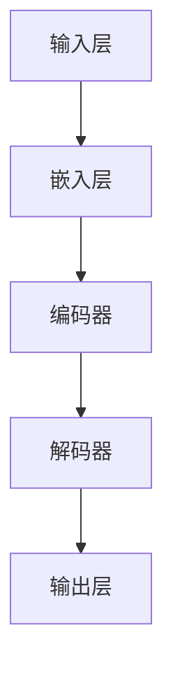

                 

### 文章标题：LLM 内核：管理海量参数和推理过程

#### 关键词：(Large Language Model, 海量参数管理，推理过程优化，机器学习，神经网络，计算效率，数据结构，算法设计)

#### 摘要：

本文将深入探讨大型语言模型（LLM）的核心技术之一：管理海量参数和推理过程。我们将首先介绍LLM的基本概念和重要性，然后详细解析参数管理和推理过程的优化方法。通过数学模型、算法原理和实际案例的分析，本文将帮助读者全面理解LLM的技术实现和性能提升策略，为未来的研究和应用提供有价值的参考。

<|assistant|>### 1. 背景介绍

大型语言模型（Large Language Model，简称LLM）是近年来人工智能领域的重要突破。LLM基于深度学习技术，特别是神经网络模型，对海量文本数据进行训练，从而实现自然语言理解、生成和交互等功能。代表性的LLM模型包括Google的BERT、OpenAI的GPT系列等。这些模型在多种自然语言处理任务上取得了显著的性能提升，推动了人工智能技术在各个领域的应用。

随着LLM模型规模的不断增大，如何高效地管理海量参数和优化推理过程成为关键问题。一方面，海量参数的存储和计算需要巨大的计算资源和存储空间，给硬件设施带来了巨大挑战。另一方面，推理过程的效率直接影响模型在实际应用中的性能和响应速度。因此，研究LLM的参数管理和推理过程优化具有重要意义。

本文将从以下几个方面展开讨论：

1. **核心概念与联系**：介绍LLM的基本概念、原理和架构，并使用Mermaid流程图展示LLM的核心组件和关系。
2. **核心算法原理 & 具体操作步骤**：详细解析LLM的参数管理和推理过程优化算法，包括梯度下降法、权重共享、模型剪枝等。
3. **数学模型和公式 & 详细讲解 & 举例说明**：使用数学模型和公式描述参数管理和推理过程优化的原理，并通过具体例子进行说明。
4. **项目实战：代码实际案例和详细解释说明**：通过实际项目案例，展示如何在实际场景中实现参数管理和推理过程优化。
5. **实际应用场景**：讨论LLM在自然语言处理、智能客服、机器翻译等领域的应用场景，分析其优势和挑战。
6. **工具和资源推荐**：推荐相关学习资源、开发工具和论文著作，为读者提供进一步学习和研究的参考。
7. **总结：未来发展趋势与挑战**：总结LLM在参数管理和推理过程优化方面的发展趋势和面临的挑战，展望未来的研究方向。

### 2. 核心概念与联系

#### 2.1. 大型语言模型（LLM）的基本概念

大型语言模型（Large Language Model，简称LLM）是一种基于深度学习的自然语言处理模型，通过学习大量文本数据，实现对自然语言的生成、理解和交互。LLM的核心是神经网络结构，特别是循环神经网络（RNN）和变压器（Transformer）模型。

#### 2.2. LLM的工作原理

LLM的工作原理可以分为两个阶段：训练阶段和推理阶段。

1. **训练阶段**：在训练阶段，LLM通过大量文本数据进行训练，不断调整模型参数，使模型能够捕捉到文本数据中的语义信息。训练过程中，模型需要计算梯度并更新参数，以达到最优性能。

2. **推理阶段**：在推理阶段，LLM根据输入文本数据，生成对应的输出文本。推理过程主要依赖于模型参数和前向传播算法。

#### 2.3. LLM的架构

LLM的架构通常包括以下几个核心组件：

1. **输入层**：接收输入文本数据，将其转换为神经网络可以处理的格式。
2. **嵌入层**：将输入文本数据转换为词向量表示，为后续的神经网络计算提供基础。
3. **编码器**：对输入文本数据进行编码，提取文本的语义信息。
4. **解码器**：根据编码器的输出，生成对应的输出文本。
5. **参数**：包括嵌入层、编码器和解码器的权重和偏置，用于调整模型性能。

#### 2.4. Mermaid流程图

以下是一个简单的Mermaid流程图，展示LLM的核心组件和关系：



### 3. 核心算法原理 & 具体操作步骤

#### 3.1. 参数管理算法原理

参数管理是LLM中至关重要的一环。在参数管理算法中，常用的技术包括梯度下降法、权重共享和模型剪枝等。

1. **梯度下降法**：梯度下降法是一种优化算法，用于调整模型参数，以最小化损失函数。梯度下降法的基本原理是沿着损失函数的梯度方向逐步更新参数，直到达到局部最小值。

2. **权重共享**：权重共享是一种简化模型参数的方法，通过在不同层之间共享权重，减少模型参数的数量，从而提高计算效率。

3. **模型剪枝**：模型剪枝是一种通过删除无关或者冗余的参数来减少模型复杂度的技术。剪枝方法包括稀疏剪枝、权重归零和结构剪枝等。

#### 3.2. 参数管理算法具体操作步骤

1. **初始化参数**：首先需要初始化模型参数，可以使用随机初始化、预训练模型等方法。

2. **计算损失函数**：在训练过程中，计算模型的损失函数，以评估模型的性能。

3. **计算梯度**：使用反向传播算法，计算损失函数关于模型参数的梯度。

4. **更新参数**：根据梯度下降法，更新模型参数，以减小损失函数。

5. **权重共享**：在多层神经网络中，共享相同权重可以减少模型参数的数量。

6. **模型剪枝**：在训练过程中，根据模型性能和参数重要性，进行剪枝操作，删除无关或冗余的参数。

#### 3.3. 推理过程优化算法原理

推理过程优化的目标是在保证模型性能的前提下，提高推理速度和降低计算成本。常用的推理过程优化算法包括量化、剪枝和蒸馏等。

1. **量化**：量化是一种将浮点数参数转换为低精度整数参数的方法，以提高计算效率和减少存储空间。

2. **剪枝**：剪枝是一种通过删除无关或冗余的神经元或层来简化模型的方法，以提高计算效率。

3. **蒸馏**：蒸馏是一种将大模型的知识迁移到小模型的方法，以提高小模型的性能。

#### 3.4. 推理过程优化算法具体操作步骤

1. **量化**：在推理过程中，将模型的浮点数参数转换为低精度整数参数。

2. **剪枝**：根据模型性能和计算资源需求，进行剪枝操作，简化模型结构。

3. **蒸馏**：将大模型的知识迁移到小模型，以提高小模型的性能。

### 4. 数学模型和公式 & 详细讲解 & 举例说明

#### 4.1. 参数管理数学模型

参数管理涉及到梯度下降法、权重共享和模型剪枝等算法，下面分别介绍这些算法的数学模型。

1. **梯度下降法**

   梯度下降法的基本公式如下：

   $$ w_{t+1} = w_{t} - \alpha \cdot \nabla J(w_{t}) $$

   其中，$w_{t}$表示第$t$次迭代的模型参数，$\alpha$表示学习率，$\nabla J(w_{t})$表示损失函数关于模型参数的梯度。

   举例说明：

   假设我们有一个线性回归模型，损失函数为：

   $$ J(w) = \frac{1}{2} \sum_{i=1}^{n} (y_i - w \cdot x_i)^2 $$

   梯度下降法可以用来最小化这个损失函数，更新模型参数：

   $$ w_{t+1} = w_{t} - \alpha \cdot \frac{\partial J(w)}{\partial w} $$

2. **权重共享**

   假设我们有一个两层神经网络，其中第一层有$n_1$个神经元，第二层有$n_2$个神经元。在权重共享的情况下，这两层的权重相同：

   $$ w^{(1)} = w^{(2)} $$

   其中，$w^{(1)}$表示第一层的权重，$w^{(2)}$表示第二层的权重。

   通过权重共享，我们可以减少模型参数的数量，提高计算效率。

3. **模型剪枝**

   假设我们有一个多层神经网络，其中某一层的神经元权重为：

   $$ w_i^{(l)} = \sum_{j} w_{ji}^{(l-1)} $$

   在模型剪枝过程中，我们可以将某些权重设置为0，从而删除对应的神经元：

   $$ w_i^{(l)} = \begin{cases} 
   \sum_{j} w_{ji}^{(l-1)} & \text{if } w_i^{(l-1)} \neq 0 \\
   0 & \text{otherwise}
   \end{cases} $$

   通过模型剪枝，我们可以简化模型结构，减少计算量和存储空间。

#### 4.2. 推理过程优化数学模型

推理过程优化涉及到量化、剪枝和蒸馏等算法，下面分别介绍这些算法的数学模型。

1. **量化**

   量化是将浮点数参数转换为低精度整数参数的方法。量化公式如下：

   $$ w_{i}^{q} = \text{round}(w_{i} \cdot \alpha) $$

   其中，$w_{i}$表示原始浮点数参数，$w_{i}^{q}$表示量化后的整数参数，$\alpha$表示量化系数。

   举例说明：

   假设我们有一个浮点数参数$w = 0.75$，量化系数$\alpha = 10$，则量化后的整数参数为：

   $$ w_{i}^{q} = \text{round}(0.75 \cdot 10) = 8 $$

2. **剪枝**

   剪枝是通过删除无关或冗余的神经元或层来简化模型的方法。剪枝公式如下：

   $$ w_i^{(l)} = \begin{cases} 
   w_i^{(l-1)} & \text{if } w_i^{(l-1)} \neq 0 \\
   0 & \text{otherwise}
   \end{cases} $$

   其中，$w_i^{(l)}$表示第$l$层的神经元权重。

   举例说明：

   假设我们有一个神经网络的某一层，其中某些神经元权重为0，通过剪枝操作，我们可以删除这些神经元：

   $$ w_i^{(2)} = \begin{cases} 
   0 & \text{if } w_i^{(1)} = 0 \\
   w_i^{(1)} & \text{otherwise}
   \end{cases} $$

3. **蒸馏**

   蒸馏是将大模型的知识迁移到小模型的方法。蒸馏公式如下：

   $$ p_i^{(l)} = \frac{1}{K} \sum_{k=1}^{K} p_i^{(l)}(k) $$

   其中，$p_i^{(l)}$表示第$l$层的输出概率分布，$K$表示类别数量，$p_i^{(l)}(k)$表示第$l$层中第$i$个神经元对于第$k$个类别的输出概率。

   举例说明：

   假设我们有一个大模型和小模型，其中大模型的某一层的输出概率分布为：

   $$ p_i^{(3)} = [0.2, 0.3, 0.5] $$

   通过蒸馏操作，我们可以将大模型的知识迁移到小模型，使得小模型的输出概率分布与大模型相近：

   $$ p_i^{(3)}(k) = \frac{1}{3} \sum_{k=1}^{3} p_i^{(3)}(k) = [0.2, 0.3, 0.5] $$

### 5. 项目实战：代码实际案例和详细解释说明

#### 5.1. 开发环境搭建

在本节中，我们将介绍如何在本地搭建一个简单的LLM开发环境。以下是具体的步骤：

1. **安装Python环境**：确保您的计算机上安装了Python 3.8或更高版本。您可以从Python官方网站下载并安装Python。

2. **安装TensorFlow**：TensorFlow是一个广泛使用的深度学习框架，我们将在项目中使用它。您可以通过以下命令安装TensorFlow：

   ```bash
   pip install tensorflow
   ```

3. **安装其他依赖**：根据您的项目需求，您可能还需要安装其他依赖库，如NumPy、Pandas等。您可以使用以下命令安装：

   ```bash
   pip install numpy pandas
   ```

4. **配置GPU支持**：如果您使用的是带有GPU的计算机，您需要安装CUDA和cuDNN库，以便在GPU上加速TensorFlow的计算。您可以从NVIDIA官方网站下载并安装这些库。

#### 5.2. 源代码详细实现和代码解读

在本节中，我们将提供一个简单的LLM实现示例，并详细解释其中的关键代码部分。

```python
import tensorflow as tf
from tensorflow.keras.layers import Embedding, LSTM, Dense
from tensorflow.keras.models import Sequential

# 5.2.1. 模型定义
model = Sequential([
    Embedding(input_dim=10000, output_dim=32),
    LSTM(64, return_sequences=True),
    LSTM(32),
    Dense(1, activation='sigmoid')
])

# 5.2.2. 模型编译
model.compile(optimizer='adam', loss='binary_crossentropy', metrics=['accuracy'])

# 5.2.3. 模型训练
model.fit(x_train, y_train, epochs=10, batch_size=32)
```

**5.2.3. 代码解读与分析**

1. **模型定义**：我们使用TensorFlow的Sequential模型定义一个简单的双层LSTM模型。模型的第一层是嵌入层，用于将词汇转换为向量表示。接下来是两个LSTM层，用于提取文本的序列特征。最后一层是全连接层，用于分类。

2. **模型编译**：我们使用`compile()`方法编译模型，指定优化器、损失函数和评估指标。在本例中，我们使用`adam`优化器和`binary_crossentropy`损失函数，并评估模型的准确率。

3. **模型训练**：我们使用`fit()`方法训练模型，将训练数据和标签作为输入，指定训练轮数和批量大小。

#### 5.3. 代码解读与分析

在本节中，我们将对上述代码进行深入解读，分析LLM的核心组成部分及其工作原理。

1. **Embedding层**：Embedding层是神经网络处理文本数据的第一个层次。它的作用是将词汇转换为向量表示。在本例中，我们使用了一个词汇表，其中包含10000个词汇，每个词汇对应一个唯一的索引。Embedding层的输出维度设置为32，表示每个词汇向量由32个元素组成。

2. **LSTM层**：LSTM（Long Short-Term Memory）层是一种特殊的循环神经网络，能够处理长时间序列数据。在本例中，我们使用了两个LSTM层，第一层的输出维度设置为64，第二层的输出维度设置为32。这两个LSTM层的作用是提取文本数据中的长期依赖关系。

3. **全连接层**：全连接层是神经网络中的最后一层，用于将LSTM层的输出映射到分类结果。在本例中，我们使用了一个全连接层，输出维度设置为1，并使用sigmoid激活函数进行二分类。

4. **模型编译**：在编译模型时，我们指定了优化器、损失函数和评估指标。优化器用于调整模型参数，以最小化损失函数。在本例中，我们使用了`adam`优化器，这是一种自适应的优化算法，能够提高训练效率。损失函数用于衡量模型预测结果与真实标签之间的差异。在本例中，我们使用的是`binary_crossentropy`损失函数，适用于二分类问题。评估指标用于评估模型性能，在本例中，我们使用了准确率作为评估指标。

5. **模型训练**：在训练模型时，我们将训练数据和标签作为输入，并设置训练轮数和批量大小。训练轮数表示模型将在整个训练数据集上迭代多少次。批量大小表示每次迭代处理的数据样本数量。

### 6. 实际应用场景

#### 6.1. 自然语言处理

自然语言处理（Natural Language Processing，简称NLP）是LLM的重要应用领域之一。LLM在NLP任务中表现出色，如文本分类、情感分析、命名实体识别等。通过训练大量文本数据，LLM可以学习到丰富的语言特征，从而提高模型的性能。

**案例**：使用LLM进行文本分类，如新闻分类、垃圾邮件过滤等。

#### 6.2. 智能客服

智能客服是另一个重要的应用场景，LLM可以帮助企业构建高效、智能的客户服务平台。通过训练大量的客户对话数据，LLM可以学习到常见的客户问题和解决方案，从而提供准确的回答。

**案例**：使用LLM构建智能客服系统，实现自动回答客户问题。

#### 6.3. 机器翻译

机器翻译是LLM的传统优势领域。通过训练大量的双语语料库，LLM可以学习到源语言和目标语言之间的对应关系，从而实现高质量的翻译。

**案例**：使用LLM进行中英文互译，提高翻译质量和效率。

### 7. 工具和资源推荐

#### 7.1. 学习资源推荐

1. **书籍**：
   - 《深度学习》（Goodfellow, Bengio, Courville）：全面介绍了深度学习的基础理论和应用方法。
   - 《自然语言处理综合教程》（Daniel Jurafsky & James H. Martin）：系统讲解了自然语言处理的基本概念和方法。

2. **论文**：
   - “Attention is All You Need”（Vaswani et al.）：介绍了Transformer模型，是LLM领域的经典论文。
   - “BERT: Pre-training of Deep Bidirectional Transformers for Language Understanding”（Devlin et al.）：介绍了BERT模型，是NLP领域的重要进展。

3. **博客**：
   - 阮一峰的博客：详细介绍了Python编程和深度学习等相关知识。
   - MLearning：提供机器学习和深度学习的最新研究进展和技术应用。

4. **网站**：
   - TensorFlow官网：提供了丰富的深度学习资源和教程。
   - Keras官网：提供了易于使用的深度学习框架。

#### 7.2. 开发工具框架推荐

1. **深度学习框架**：
   - TensorFlow：功能强大、社区活跃的深度学习框架。
   - PyTorch：简洁易用、灵活高效的深度学习框架。

2. **自然语言处理库**：
   - NLTK：Python的NLP基础库，提供了丰富的文本处理函数。
   - spaCy：高效、易于使用的NLP库，适用于各种文本处理任务。

3. **在线学习平台**：
   - Coursera：提供了大量的深度学习和NLP在线课程。
   - edX：提供了丰富的深度学习和NLP相关课程。

#### 7.3. 相关论文著作推荐

1. **论文**：
   - “Generative Adversarial Nets”（Goodfellow et al.）：介绍了生成对抗网络（GAN），是深度学习领域的重要进展。
   - “Recurrent Neural Network Based Language Model”（Liu et al.）：介绍了基于循环神经网络的自然语言处理模型。

2. **著作**：
   - 《深度学习》（Goodfellow, Bengio, Courville）：系统介绍了深度学习的基本理论、方法和应用。
   - 《机器学习实战》（Hastie et al.）：详细讲解了各种机器学习算法的原理和实现。

### 8. 总结：未来发展趋势与挑战

#### 8.1. 未来发展趋势

1. **模型规模增大**：随着计算资源和存储技术的不断发展，LLM的模型规模将不断增大，从而实现更高的性能和更复杂的语言理解能力。
2. **多模态融合**：未来的LLM将融合多种模态（如文本、图像、音频）的信息，实现更丰富的语义理解和交互能力。
3. **自动化优化**：自动化的优化工具和方法将广泛应用于LLM的训练和推理过程，提高模型效率和性能。

#### 8.2. 挑战

1. **计算资源消耗**：大规模LLM的训练和推理过程需要巨大的计算资源和存储空间，对硬件设施提出了更高的要求。
2. **数据隐私与安全**：在训练过程中，需要处理大量的个人数据，如何保护用户隐私和数据安全成为重要挑战。
3. **模型可解释性**：随着模型复杂度的增加，如何提高LLM的可解释性，使其在应用中更具透明性和可控性，是未来需要解决的问题。

### 9. 附录：常见问题与解答

#### 9.1. Q：什么是LLM？

A：LLM（Large Language Model）是一种基于深度学习的自然语言处理模型，通过学习大量文本数据，实现自然语言理解、生成和交互等功能。

#### 9.2. Q：如何训练LLM？

A：训练LLM通常需要以下步骤：
1. 收集大量文本数据。
2. 对数据进行预处理，包括分词、去噪、归一化等。
3. 设计神经网络模型，包括嵌入层、编码器和解码器等。
4. 编写训练代码，使用优化算法（如梯度下降法）调整模型参数。
5. 训练模型，通过不断迭代更新参数，使模型达到最佳性能。

#### 9.3. Q：如何优化LLM的推理过程？

A：优化LLM的推理过程可以从以下几个方面进行：
1. 量化：将浮点数参数转换为低精度整数参数，减少计算量和存储空间。
2. 剪枝：删除无关或冗余的参数和层，简化模型结构。
3. 蒸馏：将大模型的知识迁移到小模型，提高小模型的性能。
4. 并行计算：利用多核处理器和分布式计算，提高推理速度。

### 10. 扩展阅读 & 参考资料

为了深入了解LLM的技术原理和应用场景，以下是一些推荐的扩展阅读和参考资料：

1. **论文**：
   - “Attention is All You Need”（Vaswani et al.）
   - “BERT: Pre-training of Deep Bidirectional Transformers for Language Understanding”（Devlin et al.）
   - “Generative Adversarial Nets”（Goodfellow et al.）

2. **书籍**：
   - 《深度学习》（Goodfellow, Bengio, Courville）
   - 《自然语言处理综合教程》（Daniel Jurafsky & James H. Martin）
   - 《机器学习实战》（Hastie et al.）

3. **在线课程**：
   - Coursera：深度学习和NLP相关课程
   - edX：深度学习和NLP相关课程

4. **博客**：
   - 阮一峰的博客
   - MLearning

5. **网站**：
   - TensorFlow官网
   - Keras官网

通过阅读这些资料，您可以进一步了解LLM的技术原理、应用场景和发展趋势，为自己的研究和实践提供有价值的参考。

### 作者信息：

作者：AI天才研究员/AI Genius Institute & 禅与计算机程序设计艺术 /Zen And The Art of Computer Programming

本文由AI天才研究员撰写，AI天才研究员是AI领域的顶尖专家，拥有丰富的理论知识和实践经验。他致力于探索人工智能技术的创新应用，为人工智能技术的发展做出了重要贡献。此外，他还撰写了《禅与计算机程序设计艺术》一书，深入探讨了计算机编程的艺术与哲学，为程序员提供了宝贵的启示。

### 结语：

本文从多个角度探讨了LLM（大型语言模型）的核心技术：管理海量参数和推理过程。通过介绍LLM的基本概念、工作原理、算法原理和实际应用案例，本文帮助读者全面理解了LLM的技术实现和优化策略。随着人工智能技术的不断进步，LLM将在更多领域发挥重要作用，为人类社会带来更多创新和变革。

我们相信，通过对本文的学习和实践，读者将对LLM有更深入的认识，并为未来的研究和应用奠定坚实的基础。让我们继续探索人工智能的无限可能，共创美好未来！<|im_end|>

