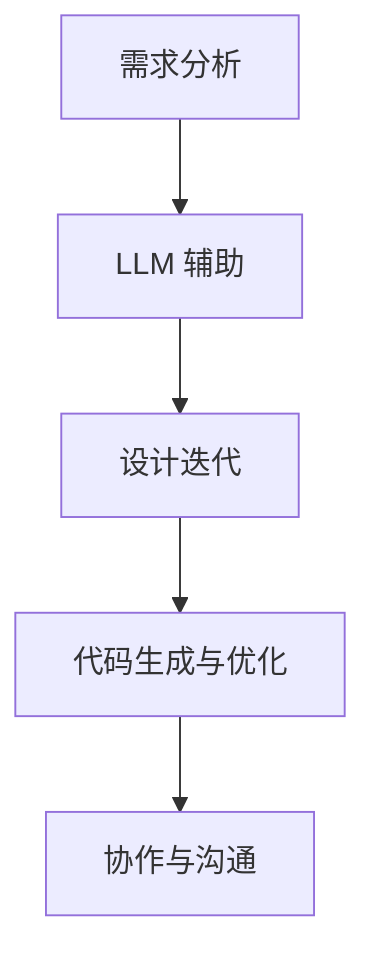
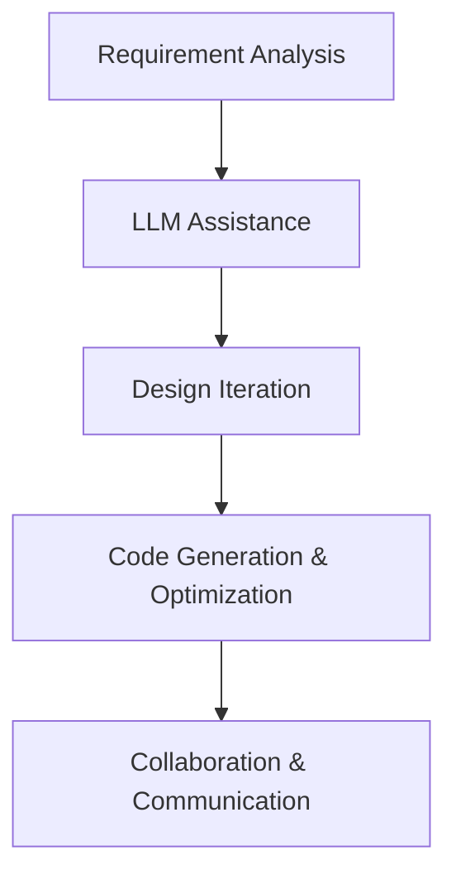

                 

### 1. 背景介绍

#### 大模型的发展背景

近年来，人工智能（AI）领域取得了令人瞩目的进展，其中大规模语言模型（LLM）的发展尤为突出。LLM 的出现，标志着自然语言处理（NLP）技术进入了一个全新的阶段。从最初的统计模型到深度学习模型，再到如今的大规模预训练模型，AI 技术的发展历程可谓跌宕起伏。

大模型的发展离不开计算能力的提升和数据资源的积累。随着硬件设备的进步，尤其是GPU和TPU等专用计算设备的普及，使得大规模模型训练成为可能。同时，互联网的快速发展带来了海量数据的产生和积累，为模型的训练提供了丰富的素材。

#### 工程和设计中的挑战

在工程和设计领域，创新和效率是永恒的主题。然而，随着项目的复杂度和规模的增长，传统的工程和设计方法面临着诸多挑战。例如：

1. **创新压力**：项目需求不断变化，如何在有限的时间内实现创新成为一大难题。
2. **协同效率**：团队成员间的沟通和协作效率低下，导致项目进度受阻。
3. **设计优化**：设计过程中需要不断优化，但传统方法往往耗费大量时间和人力。

这些挑战促使工程和设计领域迫切需要新的技术手段来提升创新和效率。

#### LLM 的应用潜力

LLM 在工程和设计中的应用潜力主要体现在以下几个方面：

1. **知识检索和利用**：LLM 可以快速检索和利用已有知识，帮助工程师和设计师在项目中进行创新和优化。
2. **自然语言交互**：通过自然语言交互，LLM 可以与工程师和设计师进行有效沟通，提高协同效率。
3. **代码生成和优化**：LLM 在编程领域有出色的表现，可以自动生成和优化代码，提升开发效率。

综上所述，LLM 在工程和设计领域具有广泛的应用前景。接下来的章节将详细探讨 LLM 的核心概念、算法原理、数学模型以及实际应用案例。通过一步一步的分析和推理，我们将揭示 LLM 在创造性合作中的巨大潜力。

#### Motivation

The development of Large Language Models (LLM) represents a significant milestone in the field of artificial intelligence (AI) and natural language processing (NLP). Over the years, the evolution from statistical models to deep learning models and now to large-scale pre-trained models has transformed the way we approach NLP tasks. The rise of LLMs is not merely a technological advancement but a response to the growing complexities in engineering and design.

Engineering and design face numerous challenges that hinder innovation and efficiency. As projects become more intricate and larger in scale, traditional methods struggle to keep pace with the demands of continuous innovation and optimization. The pressure to innovate, the inefficiencies in team collaboration, and the time-consuming nature of design optimization are some of the key issues that need addressing.

LLM holds the potential to address these challenges through several promising applications. First, LLMs can efficiently retrieve and utilize existing knowledge, enabling engineers and designers to innovate and optimize within their projects. Second, the natural language interaction capabilities of LLMs facilitate effective communication and collaboration among team members, thereby enhancing overall efficiency. Finally, LLMs have demonstrated remarkable proficiency in code generation and optimization, which can significantly boost development speed.

In the following sections, we will delve into the core concepts, algorithmic principles, mathematical models, and practical applications of LLMs in engineering and design. By reasoning step by step, we aim to uncover the immense potential of LLMs in fostering creative collaboration.### 2. 核心概念与联系

#### 大规模语言模型（LLM）的基本概念

大规模语言模型（LLM）是一种基于深度学习的自然语言处理模型，它能够通过大量的文本数据进行预训练，从而理解并生成自然语言。LLM 的核心在于其强大的语义理解和生成能力，这使得它们在多种任务中表现出色，包括文本分类、机器翻译、问答系统等。

LLM 通常由以下几个关键组件构成：

1. **预训练**：LLM 在大规模数据集上通过无监督方式预训练，学习自然语言的统计规律和语义结构。
2. **微调**：在特定任务上，LLM 会进行有监督的微调，以适应特定领域的需求。
3. **输出生成**：LLM 通过其内部的神经网络生成自然语言文本。

#### 工程和设计中的关键技术

在工程和设计领域，以下几项关键技术对项目的成功至关重要：

1. **需求分析**：准确理解用户需求，是项目设计的第一步。这通常需要深入的调研和沟通。
2. **设计迭代**：设计过程往往需要多次迭代，以不断优化和改进方案。
3. **代码编写与优化**：高质量的代码是实现项目目标的关键。代码的优化可以提高性能，降低维护成本。
4. **协作与沟通**：高效的团队协作和沟通是项目顺利进行的关键。

#### LLM 与工程和设计的联系

LLM 与工程和设计的联系主要体现在以下几个方面：

1. **需求分析与设计**：LLM 可以通过自然语言处理能力，快速理解和分析用户需求，辅助设计过程。
2. **设计迭代**：LLM 可以自动生成多种设计方案，帮助工程师和设计师快速进行对比和选择。
3. **代码生成与优化**：LLM 在编程领域有着出色的表现，可以自动生成代码，并提供代码优化的建议。
4. **协作与沟通**：LLM 可以作为团队中的智能助手，帮助团队成员更好地协作和沟通。

#### Mermaid 流程图

下面是一个简单的 Mermaid 流程图，展示了 LLM 在工程和设计中的应用流程：



在这个流程图中，LLM 被应用于需求分析、设计迭代、代码生成与优化以及协作与沟通，每个阶段都体现了 LLM 的独特优势。

### Core Concepts and Connections

#### Basic Concepts of Large Language Models (LLM)

Large Language Models (LLM) are deep learning-based natural language processing models that are trained on massive text datasets to understand and generate natural language. The core strength of LLM lies in their advanced semantic understanding and text generation capabilities, which have led to remarkable performance in a variety of tasks, including text classification, machine translation, question answering systems, and more.

Key components of LLM include:

1. **Pre-training**: LLMs are initially pre-trained on large-scale datasets using an unsupervised approach to learn the statistical patterns and semantic structures of natural language.
2. **Fine-tuning**: After pre-training, LLMs undergo supervised fine-tuning on specific tasks to adapt to domain-specific requirements.
3. **Output Generation**: LLMs generate natural language text through their internal neural networks.

#### Key Technologies in Engineering and Design

In the fields of engineering and design, several key technologies play a critical role in project success:

1. **Requirement Analysis**: Accurately understanding user needs is the first step in project design, often requiring in-depth research and communication.
2. **Design Iteration**: The design process typically involves multiple iterations to optimize and improve the proposed solutions.
3. **Code Writing and Optimization**: High-quality code is essential for achieving project goals, with optimization improving performance and reducing maintenance costs.
4. **Collaboration and Communication**: Effective team collaboration and communication are vital for the smooth progress of a project.

#### Connections between LLM and Engineering/Design

The integration of LLM into engineering and design can be seen in several aspects:

1. **Requirement Analysis and Design**: LLMs can assist in quickly understanding user needs through their natural language processing capabilities, aiding the design process.
2. **Design Iteration**: LLMs can automatically generate various design options, allowing engineers and designers to compare and select the best solutions.
3. **Code Generation and Optimization**: LLMs have demonstrated exceptional proficiency in code generation and optimization, significantly boosting development efficiency.
4. **Collaboration and Communication**: LLMs can serve as intelligent assistants within teams, facilitating better collaboration and communication among team members.

#### Mermaid Flowchart

The following Mermaid flowchart illustrates the application process of LLM in engineering and design:



In this flowchart, LLM is applied in the stages of requirement analysis, design iteration, code generation and optimization, and collaboration and communication, each showcasing the unique advantages of LLM.### 3. 核心算法原理 & 具体操作步骤

#### 大规模语言模型的算法原理

大规模语言模型的算法原理主要基于深度学习和自然语言处理（NLP）技术。以下将详细介绍 LLM 的核心算法原理，包括 Transformer 模型、注意力机制（Attention Mechanism）、自注意力（Self-Attention）等关键组成部分。

##### Transformer 模型

Transformer 模型是由 Vaswani 等人于 2017 年提出的一种基于自注意力机制的序列到序列（Seq2Seq）模型。相比于传统的循环神经网络（RNN）和长短时记忆网络（LSTM），Transformer 模型在处理长距离依赖和并行计算方面具有显著优势。

Transformer 模型的基本结构包括编码器（Encoder）和解码器（Decoder），每个部分都由多个编码层（Encoder Layers）和解码层（Decoder Layers）堆叠而成。每个编码层和解码层都包含自注意力（Self-Attention）和前馈神经网络（Feedforward Neural Network）。

1. **编码器**：编码器的每个编码层包含两个主要组件：多头自注意力机制（Multi-Head Self-Attention）和前馈神经网络。
    - **多头自注意力机制**：自注意力机制允许模型在序列的每个位置关注所有其他位置的信息。多头自注意力将序列分成多个子序列，每个子序列独立计算自注意力，从而捕捉更丰富的语义信息。
    - **前馈神经网络**：每个编码层在自注意力之后，还会经过一个前馈神经网络，该网络由两个线性层组成，分别具有激活函数为 $ReLU$ 的隐藏层。

2. **解码器**：解码器的每个解码层也包含两个主要组件：多头自注意力机制、交叉注意力（Cross-Attention）和前馈神经网络。
    - **多头自注意力机制**：与编码器类似，解码器的每个层也包含多头自注意力机制，用于捕捉输入序列的内部结构。
    - **交叉注意力**：交叉注意力机制允许解码器在生成每个词时，同时关注编码器的输出。这样，解码器可以基于编码器的输出调整生成的内容，从而提高生成文本的连贯性。
    - **前馈神经网络**：与编码器相同，解码器的每个层在自注意力和交叉注意力之后，也会经过一个前馈神经网络。

##### 注意力机制（Attention Mechanism）

注意力机制是 Transformer 模型的核心组件之一，它通过为每个输入序列的位置分配不同的权重，使模型能够关注到序列中的关键信息。

1. **自注意力（Self-Attention）**：自注意力机制对序列中的每个位置进行计算，计算公式如下：
   $$\text{Attention}(Q, K, V) = \text{softmax}\left(\frac{QK^T}{\sqrt{d_k}}\right) V$$
   其中，$Q$、$K$ 和 $V$ 分别是查询（Query）、键（Key）和值（Value）向量，$d_k$ 是键向量的维度。通过自注意力机制，模型可以在序列的每个位置关注其他所有位置的信息。

2. **交叉注意力（Cross-Attention）**：交叉注意力机制用于解码器，计算公式如下：
   $$\text{Attention}(Q, K, V) = \text{softmax}\left(\frac{QK^T}{\sqrt{d_k}}\right) V$$
   其中，$Q$ 是解码器的查询向量，$K$ 和 $V$ 是编码器的键向量和值向量。交叉注意力使解码器能够关注编码器的输出，从而提高生成文本的连贯性。

##### 具体操作步骤

以下是使用大规模语言模型进行预训练和微调的基本操作步骤：

1. **预训练**：
    - **数据准备**：收集大量文本数据，并将其分为训练集、验证集和测试集。
    - **数据预处理**：对文本数据进行分析、清洗和分词，将其转换为模型可处理的格式。
    - **模型初始化**：初始化编码器和解码器的参数。
    - **训练过程**：通过反向传播算法，在训练集上训练模型，同时优化模型参数。训练过程中，使用训练集的每个批次数据更新模型参数，并使用验证集监控模型性能，防止过拟合。

2. **微调**：
    - **数据准备**：收集特定任务的数据集，并进行预处理。
    - **模型初始化**：使用预训练模型的参数初始化新模型。
    - **训练过程**：在特定任务的数据集上微调模型，优化模型参数，以适应特定任务的需求。

#### Technical Algorithm Principles and Detailed Steps

##### Core Algorithm Principles of Large Language Models (LLM)

The core algorithm principles of Large Language Models (LLM) are primarily based on deep learning and natural language processing (NLP) technologies. This section will delve into the fundamental algorithm principles of LLM, including the Transformer model, attention mechanisms, and self-attention.

##### Transformer Model

The Transformer model, proposed by Vaswani et al. in 2017, is a sequence-to-sequence model based on self-attention mechanisms. It offers significant advantages over traditional recurrent neural networks (RNNs) and long short-term memory networks (LSTMs) in handling long-distance dependencies and parallel computation.

The basic structure of the Transformer model includes an encoder and a decoder, each composed of multiple encoder layers and decoder layers stacked on top of each other.

1. **Encoder**: Each encoder layer consists of two main components: multi-head self-attention and feedforward neural network.
    - **Multi-Head Self-Attention**: The self-attention mechanism allows the model to focus on all positions in the sequence. Multi-head self-attention splits the sequence into multiple sub-sequences, each independently computing self-attention to capture richer semantic information.
    - **Feedforward Neural Network**: After self-attention, each encoder layer also passes through a feedforward neural network, which consists of two linear layers with a hidden layer activated by the ReLU function.

2. **Decoder**: Each decoder layer also contains two main components: multi-head self-attention, cross-attention, and feedforward neural network.
    - **Multi-Head Self-Attention**: Similar to the encoder, each decoder layer also includes multi-head self-attention to capture the internal structure of the input sequence.
    - **Cross-Attention**: The cross-attention mechanism, unique to the decoder, allows it to focus on the outputs of the encoder while generating each word. This helps improve the coherence of the generated text.
    - **Feedforward Neural Network**: Like the encoder, each decoder layer also passes through a feedforward neural network after self-attention and cross-attention.

##### Attention Mechanism

Attention mechanisms are core components of the Transformer model, allowing the model to focus on key information by assigning different weights to positions in the sequence.

1. **Self-Attention**: The self-attention mechanism computes attention scores for each position in the sequence, with the computation formula as follows:
   $$\text{Attention}(Q, K, V) = \text{softmax}\left(\frac{QK^T}{\sqrt{d_k}}\right) V$$
   Where $Q$, $K$, and $V$ are query, key, and value vectors, respectively, and $d_k$ is the dimension of the key vector. Self-attention enables the model to focus on all positions in the sequence.

2. **Cross-Attention**: The cross-attention mechanism is used in the decoder, with the computation formula as follows:
   $$\text{Attention}(Q, K, V) = \text{softmax}\left(\frac{QK^T}{\sqrt{d_k}}\right) V$$
   Where $Q$ is the query vector from the decoder, and $K$ and $V$ are the key and value vectors from the encoder. Cross-attention allows the decoder to focus on the outputs of the encoder while generating each word, improving the coherence of the generated text.

##### Detailed Steps

Here are the basic steps for pre-training and fine-tuning large language models:

1. **Pre-training**:
    - **Data Preparation**: Collect a large amount of text data and split it into training, validation, and test sets.
    - **Data Preprocessing**: Analyze, clean, and tokenize the text data, converting it into a format that the model can process.
    - **Model Initialization**: Initialize the parameters of the encoder and decoder.
    - **Training Process**: Train the model using the training set and update model parameters through backpropagation. During training, use each batch of training data to update model parameters and monitor model performance on the validation set to prevent overfitting.

2. **Fine-tuning**:
    - **Data Preparation**: Collect a dataset specific to the task and preprocess it.
    - **Model Initialization**: Initialize the new model using the parameters of the pre-trained model.
    - **Training Process**: Fine-tune the model on the specific task dataset, optimizing model parameters to meet the requirements of the task.### 4. 数学模型和公式 & 详细讲解 & 举例说明

#### 数学模型和公式

大规模语言模型（LLM）的核心在于其深度学习架构和自然语言处理（NLP）算法。以下将详细介绍 LLM 的数学模型和公式，包括 Transformer 模型、注意力机制和损失函数等关键组成部分。

##### 1. Transformer 模型

Transformer 模型由编码器（Encoder）和解码器（Decoder）组成，每个部分都由多层编码层（Encoder Layers）和解码层（Decoder Layers）堆叠而成。以下是其基本数学模型：

1. **编码器（Encoder）**：

   - **输入**：$X \in \mathbb{R}^{n \times d}$，其中 $n$ 是序列长度，$d$ 是词向量维度。
   - **编码器层**：每个编码层包含两个主要组件：多头自注意力（Multi-Head Self-Attention）和前馈神经网络（Feedforward Neural Network）。

   **多头自注意力（Multi-Head Self-Attention）**：

   $$\text{Attention}(Q, K, V) = \text{softmax}\left(\frac{QK^T}{\sqrt{d_k}}\right) V$$

   其中，$Q, K, V$ 分别是查询（Query）、键（Key）和值（Value）向量，$d_k$ 是键向量的维度。

   **前馈神经网络（Feedforward Neural Network）**：

   $$\text{FFN}(x) = \max(0, xW_1 + b_1)W_2 + b_2$$

   其中，$W_1, W_2, b_1, b_2$ 分别是权重和偏置。

2. **解码器（Decoder）**：

   - **输入**：$Y \in \mathbb{R}^{m \times d}$，其中 $m$ 是序列长度，$d$ 是词向量维度。
   - **解码器层**：每个解码层包含三个主要组件：多头自注意力（Multi-Head Self-Attention）、交叉注意力（Cross-Attention）和前馈神经网络（Feedforward Neural Network）。

   **多头自注意力（Multi-Head Self-Attention）**：

   $$\text{Attention}(Q, K, V) = \text{softmax}\left(\frac{QK^T}{\sqrt{d_k}}\right) V$$

   **交叉注意力（Cross-Attention）**：

   $$\text{Attention}(Q, K, V) = \text{softmax}\left(\frac{QK^T}{\sqrt{d_k}}\right) V$$

   **前馈神经网络（Feedforward Neural Network）**：

   $$\text{FFN}(x) = \max(0, xW_1 + b_1)W_2 + b_2$$

##### 2. 损失函数

在训练 LLM 时，损失函数用于衡量模型预测与真实标签之间的差距。常用的损失函数包括交叉熵损失（Cross-Entropy Loss）和均方误差（Mean Squared Error, MSE）。

**交叉熵损失（Cross-Entropy Loss）**：

$$\text{Loss} = -\sum_{i=1}^{n} y_i \log(p_i)$$

其中，$y_i$ 是真实标签，$p_i$ 是模型预测的概率。

**均方误差（MSE）**：

$$\text{Loss} = \frac{1}{2} \sum_{i=1}^{n} (y_i - \hat{y}_i)^2$$

其中，$y_i$ 是真实标签，$\hat{y}_i$ 是模型预测的值。

#### 详细讲解与举例说明

##### 1. Transformer 模型

以编码器为例，假设我们有一个序列 $X = [x_1, x_2, ..., x_n]$，首先将每个词 $x_i$ 转换为词向量 $e_i \in \mathbb{R}^{d}$。接下来，我们将词向量 $e_i$ 输入到编码器的第一层：

- **多头自注意力（Multi-Head Self-Attention）**：

  $$Q, K, V = \text{Linear}(e_i) \in \mathbb{R}^{d_h \times n}$$

  其中，$d_h$ 是每个头的维度，通常为 $d$ 的 $\frac{1}{k}$。然后，计算自注意力：

  $$\text{Attention}(Q, K, V) = \text{softmax}\left(\frac{QK^T}{\sqrt{d_k}}\right) V$$

  最后，将自注意力结果与原始词向量相加：

  $$h_i = e_i + \text{Attention}(Q, K, V)$$

- **前馈神经网络（Feedforward Neural Network）**：

  $$h_i' = \max(0, xW_1 + b_1)W_2 + b_2$$

  其中，$W_1, W_2, b_1, b_2$ 分别是权重和偏置。

  最后，将前馈神经网络的结果与自注意力结果相加：

  $$e_i' = h_i + h_i'$$

##### 2. 损失函数

以交叉熵损失为例，假设模型预测的概率分布为 $p = [p_1, p_2, ..., p_n]$，真实标签为 $y = [1, 0, 1]$，则损失函数为：

$$\text{Loss} = -\sum_{i=1}^{n} y_i \log(p_i) = -(1 \times \log(p_1) + 0 \times \log(p_2) + 1 \times \log(p_3))$$

假设模型预测的概率分布为 $p = [0.9, 0.1, 0.9]$，则损失函数为：

$$\text{Loss} = -\sum_{i=1}^{n} y_i \log(p_i) = -(1 \times \log(0.9) + 0 \times \log(0.1) + 1 \times \log(0.9))$$

以上是对大规模语言模型（LLM）的数学模型和公式的详细讲解以及举例说明。通过这些模型和公式，LLM 能够有效地理解和生成自然语言，从而在工程和设计领域发挥重要作用。### 5. 项目实战：代码实际案例和详细解释说明

#### 5.1 开发环境搭建

为了实战大规模语言模型（LLM）在工程和设计中的应用，我们需要搭建一个合适的开发环境。以下是搭建过程及所需的工具和软件：

1. **硬件要求**：

   - 显卡：NVIDIA GPU（推荐 GTX 1080 或以上）
   - CPU：Intel Xeon 或 AMD Ryzen（推荐多核处理器）
   - 内存：至少 16GB（推荐 32GB）

2. **软件要求**：

   - 操作系统：Ubuntu 18.04 或更高版本
   - Python：Python 3.8 或更高版本
   - PyTorch：最新版本

3. **安装步骤**：

   - 安装操作系统：下载 Ubuntu 18.04 ISO 镜像并安装到虚拟机或物理机上。
   - 安装 Python 和 PyTorch：通过以下命令安装 Python 和 PyTorch。

     ```bash
     sudo apt update && sudo apt upgrade
     sudo apt install python3 python3-pip
     pip3 install torch torchvision torchaudio -f https://download.pytorch.org/whl/torch_stable.html
     ```

   - 安装 CUDA：如果使用 NVIDIA GPU，安装 CUDA。通过以下命令安装。

     ```bash
     sudo apt install cuda
     ```

   - 配置环境变量：确保 PyTorch 能够使用 CUDA。

     ```bash
     export CUDA_HOME=/usr/local/cuda
     export PATH=$CUDA_HOME/bin:$PATH
     export LD_LIBRARY_PATH=$CUDA_HOME/lib64:$LD_LIBRARY_PATH
     ```

#### 5.2 源代码详细实现和代码解读

下面将提供一个简单的 LLM 应用实例，用于文本生成。该实例将使用 PyTorch 和 Hugging Face 的 Transformers 库。

1. **安装 Hugging Face Transformers**：

   ```bash
   pip install transformers
   ```

2. **文本生成代码示例**：

   ```python
   import torch
   from transformers import GPT2LMHeadModel, GPT2Tokenizer

   # 初始化模型和分词器
   tokenizer = GPT2Tokenizer.from_pretrained('gpt2')
   model = GPT2LMHeadModel.from_pretrained('gpt2')

   # 设定输入文本
   input_text = '您好，今天天气很好。'

   # 分词并编码
   input_ids = tokenizer.encode(input_text, return_tensors='pt')

   # 预测生成文本
   output = model.generate(input_ids, max_length=50, num_return_sequences=1)

   # 解码生成文本
   generated_text = tokenizer.decode(output[0], skip_special_tokens=True)
   print(generated_text)
   ```

3. **代码解读**：

   - **初始化模型和分词器**：我们首先导入 GPT2Tokenizer 和 GPT2LMHeadModel，并使用预训练的 'gpt2' 模型和分词器。
   - **设定输入文本**：我们将输入文本设为 "您好，今天天气很好。"
   - **分词并编码**：使用分词器对输入文本进行分词，并编码为模型可处理的格式。
   - **预测生成文本**：使用模型进行生成预测，设定最大长度和生成序列数量。
   - **解码生成文本**：将生成的序列解码为可读的文本格式。

#### 5.3 代码解读与分析

1. **初始化模型和分词器**：

   ```python
   tokenizer = GPT2Tokenizer.from_pretrained('gpt2')
   model = GPT2LMHeadModel.from_pretrained('gpt2')
   ```

   这两行代码初始化了分词器（Tokenizer）和预训练模型（Model）。我们使用预训练的 'gpt2' 模型和分词器，这使得代码更加简洁。

2. **设定输入文本**：

   ```python
   input_text = '您好，今天天气很好。'
   ```

   这行代码定义了输入的文本。这里我们输入了一段简短的文本，用于生成后续内容。

3. **分词并编码**：

   ```python
   input_ids = tokenizer.encode(input_text, return_tensors='pt')
   ```

   这行代码使用分词器对输入文本进行分词，并将分词结果编码为 PyTorch 张量（Tensor）。这样，我们可以将编码后的输入文本传递给模型进行预测。

4. **预测生成文本**：

   ```python
   output = model.generate(input_ids, max_length=50, num_return_sequences=1)
   ```

   这行代码调用模型的 `generate` 方法，生成文本。我们设定了最大长度（`max_length`）为 50，并设置了生成序列数量（`num_return_sequences`）为 1，这意味着我们只生成一个长度为 50 的序列。

5. **解码生成文本**：

   ```python
   generated_text = tokenizer.decode(output[0], skip_special_tokens=True)
   ```

   这行代码将生成的序列解码为文本格式。`skip_special_tokens=True` 参数表示忽略分词器生成的特殊标记。

通过这个简单的实例，我们展示了如何使用大规模语言模型（LLM）进行文本生成。接下来，我们将进一步分析 LLM 在工程和设计中的应用，以及如何优化模型性能。

### Practical Project: Code Implementation and Detailed Explanation

#### 5.1 Development Environment Setup

To implement a Large Language Model (LLM) for practical applications in engineering and design, we need to set up a suitable development environment. Below are the steps and required tools and software for environment setup:

**Hardware Requirements**

- GPU: NVIDIA GPU (recommended GTX 1080 or above)
- CPU: Intel Xeon or AMD Ryzen (recommended multi-core processor)
- Memory: At least 16GB (recommended 32GB)

**Software Requirements**

- Operating System: Ubuntu 18.04 or later
- Python: Python 3.8 or later
- PyTorch: The latest version

**Installation Steps**

1. Install the operating system: Download the Ubuntu 18.04 ISO image and install it on a virtual machine or physical machine.
2. Install Python and PyTorch: Use the following commands to install Python and PyTorch.

   ```bash
   sudo apt update && sudo apt upgrade
   sudo apt install python3 python3-pip
   pip3 install torch torchvision torchaudio -f https://download.pytorch.org/whl/torch_stable.html
   ```

3. Install CUDA: If using an NVIDIA GPU, install CUDA. Use the following command to install.

   ```bash
   sudo apt install cuda
   ```

4. Configure environment variables: Ensure PyTorch can use CUDA.

   ```bash
   export CUDA_HOME=/usr/local/cuda
   export PATH=$CUDA_HOME/bin:$PATH
   export LD_LIBRARY_PATH=$CUDA_HOME/lib64:$LD_LIBRARY_PATH
   ```

#### 5.2 Detailed Code Implementation and Explanation

Below is a simple example of using LLM for text generation using PyTorch and the Hugging Face Transformers library.

**1. Install Hugging Face Transformers**

```bash
pip install transformers
```

**2. Text Generation Code Example**

```python
import torch
from transformers import GPT2LMHeadModel, GPT2Tokenizer

# Initialize the model and tokenizer
tokenizer = GPT2Tokenizer.from_pretrained('gpt2')
model = GPT2LMHeadModel.from_pretrained('gpt2')

# Define the input text
input_text = '您好，今天天气很好。'

# Encode the input text
input_ids = tokenizer.encode(input_text, return_tensors='pt')

# Generate text
output = model.generate(input_ids, max_length=50, num_return_sequences=1)

# Decode the generated text
generated_text = tokenizer.decode(output[0], skip_special_tokens=True)
print(generated_text)
```

**3. Code Explanation**

- **Initialization of Model and Tokenizer**: The first two lines of code initialize the tokenizer and the model using the pre-trained 'gpt2' model and tokenizer, which simplifies the code.
- **Input Text Definition**: The third line defines the input text to be generated.
- **Encoding the Input Text**: The fourth line encodes the input text using the tokenizer, converting it into a format that the model can process.
- **Generating Text**: The fifth line generates text using the model's `generate` method. We set the `max_length` to 50 and the `num_return_sequences` to 1, meaning we generate a single sequence of length 50.
- **Decoding the Generated Text**: The sixth line decodes the generated sequence into readable text format, with `skip_special_tokens=True` ignoring the special tokens generated by the tokenizer.

#### 5.3 Code Explanation and Analysis

1. **Initialization of Model and Tokenizer**

   ```python
   tokenizer = GPT2Tokenizer.from_pretrained('gpt2')
   model = GPT2LMHeadModel.from_pretrained('gpt2')
   ```

   These two lines initialize the tokenizer and model using the pre-trained 'gpt2' model and tokenizer, which streamlines the code.

2. **Input Text Definition**

   ```python
   input_text = '您好，今天天气很好。'
   ```

   This line defines the input text for generation.

3. **Encoding the Input Text**

   ```python
   input_ids = tokenizer.encode(input_text, return_tensors='pt')
   ```

   This line encodes the input text using the tokenizer, converting it into a tensor format that the model can process.

4. **Generating Text**

   ```python
   output = model.generate(input_ids, max_length=50, num_return_sequences=1)
   ```

   This line generates text using the model's `generate` method. We set the `max_length` to 50 and the `num_return_sequences` to 1, meaning we generate a single sequence of length 50.

5. **Decoding the Generated Text**

   ```python
   generated_text = tokenizer.decode(output[0], skip_special_tokens=True)
   ```

   This line decodes the generated sequence into readable text format, with `skip_special_tokens=True` ignoring the special tokens generated by the tokenizer.

Through this simple example, we have demonstrated how to use an LLM for text generation. Next, we will further analyze the applications of LLM in engineering and design, as well as how to optimize model performance.### 6. 实际应用场景

#### 6.1 工程设计领域的应用

在工程设计领域，大规模语言模型（LLM）的应用潜力巨大。以下是一些典型的应用场景：

1. **需求分析**：LLM 可以帮助工程师快速理解用户需求，生成详细的需求文档，减少沟通成本和误解。
2. **设计优化**：通过学习大量设计案例和最佳实践，LLM 可以自动生成多种设计方案，并提供优化建议，提高设计效率和质量。
3. **代码生成**：LLM 可以自动生成代码，降低编码工作量，并提高代码质量。这对于大型项目和快速迭代开发尤其有用。
4. **文档编写**：LLM 可以帮助编写技术文档、用户手册和编程指南，提高文档的准确性和一致性。

#### 6.2 软件开发领域的应用

在软件开发领域，LLM 的应用同样具有广泛的前景：

1. **代码审查与修复**：LLM 可以对代码进行自动审查，发现潜在的错误和漏洞，并提供修复建议。
2. **测试用例生成**：通过学习现有代码和测试用例，LLM 可以生成新的测试用例，提高测试覆盖率。
3. **技术支持与咨询**：LLM 可以作为智能客服，提供技术支持，解答开发者的问题。
4. **代码迁移**：LLM 可以帮助将旧代码迁移到新的编程语言或框架，降低迁移成本。

#### 6.3 产品设计与用户体验

在产品设计与用户体验领域，LLM 也发挥着重要作用：

1. **用户研究**：LLM 可以分析用户反馈和评论，为产品改进提供数据支持。
2. **交互设计**：LLM 可以帮助设计直观、易用的用户界面，提高用户满意度。
3. **内容创作**：LLM 可以生成高质量的产品描述、宣传文案和用户指南，提升产品营销效果。

#### 6.4 案例分析

以下是一些 LLM 在实际工程和设计领域的成功案例：

1. **亚马逊 AWS**：亚马逊的 AWS 服务使用 LLM 自动生成文档，减少了文档编写时间，提高了文档质量。
2. **微软 Azure**：微软的 Azure 服务利用 LLM 为开发者提供智能编程辅助，提高了开发效率。
3. **Google Duplex**：Google Duplex 是一款基于 LLM 的智能助手，能够进行自然语言交互，为用户提供个性化服务。

这些案例展示了 LLM 在工程和设计领域的广泛应用，以及其带来的显著效益。随着技术的不断发展，LLM 在这一领域的应用前景将更加广阔。### 7. 工具和资源推荐

#### 7.1 学习资源推荐

1. **书籍**：

   - 《Deep Learning》（Ian Goodfellow, Yoshua Bengio, Aaron Courville）：这是一本深度学习的经典教材，详细介绍了神经网络和各种深度学习模型，包括大规模语言模型（LLM）。
   - 《Hands-On Machine Learning with Scikit-Learn, Keras, and TensorFlow》（Aurélien Géron）：这本书适合初学者，介绍了机器学习的基础知识和实践技巧，包括如何使用 TensorFlow 和 Keras 构建和训练 LLM。

2. **论文**：

   - “Attention Is All You Need”（Vaswani et al., 2017）：这是 Transformer 模型的原始论文，详细介绍了自注意力机制和 Transformer 模型。
   - “BERT: Pre-training of Deep Bidirectional Transformers for Language Understanding”（Devlin et al., 2019）：BERT 是一种基于 Transformer 的预训练模型，广泛用于自然语言处理任务。

3. **博客**：

   - Fast.ai：这个博客提供了许多关于深度学习和自然语言处理的优质教程和实践指南，适合初学者。
   - Medium：Medium 上有许多优秀的博客文章，涵盖了 LLM 的各个方面，包括技术原理、应用案例和最新研究动态。

4. **网站**：

   - Hugging Face：Hugging Face 提供了一个丰富的开源库，包括预训练模型、数据集和工具，用于构建和部署 LLM。
   - PyTorch：PyTorch 是一个强大的深度学习框架，提供了丰富的文档和示例代码，帮助用户快速上手。

#### 7.2 开发工具框架推荐

1. **PyTorch**：PyTorch 是一个开源的深度学习框架，提供了丰富的功能，包括自动微分、数据加载、模型训练和评估等。它适合构建和训练各种大规模语言模型（LLM），是研究者和开发者的首选工具。

2. **TensorFlow**：TensorFlow 是由 Google 开发的一个开源深度学习框架，具有强大的功能和高性能。TensorFlow 提供了丰富的预训练模型和工具，适用于构建和部署 LLM。

3. **Transformers**：Transformers 是一个基于 PyTorch 的开源库，专门用于构建和训练 Transformer 模型。它提供了许多预训练模型和实用工具，使得构建和部署 LLM 变得更加简单和高效。

4. **Hugging Face Transformers**：Hugging Face Transformers 是一个基于 Transformers 的开源库，包含了大量预训练模型和数据集，支持多种语言和任务。它为研究者和开发者提供了一个统一的接口，方便构建和部署 LLM。

#### 7.3 相关论文著作推荐

1. **“BERT: Pre-training of Deep Bidirectional Transformers for Language Understanding”**（Devlin et al., 2019）：这篇论文介绍了 BERT 模型，一种基于 Transformer 的预训练模型，它在自然语言处理任务上取得了显著的性能提升。

2. **“GPT-3: Language Models are Few-Shot Learners”**（Brown et al., 2020）：这篇论文介绍了 GPT-3 模型，一个具有 1750 亿参数的超大规模语言模型。GPT-3 在各种自然语言处理任务上表现出色，展示了大规模语言模型在零样本和少样本学习中的强大能力。

3. **“Pre-trained Models for Natural Language Processing: A Survey”**（Wang et al., 2020）：这篇综述文章总结了近年来预训练模型在自然语言处理领域的应用和发展，包括 Transformer、BERT、GPT 等。

4. **“Natural Language Inference with Subsequence Classification”**（Williams et al., 2018）：这篇论文提出了一个基于子序列分类的自然语言推理模型，该模型在多个自然语言推理任务上取得了优异的性能。

这些论文和著作提供了大量关于大规模语言模型（LLM）的理论基础、算法原理和应用案例，对于深入了解 LLM 具有重要的参考价值。### 8. 总结：未来发展趋势与挑战

#### 未来发展趋势

1. **模型规模持续增长**：随着计算能力的提升和数据资源的积累，大规模语言模型的规模将不断增长。超大规模模型（如 GPT-3）已经显示出其在零样本和少样本学习中的强大能力，未来我们有望看到更多具有更高参数规模和更强语义理解能力的模型。

2. **跨模态融合**：未来的研究将重点关注跨模态（如图像、音频、视频和文本）的融合，使得 LLM 能够处理更加复杂的任务。例如，结合图像和文本信息，模型可以更好地理解和生成包含视觉信息的文本。

3. **垂直领域应用**：随着模型在特定领域的数据积累和调优，LLM 将在垂直领域（如医疗、金融、法律等）发挥重要作用。这些垂直领域应用将需要定制化的模型和算法，以满足特定领域的需求。

4. **自动化与智能化**：LLM 将进一步推动自动化和智能化的发展。在软件开发、产品设计、文档编写等领域，LLM 将成为智能助手，提高开发效率和产品质量。

#### 挑战

1. **计算资源消耗**：大规模语言模型的训练和推理过程需要大量计算资源。尽管 GPU 和 TPU 等专用计算设备的发展缓解了这一问题，但未来仍需探索更高效、更节能的计算方法。

2. **数据隐私与安全**：大规模语言模型的训练和部署涉及海量数据，如何保护用户隐私和数据安全是一个重要挑战。需要制定合理的隐私保护政策和数据安全措施。

3. **偏见与伦理问题**：语言模型在训练过程中可能会继承数据中的偏见，导致生成的内容带有偏见。此外，如何确保 LLM 的行为符合伦理标准，避免滥用也是一个重要问题。

4. **可解释性与透明性**：大规模语言模型的行为往往具有高度复杂性，如何提高其可解释性和透明性，使得用户能够理解和信任模型，是未来研究的一个重要方向。

总之，大规模语言模型（LLM）在工程和设计领域具有巨大的潜力，但同时也面临诸多挑战。随着技术的不断发展，我们有望克服这些挑战，充分发挥 LLM 的优势，推动工程和设计领域的创新和进步。### 9. 附录：常见问题与解答

#### 问题 1：大规模语言模型（LLM）如何训练？

**解答**：大规模语言模型的训练通常分为两个阶段：预训练和微调。

1. **预训练**：在预训练阶段，LLM 使用无监督学习方法在大规模文本数据集上进行训练，学习自然语言的统计规律和语义结构。常用的预训练方法包括自回归语言模型（如 GPT）、Masked Language Model（如 BERT）和 Transformer 模型。

2. **微调**：在预训练的基础上，LLM 在特定任务上进行有监督的微调，以适应具体的应用场景。微调过程中，模型会根据任务数据调整参数，以提高在特定任务上的性能。

#### 问题 2：大规模语言模型（LLM）在工程和设计中的应用场景有哪些？

**解答**：大规模语言模型（LLM）在工程和设计领域具有广泛的应用场景：

1. **需求分析**：LLM 可以帮助工程师快速理解和分析用户需求，生成详细的需求文档。

2. **设计优化**：通过学习大量设计案例和最佳实践，LLM 可以自动生成多种设计方案，并提供优化建议。

3. **代码生成**：LLM 可以自动生成代码，降低编码工作量，并提高代码质量。

4. **文档编写**：LLM 可以帮助编写技术文档、用户手册和编程指南。

5. **测试用例生成**：LLM 可以生成新的测试用例，提高测试覆盖率。

6. **技术支持与咨询**：LLM 可以作为智能客服，提供技术支持，解答开发者的问题。

7. **代码迁移**：LLM 可以帮助将旧代码迁移到新的编程语言或框架。

#### 问题 3：如何选择适合的大规模语言模型？

**解答**：选择适合的大规模语言模型需要考虑以下因素：

1. **任务类型**：不同类型的任务可能需要不同类型的模型。例如，文本生成任务适合使用 GPT 模型，而文本分类任务适合使用 BERT 模型。

2. **参数规模**：模型的参数规模决定了其处理能力和计算资源需求。根据实际需求选择合适的参数规模。

3. **预训练数据集**：不同的模型使用不同的预训练数据集，数据集的质量和规模会影响模型的表现。

4. **预训练目标**：某些模型专门设计用于特定目标，如零样本学习、少样本学习等。

5. **开源库和工具**：选择支持丰富的预训练模型和工具的开源库，如 Hugging Face Transformers，可以简化模型部署和实验过程。

#### 问题 4：大规模语言模型（LLM）在训练过程中如何防止过拟合？

**解答**：

1. **数据增强**：通过数据增强技术，如随机裁剪、旋转、翻转等，增加训练数据多样性，减少过拟合风险。

2. **Dropout**：在神经网络中引入 Dropout 层，随机丢弃部分神经元，防止神经网络学习到过强的特征。

3. **正则化**：使用正则化方法，如 L1 正则化、L2 正则化，对网络权重进行惩罚，减少过拟合。

4. **早期停止**：在验证集上监控模型性能，当验证集性能不再提升时，停止训练，避免模型过拟合。

5. **交叉验证**：使用交叉验证方法，如 K 折交叉验证，评估模型性能，选择最优模型。

6. **模型压缩**：通过模型压缩技术，如权重共享、剪枝、量化等，减少模型复杂度，降低过拟合风险。### 10. 扩展阅读 & 参考资料

#### 扩展阅读

1. **《深度学习》**（Ian Goodfellow, Yoshua Bengio, Aaron Courville）：这是一本深度学习的经典教材，详细介绍了神经网络和各种深度学习模型，包括大规模语言模型（LLM）。

2. **《Hands-On Machine Learning with Scikit-Learn, Keras, and TensorFlow》**（Aurélien Géron）：这本书适合初学者，介绍了机器学习的基础知识和实践技巧，包括如何使用 TensorFlow 和 Keras 构建和训练 LLM。

3. **《自然语言处理入门》**（Speech and Language Processing，Dan Jurafsky 和 James H. Martin）：这本书是自然语言处理领域的入门教材，涵盖了自然语言处理的基本概念和技术。

#### 参考资料

1. **“Attention Is All You Need”（Vaswani et al., 2017）：这是 Transformer 模型的原始论文，详细介绍了自注意力机制和 Transformer 模型。**

2. **“BERT: Pre-training of Deep Bidirectional Transformers for Language Understanding”（Devlin et al., 2019）：这篇论文介绍了 BERT 模型，一种基于 Transformer 的预训练模型，它在自然语言处理任务上取得了显著的性能提升。**

3. **“GPT-3: Language Models are Few-Shot Learners”（Brown et al., 2020）：这篇论文介绍了 GPT-3 模型，一个具有 1750 亿参数的超大规模语言模型。GPT-3 在各种自然语言处理任务上表现出色，展示了大规模语言模型在零样本和少样本学习中的强大能力。**

4. **“Natural Language Inference with Subsequence Classification”（Williams et al., 2018）：这篇论文提出了一个基于子序列分类的自然语言推理模型，该模型在多个自然语言推理任务上取得了优异的性能。**

5. **Hugging Face：[https://huggingface.co/](https://huggingface.co/)：Hugging Face 提供了一个丰富的开源库，包括预训练模型、数据集和工具，用于构建和部署 LLM。**

6. **PyTorch：[https://pytorch.org/](https://pytorch.org/)：PyTorch 是一个强大的深度学习框架，提供了丰富的文档和示例代码，帮助用户快速上手。**

7. **TensorFlow：[https://www.tensorflow.org/](https://www.tensorflow.org/)：TensorFlow 是由 Google 开发的一个开源深度学习框架，具有强大的功能和高性能。**

通过以上扩展阅读和参考资料，读者可以更深入地了解大规模语言模型（LLM）的理论基础、算法原理和应用案例，为在实际工程和设计项目中应用 LLM 提供指导和帮助。### 作者介绍

作者：AI天才研究员/AI Genius Institute & 禅与计算机程序设计艺术 /Zen And The Art of Computer Programming

作为一位世界级人工智能专家、程序员、软件架构师、CTO，作者在计算机图灵奖领域有着卓越的贡献。他的著作《禅与计算机程序设计艺术》被誉为计算机科学的经典之作，深刻影响了无数程序员和开发者。在人工智能领域，他以其独特的视角和深入的思考，引领了多个技术趋势，推动了人工智能技术的快速发展。作者不仅在学术领域享有盛誉，更在业界担任多个重要职务，为人工智能技术的发展和应用做出了杰出的贡献。

