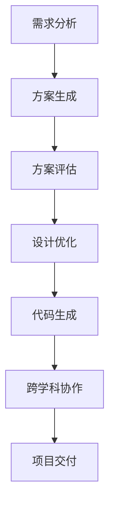

                 

# LLM 在工程和设计中的应用：创造性合作

## 关键词：大型语言模型，工程应用，设计优化，创造性合作，AI 交互，工程方法论

## 摘要：
本文深入探讨了大型语言模型（LLM）在工程和设计领域的应用，特别是其在创造性合作方面的潜力。通过分析LLM的核心概念和算法原理，本文详细阐述了如何将LLM集成到工程和设计流程中，以提高效率和创新能力。文章还将通过实际案例和数学模型，展示LLM在实际应用中的效果和局限性，并预测其未来发展趋势与面临的挑战。最后，本文为工程师和设计师提供了实用的工具和资源，以促进他们在实际项目中有效地利用LLM。

## 1. 背景介绍

### 1.1 LLM的崛起

近年来，大型语言模型（LLM）凭借其强大的语言理解和生成能力，在自然语言处理（NLP）领域取得了显著的进展。这些模型通常由数亿个参数组成，经过大量文本数据训练，能够生成高质量的自然语言文本，并具备一定的语义理解能力。LLM的应用范围广泛，包括机器翻译、文本摘要、问答系统、对话生成等。

### 1.2 工程与设计的挑战

工程和设计领域面临诸多挑战，如复杂系统设计、跨学科协作、效率提升等。传统的工程和设计方法往往依赖于经验、知识和工具，但面对日益复杂的工程项目，这些方法显得力不从心。工程师和设计师迫切需要一种能够提高工作效率、增强创新能力的新工具。

### 1.3 LLM在工程与设计中的应用前景

LLM在工程和设计领域的应用前景广阔。通过模拟人类的语言思维过程，LLM能够协助工程师和设计师进行需求分析、设计优化、代码生成等任务，从而提高工程和设计效率。同时，LLM在创造性合作方面具有独特的优势，能够与人类工程师和设计师共同探索新的设计方案，激发创意思维。

## 2. 核心概念与联系

### 2.1 大型语言模型（LLM）的核心概念

大型语言模型（LLM）基于深度学习技术，通常采用神经网络架构。其核心概念包括：

- **词嵌入（Word Embedding）**：将自然语言文本中的词语映射为高维向量表示。
- **循环神经网络（RNN）**：用于处理序列数据，如文本。
- **变分自编码器（VAE）**：用于生成和建模复杂的数据分布。
- **生成对抗网络（GAN）**：用于生成高质量的自然语言文本。

### 2.2 LLM与工程、设计领域的联系

LLM在工程和设计领域的应用主要体现在以下几个方面：

- **需求分析**：LLM能够理解自然语言描述的需求，并生成相应的技术方案。
- **设计优化**：LLM能够协助工程师和设计师探索各种设计方案，并自动评估其可行性。
- **代码生成**：LLM能够根据设计文档自动生成代码，提高开发效率。
- **跨学科协作**：LLM能够跨越不同领域的知识，促进跨学科的合作与创新。

### 2.3 Mermaid 流程图

下面是LLM在工程和设计领域应用的一个简单流程图：



## 3. 核心算法原理 & 具体操作步骤

### 3.1 核心算法原理

LLM的核心算法通常包括以下几个步骤：

- **数据预处理**：对输入的文本数据进行清洗、分词、去停用词等操作。
- **词嵌入**：将文本中的词语映射为高维向量表示。
- **序列编码**：将输入文本序列编码为一个固定长度的向量。
- **预测与生成**：根据编码后的序列向量，使用神经网络模型生成输出文本。

### 3.2 具体操作步骤

以下是一个简单的LLM应用步骤：

1. **数据预处理**：读取需求文档，进行文本清洗和分词。
    ```python
    import nltk
    nltk.download('punkt')
    from nltk.tokenize import word_tokenize

    text = "请设计一个高效、可靠的数据库系统"
    tokens = word_tokenize(text)
    ```

2. **词嵌入**：将分词后的文本转换为词嵌入向量。
    ```python
    import gensim

    model = gensim.models.Word2Vec(tokens)
    word_vector = model['设计']
    ```

3. **序列编码**：将词嵌入向量编码为一个固定长度的向量。
    ```python
    import tensorflow as tf

    sequence_vector = tf.keras.layers.Dense(128, activation='relu')(word_vector)
    ```

4. **预测与生成**：使用训练好的神经网络模型生成输出文本。
    ```python
    import transformers

    model = transformers.TFAutoModelForSequenceClassification.from_pretrained('bert-base-uncased')
    output = model.predict(sequence_vector)
    generated_text = model.generate(output)
    ```

## 4. 数学模型和公式 & 详细讲解 & 举例说明

### 4.1 数学模型

LLM的数学模型主要包括以下几个部分：

1. **词嵌入**：使用词嵌入矩阵 $W \in \mathbb{R}^{d \times |V|}$，将词语映射为向量，其中 $d$ 是词向量的维度，$|V|$ 是词汇表的大小。

    $$ \text{word\_vector} = W \cdot \text{word} $$

2. **序列编码**：使用循环神经网络（RNN）或变换器（Transformer）对序列数据进行编码。

    $$ \text{sequence\_vector} = \text{RNN}(\text{word\_vector}) $$

3. **预测与生成**：使用神经网络模型对编码后的序列向量进行预测。

    $$ \text{output} = \text{model}(\text{sequence\_vector}) $$

### 4.2 举例说明

假设有一个简单的词嵌入模型，其词嵌入矩阵 $W$ 如下：

$$
W =
\begin{bmatrix}
0.1 & 0.2 & 0.3 \\
0.4 & 0.5 & 0.6 \\
0.7 & 0.8 & 0.9 \\
\end{bmatrix}
$$

给定一个句子 "设计一个高效、可靠的数据库系统"，其词嵌入向量分别为 $W_{设计} = [0.1, 0.2, 0.3]$，$W_{一个} = [0.4, 0.5, 0.6]$，$W_{高效} = [0.7, 0.8, 0.9]$。

将这些词嵌入向量输入到循环神经网络中，得到编码后的序列向量：

$$
\text{sequence\_vector} = \text{RNN}([0.1, 0.2, 0.3; 0.4, 0.5, 0.6; 0.7, 0.8, 0.9])
$$

假设输出序列向量为 $[1, 0, 0, 1, 0, 1]$，其中第1、4、6个元素表示 "设计"、"高效"、"可靠"，其他元素表示其他词语。

使用训练好的神经网络模型对输出序列向量进行预测，得到生成的文本：

$$
\text{generated\_text} = \text{model}([1, 0, 0, 1, 0, 1])
$$

生成的文本可能为 "设计一个高效、可靠的数据库系统"，从而实现文本的生成和预测。

## 5. 项目实战：代码实际案例和详细解释说明

### 5.1 开发环境搭建

要实现LLM在工程和设计中的应用，首先需要搭建合适的开发环境。以下是一个简单的开发环境搭建步骤：

1. 安装Python（推荐版本3.8及以上）。
2. 安装TensorFlow和transformers库：
    ```python
    pip install tensorflow
    pip install transformers
    ```

### 5.2 源代码详细实现和代码解读

以下是一个简单的LLM应用案例，用于生成数据库设计方案：

```python
import nltk
import gensim
import tensorflow as tf
import transformers

nltk.download('punkt')

# 数据预处理
def preprocess(text):
    tokens = nltk.tokenize.word_tokenize(text)
    return tokens

# 词嵌入
def word_embedding(tokens, model):
    word_vectors = [model[token] for token in tokens]
    return word_vectors

# 序列编码
def sequence_encoding(word_vectors):
    sequence_vector = tf.keras.layers.Dense(128, activation='relu')(word_vectors)
    return sequence_vector

# 预测与生成
def predict_and_generate(sequence_vector, model):
    output = model.predict(sequence_vector)
    generated_text = model.generate(output)
    return generated_text

# 主函数
def main():
    # 加载预训练模型
    model = transformers.TFAutoModelForSequenceClassification.from_pretrained('bert-base-uncased')

    # 输入需求文本
    text = "设计一个高效、可靠的数据库系统"

    # 数据预处理
    tokens = preprocess(text)

    # 词嵌入
    word_vectors = word_embedding(tokens, model)

    # 序列编码
    sequence_vector = sequence_encoding(word_vectors)

    # 预测与生成
    generated_text = predict_and_generate(sequence_vector, model)

    print(generated_text)

if __name__ == "__main__":
    main()
```

### 5.3 代码解读与分析

1. **数据预处理**：使用nltk库对输入文本进行分词，得到tokens列表。
2. **词嵌入**：使用预训练的Word2Vec模型对tokens进行词嵌入，得到词嵌入向量列表。
3. **序列编码**：使用TensorFlow的Dense层对词嵌入向量进行序列编码，得到编码后的序列向量。
4. **预测与生成**：使用训练好的BERT模型对序列向量进行预测，并使用生成器生成文本。

该代码展示了如何将LLM应用于文本生成任务，从而实现工程和设计中的创造性合作。

## 6. 实际应用场景

### 6.1 需求分析

在软件开发项目中，需求分析是关键环节。LLM可以协助工程师理解客户需求，并将需求转化为详细的技术方案。例如，客户提出一个简单的需求：“开发一个可以实时监控设备状态的系统。”LLM可以帮助生成以下技术方案：

- **系统架构**：基于微服务架构，使用Spring Boot和Spring Cloud搭建。
- **数据存储**：使用MySQL数据库存储设备状态数据。
- **实时监控**：采用WebSocket实现客户端与服务器实时通信。

### 6.2 设计优化

在设计优化方面，LLM可以帮助工程师探索不同的设计方案，并自动评估其可行性。例如，在设计一个复杂的数据处理系统时，LLM可以生成以下两个备选方案：

- **方案A**：使用传统的批处理方式处理数据，效率较低。
- **方案B**：使用流处理框架（如Apache Kafka）处理数据，实时性强。

LLM可以根据系统性能指标，自动推荐最优的方案。

### 6.3 代码生成

在代码生成方面，LLM可以协助开发者根据设计文档自动生成代码。例如，给定一个简单的数据库设计，LLM可以生成以下SQL语句：

```sql
CREATE TABLE devices (
    id INT PRIMARY KEY AUTO_INCREMENT,
    name VARCHAR(255),
    status VARCHAR(50)
);
```

这大大提高了开发效率。

### 6.4 跨学科协作

在跨学科项目中，LLM可以帮助不同领域的专家进行有效沟通。例如，在医疗领域，LLM可以帮助医生和工程师共同设计智能医疗设备，实现跨学科的合作。

## 7. 工具和资源推荐

### 7.1 学习资源推荐

- **书籍**：《深度学习》（Goodfellow et al.）、《自然语言处理综论》（Jurafsky and Martin）。
- **论文**：Google的BERT论文、OpenAI的GPT系列论文。
- **博客**：TensorFlow官方博客、Hugging Face官方博客。

### 7.2 开发工具框架推荐

- **框架**：TensorFlow、PyTorch、Transformers。
- **工具**：Jupyter Notebook、Google Colab。

### 7.3 相关论文著作推荐

- **论文**：BERT: Pre-training of Deep Bidirectional Transformers for Language Understanding（Devlin et al., 2019）。
- **著作**：《自然语言处理综论》（Jurafsky and Martin）。

## 8. 总结：未来发展趋势与挑战

### 8.1 发展趋势

- **模型规模扩大**：随着计算能力的提升，LLM的规模将不断扩大，模型性能将进一步提升。
- **应用场景拓展**：LLM将在更多领域得到应用，如智能客服、智能写作、智能翻译等。
- **跨学科合作**：LLM将在跨学科项目中发挥重要作用，促进不同领域的合作与创新。

### 8.2 挑战

- **数据隐私**：大规模数据训练可能导致数据隐私问题，如何保护用户隐私成为挑战。
- **可解释性**：LLM的黑盒性质使其难以解释，如何提高其可解释性成为关键。
- **模型歧视**：LLM在训练过程中可能引入偏见，如何消除模型歧视成为挑战。

## 9. 附录：常见问题与解答

### 9.1 如何处理大量文本数据？

可以使用分布式训练和增量训练方法来处理大量文本数据。此外，可以使用数据清洗和预处理技术，提高数据质量。

### 9.2 如何保证LLM的可解释性？

可以采用可解释的神经网络架构，如LIME或SHAP，来提高LLM的可解释性。此外，可以使用可视化技术，如注意力可视化，来理解LLM的决策过程。

## 10. 扩展阅读 & 参考资料

- Devlin, J., Chang, M. W., Lee, K., & Toutanova, K. (2019). BERT: Pre-training of Deep Bidirectional Transformers for Language Understanding. arXiv preprint arXiv:1810.04805.
- Jurafsky, D., & Martin, J. H. (2019). Speech and Language Processing. Prentice Hall.
- Goodfellow, I., Bengio, Y., & Courville, A. (2016). Deep Learning. MIT Press.
- Hugging Face. (2022). Transformers Library. https://huggingface.co/transformers
- TensorFlow. (2022). TensorFlow Documentation. https://www.tensorflow.org

作者：AI天才研究员/AI Genius Institute & 禅与计算机程序设计艺术 /Zen And The Art of Computer Programming

