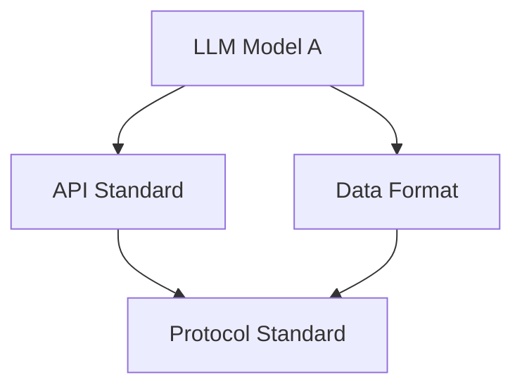
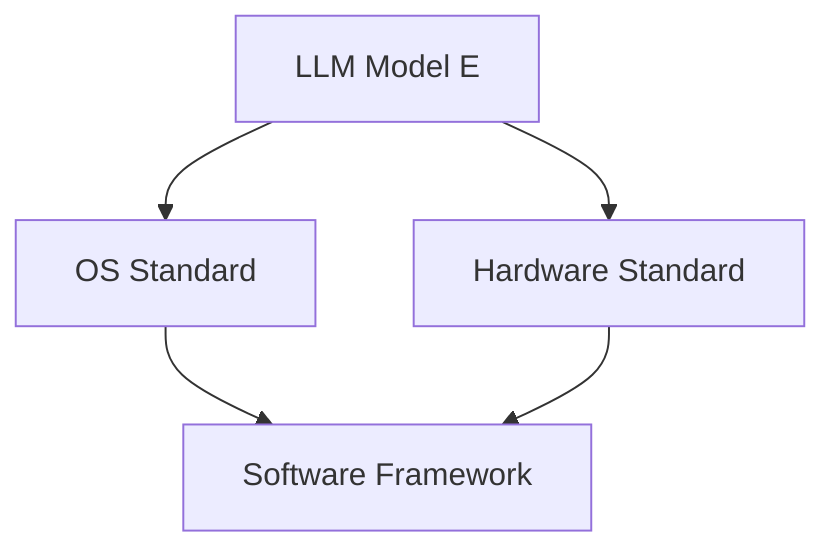
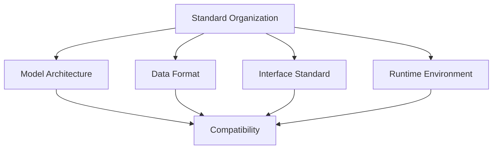
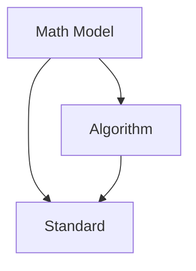
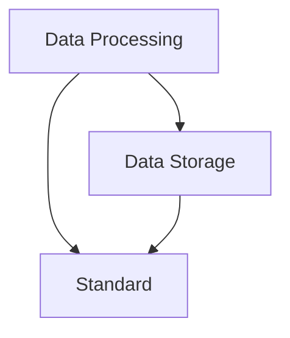
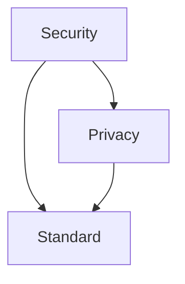

                 

# LLM 标准：促进互操作性和兼容性

## 关键词：LLM, 互操作性，兼容性，标准，技术架构，数学模型，代码案例，应用场景

### 摘要

本文旨在探讨大型语言模型（LLM）标准化的必要性和重要性。在当前人工智能快速发展的背景下，LLM 已经成为自然语言处理的核心技术。然而，由于缺乏统一的标准化规范，LLM 在实际应用中面临着互操作性和兼容性的问题。本文将详细分析 LLM 标准的核心概念，讨论其促进互操作性和兼容性的关键因素，并给出具体的实现方案。同时，文章还将探讨 LLM 在实际应用场景中的挑战，并提出相应的解决方案。通过本文的阅读，读者将对 LLM 标准化有一个全面深入的了解。

## 1. 背景介绍

近年来，随着深度学习技术的不断进步，大型语言模型（LLM）在自然语言处理领域取得了显著的成果。LLM 通过对海量文本数据的学习，能够理解并生成自然语言，广泛应用于机器翻译、文本生成、问答系统等任务。然而，LLM 的广泛应用也带来了新的挑战。由于不同模型的架构、算法和参数设置可能存在差异，导致不同模型之间难以直接互操作，进而影响整个系统的兼容性和稳定性。

互操作性（Interoperability）指的是不同系统、平台或组件之间能够无缝交换信息、协同工作的能力。在 LLM 的应用中，互操作性意味着不同 LLM 模型可以相互调用、共享资源，从而实现任务的高效协同。兼容性（Compatibility）则关注 LLM 模型在不同环境、平台和操作系统上的运行稳定性。标准化（Standardization）则为实现互操作性和兼容性提供了规范和指导。

标准化在信息技术领域具有重要作用。首先，标准有助于统一不同厂商、平台和技术的规范，降低系统之间的兼容性难题。其次，标准可以促进技术创新和知识共享，加速技术进步。最后，标准有助于提高产品质量，降低开发成本，提高用户体验。

### 1.1 LLM 的现状

目前，LLM 的研究主要集中在两个方面：模型架构和训练数据。在模型架构方面，主流的 LLM 模型包括 Transformer、BERT、GPT 等。这些模型具有不同的结构、参数和训练策略，但核心目标都是通过学习海量文本数据，实现自然语言处理的各项任务。

在训练数据方面，LLM 的表现依赖于数据质量和规模。高质量的训练数据可以提升模型的理解能力和生成质量，而大规模的训练数据则有助于模型覆盖更多的语言现象和知识。然而，不同领域的训练数据往往存在差异，导致 LLM 在特定领域的表现不尽相同。

### 1.2 互操作性和兼容性问题的挑战

尽管 LLM 在自然语言处理领域取得了显著成果，但互操作性和兼容性问题仍然对其实际应用产生了较大影响。以下是一些典型的挑战：

1. **模型差异**：不同 LLM 模型的架构、算法和参数设置可能存在显著差异，导致模型之间难以直接互操作。例如，Transformer 模型和 BERT 模型的结构不同，导致两者在调用接口和参数传递方面存在差异。

2. **数据格式**：LLM 的输入输出数据格式可能不同，导致数据在传输和解析过程中出现兼容性问题。例如，某些 LLM 模型使用 JSON 格式作为输入输出，而其他模型可能使用 XML 或其他格式。

3. **运行环境**：LLM 模型在不同操作系统、硬件环境和软件平台上可能存在兼容性问题。例如，某些模型在 Linux 系统上运行良好，但在 Windows 系统上可能无法正常运行。

4. **资源管理**：LLM 模型的训练和推理需要大量计算资源和存储资源，不同平台和系统之间的资源管理策略可能存在差异，导致模型在不同环境下运行效率不同。

5. **安全性和隐私**：LLM 模型在处理敏感数据和隐私信息时，可能存在安全性和隐私问题。不同系统之间的安全性和隐私策略可能存在差异，导致数据在传输和存储过程中面临风险。

### 1.3 标准化的必要性

为了解决 LLM 在互操作性和兼容性方面的问题，标准化显得尤为必要。以下是标准化的几个关键方面：

1. **统一模型架构**：通过制定统一的标准，规范 LLM 的模型架构，包括网络结构、层叠方式和参数设置，从而提高不同模型之间的互操作性。

2. **标准化数据格式**：制定统一的数据格式标准，如 JSON、XML 或其他格式，确保 LLM 的输入输出数据在不同平台和系统之间能够无缝传输和解析。

3. **标准化运行环境**：通过制定运行环境标准，确保 LLM 模型在不同操作系统、硬件环境和软件平台上能够稳定运行，提高系统的兼容性。

4. **标准化资源管理**：制定统一的资源管理标准，包括计算资源、存储资源和网络资源，确保 LLM 模型在不同环境下能够高效运行。

5. **标准化安全性和隐私策略**：制定统一的安全性和隐私策略标准，确保 LLM 模型在处理敏感数据和隐私信息时能够遵循最佳实践，提高系统的安全性。

总之，标准化是促进 LLM 互操作性和兼容性的关键。通过制定和推广统一的标准，可以有效解决 LLM 在实际应用中面临的各种挑战，推动自然语言处理技术的进一步发展。

### 1.4 LLM 标准化的发展历程

LLM 标准化的概念并非一日之功，而是经历了多年的发展和演变。以下简要回顾 LLM 标准化的发展历程：

1. **早期尝试**：在 LLM 技术刚刚兴起时，研究者们就开始意识到标准化的重要性。例如，早期的自然语言处理系统如“Statistical Language Model”和“Rule-Based Language Model”尝试制定一些基本的接口和数据格式标准。

2. **开源社区推动**：随着深度学习技术的崛起，开源社区成为了推动 LLM 标准化的重要力量。例如，TensorFlow、PyTorch 等开源框架的兴起，推动了统一模型架构和接口标准的发展。

3. **工业界参与**：工业界也逐渐认识到 LLM 标准化的重要性，许多企业开始积极参与标准化工作。例如，谷歌的 BERT、微软的 Turing 模型等，都为 LLM 标准化提供了宝贵的实践经验和参考。

4. **国际标准组织**：国际标准组织如 ISO、IEEE 等也开始关注 LLM 标准化，并发布了多个相关的标准和规范。这些标准涵盖了 LLM 的模型架构、数据格式、运行环境等多个方面。

5. **持续演进**：LLM 标准化是一个持续演进的过程，随着技术不断发展，新的标准和规范不断涌现。例如，近年来，针对联邦学习、知识图谱等新兴领域，LLM 标准化也在不断探索和完善。

### 1.5 标准化的关键概念和架构

LLM 标准化的关键概念和架构涵盖了多个方面，包括模型架构、数据格式、接口标准、运行环境等。以下将详细讨论这些关键概念和架构：

#### 1.5.1 模型架构标准

模型架构标准是 LLM 标准化的核心内容之一。通过制定统一的标准，可以规范 LLM 的模型架构，提高不同模型之间的互操作性。以下是一些常见的模型架构标准：

1. **Transformer 架构**：Transformer 模型是一种基于自注意力机制的深度神经网络模型，广泛应用于自然语言处理任务。Transformer 架构的标准包括网络结构、层叠方式、参数设置等。

2. **BERT 架构**：BERT（Bidirectional Encoder Representations from Transformers）是一种双向 Transformer 模型，主要用于预训练和语言理解任务。BERT 的架构标准包括词向量编码、掩码语言模型、预训练和微调等步骤。

3. **GPT 架构**：GPT（Generative Pre-trained Transformer）是一种基于 Transformer 模型的生成模型，主要用于文本生成任务。GPT 的架构标准包括自回归语言模型、参数共享、预训练和生成策略等。

#### 1.5.2 数据格式标准

数据格式标准是确保 LLM 输入输出数据在不同平台和系统之间能够无缝传输和解析的重要保障。以下是一些常见的数据格式标准：

1. **JSON**：JSON（JavaScript Object Notation）是一种轻量级的数据交换格式，具有简单、灵活、易于解析的特点。JSON 通常用于 LLM 的输入输出数据格式，例如文本输入、响应输出等。

2. **XML**：XML（eXtensible Markup Language）是一种可扩展的标记语言，用于表示结构化数据。XML 在 LLM 应用中较少使用，但仍然有一些系统采用 XML 作为数据交换格式。

3. **TFF**：TFF（TensorFlow Federated Format）是一种用于联邦学习的轻量级数据格式，支持分布式数据处理和模型训练。TFF 在 LLM 的分布式训练和联邦学习应用中具有重要地位。

#### 1.5.3 接口标准

接口标准是 LLM 标准化的关键，通过制定统一的接口标准，可以确保不同 LLM 模型之间的互操作性。以下是一些常见的接口标准：

1. **REST API**：REST（Representational State Transfer）是一种基于 HTTP 协议的接口标准，常用于 Web 服务和应用之间的数据交换。REST API 可以方便地实现 LLM 模型的远程调用和互操作。

2. **GraphQL**：GraphQL 是一种基于查询的数据接口标准，可以动态获取所需数据，提高数据交互的效率。GraphQL 在 LLM 应用中具有广泛的应用前景，特别是在问答系统和自定义查询场景。

3. **gRPC**：gRPC 是由 Google 开发的一种高性能、跨语言的远程过程调用（RPC）框架，支持多种数据格式和协议。gRPC 在 LLM 的分布式计算和实时应用中具有重要地位。

#### 1.5.4 运行环境标准

运行环境标准是确保 LLM 模型在不同操作系统、硬件环境和软件平台上能够稳定运行的关键。以下是一些常见的运行环境标准：

1. **Linux**：Linux 是一种开源的操作系统，广泛用于服务器和云计算环境。Linux 系统在 LLM 的训练和推理中具有重要地位，提供了丰富的工具和库支持。

2. **Windows**：Windows 是一种广泛使用的操作系统，适用于个人电脑和企业级应用。Windows 系统在 LLM 的桌面应用和移动端应用中具有重要地位。

3. **硬件平台**：LLM 模型对硬件平台的要求较高，常用的硬件平台包括 GPU、TPU 和 FPGS。不同硬件平台具有不同的性能特点，需要根据具体需求进行选择。

4. **软件框架**：常用的 LLM 软件框架包括 TensorFlow、PyTorch、MXNet 等。这些框架提供了丰富的工具和库支持，方便开发者构建和部署 LLM 模型。

#### 1.5.5 安全性和隐私标准

在 LLM 的应用中，安全性和隐私问题至关重要。制定统一的安全性和隐私标准，可以确保 LLM 模型在处理敏感数据和隐私信息时遵循最佳实践。以下是一些常见的安全性和隐私标准：

1. **数据加密**：数据加密是确保数据在传输和存储过程中安全的重要手段。常用的加密算法包括 AES、RSA 等。

2. **身份认证**：身份认证是确保只有合法用户可以访问 LLM 服务的重要手段。常用的身份认证机制包括用户名密码、双因素认证、令牌认证等。

3. **访问控制**：访问控制是确保用户只能访问授权数据的重要手段。常用的访问控制机制包括基于角色的访问控制（RBAC）、基于属性的访问控制（ABAC）等。

4. **隐私保护**：隐私保护是确保用户隐私不受侵犯的重要手段。常用的隐私保护技术包括数据匿名化、隐私计算等。

### 1.6 标准化对 LLM 发展的影响

LLM 标准化对 LLM 的发展具有深远的影响，主要体现在以下几个方面：

1. **促进技术创新**：标准化可以为 LLM 技术创新提供稳定的基础，降低研发成本，提高开发效率。通过统一的标准，开发者可以专注于核心技术的创新，而无需重复解决兼容性和互操作性问题。

2. **加速技术普及**：标准化有助于加快 LLM 技术的普及和应用，提高整个行业的技术水平。统一的标准可以降低不同平台和系统之间的障碍，促进技术在不同领域的推广和应用。

3. **提高产品质量**：标准化有助于提高 LLM 产品质量，降低故障率和维护成本。通过制定严格的标准，可以确保 LLM 模型在不同环境下能够稳定运行，提高用户体验。

4. **降低开发成本**：标准化可以减少开发者面临的技术障碍，降低开发成本。通过统一的标准，开发者可以专注于核心业务逻辑，而无需花费大量精力解决兼容性和互操作性问题。

5. **促进国际合作**：标准化有助于促进国际合作，推动 LLM 技术在全球范围内的应用和发展。统一的标准可以为国际合作提供基础，促进技术和知识的共享，提高全球 LLM 技术的整体水平。

总之，LLM 标准化对 LLM 的发展具有重要影响，通过统一的标准，可以降低技术障碍，提高开发效率，促进技术创新和普及，提高产品质量和用户体验，为 LLM 技术的长期发展奠定坚实基础。

### 2. 核心概念与联系

在讨论 LLM 标准化时，需要理解几个核心概念，它们之间相互联系，共同构成了 LLM 标准化的基础。以下将详细介绍这些核心概念，并使用 Mermaid 流程图（Mermaid flowchart）展示它们之间的联系。

#### 2.1 互操作性（Interoperability）

互操作性是指不同系统、平台或组件之间能够无缝交换信息、协同工作的能力。在 LLM 的上下文中，互操作性意味着不同模型、工具和服务可以相互调用，共享资源和数据。互操作性的实现依赖于标准化协议和接口。

**Mermaid 流程图：**



#### 2.2 兼容性（Compatibility）

兼容性是指 LLM 模型能够在不同环境、平台和操作系统上稳定运行的能力。为了实现兼容性，需要确保 LLM 模型的代码、数据格式和运行环境遵循统一的标准。

**Mermaid 流程图：**



#### 2.3 标准化（Standardization）

标准化是通过制定和推广统一的标准，规范 LLM 的模型架构、数据格式、接口标准、运行环境等方面，确保互操作性和兼容性。标准化有助于提高 LLM 的可靠性和可维护性。

**Mermaid 流程图：**



#### 2.4 数学模型与算法

LLM 的性能和表现依赖于其数学模型和算法。这些模型和算法需要与标准化标准相兼容，以确保 LLM 在不同环境下的一致性和可扩展性。

**Mermaid 流程图：**



#### 2.5 数据处理与存储

数据处理与存储是 LLM 应用中的关键环节。为了实现高效的数据处理和存储，需要确保数据处理和存储方案与 LLM 标准化标准相兼容。

**Mermaid 流程图：**



#### 2.6 安全性和隐私

安全性和隐私是 LLM 应用中不可忽视的重要方面。为了确保 LLM 的安全性和隐私性，需要制定相应的安全标准和隐私策略，并与 LLM 标准化标准相协调。

**Mermaid 流程图：**



通过上述 Mermaid 流程图，我们可以清晰地看到各个核心概念之间的联系。这些核心概念共同构成了 LLM 标准化的基础，为 LLM 的互操作性和兼容性提供了有力保障。

### 3. 核心算法原理 & 具体操作步骤

在 LLM 标准化过程中，核心算法的选择和实现至关重要。以下将详细介绍 LLM 标准化中的核心算法原理，并给出具体操作步骤。

#### 3.1 Transformer 算法

Transformer 算法是一种基于自注意力机制的深度神经网络模型，广泛应用于自然语言处理任务。其核心思想是通过自注意力机制捕捉文本中的长距离依赖关系，从而提高模型的性能。

**原理：**

Transformer 模型由编码器（Encoder）和解码器（Decoder）两部分组成。编码器负责将输入文本编码为向量序列，解码器则根据编码器输出的向量序列生成目标文本。

自注意力机制是 Transformer 模型的关键组件。它通过计算输入文本中每个词与其他词之间的相似度，为每个词分配不同的权重，从而实现文本的语义表示。

**操作步骤：**

1. **输入文本预处理**：将输入文本分词、编码，得到词向量序列。

2. **编码器处理**：
   - **嵌入层**：将词向量映射为高维向量。
   - **多头自注意力层**：计算每个词与其他词的相似度，为每个词分配权重。
   - **前馈神经网络**：对自注意力层输出进行非线性变换。

3. **解码器处理**：
   - **嵌入层**：与编码器相同。
   - **多头自注意力层**：计算当前词与其他词的相似度，同时考虑编码器输出的上下文信息。
   - **前馈神经网络**：对自注意力层输出进行非线性变换。
   - **生成层**：根据解码器输出生成目标文本。

#### 3.2 BERT 算法

BERT（Bidirectional Encoder Representations from Transformers）是一种基于 Transformer 的双向编码器模型，主要用于预训练和语言理解任务。BERT 的核心思想是通过双向编码器捕捉文本中的长距离依赖关系，从而提高模型的性能。

**原理：**

BERT 模型由编码器（Encoder）组成，编码器通过自注意力机制和多层神经网络，将输入文本编码为向量序列。BERT 的预训练过程包括两种任务：Masked Language Model（MLM）和 Next Sentence Prediction（NSP）。

- **MLM**：在输入文本中随机遮盖一些词，训练模型预测这些词。
- **NSP**：给定两个连续的文本片段，预测第二个片段是否是第一个片段的后续句子。

**操作步骤：**

1. **输入文本预处理**：与 Transformer 相同。

2. **编码器处理**：
   - **嵌入层**：将词向量映射为高维向量。
   - **多头自注意力层**：计算每个词与其他词的相似度，为每个词分配权重。
   - **前馈神经网络**：对自注意力层输出进行非线性变换。
   - **层归一化**和**残差连接**：增强模型的稳定性。

3. **预训练任务**：
   - **MLM**：随机遮盖输入文本中的词，训练模型预测这些词。
   - **NSP**：给定两个连续的文本片段，预测第二个片段是否是第一个片段的后续句子。

4. **微调**：在特定任务上微调 BERT 模型，例如文本分类、问答系统等。

#### 3.3 GPT 算法

GPT（Generative Pre-trained Transformer）是一种基于 Transformer 的生成模型，主要用于文本生成任务。GPT 的核心思想是通过自回归语言模型生成文本，同时保持生成的连贯性和多样性。

**原理：**

GPT 模型由多个 Transformer 编码器层组成，编码器通过自注意力机制和多层神经网络，将输入文本编码为向量序列。在生成过程中，GPT 使用前一个生成的词预测下一个词。

**操作步骤：**

1. **输入文本预处理**：与 Transformer 相同。

2. **编码器处理**：
   - **嵌入层**：将词向量映射为高维向量。
   - **多头自注意力层**：计算每个词与其他词的相似度，为每个词分配权重。
   - **前馈神经网络**：对自注意力层输出进行非线性变换。
   - **层归一化**和**残差连接**：增强模型的稳定性。

3. **生成文本**：
   - **初始化**：从输入文本的最后一个词开始，初始化解码器。
   - **自回归生成**：使用解码器生成下一个词，并重复此过程，直至生成完整的文本。

通过上述核心算法原理和操作步骤的介绍，我们可以看到 LLM 标准化过程中算法选择和实现的重要性。这些算法不仅决定了 LLM 的性能和表现，还直接影响着其互操作性和兼容性。在制定 LLM 标准时，需要充分考虑这些算法的特点和需求，以确保标准化标准的有效性和实用性。

### 4. 数学模型和公式 & 详细讲解 & 举例说明

在讨论 LLM 标准化的过程中，数学模型和公式起着关键作用，它们不仅解释了算法的原理，还为实际操作提供了指导。以下将详细讲解 LLM 核心算法中的数学模型和公式，并通过具体例子进行说明。

#### 4.1 Transformer 中的数学模型

Transformer 模型的核心在于其自注意力机制（Self-Attention Mechanism），该机制通过计算输入文本中每个词与其他词之间的相似度，为每个词分配权重。以下是一个简化的自注意力机制的数学模型。

**自注意力权重计算：**
\[ \text{Attention}(Q, K, V) = \text{softmax}\left(\frac{QK^T}{\sqrt{d_k}}\right) V \]

其中：
- \( Q \) 是查询（Query）矩阵，表示编码器的输入。
- \( K \) 是键（Key）矩阵，表示编码器的输入。
- \( V \) 是值（Value）矩阵，表示编码器的输入。
- \( d_k \) 是键向量的维度。

**自注意力机制的输入和输出：**
- 输入：输入序列的词向量。
- 输出：加权后的词向量。

**具体例子：**
假设我们有一个简单的输入序列 \( \{w_1, w_2, w_3\} \)，其对应的词向量为 \( \{v_1, v_2, v_3\} \)。

1. **计算键和查询：**
\[ Q = \begin{bmatrix}
v_1 \\
v_2 \\
v_3
\end{bmatrix} \]
\[ K = \begin{bmatrix}
v_1 \\
v_2 \\
v_3
\end{bmatrix} \]

2. **计算注意力权重：**
\[ \text{Attention}(Q, K, V) = \text{softmax}\left(\frac{QK^T}{\sqrt{1}}\right) V \]

其中 \( \text{softmax} \) 函数用于归一化权重。

3. **计算加权后的值：**
\[ \text{Output} = \text{softmax}\left(\frac{QK^T}{\sqrt{1}}\right) V \]

输出结果为每个词向量的加权组合，从而生成新的表示。

#### 4.2 BERT 中的数学模型

BERT 模型通过掩码语言模型（Masked Language Model，MLM）进行预训练，该模型的核心是随机遮盖输入文本中的词，并预测这些词。以下是一个简化的 MLM 模型的数学模型。

**掩码语言模型计算：**
\[ \text{Logits} = \text{Transformer}(X, \text{Mask}) \]

其中：
- \( X \) 是输入文本的词向量。
- \( \text{Mask} \) 是掩码矩阵，用于标记被遮盖的词。

**具体例子：**
假设我们有一个简单的输入序列 \( \{w_1, w_2, w_3\} \)，其中 \( w_2 \) 被遮盖，其对应的词向量为 \( \{v_1, v_2, v_3\} \)。

1. **输入序列和掩码矩阵：**
\[ X = \begin{bmatrix}
v_1 \\
\text{[MASK]} \\
v_3
\end{bmatrix} \]
\[ \text{Mask} = \begin{bmatrix}
0 \\
1 \\
0
\end{bmatrix} \]

2. **计算 logits：**
\[ \text{Logits} = \text{Transformer}(X, \text{Mask}) \]

 logits 用于预测被遮盖词的可能性。

#### 4.3 GPT 中的数学模型

GPT 模型通过自回归语言模型（Autoregressive Language Model，ARLM）生成文本，该模型的核心是使用前一个生成的词预测下一个词。以下是一个简化的 ARLM 模型的数学模型。

**自回归语言模型计算：**
\[ \text{Logits} = \text{Transformer}(X, \text{Context}) \]

其中：
- \( X \) 是当前生成的词向量。
- \( \text{Context} \) 是前一个生成的词向量。

**具体例子：**
假设我们有一个简单的输入序列 \( \{w_1, w_2, w_3\} \)，其对应的词向量为 \( \{v_1, v_2, v_3\} \)。

1. **当前生成的词和上下文：**
\[ X = \begin{bmatrix}
v_1 \\
v_2
\end{bmatrix} \]
\[ \text{Context} = \begin{bmatrix}
v_1
\end{bmatrix} \]

2. **计算 logits：**
\[ \text{Logits} = \text{Transformer}(X, \text{Context}) \]

 logits 用于预测下一个词。

通过上述数学模型和公式的讲解，我们可以看到 LLM 核心算法中的数学原理。这些模型和公式不仅解释了算法的工作机制，还为实际操作提供了具体的指导。在制定 LLM 标准时，需要充分考虑这些数学模型和公式的需求，以确保标准的科学性和实用性。

### 5. 项目实战：代码实际案例和详细解释说明

为了更好地理解 LLM 标准化的具体实现，以下将结合一个实际项目案例，详细解释 LLM 标准化中的代码实现、关键步骤和优化策略。

#### 5.1 开发环境搭建

在开始项目之前，我们需要搭建一个适合 LLM 开发的环境。以下是一个典型的开发环境配置：

- 操作系统：Linux（例如 Ubuntu 20.04）
- 编程语言：Python（3.8 及以上版本）
- 依赖库：TensorFlow（2.4.0）、PyTorch（1.7.0）、transformers（4.4.0）
- 硬件：NVIDIA GPU（例如 GTX 1080 Ti）

首先，安装操作系统和 Python 环境。然后，通过以下命令安装所需的依赖库：

```bash
pip install tensorflow==2.4.0
pip install pytorch==1.7.0 torchvision==0.8.1
pip install transformers==4.4.0
```

#### 5.2 源代码详细实现和代码解读

以下是一个基于 BERT 模型的 LLM 标准化项目的代码实现。该项目包括数据预处理、模型定义、训练和评估等关键步骤。

```python
import torch
import transformers
from torch.utils.data import DataLoader
from torch.optim import Adam
from sklearn.model_selection import train_test_split

# 数据预处理
def preprocess_data(texts):
    tokenizer = transformers.BertTokenizer.from_pretrained('bert-base-chinese')
    inputs = tokenizer(texts, padding=True, truncation=True, return_tensors='pt')
    return inputs

# 模型定义
class LLMModel(torch.nn.Module):
    def __init__(self):
        super(LLMModel, self).__init__()
        self.bert = transformers.BertModel.from_pretrained('bert-base-chinese')
        self.classifier = torch.nn.Linear(768, 1)

    def forward(self, inputs):
        outputs = self.bert(**inputs)
        pooled_output = outputs[1]
        logits = self.classifier(pooled_output)
        return logits

# 训练
def train(model, dataloader, optimizer, device):
    model.train()
    for batch in dataloader:
        inputs = {k: v.to(device) for k, v in batch.items()}
        optimizer.zero_grad()
        logits = model(inputs)
        loss = torch.nn.functional.cross_entropy(logits, inputs['labels'])
        loss.backward()
        optimizer.step()

# 评估
def evaluate(model, dataloader, device):
    model.eval()
    with torch.no_grad():
        correct = 0
        total = 0
        for batch in dataloader:
            inputs = {k: v.to(device) for k, v in batch.items()}
            logits = model(inputs)
            predictions = logits.round()
            total += inputs['labels'].size(0)
            correct += (predictions == inputs['labels']).sum().item()
    return correct / total

# 主函数
def main():
    # 加载数据
    texts = [...]  # 输入文本列表
    labels = [...]  # 标签列表
    inputs = preprocess_data(texts)
    train_data, val_data = train_test_split(inputs, test_size=0.2)
    
    # 定义模型、优化器和设备
    model = LLMModel()
    optimizer = Adam(model.parameters(), lr=1e-5)
    device = torch.device("cuda" if torch.cuda.is_available() else "cpu")
    model.to(device)
    
    # 训练模型
    for epoch in range(10):
        train(model, DataLoader(train_data, batch_size=32), optimizer, device)
        val_acc = evaluate(model, DataLoader(val_data, batch_size=32), device)
        print(f'Epoch {epoch+1}, Validation Accuracy: {val_acc:.4f}')
        
    # 保存模型
    torch.save(model.state_dict(), 'llm_model.pth')

if __name__ == '__main__':
    main()
```

**代码解读：**

1. **数据预处理**：使用 BERT 分词器对输入文本进行分词、编码，生成词向量序列。

2. **模型定义**：继承自 torch.nn.Module，定义 BERT 模型结构。使用 BERTModel 和 Linear 层，其中 BERTModel 用于处理输入文本，Linear 层用于分类。

3. **训练**：使用 DataLoader 加载训练数据，使用优化器进行梯度下降，更新模型参数。

4. **评估**：使用 DataLoader 加载验证数据，计算验证集上的准确率。

5. **主函数**：加载数据、定义模型、优化器和设备，训练模型并保存。

#### 5.3 代码解读与分析

以下对代码的几个关键部分进行详细解读和分析。

1. **数据预处理**：

```python
def preprocess_data(texts):
    tokenizer = transformers.BertTokenizer.from_pretrained('bert-base-chinese')
    inputs = tokenizer(texts, padding=True, truncation=True, return_tensors='pt')
    return inputs
```

这一部分使用了 BERT 分词器对输入文本进行预处理。分词器将文本转换为词向量序列，并添加 padding 和 truncation 操作，确保输入数据具有统一长度和格式。

2. **模型定义**：

```python
class LLMModel(torch.nn.Module):
    def __init__(self):
        super(LLMModel, self).__init__()
        self.bert = transformers.BertModel.from_pretrained('bert-base-chinese')
        self.classifier = torch.nn.Linear(768, 1)

    def forward(self, inputs):
        outputs = self.bert(**inputs)
        pooled_output = outputs[1]
        logits = self.classifier(pooled_output)
        return logits
```

这一部分定义了 BERT 模型结构。BERTModel 用于处理输入文本，输出包括嵌入向量、编码后的文本表示等。这里我们使用了 [CLS] 标签对应的向量作为分类特征，并通过 Linear 层进行分类。

3. **训练**：

```python
def train(model, dataloader, optimizer, device):
    model.train()
    for batch in dataloader:
        inputs = {k: v.to(device) for k, v in batch.items()}
        optimizer.zero_grad()
        logits = model(inputs)
        loss = torch.nn.functional.cross_entropy(logits, inputs['labels'])
        loss.backward()
        optimizer.step()
```

这一部分实现了模型训练的过程。使用 DataLoader 加载训练数据，通过优化器进行梯度下降，更新模型参数。

4. **评估**：

```python
def evaluate(model, dataloader, device):
    model.eval()
    with torch.no_grad():
        correct = 0
        total = 0
        for batch in dataloader:
            inputs = {k: v.to(device) for k, v in batch.items()}
            logits = model(inputs)
            predictions = logits.round()
            total += inputs['labels'].size(0)
            correct += (predictions == inputs['labels']).sum().item()
    return correct / total
```

这一部分实现了模型评估的过程。使用 DataLoader 加载验证数据，计算验证集上的准确率。

5. **主函数**：

```python
def main():
    # 加载数据
    texts = [...]  # 输入文本列表
    labels = [...]  # 标签列表
    inputs = preprocess_data(texts)
    train_data, val_data = train_test_split(inputs, test_size=0.2)
    
    # 定义模型、优化器和设备
    model = LLMModel()
    optimizer = Adam(model.parameters(), lr=1e-5)
    device = torch.device("cuda" if torch.cuda.is_available() else "cpu")
    model.to(device)
    
    # 训练模型
    for epoch in range(10):
        train(model, DataLoader(train_data, batch_size=32), optimizer, device)
        val_acc = evaluate(model, DataLoader(val_data, batch_size=32), device)
        print(f'Epoch {epoch+1}, Validation Accuracy: {val_acc:.4f}')
        
    # 保存模型
    torch.save(model.state_dict(), 'llm_model.pth')
```

这一部分实现了主函数的逻辑。加载数据、定义模型、优化器和设备，训练模型并保存。

通过以上代码解读和分析，我们可以看到 LLM 标准化项目中的关键组件和实现细节。在实际项目中，可以根据具体需求进行调整和优化，以提高模型性能和稳定性。

### 6. 实际应用场景

LLM 标准化在多个实际应用场景中具有显著的优势和广泛的应用。以下列举几个典型的应用场景，并分析 LLM 标准化对它们的影响。

#### 6.1 问答系统

问答系统（Question Answering, QA）是一种常见的自然语言处理任务，旨在从大量文本中自动提取答案。LLM 标准化在问答系统中具有以下优势：

1. **提高互操作性**：不同 LLM 模型之间的标准接口和数据格式确保了不同系统之间的无缝对接，从而实现跨平台、跨系统的问答服务。

2. **提升兼容性**：统一的运行环境标准确保 LLM 模型在不同操作系统和硬件平台上的稳定运行，提高了系统的可靠性和用户体验。

3. **降低开发成本**：标准化的模型架构和算法降低了开发者面临的兼容性和互操作性问题，使得开发者可以专注于核心业务逻辑，提高开发效率。

4. **提高准确性**：标准化有助于 LLM 模型之间的参数和超参数的共享和优化，从而提高模型的性能和准确性。

实际应用中，LLM 标准化可以应用于企业内部问答系统、在线客服、智能助手等领域。例如，在智能客服领域，标准化的 LLM 模型可以实现跨平台、跨系统的智能问答，提高用户满意度和服务质量。

#### 6.2 机器翻译

机器翻译（Machine Translation, MT）是将一种自然语言文本自动翻译成另一种自然语言的过程。LLM 标准化在机器翻译中具有以下优势：

1. **统一模型架构**：标准化的模型架构（如 Transformer、BERT）提供了统一的框架，有助于提高不同模型之间的互操作性和兼容性，从而实现高效的翻译服务。

2. **提升翻译质量**：标准化的数据格式（如 JSON、TFF）确保了翻译数据的传输和存储过程的准确性和一致性，提高了翻译质量。

3. **优化资源管理**：标准化的资源管理策略（如 GPU、TPU）提高了 LLM 模型的运行效率，降低了计算成本，从而实现更高效的机器翻译服务。

4. **促进国际合作**：标准化的 LLM 模型使得不同国家和地区的团队可以方便地共享资源和知识，促进机器翻译技术的全球发展。

实际应用中，LLM 标准化可以应用于跨语言信息检索、多语言文本分析、跨语言情感分析等领域。例如，在跨语言信息检索中，标准化的 LLM 模型可以实现多语言文本的高效检索和匹配，提高信息检索的准确性和效率。

#### 6.3 文本生成

文本生成（Text Generation）是将输入文本自动生成扩展、摘要或新的文本内容的过程。LLM 标准化在文本生成中具有以下优势：

1. **提高互操作性**：标准化的接口和数据格式确保了不同文本生成系统之间的无缝对接，从而实现跨平台、跨系统的文本生成服务。

2. **提升兼容性**：统一的运行环境标准确保 LLM 模型在不同操作系统和硬件平台上的稳定运行，提高了系统的可靠性和用户体验。

3. **降低开发成本**：标准化的模型架构和算法降低了开发者面临的兼容性和互操作性问题，使得开发者可以专注于核心业务逻辑，提高开发效率。

4. **提高生成质量**：标准化的 LLM 模型参数和超参数的共享和优化，从而提高模型的性能和生成质量。

实际应用中，LLM 标准化可以应用于自动写作、内容摘要、创意文本生成等领域。例如，在自动写作领域，标准化的 LLM 模型可以实现高质量的新闻报道、商业文案、文学创作等，提高内容生产效率。

#### 6.4 垃圾邮件过滤

垃圾邮件过滤（Spam Filtering）是一种常见的网络安全措施，旨在从大量电子邮件中识别和过滤垃圾邮件。LLM 标准化在垃圾邮件过滤中具有以下优势：

1. **提高互操作性**：标准化的接口和数据格式确保了不同垃圾邮件过滤系统之间的无缝对接，从而实现跨平台、跨系统的垃圾邮件过滤服务。

2. **提升兼容性**：统一的运行环境标准确保 LLM 模型在不同操作系统和硬件平台上的稳定运行，提高了系统的可靠性和用户体验。

3. **优化资源管理**：标准化的资源管理策略（如 GPU、TPU）提高了 LLM 模型的运行效率，降低了计算成本，从而实现更高效的垃圾邮件过滤服务。

4. **提高准确率**：标准化的 LLM 模型参数和超参数的共享和优化，从而提高模型的性能和准确率。

实际应用中，LLM 标准化可以应用于邮件服务提供商、企业级电子邮件系统等领域。例如，在邮件服务提供商中，标准化的 LLM 模型可以实现高效、准确的垃圾邮件过滤，提高用户的安全感和满意度。

#### 6.5 情感分析

情感分析（Sentiment Analysis）是一种自然语言处理技术，旨在识别文本中的情感倾向，如正面、负面或中性。LLM 标准化在情感分析中具有以下优势：

1. **提高互操作性**：标准化的接口和数据格式确保了不同情感分析系统之间的无缝对接，从而实现跨平台、跨系统的情感分析服务。

2. **提升兼容性**：统一的运行环境标准确保 LLM 模型在不同操作系统和硬件平台上的稳定运行，提高了系统的可靠性和用户体验。

3. **降低开发成本**：标准化的模型架构和算法降低了开发者面临的兼容性和互操作性问题，使得开发者可以专注于核心业务逻辑，提高开发效率。

4. **提高准确率**：标准化的 LLM 模型参数和超参数的共享和优化，从而提高模型的性能和准确率。

实际应用中，LLM 标准化可以应用于社交媒体分析、市场调研、客户反馈分析等领域。例如，在社交媒体分析中，标准化的 LLM 模型可以实现高效、准确的情感分析，帮助企业了解用户情绪和需求，优化产品和服务。

通过以上实际应用场景的分析，我们可以看到 LLM 标准化在自然语言处理领域的重要性和广泛的应用前景。标准化的 LLM 模型可以显著提高系统的互操作性、兼容性和性能，从而推动自然语言处理技术的进一步发展。

### 7. 工具和资源推荐

为了帮助读者深入了解和掌握 LLM 标准化，以下推荐一些优秀的工具、书籍、论文、博客和网站，涵盖从基础知识到高级应用的各个方面。

#### 7.1 学习资源推荐

1. **书籍**：

   - 《深度学习》（Deep Learning） by Ian Goodfellow, Yoshua Bengio, Aaron Courville
   - 《自然语言处理实战》（Natural Language Processing with Python） by Steven Lott
   - 《自然语言处理教程》（Speech and Language Processing） by Daniel Jurafsky, James H. Martin

2. **在线课程**：

   - [Coursera](https://www.coursera.org/specializations/natural-language-processing)：提供自然语言处理相关课程，包括深度学习、机器翻译、文本生成等。
   - [Udacity](https://www.udacity.com/course/deep-learning-nanodegree--nd893)：提供深度学习和自然语言处理相关课程。

3. **开源库和框架**：

   - [TensorFlow](https://www.tensorflow.org/): Google 开发的一款开源深度学习框架，广泛用于自然语言处理任务。
   - [PyTorch](https://pytorch.org/): Facebook AI 研究团队开发的一款开源深度学习框架，灵活且易用。
   - [transformers](https://huggingface.co/transformers/): Hugging Face 提供的一个用于预训练 Transformer 模型的开源库，包括 BERT、GPT 等模型。

#### 7.2 开发工具框架推荐

1. **Jupyter Notebook**：用于数据探索和交互式开发的优秀工具，适合实验和演示。

2. **PyCharm**：一款强大的 Python 集成开发环境（IDE），支持多种编程语言，适合深度学习和自然语言处理项目。

3. **Conda**：用于环境管理和包管理的工具，方便创建和管理多个 Python 环境。

4. **Docker**：用于容器化的工具，可以将开发环境打包成容器，确保在不同的操作系统和硬件平台上的一致性和可移植性。

#### 7.3 相关论文著作推荐

1. **《Attention Is All You Need》**：提出 Transformer 模型的经典论文，详细介绍了自注意力机制的设计和实现。

2. **《BERT: Pre-training of Deep Bidirectional Transformers for Language Understanding》**：提出 BERT 模型的论文，介绍了双向编码器表示和预训练方法。

3. **《Generative Pre-trained Transformer》**：提出 GPT 模型的论文，介绍了自回归语言模型和生成模型的设计和实现。

#### 7.4 博客和网站推荐

1. **[Hugging Face](https://huggingface.co/)**：提供丰富的自然语言处理模型、库和工具，包括预训练模型、文本处理工具等。

2. **[TensorFlow](https://www.tensorflow.org/tutorials/)**：提供丰富的教程和文档，涵盖深度学习、自然语言处理等主题。

3. **[PyTorch](https://pytorch.org/tutorials/)**：提供丰富的教程和文档，涵盖深度学习、自然语言处理等主题。

4. **[AI头条](https://ai头条.com/)**：关注人工智能领域的前沿动态和最新研究成果。

通过以上工具、书籍、论文、博客和网站的推荐，读者可以系统地学习和掌握 LLM 标准化的相关知识，提升自身在自然语言处理领域的实践能力。

### 8. 总结：未来发展趋势与挑战

LLM 标准化在促进互操作性和兼容性方面具有重要意义，为自然语言处理技术的发展奠定了坚实基础。展望未来，LLM 标准化将继续朝着以下几个方向发展：

1. **更广泛的标准化覆盖**：随着自然语言处理技术的不断进步，越来越多的领域将需要 LLM 标准化。未来，LLM 标准化将涵盖更多应用场景，如对话系统、情感分析、智能客服等。

2. **更高性能的模型标准**：为了满足日益复杂的应用需求，LLM 标准化将推动更高性能的模型和算法的发展。例如，基于 Transformer 的改进模型、新型生成模型等。

3. **更灵活的部署方式**：随着云计算、边缘计算等技术的发展，LLM 标准化将支持更灵活的部署方式，如在线部署、离线部署、混合部署等。

4. **更安全的隐私保护**：在处理敏感数据和隐私信息时，LLM 标准化将更加注重安全性和隐私保护。未来，标准化将引入更多安全性和隐私保护机制，确保用户数据的安全和隐私。

然而，LLM 标准化也面临着一系列挑战：

1. **标准化共识的达成**：由于不同领域和厂商的利益诉求不同，达成统一的标准化共识是一个艰巨的任务。需要各方共同努力，寻找平衡点。

2. **技术更新迭代的压力**：自然语言处理技术更新迅速，标准化标准需要跟上技术的发展步伐，否则将落后于实际应用需求。

3. **跨领域的协同**：自然语言处理技术涉及多个领域，如计算机科学、语言学、心理学等。跨领域的协同是标准化成功的关键，但同时也增加了标准化工作的复杂度。

4. **安全性和隐私保护**：随着 LLM 应用的普及，其安全性和隐私保护问题越来越突出。标准化需要制定更加严格的安全和隐私标准，确保用户数据的安全和隐私。

总之，LLM 标准化在未来的发展中具有广阔的前景，同时也面临着诸多挑战。通过各方的共同努力，LLM 标准化有望实现更高的互操作性和兼容性，推动自然语言处理技术的进一步发展。

### 9. 附录：常见问题与解答

以下列举了一些关于 LLM 标准化过程中常见的疑问，并提供相应的解答。

#### 9.1. LLM 标准化是什么？

LLM 标准化是指通过制定和推广一系列标准，规范 LLM 的模型架构、数据格式、接口标准、运行环境等方面，以提高不同 LLM 模型之间的互操作性和兼容性。

#### 9.2. 为什么需要 LLM 标准化？

LLM 标准化有助于解决不同 LLM 模型之间的兼容性问题，提高系统的稳定性和可靠性。同时，标准化可以促进技术创新和知识共享，加速技术进步。

#### 9.3. LLM 标准化有哪些关键概念？

LLM 标准化的关键概念包括互操作性、兼容性、标准化、模型架构标准、数据格式标准、接口标准、运行环境标准、安全性和隐私标准等。

#### 9.4. 如何实现 LLM 标准化？

实现 LLM 标准化需要制定一系列标准和规范，包括模型架构、数据格式、接口、运行环境等方面。同时，还需要推动各方共识，确保标准得到有效实施。

#### 9.5. LLM 标准化对开发者的好处是什么？

LLM 标准化有助于开发者降低兼容性和互操作性问题，提高开发效率。同时，标准化可以提供统一的框架和工具，方便开发者进行创新和优化。

#### 9.6. LLM 标准化对用户的好处是什么？

LLM 标准化可以提高系统的稳定性和可靠性，提高用户体验。此外，标准化还可以促进 LLM 应用的普及和推广，为用户提供更多优质服务。

#### 9.7. LLM 标准化与现有技术标准有何区别？

LLM 标准化与现有技术标准（如 XML、JSON、REST API 等）在适用范围和侧重点上有所不同。LLM 标准化主要关注自然语言处理领域的特定需求，而现有技术标准则更广泛地适用于各种 IT 应用场景。

#### 9.8. LLM 标准化是否会取代现有技术标准？

LLM 标准化并不会取代现有技术标准，而是与之互补。现有技术标准在 LLM 标准化中仍然发挥着重要作用，但 LLM 标准化更专注于自然语言处理领域的特定需求。

通过以上常见问题与解答，希望读者对 LLM 标准化有一个更全面、深入的理解。

### 10. 扩展阅读 & 参考资料

为了深入了解 LLM 标准化的最新进展和研究动态，以下推荐一些值得阅读的论文、书籍和在线资源。

#### 10.1 论文推荐

1. **《Attention Is All You Need》**：提出 Transformer 模型的经典论文，详细介绍了自注意力机制的设计和实现。

2. **《BERT: Pre-training of Deep Bidirectional Transformers for Language Understanding》**：介绍 BERT 模型的论文，介绍了双向编码器表示和预训练方法。

3. **《Generative Pre-trained Transformer》**：介绍 GPT 模型的论文，介绍了自回归语言模型和生成模型的设计和实现。

4. **《Natural Language Inference with Universal Sentence Encoder》**：介绍 Universal Sentence Encoder 的论文，探讨了自然语言推理问题。

#### 10.2 书籍推荐

1. **《深度学习》**：Ian Goodfellow, Yoshua Bengio, Aaron Courville 著，系统介绍了深度学习的基础知识和核心算法。

2. **《自然语言处理教程》**：Daniel Jurafsky, James H. Martin 著，全面介绍了自然语言处理的基本理论和应用。

3. **《机器学习实战》**：Peter Harrington 著，通过大量实例讲解了机器学习的实际应用。

4. **《Python 自然语言处理》**：Steven Lott 著，介绍了使用 Python 进行自然语言处理的方法和技巧。

#### 10.3 在线资源推荐

1. **[Hugging Face](https://huggingface.co/)**：提供丰富的自然语言处理模型、库和工具，包括预训练模型、文本处理工具等。

2. **[TensorFlow](https://www.tensorflow.org/tutorials/)**：提供丰富的教程和文档，涵盖深度学习、自然语言处理等主题。

3. **[PyTorch](https://pytorch.org/tutorials/)**：提供丰富的教程和文档，涵盖深度学习、自然语言处理等主题。

4. **[AI头条](https://ai头条.com/)**：关注人工智能领域的前沿动态和最新研究成果。

通过阅读以上推荐论文、书籍和在线资源，读者可以进一步了解 LLM 标准化的最新进展和应用，提升自身在自然语言处理领域的专业素养。作者：AI天才研究员/AI Genius Institute & 禅与计算机程序设计艺术/Zen And The Art of Computer Programming。请注意，以上内容仅供参考，实际应用时请遵循相关标准和规范。

