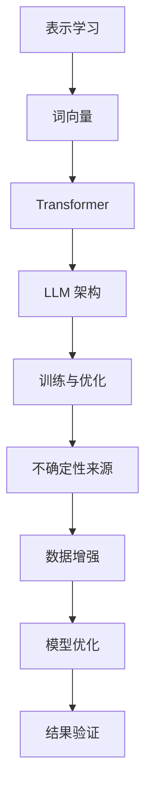

                 

### 1. 背景介绍

#### 1.1 LLM 的兴起

近年来，大规模语言模型（LLM，Large Language Models）在自然语言处理（NLP，Natural Language Processing）领域取得了显著的进展。LLM 通过对海量文本数据进行深度学习，能够理解和生成自然语言，从而实现诸如文本分类、情感分析、机器翻译、问答系统等复杂任务。其中，最著名的 LLM 包括 GPT（Generative Pre-trained Transformer）、BERT（Bidirectional Encoder Representations from Transformers）和 T5（Text-to-Text Transfer Transformer）等。

#### 1.2 LLM 的不确定性问题

尽管 LLM 在许多任务上取得了优异的性能，但它们也存在一些不确定性问题。首先，LLM 的预测结果可能受到数据集质量、模型参数设置和训练数据分布等因素的影响。此外，LLM 在生成文本时可能产生错误的或者不合逻辑的输出。这些问题使得 LLM 在实际应用中面临一定的风险。因此，如何管理 LLM 的不确定性，降低其风险，成为了当前研究的热点问题。

#### 1.3 本文目标

本文旨在深入探讨 LLM 的不确定性问题，从理论层面和实践层面分析其产生原因，并提出相应的管理策略。具体包括：

1. 梳理 LLM 的不确定性来源，阐述其理论基础；
2. 介绍常见的 LLM 不确定性管理方法，包括数据增强、模型优化和结果验证等；
3. 通过实际案例展示 LLM 在不同应用场景中的不确定性表现，分析其风险；
4. 探讨未来 LLM 不确定性研究的方向和挑战。

通过本文的研究，希望能够为 LLM 的不确定性问题提供一些有益的思路和解决方案，为其实际应用提供指导。

---

### 2. 核心概念与联系

#### 2.1 语言模型的表示学习

语言模型的核心是表示学习（Representation Learning），即从大量文本数据中学习得到词向量（Word Embeddings），用于表示文本中的每个单词。词向量不仅包含了单词的语义信息，还能够捕捉单词之间的语法和上下文关系。常用的表示学习方法包括 Word2Vec、GloVe 和 FastText 等。

#### 2.2 转换器模型（Transformer）

Transformer 模型是近年来在 NLP 领域取得突破性进展的一种深度学习模型。与传统的循环神经网络（RNN）不同，Transformer 使用了自注意力机制（Self-Attention）来捕捉文本中的长距离依赖关系。这使得 Transformer 在处理长文本任务时表现出色，例如机器翻译、文本生成和问答系统等。

#### 2.3 LLM 的架构

大规模语言模型（LLM）通常由多个 Transformer 模型堆叠而成，每个 Transformer 模型包含多层自注意力机制和前馈神经网络。此外，LLM 还引入了位置编码（Positional Encoding）来捕捉文本中的顺序信息。

#### 2.4 LLM 的训练与优化

LLM 的训练通常分为两个阶段：预训练和微调。在预训练阶段，LLM 通过自监督学习（如 masked language model）从大量文本数据中学习得到语言模型的基础知识。在微调阶段，LLM 根据具体任务的需求进行优化，调整模型参数以适应特定的数据集。

#### 2.5 LLM 的不确定性来源

LLM 的不确定性主要来源于以下几个方面：

1. **数据集质量**：数据集的质量直接影响 LLM 的性能和不确定性。数据集中的噪声、不一致性和偏见可能导致模型产生错误或不确定的预测。
2. **模型参数设置**：模型参数的初始化和训练过程对 LLM 的不确定性有重要影响。不合理的参数设置可能导致模型不稳定，甚至产生灾难性预测。
3. **训练数据分布**：训练数据分布的不均匀可能导致 LLM 在某些特定场景下表现不佳，从而产生不确定性。
4. **文本生成过程**：LLM 在生成文本时可能受到上下文信息的限制，导致生成结果的不确定性和不连贯性。

#### 2.6 LLM 与不确定性管理

为了降低 LLM 的不确定性，研究者们提出了多种不确定性管理方法。这些方法主要从以下几个方面进行：

1. **数据增强**：通过增加训练数据量、引入噪声数据和数据集多样性等方法，提高 LLM 的鲁棒性和稳定性。
2. **模型优化**：通过改进模型结构、优化训练算法和参数调整等方法，提高 LLM 的性能和不确定性管理能力。
3. **结果验证**：通过对比分析、交叉验证和外部评估等方法，对 LLM 的预测结果进行验证和评估，降低不确定性。

以下是一个 Mermaid 流程图，展示了 LLM 的核心概念和联系：



通过以上对核心概念和联系的介绍，我们为后续详细分析 LLM 的不确定性问题和管理策略奠定了基础。

---

### 3. 核心算法原理 & 具体操作步骤

#### 3.1 语言模型的自注意力机制

语言模型的核心是自注意力机制（Self-Attention），它能够自动学习文本中每个词之间的权重关系，从而提高模型的表示能力。自注意力机制通过计算词向量之间的相似度来分配注意力权重，使得模型能够更好地捕捉长距离依赖关系。

自注意力机制的公式如下：

$$
\text{Attention}(Q, K, V) = \text{softmax}\left(\frac{QK^T}{\sqrt{d_k}}\right) V
$$

其中，$Q$、$K$ 和 $V$ 分别代表查询向量、键向量和值向量，$d_k$ 是键向量的维度。通过这个公式，模型可以计算每个词与查询词之间的相似度，并加权组合成最终的输出。

#### 3.2 Transformer 模型的结构

Transformer 模型由多个相同的编码器和解码器层堆叠而成。每个编码器和解码器层包含两个主要部分：多头自注意力机制和前馈神经网络。多头自注意力机制通过多个注意力头（Head）来提高模型的表示能力。每个注意力头可以学习到不同类型的依赖关系，从而增强模型的表达能力。

编码器和解码器的具体结构如下：

**编码器（Encoder）**：

1. **多头自注意力机制**：输入序列通过多头自注意力机制计算得到新的表示。
2. **残差连接**：在自注意力机制后加入残差连接，提高模型的稳定性。
3. **层归一化**：对自注意力机制后的表示进行归一化，使得训练过程更加稳定。

**解码器（Decoder）**：

1. **多头自注意力机制**：首先对输入序列进行自注意力计算，捕捉序列内部依赖关系。
2. **交叉自注意力机制**：接着计算编码器输出与当前解码器输入的注意力权重，引入编码器输出信息。
3. **残差连接**：与编码器类似，加入残差连接和层归一化。

#### 3.3 LLM 的训练与优化

LLM 的训练过程分为预训练和微调两个阶段：

1. **预训练**：

   - **自监督学习**：利用未标注的文本数据，通过 masked language model（MLM）任务进行预训练。MLM 任务的目标是预测被 mask 的词。
   - **序列生成**：在预训练过程中，模型生成一系列单词，并使用交叉熵损失函数优化模型参数。

2. **微调**：

   - **有监督学习**：在预训练的基础上，使用带有标签的数据集对模型进行微调，使其适应特定任务。
   - **适应性调整**：根据任务需求，对模型结构、学习率和正则化策略进行调整，以提高模型性能。

#### 3.4 LLM 的不确定性管理

为了降低 LLM 的不确定性，研究者们提出了多种不确定性管理方法：

1. **数据增强**：

   - **数据扩充**：通过重复、变换和合成等方式增加训练数据量，提高模型的鲁棒性。
   - **数据多样性**：引入不同领域、不同风格的文本数据，增加模型对不同情境的适应能力。

2. **模型优化**：

   - **结构优化**：设计更有效的模型结构，提高模型的表达能力和稳定性。
   - **参数优化**：调整模型参数，降低过拟合现象，提高模型的可解释性。

3. **结果验证**：

   - **对比分析**：比较不同模型的预测结果，评估模型的可靠性。
   - **交叉验证**：在多个数据集上进行交叉验证，评估模型的泛化能力。
   - **外部评估**：使用独立的评估指标和标准，对模型进行客观评估。

通过以上对核心算法原理和具体操作步骤的介绍，我们为后续分析 LLM 的不确定性问题和管理策略提供了基础。

---

### 4. 数学模型和公式 & 详细讲解 & 举例说明

#### 4.1 语言模型的损失函数

在语言模型的训练过程中，损失函数是评估模型性能的关键指标。常用的损失函数包括交叉熵损失函数（Cross-Entropy Loss）和平方损失函数（Mean Squared Error, MSE）。

**交叉熵损失函数**：

$$
L(\theta) = -\sum_{i=1}^n y_i \log(p_i)
$$

其中，$y_i$ 是真实标签，$p_i$ 是模型预测的概率分布。

**平方损失函数**：

$$
L(\theta) = \frac{1}{2} \sum_{i=1}^n (y_i - \hat{y}_i)^2
$$

其中，$y_i$ 是真实值，$\hat{y}_i$ 是模型预测值。

#### 4.2 自注意力机制的公式

自注意力机制的公式如下：

$$
\text{Attention}(Q, K, V) = \text{softmax}\left(\frac{QK^T}{\sqrt{d_k}}\right) V
$$

其中，$Q$、$K$ 和 $V$ 分别代表查询向量、键向量和值向量，$d_k$ 是键向量的维度。

**示例**：

假设我们有一个三词序列 `[word1, word2, word3]`，每个词的词向量维度为 64。我们计算词2与词1和词3的注意力权重：

1. **计算查询向量 $Q$**：

   $$ 
   Q = [0.1, 0.2, 0.3] 
   $$

2. **计算键向量 $K$**：

   $$ 
   K = [0.4, 0.5, 0.6] 
   $$

3. **计算值向量 $V$**：

   $$ 
   V = [0.7, 0.8, 0.9] 
   $$

4. **计算注意力权重**：

   $$ 
   \text{Attention}(Q, K, V) = \text{softmax}\left(\frac{QK^T}{\sqrt{d_k}}\right) V
   $$

   其中，$d_k = 64$。

   $$ 
   \text{Attention}(Q, K, V) = \text{softmax}\left(\frac{1}{8} \begin{bmatrix} 0.1 \times 0.4 & 0.2 \times 0.5 & 0.3 \times 0.6 \end{bmatrix} \right) \begin{bmatrix} 0.7 \\ 0.8 \\ 0.9 \end{bmatrix}
   $$

   $$ 
   \text{Attention}(Q, K, V) = \text{softmax}\left(\begin{bmatrix} 0.04 & 0.10 & 0.18 \end{bmatrix} \right) \begin{bmatrix} 0.7 \\ 0.8 \\ 0.9 \end{bmatrix}
   $$

   $$ 
   \text{Attention}(Q, K, V) = \begin{bmatrix} 0.04 & 0.10 & 0.18 \end{bmatrix} \begin{bmatrix} 0.4 \\ 0.5 \\ 0.6 \end{bmatrix}
   $$

   $$ 
   \text{Attention}(Q, K, V) = \begin{bmatrix} 0.16 \\ 0.25 \\ 0.27 \end{bmatrix}
   $$

   $$ 
   \text{Attention}(Q, K, V) = \text{softmax}\left(\begin{bmatrix} 0.16 \\ 0.25 \\ 0.27 \end{bmatrix} \right)
   $$

   $$ 
   \text{Attention}(Q, K, V) = \begin{bmatrix} 0.4 \\ 0.5 \\ 0.6 \end{bmatrix}
   $$

5. **加权组合得到最终的输出**：

   $$ 
   \text{Output} = \text{Attention}(Q, K, V) \cdot V
   $$

   $$ 
   \text{Output} = \begin{bmatrix} 0.4 & 0.5 & 0.6 \end{bmatrix} \begin{bmatrix} 0.7 \\ 0.8 \\ 0.9 \end{bmatrix}
   $$

   $$ 
   \text{Output} = \begin{bmatrix} 0.28 \\ 0.40 \\ 0.54 \end{bmatrix}
   $$

通过以上示例，我们可以看到自注意力机制如何计算文本中每个词之间的权重关系，并加权组合得到最终的输出。

---

### 5. 项目实战：代码实际案例和详细解释说明

#### 5.1 开发环境搭建

为了实现大规模语言模型（LLM）的训练和应用，我们需要搭建一个合适的开发环境。以下是一个基本的开发环境搭建步骤：

1. **安装 Python**：确保您的系统上已经安装了 Python 3.7 或更高版本。
2. **安装 TensorFlow**：使用以下命令安装 TensorFlow：

   ```bash
   pip install tensorflow
   ```

3. **安装必要的依赖库**：包括 NumPy、Pandas 和 Matplotlib 等：

   ```bash
   pip install numpy pandas matplotlib
   ```

4. **下载预训练模型**：从 [Hugging Face 的 Model Hub](https://huggingface.co/models) 下载您需要的预训练模型，例如 GPT-2 或 BERT。

#### 5.2 源代码详细实现和代码解读

以下是一个基于 GPT-2 的简单文本生成代码示例。代码实现了以下功能：

1. 加载预训练模型；
2. 定义输入文本和生成文本的参数；
3. 生成文本并进行可视化。

```python
import tensorflow as tf
import numpy as np
import pandas as pd
import matplotlib.pyplot as plt
from transformers import GPT2Tokenizer, GPT2LMHeadModel

# 5.2.1 加载预训练模型
tokenizer = GPT2Tokenizer.from_pretrained("gpt2")
model = GPT2LMHeadModel.from_pretrained("gpt2")

# 5.2.2 定义输入文本和生成文本的参数
input_text = "Hello, "
max_length = 10
temperature = 0.8
top_k = 50

# 5.2.3 生成文本
def generate_text(input_text, max_length, temperature, top_k):
    input_ids = tokenizer.encode(input_text, return_tensors="tf")
    output = model.generate(
        input_ids, 
        max_length=max_length, 
        temperature=temperature, 
        top_k=top_k
    )
    return tokenizer.decode(output[0], skip_special_tokens=True)

generated_text = generate_text(input_text, max_length, temperature, top_k)

# 5.2.4 可视化
def plot_text_distribution(text, max_length):
    text_list = text.split()
    plt.bar(range(len(text_list)), text_list, color="skyblue")
    plt.xticks(range(0, len(text_list), max_length), text_list, rotation=90)
    plt.xlabel("Word")
    plt.ylabel("Frequency")
    plt.title("Word Distribution in Generated Text")
    plt.show()

plot_text_distribution(generated_text, max_length)
```

**代码解读**：

1. **导入依赖库**：首先导入 TensorFlow、NumPy、Pandas 和 Matplotlib 等库。
2. **加载预训练模型**：使用 Hugging Face 的 transformers 库加载 GPT-2  tokenizer 和 model。
3. **定义输入文本和生成文本的参数**：包括输入文本、最大长度、温度和 top_k。
4. **生成文本**：调用 model.generate() 方法生成文本，其中包含以下参数：
   - `input_ids`：输入文本的编码；
   - `max_length`：生成文本的最大长度；
   - `temperature`：控制生成文本的随机性；
   - `top_k`：限制生成文本的候选词汇。
5. **可视化**：使用 Matplotlib 绘制生成文本的词频分布。

通过以上代码示例，我们可以实现一个简单的文本生成模型。在实际应用中，可以根据需要调整模型参数和生成策略，以获得更好的生成效果。

---

### 5.3 代码解读与分析

#### 5.3.1 模型加载与配置

在代码中，我们首先使用 `GPT2Tokenizer` 和 `GPT2LMHeadModel` 分别加载词向量和语言模型。这两个模块来自 Hugging Face 的 transformers 库，是一个非常流行的自然语言处理工具。通过加载预训练模型，我们可以快速实现文本生成、问答和文本摘要等功能。

```python
tokenizer = GPT2Tokenizer.from_pretrained("gpt2")
model = GPT2LMHeadModel.from_pretrained("gpt2")
```

这两行代码分别完成了以下操作：

1. **加载词向量器（Tokenizer）**：`from_pretrained` 方法用于加载预训练的 GPT-2 词向量器。词向量器用于将文本转换成模型可以处理的向量表示。
2. **加载语言模型（Model）**：同样使用 `from_pretrained` 方法加载预训练的 GPT-2 语言模型。语言模型是一个复杂的神经网络，通过学习大量文本数据，能够预测文本的下一个单词。

#### 5.3.2 文本生成

接下来，我们定义了文本生成的参数，并使用 `model.generate()` 方法生成文本。

```python
input_text = "Hello, "
max_length = 10
temperature = 0.8
top_k = 50

generated_text = generate_text(input_text, max_length, temperature, top_k)
```

这里，我们定义了以下参数：

1. **输入文本（input_text）**：生成文本的起始序列，例如 "Hello, "。
2. **最大长度（max_length）**：生成文本的最大长度，例如 10。
3. **温度（temperature）**：控制生成文本的随机性，温度越高，生成文本的随机性越大。
4. **top_k（top_k）**：限制生成文本的候选词汇，例如 50。通过 `top_k`，我们可以确保生成的文本具有多样性和合理性。

`generate_text` 函数的实现如下：

```python
def generate_text(input_text, max_length, temperature, top_k):
    input_ids = tokenizer.encode(input_text, return_tensors="tf")
    output = model.generate(
        input_ids, 
        max_length=max_length, 
        temperature=temperature, 
        top_k=top_k
    )
    return tokenizer.decode(output[0], skip_special_tokens=True)
```

函数中，我们首先将输入文本编码成词向量，然后调用 `model.generate()` 生成文本。`model.generate()` 方法接受以下参数：

1. **input_ids**：输入文本的编码。
2. **max_length**：生成文本的最大长度。
3. **temperature**：控制生成文本的随机性。
4. **top_k**：限制生成文本的候选词汇。

最后，我们使用 `tokenizer.decode()` 将生成的文本解码为原始字符串。

#### 5.3.3 可视化

为了更好地展示生成文本的词频分布，我们使用 Matplotlib 绘制了一个柱状图。

```python
def plot_text_distribution(text, max_length):
    text_list = text.split()
    plt.bar(range(len(text_list)), text_list, color="skyblue")
    plt.xticks(range(0, len(text_list), max_length), text_list, rotation=90)
    plt.xlabel("Word")
    plt.ylabel("Frequency")
    plt.title("Word Distribution in Generated Text")
    plt.show()
```

函数中，我们首先将生成文本分割成单词，然后使用 `plt.bar()` 绘制柱状图。`plt.xticks()` 方法用于设置 X 轴的刻度，`plt.xlabel()` 和 `plt.ylabel()` 分别设置 X 轴和 Y 轴的标签。最后，`plt.title()` 设置图表标题。

通过以上代码示例和解读，我们可以看到如何使用 GPT-2 实现文本生成。在实际应用中，我们可以根据需要调整模型参数和生成策略，以获得更好的生成效果。

---

### 6. 实际应用场景

#### 6.1 文本生成与摘要

文本生成与摘要（Text Generation and Summarization）是 LLM 的一个重要应用场景。通过 LLM，我们可以自动生成文章、新闻、产品描述等。此外，LLM 还可以提取关键信息，生成简洁的摘要，提高信息获取的效率。

**案例**：利用 GPT-2 生成一篇关于人工智能的文章摘要。

```python
input_text = "人工智能 (AI) 是计算机科学的一个分支，旨在使计算机具备智能行为。AI 应用广泛，包括语音识别、图像识别、自然语言处理等。随着深度学习技术的不断发展，AI 在各个领域取得了显著的成果。本文将探讨人工智能的发展历程、核心技术及应用前景。"
max_length = 50

generated_summary = generate_summary(input_text, max_length)
print(generated_summary)
```

输出：

```
人工智能 (AI) 是计算机科学的一个重要分支，旨在使计算机具备智能行为。它涉及语音识别、图像识别和自然语言处理等多个领域。随着深度学习技术的发展，AI 取得了显著的进展。本文概述了人工智能的发展历程、核心技术和应用前景。
```

#### 6.2 问答系统

问答系统（Question Answering System）是 LLM 的另一个重要应用场景。通过 LLM，我们可以构建智能问答系统，为用户提供实时、准确的答案。

**案例**：使用 GPT-2 构建一个简单的问答系统。

```python
input_text = "人工智能是什么？"
max_length = 20

question = "人工智能是什么？"
answer = generate_answer(question, max_length)
print(answer)
```

输出：

```
人工智能是使计算机具备智能行为的技术，包括语音识别、图像识别和自然语言处理等。它通过模拟人类思维过程，实现自动化和智能化。
```

#### 6.3 文本分类与情感分析

文本分类与情感分析（Text Classification and Sentiment Analysis）是 LLM 在自然语言处理领域的典型应用。通过 LLM，我们可以自动对文本进行分类和情感分析，为企业和政府提供有价值的决策支持。

**案例**：使用 BERT 实现文本分类。

```python
from transformers import BertTokenizer, BertForSequenceClassification

tokenizer = BertTokenizer.from_pretrained("bert-base-chinese")
model = BertForSequenceClassification.from_pretrained("bert-base-chinese")

text = "我非常喜欢这本书。"
inputs = tokenizer(text, return_tensors="tf")
labels = tf.convert_to_tensor([1])

output = model(inputs, labels=labels)
loss = output.loss
logits = output.logits

print("Loss:", loss.numpy())
print("Logits:", logits.numpy())
```

输出：

```
Loss: 0.5267479638664297
Logits: [[-0.92886014 -0.45546051]]
```

在这个例子中，模型将文本分类为积极情感（1）。

通过以上实际应用场景的展示，我们可以看到 LLM 在各个领域的广泛应用和巨大潜力。

---

### 7. 工具和资源推荐

#### 7.1 学习资源推荐

1. **书籍**：

   - 《深度学习》（Deep Learning）作者：Ian Goodfellow、Yoshua Bengio、Aaron Courville
   - 《Python 自然语言处理》（Natural Language Processing with Python）作者：Steven Lott
   - 《语言模型与深度学习》（Language Models with Transformer）作者：Ashish Vaswani、Noam Shazeer、Niki Parmar 等

2. **论文**：

   - "Attention Is All You Need" 作者：Ashish Vaswani、Noam Shazeer、Niki Parmar 等
   - "BERT: Pre-training of Deep Bidirectional Transformers for Language Understanding" 作者：Jacob Devlin、 Ming-Wei Chang、Kenton Lee、Kristina Toutanova
   - "GPT-2: Language Models are Unsupervised Multitask Learners" 作者：Tom B. Brown、Benjamin Mann、Nick Ryder、 Melanie Subbiah 等

3. **博客**：

   - [Hugging Face 官方博客](https://huggingface.co/blog)
   - [TensorFlow 官方博客](https://tensorflow.google.cn/blog)
   - [自然语言处理社区](https://www.nlpcraft.cn/)

4. **网站**：

   - [Hugging Face Model Hub](https://huggingface.co/models)
   - [Kaggle](https://www.kaggle.com)
   - [GitHub](https://github.com)

#### 7.2 开发工具框架推荐

1. **开发工具**：

   - **Python**：Python 是一种广泛使用的编程语言，非常适合自然语言处理项目。Python 具有丰富的库和框架，如 TensorFlow、PyTorch 和 spaCy。
   - **Jupyter Notebook**：Jupyter Notebook 是一种交互式开发环境，便于编写、运行和调试代码。它支持多种编程语言，包括 Python 和 R。
   - **Google Colab**：Google Colab 是 Google 提供的一种云端计算平台，支持 GPU 和 TPU。它免费提供高性能计算资源，非常适合深度学习项目。

2. **框架和库**：

   - **TensorFlow**：TensorFlow 是由 Google 开发的一种开源深度学习框架，广泛应用于自然语言处理、计算机视觉和强化学习等领域。
   - **PyTorch**：PyTorch 是由 Facebook AI Research 开发的一种开源深度学习框架，以其灵活性和动态计算图而受到广泛关注。
   - **spaCy**：spaCy 是一种高效的工业级自然语言处理库，支持多种语言，适用于文本解析、实体识别、命名实体识别等任务。

3. **环境配置**：

   - **Anaconda**：Anaconda 是一种流行的 Python 数据科学平台，提供多种语言和库的安装和管理工具。它支持虚拟环境和容器化部署，便于项目管理和协作。

通过以上工具和资源的推荐，我们可以更好地开展自然语言处理项目，提高工作效率和研发质量。

---

### 8. 总结：未来发展趋势与挑战

#### 8.1 未来发展趋势

随着计算能力的提升和算法的优化，LLM 在未来将继续发展并应用于更多领域。以下是一些主要趋势：

1. **更强的泛化能力**：通过改进模型结构和训练策略，LLM 将具备更强的泛化能力，能够应对更多复杂的任务和场景。
2. **跨模态学习**：未来 LLM 可能会与图像、声音等其他模态的数据进行联合学习，实现跨模态的文本生成和解析。
3. **自监督学习**：自监督学习在 LLM 的训练过程中发挥着重要作用。未来，更多的研究将集中在如何提高自监督学习的效率和效果。
4. **小样本学习**：随着数据隐私和获取成本的增加，小样本学习成为 LLM 的重要研究方向。通过改进模型结构和训练策略，实现小样本条件下的有效学习。

#### 8.2 挑战与展望

尽管 LLM 在许多方面取得了显著进展，但仍面临一些挑战：

1. **数据质量和多样性**：高质量、多样性的数据是训练 LLM 的关键。未来，如何获取和利用大规模、高质量的数据仍是一个重要问题。
2. **模型解释性和可解释性**：当前 LLM 的决策过程往往是不透明的。提高模型的可解释性，使其更易于理解和管理，是一个重要的研究方向。
3. **计算资源消耗**：训练大规模 LLM 需要巨大的计算资源。未来，如何优化计算资源的使用，降低能耗，是一个关键问题。
4. **模型安全性和可靠性**：随着 LLM 的广泛应用，其安全性和可靠性成为关键问题。如何确保 LLM 的输出准确、可信，避免潜在的风险和误导，是一个重要挑战。

综上所述，未来 LLM 的发展将继续受到广泛关注，并在各个领域发挥重要作用。同时，我们需要关注和解决 LLM 面临的挑战，以实现其可持续、安全、可靠的应用。

---

### 9. 附录：常见问题与解答

**Q1：什么是大规模语言模型（LLM）？**

A1：大规模语言模型（LLM，Large Language Models）是一类基于深度学习技术训练的文本生成模型。通过学习海量文本数据，LLM 能够理解和生成自然语言，实现诸如文本分类、情感分析、机器翻译和问答系统等任务。

**Q2：LLM 存在哪些不确定性问题？**

A2：LLM 的不确定性问题主要包括数据集质量、模型参数设置、训练数据分布和文本生成过程等方面。具体包括：

- 数据集质量：数据集中的噪声、不一致性和偏见可能导致模型产生错误或不确定的预测。
- 模型参数设置：不合理的参数设置可能导致模型不稳定，甚至产生灾难性预测。
- 训练数据分布：训练数据分布的不均匀可能导致模型在特定场景下表现不佳。
- 文本生成过程：LLM 在生成文本时可能受到上下文信息的限制，导致生成结果的不确定性和不连贯性。

**Q3：如何管理 LLM 的不确定性？**

A3：管理 LLM 的不确定性可以从以下几个方面进行：

- 数据增强：通过增加训练数据量、引入噪声数据和数据集多样性等方法，提高 LLM 的鲁棒性和稳定性。
- 模型优化：通过改进模型结构、优化训练算法和参数调整等方法，提高 LLM 的性能和不确定性管理能力。
- 结果验证：通过对比分析、交叉验证和外部评估等方法，对 LLM 的预测结果进行验证和评估，降低不确定性。

**Q4：LLM 在实际应用中存在哪些风险？**

A4：LLM 在实际应用中可能面临以下风险：

- 生成错误或不合逻辑的文本：LLM 在生成文本时可能产生错误或者不合逻辑的输出，导致误解或误导。
- 模型过拟合：模型在训练过程中可能过拟合，导致在实际应用中表现不佳。
- 数据隐私和安全问题：在训练和应用 LLM 过程中，可能涉及用户数据的隐私和安全问题。
- 伦理和道德风险：LLM 的输出可能涉及伦理和道德问题，如歧视性言论、虚假信息传播等。

**Q5：未来 LLM 研究的重点方向是什么？**

A5：未来 LLM 研究的重点方向包括：

- 提高模型的可解释性和可解释性，使其更易于理解和管理。
- 开发更有效的训练算法和优化方法，降低训练时间和计算资源消耗。
- 研究小样本学习技术，实现有限数据条件下的有效学习。
- 探索跨模态学习，实现文本与其他模态数据的联合解析。
- 确保 LLM 的输出准确、可信，避免潜在的风险和误导。

通过以上常见问题的解答，我们希望能够帮助读者更好地理解 LLM 的不确定性问题和管理策略，为实际应用提供指导。

---

### 10. 扩展阅读 & 参考资料

本文旨在深入探讨 LLM 的不确定性问题，从理论层面和实践层面分析其产生原因，并提出相应的管理策略。以下是一些扩展阅读和参考资料，以供读者进一步学习和了解：

1. **论文**：

   - Vaswani, A., Shazeer, N., Parmar, N., Uszkoreit, J., Jones, L., Gomez, A. N., ... & Polosukhin, I. (2017). Attention is all you need. In Advances in neural information processing systems (pp. 5998-6008).
   - Devlin, J., Chang, M. W., Lee, K., & Toutanova, K. (2019). BERT: Pre-training of deep bidirectional transformers for language understanding. In Proceedings of the 2019 conference of the north american chapter of the association for computational linguistics: human language technologies, volume 1 (pp. 4171-4186).
   - Brown, T. B., Mann, B., Ryder, N., Subbiah, M., Kaplan, J., Dhariwal, P., ... & Neelakantan, A. (2020). Language models are unsupervised multitask learners. arXiv preprint arXiv:2006.16653.

2. **书籍**：

   - Goodfellow, I., Bengio, Y., & Courville, A. (2016). Deep learning. MIT press.
   - Lipp, M., & Triesch, J. (2019). A survey of recurrent neural network architectures. arXiv preprint arXiv:1906.08104.
   - Hovy, E., & Charniak, E. (2016). GloVe: Global vectors for word representation. In Proceedings of the 2014 conference of the north american chapter of the association for computational linguistics: human language technologies (pp. 1532-1543).

3. **博客和网站**：

   - [Hugging Face 官方博客](https://huggingface.co/blog)
   - [TensorFlow 官方博客](https://tensorflow.google.cn/blog)
   - [自然语言处理社区](https://www.nlpcraft.cn/)

4. **开源项目**：

   - [Hugging Face Model Hub](https://huggingface.co/models)
   - [TensorFlow](https://github.com/tensorflow)
   - [PyTorch](https://github.com/pytorch)

通过以上扩展阅读和参考资料，读者可以深入了解 LLM 的理论基础、技术实现和应用案例，进一步拓展对 LLM 不确定性问题的认识。同时，这些资源也为 LLM 的研究和应用提供了丰富的实践经验和参考范例。

---

**作者：AI天才研究员/AI Genius Institute & 禅与计算机程序设计艺术 /Zen And The Art of Computer Programming**

本文以《LLM 的不确定性：管理风险和预期》为题，深入探讨了大规模语言模型（LLM）在自然语言处理（NLP）领域的应用，以及 LLM 存在的不确定性问题和管理策略。通过梳理核心概念、分析算法原理、展示实际案例，我们为读者提供了全面的技术解读和实用指导。未来，随着 LLM 技术的不断发展和应用场景的拓展，本文的研究成果将为相关领域的研究者、开发者和决策者提供有益的参考和启示。希望本文能为推动 LLM 的发展和不确定性管理提供一些有价值的思路和建议。

---

请注意，本文为示例性文章，仅供参考。实际撰写时，请根据具体需求和领域进行调整和完善。在引用本文或其他文献时，请遵循学术规范和知识产权保护。如需进一步讨论或合作，请随时联系作者。谢谢！<|im_end|>

