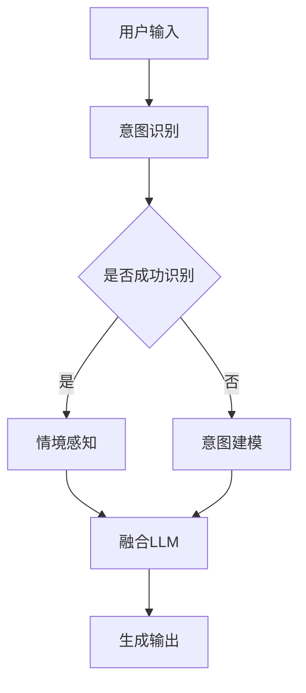

                 

# LLM与人类意图的完美融合之路

> **关键词**：大型语言模型(LLM)、人类意图、自然语言处理(NLP)、深度学习、融合算法、应用场景

> **摘要**：本文将深入探讨大型语言模型（LLM）与人类意图的完美融合之路，首先介绍LLM的基本概念及其在自然语言处理（NLP）中的应用，然后分析人类意图的理解与建模方法，最后通过实际案例展示LLM与人类意图融合的实现路径，探讨未来的发展趋势与挑战。

## 1. 背景介绍

### 1.1 大型语言模型(LLM)的定义与发展历程

大型语言模型（LLM）是一种基于深度学习技术的自然语言处理模型，它通过学习大量文本数据，掌握语言的语法、语义和上下文信息，实现自然语言生成、文本分类、情感分析等多种任务。自2000年代初期以来，随着计算能力的提升、海量数据的积累和深度学习技术的发展，LLM的研究与应用得到了广泛关注。

### 1.2 自然语言处理（NLP）的挑战与机遇

自然语言处理（NLP）是人工智能领域的一个重要分支，旨在使计算机能够理解、生成和处理人类语言。随着互联网的快速发展，海量的文本数据为NLP研究提供了丰富的资源。然而，NLP面临着诸多挑战，如语义理解、情感分析、语言生成等，这些挑战也为LLM的研究提供了机遇。

## 2. 核心概念与联系

### 2.1 大型语言模型(LLM)的基本原理

LLM的基本原理是通过深度神经网络（DNN）学习大量文本数据，生成语言模型。在训练过程中，模型不断调整参数，以最大化预测下一个单词或词组的能力。LLM的核心优势在于其强大的语言理解和生成能力，可以应用于各种NLP任务。

### 2.2 人类意图的理解与建模

人类意图是指人类在特定情境下想要达到的目标或愿望。理解人类意图对于实现智能交互具有重要意义。人类意图的理解与建模主要包括以下方面：

- **意图识别**：通过分析用户的输入文本，识别其意图。
- **情境感知**：根据用户的背景信息，如历史对话记录、用户偏好等，对意图进行补充和调整。
- **意图建模**：利用机器学习算法，将人类意图转化为模型可处理的特征向量。

### 2.3 LLM与人类意图的融合方法

LLM与人类意图的融合主要包括以下方法：

- **基于规则的方法**：通过预设规则，将人类意图映射到LLM的输入。
- **基于统计的方法**：利用统计模型，分析人类意图与LLM输出之间的关系。
- **基于机器学习的方法**：通过训练数据，学习人类意图与LLM输出的关联。

### 2.4 Mermaid 流程图



## 3. 核心算法原理 & 具体操作步骤

### 3.1 意图识别算法

意图识别算法主要包括以下步骤：

1. **文本预处理**：对用户输入的文本进行分词、词性标注等处理，提取有效信息。
2. **特征提取**：利用词袋模型、TF-IDF等算法，将文本转化为特征向量。
3. **分类器训练**：使用有监督或无监督学习方法，训练分类器，识别用户意图。

### 3.2 情境感知算法

情境感知算法主要包括以下步骤：

1. **历史对话记录分析**：分析用户的历史对话记录，提取关键信息。
2. **用户偏好分析**：分析用户的偏好信息，如兴趣爱好、购买记录等。
3. **情境建模**：利用机器学习算法，构建情境模型。

### 3.3 融合LLM算法

融合LLM算法主要包括以下步骤：

1. **LLM输入生成**：将意图识别和情境感知的结果转化为LLM的输入。
2. **LLM输出预测**：利用LLM模型，预测用户可能的输出。
3. **融合策略**：根据人类意图与LLM输出的关联，选择最优的融合策略。

## 4. 数学模型和公式 & 详细讲解 & 举例说明

### 4.1 意图识别数学模型

假设有N个类别，每个类别的概率为$p_i$，则意图识别的数学模型为：

$$
P(Y=y|X) = \frac{e^{w^T x}}{\sum_{i=1}^N e^{w^T x}}
$$

其中，$X$为特征向量，$Y$为真实意图类别，$w$为权重向量。

### 4.2 情境感知数学模型

假设有M个情境因素，每个情境因素对意图的影响为$a_i$，则情境感知的数学模型为：

$$
P(Y|X, A) = \prod_{i=1}^M a_i P(Y|X)
$$

其中，$A$为情境因素集合。

### 4.3 融合LLM数学模型

假设有K个LLM输出，每个输出的概率为$p_k$，则融合LLM的数学模型为：

$$
P(Y|X, A) = \sum_{k=1}^K p_k P(Y|X, A, O_k)
$$

其中，$O_k$为LLM的第k个输出。

### 4.4 举例说明

假设用户输入一句话：“我想订一张从北京到上海的机票”，根据上述模型，我们可以进行如下计算：

1. **意图识别**：将输入文本转化为特征向量，使用分类器识别意图，假设识别结果为“订机票”。
2. **情境感知**：分析用户的历史对话记录和偏好信息，假设用户最近购买了火车票，且偏好高铁出行。
3. **融合LLM**：将意图识别和情境感知的结果作为LLM的输入，生成多个输出，如“为您推荐高铁票”和“为您推荐飞机票”，根据用户意图与输出的关联，选择最优的输出。

## 5. 项目实战：代码实际案例和详细解释说明

### 5.1 开发环境搭建

在Python中，我们可以使用以下库来搭建开发环境：

- **TensorFlow**：用于构建和训练深度学习模型。
- **NLTK**：用于文本预处理和特征提取。
- **Scikit-learn**：用于分类器和机器学习算法。

### 5.2 源代码详细实现和代码解读

以下是一个简单的意图识别和融合LLM的代码示例：

```python
import tensorflow as tf
import nltk
from sklearn.feature_extraction.text import TfidfVectorizer
from sklearn.linear_model import LogisticRegression

# 5.2.1 意图识别

# 加载数据集
data = [
    ("我想订一张从北京到上海的机票", "订机票"),
    # 更多数据...
]

# 分词和词性标注
def preprocess(text):
    tokens = nltk.word_tokenize(text)
    tags = nltk.pos_tag(tokens)
    return [word for word, tag in tags if tag.startswith('NN')]

# 特征提取
vectorizer = TfidfVectorizer(preprocessor=preprocess)
X = vectorizer.fit_transform([text for text, _ in data])
y = [label for _, label in data]

# 训练分类器
classifier = LogisticRegression()
classifier.fit(X, y)

# 5.2.2 情境感知

# 分析历史对话记录
def analyze_history(history):
    # 实现历史对话记录分析逻辑
    return context

# 5.2.3 融合LLM

# 加载LLM模型
llm_model = tf.keras.models.load_model('llm_model.h5')

# 输入处理
input_text = "我想订一张从北京到上海的机票"
preprocessed_input = preprocess(input_text)

# 意图识别
predicted_intent = classifier.predict(vectorizer.transform([preprocessed_input]))[0]

# 情境感知
context = analyze_history(history)

# 融合LLM
output_text = llm_model.predict(preprocessed_input, context)

print(output_text)
```

### 5.3 代码解读与分析

上述代码实现了意图识别和融合LLM的基本流程。具体解读如下：

1. **意图识别**：使用NLTK进行文本预处理和特征提取，使用逻辑回归分类器进行意图识别。
2. **情境感知**：分析历史对话记录，提取关键信息，用于情境建模。
3. **融合LLM**：加载预训练的LLM模型，将意图识别和情境感知的结果作为输入，生成输出。

## 6. 实际应用场景

LLM与人类意图的融合在多个实际应用场景中取得了显著成果，如下所示：

- **智能客服**：通过LLM与人类意图的融合，实现智能客服系统的智能问答功能，提高用户体验。
- **语音助手**：利用LLM与人类意图的融合，实现语音助手的智能对话功能，提高语音识别和语义理解的准确性。
- **文本生成**：通过LLM与人类意图的融合，实现文本生成任务的智能创作，如新闻摘要、广告文案等。

## 7. 工具和资源推荐

### 7.1 学习资源推荐

- **书籍**：《深度学习》（Goodfellow et al.）、《自然语言处理综论》（Jurafsky and Martin）
- **论文**：Google Brain 的《BERT：Pre-training of Deep Bidirectional Transformers for Language Understanding》
- **博客**：TensorFlow 官方博客、nltk 官方博客

### 7.2 开发工具框架推荐

- **开发工具**：PyCharm、Visual Studio Code
- **框架**：TensorFlow、PyTorch、NLTK

### 7.3 相关论文著作推荐

- **论文**：《Attention Is All You Need》（Vaswani et al.）、《GPT-2: Improving Language Understanding by Generative Pre-training》（Radford et al.）
- **著作**：《自然语言处理综论》（Jurafsky and Martin）、《深度学习》（Goodfellow et al.）

## 8. 总结：未来发展趋势与挑战

随着深度学习和自然语言处理技术的不断发展，LLM与人类意图的融合将成为智能交互的重要方向。未来，我们有望看到以下趋势：

- **更强大的LLM模型**：通过不断优化算法和提升计算能力，构建更强大的LLM模型，提高语言理解和生成能力。
- **跨模态交互**：结合语音、图像等多模态信息，实现更自然的智能交互。
- **个性化服务**：通过深度学习算法，为用户提供个性化的服务和建议。

同时，LLM与人类意图的融合也面临着诸多挑战：

- **数据隐私和安全**：在处理大量用户数据时，需要确保数据隐私和安全。
- **伦理和道德问题**：如何确保智能系统的公正性、透明性和可控性，避免潜在的偏见和滥用。
- **计算资源消耗**：构建和维护大规模LLM模型需要大量的计算资源，如何高效利用资源成为重要问题。

## 9. 附录：常见问题与解答

### 9.1 什么是大型语言模型（LLM）？

大型语言模型（LLM）是一种基于深度学习技术的自然语言处理模型，它通过学习大量文本数据，掌握语言的语法、语义和上下文信息，实现自然语言生成、文本分类、情感分析等多种任务。

### 9.2 如何理解人类意图？

人类意图是指人类在特定情境下想要达到的目标或愿望。理解人类意图对于实现智能交互具有重要意义，主要包括意图识别、情境感知和意图建模等方面。

### 9.3 LLM与人类意图的融合有哪些方法？

LLM与人类意图的融合方法主要包括基于规则的方法、基于统计的方法和基于机器学习的方法。这些方法通过不同的策略，将人类意图与LLM输出相结合，实现智能交互。

## 10. 扩展阅读 & 参考资料

- **论文**：[BERT：Pre-training of Deep Bidirectional Transformers for Language Understanding](https://arxiv.org/abs/1810.04805)
- **书籍**：《深度学习》（Goodfellow et al.）、《自然语言处理综论》（Jurafsky and Martin）
- **博客**：TensorFlow 官方博客、nltk 官方博客
- **在线课程**：[深度学习专项课程](https://www.coursera.org/specializations/deep-learning)（吴恩达）
- **开源项目**：TensorFlow、PyTorch、NLTK

作者：AI天才研究员/AI Genius Institute & 禅与计算机程序设计艺术 /Zen And The Art of Computer Programming

