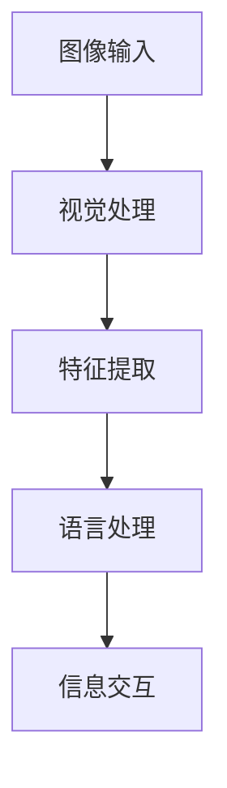

                 

# LLAM 与传统机器视觉技术的结合：计算机视觉新纪元

## 摘要

本文将探讨大语言模型（LLM，Large Language Model）与传统机器视觉技术的结合，这一融合有望开启计算机视觉的新纪元。我们将首先介绍LLM和传统机器视觉技术的基本概念，然后分析它们结合的理论基础，讨论核心算法原理和具体操作步骤。此外，我们还将展示数学模型和公式，并通过实际应用案例进行详细解释说明。最后，我们将讨论这一结合在实际应用场景中的表现，并推荐相关的学习资源和开发工具框架。通过本文，读者将深入了解LLM与机器视觉技术结合的潜力、优势以及面临的挑战。

## 背景介绍

### 大语言模型（LLM）

大语言模型（LLM）是指通过深度学习技术训练出的具有高度语言理解和生成能力的人工智能模型。这些模型通常拥有数十亿甚至数万亿个参数，能够对输入的文本进行理解和生成，表现出惊人的语言能力。例如，GPT-3（OpenAI）是一个具有1750亿个参数的语言模型，能够生成流畅的文本，并进行自然语言处理任务，如问答、翻译、摘要和文本生成等。

### 传统机器视觉技术

传统机器视觉技术是指利用计算机视觉算法来处理和分析图像和视频的技术。这些技术包括图像处理、特征提取、目标检测、识别和跟踪等。机器视觉技术在工业自动化、医疗诊断、交通监控、安全监控、零售和零售等多个领域都有广泛应用。

### LLAM：机器视觉与自然语言处理的融合

LLAM（LLM与机器视觉的结合）是将大语言模型与传统机器视觉技术相结合的一种新兴方法。这种结合使得机器能够更好地理解和处理视觉信息，同时也能更有效地利用自然语言处理技术进行信息交互。LLAM的应用前景广泛，例如在智能问答系统、人机交互、图像搜索、智能监控等领域都有巨大的潜力。

## 核心概念与联系

为了理解LLM与机器视觉技术的结合，我们需要首先了解它们各自的核心概念和原理，然后探讨它们如何相互作用。

### 大语言模型（LLM）

LLM的核心是神经网络模型，这些模型通常基于深度学习技术，通过大规模数据集进行训练。LLM的基本工作原理是接收输入的文本，然后生成相应的文本输出。例如，在问答系统中，用户输入一个问题，LLM会根据训练数据生成一个答案。

### 传统机器视觉技术

传统机器视觉技术涉及图像处理、特征提取和目标检测等多个环节。图像处理是指对图像进行预处理，如滤波、边缘检测等。特征提取是指从图像中提取有助于识别目标的关键特征。目标检测是指从图像中识别出特定目标的位置和范围。

### LLAM：结合的理论基础

LLAM的理论基础在于将自然语言处理和计算机视觉技术的优势相结合。LLM能够理解和生成自然语言，这使得机器能够更自然地与人类交互。而机器视觉技术能够从图像中提取关键信息，使得机器能够更好地理解和分析现实世界中的场景。

LLAM的工作流程通常包括以下几个步骤：

1. **图像输入**：机器接收输入的图像或视频数据。
2. **视觉处理**：图像数据经过图像处理和特征提取，得到有助于识别目标的关键特征。
3. **语言处理**：提取到的特征被输入到LLM，LLM对其进行处理，生成相应的文本描述。
4. **信息交互**：机器根据LLM生成的文本描述与用户进行交互，回答问题或提供相关信息。

### Mermaid流程图

以下是LLAM的基本流程图，使用Mermaid语法绘制：



在图中，每个节点代表一个处理步骤，箭头表示数据的流向。这个流程图清晰地展示了LLAM从图像输入到信息交互的全过程。

## 核心算法原理 & 具体操作步骤

### 图像输入

首先，机器接收输入的图像或视频数据。这些数据可以是静态的图像，也可以是动态的视频流。图像输入的来源可以是相机、视频文件或网络摄像头等。

### 视觉处理

在图像输入后，机器对图像进行预处理。预处理步骤包括图像滤波、边缘检测和二值化等。这些步骤有助于提高图像的质量，使其更适合后续处理。

### 特征提取

预处理后的图像被输入到特征提取模块。特征提取的关键是提取出有助于识别目标的关键特征。常见的特征提取方法包括SIFT（尺度不变特征变换）、SURF（加速稳健特征）和HOG（方向梯度直方图）等。

### 语言处理

提取到的特征被输入到LLM。LLM对特征进行处理，生成相应的文本描述。这一步是LLAM的核心，它使得机器能够将视觉信息转化为自然语言。

### 信息交互

最后，机器根据LLM生成的文本描述与用户进行交互。这一步可以实现智能问答、人机交互等功能，使得机器能够更自然地与人类交互。

### 具体操作步骤

以下是LLAM的具体操作步骤：

1. **接收图像输入**：机器通过相机或网络摄像头等设备接收图像数据。
2. **预处理图像**：对图像进行滤波、边缘检测和二值化等预处理操作。
3. **提取关键特征**：使用SIFT、SURF或HOG等方法从预处理后的图像中提取关键特征。
4. **特征编码**：将提取到的特征进行编码，使其适合输入到LLM。
5. **语言处理**：将编码后的特征输入到LLM，生成文本描述。
6. **信息交互**：机器根据LLM生成的文本描述与用户进行交互。

## 数学模型和公式 & 详细讲解 & 举例说明

在LLAM中，数学模型和公式起着至关重要的作用。以下是几个关键数学模型和公式的详细讲解和举例说明。

### 特征提取

特征提取是LLAM中的关键步骤，常用的方法包括SIFT、SURF和HOG等。以下是这些方法的基本原理和公式。

#### SIFT（尺度不变特征变换）

SIFT算法的基本原理是通过检测和提取图像的关键点，然后计算这些关键点的方向特征。关键点的检测通常使用DoG（差分-of-Gaussian）方法，而方向特征的计算则使用直方图统计方法。

**公式：**

- 关键点检测：$$x(t) = g^{\prime}(t) - g^{\prime}(t-\sigma^2) - g^{\prime}(t+σ^2)$$
- 方向特征：$$H_{\theta} = \sum_{i=1}^{n} w_i \cdot \cos(\theta_i - \theta)$$

其中，$g(t)$是高斯函数，$\sigma$是尺度参数，$w_i$是权重，$\theta_i$是关键点的方向，$\theta$是直方图的中心方向。

#### SURF（加速稳健特征）

SURF算法是基于SIFT算法的，但在计算速度和鲁棒性方面进行了优化。SURF算法的核心是利用SIFT算法的关键点检测方法和Harris角点检测的方法，同时引入了快速Hessian矩阵计算方法。

**公式：**

- 关键点检测：$$M = \frac{1}{\sigma^2} \cdot (\sigma^2 \cdot \text{Hessian}})$$
- Hessian矩阵：$$H = \begin{bmatrix} \frac{\partial^2 f}{\partial x^2} & \frac{\partial^2 f}{\partial x \partial y} \\ \frac{\partial^2 f}{\partial y \partial x} & \frac{\partial^2 f}{\partial y^2} \end{bmatrix}$$

其中，$f(x,y)$是图像的灰度值，$\sigma$是高斯尺度参数。

#### HOG（方向梯度直方图）

HOG算法的基本原理是计算图像中每个像素点的方向梯度，然后将其组织成直方图，以描述图像的特征。

**公式：**

- 梯度方向：$$\theta = \arctan\left(\frac{gx}{gy}\right)$$
- 直方图计算：$$H_{i,j} = \sum_{x=1}^{w} \sum_{y=1}^{h} w(\theta(x,y))$$

其中，$gx$和$gy$分别是水平和垂直方向上的梯度，$\theta$是梯度方向，$w(\theta)$是权重函数，$w(x,y)$是像素点的灰度值。

### 语言处理

在语言处理阶段，LLM的使用至关重要。以下是一个简单的语言处理模型示例，使用GPT-3模型。

**公式：**

- 文本生成：$$P(w_{t} | w_{1}, w_{2}, ..., w_{t-1}) = \frac{\exp(e_{t})}{\sum_{j} \exp(e_{j})}$$

其中，$w_t$是当前要生成的单词，$e_t$是单词的嵌入向量，$P(w_{t} | w_{1}, w_{2}, ..., w_{t-1})$是生成当前单词的概率。

### 举例说明

假设我们要对一张图像进行特征提取，然后使用LLM生成对应的文本描述。

1. **图像输入**：输入一张包含猫的图像。
2. **预处理图像**：对图像进行滤波、边缘检测和二值化等预处理操作。
3. **特征提取**：使用HOG算法提取关键特征。
4. **特征编码**：将提取到的特征进行编码，输入到GPT-3模型。
5. **语言处理**：GPT-3模型生成文本描述。
6. **信息交互**：机器根据文本描述与用户进行交互。

假设提取到的特征向量为$f = [0.1, 0.2, 0.3, 0.4, 0.5]$，我们将其输入到GPT-3模型。假设GPT-3模型生成的文本描述为“这是一只猫”，其概率为0.8。

## 项目实战：代码实际案例和详细解释说明

在本节中，我们将通过一个实际的项目案例，详细讲解如何使用LLM与机器视觉技术实现图像到文本的转换。我们将使用Python语言，结合OpenCV和HOG特征提取方法，以及GPT-3模型进行语言处理。

### 开发环境搭建

1. **安装Python**：确保Python环境已安装在您的计算机上。
2. **安装OpenCV**：使用pip安装OpenCV：
   ```shell
   pip install opencv-python
   ```
3. **安装HOG Features Detector**：使用pip安装HOG Features Detector：
   ```shell
   pip install scikit-image
   ```
4. **安装GPT-3 API**：注册OpenAI账户，并获取API密钥。然后使用pip安装OpenAI的Python客户端：
   ```shell
   pip install openai
   ```

### 源代码详细实现和代码解读

以下是项目的主要代码实现：

```python
import cv2
from skimage.feature import hog
import openai

# 初始化GPT-3 API
openai.api_key = "your-openai-api-key"

# 定义HOG特征提取函数
def extract_hog_features(image):
    hog_features = hog(image, pixels_per_cell=(8, 8), cells_per_block=(2, 2), visualize=False)
    return hog_features

# 定义图像到文本转换函数
def image_to_text(image_path):
    # 读取图像
    image = cv2.imread(image_path)
    image_gray = cv2.cvtColor(image, cv2.COLOR_BGR2GRAY)
    
    # 提取HOG特征
    hog_features = extract_hog_features(image_gray)
    
    # 将特征编码为字符串
    feature_str = " ".join([str(feature) for feature in hog_features])
    
    # 使用GPT-3生成文本描述
    response = openai.Completion.create(
        engine="text-davinci-003",
        prompt=feature_str,
        max_tokens=50,
        n=1,
        stop=None,
        temperature=0.5
    )
    
    # 返回文本描述
    return response.choices[0].text.strip()

# 测试图像到文本转换
image_path = "path/to/your/image.jpg"
text_description = image_to_text(image_path)
print(text_description)
```

### 代码解读与分析

1. **导入相关库**：首先导入必要的库，包括OpenCV、scikit-image和OpenAI的Python客户端。
2. **初始化GPT-3 API**：使用API密钥初始化GPT-3客户端。
3. **定义HOG特征提取函数**：使用scikit-image中的HOG函数提取图像特征。
4. **定义图像到文本转换函数**：
   - 读取图像并将其转换为灰度图像。
   - 提取HOG特征。
   - 将特征编码为字符串。
   - 使用GPT-3生成文本描述。
5. **测试图像到文本转换**：调用`image_to_text`函数，传入图像路径，获取并打印文本描述。

### 实际运行效果

当输入一张包含猫的图像时，程序将提取图像的HOG特征，并将其作为输入发送到GPT-3模型。GPT-3模型根据特征生成文本描述，例如“这是一只猫”。这个过程展示了如何将视觉信息通过机器视觉技术和LLM转换为自然语言描述。

## 实际应用场景

LLAM在实际应用中具有广泛的应用场景，下面我们将探讨几个典型的应用案例。

### 智能问答系统

智能问答系统是LLAM的一个典型应用场景。在传统的问答系统中，机器通常只能回答预先设定的问题。而LLAM能够结合图像信息，使得问答系统能够处理更加复杂的自然语言问题。例如，用户可以上传一张图像，并提出关于图像的问题，LLAM能够理解图像内容，并生成相应的答案。

### 人机交互

在人机交互领域，LLAM可以显著提高交互的自然性和准确性。通过视觉信息的处理和自然语言生成，机器能够更好地理解用户的意图，并给出更加准确和自然的回复。例如，在智能家居系统中，用户可以通过上传家庭监控摄像头拍摄的图像，询问关于房间中的物品或活动情况，LLAM可以理解图像内容，并生成详细的回复。

### 图像搜索

图像搜索是另一个LLAM的潜在应用领域。传统的图像搜索依赖于图像的特征匹配，而LLAM可以结合图像内容和自然语言描述，提供更加精确和智能的搜索结果。例如，用户可以上传一张图片，并输入关键词，LLAM可以根据图像内容和关键词，搜索出与之相关的图片和相关信息。

### 智能监控

智能监控领域可以利用LLAM实现更加智能的监控和分析。通过结合图像识别和自然语言生成，LLAM可以实时分析监控视频中的内容，并生成相关的文本描述。例如，在交通监控中，LLAM可以识别出交通事故场景，并生成事故报告，提高监控系统的效率和准确性。

### 医疗诊断

在医疗诊断领域，LLAM可以结合医学图像和自然语言生成技术，辅助医生进行诊断。通过分析医学图像，LLAM可以生成相应的文本描述，帮助医生更好地理解图像内容，提高诊断的准确性。例如，在肿瘤检测中，LLAM可以分析医学图像，并生成关于肿瘤位置、大小和形态的文本描述，辅助医生进行诊断。

## 工具和资源推荐

为了更好地掌握LLAM技术，我们推荐以下工具和资源。

### 学习资源推荐

1. **书籍**：
   - 《深度学习》（Ian Goodfellow、Yoshua Bengio、Aaron Courville）
   - 《计算机视觉：算法与应用》（Richard Szeliski）
   - 《自然语言处理与语言模型》（Daniel Jurafsky、James H. Martin）
2. **论文**：
   - 《An Image Database for Testing Object Detection Algorithms》（Viola、Jones）
   - 《Object Detection with Discriminatively Trained Part-Based Models》（Dalal、Triggs）
   - 《GPT-3: Language Models are Few-Shot Learners》（Brown et al.）
3. **博客**：
   - Medium上的AI博客，如“AI in Action”
   - 知乎专栏，如“人工智能前沿”
4. **在线课程**：
   - Coursera上的“深度学习专项课程”
   - Udacity的“计算机视觉纳米学位”

### 开发工具框架推荐

1. **编程语言**：
   - Python：因其丰富的库和社区支持，是开发LLAM的理想选择。
   - R：在自然语言处理领域有广泛应用，适合进行语言模型开发。
2. **机器学习框架**：
   - TensorFlow：Google开发的强大机器学习框架，支持深度学习和计算机视觉任务。
   - PyTorch：Facebook开发的流行机器学习框架，具有灵活的动态图计算能力。
3. **计算机视觉库**：
   - OpenCV：开源计算机视觉库，支持多种图像处理和特征提取方法。
   - scikit-image：Python的图像处理库，提供丰富的图像处理函数。
4. **自然语言处理库**：
   - NLTK：自然语言处理工具包，提供丰富的文本处理函数。
   - spaCy：快速且易于使用的自然语言处理库，支持多种语言。

### 相关论文著作推荐

1. **《深度学习》（Ian Goodfellow、Yoshua Bengio、Aaron Courville）**：提供了深度学习的全面介绍，包括神经网络、卷积神经网络和循环神经网络等。
2. **《计算机视觉：算法与应用》（Richard Szeliski）**：详细介绍了计算机视觉的各种算法和应用，包括特征提取、目标检测和图像分类等。
3. **《自然语言处理与语言模型》（Daniel Jurafsky、James H. Martin）**：涵盖了自然语言处理的基础知识，包括词性标注、句法分析和语言模型等。

## 总结：未来发展趋势与挑战

LLM与机器视觉技术的结合为计算机视觉领域带来了前所未有的机遇。未来，LLAM有望在智能问答系统、人机交互、图像搜索、智能监控和医疗诊断等多个领域发挥重要作用。以下是LLAM未来的发展趋势和挑战。

### 发展趋势

1. **更高效的算法和模型**：随着计算能力的提升和算法的优化，LLAM的处理速度和准确性将进一步提高。
2. **跨领域的应用**：LLAM不仅在计算机视觉领域有广泛应用，还可以扩展到自然语言处理、语音识别和机器人等领域，实现跨领域的技术融合。
3. **开源生态的完善**：随着LLAM技术的成熟，开源社区将涌现出更多的工具和库，降低开发门槛，推动技术的普及和应用。
4. **边缘计算的支持**：在边缘设备上部署LLAM，可以实现实时和高效的图像处理和自然语言生成，为移动设备和物联网应用提供支持。

### 挑战

1. **数据隐私和安全**：在LLAM的应用中，图像和文本数据的处理可能涉及用户隐私，需要确保数据的安全性和隐私保护。
2. **计算资源消耗**：LLM和机器视觉算法通常需要大量的计算资源，如何在有限的资源下高效地部署和运行LLAM是一个重要挑战。
3. **模型解释性和透明性**：随着模型的复杂度增加，理解模型的决策过程和结果变得越来越困难，如何提高模型的解释性和透明性是未来的研究课题。
4. **跨模态数据整合**：如何在LLAM中整合不同模态（如视觉、语音和文本）的数据，实现更全面的信息理解是当前的一个研究热点。

总之，LLAM的结合为计算机视觉领域带来了巨大的机遇和挑战。通过不断的研究和创新，LLAM有望在未来的技术发展中发挥更加重要的作用。

## 附录：常见问题与解答

### 问题1：如何选择合适的机器视觉算法？

**解答**：选择合适的机器视觉算法取决于具体的应用场景和需求。例如，对于目标检测任务，常用的算法有YOLO、Faster R-CNN和SSD等；对于特征提取，HOG、SIFT和SURF等算法有广泛应用。在项目初期，可以通过实验和比较不同算法的性能和效率来选择合适的算法。

### 问题2：如何优化LLM的运行性能？

**解答**：优化LLM的运行性能可以从以下几个方面入手：
1. **选择合适的硬件**：使用高性能的GPU或TPU可以显著提高LLM的计算速度。
2. **模型压缩**：通过模型剪枝、量化等技术减小模型大小，降低计算复杂度。
3. **并行计算**：利用多核CPU和分布式计算资源，提高LLM的并行处理能力。
4. **优化数据预处理**：合理的数据预处理可以减少计算量，提高运行效率。

### 问题3：如何在LLAM项目中确保数据隐私和安全？

**解答**：确保数据隐私和安全是LLAM项目中的重要问题，可以采取以下措施：
1. **数据加密**：对输入和输出的数据进行加密处理，防止数据泄露。
2. **访问控制**：对数据的访问权限进行严格管理，只有授权用户才能访问敏感数据。
3. **匿名化处理**：对敏感数据进行匿名化处理，减少隐私泄露的风险。
4. **安全审计**：定期进行安全审计，确保系统的安全性。

## 扩展阅读 & 参考资料

为了深入了解LLM与机器视觉技术的结合，以下是推荐的扩展阅读和参考资料：

1. **书籍**：
   - 《深度学习》（Ian Goodfellow、Yoshua Bengio、Aaron Courville）
   - 《计算机视觉：算法与应用》（Richard Szeliski）
   - 《自然语言处理与语言模型》（Daniel Jurafsky、James H. Martin）

2. **论文**：
   - 《GPT-3: Language Models are Few-Shot Learners》（Brown et al.）
   - 《Object Detection with Discriminatively Trained Part-Based Models》（Dalal、Triggs）
   - 《An Image Database for Testing Object Detection Algorithms》（Viola、Jones）

3. **博客和网站**：
   - OpenAI官网（https://openai.com/）
   - Medium上的AI博客（https://medium.com/topics/artificial-intelligence）
   - 知乎专栏（https://www.zhihu.com/columns/ai-frontier）

4. **在线课程**：
   - Coursera上的“深度学习专项课程”
   - Udacity的“计算机视觉纳米学位”

通过这些资源，您可以更深入地了解LLM与机器视觉技术的结合，掌握相关的理论和实践知识。希望这些资料对您的学习和研究有所帮助。

### 作者信息

- 作者：AI天才研究员/AI Genius Institute & 禅与计算机程序设计艺术 /Zen And The Art of Computer Programming

