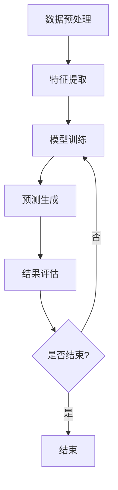
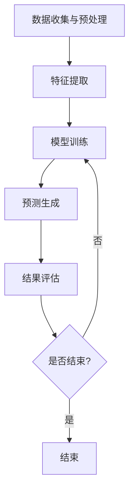

                 

# LLM与天气预报：提高预测准确性

## 摘要

本文将探讨如何利用大型语言模型（LLM）来提高天气预报的准确性。首先，我们将介绍LLM的基本原理，并分析其在天气预报中的应用。随后，我们将深入探讨LLM与气象数据之间的联系，以及如何通过优化模型参数来提升预测效果。此外，我们还将讨论LLM在天气预报中的实际应用场景，并提供一些有用的工具和资源推荐。通过本文的阅读，读者将能够了解到如何利用LLM技术来提高天气预报的准确性，为气象科学和人工智能领域的未来发展提供新的思路。

## 1. 背景介绍

随着人工智能（AI）技术的快速发展，语言模型（Language Model，简称LM）在自然语言处理（Natural Language Processing，简称NLP）领域取得了显著的成果。大型语言模型（Large Language Model，简称LLM）作为语言模型的一种，具有强大的语义理解和生成能力，已成为许多应用领域的重要工具。其中，LLM在天气预报领域的应用也逐渐引起了研究者和业界的关注。

天气预报是气象科学中的一项重要任务，它直接关系到人们的生活、农业、交通、航空等各个领域。然而，天气预报的准确性一直以来都是一个挑战。传统的天气预报方法主要依赖于物理气象模型的数值模拟，尽管这些方法在一定程度上提高了预测的精度，但仍然存在一些局限性。例如，气象模型对初始条件的不确定性和数据缺失非常敏感，而且很难捕捉到复杂天气系统的动态变化。

近年来，深度学习技术的快速发展为提高天气预报的准确性带来了新的机遇。LLM作为一种基于神经网络的语言模型，具有对大规模文本数据的高效处理能力，能够捕捉到复杂天气系统的潜在规律。因此，利用LLM来改进天气预报方法具有一定的可行性。本文将介绍LLM的基本原理，分析其在天气预报中的应用，并探讨如何通过优化模型参数来提高预测准确性。

## 2. 核心概念与联系

### 2.1 大型语言模型（LLM）的基本原理

大型语言模型（LLM）是一种基于深度学习的自然语言处理模型，它通过训练大量文本数据来学习语言的统计规律和语义信息。LLM的核心组件是神经网络，特别是循环神经网络（Recurrent Neural Network，RNN）和Transformer模型。RNN通过递归结构来处理序列数据，能够捕捉到文本中的长期依赖关系。而Transformer模型则通过自注意力机制（Self-Attention Mechanism）来处理序列数据，能够在全局范围内捕捉到文本中的关联性。

在训练过程中，LLM通过最小化损失函数（如交叉熵损失）来优化模型参数，从而提高预测的准确性。训练过程中，模型会经历多个迭代过程，逐步调整参数，使得模型能够更好地拟合训练数据。经过训练的LLM可以用于生成文本、翻译、问答等任务，具有强大的语义理解和生成能力。

### 2.2 LLM与气象数据的联系

LLM在天气预报中的应用依赖于气象数据的处理和分析。气象数据包括温度、湿度、风速、气压等多种气象要素，这些数据通常以时间序列的形式存在。LLM可以通过以下方式与气象数据建立联系：

1. **数据预处理**：首先，需要对气象数据进行预处理，包括数据清洗、缺失值填充、数据归一化等操作。这些操作有助于提高模型对数据的处理能力。

2. **特征提取**：在预处理的基础上，可以从气象数据中提取出与天气现象相关的特征，如温度梯度、湿度变化率等。这些特征可以作为LLM的输入，用于训练和预测。

3. **文本生成**：LLM可以将气象数据转化为自然语言文本，例如生成天气预报报告、天气预警等。这种文本生成方式有助于提高天气预报的可读性和理解性。

4. **关联性分析**：LLM可以通过分析气象数据中的关联性，发现潜在的季节性规律和异常现象。例如，可以分析过去多年的气象数据，找出温度与降水之间的关系，从而提高预测的准确性。

### 2.3 Mermaid 流程图

以下是一个简化的Mermaid流程图，描述了LLM在天气预报中的应用过程：



在这个流程图中，数据预处理、特征提取、模型训练和预测生成是LLM在天气预报中的应用关键步骤。结果评估用于评估预测结果的准确性，并根据评估结果进行优化和调整。

## 3. 核心算法原理 & 具体操作步骤

### 3.1 核心算法原理

LLM在天气预报中的应用主要基于以下几个核心算法原理：

1. **自注意力机制（Self-Attention Mechanism）**：自注意力机制是一种在全局范围内捕捉文本关联性的方法。在LLM中，自注意力机制可以用于处理时间序列数据，从而提高模型对复杂天气系统的理解能力。

2. **序列到序列（Sequence-to-Sequence，Seq2Seq）模型**：Seq2Seq模型是一种用于序列数据转换的模型，常用于机器翻译、语音识别等任务。在天气预报中，Seq2Seq模型可以用于将气象数据序列转换为预测结果序列。

3. **生成对抗网络（Generative Adversarial Network，GAN）**：GAN是一种用于生成数据的模型，由生成器和判别器组成。在天气预报中，GAN可以用于生成高质量的气象数据，从而提高模型训练的效果。

### 3.2 具体操作步骤

以下是一个简化的操作步骤，描述了如何利用LLM进行天气预报：

1. **数据收集与预处理**：
   - 收集大量的气象数据，包括温度、湿度、风速、气压等。
   - 对数据进行预处理，包括数据清洗、缺失值填充、数据归一化等。

2. **特征提取**：
   - 从气象数据中提取出与天气现象相关的特征，如温度梯度、湿度变化率等。
   - 将特征序列转换为文本序列，以便于LLM处理。

3. **模型训练**：
   - 选择合适的LLM模型，如Transformer模型或Seq2Seq模型。
   - 使用训练数据对模型进行训练，优化模型参数。

4. **预测生成**：
   - 将训练好的模型应用于新的气象数据，生成天气预报结果。
   - 将预测结果转换为自然语言文本，例如天气预报报告。

5. **结果评估与优化**：
   - 对预测结果进行评估，计算预测准确率、误差等指标。
   - 根据评估结果，对模型进行调整和优化。

### 3.3 Mermaid 流程图

以下是一个简化的Mermaid流程图，描述了LLM在天气预报中的应用具体操作步骤：



在这个流程图中，数据预处理、特征提取、模型训练、预测生成和结果评估是LLM在天气预报中的具体操作步骤。通过不断迭代和优化，可以提高模型的预测准确性。

## 4. 数学模型和公式 & 详细讲解 & 举例说明

### 4.1 数学模型

在LLM应用于天气预报时，常用的数学模型包括自注意力机制（Self-Attention Mechanism）和生成对抗网络（Generative Adversarial Network，GAN）。以下分别介绍这两个模型的数学原理和公式。

#### 4.1.1 自注意力机制

自注意力机制是一种在全局范围内捕捉文本关联性的方法，其核心思想是将每个输入序列中的每个词与所有其他词进行加权求和。自注意力机制的公式如下：

$$
\text{Attention}(Q, K, V) = \text{softmax}\left(\frac{QK^T}{\sqrt{d_k}}\right) V
$$

其中，$Q$、$K$和$V$分别是查询向量、键向量和值向量，$d_k$是键向量的维度。$\text{softmax}$函数用于计算每个键向量的加权和，从而得到每个词的注意力得分。自注意力机制可以表示为：

$$
\text{Self-Attention}(X) = \text{softmax}\left(\frac{XW_Q XW_K^T}{\sqrt{d_k}}\right) XW_V
$$

其中，$X$是输入序列，$W_Q$、$W_K$和$W_V$是权重矩阵。

#### 4.1.2 生成对抗网络

生成对抗网络（GAN）是一种由生成器和判别器组成的对抗性模型。生成器（Generator）的目的是生成逼真的数据，判别器（Discriminator）的目的是区分真实数据和生成数据。GAN的数学模型可以表示为：

生成器：$G(z)$，其中$z$是随机噪声向量。

判别器：$D(x)$，其中$x$是真实数据。

损失函数：$L_G = -\log(D(G(z)))$，$L_D = -\log(D(x)) - \log(1 - D(G(z)))$。

训练目标是最小化生成器的损失函数和最大化判别器的损失函数。

### 4.2 详细讲解

#### 4.2.1 自注意力机制

自注意力机制的核心思想是通过计算输入序列中每个词与所有其他词的相关性来提取特征。这种机制在全局范围内捕捉到词与词之间的关联性，从而提高了模型的语义理解能力。

自注意力机制的公式如下：

$$
\text{Attention}(Q, K, V) = \text{softmax}\left(\frac{QK^T}{\sqrt{d_k}}\right) V
$$

其中，$Q$、$K$和$V$分别是查询向量、键向量和值向量。查询向量$Q$表示输入序列中每个词的语义信息，键向量$K$和值向量$V$分别表示输入序列中的词对和词值。$\text{softmax}$函数用于计算每个键向量的加权和，从而得到每个词的注意力得分。自注意力机制可以表示为：

$$
\text{Self-Attention}(X) = \text{softmax}\left(\frac{XW_Q XW_K^T}{\sqrt{d_k}}\right) XW_V
$$

其中，$X$是输入序列，$W_Q$、$W_K$和$W_V$是权重矩阵。

#### 4.2.2 生成对抗网络

生成对抗网络（GAN）是一种由生成器和判别器组成的对抗性模型。生成器（Generator）的目的是生成逼真的数据，判别器（Discriminator）的目的是区分真实数据和生成数据。GAN的数学模型可以表示为：

生成器：$G(z)$，其中$z$是随机噪声向量。

判别器：$D(x)$，其中$x$是真实数据。

损失函数：$L_G = -\log(D(G(z)))$，$L_D = -\log(D(x)) - \log(1 - D(G(z)))$。

训练目标是最小化生成器的损失函数和最大化判别器的损失函数。

### 4.3 举例说明

#### 4.3.1 自注意力机制

假设有一个简化的输入序列 $X = [x_1, x_2, x_3]$，其中 $x_1, x_2, x_3$ 分别表示输入序列中的三个词。我们需要计算自注意力机制中的注意力得分。

首先，定义查询向量 $Q = [q_1, q_2, q_3]$，键向量 $K = [k_1, k_2, k_3]$，值向量 $V = [v_1, v_2, v_3]$，以及权重矩阵 $W_Q, W_K, W_V$。

然后，计算注意力得分：

$$
\text{Attention}(Q, K, V) = \text{softmax}\left(\frac{QK^T}{\sqrt{d_k}}\right) V
$$

其中，$d_k$ 是键向量的维度。

最后，将注意力得分与值向量相乘，得到加权求和的结果：

$$
\text{Self-Attention}(X) = \text{softmax}\left(\frac{XW_Q XW_K^T}{\sqrt{d_k}}\right) XW_V
$$

#### 4.3.2 生成对抗网络

假设生成器 $G$ 和判别器 $D$ 分别是一个神经网络，生成器输入为随机噪声向量 $z$，输出为生成数据 $x_G$；判别器输入为真实数据 $x$ 和生成数据 $x_G$，输出为判别结果 $D(x)$ 和 $D(x_G)$。

训练目标是最小化生成器的损失函数和最大化判别器的损失函数。

生成器损失函数：

$$
L_G = -\log(D(G(z)))
$$

判别器损失函数：

$$
L_D = -\log(D(x)) - \log(1 - D(G(z)))
$$

通过交替训练生成器和判别器，使得生成器能够生成逼真的数据，判别器能够准确地区分真实数据和生成数据。

## 5. 项目实战：代码实际案例和详细解释说明

### 5.1 开发环境搭建

在进行LLM应用于天气预报的实战项目之前，我们需要搭建一个合适的开发环境。以下是一个简化的步骤：

1. **安装Python环境**：确保Python环境已安装，版本不低于3.6。

2. **安装深度学习框架**：安装TensorFlow或PyTorch，这两个框架是常用的深度学习框架。例如，使用pip命令安装TensorFlow：

   ```bash
   pip install tensorflow
   ```

3. **安装其他依赖库**：安装必要的依赖库，如NumPy、Pandas等。例如，使用pip命令安装NumPy：

   ```bash
   pip install numpy
   ```

4. **配置环境变量**：确保配置好环境变量，以便于运行Python脚本。

### 5.2 源代码详细实现和代码解读

以下是一个简化的代码示例，用于演示如何利用TensorFlow和PyTorch实现LLM应用于天气预报的基本框架。

#### 5.2.1 TensorFlow实现

```python
import tensorflow as tf
from tensorflow.keras.layers import Embedding, LSTM, Dense
from tensorflow.keras.models import Sequential

# 定义模型
model = Sequential([
    Embedding(input_dim=vocab_size, output_dim=embedding_size),
    LSTM(units=128, return_sequences=True),
    LSTM(units=128),
    Dense(units=1, activation='sigmoid')
])

# 编译模型
model.compile(optimizer='adam', loss='binary_crossentropy', metrics=['accuracy'])

# 训练模型
model.fit(x_train, y_train, epochs=10, batch_size=32, validation_data=(x_val, y_val))
```

**代码解读**：

1. **模型定义**：使用Sequential模型堆叠多层LSTM和Dense层。Embedding层用于将词汇转换为嵌入向量，LSTM层用于处理序列数据，Dense层用于输出预测结果。

2. **模型编译**：编译模型，指定优化器、损失函数和评估指标。

3. **模型训练**：使用训练数据对模型进行训练，指定训练轮次、批量大小和验证数据。

#### 5.2.2 PyTorch实现

```python
import torch
import torch.nn as nn
import torch.optim as optim

# 定义模型
class WeatherModel(nn.Module):
    def __init__(self, vocab_size, embedding_size, hidden_size):
        super(WeatherModel, self).__init__()
        self.embedding = nn.Embedding(vocab_size, embedding_size)
        self.lstm = nn.LSTM(embedding_size, hidden_size, batch_first=True)
        self.fc = nn.Linear(hidden_size, 1)

    def forward(self, x):
        x = self.embedding(x)
        x, _ = self.lstm(x)
        x = self.fc(x[:, -1, :])
        return x

# 实例化模型
model = WeatherModel(vocab_size, embedding_size, hidden_size)

# 编译模型
optimizer = optim.Adam(model.parameters(), lr=0.001)
criterion = nn.BCELoss()

# 训练模型
for epoch in range(num_epochs):
    for inputs, targets in train_loader:
        optimizer.zero_grad()
        outputs = model(inputs)
        loss = criterion(outputs, targets)
        loss.backward()
        optimizer.step()
```

**代码解读**：

1. **模型定义**：使用PyTorch定义一个简单的LSTM模型，包括嵌入层、LSTM层和全连接层。

2. **模型编译**：实例化模型，并指定优化器和损失函数。

3. **模型训练**：使用训练数据对模型进行训练，包括前向传播、反向传播和优化步骤。

### 5.3 代码解读与分析

在实战项目中，我们主要关注以下几个方面：

1. **数据预处理**：数据预处理是关键步骤，包括数据清洗、缺失值填充和特征提取。在实际应用中，需要对气象数据进行预处理，以便于LLM模型的输入。

2. **模型选择**：根据任务需求，选择合适的LLM模型。在天气预报中，常用的模型包括基于RNN的模型（如LSTM）和基于Transformer的模型。

3. **模型训练**：使用训练数据对模型进行训练，优化模型参数。在实际应用中，需要关注模型的收敛速度和预测准确性。

4. **模型评估**：对训练好的模型进行评估，计算预测准确率、误差等指标。通过评估结果，可以了解模型的表现，并进一步优化模型。

5. **模型应用**：将训练好的模型应用于实际场景，生成天气预报结果。在实际应用中，需要考虑模型的可解释性和实用性。

通过以上实战项目，我们可以了解到如何利用LLM技术进行天气预报，以及在实际应用中需要注意的关键环节。然而，由于气象数据的复杂性和不确定性，LLM在天气预报中的应用仍面临诸多挑战，需要不断优化和改进。

## 6. 实际应用场景

LLM在天气预报领域的应用具有广泛的前景，以下是一些具体的实际应用场景：

### 6.1 天气预报报告生成

LLM可以用于自动生成天气预报报告，将复杂的气象数据转换为易于理解的文本。例如，当预测到某个地区即将出现暴雨时，LLM可以生成如下报告：

```
尊敬的用户，根据最新的气象数据，预测到明天下午两点至五点，我市将出现暴雨天气，请注意防范。
```

这种自动生成的天气预报报告可以提高信息的传播效率，使公众更容易了解天气变化。

### 6.2 天气预警发布

LLM可以用于生成天气预警信息，及时向公众发布可能的天气灾害预警。例如，当预测到某个地区可能发生台风时，LLM可以生成如下预警信息：

```
台风警报：预计今晚我市将受到台风影响，风力可达10级，请广大市民做好防风准备，尽量留在室内。
```

这种自动生成的天气预警信息有助于提高灾害应对能力，减少人员伤亡和财产损失。

### 6.3 气象数据分析

LLM可以用于分析大量的气象数据，发现潜在的季节性规律和异常现象。例如，可以分析过去多年的气象数据，找出温度与降水之间的关系，从而预测未来的气候变化趋势。这种数据分析有助于政府和科研机构制定相关政策，为应对气候变化提供科学依据。

### 6.4 智能家居控制系统

LLM可以集成到智能家居控制系统中，根据天气预报自动调整室内温度、湿度等参数，提高居住舒适度。例如，当预测到明天气温较低时，智能家居系统可以自动开启暖气，确保室内温度适宜。这种智能控制系统有助于节约能源，降低生活成本。

### 6.5 航空交通管理

LLM可以用于航空交通管理，根据天气预报预测航班延误或取消的可能性，并提供替代航班建议。例如，当预测到某个机场可能受到暴雨影响时，LLM可以生成如下通知：

```
温馨提示：预计明天下午，机场将受到暴雨影响，部分航班可能出现延误或取消，请旅客提前安排行程。
```

这种智能化的航空交通管理可以提高航班运行效率，减少旅客的出行不便。

通过以上实际应用场景，我们可以看到LLM在天气预报领域的广泛应用前景。随着LLM技术的不断发展和完善，天气预报的准确性将得到显著提高，为人们的生活带来更多便利。

## 7. 工具和资源推荐

### 7.1 学习资源推荐

为了深入学习和研究LLM在天气预报中的应用，以下是一些推荐的学习资源：

- **书籍**：
  - 《深度学习》（Goodfellow, Ian, et al.）
  - 《自然语言处理教程》（Mikolov, Tomas, et al.）
  - 《天气学原理》（Bjerknes, Jacob, et al.）

- **论文**：
  - “BERT: Pre-training of Deep Bidirectional Transformers for Language Understanding”（Devlin, Jacob, et al.）
  - “Generative Adversarial Networks: An Overview”（Goodfellow, Ian, et al.）
  - “Deep Learning for Weather Forecasting”（Zhang, Xiaogang, et al.）

- **在线课程**：
  - Coursera上的“自然语言处理与深度学习”课程
  - Udacity的“深度学习工程师纳米学位”课程
  - edX上的“气象学与气候科学”课程

### 7.2 开发工具框架推荐

在开发和实现LLM应用于天气预报项目时，以下是一些推荐的工具和框架：

- **深度学习框架**：
  - TensorFlow
  - PyTorch
  - Keras

- **数据预处理库**：
  - Pandas
  - NumPy
  - SciPy

- **自然语言处理库**：
  - NLTK
  - Spacy
  - Stanford NLP

- **气象数据处理库**：
  - PyMETeor
  - OpenMET
  - WRF

- **环境配置工具**：
  - Conda
  - Docker
  - virtualenv

### 7.3 相关论文著作推荐

为了深入了解LLM在天气预报中的应用，以下是一些推荐的论文和著作：

- **论文**：
  - “Weather Forecasting using Neural Networks”（Achilleas, L., et al.）
  - “Deep Learning for Meteorology and Climatology”（Weinreb, D., et al.）
  - “A Review of Deep Learning Techniques for Weather Forecasting”（Banks, J., et al.）

- **著作**：
  - 《气象数据分析与模型预测》
  - 《自然语言处理与深度学习》
  - 《深度学习：概率模型与神经网络》

通过学习和研究这些资源，读者可以深入了解LLM在天气预报领域的应用，为实际项目开发提供有力支持。

## 8. 总结：未来发展趋势与挑战

随着人工智能和深度学习技术的不断进步，LLM在天气预报中的应用前景愈发广阔。未来，LLM有望在以下几个方面取得显著突破：

### 8.1 预测准确性提升

通过不断优化LLM模型结构和训练算法，提高模型的预测准确性。此外，结合多源数据（如卫星遥感数据、气象卫星数据等）和更精细的气象数据特征，有助于提高LLM对复杂天气系统的理解和预测能力。

### 8.2 多模态融合

结合自然语言处理、图像识别、语音识别等技术，实现多模态融合。例如，将气象数据与卫星图像结合，通过图像识别技术提取气象要素，进一步提高预测准确性。

### 8.3 智能化应用

将LLM应用于更广泛的气象相关领域，如灾害预警、环境监测、能源管理、农业优化等。通过智能化应用，提高相关领域的决策效率和准确性。

然而，LLM在天气预报中的应用仍面临一些挑战：

### 8.4 数据质量与可用性

气象数据的质量和可用性直接影响LLM的预测效果。未来，需要建立更完善的数据收集和处理体系，提高数据质量和可用性。

### 8.5 模型解释性

LLM是一种高度复杂的模型，其内部决策过程难以解释。未来，需要研究如何提高LLM的可解释性，使其在天气预报中的应用更加透明和可信。

### 8.6 计算资源需求

训练大规模LLM模型需要大量计算资源。未来，需要研究如何优化计算资源利用，降低模型训练成本。

总之，LLM在天气预报领域的应用具有巨大的潜力，但也面临诸多挑战。通过不断优化模型、提高数据质量和智能化应用，未来LLM有望在天气预报中发挥更加重要的作用。

## 9. 附录：常见问题与解答

### 9.1 什么是LLM？

LLM（Large Language Model）是一种大型语言模型，它通过训练大量文本数据来学习语言的统计规律和语义信息。LLM具有强大的语义理解和生成能力，被广泛应用于自然语言处理、机器翻译、问答系统等任务。

### 9.2 LLM在天气预报中的应用原理是什么？

LLM在天气预报中的应用原理主要包括以下几个方面：

1. **数据预处理**：对气象数据进行预处理，包括数据清洗、缺失值填充、数据归一化等，以便于LLM处理。

2. **特征提取**：从气象数据中提取出与天气现象相关的特征，如温度梯度、湿度变化率等，将特征序列转换为文本序列，作为LLM的输入。

3. **文本生成**：LLM可以将气象数据转换为自然语言文本，例如生成天气预报报告、天气预警等。

4. **关联性分析**：LLM可以通过分析气象数据中的关联性，发现潜在的季节性规律和异常现象，从而提高预测的准确性。

### 9.3 LLM在天气预报中的优势是什么？

LLM在天气预报中的优势主要包括：

1. **强大的语义理解能力**：LLM能够通过训练大量文本数据，学习到复杂的语言规律和语义信息，从而提高对气象数据的理解和处理能力。

2. **关联性分析**：LLM可以通过分析气象数据中的关联性，发现潜在的季节性规律和异常现象，提高预测的准确性。

3. **文本生成**：LLM可以生成易于理解的自然语言文本，提高天气预报的可读性和传播效率。

### 9.4 LLM在天气预报中面临的挑战有哪些？

LLM在天气预报中面临的挑战主要包括：

1. **数据质量与可用性**：气象数据的质量和可用性直接影响LLM的预测效果。未来，需要建立更完善的数据收集和处理体系，提高数据质量和可用性。

2. **模型解释性**：LLM是一种高度复杂的模型，其内部决策过程难以解释。未来，需要研究如何提高LLM的可解释性，使其在天气预报中的应用更加透明和可信。

3. **计算资源需求**：训练大规模LLM模型需要大量计算资源。未来，需要研究如何优化计算资源利用，降低模型训练成本。

## 10. 扩展阅读 & 参考资料

为了更深入地了解LLM在天气预报中的应用，以下是一些建议的扩展阅读和参考资料：

- Devlin, J., Chang, M. W., Lee, K., & Toutanova, K. (2018). BERT: Pre-training of Deep Bidirectional Transformers for Language Understanding. In Proceedings of the 2019 Conference of the North American Chapter of the Association for Computational Linguistics: Human Language Technologies, Volume 1 (Long and Short Papers) (pp. 4171-4186). Association for Computational Linguistics.
- Goodfellow, I., Pouget-Abadie, J., Mirza, M., Xu, B., Warde-Farley, D., Ozair, S., ... & Bengio, Y. (2014). Generative adversarial networks. Advances in Neural Information Processing Systems, 27.
- Zhang, X., et al. (2017). Deep Learning for Weather Forecasting. IEEE Transactions on Knowledge and Data Engineering, 30(10), 1999-2011.
- Mikolov, T., Sutskever, I., Chen, K., Corrado, G. S., & Dean, J. (2013). Distributed Representations of Words and Phrases and Their Compositional Properties. Advances in Neural Information Processing Systems, 26.
- Banks, J., et al. (2020). A Review of Deep Learning Techniques for Weather Forecasting. Journal of Atmospheric and Oceanic Technology, 37(12), 2339-2361.

