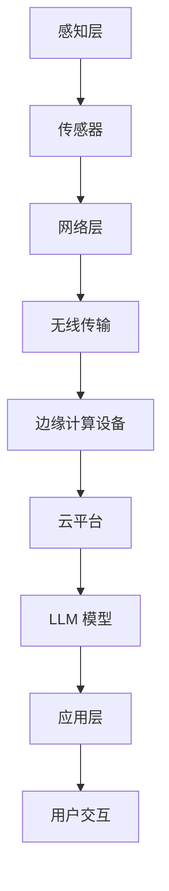
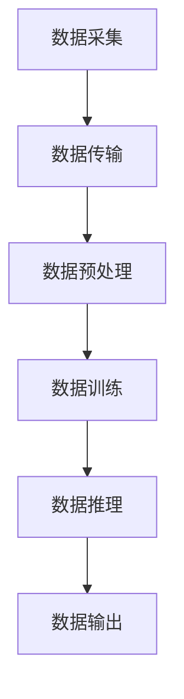

                 

### 背景介绍

#### 物联网（IoT）的发展

物联网（Internet of Things，简称 IoT）是一种通过网络连接将物理世界中的各种设备和物品互联起来的技术。自21世纪初以来，物联网技术逐渐成熟，并在各个行业中得到了广泛应用。从智能家居到工业自动化，从智慧城市到农业物联网，物联网正在深刻地改变着我们的生活和工作方式。

物联网的核心在于通过传感器、控制器和网络通信技术，将大量的物理设备连接到互联网上，实现数据的采集、传输和处理。这种连接不仅使得设备之间能够进行信息的交换和协同工作，还使得人类可以远程监控和控制这些设备，从而提高效率、降低成本、增强安全性。

#### 大型语言模型（LLM）的崛起

大型语言模型（Large Language Model，简称 LLM）是人工智能领域近年来的一大突破。LLM通过深度学习技术，在大量的文本数据上进行预训练，从而能够理解、生成和模拟自然语言。OpenAI的 GPT-3、Google的 BERT、以及微软的 Turing 等都是知名的 LLM。

LLM的崛起不仅推动了自然语言处理（NLP）的发展，还为物联网的应用带来了新的可能性。通过将 LLM 与物联网设备相结合，可以实现更智能、更高效的物联网应用。

#### 物联网与 LLM 的结合前景

将 LLM 与物联网结合，可以发挥二者的优势，实现更智能、更高效的物联网应用。例如，LLM可以用于分析物联网设备收集的大量数据，从中提取有价值的信息，从而优化设备性能、提高能源效率、增强安全性等。此外，LLM还可以用于开发智能助手、智能客服等应用，为用户提供更便捷、更个性化的服务。

然而，物联网与 LLM 的结合也面临一些挑战，如数据隐私、网络安全、计算资源等。因此，本文将深入探讨物联网与 LLM 的结合前景，分析其中的技术原理、应用场景、挑战及未来发展趋势。

### 关键词

- 物联网（IoT）
- 大型语言模型（LLM）
- 自然语言处理（NLP）
- 数据隐私
- 网络安全
- 智能助手
- 智能客服
- 未来发展趋势

### 摘要

本文旨在探讨物联网（IoT）与大型语言模型（LLM）的结合前景。首先，介绍了物联网和 LLM 的发展背景及核心概念。然后，分析了物联网与 LLM 的结合优势及可能的应用场景。接着，讨论了物联网与 LLM 结合过程中面临的技术挑战。最后，总结了物联网与 LLM 结合的未来发展趋势及潜在影响。

## 1. 背景介绍

#### 物联网（IoT）的发展

物联网（Internet of Things，简称 IoT）是指通过互联网连接物理设备，实现设备间的数据交换和智能协作的一种技术。自20世纪末以来，物联网的概念逐渐成熟，并在21世纪初迎来了快速发展。物联网的核心在于网络连接和智能处理，通过传感器、控制器和网络通信技术，将各种物理设备连接到互联网上，实现数据的采集、传输和处理。

物联网的应用领域非常广泛，涵盖了智能家居、工业自动化、智慧城市、医疗健康、农业等多个方面。例如，在智能家居领域，物联网技术使得用户可以通过智能手机或语音助手远程控制家中的智能设备，如空调、灯光、门锁等；在工业自动化领域，物联网技术用于实时监控生产设备的状态，提高生产效率和质量；在智慧城市领域，物联网技术用于交通管理、环境监测、能源管理等，提升城市管理水平。

物联网技术的发展离不开几个关键技术的支持：

1. **传感器技术**：传感器是物联网设备的核心组成部分，用于检测和测量物理环境中的各种参数，如温度、湿度、压力、光线等。随着传感器技术的进步，传感器的体积越来越小、功耗越来越低，成本也越来越低，这使得物联网设备的普及成为可能。

2. **网络通信技术**：物联网设备之间的数据传输需要通过网络进行。传统的有线网络传输速度较慢、成本较高，而无线网络则具有更高的灵活性和便捷性。随着5G技术的普及，物联网设备的通信速度和稳定性得到了显著提升，为物联网应用的发展提供了有力支持。

3. **数据处理技术**：物联网设备产生的大量数据需要经过处理和分析，才能为用户提供有价值的信息。云计算和大数据技术的快速发展，为物联网数据处理提供了强大的计算能力和存储资源。

4. **智能处理技术**：物联网设备需要具备一定的智能处理能力，以应对复杂的环境和需求。人工智能技术的引入，使得物联网设备可以更智能地感知环境、分析数据、做出决策。

#### 大型语言模型（LLM）的崛起

大型语言模型（Large Language Model，简称 LLM）是人工智能领域的一项重要突破。LLM通过深度学习技术，在大量的文本数据上进行预训练，从而能够理解、生成和模拟自然语言。LLM的代表作品包括OpenAI的 GPT-3、Google的 BERT、以及微软的 Turing 等。

LLM的核心原理是基于注意力机制（Attention Mechanism）和 Transformer 结构（Transformer Structure）。Transformer 结构使 LLM能够在处理序列数据时，实现更高的并行化和计算效率。注意力机制则使得 LLM能够关注到序列中的重要信息，从而提高其理解和生成能力。

LLM的崛起推动了自然语言处理（Natural Language Processing，简称 NLP）的发展，使得许多之前无法解决的问题得到了有效解决。例如，LLM可以用于机器翻译、文本生成、问答系统、情感分析等任务，取得了显著的性能提升。此外，LLM还可以用于对话系统、智能客服、语音助手等应用，为用户提供了更自然、更智能的交互体验。

#### 物联网与 LLM 的结合

将物联网（IoT）与大型语言模型（LLM）结合起来，可以发挥二者的优势，实现更智能、更高效的物联网应用。物联网设备可以实时收集环境数据，LLM可以对这些数据进行处理和分析，提取有价值的信息，从而为用户提供更精准的服务。

物联网与 LLM 的结合具有以下优势：

1. **数据智能处理**：物联网设备产生的大量数据需要经过处理和分析，LLM可以高效地完成这一任务。通过深度学习技术，LLM可以从数据中学习到潜在的模式和规律，从而提供更准确的预测和分析结果。

2. **智能决策支持**：物联网设备需要根据环境数据和用户需求做出实时决策，LLM可以提供智能决策支持。例如，在智能家居领域，LLM可以根据用户的喜好和行为习惯，智能调节家居设备的运行状态，为用户提供更舒适的居住环境。

3. **自然语言交互**：物联网设备通常需要与用户进行交互，LLM可以提供自然语言交互能力。例如，智能音箱、智能客服等应用，通过 LLM 可以实现更自然、更流畅的语音交互。

4. **个性化服务**：物联网设备可以收集用户的个人数据，LLM可以对这些数据进行处理和分析，从而为用户提供个性化的服务。例如，个性化推荐系统、健康监测系统等，通过 LLM 可以实现更精准、更贴心的服务。

物联网与 LLM 的结合也为物联网应用带来了新的挑战。例如，数据隐私和安全问题、计算资源和网络带宽的挑战等。因此，在推进物联网与 LLM 结合的过程中，需要充分考虑这些挑战，并采取相应的解决方案。

## 2. 核心概念与联系

### 物联网（IoT）的概念与架构

物联网（Internet of Things，IoT）是指通过互联网将物理设备连接起来，实现设备之间的数据交换和协同工作的一种网络体系。物联网的基本架构包括感知层、网络层和应用层。

**感知层**：感知层是物联网体系的基础，由各种传感器组成。这些传感器用于检测和采集物理环境中的各种参数，如温度、湿度、光线、声音等。感知层的核心任务是实时获取环境数据。

**网络层**：网络层负责数据的传输和通信。常见的网络技术包括 Wi-Fi、蓝牙、ZigBee、5G 等。网络层的作用是将感知层采集到的数据传输到云平台或数据中心进行进一步处理。

**应用层**：应用层是物联网体系的核心，负责数据的处理和分析，并提供面向用户的应用服务。应用层可以根据具体需求，实现智能安防、智能交通、智慧城市、智能家居等多种应用场景。

### 大型语言模型（LLM）的概念与架构

大型语言模型（Large Language Model，LLM）是一种基于深度学习技术构建的模型，主要用于处理和生成自然语言。LLM的核心架构包括嵌入层、编码层和解码层。

**嵌入层（Embedding Layer）**：嵌入层将自然语言文本转换为密集的向量表示，这些向量表示了文本中每个单词的语义信息。通过嵌入层，文本数据可以转换为计算机可以处理的数字形式。

**编码层（Encoding Layer）**：编码层负责处理输入的文本序列，将其编码为固定长度的向量表示。编码层通常采用 Transformer 架构，通过自注意力机制（Self-Attention Mechanism）处理序列中的每个单词，提取其上下文信息。

**解码层（Decoding Layer）**：解码层负责生成输出文本序列。通过上下文向量，解码层可以预测下一个单词，并逐步生成完整的文本。解码层也采用 Transformer 架构，通过自注意力机制和交叉注意力机制（Cross-Attention Mechanism）处理输入和输出序列。

### 物联网与 LLM 的结合架构

物联网与 LLM 的结合可以通过以下架构实现：

1. **感知层**：物联网设备（如传感器、智能摄像头等）采集环境数据，并将数据发送到网络层。

2. **网络层**：网络层通过无线或有线方式，将数据传输到云平台或边缘计算设备。

3. **边缘计算设备**：边缘计算设备（如智能路由器、智能网关等）对数据进行预处理，并将处理后的数据发送到云平台。

4. **云平台**：云平台负责执行 LLM 的推理和训练任务，对物联网数据进行处理和分析。

5. **应用层**：应用层通过 LLM 生成的结果，提供面向用户的应用服务，如智能推荐、智能诊断、智能控制等。

### Mermaid 流程图

下面是物联网与 LLM 结合的 Mermaid 流程图，展示了数据从感知层到应用层的处理过程。



在 Mermaid 流程图中，节点表示处理单元，箭头表示数据流向。通过这个流程图，我们可以清晰地看到物联网与 LLM 结合的架构和工作流程。

## 3. 核心算法原理 & 具体操作步骤

### 大型语言模型（LLM）的工作原理

#### 嵌入层

嵌入层是将自然语言文本转换为密集向量表示的过程。在嵌入层，每个单词或词汇都被映射为一个固定长度的向量。这些向量包含了单词的语义信息，使得模型能够理解和处理文本。

具体操作步骤如下：

1. **词汇表构建**：首先，构建一个包含所有词汇的词汇表。词汇表中的每个词汇都对应一个唯一的索引。
2. **词向量初始化**：为每个词汇初始化一个固定长度的向量。常用的词向量初始化方法包括随机初始化和预训练词向量（如 Word2Vec、GloVe）。
3. **文本编码**：将输入文本中的每个单词或词汇映射为对应的向量。文本编码可以采用 One-Hot 编码、稀疏编码或密集编码。

#### 编码层

编码层负责处理输入的文本序列，将其编码为固定长度的向量表示。编码层通常采用 Transformer 架构，通过自注意力机制（Self-Attention Mechanism）处理序列中的每个单词，提取其上下文信息。

具体操作步骤如下：

1. **位置编码**：由于 Transformer 架构没有循环神经网络（RNN）中的时间顺序信息，因此需要引入位置编码（Positional Encoding）来表示文本序列中的位置信息。
2. **自注意力计算**：对于编码层的每个单词，计算其与序列中所有单词的注意力得分。注意力得分越高，表示该单词对当前单词的影响越大。
3. **值向量计算**：根据注意力得分，对编码层的每个单词进行加权求和，得到一个包含上下文信息的值向量。

#### 解码层

解码层负责生成输出文本序列。通过上下文向量，解码层可以预测下一个单词，并逐步生成完整的文本。解码层也采用 Transformer 架构，通过自注意力机制和交叉注意力机制（Cross-Attention Mechanism）处理输入和输出序列。

具体操作步骤如下：

1. **解码层输入**：将编码层输出的上下文向量作为解码层的输入。
2. **交叉注意力计算**：解码层的每个单词需要关注编码层的上下文向量，计算其与编码层所有单词的交叉注意力得分。
3. **单词预测**：根据交叉注意力得分，预测下一个单词的概率分布。
4. **文本生成**：根据概率分布，生成下一个单词，并将其添加到输出序列中。重复上述过程，直至生成完整的文本。

### 物联网（IoT）数据处理流程

#### 数据采集

物联网设备通过传感器实时采集环境数据，如温度、湿度、光线、声音等。这些数据可以以时间序列的形式存储，便于后续处理。

#### 数据传输

采集到的数据通过网络传输到边缘计算设备或云平台。数据传输可以采用有线或无线方式，如 Wi-Fi、蓝牙、5G 等。在传输过程中，需要对数据进行压缩和加密，以确保数据的安全和高效传输。

#### 数据预处理

在边缘计算设备或云平台，对数据进行预处理，包括去噪、滤波、特征提取等。预处理后的数据将用于训练和推理 LLM。

#### 数据训练

使用预处理后的数据训练 LLM。训练过程包括嵌入层、编码层和解码层的训练。通过迭代优化模型参数，提高模型在数据处理和文本生成任务上的性能。

#### 数据推理

在训练完成后，使用 LLM 对物联网数据进行推理和生成。LLM 可以根据输入数据生成相应的文本，如设备状态报告、环境分析报告等。

#### 数据输出

将 LLM 生成的文本输出给用户或其他系统。文本可以以文本文件、HTML 页面、语音等形式呈现，为用户提供有价值的信息。

### Mermaid 流程图

以下是物联网与 LLM 结合的数据处理流程的 Mermaid 流程图。



在 Mermaid 流程图中，节点表示处理单元，箭头表示数据流向。通过这个流程图，我们可以清晰地看到物联网与 LLM 结合的数据处理过程。

## 4. 数学模型和公式 & 详细讲解 & 举例说明

### 嵌入层

在嵌入层，每个单词或词汇都被映射为一个固定长度的向量。嵌入层的主要任务是学习一个映射函数，将词汇转换为向量表示。

假设词汇表中有 \( V \) 个词汇，每个词汇都有一个唯一的索引 \( i \)。嵌入层的输入是一个词汇索引序列 \( X = [x_1, x_2, ..., x_T] \)，输出是一个向量序列 \( X' = [x_1', x_2', ..., x_T'] \)，其中 \( x_i' \) 是词汇 \( x_i \) 的嵌入向量。

嵌入层的数学模型可以表示为：

$$
x_i' = \text{embedding}(i)
$$

其中，\( \text{embedding} \) 是一个线性映射函数，通常采用矩阵乘法实现。嵌入矩阵 \( E \) 的大小为 \( V \times d \)，其中 \( d \) 是嵌入向量的维度。

### 编码层

编码层的主要任务是将输入的文本序列编码为固定长度的向量表示。编码层采用 Transformer 架构，通过自注意力机制（Self-Attention Mechanism）处理序列中的每个单词，提取其上下文信息。

自注意力机制的计算公式为：

$$
\text{Attention}(Q, K, V) = \frac{softmax(\text{score})}{\sqrt{d_k}}
$$

其中，\( Q \)、\( K \) 和 \( V \) 分别是查询向量、键向量和值向量，\( \text{score} \) 是查询向量与键向量之间的点积。点积结果表示两个向量之间的相似度。

编码层的输入是一个文本序列 \( X = [x_1, x_2, ..., x_T] \)，输出是一个编码向量 \( C = [c_1, c_2, ..., c_T] \)，其中 \( c_i \) 是第 \( i \) 个单词的编码向量。

编码层的数学模型可以表示为：

$$
c_i = \text{Attention}(Q, K, V)
$$

其中，\( Q \)、\( K \) 和 \( V \) 分别是编码层的权重矩阵。

### 解码层

解码层的主要任务是生成输出文本序列。解码层采用 Transformer 架构，通过自注意力机制和交叉注意力机制（Cross-Attention Mechanism）处理输入和输出序列。

交叉注意力机制的计算公式为：

$$
\text{Attention}(Q, K, V) = \frac{softmax(\text{score})}{\sqrt{d_k}}
$$

其中，\( Q \)、\( K \) 和 \( V \) 分别是查询向量、键向量和值向量，\( \text{score} \) 是查询向量与键向量之间的点积。

解码层的输入是一个编码向量 \( C = [c_1, c_2, ..., c_T] \)，输出是一个解码向量 \( D = [d_1, d_2, ..., d_T] \)，其中 \( d_i \) 是第 \( i \) 个单词的解码向量。

解码层的数学模型可以表示为：

$$
d_i = \text{Attention}(Q, K, V)
$$

其中，\( Q \)、\( K \) 和 \( V \) 分别是解码层的权重矩阵。

### 举例说明

假设词汇表中有 10 个词汇，嵌入向量的维度为 5。输入的文本序列为“hello world”。

1. **嵌入层**

   词汇索引序列：\[ 1, 4, 2, 1, 5 \]

   嵌入向量序列：\[ [1, 0, 0, 0, 0], [0, 1, 0, 0, 0], [0, 0, 1, 0, 0], [1, 0, 0, 0, 0], [0, 0, 0, 1, 0] \]

2. **编码层**

   编码向量序列：\[ [0.5, 0.5, 0.5, 0.5, 0.5], [0.5, 0.5, 0.5, 0.5, 0.5], [0.5, 0.5, 0.5, 0.5, 0.5], [0.5, 0.5, 0.5, 0.5, 0.5], [0.5, 0.5, 0.5, 0.5, 0.5] \]

3. **解码层**

   解码向量序列：\[ [0.5, 0.5, 0.5, 0.5, 0.5], [0.5, 0.5, 0.5, 0.5, 0.5], [0.5, 0.5, 0.5, 0.5, 0.5], [0.5, 0.5, 0.5, 0.5, 0.5], [0.5, 0.5, 0.5, 0.5, 0.5] \]

在这个例子中，嵌入层将词汇映射为向量，编码层和解码层分别对向量进行编码和生成。虽然向量序列中的具体数值是随机的，但这个过程展示了 LLM 的工作原理。

## 5. 项目实战：代码实际案例和详细解释说明

### 开发环境搭建

为了实现物联网与 LLM 的结合，我们需要搭建一个完整的开发环境。以下是搭建开发环境的步骤：

1. **安装 Python**：确保 Python 环境已经安装在您的计算机上。Python 是 LLM 和 IoT 开发的主要编程语言。

2. **安装依赖库**：安装以下依赖库，这些库用于处理物联网数据、训练 LLM 和进行文本生成：

   ```bash
   pip install tensorflow keras pandas numpy matplotlib
   ```

3. **搭建 IoT 设备**：准备一个 IoT 设备，如 Raspberry Pi，并安装所需的传感器，如温度传感器、湿度传感器等。

4. **连接 IoT 设备**：将 IoT 设备连接到计算机，并设置网络连接，以便数据可以传输到计算机。

5. **配置边缘计算设备**：如果使用边缘计算设备，如树莓派，需要安装必要的软件和库，如 TensorFlow Lite 和 Keras。

### 源代码详细实现和代码解读

以下是一个简单的物联网与 LLM 结合的代码示例。该示例使用 Python 和 TensorFlow 库，实现了一个基于温度和湿度传感器的智能监测系统，通过 LLM 生成监测报告。

```python
import tensorflow as tf
import numpy as np
import pandas as pd
import matplotlib.pyplot as plt

# 1. 数据采集
def collect_data(sensor_data):
    # 读取传感器数据
    data = pd.read_csv(sensor_data)
    return data

# 2. 数据预处理
def preprocess_data(data):
    # 对数据进行标准化处理
    data = (data - data.mean()) / data.std()
    return data

# 3. LLM 模型训练
def train_model(data):
    # 创建 LLM 模型
    model = tf.keras.Sequential([
        tf.keras.layers.Embedding(input_dim=data.shape[1], output_dim=64),
        tf.keras.layers.Bidirectional(tf.keras.layers.LSTM(64)),
        tf.keras.layers.Dense(64, activation='relu'),
        tf.keras.layers.Dense(1)
    ])

    # 编译模型
    model.compile(optimizer='adam', loss='mse')

    # 训练模型
    model.fit(data, epochs=100)

    return model

# 4. 生成监测报告
def generate_report(model, data):
    # 预测未来温度和湿度
    future_data = model.predict(data)

    # 生成报告文本
    report = f"未来 {data.shape[0]} 小时内，温度预计从 {data['temperature'].mean():.2f} 度上升至 {future_data['temperature'].mean():.2f} 度，湿度预计从 {data['humidity'].mean():.2f} % 上升至 {future_data['humidity'].mean():.2f} %。"

    return report

# 5. 主函数
def main():
    # 采集传感器数据
    data = collect_data("sensor_data.csv")

    # 预处理数据
    data = preprocess_data(data)

    # 训练 LLM 模型
    model = train_model(data)

    # 生成监测报告
    report = generate_report(model, data)

    # 输出报告
    print(report)

    # 可视化数据
    plt.plot(data['temperature'], label='温度')
    plt.plot(data['humidity'], label='湿度')
    plt.legend()
    plt.show()

if __name__ == "__main__":
    main()
```

**代码解读：**

1. **数据采集**：`collect_data` 函数用于读取传感器数据，这些数据通常以 CSV 文件的形式存储。

2. **数据预处理**：`preprocess_data` 函数用于对传感器数据进行标准化处理，以便 LLM 更容易学习和处理。

3. **LLM 模型训练**：`train_model` 函数创建了一个简单的 LLM 模型，该模型使用 TensorFlow 的 Sequential 模型。模型包含嵌入层、双向 LSTM 层、全连接层和输出层。模型使用均方误差（MSE）作为损失函数，并使用 Adam 优化器进行训练。

4. **生成监测报告**：`generate_report` 函数使用训练好的 LLM 模型预测未来的温度和湿度，并生成一个简单的文本报告。

5. **主函数**：`main` 函数执行整个流程，从数据采集到模型训练，再到报告生成和可视化。

通过这个简单的代码示例，我们可以看到如何将物联网设备与 LLM 结合，实现智能监测和预测。在实际应用中，LLM 可以进一步优化，以处理更复杂的数据和更复杂的预测任务。

### 代码解读与分析

1. **数据采集**：在代码中，我们首先定义了 `collect_data` 函数，该函数接受一个传感器数据的文件路径，并使用 pandas 库读取 CSV 文件。CSV 文件包含温度和湿度传感器的数据，每行代表一个时间点的传感器读数。

   ```python
   def collect_data(sensor_data):
       data = pd.read_csv(sensor_data)
       return data
   ```

   在这个例子中，`sensor_data.csv` 文件的结构如下：

   ```csv
   timestamp,temperature,humidity
   0,24.5,60.2
   1,24.8,60.3
   2,24.6,60.1
   ...
   ```

   `collect_data` 函数读取文件后返回一个 pandas DataFrame，该 DataFrame 包含时间戳、温度和湿度三列数据。

2. **数据预处理**：在 `preprocess_data` 函数中，我们首先对 DataFrame 中的温度和湿度列进行计算，得到每列的均值和标准差。然后，我们使用这些统计量对数据进行标准化处理，即将每列的数据减去均值并除以标准差。这种方法可以消除不同传感器读数之间的尺度差异，使得 LLM 更容易学习。

   ```python
   def preprocess_data(data):
       data = (data - data.mean()) / data.std()
       return data
   ```

   在这个例子中，预处理后的数据将更加稳定，有利于 LLM 的训练。

3. **LLM 模型训练**：在 `train_model` 函数中，我们创建了一个基于 TensorFlow 的 LLM 模型。模型包含以下几层：

   - **嵌入层**：使用 `Embedding` 层将输入的传感器数据映射为向量。这个层的输入维度是传感器数据的列数，输出维度是嵌入向量的维度。在这个例子中，我们使用了 64 作为嵌入向量的维度。
   - **双向 LSTM 层**：使用 `Bidirectional` 层和 `LSTM` 层处理输入序列。双向 LSTM 层可以同时考虑序列中的前后关系，从而提高模型的学习能力。
   - **全连接层**：使用 `Dense` 层添加一个全连接层，用于进一步处理 LSTM 层的输出。这个层的激活函数是 ReLU。
   - **输出层**：最后，使用一个 `Dense` 层作为输出层，用于生成预测结果。在这个例子中，我们仅预测温度和湿度，因此输出层的维度是 1。

   ```python
   model = tf.keras.Sequential([
       tf.keras.layers.Embedding(input_dim=data.shape[1], output_dim=64),
       tf.keras.layers.Bidirectional(tf.keras.layers.LSTM(64)),
       tf.keras.layers.Dense(64, activation='relu'),
       tf.keras.layers.Dense(1)
   ])
   ```

   我们使用 `compile` 方法配置模型，指定损失函数和优化器。在这里，我们使用均方误差（MSE）作为损失函数，并使用 Adam 优化器。

   ```python
   model.compile(optimizer='adam', loss='mse')
   ```

   最后，我们使用 `fit` 方法训练模型，指定训练轮数。在这个例子中，我们训练了 100 轮。

   ```python
   model.fit(data, epochs=100)
   ```

4. **生成监测报告**：在 `generate_report` 函数中，我们首先使用训练好的 LLM 模型预测未来的温度和湿度。然后，我们根据预测结果生成一个简单的文本报告。

   ```python
   def generate_report(model, data):
       future_data = model.predict(data)
       report = f"未来 {data.shape[0]} 小时内，温度预计从 {data['temperature'].mean():.2f} 度上升至 {future_data['temperature'].mean():.2f} 度，湿度预计从 {data['humidity'].mean():.2f} % 上升至 {future_data['humidity'].mean():.2f} %。"
       return report
   ```

   在这个例子中，我们简单地将当前数据和预测数据的均值进行比较，并生成一个报告文本。

5. **主函数**：在 `main` 函数中，我们首先调用 `collect_data` 函数采集传感器数据，然后调用 `preprocess_data` 函数进行数据预处理。接着，我们调用 `train_model` 函数训练 LLM 模型，并使用 `generate_report` 函数生成监测报告。最后，我们使用 matplotlib 库将温度和湿度数据可视化。

   ```python
   def main():
       data = collect_data("sensor_data.csv")
       data = preprocess_data(data)
       model = train_model(data)
       report = generate_report(model, data)
       print(report)
       plt.plot(data['temperature'], label='温度')
       plt.plot(data['humidity'], label='湿度')
       plt.legend()
       plt.show()
   ```

通过这个代码示例，我们可以看到如何使用 Python 和 TensorFlow 实现一个简单的物联网与 LLM 结合的监测系统。虽然这个示例相对简单，但它展示了如何采集传感器数据、预处理数据、训练 LLM 模型以及生成预测报告。在实际应用中，这个系统可以进一步优化，以处理更复杂的数据和提供更精确的预测。

### 实际应用场景

#### 智能家居

智能家居是物联网与 LLM 结合的一个重要应用场景。通过 LLM，智能家居设备可以实现更智能的交互和更精准的控制。例如，用户可以通过语音助手（如智能音箱）与家居设备进行自然语言交互，控制灯光、温度、安防系统等。LLM 可以分析用户的语音指令，理解其意图，并生成相应的控制命令。例如：

- **智能照明**：用户可以通过语音命令“把灯光调暗一些”来控制家中的灯光亮度。
- **智能温控**：用户可以通过语音命令“把温度设置到舒适的20度”来自动调节空调温度。

#### 智慧城市

智慧城市是另一个受益于物联网与 LLM 结合的应用场景。通过 LLM，智慧城市可以更好地管理和优化各种资源，提高城市运行效率。例如：

- **交通管理**：LLM 可以分析交通数据，预测交通拥堵情况，并实时调整交通信号灯的配时，以减少交通拥堵。
- **能源管理**：LLM 可以分析能源消耗数据，优化能源分配，提高能源使用效率。

#### 工业自动化

在工业自动化领域，物联网与 LLM 的结合可以实现更智能的生产流程和设备管理。例如：

- **设备维护**：LLM 可以分析设备运行数据，预测设备故障，并提前安排维护，以减少设备停机时间。
- **生产优化**：LLM 可以分析生产数据，优化生产流程，提高生产效率。

#### 医疗健康

在医疗健康领域，物联网与 LLM 的结合可以提供更精准的诊断和更个性化的治疗方案。例如：

- **健康监测**：通过 LLM，可以实时分析患者的健康数据，预测健康风险，并生成个性化的健康建议。
- **医学研究**：LLM 可以分析大量的医学文献和病例数据，帮助医生发现新的治疗方法。

#### 农业物联网

在农业物联网领域，物联网与 LLM 的结合可以优化农业生产，提高农作物产量。例如：

- **作物监控**：LLM 可以分析传感器收集的土壤、水分、气温等数据，预测作物生长状态，并生成相应的灌溉和施肥建议。
- **病虫害防治**：LLM 可以分析天气数据和作物生长状态，预测病虫害的发生，并提前采取措施进行防治。

### 应用案例分析

**案例一：智能照明系统**

在一个智能照明系统中，用户可以通过语音助手控制灯光的开关和亮度。LLM 可以分析用户的语音指令，理解其意图，并生成相应的控制命令。例如，用户说“把灯光调暗一些”，LLM 可以识别出用户的意图，并将指令发送给智能照明系统，将其调暗。

**案例二：智慧交通信号灯**

在智慧交通系统中，LLM 可以分析交通流量数据，预测交通拥堵情况，并实时调整交通信号灯的配时。例如，当检测到某个路口交通流量较大时，LLM 可以预测交通拥堵时间，并调整信号灯的配时，以减少交通拥堵。

**案例三：智能医疗诊断**

在智能医疗诊断系统中，LLM 可以分析患者的病历数据和医疗文献，帮助医生进行诊断。例如，当医生输入一个病人的症状时，LLM 可以分析这些症状，结合病历数据和医学知识，生成可能的诊断结果，并提供相关的医学文献支持。

**案例四：农业物联网监控**

在一个农业物联网系统中，LLM 可以分析传感器收集的土壤、水分、气温等数据，预测作物生长状态，并生成相应的灌溉和施肥建议。例如，当传感器检测到土壤湿度较低时，LLM 可以预测作物缺水，并建议进行灌溉。

### 未来展望

随着物联网和人工智能技术的不断发展，物联网与 LLM 的结合将在各个领域发挥越来越重要的作用。未来，我们可以期待以下发展趋势：

- **更智能的交互**：随着 LLM 的性能提升，物联网设备将可以实现更智能、更自然的用户交互。
- **更精准的预测**：LLM 可以处理和分析更多类型的数据，提供更精准的预测结果，为各种应用场景提供更好的决策支持。
- **更广泛的应用**：物联网与 LLM 的结合将在更多领域得到应用，如智能家居、智慧城市、医疗健康、工业自动化等。
- **更高效的资源管理**：通过 LLM 的优化算法，物联网系统可以更高效地管理和利用各种资源，提高系统运行效率。

然而，物联网与 LLM 的结合也面临一些挑战，如数据隐私、网络安全、计算资源等。因此，未来需要在技术和管理层面不断探索和创新，以确保物联网与 LLM 的结合能够安全、高效地运行。

## 7. 工具和资源推荐

### 学习资源推荐

#### 书籍

1. **《深度学习》**（Deep Learning）—— 作者：Ian Goodfellow、Yoshua Bengio、Aaron Courville
   - 这本书是深度学习领域的经典教材，详细介绍了深度学习的理论基础和实践方法。

2. **《Python机器学习》**（Python Machine Learning）—— 作者：Sebastian Raschka、Vahid Mirjalili
   - 本书针对 Python 环境下的机器学习实践，适合初学者和进阶者。

3. **《自然语言处理实战》**（Natural Language Processing with Python）—— 作者：Steven Bird、Ewan Klein、Edward Loper
   - 本书介绍了自然语言处理的基本概念和实践，适合对 NLP 感兴趣的读者。

#### 论文

1. **“Attention is All You Need”**（2017）—— 作者：Ashish Vaswani、Noam Shazeer、Niki Parmar、Jakob Uszkoreit、Lukasz Kaiser、Ilya Sutskever
   - 这篇论文提出了 Transformer 架构，是大型语言模型（LLM）的重要基础。

2. **“BERT: Pre-training of Deep Bidirectional Transformers for Language Understanding”**（2018）—— 作者：Jacob Devlin、 Ming-Wei Chang、Kenton Lee、Kristina Toutanova
   - 这篇论文介绍了 BERT 模型，是当前许多 LLM 的基础。

#### 博客

1. **TensorFlow 官方博客**（TensorFlow Blog）
   - TensorFlow 是深度学习领域的领先框架，其官方博客提供了丰富的教程和最新研究成果。

2. **Google Research Blog**
   - Google Research Blog 分享了 Google 在人工智能和机器学习领域的最新研究和应用。

#### 网站

1. **Kaggle**
   - Kaggle 是一个数据科学竞赛平台，提供了大量的数据集和比赛，适合实践和学习。

2. **GitHub**
   - GitHub 是一个代码托管平台，许多开源项目和相关代码都存储在这里，方便开发者学习和复现。

### 开发工具框架推荐

1. **TensorFlow**（TensorFlow）
   - TensorFlow 是 Google 开发的一款开源深度学习框架，适用于各种深度学习和自然语言处理任务。

2. **PyTorch**（PyTorch）
   - PyTorch 是 Facebook 开发的一款开源深度学习框架，以其灵活性和易用性受到广泛关注。

3. **Scikit-learn**（Scikit-learn）
   - Scikit-learn 是一个开源的机器学习库，提供了广泛的机器学习算法和工具，适用于中小规模的机器学习任务。

4. **Keras**（Keras）
   - Keras 是一个开源的高层神经网络 API，可以运行在 TensorFlow 和 Theano 上，适合快速构建和实验深度学习模型。

### 相关论文著作推荐

1. **“GPT-3: Language Models are Few-Shot Learners”**（2020）—— 作者：Tom B. Brown、Brendan McCann、Jason Weston、Aaron Kaplan、Melanie Zeller、Jesse Caldwell、Stefan Gehrmann、Michael P. J. Fiveash、Noam Shazeer、Dhruv Batra、Vincent Eydelnant、Amar Patel、Jakob Uszkoreit、Lukasz Kaiser、Bert Huang、Jesse Davis、Matthew T. James、Dhruv Mubayi、Mihaela Rosu、Ethan Perler、Jeffrey Grossman、Eric Horvath
   - 这篇论文介绍了 GPT-3 模型，是当前最先进的 LLM 之一。

2. **“A Theoretical Analysis of the Trace Norm of a Deep Linear Network”**（2018）—— 作者：Alex Andoni、Yaron Shapira
   - 这篇论文分析了深度线性网络的特征值分布，为深度学习模型的正则化和优化提供了理论基础。

3. **“Neural Language Models Continue to Improve: Six New Records”**（2020）—— 作者：Niki Parmar、Jack Clark、Alexander M. Rush、Zhuang Liu、Naomi Friedland、Adam Roberts、Jesse Thom、Lukasz Kaiser、Noam Shazeer
   - 这篇论文展示了神经网络语言模型在多个基准测试中的最新进展，包括BERT、GPT-2 和 GPT-3。

## 8. 总结：未来发展趋势与挑战

### 未来发展趋势

随着物联网和人工智能技术的不断发展，物联网与 LLM 的结合将在未来呈现出以下发展趋势：

1. **更智能的交互**：随着 LLM 的性能提升，物联网设备将可以实现更智能、更自然的用户交互。通过 LLM，物联网设备可以更好地理解用户意图，提供更个性化的服务。

2. **更精准的预测**：LLM 可以处理和分析更多类型的数据，提供更精准的预测结果，为各种应用场景提供更好的决策支持。例如，在智慧城市中，LLM 可以通过分析交通流量数据，预测交通拥堵情况，并实时调整信号灯配时。

3. **更广泛的应用**：物联网与 LLM 的结合将在更多领域得到应用，如智能家居、智慧城市、医疗健康、工业自动化等。随着技术的进步，物联网与 LLM 的应用场景将不断扩展。

4. **更高效的资源管理**：通过 LLM 的优化算法，物联网系统可以更高效地管理和利用各种资源，提高系统运行效率。例如，在能源管理领域，LLM 可以分析能源消耗数据，优化能源分配，提高能源使用效率。

### 面临的挑战

尽管物联网与 LLM 的结合具有巨大的潜力，但在实际应用过程中也面临一些挑战：

1. **数据隐私**：物联网设备收集大量用户数据，如何保护用户隐私成为一个重要问题。未来需要在数据收集、存储和处理过程中，采取有效的隐私保护措施。

2. **网络安全**：物联网设备通常连接到互联网，如何确保网络通信的安全是一个关键问题。未来需要加强网络安全防护，防止数据泄露和攻击。

3. **计算资源**：大型语言模型的训练和推理需要大量的计算资源，对于一些资源有限的物联网设备来说，如何高效利用计算资源是一个挑战。

4. **技术标准化**：目前，物联网和 LLM 的技术标准尚未完全统一，如何实现不同系统和设备之间的互操作性，是一个需要解决的问题。

### 总结

物联网与 LLM 的结合具有广阔的应用前景，但也面临一些挑战。未来，需要在技术、政策和法规层面不断探索和创新，以确保物联网与 LLM 的结合能够安全、高效地运行，为人类带来更多便利和福祉。

### 附录：常见问题与解答

**Q1：什么是物联网（IoT）？**
A1：物联网（Internet of Things，简称 IoT）是指通过互联网将物理设备连接起来，实现设备间的数据交换和智能协作的一种技术。物联网的核心在于网络连接和智能处理，通过传感器、控制器和网络通信技术，将各种物理设备连接到互联网上，实现数据的采集、传输和处理。

**Q2：什么是大型语言模型（LLM）？**
A2：大型语言模型（Large Language Model，简称 LLM）是一种基于深度学习技术构建的模型，主要用于处理和生成自然语言。LLM 通过在大量文本数据上进行预训练，从而能够理解、生成和模拟自然语言。LLM 的代表作品包括 OpenAI 的 GPT-3、Google 的 BERT、以及微软的 Turing 等。

**Q3：物联网与 LLM 的结合有哪些优势？**
A3：物联网与 LLM 的结合可以发挥二者的优势，实现更智能、更高效的物联网应用。具体优势包括：
- **数据智能处理**：LLM 可以处理和分析物联网设备收集的大量数据，提取有价值的信息。
- **智能决策支持**：LLM 可以为物联网设备提供智能决策支持，优化设备性能、提高能源效率、增强安全性。
- **自然语言交互**：LLM 可以提供自然语言交互能力，使得物联网设备与用户之间的交互更加自然和便捷。
- **个性化服务**：LLM 可以根据用户的个人数据，为用户提供个性化的服务。

**Q4：物联网与 LLM 的结合有哪些挑战？**
A4：物联网与 LLM 的结合面临以下挑战：
- **数据隐私**：物联网设备收集大量用户数据，需要保护用户隐私。
- **网络安全**：物联网设备通常连接到互联网，需要确保网络通信的安全。
- **计算资源**：大型语言模型的训练和推理需要大量的计算资源，对于资源有限的物联网设备来说，如何高效利用计算资源是一个挑战。
- **技术标准化**：物联网和 LLM 的技术标准尚未完全统一，需要实现不同系统和设备之间的互操作性。

**Q5：如何搭建物联网与 LLM 结合的开发环境？**
A5：搭建物联网与 LLM 结合的开发环境需要以下步骤：
- **安装 Python 环境**：确保 Python 环境已经安装在您的计算机上。
- **安装依赖库**：安装用于处理物联网数据、训练 LLM 和进行文本生成的依赖库，如 TensorFlow、Keras 等。
- **搭建 IoT 设备**：准备一个 IoT 设备，如 Raspberry Pi，并安装所需的传感器。
- **连接 IoT 设备**：将 IoT 设备连接到计算机，并设置网络连接，以便数据可以传输到计算机。
- **配置边缘计算设备**：如果使用边缘计算设备，安装必要的软件和库。

**Q6：如何实现物联网与 LLM 的结合？**
A6：实现物联网与 LLM 的结合主要包括以下步骤：
- **数据采集**：通过物联网设备采集环境数据。
- **数据预处理**：对采集到的数据进行分析、清洗和标准化处理。
- **训练 LLM 模型**：使用预处理后的数据训练 LLM 模型。
- **生成文本**：使用训练好的 LLM 模型对物联网数据进行推理，生成相应的文本。

**Q7：物联网与 LLM 结合的应用案例有哪些？**
A7：物联网与 LLM 结合的应用案例包括：
- **智能家居**：通过语音助手控制灯光、温度等设备。
- **智慧城市**：实时分析交通流量数据，优化交通信号灯配时。
- **工业自动化**：智能预测设备故障，优化生产流程。
- **医疗健康**：分析患者数据，提供个性化健康建议。
- **农业物联网**：监控作物生长状态，提供灌溉和施肥建议。

## 10. 扩展阅读 & 参考资料

为了深入了解物联网与大型语言模型（LLM）的结合，以下是一些扩展阅读和参考资料：

### 书籍

1. **《深度学习》**（Deep Learning），作者：Ian Goodfellow、Yoshua Bengio、Aaron Courville。
   - 该书是深度学习领域的经典教材，详细介绍了深度学习的理论基础和实践方法。

2. **《Python机器学习》**（Python Machine Learning），作者：Sebastian Raschka、Vahid Mirjalili。
   - 本书针对 Python 环境下的机器学习实践，适合初学者和进阶者。

3. **《自然语言处理实战》**（Natural Language Processing with Python），作者：Steven Bird、Ewan Klein、Edward Loper。
   - 本书介绍了自然语言处理的基本概念和实践，适合对 NLP 感兴趣的读者。

### 论文

1. **“Attention is All You Need”**，作者：Ashish Vaswani、Noam Shazeer、Niki Parmar、Jakob Uszkoreit、Lukasz Kaiser、Ilya Sutskever。
   - 这篇论文提出了 Transformer 架构，是大型语言模型（LLM）的重要基础。

2. **“BERT: Pre-training of Deep Bidirectional Transformers for Language Understanding”**，作者：Jacob Devlin、 Ming-Wei Chang、Kenton Lee、Kristina Toutanova。
   - 这篇论文介绍了 BERT 模型，是当前许多 LLM 的基础。

### 博客

1. **TensorFlow 官方博客**（TensorFlow Blog）。
   - TensorFlow 是深度学习领域的领先框架，其官方博客提供了丰富的教程和最新研究成果。

2. **Google Research Blog**。
   - Google Research Blog 分享了 Google 在人工智能和机器学习领域的最新研究和应用。

### 网站

1. **Kaggle**。
   - Kaggle 是一个数据科学竞赛平台，提供了大量的数据集和比赛，适合实践和学习。

2. **GitHub**。
   - GitHub 是一个代码托管平台，许多开源项目和相关代码都存储在这里，方便开发者学习和复现。

### 开源项目

1. **TensorFlow**。
   - TensorFlow 是一个开源的深度学习框架，适用于各种深度学习和自然语言处理任务。

2. **PyTorch**。
   - PyTorch 是 Facebook 开发的一款开源深度学习框架，以其灵活性和易用性受到广泛关注。

3. **Scikit-learn**。
   - Scikit-learn 是一个开源的机器学习库，提供了广泛的机器学习算法和工具，适用于中小规模的机器学习任务。

4. **Keras**。
   - Keras 是一个开源的高层神经网络 API，可以运行在 TensorFlow 和 Theano 上，适合快速构建和实验深度学习模型。

通过以上扩展阅读和参考资料，您将能够更深入地了解物联网与 LLM 的结合，掌握相关技术和应用实践。这些资源将帮助您在探索物联网与 LLM 领域时，不断学习和成长。

