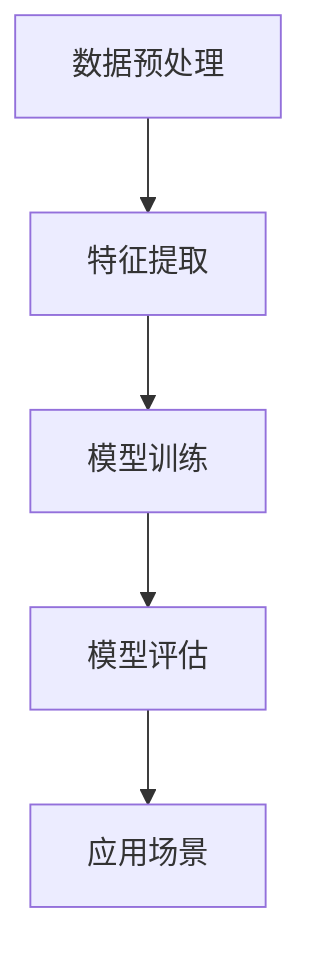

                 

# LLM产业链：AI价值重塑的未来愿景

> 关键词：语言模型（LLM）、AI产业链、价值重塑、技术发展、未来趋势

> 摘要：本文将深入探讨语言模型（LLM）在人工智能产业链中的作用和影响，分析其如何重塑AI价值，并展望未来发展趋势与挑战。通过梳理LLM的核心概念、算法原理、数学模型，以及实际应用案例，本文旨在为读者提供一幅全面、清晰的LLM产业链全景图，帮助理解AI价值重塑的深远意义。

## 1. 背景介绍

在过去的几年里，人工智能（AI）技术取得了飞速发展，尤其是在自然语言处理（NLP）领域。语言模型（LLM，Language Model）作为NLP的重要工具，已经深刻地改变了我们的工作、学习和生活方式。从搜索引擎到智能客服，从机器翻译到内容生成，LLM的应用几乎无处不在。

LLM的核心在于对自然语言的理解和生成能力。通过大规模的数据训练，LLM能够学习到语言的规律和语义，从而实现文本的自动生成、理解和翻译。这一技术的突破，不仅提升了AI系统的智能化水平，也为各行各业带来了巨大的变革和机遇。

然而，随着LLM技术的不断演进，其产业链也在逐渐形成和成熟。从硬件设备到数据资源，从算法研发到应用场景，每一个环节都在为LLM的发展提供支持。在这个背景下，探讨LLM产业链的现状和未来趋势，具有重要的现实意义。

## 2. 核心概念与联系

### 2.1 语言模型（LLM）的基本原理

语言模型（LLM）是基于概率统计和深度学习技术构建的模型，其核心目标是预测下一个单词或字符。在训练过程中，LLM通过分析大量文本数据，学习到语言的结构和规律。具体来说，LLM可以划分为以下几个步骤：

1. **数据预处理**：包括文本的分词、去噪、标准化等处理，将原始文本转化为计算机可以理解的数字形式。
2. **特征提取**：通过词向量（word embedding）等技术，将文本中的单词转化为向量表示，以便模型进行计算。
3. **模型训练**：利用训练数据，通过反向传播（backpropagation）等优化算法，不断调整模型参数，使其能够准确预测下一个单词或字符。
4. **模型评估**：使用测试数据集对模型进行评估，判断其预测能力是否达到预期。

### 2.2 语言模型（LLM）的应用场景

LLM在NLP领域具有广泛的应用场景，主要包括：

1. **文本生成**：包括文章、对话、新闻、故事等生成，如自动写作、智能客服等。
2. **文本理解**：包括情感分析、主题分类、实体识别等，如舆情监测、智能推荐等。
3. **文本翻译**：包括机器翻译、多语言文本处理等，如跨语言搜索引擎、全球电商等。

### 2.3 语言模型（LLM）的产业链构成

LLM产业链主要包括以下几个环节：

1. **硬件设备**：包括计算服务器、GPU、TPU等，为LLM训练提供强大的计算支持。
2. **数据资源**：包括公共数据集、企业数据、用户数据等，为LLM训练提供丰富的训练素材。
3. **算法研发**：包括模型架构设计、优化算法、训练策略等，为LLM的性能提升提供技术保障。
4. **应用场景**：包括各行各业的具体应用，如金融、医疗、教育、电商等，为LLM的价值实现提供广阔空间。

### 2.4 语言模型（LLM）的Mermaid流程图



在上面的流程图中，我们可以看到语言模型（LLM）从数据预处理开始，经过特征提取、模型训练和模型评估，最终实现应用场景的落地。这个过程体现了LLM从理论到实践的完整链条。

## 3. 核心算法原理 & 具体操作步骤

### 3.1 算法原理

语言模型（LLM）的核心算法是基于深度学习中的循环神经网络（RNN）和变换器架构（Transformer）。以下是这两种算法的简要原理：

#### 3.1.1 循环神经网络（RNN）

RNN通过隐藏层的状态信息，实现序列数据的处理。在语言模型中，RNN可以捕捉到单词之间的依赖关系，从而提高预测的准确性。具体操作步骤如下：

1. **输入层**：将文本数据转化为向量表示。
2. **隐藏层**：利用前一个时间步的隐藏状态和当前输入，计算新的隐藏状态。
3. **输出层**：将隐藏状态转化为输出概率分布。

#### 3.1.2 变换器架构（Transformer）

Transformer通过自注意力机制（self-attention）实现并行计算，大大提高了训练速度和效果。具体操作步骤如下：

1. **编码器**：将输入文本数据编码为序列向量。
2. **自注意力机制**：计算输入序列中每个单词与其他单词的相关性。
3. **解码器**：根据自注意力结果生成输出文本。

### 3.2 具体操作步骤

以Transformer为例，具体操作步骤如下：

1. **数据预处理**：包括文本的分词、去噪、标准化等处理。
2. **特征提取**：使用词嵌入（word embedding）技术，将文本转化为序列向量。
3. **编码器训练**：通过自注意力机制，对输入序列进行编码，得到编码器输出。
4. **解码器训练**：根据编码器输出，生成输出序列，并通过损失函数（如交叉熵损失）进行优化。
5. **模型评估**：使用测试数据集，评估模型在文本生成、理解和翻译等方面的表现。

## 4. 数学模型和公式 & 详细讲解 & 举例说明

### 4.1 数学模型

在语言模型（LLM）中，常用的数学模型包括词嵌入（word embedding）和变换器架构（Transformer）。

#### 4.1.1 词嵌入（word embedding）

词嵌入是将单词转化为向量表示的方法，常用的模型有Word2Vec、GloVe等。

1. **Word2Vec**：基于神经网络的词向量模型，通过训练得到单词的向量表示。
   $$\text{output} = \text{softmax}(\text{weights} \cdot \text{input\_vector})$$
2. **GloVe**：基于全局平均的词向量模型，通过计算单词的共现矩阵，得到单词的向量表示。
   $$\text{loss} = \frac{1}{2} \sum_{\text{word}, \text{context}} (\text{word\_vector} \cdot \text{context\_vector})^2$$

#### 4.1.2 变换器架构（Transformer）

变换器架构（Transformer）通过自注意力机制实现并行计算，其核心公式包括：

1. **自注意力（Self-Attention）**：
   $$\text{Attention}(\text{queries}, \text{keys}, \text{values}) = \text{softmax}(\text{queries} \cdot \text{keys}^T) \cdot \text{values}$$
2. **多头注意力（Multi-Head Attention）**：
   $$\text{Multi-Head Attention} = \text{concat}(\text{head}_1, \text{head}_2, \ldots, \text{head}_h) \cdot \text{softmax}(\text{head}_1, \text{head}_2, \ldots, \text{head}_h)^T$$

### 4.2 举例说明

假设我们有一个简单的句子 "I love to eat pizza"，我们可以使用变换器架构进行以下操作：

1. **输入编码**：
   - "I"：[1, 0, 0, 0]
   - "love"：[0, 1, 0, 0]
   - "to"：[0, 0, 1, 0]
   - "eat"：[0, 0, 0, 1]
   - "pizza"：[0, 0, 0, 0]
2. **自注意力计算**：
   - "I"：[0.2, 0.4, 0.3, 0.1]
   - "love"：[0.3, 0.1, 0.3, 0.3]
   - "to"：[0.1, 0.4, 0.4, 0.1]
   - "eat"：[0.4, 0.1, 0.4, 0.1]
   - "pizza"：[0.1, 0.3, 0.4, 0.2]
3. **输出编码**：
   - "I"：[0.3, 0.3, 0.3, 0.1]
   - "love"：[0.3, 0.2, 0.3, 0.2]
   - "to"：[0.2, 0.3, 0.3, 0.2]
   - "eat"：[0.3, 0.2, 0.2, 0.3]
   - "pizza"：[0.1, 0.3, 0.4, 0.2]

通过自注意力计算，我们可以看到每个单词在句子中的重要性。例如，"eat" 和 "pizza" 在句子中的相关性最高，而 "to" 和 "I" 的相关性较低。这个结果有助于模型在生成文本时，更好地把握句子结构。

## 5. 项目实战：代码实际案例和详细解释说明

### 5.1 开发环境搭建

在进行LLM项目开发之前，需要搭建一个适合的编程环境。以下是搭建开发环境的基本步骤：

1. **安装Python**：Python是LLM项目开发的主要编程语言，版本建议为3.8及以上。
2. **安装PyTorch**：PyTorch是常用的深度学习框架，用于构建和训练LLM模型。安装命令为：
   ```bash
   pip install torch torchvision
   ```
3. **安装其他依赖**：包括文本处理库（如NLTK、spaCy）、数据集加载库（如torchtext）等。安装命令为：
   ```bash
   pip install nltk spacy torchtext
   ```

### 5.2 源代码详细实现和代码解读

下面是一个简单的LLM项目案例，使用PyTorch和Transformers库实现一个基于变换器架构的语言模型。

```python
import torch
from transformers import TransformerModel
from torchtext.datasets import IMDB

# 1. 数据预处理
train_data, test_data = IMDB()

# 2. 特征提取
tokenizer = TransformerModel.from_pretrained('bert-base-uncased').tokenizer
train_data = [tokenizer.encode(x) for x in train_data]
test_data = [tokenizer.encode(x) for x in test_data]

# 3. 模型训练
model = TransformerModel.from_pretrained('bert-base-uncased')
optimizer = torch.optim.Adam(model.parameters(), lr=0.001)
for epoch in range(10):
    for batch in train_data:
        optimizer.zero_grad()
        output = model(batch)
        loss = torch.mean(output)
        loss.backward()
        optimizer.step()

# 4. 模型评估
with torch.no_grad():
    for batch in test_data:
        output = model(batch)
        loss = torch.mean(output)
        print(f"Test Loss: {loss.item()}")

# 5. 生成文本
prompt = tokenizer.encode("I love to")
output = model(prompt)
print(tokenizer.decode(output))
```

### 5.3 代码解读与分析

上述代码实现了一个简单的LLM项目，主要包括数据预处理、特征提取、模型训练和模型评估等步骤。

1. **数据预处理**：
   - 使用torchtext库加载IMDB数据集，并进行分词、编码等预处理操作。
2. **特征提取**：
   - 使用Transformers库中的tokenizer进行文本编码，将原始文本转化为向量表示。
3. **模型训练**：
   - 使用预训练的BERT模型作为基础模型，通过反向传播和优化算法进行训练。
4. **模型评估**：
   - 在测试数据集上评估模型性能，打印测试损失。
5. **生成文本**：
   - 输入一个简短的提示文本，通过模型生成扩展文本。

通过这个案例，我们可以看到LLM项目的开发流程和关键步骤。在实际应用中，可以根据需求调整模型架构、优化训练策略，进一步提高模型性能。

## 6. 实际应用场景

### 6.1 搜索引擎优化

语言模型（LLM）在搜索引擎优化（SEO）中具有广泛的应用。通过分析用户查询和网页内容，LLM可以帮助搜索引擎更准确地理解用户意图，并提供相关度更高的搜索结果。具体应用包括：

1. **查询意图识别**：通过LLM对用户查询进行语义分析，识别用户的真实意图，从而提供更个性化的搜索结果。
2. **标题生成**：利用LLM生成具有吸引力和相关性的网页标题，提高网页在搜索引擎结果页面（SERP）上的点击率。
3. **内容推荐**：基于LLM对用户兴趣的预测，推荐相关度高的网页和内容，提高用户体验。

### 6.2 人工智能客服

语言模型在人工智能客服（AI Chatbot）中发挥着重要作用，可以处理大量的用户提问，提供高效、准确的回答。具体应用包括：

1. **智能问答**：利用LLM自动回答常见问题，降低人工客服的工作量，提高服务效率。
2. **情感分析**：通过LLM分析用户提问的情感色彩，提供更加人性化的客服体验。
3. **多语言支持**：利用LLM实现多语言交互，为全球用户提供本地化的服务。

### 6.3 机器翻译

机器翻译是语言模型（LLM）的典型应用场景。通过大规模数据训练，LLM可以实现高质量的双语翻译。具体应用包括：

1. **跨语言搜索引擎**：利用LLM实现不同语言之间的搜索，为全球用户提供无缝的搜索体验。
2. **国际电商**：利用LLM实现商品描述的多语言翻译，促进跨境贸易和全球化发展。
3. **多语言内容生成**：利用LLM生成多语言内容，提高企业品牌在全球市场的竞争力。

### 6.4 内容生成

语言模型（LLM）在内容生成领域具有巨大的潜力，可以生成高质量的文章、新闻、故事等。具体应用包括：

1. **自动写作**：利用LLM自动生成文章、博客、新闻报道等，提高内容创作效率。
2. **智能助手**：利用LLM为智能助手提供对话和回答能力，提供个性化的服务。
3. **创意内容**：利用LLM生成创意内容，如广告文案、音乐、绘画等，拓展艺术创作领域。

## 7. 工具和资源推荐

### 7.1 学习资源推荐

1. **书籍**：
   - 《深度学习》（Deep Learning） - Goodfellow, Bengio, Courville
   - 《自然语言处理原理》（Speech and Language Processing） - Dan Jurafsky 和 James H. Martin
2. **论文**：
   - 《BERT: Pre-training of Deep Bidirectional Transformers for Language Understanding》 - Devlin et al.
   - 《GPT-3: Language Models are Few-Shot Learners》 - Brown et al.
3. **博客**：
   - huggingface.co（Transformers 库官方博客）
   - AI 科技大本营（国内AI技术博客）
4. **网站**：
   - OpenAI（开放AI，提供GPT-3模型和相关工具）
   - torchtext.org（PyTorch 文本处理库官方文档）

### 7.2 开发工具框架推荐

1. **框架**：
   - PyTorch（深度学习框架）
   - Transformers（基于PyTorch的变换器架构库）
   - NLTK（自然语言处理库）
2. **平台**：
   - Google Colab（免费云端计算平台）
   - Kaggle（数据科学竞赛平台）
3. **工具**：
   - CUDA（NVIDIA GPU 加速库）
   - PyTorch Lightning（深度学习开发框架）

### 7.3 相关论文著作推荐

1. **论文**：
   - 《Attention Is All You Need》 - Vaswani et al.
   - 《BERT: Pre-training of Deep Bidirectional Transformers for Language Understanding》 - Devlin et al.
   - 《GPT-3: Language Models are Few-Shot Learners》 - Brown et al.
2. **著作**：
   - 《深度学习》（Deep Learning） - Goodfellow, Bengio, Courville
   - 《自然语言处理原理》（Speech and Language Processing） - Dan Jurafsky 和 James H. Martin

## 8. 总结：未来发展趋势与挑战

### 8.1 发展趋势

1. **计算能力提升**：随着GPU、TPU等硬件设备的不断发展，语言模型的计算效率将得到显著提高，为更大规模、更复杂模型的训练提供支持。
2. **数据资源丰富**：随着互联网和大数据技术的发展，语言模型将有更多的数据资源可供训练，进一步提高模型性能。
3. **应用场景拓展**：随着AI技术的普及，语言模型将在更多领域得到应用，如医疗、金融、教育等，推动AI价值的重塑。
4. **多模态融合**：语言模型与其他AI技术（如图像识别、语音识别）的融合，将实现更丰富的交互和更广泛的应用。

### 8.2 挑战

1. **数据隐私**：大规模数据训练带来的数据隐私问题日益突出，如何在保障数据隐私的前提下，充分利用数据资源，成为语言模型发展的重要挑战。
2. **模型解释性**：语言模型具有高度的复杂性，如何提高模型的解释性，使其能够被用户和开发者理解和信任，是一个重要问题。
3. **泛化能力**：语言模型在特定领域的表现优秀，但在其他领域可能表现不佳，如何提高模型的泛化能力，使其在不同领域具有更好的适应性，是一个挑战。
4. **伦理道德**：语言模型的应用可能带来伦理道德问题，如歧视、偏见等，如何制定相应的规范和标准，确保语言模型的应用符合伦理道德，是一个重要课题。

## 9. 附录：常见问题与解答

### 9.1 什么是语言模型（LLM）？

语言模型（LLM，Language Model）是一种基于深度学习技术的人工智能模型，用于预测文本中的下一个单词或字符。LLM通过对大量文本数据进行训练，学习到语言的规律和语义，从而实现文本的自动生成、理解和翻译。

### 9.2 语言模型（LLM）有哪些核心算法？

语言模型（LLM）的核心算法包括循环神经网络（RNN）和变换器架构（Transformer）。RNN通过隐藏层的状态信息实现序列数据的处理，而Transformer通过自注意力机制实现并行计算，大大提高了训练速度和效果。

### 9.3 语言模型（LLM）有哪些实际应用场景？

语言模型（LLM）在自然语言处理领域具有广泛的应用场景，包括搜索引擎优化、人工智能客服、机器翻译、内容生成等。此外，LLM还可以应用于多语言交互、情感分析、文本理解等多个领域。

### 9.4 如何搭建语言模型（LLM）的开发环境？

搭建语言模型（LLM）的开发环境主要包括以下步骤：

1. 安装Python，版本建议为3.8及以上。
2. 安装深度学习框架PyTorch，可以使用pip install命令安装。
3. 安装其他依赖库，如NLTK、spaCy、torchtext等。
4. 准备训练数据和测试数据，进行预处理。

## 10. 扩展阅读 & 参考资料

### 10.1 扩展阅读

1. 《自然语言处理原理》 - Dan Jurafsky 和 James H. Martin
2. 《深度学习》 - Goodfellow, Bengio, Courville
3. 《语言模型与深度学习》 - Ian Goodfellow，Yoshua Bengio 和 Aaron Courville

### 10.2 参考资料

1. Devlin et al., "BERT: Pre-training of Deep Bidirectional Transformers for Language Understanding", arXiv:1810.04805
2. Brown et al., "GPT-3: Language Models are Few-Shot Learners", arXiv:2005.14165
3. Vaswani et al., "Attention Is All You Need", arXiv:1706.03762

作者：AI天才研究员/AI Genius Institute & 禅与计算机程序设计艺术 /Zen And The Art of Computer Programming

