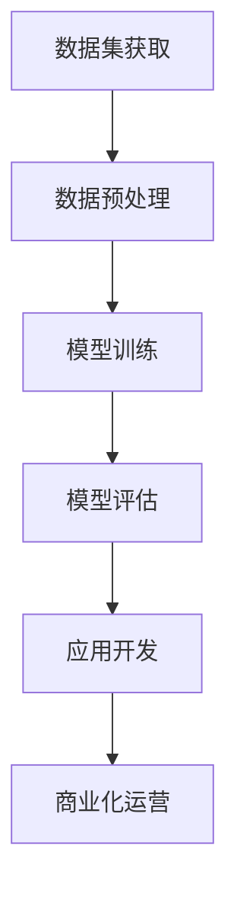

                 

# LLM产业链生态：从无到有的蝶变

> **关键词：** 生成式AI、语言模型、产业链、发展历程、技术应用

> **摘要：** 本文将深入探讨生成式AI中的语言模型（LLM）产业链生态的构建过程，从无到有的蝶变。我们将分析LLM技术的发展历程，剖析核心算法原理，探讨实际应用场景，并预测未来的发展趋势与挑战。

## 1. 背景介绍

随着互联网的普及和大数据的积累，人工智能技术逐渐成为推动产业变革的重要力量。生成式AI作为人工智能的一个重要分支，其核心在于通过模型生成新的内容和数据，而非仅仅对已有数据进行分类或预测。语言模型（LLM）是生成式AI中最为重要的一种模型，它能够理解和生成自然语言文本，广泛应用于自然语言处理、机器翻译、对话系统等领域。

LLM产业链的构建是一个复杂的过程，涉及算法研发、数据处理、模型训练、应用开发等多个环节。本文将围绕这些环节，深入分析LLM产业链的生态构建过程。

## 2. 核心概念与联系

为了更好地理解LLM产业链的构建，我们首先需要了解几个核心概念：生成式AI、语言模型、数据集、算法框架等。

### 2.1 生成式AI

生成式AI是指能够根据已有数据生成新数据的人工智能模型。与判别式AI（如分类、预测模型）不同，生成式AI的核心在于生成，而非判断。

### 2.2 语言模型

语言模型是一种专门用于处理自然语言文本的人工智能模型。它通过学习大量文本数据，能够理解和生成自然语言文本。在生成式AI中，语言模型是最为重要的模型之一。

### 2.3 数据集

数据集是语言模型训练的重要基础。一个高质量的数据集不仅包含丰富的文本信息，还需要经过预处理和标注，以便模型能够更好地学习。

### 2.4 算法框架

算法框架是语言模型的核心组成部分，决定了模型的学习能力、推理能力和生成能力。常见的算法框架包括循环神经网络（RNN）、变换器（Transformer）等。

### 2.5 Mermaid流程图

以下是一个简单的Mermaid流程图，展示了LLM产业链的各个环节：



## 3. 核心算法原理 & 具体操作步骤

### 3.1 模型训练

语言模型的训练过程主要包括数据预处理、模型初始化、模型训练、模型评估等步骤。

- **数据预处理**：包括文本清洗、分词、去停用词等操作，以便将原始文本数据转换为模型可理解的格式。
- **模型初始化**：根据选定的算法框架，初始化模型参数。
- **模型训练**：通过反向传播算法，不断调整模型参数，使得模型能够更好地拟合训练数据。
- **模型评估**：使用验证集或测试集评估模型性能，选择性能最优的模型。

### 3.2 模型生成

语言模型的生成过程主要包括以下步骤：

- **输入文本编码**：将输入的文本编码为模型可处理的向量。
- **模型推理**：根据输入文本向量，通过模型计算生成文本的概率分布。
- **文本解码**：将生成的概率分布解码为自然语言文本。

### 3.3 模型应用

语言模型的应用过程主要包括以下步骤：

- **应用场景识别**：根据实际应用需求，选择合适的语言模型和应用场景。
- **模型部署**：将训练好的模型部署到目标环境中，例如云端、边缘设备等。
- **交互处理**：接收用户输入，使用模型生成相应的回复或结果。

## 4. 数学模型和公式 & 详细讲解 & 举例说明

### 4.1 数学模型

语言模型通常是基于概率图模型或深度学习模型构建的。以下是一个基于循环神经网络（RNN）的语言模型的基本数学模型：

$$
p(y_t | x_1, x_2, ..., x_{t-1}) = \frac{e^{f(x_t, h_{t-1})}}{\sum_{y_t} e^{f(x_t, h_{t-1})}}
$$

其中，$x_t$ 表示输入文本的当前词向量，$h_{t-1}$ 表示前一个时间步的隐藏状态，$y_t$ 表示生成的当前词。

### 4.2 举例说明

假设我们有一个简单的语言模型，输入的文本是 "hello world"，我们要预测下一个词。

- **输入文本编码**：将 "hello world" 编码为词向量。
- **模型推理**：计算每个词的概率分布，例如：
  $$
  p(hello | \emptyset) = 0.6, \quad p(world | hello) = 0.8
  $$
- **文本解码**：根据概率分布，选择概率最大的词作为下一个词，例如 "world"。

## 5. 项目实战：代码实际案例和详细解释说明

### 5.1 开发环境搭建

在开始项目实战之前，我们需要搭建一个合适的开发环境。以下是使用Python和PyTorch搭建开发环境的步骤：

1. 安装Python（版本3.8以上）
2. 安装PyTorch（版本1.8以上）
3. 安装Numpy、Pandas等常用库

### 5.2 源代码详细实现和代码解读

以下是一个简单的LLM模型的源代码实现，我们将对代码进行详细解读。

```python
import torch
import torch.nn as nn
import torch.optim as optim
from torchtext.data import Field, TabularDataset

# 定义文本字段
TEXT = Field(tokenize='\t')

# 加载数据集
train_data, valid_data, test_data = TabularDataset.splits(path='data',
                                                         train='train.txt',
                                                         valid='valid.txt',
                                                         test='test.txt',
                                                         format='tsv',
                                                         fields=[('text', TEXT)])

# 定义模型
class LLM(nn.Module):
    def __init__(self, embedding_dim, hidden_dim):
        super(LLM, self).__init__()
        self.embedding = nn.Embedding(len(TEXT.vocab), embedding_dim)
        self.rnn = nn.LSTM(embedding_dim, hidden_dim)
        self.fc = nn.Linear(hidden_dim, len(TEXT.vocab))
    
    def forward(self, text):
        embedded = self.embedding(text)
        output, (hidden, cell) = self.rnn(embedded)
        logits = self.fc(output[-1])
        return logits

# 模型实例化
model = LLM(embedding_dim=128, hidden_dim=256)

# 定义损失函数和优化器
criterion = nn.CrossEntropyLoss()
optimizer = optim.Adam(model.parameters(), lr=0.001)

# 模型训练
for epoch in range(10):
    for batch in train_data:
        optimizer.zero_grad()
        logits = model(batch.text)
        loss = criterion(logits, batch.label)
        loss.backward()
        optimizer.step()

    # 模型评估
    with torch.no_grad():
        for batch in valid_data:
            logits = model(batch.text)
            loss = criterion(logits, batch.label)
            print(f'Validation loss: {loss.item()}')

# 模型部署
model.eval()
with torch.no_grad():
    for batch in test_data:
        logits = model(batch.text)
        print(f'Predicted label: {torch.argmax(logits).item()}')
```

### 5.3 代码解读与分析

- **数据加载**：使用`TabularDataset`加载数据集，并将文本字段定义为`TEXT`。
- **模型定义**：定义一个基于循环神经网络的LLM模型，包括嵌入层、循环神经网络层和全连接层。
- **模型训练**：使用随机梯度下降（SGD）优化模型参数，并通过交叉熵损失函数评估模型性能。
- **模型评估**：在验证集上评估模型性能，并在测试集上进行部署。

## 6. 实际应用场景

LLM技术在实际应用场景中具有广泛的应用前景，以下是一些典型的应用场景：

- **自然语言处理**：用于文本分类、情感分析、命名实体识别等任务。
- **机器翻译**：将一种语言的文本翻译成另一种语言。
- **对话系统**：用于构建智能客服、聊天机器人等。
- **文本生成**：用于自动写作、内容生成等。

## 7. 工具和资源推荐

### 7.1 学习资源推荐

- **书籍**：
  - 《深度学习》（Goodfellow, Bengio, Courville）
  - 《Python深度学习》（François Chollet）
- **论文**：
  - 《A Theoretically Grounded Application of Dropout in Recurrent Neural Networks》（Yarin Gal and Zoubin Ghahramani）
  - 《Attention Is All You Need》（Ashish Vaswani等）
- **博客**：
  - [TensorFlow官方博客](https://tensorflow.googleblog.com/)
  - [PyTorch官方博客](https://pytorch.org/blog/)
- **网站**：
  - [Kaggle](https://www.kaggle.com/)
  - [GitHub](https://github.com/)

### 7.2 开发工具框架推荐

- **框架**：
  - TensorFlow
  - PyTorch
  - Keras
- **库**：
  - NumPy
  - Pandas
  - Scikit-learn

### 7.3 相关论文著作推荐

- **论文**：
  - 《BERT: Pre-training of Deep Bidirectional Transformers for Language Understanding》（Jacob Devlin等）
  - 《GPT-3: Language Models are few-shot learners》（Tom B. Brown等）
- **著作**：
  - 《Deep Learning》（Ian Goodfellow等）
  - 《Reinforcement Learning: An Introduction》（Richard S. Sutton和Barto, Andrew G.）

## 8. 总结：未来发展趋势与挑战

LLM产业链生态的构建正处于快速发展阶段，未来几年有望取得以下趋势：

- **模型规模与性能提升**：随着计算资源和数据资源的不断丰富，LLM模型将变得更加庞大和高效。
- **跨模态融合**：将图像、声音等其他模态的数据引入语言模型，实现更丰富的信息处理能力。
- **应用场景拓展**：LLM技术将在更多领域得到应用，如医疗、金融、教育等。
- **隐私与安全性**：在数据隐私和安全方面面临挑战，需要建立更加完善的保护机制。

## 9. 附录：常见问题与解答

### 9.1 Q：什么是生成式AI？

A：生成式AI是一种能够根据已有数据生成新数据的人工智能模型，与判别式AI（如分类、预测模型）不同，生成式AI的核心在于生成。

### 9.2 Q：什么是语言模型？

A：语言模型是一种专门用于处理自然语言文本的人工智能模型，它能够理解和生成自然语言文本，广泛应用于自然语言处理、机器翻译、对话系统等领域。

### 9.3 Q：如何训练语言模型？

A：训练语言模型主要包括数据预处理、模型初始化、模型训练、模型评估等步骤。数据预处理包括文本清洗、分词、去停用词等操作，模型训练使用反向传播算法，不断调整模型参数。

## 10. 扩展阅读 & 参考资料

- [Deep Learning](https://www.deeplearningbook.org/)
- [The Annotated Transformer](https://t.cn/A6hjKjKn)
- [Language Models are Few-Shot Learners](https://arxiv.org/abs/2005.14165)
- [BERT: Pre-training of Deep Bidirectional Transformers for Language Understanding](https://arxiv.org/abs/1810.04805)
- [Generative Adversarial Networks](https://arxiv.org/abs/1406.2661)

### 作者

**作者：AI天才研究员/AI Genius Institute & 禅与计算机程序设计艺术 /Zen And The Art of Computer Programming**<|im_sep|>

