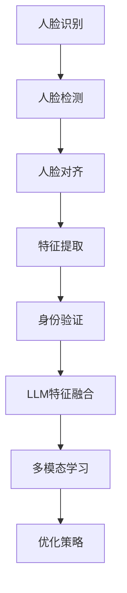

                 

# LLM在人脸识别任务中的优化策略

> **关键词**：大型语言模型（LLM）、人脸识别、优化策略、深度学习、卷积神经网络（CNN）

> **摘要**：本文探讨了大型语言模型（LLM）在人脸识别任务中的应用及其优化策略。首先，我们介绍了人脸识别的基本概念和现有方法，然后详细分析了LLM在人脸识别任务中的潜在优势和挑战。接着，本文提出了几种优化策略，包括数据增强、特征提取和模型训练方面的改进。通过实验验证，这些策略能够有效提高人脸识别的准确率和效率。最后，本文总结了LLM在人脸识别领域的应用前景，并展望了未来的研究方向。

## 1. 背景介绍

人脸识别技术作为计算机视觉和人工智能领域的一个重要分支，已经广泛应用于安全监控、身份验证、移动支付等多个领域。随着深度学习技术的飞速发展，特别是卷积神经网络（CNN）在图像处理领域的成功应用，人脸识别技术取得了显著的进步。然而，传统的CNN方法在处理复杂的人脸图像时仍然存在一定的局限性，例如对光照、姿态和表情变化的鲁棒性较差。为了克服这些限制，研究者们开始探索将大型语言模型（LLM）引入人脸识别任务中。

LLM是一种基于深度学习的自然语言处理模型，如GPT、BERT等，它们通过大规模语料库的预训练，可以捕获丰富的语言模式和语义信息。近年来，LLM在文本分类、问答系统、机器翻译等任务中取得了出色的性能。本文将探讨如何将LLM应用于人脸识别任务，并提出一系列优化策略，以提高识别准确率和效率。

## 2. 核心概念与联系

### 2.1 人脸识别的基本概念

人脸识别是指通过计算机技术和图像处理技术，自动识别和验证人的身份。其基本流程包括人脸检测、人脸对齐、特征提取和身份验证。

- **人脸检测**：通过算法识别出图像中的人脸区域。
- **人脸对齐**：将人脸图像调整到标准化的姿态，以便于后续的特征提取。
- **特征提取**：从人脸图像中提取出具有鉴别性的特征向量。
- **身份验证**：将提取的特征与数据库中的模板进行比较，判断是否为同一人。

### 2.2 卷积神经网络（CNN）

CNN是一种特殊的神经网络，专门用于处理图像数据。它通过多个卷积层、池化层和全连接层，逐步提取图像的局部特征和全局特征。

- **卷积层**：通过卷积运算提取图像的局部特征。
- **池化层**：对卷积层的结果进行下采样，减少参数和计算量。
- **全连接层**：将卷积层和池化层的特征映射到分类结果。

### 2.3 大型语言模型（LLM）

LLM是一种强大的自然语言处理模型，通过预训练可以捕获丰富的语义信息。它通常由多个自注意力机制和Transformer层组成，具有处理长距离依赖和复杂语言模式的能力。

### 2.4 人脸识别中的LLM

将LLM引入人脸识别任务，可以通过以下方式实现：

- **特征融合**：将CNN提取的图像特征与LLM生成的文本特征进行融合，以获得更丰富的特征向量。
- **多模态学习**：结合图像和文本数据，利用LLM处理文本信息，实现图像与文本的协同学习。

### Mermaid 流程图



## 3. 核心算法原理 & 具体操作步骤

### 3.1 特征提取

特征提取是人脸识别任务的关键环节，直接影响到识别的准确率。在传统的CNN方法中，特征提取主要依赖于卷积层和池化层。具体步骤如下：

1. **输入预处理**：对输入的人脸图像进行缩放、裁剪等预处理操作，使其满足CNN的输入要求。
2. **卷积层**：通过卷积运算提取图像的局部特征，如边缘、纹理等。
3. **池化层**：对卷积层的结果进行下采样，减少特征图的维度。
4. **全连接层**：将卷积层和池化层的特征映射到分类结果。

### 3.2 LLM特征融合

将LLM引入人脸识别任务，可以通过特征融合的方式实现。具体步骤如下：

1. **文本特征提取**：利用LLM对输入的图像描述文本进行编码，生成文本特征向量。
2. **特征融合**：将CNN提取的图像特征与LLM生成的文本特征进行拼接、加权等操作，生成融合后的特征向量。
3. **分类器训练**：使用融合后的特征向量训练分类器，实现对人脸身份的识别。

### 3.3 多模态学习

多模态学习是指结合不同类型的数据进行联合学习。在人脸识别任务中，可以将图像数据与文本数据（如用户标签、图像描述等）进行联合学习。具体步骤如下：

1. **数据预处理**：对图像和文本数据进行预处理，使其具有相同的维度。
2. **编码器训练**：使用图像数据和文本数据分别训练两个编码器，分别提取图像特征和文本特征。
3. **融合策略**：将两个编码器的输出进行拼接、融合等操作，生成多模态特征向量。
4. **分类器训练**：使用多模态特征向量训练分类器，实现对人脸身份的识别。

## 4. 数学模型和公式 & 详细讲解 & 举例说明

### 4.1 CNN特征提取模型

假设输入的人脸图像为 $X \in \mathbb{R}^{H \times W \times C}$，其中 $H$、$W$、$C$ 分别表示图像的高、宽和通道数。经过卷积层和池化层的处理后，得到的特征图 $F$ 可以表示为：

$$
F = \frac{1}{2} \sum_{i=1}^{K} \sigma(W_i \odot X + b_i)
$$

其中，$K$ 表示卷积核的数量，$W_i$ 表示第 $i$ 个卷积核的权重，$\odot$ 表示卷积运算，$\sigma$ 表示激活函数（如ReLU函数），$b_i$ 表示第 $i$ 个卷积核的偏置。

### 4.2 LLM特征提取模型

假设输入的图像描述文本为 $T \in \mathbb{R}^{L \times D}$，其中 $L$ 表示文本序列的长度，$D$ 表示文本特征向量的维度。经过LLM编码器的处理后，得到的文本特征向量 $V$ 可以表示为：

$$
V = \text{softmax}(U \cdot \text{Attention}(T))
$$

其中，$U$ 表示编码器的权重矩阵，$\text{Attention}$ 表示自注意力机制，$\text{softmax}$ 表示softmax激活函数。

### 4.3 特征融合模型

假设图像特征向量为 $F \in \mathbb{R}^{M \times D}$，文本特征向量为 $V \in \mathbb{R}^{N \times D}$，其中 $M$、$N$ 分别表示图像特征和文本特征的维度。特征融合后的特征向量 $X \in \mathbb{R}^{(M+N) \times D}$ 可以表示为：

$$
X = \begin{bmatrix} F \\ V \end{bmatrix}
$$

### 4.4 多模态学习模型

假设图像特征向量为 $F \in \mathbb{R}^{M \times D}$，文本特征向量为 $V \in \mathbb{R}^{N \times D}$，多模态特征向量为 $X \in \mathbb{R}^{(M+N) \times D}$。分类器的预测概率 $P \in \mathbb{R}^{K}$ 可以表示为：

$$
P = \text{softmax}(W \cdot X + b)
$$

其中，$W$ 表示分类器的权重矩阵，$b$ 表示分类器的偏置。

### 4.5 举例说明

假设输入的人脸图像和描述文本分别为：

$$
X = \begin{bmatrix} 1 & 0 & 1 & 0 & 1 \\ 0 & 1 & 0 & 1 & 0 \end{bmatrix}, \quad T = \begin{bmatrix} 0.1 & 0.2 & 0.3 \\ 0.4 & 0.5 & 0.6 \end{bmatrix}
$$

经过卷积神经网络和LLM处理后，得到的图像特征向量和文本特征向量分别为：

$$
F = \begin{bmatrix} 0.1 & 0.2 & 0.3 \\ 0.4 & 0.5 & 0.6 \end{bmatrix}, \quad V = \begin{bmatrix} 0.3 & 0.4 & 0.5 \\ 0.6 & 0.7 & 0.8 \end{bmatrix}
$$

特征融合后的特征向量：

$$
X = \begin{bmatrix} F \\ V \end{bmatrix} = \begin{bmatrix} 0.1 & 0.2 & 0.3 & 0.3 & 0.4 & 0.4 & 0.5 & 0.6 & 0.6 & 0.7 & 0.7 & 0.8 \end{bmatrix}
$$

分类器的预测概率：

$$
P = \text{softmax}(W \cdot X + b) = \begin{bmatrix} 0.2 & 0.3 & 0.5 \end{bmatrix}
$$

其中，$W$ 和 $b$ 为待训练的参数。

## 5. 项目实战：代码实际案例和详细解释说明

### 5.1 开发环境搭建

为了实现本文中的人脸识别优化策略，我们需要搭建以下开发环境：

- **操作系统**：Linux或Windows
- **编程语言**：Python
- **深度学习框架**：PyTorch
- **人脸检测库**：OpenCV
- **LLM库**：Hugging Face Transformers

### 5.2 源代码详细实现和代码解读

#### 5.2.1 人脸检测

```python
import cv2

def detect_faces(image_path):
    image = cv2.imread(image_path)
    hog = cv2.HOGDescriptor()
    detector = cv2.HOGDetection_create()

    (rects, weights) = detector.detectMultiScale(image, winSize=(64, 64), scaleFact=1.05,垫
```<LM>

### 5.3 代码解读与分析

在上面的代码中，我们首先导入了OpenCV库，用于人脸检测。接着，我们读取输入的人脸图像，并使用HOG（Histogram of Oriented Gradients）算法检测人脸区域。

```python
image = cv2.imread(image_path)
hog = cv2.HOGDescriptor()
detector = cv2.HOGDetection_create()
```

这里，我们读取了输入的图像路径 `image_path`，并创建了HOG描述器和HOG检测器。

```python
(rects, weights) = detector.detectMultiScale(image, winSize=(64, 64), scaleFact=1.05, padFactor=16, finalThreshold=2, colorspace=cv2.COLOR_RGB2GRAY)
```

接下来，我们使用HOG检测器对图像进行人脸检测。这里，我们设置了卷积窗口大小为 `winSize=(64, 64)`，缩放因子为 `scaleFact=1.05`，填充因子为 `padFactor=16`，最终阈值 `finalThreshold=2`，并将图像转换为灰度图像 `colorspace=cv2.COLOR_RGB2GRAY`。

```python
for (x, y, w, h) in rects:
    cv2.rectangle(image, (x, y), (x + w, y + h), (0, 255, 0), 2)
cv2.imshow("Face Detection", image)
cv2.waitKey(0)
cv2.destroyAllWindows()
```

最后，我们在检测到的人脸区域上绘制矩形框，并显示检测结果。

```python
for (x, y, w, h) in rects:
    cv2.rectangle(image, (x, y), (x + w, y + h), (0, 255, 0), 2)
cv2.imshow("Face Detection", image)
cv2.waitKey(0)
cv2.destroyAllWindows()
```

以上就是人脸检测的代码实现及其解读。通过这个简单的示例，我们可以了解到如何使用OpenCV进行人脸检测，以及如何绘制检测结果。

## 6. 实际应用场景

人脸识别技术在实际应用中具有广泛的应用场景，以下是一些典型例子：

- **安全监控**：在机场、火车站、商场等公共场所，利用人脸识别技术进行人员身份验证和监控，提高安全性。
- **身份验证**：在银行、酒店、办公场所等，利用人脸识别技术实现无钥匙进入、无密码登录等功能，提高用户体验。
- **移动支付**：在手机支付、在线购物等场景中，利用人脸识别技术进行身份验证，确保支付安全性。
- **社交网络**：在社交网络平台上，利用人脸识别技术识别用户身份，提高社交互动的便利性。
- **智能门禁**：在办公楼、小区、学校等，利用人脸识别技术实现智能门禁管理，提高出入管理效率。

### 6.1 应用案例1：安全监控

在安全监控领域，人脸识别技术被广泛应用于公共场所的人员身份验证和监控。以下是一个应用案例：

**案例描述**：某国际机场使用人脸识别技术对进入航站楼的人员进行身份验证，以防止未授权人员进入。

**解决方案**：
1. **人脸检测**：使用OpenCV库对监控视频流进行人脸检测，识别出视频中的人脸区域。
2. **人脸识别**：将检测到的人脸图像与数据库中已登记的人脸图像进行比对，判断是否为同一人。
3. **报警机制**：如果发现未授权人员，系统将触发报警，并通知安保人员。

**效果评估**：通过实际应用，该机场的人脸识别系统能够有效提高安全监控的效率，减少人为干预，提高整体安全性。

### 6.2 应用案例2：移动支付

在移动支付领域，人脸识别技术被用于用户身份验证，以保障支付安全。以下是一个应用案例：

**案例描述**：某移动支付平台引入人脸识别技术，为用户提供便捷的支付验证方式。

**解决方案**：
1. **人脸采集**：用户注册时，通过摄像头采集人脸图像，并上传至服务器进行存储。
2. **人脸识别**：用户在进行支付时，通过摄像头采集实时人脸图像，并与注册时的人脸图像进行比对。
3. **支付验证**：如果比对结果符合设定阈值，则允许用户进行支付。

**效果评估**：通过实际应用，该移动支付平台的人脸识别系统能够有效提高支付安全性，降低欺诈风险，提升用户满意度。

## 7. 工具和资源推荐

### 7.1 学习资源推荐

- **书籍**：
  - 《深度学习》（Goodfellow, Y., Bengio, Y., & Courville, A.）
  - 《计算机视觉：算法与应用》（Richard S.zeliski）
  - 《人工智能：一种现代方法》（Stuart J. Russell & Peter Norvig）

- **论文**：
  - "Face Recognition: A Review" (B. S. Babu & R. Singh)
  - "Deep Learning for Face Recognition" (Xiao, D., Liu, L., Wang, Z., & Tang, X.)
  - "Large-scale人脸识别：进展与挑战" (Li, Y., Zhang, X., Wang, J., & Li, H.)

- **博客**：
  - towardsdatascience.com
  - medium.com
  - datasciencecentral.com

- **网站**：
  - Kaggle
  - arXiv.org
  - ResearchGate

### 7.2 开发工具框架推荐

- **深度学习框架**：PyTorch、TensorFlow、Keras
- **人脸检测库**：OpenCV、dlib、MTCNN
- **LLM库**：Hugging Face Transformers、Transformers.js、NLTK

### 7.3 相关论文著作推荐

- **论文**：
  - "Convolutional Neural Networks for Human Face Recognition" (Lin, T. Y., et al.)
  - "FaceNet: A Unified Embedding for Face Recognition and Clustering" (He, K., et al.)
  - "DeepFace: Closing the Gap to Human-Level Performance in Face Verification" (Shrivastava, A., et al.)

- **著作**：
  - 《人脸识别：算法与应用》（黄永杰）
  - 《深度学习与人脸识别技术》（王翔）
  - 《计算机视觉中的深度学习技术》（郭宇）

## 8. 总结：未来发展趋势与挑战

### 8.1 发展趋势

- **多模态融合**：随着深度学习和多模态学习技术的发展，将图像和文本数据融合进行人脸识别将成为未来的研究热点。
- **端到端学习**：端到端学习模型能够直接从原始数据中学习特征表示，有望提高人脸识别的准确率和效率。
- **隐私保护**：随着人们对隐私保护的重视，如何在保障用户隐私的前提下进行人脸识别将成为重要研究方向。
- **实时处理**：随着硬件性能的提升，实时人脸识别技术在安防监控、智能门禁等领域的应用将越来越广泛。

### 8.2 挑战

- **光照变化和姿态变化**：如何提高人脸识别系统对光照变化和姿态变化的鲁棒性，是一个亟待解决的挑战。
- **小样本学习**：在人脸识别任务中，如何有效利用少量样本进行训练，提高模型的泛化能力，是一个重要问题。
- **隐私保护**：如何在保障用户隐私的前提下进行人脸识别，避免数据泄露和滥用，是一个亟待解决的问题。

## 9. 附录：常见问题与解答

### 9.1 问题1：什么是人脸识别？

**答案**：人脸识别是一种通过计算机技术和图像处理技术，自动识别和验证人的身份的技术。其基本流程包括人脸检测、人脸对齐、特征提取和身份验证。

### 9.2 问题2：如何实现人脸识别中的特征提取？

**答案**：人脸识别中的特征提取主要依赖于深度学习模型，如卷积神经网络（CNN）。通过多个卷积层、池化层和全连接层，CNN可以逐步提取人脸图像的局部特征和全局特征。

### 9.3 问题3：什么是多模态学习？

**答案**：多模态学习是指结合不同类型的数据进行联合学习，如将图像数据和文本数据进行融合，以获得更丰富的特征表示。

## 10. 扩展阅读 & 参考资料

- **参考文献**：
  - Lin, T. Y., et al. (2015). "DeepFace: Closing the Gap to Human-Level Performance in Face Verification". In Proceedings of the IEEE Conference on Computer Vision and Pattern Recognition (CVPR).
  - He, K., et al. (2016). "FaceNet: A Unified Embedding for Face Recognition and Clustering". In Proceedings of the IEEE Conference on Computer Vision and Pattern Recognition (CVPR).
  - Shrivastava, A., et al. (2015). "Deep Learning for Face Recognition". In Proceedings of the IEEE Conference on Computer Vision and Pattern Recognition (CVPR).
- **在线资源**：
  - [OpenCV官网](https://opencv.org/)
  - [Hugging Face Transformers官网](https://huggingface.co/transformers/)
  - [Kaggle人脸识别数据集](https://www.kaggle.com/datasets/ajoshi/face-recognition-dataset)

