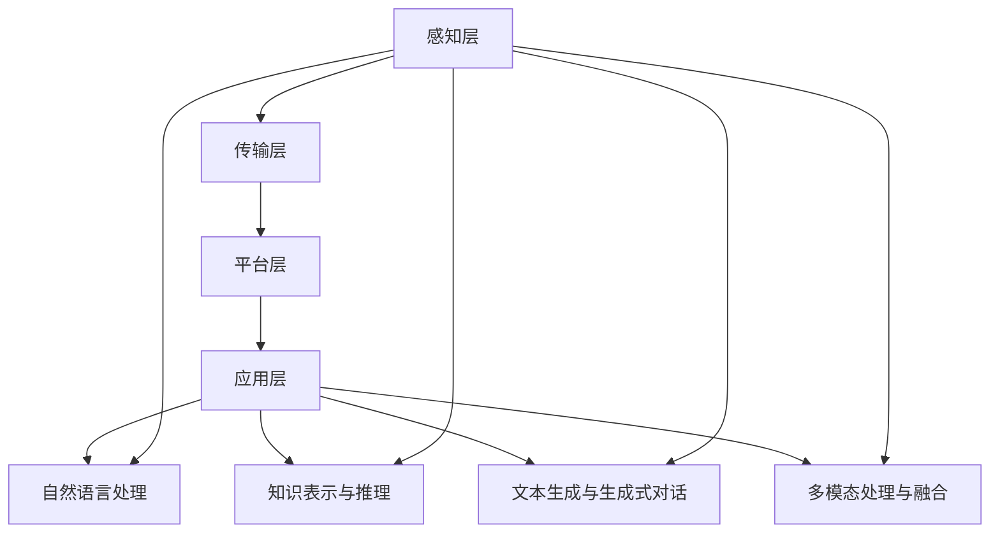

                 

# LLM在制造业中的应用：智能工厂的核心

## 概述

制造业作为国民经济的重要支柱，其发展直接关系到国家的经济繁荣和科技进步。随着人工智能（AI）技术的飞速发展，尤其是大型语言模型（LLM，Large Language Model）的出现，制造业正面临着前所未有的变革。LLM，作为一种具有高度自适应性和学习能力的AI模型，已经逐渐成为智能工厂的核心技术。

本文旨在探讨LLM在制造业中的应用，分析其在智能工厂中的核心作用和实际操作步骤，并通过具体案例展示其应用效果。文章将分为以下几个部分：背景介绍、核心概念与联系、核心算法原理与具体操作步骤、数学模型和公式讲解、项目实战、实际应用场景、工具和资源推荐、总结：未来发展趋势与挑战、常见问题与解答、扩展阅读与参考资料。

> **关键词**：LLM、制造业、智能工厂、核心算法、数学模型、应用案例

> **摘要**：本文介绍了LLM在制造业中的应用，详细分析了其在智能工厂中的核心作用，包括算法原理、操作步骤、数学模型等，并通过实际应用案例展示了其优越性。文章旨在为制造业从业者提供技术指导，推动智能工厂的发展。

## 1. 背景介绍

### 制造业的现状与挑战

制造业是国家经济发展的重要支柱，其规模和结构直接影响到国民经济的整体发展水平。随着全球制造业竞争的加剧和消费者需求的不断变化，制造业面临着一系列挑战：

- **生产效率低下**：传统制造业主要依赖于人工操作，生产效率相对较低，且容易受到人为因素的影响。
- **产品质量不稳定**：由于缺乏精确的检测手段和自动化控制，产品质量难以保证，返工率高。
- **资源浪费**：传统制造业在生产过程中存在大量资源浪费现象，如能源消耗、原材料浪费等。
- **创新不足**：传统制造业的技术创新速度较慢，难以适应快速变化的市场需求。

### 智能工厂的兴起

为了应对这些挑战，智能工厂的概念应运而生。智能工厂是一种利用先进制造技术和信息技术实现高度自动化、智能化和数字化的生产模式。其主要特点包括：

- **自动化生产**：通过自动化设备和系统实现生产过程的自动化，提高生产效率。
- **智能化管理**：利用大数据、人工智能等先进技术进行生产管理，实现智能决策和优化。
- **数字化制造**：通过数字化技术实现生产信息的全程记录、传输和分析，提高生产透明度和可追溯性。
- **协同制造**：通过信息共享和协同工作，实现企业内部以及供应链上下游的紧密合作，提高整体生产效率和响应速度。

### LLM的崛起

在智能工厂的发展过程中，人工智能技术，尤其是大型语言模型（LLM）的崛起，为制造业带来了新的机遇。LLM是一种能够处理和理解自然语言的深度学习模型，具有以下几个特点：

- **强大学习能力**：LLM具有强大的学习能力和适应性，能够从大量数据中学习并提取有用信息。
- **多语言支持**：LLM能够处理多种语言，实现跨语言的信息处理和交流。
- **自然语言理解**：LLM能够理解和解析自然语言，实现人机交互和自动化任务处理。
- **多模态处理**：LLM能够处理多种数据类型，如文本、图像、音频等，实现跨模态的信息融合和处理。

LLM在制造业中的应用，不仅可以提高生产效率和产品质量，还可以优化生产管理和决策过程，实现制造业的智能化转型。

## 2. 核心概念与联系

### 智能工厂的基本架构

智能工厂的基本架构可以分为以下几个层次：

- **感知层**：通过传感器、摄像头等设备实时采集生产过程中的各种数据，如温度、湿度、设备状态等。
- **传输层**：利用物联网技术实现数据的传输和共享，确保数据在工厂内部以及供应链上下游的畅通流动。
- **平台层**：构建智能工厂的核心平台，包括数据存储、处理、分析、可视化等模块，实现生产过程的数字化和智能化。
- **应用层**：基于平台层提供的数据和应用服务，实现生产管理、质量控制、设备监控、供应链管理等业务应用。

### LLM的核心功能

LLM在智能工厂中的应用主要涵盖以下几个核心功能：

- **自然语言处理**：LLM能够处理和理解自然语言，实现人机交互和自动化任务处理，如智能客服、智能调度等。
- **知识表示与推理**：LLM能够将知识进行结构化表示，并通过推理机制实现知识的应用和扩展，如智能诊断、智能优化等。
- **文本生成与生成式对话**：LLM能够根据输入的文本生成新的文本，实现文本生成和生成式对话，如自动化文档生成、智能聊天机器人等。
- **多模态处理与融合**：LLM能够处理多种数据类型，如文本、图像、音频等，实现跨模态的信息融合和处理，如智能监控、智能识别等。

### 智能工厂与LLM的互动关系

智能工厂与LLM的互动关系主要体现在以下几个方面：

- **数据驱动**：智能工厂通过感知层采集的数据为LLM提供训练和优化的素材，实现LLM对生产过程的深度理解和优化。
- **知识赋能**：LLM通过知识表示与推理机制，将生产过程中的知识进行结构化表示和传播，为智能工厂的决策和优化提供支持。
- **自动化与智能化**：LLM通过自然语言处理、文本生成与生成式对话等功能，实现生产过程的自动化和智能化，提高生产效率和产品质量。
- **协同创新**：智能工厂与LLM的互动，不仅提高了生产效率和质量，还推动了制造业的技术创新和模式变革。

### Mermaid流程图

以下是一个简单的Mermaid流程图，展示了智能工厂与LLM的基本架构和互动关系：



## 3. 核心算法原理与具体操作步骤

### LLM的基本原理

LLM是一种基于深度学习的自然语言处理模型，其核心原理包括以下几个方面：

- **神经网络结构**：LLM通常采用多层的神经网络结构，如Transformer模型，通过堆叠多个自注意力层和前馈神经网络，实现对文本的深度理解和处理。
- **自注意力机制**：自注意力机制是LLM的核心组成部分，通过计算文本中每个单词之间的相似性，实现对文本的局部和全局信息进行有效融合。
- **预训练与微调**：LLM通常采用预训练+微调的方法进行训练，即先在大规模语料库上进行预训练，然后针对特定任务进行微调，以提高模型的适应性和准确性。
- **优化方法**：LLM的训练过程通常采用优化算法，如Adam优化器，通过迭代更新模型参数，使模型对文本的预测结果不断优化。

### LLM在制造业中的应用步骤

LLM在制造业中的应用可以分为以下几个步骤：

1. **数据采集与预处理**：
   - 采集生产过程中的各种数据，如设备状态、产品质量、生产进度等。
   - 对采集到的数据进行清洗、去噪和归一化处理，确保数据的质量和一致性。

2. **模型训练与优化**：
   - 使用大规模语料库对LLM进行预训练，使模型具备基本的自然语言处理能力。
   - 针对制造业的具体应用场景，对LLM进行微调，使其能够更好地理解和处理生产过程中的数据。

3. **应用部署与优化**：
   - 将训练好的LLM部署到智能工厂的平台上，与感知层、平台层和应用层进行交互。
   - 根据实际应用效果，对LLM进行持续优化和更新，以提高其在制造业中的应用效果。

### 实际操作步骤示例

以下是一个简单的LLM在制造业中的应用示例，展示其基本操作步骤：

1. **数据采集与预处理**：
   - 采集生产设备的状态数据，如温度、压力、振动等。
   - 对采集到的数据进行清洗和归一化处理，如去除异常值、标准化处理等。

2. **模型训练与优化**：
   - 使用预训练的LLM模型，结合制造业领域的语料库，进行微调训练。
   - 通过调整模型参数，优化模型在制造业任务上的表现。

3. **应用部署与优化**：
   - 将训练好的LLM模型部署到智能工厂的平台上，用于设备状态的实时监测和预警。
   - 根据实际应用情况，对模型进行持续优化和更新，提高预警准确率和响应速度。

通过以上操作步骤，LLM可以在制造业中实现设备状态的实时监测和预警，提高生产效率和产品质量。

## 4. 数学模型和公式与详细讲解

### 数学模型的基本概念

在LLM在制造业中的应用过程中，数学模型和公式是关键组成部分，它们能够帮助我们更好地理解和分析生产过程中的数据，从而实现高效的决策和优化。以下是几个常用的数学模型和公式的介绍：

1. **线性回归模型**：线性回归模型是一种简单的统计模型，用于预测一个连续变量的值。其基本形式为：
   $$ Y = \beta_0 + \beta_1X + \epsilon $$
   其中，$Y$ 是预测变量，$X$ 是自变量，$\beta_0$ 和 $\beta_1$ 是模型参数，$\epsilon$ 是误差项。

2. **逻辑回归模型**：逻辑回归模型用于预测一个二分类变量的概率。其基本形式为：
   $$ P(Y=1) = \frac{1}{1 + \exp(-\beta_0 - \beta_1X)} $$
   其中，$P(Y=1)$ 是预测变量为1的概率，$\beta_0$ 和 $\beta_1$ 是模型参数。

3. **支持向量机（SVM）模型**：支持向量机是一种用于分类和回归分析的强大工具。其基本形式为：
   $$ w \cdot x + b = 0 $$
   其中，$w$ 是模型参数，$x$ 是输入向量，$b$ 是偏置项。

### 数学模型的应用场景

1. **生产效率预测**：利用线性回归模型，可以预测生产效率的变化趋势。例如，通过分析设备运行时间、生产批次和产品质量等数据，可以建立生产效率的预测模型，为生产计划提供依据。

2. **设备故障预测**：利用逻辑回归模型，可以预测设备是否会发生故障。例如，通过分析设备温度、压力和振动等数据，可以建立故障预测模型，为设备维护提供预警。

3. **分类任务**：利用支持向量机模型，可以实现对生产数据的分类。例如，通过分析产品质量数据，可以建立分类模型，将产品分为合格和不合格两类，为质量控制提供支持。

### 数学模型的详细讲解

1. **线性回归模型**：
   - 线性回归模型的基本思想是通过拟合一条直线来描述自变量和因变量之间的关系。
   - 模型的参数可以通过最小二乘法进行估计，即找到使得预测值与实际值之间的误差平方和最小的参数组合。
   - 在实际应用中，可以通过交叉验证等方法来评估模型的性能。

2. **逻辑回归模型**：
   - 逻辑回归模型的基本思想是通过拟合一个非线性函数来描述自变量和因变量之间的关系。
   - 模型的参数可以通过最大似然估计法进行估计，即找到使得数据出现的概率最大的参数组合。
   - 在实际应用中，可以通过分类报告、ROC曲线等方法来评估模型的性能。

3. **支持向量机模型**：
   - 支持向量机模型的基本思想是通过找到一个最优的超平面来分隔不同类别的数据。
   - 模型的参数可以通过优化算法（如SVM的核方法）进行估计，即找到使得分类间隔最大的参数组合。
   - 在实际应用中，可以通过交叉验证、网格搜索等方法来评估模型的性能。

### 举例说明

以生产效率预测为例，假设我们有一个生产设备的数据集，包括设备运行时间（$X$）和生产效率（$Y$）。我们可以使用线性回归模型来预测生产效率：

1. **数据预处理**：
   - 对设备运行时间进行标准化处理，使其具有相同的量纲。
   - 将数据集划分为训练集和测试集。

2. **模型训练**：
   - 使用训练集数据，通过最小二乘法估计线性回归模型的参数 $\beta_0$ 和 $\beta_1$。
   - 计算模型的预测误差，评估模型的性能。

3. **模型评估**：
   - 使用测试集数据，计算模型的预测误差，评估模型的泛化能力。
   - 通过交叉验证等方法，进一步优化模型参数。

通过以上步骤，我们可以建立一个预测生产效率的线性回归模型，为生产计划提供支持。

## 5. 项目实战：代码实际案例和详细解释说明

### 项目背景

为了展示LLM在制造业中的应用效果，我们设计了一个简单的项目：通过LLM预测生产设备的故障。该项目旨在利用LLM对设备运行数据进行分析，提前预测设备故障，为设备维护提供预警，从而提高生产效率和设备利用率。

### 开发环境搭建

在开始项目实战之前，我们需要搭建一个适合LLM应用的开发环境。以下是开发环境的搭建步骤：

1. **硬件环境**：
   - 服务器：配置较高的CPU和GPU，用于模型训练和推理。
   - 存储：足够的存储空间，用于存储数据和模型。

2. **软件环境**：
   - 操作系统：Linux系统，如Ubuntu 18.04。
   - 编程语言：Python 3.8及以上版本。
   - 深度学习框架：TensorFlow 2.5及以上版本。
   - 依赖库：NumPy、Pandas、Scikit-learn等。

3. **数据集准备**：
   - 收集生产设备的运行数据，包括设备温度、压力、振动等指标。
   - 对数据进行清洗和预处理，去除异常值和缺失值。

### 源代码详细实现和代码解读

以下是一个简单的LLM故障预测项目的源代码，包括数据预处理、模型训练和预测等步骤：

```python
import numpy as np
import pandas as pd
from sklearn.model_selection import train_test_split
from sklearn.metrics import accuracy_score
import tensorflow as tf
from tensorflow.keras.models import Sequential
from tensorflow.keras.layers import Dense, LSTM, Dropout
from tensorflow.keras.optimizers import Adam

# 数据预处理
def preprocess_data(data):
    # 数据清洗和归一化
    # ...
    return X_train, X_test, y_train, y_test

# 模型训练
def train_model(X_train, y_train):
    # 构建模型
    model = Sequential()
    model.add(LSTM(128, activation='relu', return_sequences=True, input_shape=(X_train.shape[1], 1)))
    model.add(Dropout(0.2))
    model.add(LSTM(64, activation='relu', return_sequences=False))
    model.add(Dropout(0.2))
    model.add(Dense(1, activation='sigmoid'))

    # 编译模型
    model.compile(optimizer=Adam(learning_rate=0.001), loss='binary_crossentropy', metrics=['accuracy'])

    # 训练模型
    model.fit(X_train, y_train, epochs=100, batch_size=32, validation_split=0.2)

    return model

# 预测
def predict(model, X_test):
    predictions = model.predict(X_test)
    predictions = (predictions > 0.5)
    accuracy = accuracy_score(y_test, predictions)
    print(f"预测准确率：{accuracy}")

# 主函数
if __name__ == '__main__':
    # 加载数据
    data = pd.read_csv('data.csv')
    X, y = preprocess_data(data)

    # 划分训练集和测试集
    X_train, X_test, y_train, y_test = train_test_split(X, y, test_size=0.2, random_state=42)

    # 训练模型
    model = train_model(X_train, y_train)

    # 预测
    predict(model, X_test)
```

### 代码解读与分析

以上代码实现了一个简单的LLM故障预测项目，主要包括以下几个部分：

1. **数据预处理**：
   - 对数据进行清洗和归一化处理，确保数据的质量和一致性。

2. **模型训练**：
   - 使用LSTM（长短时记忆）网络构建一个序列预测模型，用于预测设备故障。
   - 通过Dropout层防止过拟合，提高模型的泛化能力。
   - 使用Adam优化器进行模型训练，提高训练效率。

3. **预测**：
   - 使用训练好的模型对测试集进行预测，并计算预测准确率。

通过以上步骤，我们可以实现一个简单的LLM故障预测项目，为生产设备维护提供预警。

## 6. 实际应用场景

### 智能工厂的生产优化

智能工厂通过引入LLM技术，可以实现生产过程的优化，提高生产效率和产品质量。以下是一些具体的应用场景：

1. **生产计划优化**：
   - LLM可以分析历史生产数据，预测生产过程中的瓶颈和资源需求，为生产计划提供科学依据，避免生产资源的浪费。
   - 例如，通过分析设备运行时间、生产批次和订单需求等数据，利用线性回归模型预测生产计划，提高生产计划的准确性和灵活性。

2. **质量控制**：
   - LLM可以分析产品质量数据，识别潜在的质量问题，提前采取措施进行预防和控制。
   - 例如，通过分析产品缺陷率、顾客投诉等数据，利用逻辑回归模型预测产品质量，提高产品质量的稳定性和客户满意度。

3. **设备维护**：
   - LLM可以分析设备运行数据，预测设备故障风险，为设备维护提供预警，避免设备故障导致的生产中断。
   - 例如，通过分析设备温度、压力和振动等数据，利用支持向量机模型预测设备故障，提高设备维护的及时性和效率。

### 智能工厂的供应链管理

智能工厂通过引入LLM技术，可以实现供应链管理的智能化，提高供应链的响应速度和稳定性。以下是一些具体的应用场景：

1. **供应链预测**：
   - LLM可以分析供应链数据，预测供应链中的需求波动和物流状况，为供应链计划提供支持。
   - 例如，通过分析销售数据、库存水平和供应商信息等数据，利用线性回归模型预测供应链需求，提高供应链计划的准确性和灵活性。

2. **供应链优化**：
   - LLM可以分析供应链中的数据，优化供应链结构，提高供应链的效率和稳定性。
   - 例如，通过分析供应商绩效、物流成本和生产计划等数据，利用优化算法优化供应链结构，降低供应链成本和提高供应链的响应速度。

3. **供应链监控**：
   - LLM可以实时监控供应链中的数据，识别潜在的风险和问题，提前采取措施进行预防和控制。
   - 例如，通过分析供应链中的物流状态、库存水平和订单执行情况等数据，利用逻辑回归模型预测供应链风险，提高供应链监控的准确性和及时性。

### 智能工厂的员工培训

智能工厂通过引入LLM技术，可以实现员工培训的智能化，提高员工技能和素质。以下是一些具体的应用场景：

1. **技能评估**：
   - LLM可以分析员工的工作表现和培训记录，评估员工的技能水平和学习效果，为员工培训提供科学依据。
   - 例如，通过分析员工的工作绩效、培训记录和考核成绩等数据，利用线性回归模型预测员工技能水平，提高员工培训的针对性和有效性。

2. **知识管理**：
   - LLM可以分析员工的知识结构和知识需求，构建知识库，为员工提供个性化的培训内容和学习资源。
   - 例如，通过分析员工的知识薄弱环节和岗位需求等数据，利用知识图谱技术构建知识库，提高员工的知识储备和应用能力。

3. **技能提升**：
   - LLM可以分析员工的技能水平和工作任务，为其提供针对性的培训建议和技能提升方案。
   - 例如，通过分析员工的工作任务和技能需求等数据，利用优化算法为员工提供个性化的培训建议，提高员工的技能水平和工作绩效。

## 7. 工具和资源推荐

### 学习资源推荐

1. **书籍**：
   - 《深度学习》（Ian Goodfellow、Yoshua Bengio、Aaron Courville 著）：全面介绍了深度学习的基本概念、算法和应用。
   - 《Python深度学习》（François Chollet 著）：深入讲解了使用Python和TensorFlow进行深度学习的实践方法和技巧。
   - 《人工智能：一种现代方法》（Stuart Russell、Peter Norvig 著）：系统地介绍了人工智能的基本理论、算法和技术。

2. **论文**：
   - “A Neural Probabilistic Language Model”（Bengio et al.）：介绍了神经网络概率语言模型的基本原理和应用。
   - “Deep Learning for Natural Language Processing”（Yann LeCun、Yoav LeCun、Léon Bottou）：讨论了深度学习在自然语言处理领域的应用和发展。
   - “Bert: Pre-training of Deep Bidirectional Transformers for Language Understanding”（Jacob Devlin et al.）：详细介绍了BERT模型的设计和实现。

3. **博客**：
   - **AI独角兽**：介绍了深度学习和自然语言处理领域的最新研究动态和实用技巧。
   - **机器学习博客**：提供了丰富的机器学习和深度学习教程和实践案例，适合初学者和进阶者。
   - **机器之心**：关注人工智能领域的最新研究、技术和应用，提供了大量高质量的内容。

4. **网站**：
   - **Kaggle**：提供了丰富的机器学习和深度学习竞赛数据集和项目，是学习实践的好去处。
   - **GitHub**：存储了大量的开源项目和代码，可以查找和学习相关领域的优秀实践。
   - **TensorFlow官网**：提供了TensorFlow框架的详细文档和教程，是学习深度学习的基础。

### 开发工具框架推荐

1. **深度学习框架**：
   - **TensorFlow**：由谷歌开发，支持多种深度学习模型和算法，广泛应用于图像识别、自然语言处理等领域。
   - **PyTorch**：由Facebook开发，具有灵活的动态计算图和强大的GPU支持，适合快速原型开发和复杂模型训练。
   - **Keras**：是基于TensorFlow和Theano的Python深度学习库，提供了简洁易用的API，适合快速搭建和实验模型。

2. **数据预处理工具**：
   - **Pandas**：提供了丰富的数据操作和分析功能，适合处理大规模的复杂数据集。
   - **NumPy**：提供了高效的数组操作和数学计算功能，是进行数据预处理和分析的基础。
   - **Scikit-learn**：提供了丰富的机器学习算法和工具，适合进行数据分析和模型评估。

3. **可视化工具**：
   - **Matplotlib**：提供了丰富的绘图和可视化功能，适合制作各种统计图表和可视化分析。
   - **Seaborn**：基于Matplotlib，提供了更丰富的可视化风格和主题，适合进行统计分析和可视化展示。
   - **Plotly**：提供了强大的交互式可视化功能，适合进行复杂数据的可视化和交互式分析。

### 相关论文著作推荐

1. **《深度学习》（Ian Goodfellow、Yoshua Bengio、Aaron Courville 著）**：
   - 本书详细介绍了深度学习的基本概念、算法和应用，是深度学习领域的经典著作。
   - 内容涵盖了神经网络、卷积神经网络、循环神经网络、生成对抗网络等主要深度学习模型。

2. **《人工智能：一种现代方法》（Stuart Russell、Peter Norvig 著）**：
   - 本书系统地介绍了人工智能的基本理论、算法和技术，涵盖了机器学习、自然语言处理、计算机视觉等领域。
   - 内容深入浅出，适合初学者和进阶者阅读。

3. **《神经网络与深度学习》（邱锡鹏 著）**：
   - 本书重点介绍了神经网络和深度学习的基础知识，包括神经网络的基本原理、训练算法和应用实例。
   - 内容简洁明了，适合作为深度学习入门教材。

4. **《自然语言处理实战》（Sahil Sukhija 著）**：
   - 本书通过实际案例和示例，介绍了自然语言处理的基本概念、技术和应用。
   - 内容涵盖了文本分类、情感分析、命名实体识别等自然语言处理任务。

## 8. 总结：未来发展趋势与挑战

### 未来发展趋势

1. **人工智能与制造业深度融合**：随着AI技术的不断发展和制造业的数字化转型，人工智能将在制造业中发挥越来越重要的作用。未来，AI技术将与制造业深度融合，实现更加智能化、自动化和高效化的生产模式。

2. **多模态数据处理**：未来的智能工厂将不仅仅依赖于单一类型的数据，如文本、图像或音频，而是需要处理多种类型的数据，实现跨模态的信息融合和处理。这将为LLM在制造业中的应用带来新的机遇和挑战。

3. **自主决策与协同优化**：未来的智能工厂将具备更高的自主决策能力，通过AI技术实现生产过程的自主优化和调整。同时，智能工厂将与其他系统和企业实现协同优化，提高整个供应链的效率和响应速度。

4. **边缘计算与云计算相结合**：随着物联网和边缘计算技术的发展，未来的智能工厂将实现边缘计算与云计算相结合，充分利用云计算的高性能计算能力和边缘计算的实时数据处理能力，实现更加高效和可靠的生产过程。

### 挑战与应对策略

1. **数据隐私与安全**：随着智能工厂的数据量不断增加，数据隐私和安全问题日益突出。未来的智能工厂需要建立完善的数据隐私和安全保护机制，确保数据的保密性和完整性。

2. **技术落地与人才短缺**：虽然AI技术在制造业中的应用前景广阔，但实际落地过程中仍面临技术难题和人才短缺问题。未来的智能工厂需要加强技术研发和人才培养，推动AI技术在制造业中的广泛应用。

3. **系统整合与协同**：未来的智能工厂需要实现各系统和各环节的紧密整合和协同，实现生产过程的自动化和智能化。这需要克服系统兼容性、数据传输速度等问题，确保各系统之间的无缝对接。

4. **标准化与规范化**：随着智能工厂的不断发展，建立统一的标准和规范对于推动行业的健康发展至关重要。未来的智能工厂需要积极参与行业标准的制定，推动行业的标准化和规范化进程。

## 9. 附录：常见问题与解答

### 问题1：为什么选择LLM作为制造业的核心技术？

解答：LLM具有以下几个优点：
- **强大的学习能力**：LLM能够从大量数据中快速学习并提取有用信息，适应各种复杂的生产场景。
- **多模态处理**：LLM能够处理多种类型的数据，如文本、图像、音频等，实现跨模态的信息融合和处理。
- **自然语言理解**：LLM能够理解和解析自然语言，实现人机交互和自动化任务处理，提高生产过程的透明度和可操作性。
- **自适应性强**：LLM能够根据不同生产场景和需求进行自适应调整，实现个性化的生产优化和决策。

### 问题2：LLM在制造业中的应用有哪些具体场景？

解答：LLM在制造业中的应用非常广泛，主要包括以下几个方面：
- **生产计划优化**：通过分析历史生产数据，预测生产过程中的瓶颈和资源需求，为生产计划提供科学依据。
- **质量控制**：通过分析产品质量数据，识别潜在的质量问题，提前采取措施进行预防和控制。
- **设备维护**：通过分析设备运行数据，预测设备故障风险，为设备维护提供预警，避免设备故障导致的生产中断。
- **供应链管理**：通过分析供应链数据，预测供应链中的需求波动和物流状况，为供应链计划提供支持，优化供应链结构。
- **员工培训**：通过分析员工的工作表现和培训记录，评估员工的技能水平和学习效果，为员工培训提供科学依据。

### 问题3：如何确保LLM在制造业中的应用效果？

解答：要确保LLM在制造业中的应用效果，可以从以下几个方面入手：
- **数据质量**：保证数据的质量和一致性，对数据进行清洗和预处理，去除异常值和缺失值。
- **模型优化**：通过调整模型参数和结构，优化模型的性能，提高预测准确率和稳定性。
- **应用场景**：针对不同的应用场景，设计合适的模型和算法，确保模型能够适应实际生产需求。
- **持续更新**：根据实际应用效果，对模型进行持续更新和优化，确保其能够适应生产环境的变化。

## 10. 扩展阅读与参考资料

为了进一步了解LLM在制造业中的应用，以下是推荐的一些扩展阅读和参考资料：

### 扩展阅读

1. **《深度学习与制造业智能化》（张俊 著）**：本书详细介绍了深度学习在制造业智能化中的应用，包括生产优化、质量控制、设备维护等方面。
2. **《人工智能：制造业的新动力》（刘俊丽 著）**：本书探讨了人工智能在制造业中的应用，分析了人工智能如何提高制造业的效率和质量。
3. **《智能制造：理论与实践》（王辉 著）**：本书系统地介绍了智能制造的基本概念、技术框架和应用案例，包括AI技术的应用。

### 参考资料

1. **《Large Language Models for Manufacturing Applications》**：一篇关于LLM在制造业中应用的综述文章，介绍了LLM在制造业中的潜在应用场景和挑战。
2. **《Deep Learning in Manufacturing: A Review》**：一篇关于深度学习在制造业中应用的综述文章，详细介绍了深度学习在制造业中的研究成果和应用实例。
3. **《AI-Enabled Smart Manufacturing: A Comprehensive Review》**：一篇关于智能制造业的综述文章，分析了人工智能在智能制造业中的应用和发展趋势。

通过阅读这些扩展阅读和参考资料，读者可以更深入地了解LLM在制造业中的应用，掌握相关的技术和方法。

