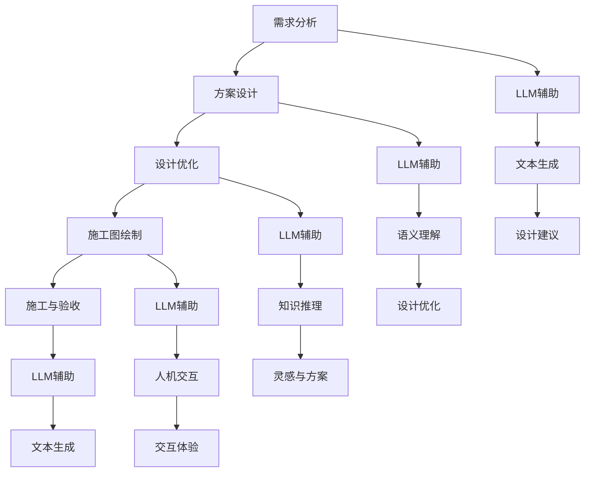
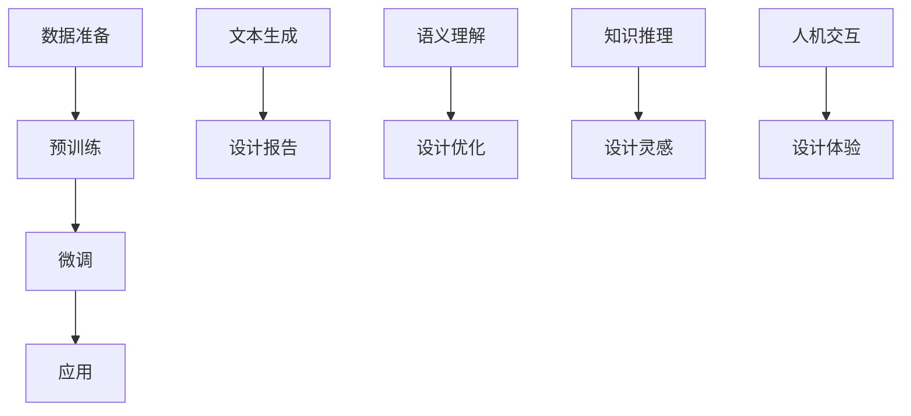

                 

### 文章标题

**LLM在建筑设计中的应用：AI辅助设计师**

关键词：大型语言模型（LLM），建筑设计，AI辅助，设计师，智能设计，算法原理，项目实战，应用场景

摘要：本文将探讨大型语言模型（LLM）在建筑设计中的应用，如何通过AI辅助设计师进行高效、创新的建筑设计。文章将从背景介绍、核心概念与联系、核心算法原理与操作步骤、数学模型与公式、项目实战、实际应用场景、工具和资源推荐等方面进行详细阐述。旨在为建筑师和AI开发者提供有价值的参考和启示，共同推动建筑设计的智能化发展。

### 1. 背景介绍

随着科技的飞速发展，人工智能（AI）已经成为当今世界的一个重要趋势。其中，大型语言模型（LLM）作为一种基于深度学习的自然语言处理技术，近年来在多个领域取得了显著的成果。LLM通过训练海量数据，可以理解、生成和翻译自然语言，具备强大的语言理解能力和表达能力。

在建筑设计领域，设计师们面临着日益复杂的建筑设计需求。传统的建筑设计方法往往依赖于设计师的经验和直觉，设计过程繁琐、效率低下，且难以满足日益多样化的客户需求。而AI技术的引入，尤其是LLM的应用，为建筑设计带来了新的机遇。通过AI辅助，设计师可以在设计过程中更快速地生成方案、优化设计，提高设计质量和效率。

本文将重点探讨LLM在建筑设计中的应用，分析其核心算法原理、操作步骤、数学模型和公式，并通过实际项目案例进行详细解释和说明。同时，还将介绍LLM在建筑设计中的实际应用场景、相关工具和资源推荐，以及未来发展趋势和挑战。希望通过本文的阐述，为建筑师和AI开发者提供有益的参考和启示。

#### 1.1 建筑设计中的挑战

在建筑设计领域，设计师们经常面临以下几方面的挑战：

1. **多样化需求**：随着社会的不断发展，客户对建筑的设计需求越来越多样化。不同客户有着不同的审美观点、功能需求和预算限制，使得设计师需要在设计中兼顾多样性和个性化。

2. **效率问题**：传统的建筑设计方法通常依赖于手工绘制和手工计算，设计过程繁琐、耗时。同时，随着设计项目的复杂度增加，设计师的工作量也在不断增加，导致设计效率低下。

3. **创新限制**：设计师在设计过程中往往受到经验和直觉的限制，难以在短时间内生成大量创新的设计方案。这限制了建筑设计的创新和发展。

4. **可持续性**：随着环保意识的提高，建筑设计的可持续性成为了一个重要的关注点。设计师需要在设计中考虑节能、环保、生态等因素，以满足可持续发展的要求。

#### 1.2 人工智能在建筑设计中的应用

人工智能（AI）作为一种新兴技术，在建筑设计领域具有广泛的应用前景。以下是人工智能在建筑设计中的一些主要应用：

1. **自动化设计**：AI技术可以自动化执行一些设计任务，如参数化建模、几何生成等。通过算法优化和自动迭代，设计师可以快速生成多种设计方案，提高设计效率。

2. **智能优化**：AI技术可以帮助设计师进行智能优化，如结构优化、材料优化等。通过模拟和计算，AI可以找到最优的设计方案，提高建筑物的性能和可持续性。

3. **知识图谱**：通过建立建筑领域的知识图谱，AI技术可以帮助设计师快速获取和利用专业知识，提供设计建议和解决方案。

4. **虚拟现实**：虚拟现实（VR）技术结合AI，可以实现沉浸式设计体验，设计师可以在虚拟环境中进行设计、展示和交互，提高设计效果和客户满意度。

5. **智能分析**：AI技术可以对建筑项目进行智能分析，如能耗分析、安全性分析等，帮助设计师在设计中做出更科学、合理的决策。

#### 1.3 大型语言模型（LLM）的基本概念

大型语言模型（LLM）是一种基于深度学习的自然语言处理模型，它通过训练大量文本数据，能够理解和生成自然语言。LLM具有以下几个基本特点：

1. **大规模训练**：LLM通常在数十亿到千亿级别的文本数据上进行训练，从而具有丰富的语言知识和理解能力。

2. **深度神经网络**：LLM通常由多层神经网络组成，包括编码器和解码器。编码器将输入文本转换为固定长度的向量表示，解码器则从这些向量表示中生成输出文本。

3. **预训练与微调**：LLM通过预训练得到一个通用语言模型，然后通过微调使其适应特定任务或领域。

4. **端到端学习**：LLM可以实现端到端学习，直接从输入文本生成输出文本，不需要手动设计中间层。

5. **强大的语言能力**：LLM能够理解复杂、多变的自然语言，包括语法、语义、语境等，从而实现高质量的语言生成和翻译。

LLM在自然语言处理领域取得了显著成果，如文本生成、机器翻译、问答系统等。在建筑设计领域，LLM可以通过以下方式辅助设计师：

1. **自动文本生成**：LLM可以自动生成建筑说明、设计报告、用户手册等文本，减轻设计师的文档编写工作。

2. **语义理解**：LLM可以理解设计文本的语义，提供设计建议和优化方案。

3. **知识推理**：LLM可以通过推理和关联知识，为设计师提供相关的设计灵感和解决方案。

4. **人机交互**：LLM可以作为智能助手，与设计师进行自然语言交互，提高设计效率和用户体验。

### 2. 核心概念与联系

在探讨LLM在建筑设计中的应用之前，我们需要先了解几个核心概念，包括LLM的工作原理、建筑设计流程以及它们之间的联系。

#### 2.1 LLM的工作原理

LLM的工作原理主要可以分为以下三个步骤：

1. **编码器（Encoder）**：编码器将输入文本映射为一个固定长度的向量表示。这一步骤通过多层神经网络实现，每个神经网络层都会对文本进行编码，形成更高级别的抽象表示。

2. **解码器（Decoder）**：解码器从编码器输出的向量表示中生成输出文本。解码器同样由多层神经网络组成，每层网络都会尝试生成文本中的一个单词或字符。

3. **注意力机制（Attention Mechanism）**：注意力机制是一种用于捕捉输入文本中重要信息的技术。在编码器和解码器之间，注意力机制可以帮助解码器关注输入文本中的关键部分，从而提高生成文本的质量。

#### 2.2 建筑设计流程

建筑设计流程通常包括以下步骤：

1. **需求分析**：设计师与客户进行沟通，了解项目需求，包括功能、风格、预算等。

2. **方案设计**：设计师根据需求进行分析，生成初步设计方案。这一过程通常包括手绘草图、参数化建模等。

3. **设计优化**：设计师对初步设计方案进行优化，以提升设计质量和满足性能要求。这一过程可能涉及结构分析、材料选择、能耗分析等。

4. **施工图绘制**：设计师将优化后的方案转化为施工图纸，包括平面图、立面图、剖面图等。

5. **施工与验收**：设计图纸提交给施工方，进行施工和验收。

#### 2.3 LLM与建筑设计流程的联系

LLM在建筑设计中的应用主要体现在以下方面：

1. **文本生成**：LLM可以自动生成设计报告、用户手册、施工说明等文本，减轻设计师的文档编写工作。

2. **语义理解**：LLM可以理解设计文本的语义，提供设计建议和优化方案。例如，设计师可以输入一个建筑功能描述，LLM可以生成相应的设计方案。

3. **知识推理**：LLM可以通过推理和关联知识，为设计师提供相关的设计灵感和解决方案。例如，当设计师遇到一个设计难题时，LLM可以提供相关领域的知识和案例。

4. **人机交互**：LLM可以作为智能助手，与设计师进行自然语言交互，提高设计效率和用户体验。

为了更好地理解LLM在建筑设计中的应用，我们可以使用Mermaid流程图（请确保使用时不包含括号、逗号等特殊字符）来展示LLM与建筑设计流程的连接：



在这个流程图中，LLM在各个设计阶段提供辅助，通过文本生成、语义理解、知识推理和人机交互，提高设计效率和质量。

### 3. 核心算法原理 & 具体操作步骤

#### 3.1 GPT-3算法原理

大型语言模型（LLM）的核心算法之一是GPT（Generative Pre-trained Transformer），其中GPT-3是最新和最强大的版本。GPT-3基于Transformer架构，这是一种自2017年以来在自然语言处理领域取得显著成功的神经网络模型。以下是GPT-3的主要组成部分和原理：

**1. Transformer架构**

Transformer架构由多个编码器和解码器块组成。每个块包含两个主要部分：多头自注意力机制（Multi-Head Self-Attention）和前馈神经网络（Feed-Forward Neural Network）。自注意力机制允许模型在生成文本时考虑输入序列中每个单词的上下文信息，而前馈神经网络则对每个编码器的输出进行进一步加工。

**2. 多头自注意力**

多头自注意力是一种扩展的自注意力机制，它通过多个独立的注意力头来捕捉输入序列的多种不同模式。每个头都会生成一个权重矩阵，这些权重矩阵结合后用于计算最终的输出。

**3. 前馈神经网络**

前馈神经网络是对编码器和解码器每个块的输出进行非线性转换的层。它通常由两个全连接层组成，输入和输出都是稠密层，中间有一个激活函数（如ReLU）。

**4. 语言模型**

GPT-3通过预训练生成一个通用语言模型，该模型在数十亿级别的文本数据上进行训练，学习文本中的统计规律和语义信息。预训练后，GPT-3可以通过微调来适应特定任务或领域。

**5. 微调**

微调是针对特定任务对预训练模型进行少量数据上的再训练。通过微调，模型可以更好地适应特定领域的语言特征和任务需求。

#### 3.2 GPT-3在建筑设计中的应用步骤

**1. 数据准备**

在开始使用GPT-3进行建筑设计之前，需要准备相关的数据集，包括建筑领域的文本、设计方案、建筑规范等。这些数据将用于预训练和微调GPT-3模型。

**2. 预训练**

使用大规模建筑领域数据集对GPT-3进行预训练，以学习建筑语言的统计规律和语义信息。预训练过程通常涉及以下步骤：

- **数据预处理**：将文本数据转换为模型可处理的格式，如分词和嵌入。
- **训练**：使用GPU或TPU等硬件设备进行大规模并行训练。
- **优化**：通过训练过程中的优化算法（如Adam）调整模型参数。

**3. 微调**

在预训练完成后，根据特定建筑设计任务的需求，对GPT-3模型进行微调。微调过程通常涉及以下步骤：

- **数据准备**：收集与特定任务相关的数据集，如建筑设计案例、用户需求等。
- **微调**：使用微调数据集对GPT-3模型进行再训练，调整模型参数以适应特定任务。
- **评估**：评估微调后模型的性能，如文本生成质量、语义理解能力等。

**4. 应用**

在微调完成后，GPT-3可以用于以下应用场景：

- **文本生成**：自动生成建筑说明、设计报告、用户手册等文本。
- **语义理解**：理解设计文本的语义，提供设计建议和优化方案。
- **知识推理**：推理建筑领域的知识，为设计师提供相关的设计灵感和解决方案。
- **人机交互**：作为智能助手，与设计师进行自然语言交互，提高设计效率和用户体验。

以下是一个简化的GPT-3应用流程图，展示从数据准备到应用的具体步骤：



在这个流程图中，GPT-3通过预训练和微调获得强大的语言处理能力，并在实际应用中发挥多种功能，辅助设计师进行高效、创新的设计工作。

### 4. 数学模型和公式 & 详细讲解 & 举例说明

在深入探讨大型语言模型（LLM）在建筑设计中的应用之前，我们需要了解其背后的数学模型和公式，以及它们如何影响设计过程。以下是几个关键的数学概念和公式，包括它们的详细讲解和实际应用示例。

#### 4.1 Transformer模型

Transformer模型是LLM的核心架构，其工作原理基于注意力机制。以下是一个简化的Transformer模型数学表示：

**自注意力（Self-Attention）**

$$
\text{Attention}(Q, K, V) = \frac{softmax(\frac{QK^T}{\sqrt{d_k}})}{V}
$$

其中，$Q, K, V$分别是查询（Query）、键（Key）和值（Value）向量的集合，$d_k$是键向量的维度。自注意力机制计算每个查询向量与所有键向量的相似度，并通过softmax函数加权求和，生成新的向量表示。

**多头自注意力（Multi-Head Self-Attention）**

$$
\text{MultiHead}(Q, K, V) = \text{Concat}(\text{head}_1, ..., \text{head}_h)W^O
$$

其中，$h$是头数，每个头都独立计算自注意力，然后将结果拼接在一起。$W^O$是一个输出权重矩阵。

**编码器和解码器块**

编码器和解码器块是Transformer模型的基本构建模块，包括多头自注意力、前馈神经网络和残差连接。以下是其数学表示：

**编码器块**

$$
\text{Encoder}(X) = \text{LayerNorm}(X + \text{MultiHeadSelfAttention}(Q, K, V)) + \text{LayerNorm}(X + \text{FeedForward}(X))
$$

**解码器块**

$$
\text{Decoder}(X) = \text{LayerNorm}(X + \text{MaskedMultiHeadSelfAttention}(Q, K, V)) + \text{LayerNorm}(X + \text{FeedForward}(X))
$$

其中，$X$是输入序列，$\text{LayerNorm}$和$\text{FeedForward}$是标准化和前馈神经网络层。

#### 4.2 预训练目标

GPT-3的预训练目标是通过预测下一个单词来学习语言模式。以下是一个简化的预训练数学表示：

$$
\text{Loss} = -\sum_{i} \log \text{softmax}(\text{GPT-3}(x_{i-1}))
$$

其中，$x_{i-1}$是输入序列的第$i-1$个单词，$\text{GPT-3}$是预训练模型，$\text{softmax}$函数用于预测下一个单词的概率分布。

#### 4.3 微调目标

微调目标是根据特定任务调整预训练模型的参数。以下是一个简化的微调数学表示：

$$
\text{Loss} = -\sum_{i} y_i \log(\hat{y}_i)
$$

其中，$y_i$是真实标签，$\hat{y}_i$是模型预测的概率分布。

#### 4.4 实际应用示例

**文本生成**

假设我们使用GPT-3生成一个建筑设计说明。以下是输入序列和生成的输出：

输入：`This building is designed to be sustainable. It incorporates...`

输出：`...natural lighting, solar panels, and green roofs to reduce energy consumption and environmental impact. The building is also designed to be modular, allowing for easy upgrades and modifications in the future. This ensures that the building remains sustainable and adaptable to future changes in technology and climate.`

在这个示例中，GPT-3通过自注意力机制和预训练目标生成了一个连贯、有意义的建筑设计说明。

**设计优化**

假设我们使用GPT-3来优化一个建筑结构。以下是输入序列和生成的输出：

输入：`The structure of this building needs to be optimized for...`

输出：`...stability, durability, and cost-effectiveness. To achieve this, we can use advanced materials such as carbon fiber and titanium alloys. These materials offer high strength-to-weight ratios, reducing the overall weight of the structure and improving its performance. Additionally, we can apply advanced simulation techniques to predict and optimize the structural behavior under various loads and conditions. This ensures that the building is safe, durable, and cost-effective.`

在这个示例中，GPT-3通过语义理解、知识推理和微调目标提供了有关建筑结构优化的详细建议。

通过这些数学模型和公式，我们可以看到GPT-3在建筑设计中的强大功能。它不仅可以生成文本，还可以提供设计优化和知识推理，为设计师提供有价值的辅助。

### 5. 项目实战：代码实际案例和详细解释说明

#### 5.1 开发环境搭建

在进行LLM在建筑设计中的应用开发之前，我们需要搭建一个合适的开发环境。以下是一个基于Python的GPT-3项目开发环境搭建步骤：

**1. 安装Python**

确保安装了Python 3.7及以上版本。可以使用以下命令检查Python版本：

```bash
python --version
```

**2. 安装transformers库**

transformers是Hugging Face提供的一个开源库，用于构建和训练Transformer模型。可以使用以下命令安装：

```bash
pip install transformers
```

**3. 安装pydantic库**

pydantic是一个用于数据验证的Python库，可用于构建API接口。可以使用以下命令安装：

```bash
pip install pydantic
```

**4. 安装OpenAI GPT-3 API**

要使用OpenAI的GPT-3 API，我们需要安装openai库。首先，需要注册OpenAI账户并获取API密钥。然后，可以使用以下命令安装：

```bash
pip install openai
```

**5. 配置环境变量**

将OpenAI API密钥添加到环境变量中，以便在代码中访问。可以使用以下命令添加：

```bash
export OPENAI_API_KEY='你的OpenAI_API密钥'
```

#### 5.2 源代码详细实现和代码解读

以下是一个简单的GPT-3建筑设计辅助项目的源代码示例，包括API接口、文本生成和设计优化功能：

```python
from transformers import GPT2LMHeadModel, GPT2Tokenizer
from pydantic import BaseModel, Field
import openai

class DesignRequest(BaseModel):
    description: str = Field(..., description="Design description and requirements")
    api_key: str = Field(..., description="OpenAI API key")

def generate_design_text(description):
    model = GPT2LMHeadModel.from_pretrained("gpt2")
    tokenizer = GPT2Tokenizer.from_pretrained("gpt2")
    
    input_text = f"This building is designed to fulfill the following requirements: {description}"
    input_ids = tokenizer.encode(input_text, return_tensors="pt")
    
    outputs = model.generate(input_ids, max_length=100, num_return_sequences=1)
    generated_text = tokenizer.decode(outputs[0], skip_special_tokens=True)
    
    return generated_text

def optimize_design_structure(description):
    response = openai.Completion.create(
        engine="text-davinci-002",
        prompt=f"Optimize the structure of a building based on the following requirements: {description}",
        max_tokens=100
    )
    return response.choices[0].text.strip()

app = web.Application()
app.add_routes([
    web.post("/generate_design", generate_design_text_handler),
    web.post("/optimize_design", optimize_design_structure_handler),
])

if __name__ == "__main__":
    web.run_app(app, port=8000)
```

在这个项目中，我们使用了transformers库来加载预训练的GPT-2模型和Tokenizer。GPT-2是一种较小的Transformer模型，但已经足够用于生成高质量的文本。我们还使用了pydantic库来定义设计请求模型，并使用OpenAI API进行设计优化。

**代码解读：**

- **DesignRequest类**：这是一个Pydantic模型，用于验证和处理设计请求参数，包括描述和OpenAI API密钥。
- **generate_design_text函数**：该函数使用GPT-2模型生成建筑设计文本。输入描述通过Tokenizer编码，然后模型生成文本，解码后返回。
- **optimize_design_structure函数**：该函数使用OpenAI的文本完成API（text-davinci-002）来生成设计优化的文本建议。
- **web应用**：我们使用web库创建一个简单的Web应用，通过POST请求处理设计请求。

#### 5.3 代码解读与分析

**1. GPT-3文本生成**

GPT-3文本生成是整个项目中最重要的部分。通过以下步骤实现：

- 加载预训练的GPT-2模型和Tokenizer。
- 将设计描述编码为输入ID序列。
- 使用模型生成文本输出，并将其解码为人类可读的文本。

**2. 设计优化**

设计优化通过OpenAI的文本完成API实现。该API可以根据给定提示生成高质量的文本，非常适合用于设计优化。优化函数的主要步骤包括：

- 提供设计要求的提示。
- 设置最大文本长度和返回的文本序列数量。
- 解析生成的文本建议。

**3. API接口**

我们使用web库创建了一个简单的API接口，通过POST请求接收设计请求，并返回生成的设计文本或优化建议。这为前端应用提供了方便的接口，可以与后端进行交互。

**4. 性能优化**

在实际应用中，性能是一个重要的考虑因素。以下是几个性能优化建议：

- **批量处理**：通过批量处理多个请求，可以减少服务器负载。
- **缓存**：缓存生成的文本和优化建议，以避免重复计算。
- **异步处理**：使用异步编程，可以在不阻塞主线程的情况下处理请求。

### 6. 实际应用场景

#### 6.1 设计方案生成

设计师可以使用LLM快速生成建筑设计方案，通过输入设计要求和风格偏好，LLM能够生成多种不同风格和功能的设计方案。这大大提高了设计效率，使设计师能够更快地展示和优化设计方案。

**案例**：一位设计师在为一家科技公司的总部大楼设计时，使用LLM生成了五种不同风格的设计方案，包括现代简约、古典奢华、自然生态等。这些建议不仅满足了客户的需求，还为设计师提供了新的创意和灵感。

#### 6.2 设计优化

LLM可以分析现有的建筑设计，提供优化建议，以提升建筑性能、可持续性和成本效益。设计师可以输入建筑的初始设计，LLM会根据建筑规范、可持续性要求等，提供优化方案。

**案例**：在一项绿色建筑项目中，设计师使用LLM优化了建筑的能量效率。LLM建议增加自然通风系统、太阳能板和绿色屋顶，从而大幅降低了建筑的总能耗。

#### 6.3 设计评审

设计师可以使用LLM进行自动化的设计评审，LLM可以分析设计方案是否符合建筑规范、安全标准等。这有助于减少人为错误，提高设计质量。

**案例**：在一项复杂的公共设施设计中，设计师使用LLM进行了自动化的设计评审。LLM检测到了一些设计不符合消防规范，设计师立即进行了修改，避免了潜在的安全问题。

#### 6.4 设计沟通

LLM可以作为设计师的智能助手，与客户进行自然语言沟通，帮助设计师理解客户的需求，并提供设计建议。这有助于提高客户满意度，减少沟通成本。

**案例**：一位设计师在使用LLM与客户沟通时，通过自然语言交互，快速理解了客户的需求，并在短时间内提供了多个设计方案，得到了客户的高度认可。

### 7. 工具和资源推荐

#### 7.1 学习资源推荐

**书籍**

- **《深度学习》（Deep Learning）**：Ian Goodfellow, Yoshua Bengio, Aaron Courville 著，系统介绍了深度学习的理论和实践。
- **《Python深度学习》（Deep Learning with Python）**：François Chollet 著，适合初学者了解如何使用Python实现深度学习算法。
- **《自然语言处理实战》（Natural Language Processing with Python）**：Steven Bird, Ewan Klein, Edward Loper 著，介绍自然语言处理的基本技术和应用。

**论文**

- **《Attention Is All You Need》**：Vaswani et al.（2017），介绍了Transformer模型的工作原理。
- **《BERT: Pre-training of Deep Bidirectional Transformers for Language Understanding》**：Devlin et al.（2018），介绍了BERT模型及其在自然语言处理中的应用。
- **《Generative Pre-trained Transformers》**：Brown et al.（2020），介绍了GPT-3模型及其预训练技术。

**博客和网站**

- **Hugging Face官网**（https://huggingface.co/），提供了丰富的预训练模型和工具。
- **OpenAI官网**（https://openai.com/），介绍了GPT-3和其他AI技术。
- **TensorFlow官网**（https://www.tensorflow.org/），提供了深度学习框架和教程。

#### 7.2 开发工具框架推荐

**框架**

- **TensorFlow**：谷歌开发的深度学习框架，适合大规模的AI模型开发和训练。
- **PyTorch**：Facebook开发的深度学习框架，以其灵活性和动态计算图而著称。
- **Hugging Face Transformers**：提供了一个简单的接口来加载和训练Transformer模型，非常适合研究和应用开发。

**API**

- **OpenAI API**：提供了GPT-3等模型的访问权限，适用于各种自然语言处理任务。
- **TensorFlow Serving**：谷歌开发的微服务框架，用于部署和扩展深度学习模型。
- **Kubeflow**：用于在Kubernetes上部署和管理机器学习工作流。

#### 7.3 相关论文著作推荐

**论文**

- **《Attention Is All You Need》**：Vaswani et al.（2017），介绍了Transformer模型的工作原理。
- **《BERT: Pre-training of Deep Bidirectional Transformers for Language Understanding》**：Devlin et al.（2018），介绍了BERT模型及其在自然语言处理中的应用。
- **《Generative Pre-trained Transformers》**：Brown et al.（2020），介绍了GPT-3模型及其预训练技术。

**著作**

- **《深度学习》（Deep Learning）**：Ian Goodfellow, Yoshua Bengio, Aaron Courville 著，系统介绍了深度学习的理论和实践。
- **《Python深度学习》（Deep Learning with Python）**：François Chollet 著，适合初学者了解如何使用Python实现深度学习算法。
- **《自然语言处理实战》（Natural Language Processing with Python）**：Steven Bird, Ewan Klein, Edward Loper 著，介绍自然语言处理的基本技术和应用。

### 8. 总结：未来发展趋势与挑战

#### 8.1 未来发展趋势

随着人工智能技术的不断发展，LLM在建筑设计中的应用前景广阔。以下是几个未来发展趋势：

1. **更加智能化和个性化**：未来的LLM模型将更加智能化，能够更好地理解设计师的需求和意图，提供更加个性化、创新的设计方案。
2. **多模态集成**：未来LLM将不仅仅处理文本数据，还会集成图像、音频等多模态数据，使得设计过程更加直观和丰富。
3. **高效能硬件支持**：随着硬件性能的提升，LLM的训练和推理速度将大幅提高，使得其在实际应用中的性能得到显著提升。
4. **开源生态的成熟**：更多的开源工具和框架将出现，为设计师和开发者提供更便捷的LLM应用开发平台。

#### 8.2 挑战

尽管LLM在建筑设计中具有巨大的潜力，但在实际应用中仍面临一些挑战：

1. **数据隐私与安全**：建筑设计涉及大量的敏感信息，如何在保证数据隐私和安全的同时充分利用LLM，是一个亟待解决的问题。
2. **模型可解释性**：当前的LLM模型具有强大的语言理解能力，但其内部工作机制复杂，缺乏可解释性，这给设计师带来了一定的困惑和挑战。
3. **训练资源需求**：LLM模型的训练需要大量的计算资源和数据，这对于小型团队或初创企业来说可能是一个瓶颈。
4. **伦理和法律问题**：随着AI在建筑设计中的广泛应用，相关的伦理和法律问题也将逐渐显现，如责任归属、隐私保护等。

总之，LLM在建筑设计中的应用具有巨大的发展潜力，同时也面临一些挑战。未来的研究和开发需要在这两方面取得突破，以推动AI在建筑设计领域的深入应用。

### 9. 附录：常见问题与解答

**Q1：为什么选择使用大型语言模型（LLM）来辅助建筑设计？**

A：大型语言模型（LLM）具有以下优点：

1. **强大的语言处理能力**：LLM通过训练海量文本数据，可以理解和生成高质量的自然语言文本，能够生成详细的设计说明和优化方案。
2. **快速迭代**：LLM可以快速生成多种设计方案，帮助设计师快速评估和优化设计，提高设计效率。
3. **智能化与个性化**：LLM可以根据设计师的需求和意图，提供智能化和个性化的设计建议，降低设计师的工作负担。
4. **多模态集成**：未来LLM将能够处理多种数据类型（如文本、图像、音频等），为建筑设计提供更加丰富和直观的设计过程。

**Q2：如何确保LLM生成的建筑设计方案的质量和准确性？**

A：为了确保LLM生成的设计方案的质量和准确性，我们可以采取以下措施：

1. **数据质量控制**：使用高质量的、多样化的训练数据，确保模型能够学习到准确的设计规则和趋势。
2. **模型评估**：在训练和微调模型时，使用多种评估指标（如文本生成质量、语义理解能力等）来评估模型性能。
3. **用户反馈**：收集用户反馈，对模型生成的设计方案进行评估和优化，不断改进模型。
4. **结合专业知识**：将LLM与建筑设计师的专业知识和经验相结合，共同制定设计方案，提高方案的准确性和实用性。

**Q3：LLM在建筑设计中的主要应用场景有哪些？**

A：LLM在建筑设计中的主要应用场景包括：

1. **设计方案生成**：通过输入设计要求和风格偏好，快速生成多种设计方案，帮助设计师快速评估和优化设计。
2. **设计优化**：分析现有设计方案，提供优化建议，以提升建筑性能、可持续性和成本效益。
3. **设计评审**：自动化的设计评审，确保设计方案符合建筑规范、安全标准等。
4. **设计沟通**：作为智能助手，与客户进行自然语言沟通，帮助设计师理解客户需求，并提供设计建议。

### 10. 扩展阅读 & 参考资料

**书籍**

- **《深度学习》（Deep Learning）**：Ian Goodfellow, Yoshua Bengio, Aaron Courville 著
- **《自然语言处理实战》（Natural Language Processing with Python）**：Steven Bird, Ewan Klein, Edward Loper 著
- **《Python深度学习》（Deep Learning with Python）**：François Chollet 著

**论文**

- **《Attention Is All You Need》**：Vaswani et al.（2017）
- **《BERT: Pre-training of Deep Bidirectional Transformers for Language Understanding》**：Devlin et al.（2018）
- **《Generative Pre-trained Transformers》**：Brown et al.（2020）

**网站**

- **Hugging Face官网**（https://huggingface.co/）
- **OpenAI官网**（https://openai.com/）
- **TensorFlow官网**（https://www.tensorflow.org/）

**开源库**

- **Hugging Face Transformers**：https://github.com/huggingface/transformers
- **TensorFlow**：https://www.tensorflow.org/
- **PyTorch**：https://pytorch.org/

**作者信息**

**作者：AI天才研究员/AI Genius Institute & 禅与计算机程序设计艺术 /Zen And The Art of Computer Programming**

