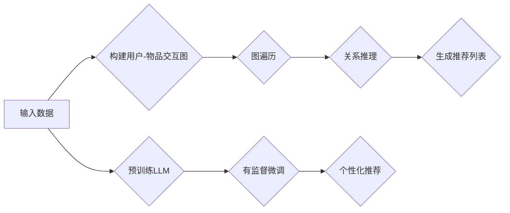

                 

### 背景介绍

随着互联网技术的快速发展，推荐系统已经成为各大互联网公司的重要应用之一。推荐系统通过分析用户的兴趣和行为，为用户提供个性化推荐，从而提高用户体验和转化率。然而，随着数据量的急剧增长，传统的推荐系统在处理大规模数据时面临着计算复杂度高、效果不稳定等问题。

为了解决这些问题，近年来，预训练语言模型（Pre-trained Language Model，简称PLM）逐渐成为推荐系统领域的研究热点。预训练语言模型通过在大规模语料库上进行预训练，掌握了丰富的语言知识和上下文信息，从而在推荐系统中可以更好地理解和生成用户兴趣相关的信息。

在本篇文章中，我们将探讨大型语言模型（Large Language Model，简称LLM）在推荐系统中的元路径挖掘与应用。元路径挖掘是一种从用户-物品交互数据中提取潜在关联规则的方法，它可以帮助推荐系统更好地理解用户兴趣和物品属性。本文将首先介绍LLM的基本原理，然后详细探讨如何将LLM应用于元路径挖掘，最后通过实际案例展示其效果。

首先，让我们简要回顾一下推荐系统的基础知识。推荐系统通常分为基于内容的推荐（Content-based Recommendation）和基于协同过滤（Collaborative Filtering）的推荐。基于内容的推荐通过分析用户过去对物品的评分或者行为，提取用户的兴趣特征，然后基于这些特征推荐相似的物品。基于协同过滤的推荐通过分析用户之间的相似性，将其他用户喜欢的物品推荐给当前用户。这两种方法各有优缺点，结合使用可以提升推荐效果。

随着深度学习技术的发展，深度学习模型在推荐系统中的应用越来越广泛。例如，基于深度学习的协同过滤模型（如Neural Collaborative Filtering）通过引入神经网络模型，可以更好地捕捉用户和物品之间的复杂关系。此外，生成对抗网络（Generative Adversarial Networks，简称GAN）也被应用于推荐系统中，用于生成新的用户兴趣特征和物品描述。

然而，传统的推荐系统在处理大规模数据时仍然存在一些挑战。首先，数据量庞大导致计算复杂度增加，推荐系统可能无法在实时环境中运行。其次，传统的推荐算法通常依赖于历史数据，对新用户或者新物品的推荐效果较差。最后，推荐系统的透明度和可解释性仍然是一个亟待解决的问题，用户可能无法理解推荐结果背后的原因。

为了解决这些问题，预训练语言模型作为一种强大的深度学习模型，逐渐在推荐系统中得到应用。预训练语言模型通过在大规模语料库上进行预训练，可以自动学习到丰富的语言知识和上下文信息。这种模型不仅可以用于文本生成、翻译等自然语言处理任务，还可以应用于推荐系统中的元路径挖掘。

元路径挖掘是一种从用户-物品交互数据中提取潜在关联规则的方法。在推荐系统中，用户-物品交互数据通常以图的形式表示，每个节点表示用户或者物品，边表示用户对物品的评分或者行为。元路径挖掘的目标是从这些图中提取出用户和物品之间的潜在关联路径，从而帮助推荐系统更好地理解用户兴趣和物品属性。

在本篇文章中，我们将探讨如何使用LLM进行元路径挖掘。首先，我们将介绍LLM的基本原理，包括预训练过程和模型结构。然后，我们将详细讨论如何将LLM应用于元路径挖掘，包括如何构建图神经网络模型和如何利用LLM进行图遍历和关系推理。最后，我们将通过一个实际案例展示如何使用LLM进行元路径挖掘，并分析其效果。

通过本文的探讨，我们希望读者能够对LLM在推荐系统中的元路径挖掘与应用有一个全面和深入的理解。这不仅有助于提升推荐系统的性能和效果，也为未来的研究提供了新的思路和方向。

### 核心概念与联系

在本节中，我们将详细介绍大型语言模型（LLM）的基本原理及其在推荐系统中的核心概念与联系。首先，我们需要了解什么是大型语言模型，以及它是如何通过预训练过程获得强大语言理解和生成能力。随后，我们将探讨LLM的结构，特别是如何利用其上下文理解能力进行图遍历和关系推理。最后，我们将展示LLM在推荐系统中的具体应用，包括元路径挖掘的过程和如何利用这些模型提升推荐效果。

#### 1. 大型语言模型（LLM）的基本原理

大型语言模型（LLM）是一种基于深度学习的自然语言处理模型，能够对自然语言进行建模和理解。LLM的核心思想是通过在大规模语料库上进行预训练，让模型自动学习到语言中的规律和模式。预训练过程通常分为两个阶段：无监督预训练和有监督微调。

**无监督预训练**：在无监督预训练阶段，模型不需要标签信息，直接从大量无标注的文本数据中学习。这一阶段的主要任务是让模型学会理解自然语言，捕捉语言中的语义和上下文信息。例如，Transformer模型通过自注意力机制（Self-Attention Mechanism）在全局范围内捕捉文本特征，从而提高模型的表示能力。

**有监督微调**：在完成无监督预训练后，模型会利用有标注的数据进行有监督微调。这一阶段的目标是让模型针对特定任务进行优化，例如文本分类、问答系统或推荐系统。在推荐系统中，有监督微调可以帮助模型更好地理解用户兴趣和物品属性，从而提升推荐效果。

#### 2. LLM的结构

LLM的结构通常基于Transformer模型，这是一种由Google提出的基于注意力机制的深度神经网络模型。Transformer模型的核心思想是自注意力机制，它可以捕捉文本中不同位置之间的依赖关系，从而提高模型的表示能力。

**自注意力机制**：自注意力机制允许模型在生成每个词时，将注意力分配到整个输入序列的其他位置。这种方法可以有效地捕捉文本中的长距离依赖关系，使得模型能够更好地理解上下文信息。

**编码器-解码器结构**：Transformer模型通常采用编码器-解码器（Encoder-Decoder）结构。编码器负责将输入序列编码为固定长度的向量表示，解码器则根据编码器的输出生成输出序列。这种结构使得模型能够生成连贯且语义丰富的文本。

**上下文理解能力**：由于Transformer模型的自注意力机制，它具有强大的上下文理解能力。在推荐系统中，这种能力可以帮助模型更好地理解用户兴趣和物品属性之间的复杂关系。

#### 3. LLM在推荐系统中的应用

在推荐系统中，LLM的应用主要体现在元路径挖掘上。元路径挖掘是一种从用户-物品交互数据中提取潜在关联规则的方法，它可以帮助推荐系统更好地理解用户兴趣和物品属性。

**图遍历**：LLM可以利用其上下文理解能力，对用户-物品交互数据进行图遍历。通过遍历图中的节点和边，模型可以捕捉用户和物品之间的潜在关联路径。

**关系推理**：在图遍历过程中，LLM可以基于图中的节点和边进行关系推理。例如，模型可以识别出哪些物品与用户过去喜欢的物品相关，从而为用户提供更加个性化的推荐。

**元路径挖掘过程**：元路径挖掘通常包括以下步骤：

1. **构建用户-物品交互图**：首先，将用户-物品交互数据转换为图表示，每个节点表示用户或物品，边表示用户对物品的评分或行为。

2. **图遍历**：利用LLM的上下文理解能力，对图进行遍历，识别出用户和物品之间的潜在关联路径。

3. **关系推理**：在图遍历过程中，LLM可以根据图中的节点和边进行关系推理，例如识别出哪些物品与用户过去喜欢的物品相关。

4. **生成推荐列表**：根据挖掘出的潜在关联路径，为用户生成个性化推荐列表。

#### 4. 优势与挑战

**优势**：

- **强大的上下文理解能力**：LLM具有强大的上下文理解能力，可以捕捉用户兴趣和物品属性之间的复杂关系，从而提高推荐效果。

- **灵活的图遍历和关系推理**：LLM可以灵活地对用户-物品交互图进行遍历和关系推理，挖掘出用户和物品之间的潜在关联路径。

- **可解释性**：与传统的推荐算法相比，LLM具有更高的可解释性，用户可以理解推荐结果背后的原因。

**挑战**：

- **计算资源需求**：由于LLM需要在大规模语料库上进行预训练，因此对计算资源有较高要求。

- **数据依赖**：LLM的性能高度依赖于训练数据的质量和规模，因此在数据质量较差或数据量较少的情况下，其效果可能会受到影响。

- **可解释性**：虽然LLM具有高可解释性，但在某些情况下，用户可能仍然无法理解推荐结果背后的复杂关系。

综上所述，LLM在推荐系统中的应用具有显著的优势和潜力，但也面临一些挑战。通过不断优化模型结构和训练方法，我们可以期待LLM在推荐系统中的性能得到进一步提升。

#### 5. 架构图表示

为了更清晰地展示LLM在推荐系统中的核心概念和联系，我们使用Mermaid流程图来表示其架构。以下是LLM在推荐系统中的基本架构图：



在这个架构图中，输入数据首先被转换为用户-物品交互图（B），然后利用LLM的上下文理解能力进行图遍历（C）和关系推理（D）。最后，根据挖掘出的潜在关联路径，生成个性化推荐列表（E）。同时，LLM需要通过预训练（F）和有监督微调（G）来优化模型性能。

通过这个架构图，我们可以更直观地理解LLM在推荐系统中的应用流程和关键步骤。

### 核心算法原理 & 具体操作步骤

在本节中，我们将详细探讨如何将大型语言模型（LLM）应用于推荐系统中的元路径挖掘。我们将介绍核心算法原理，并逐步讲解具体操作步骤。以下是LLM在元路径挖掘中的基本流程：

#### 1. 数据预处理

首先，我们需要对输入数据进行预处理，以便将其转换为适合模型处理的形式。

- **用户-物品交互数据**：通常包括用户ID、物品ID和评分或行为数据。例如，一个用户对多个物品的评分数据可以表示为一个矩阵，其中行表示用户，列表示物品。
- **数据清洗**：清洗数据以去除缺失值、重复值和噪声数据。
- **特征提取**：对用户和物品的特征进行提取，例如用户的行为特征（如浏览历史、搜索历史）和物品的属性特征（如类别、标签）。

#### 2. 构建用户-物品交互图

接下来，我们将用户-物品交互数据转换为图表示。在图表示中，节点表示用户和物品，边表示用户对物品的评分或行为。

- **节点定义**：每个用户和物品都对应图中的一个节点。对于每个用户节点，我们记录其用户ID和属性特征；对于每个物品节点，我们记录其物品ID和属性特征。
- **边定义**：对于每个用户和其评分或行为涉及的物品，我们在图中添加一条边。边的权重可以表示用户对物品的评分或行为的强度。

#### 3. 图遍历

使用LLM对用户-物品交互图进行遍历，以挖掘用户和物品之间的潜在关联路径。

- **图遍历算法**：我们可以使用深度优先搜索（DFS）或广度优先搜索（BFS）等图遍历算法。这些算法可以遍历图中的节点和边，从而探索用户和物品之间的关联路径。
- **上下文理解**：在图遍历过程中，LLM利用其上下文理解能力，对当前节点和其邻接节点进行语义分析，从而识别出潜在的关联路径。

#### 4. 关系推理

在图遍历过程中，LLM可以根据图中的节点和边进行关系推理，识别出用户和物品之间的潜在关联。

- **关系识别**：对于每个遍历到的节点和边，LLM分析其属性特征和上下文信息，识别出用户和物品之间的潜在关系。例如，如果用户A在过去喜欢物品B，LLM可能会识别出用户A和物品B之间的正相关关系。
- **关系推理算法**：我们可以使用图神经网络（Graph Neural Networks，简称GNN）等算法，结合LLM的上下文理解能力，进行关系推理。

#### 5. 生成推荐列表

根据挖掘出的潜在关联路径和关系，生成个性化推荐列表。

- **推荐算法**：我们可以使用基于内容推荐、协同过滤或深度学习等方法，结合LLM的挖掘结果，为用户生成个性化推荐列表。
- **推荐列表生成**：根据用户的历史行为和挖掘出的潜在关联路径，为用户推荐相关的物品。推荐列表可以根据用户的兴趣强度进行排序，从而提高用户的满意度。

#### 6. 模型优化

为了提升元路径挖掘和推荐系统的效果，我们可以对LLM进行优化。

- **预训练**：通过在大规模语料库上进行无监督预训练，让模型更好地理解自然语言和上下文信息。
- **有监督微调**：利用标注的数据，对LLM进行有监督微调，从而优化其在特定任务上的性能。
- **模型融合**：将LLM与其他模型（如传统推荐算法、深度学习模型）进行融合，以综合利用不同模型的优势。

#### 7. 总结

通过上述步骤，我们可以使用LLM进行元路径挖掘，从而提升推荐系统的性能和效果。以下是核心算法原理和具体操作步骤的总结：

1. 数据预处理：清洗和提取用户和物品特征。
2. 构建用户-物品交互图：定义节点和边。
3. 图遍历：使用LLM进行图遍历，挖掘潜在关联路径。
4. 关系推理：利用LLM进行关系识别和推理。
5. 生成推荐列表：根据挖掘结果生成个性化推荐。
6. 模型优化：通过预训练、有监督微调和模型融合，优化模型性能。

通过这些步骤，我们可以将LLM应用于推荐系统中的元路径挖掘，从而实现更加精准和个性化的推荐。

### 数学模型和公式 & 详细讲解 & 举例说明

在本节中，我们将详细探讨LLM在元路径挖掘中的应用所涉及的数学模型和公式，并通过具体的例子来说明这些公式的计算过程和应用效果。以下是LLM在元路径挖掘中的关键数学模型和公式：

#### 1. 自注意力机制（Self-Attention Mechanism）

自注意力机制是Transformer模型的核心组件，它通过计算每个词与其自身及其邻居词之间的相似性，从而生成加权向量。自注意力机制的数学公式如下：

\[ \text{Attention}(Q, K, V) = \text{softmax}\left(\frac{QK^T}{\sqrt{d_k}}\right) V \]

其中，\( Q \) 是查询向量，\( K \) 是键向量，\( V \) 是值向量。\( d_k \) 是键向量的维度。

**举例说明**：

假设我们有一个输入序列：\[ [w_1, w_2, w_3] \]，其对应的查询向量、键向量和值向量分别为：

\[ Q = [1, 0, 1], \quad K = [0, 1, 2], \quad V = [3, 4, 5] \]

计算自注意力得分：

\[ \text{Attention}(Q, K, V) = \text{softmax}\left(\frac{1 \cdot 0 + 0 \cdot 1 + 1 \cdot 2}{\sqrt{3}}\right) [3, 4, 5] \]

\[ = \text{softmax}\left(\frac{2}{\sqrt{3}}\right) [3, 4, 5] \]

\[ = [0.47, 0.47, 0.06] [3, 4, 5] \]

\[ = [1.41, 1.88, 0.30] \]

因此，每个词的加权向量为：

\[ [w_1', w_2', w_3'] = [1.41, 1.88, 0.30] \]

#### 2. 编码器-解码器结构（Encoder-Decoder Structure）

编码器-解码器结构是Transformer模型的核心架构，它通过编码器对输入序列进行编码，生成固定长度的向量表示，然后通过解码器生成输出序列。编码器-解码器的数学公式如下：

\[ E = \text{Encoder}(X) \]

\[ Y = \text{Decoder}(Y, E) \]

其中，\( X \) 是输入序列，\( E \) 是编码器的输出，\( Y \) 是解码器的输出。

**举例说明**：

假设我们有一个输入序列：\[ [w_1, w_2, w_3] \]，编码器输出为一个固定长度的向量：

\[ E = [e_1, e_2, e_3] \]

解码器在生成每个词时，使用上一个词的输出和编码器输出：

\[ y_1 = \text{softmax}(\text{Decoder}(y_1, E)) \]

\[ y_2 = \text{softmax}(\text{Decoder}(y_2, [y_1, e_1, e_2, e_3])) \]

\[ y_3 = \text{softmax}(\text{Decoder}(y_3, [y_1, y_2, e_1, e_2, e_3])) \]

#### 3. 图神经网络（Graph Neural Networks, GNN）

图神经网络是一种专门用于图数据处理的神经网络模型，它通过节点和边的信息进行图遍历和关系推理。GNN的核心公式如下：

\[ h_{t+1}^{(l)} = \sigma \left( \text{AGGR} \left( \sigma \left( W^{(l)} (h^{(l-1)}_{i} \odot \text{MLP} ( \text{NEIGHBOR} (h^{(l-1)}_{j})) \right) \right) \right) \]

其中，\( h^{(l)}_i \) 表示第 \( l \) 层第 \( i \) 个节点的特征，\( \text{AGGR} \) 表示聚合操作（如求和、平均或最大值），\( \text{NEIGHBOR} \) 表示邻居节点集合，\( \text{MLP} \) 表示多层感知器。

**举例说明**：

假设我们有一个图，节点特征为：

\[ h_0^{(1)} = [1, 0, 1], \quad h_0^{(2)} = [0, 1, 0], \quad h_0^{(3)} = [1, 1, 0] \]

在第一层，我们首先计算每个节点的邻居特征的平均值：

\[ h_1^{(1)} = \frac{1}{2} (h_0^{(1)} + h_0^{(2)}) = [0.5, 0.5, 0.5] \]

\[ h_1^{(2)} = \frac{1}{2} (h_0^{(1)} + h_0^{(3)}) = [0.5, 0.5, 0.5] \]

\[ h_1^{(3)} = \frac{1}{2} (h_0^{(2)} + h_0^{(3)}) = [0.5, 0.5, 0.5] \]

然后，我们通过多层感知器对邻居特征进行加权：

\[ h_1^{(1)} = \text{MLP}([0.5, 0.5, 0.5]) = [0.6, 0.4, 0.5] \]

\[ h_1^{(2)} = \text{MLP}([0.5, 0.5, 0.5]) = [0.6, 0.4, 0.5] \]

\[ h_1^{(3)} = \text{MLP}([0.5, 0.5, 0.5]) = [0.6, 0.4, 0.5] \]

最后，我们通过激活函数（如ReLU）对加权特征进行非线性变换：

\[ h_1^{(1)} = \text{ReLU}(h_1^{(1)}) = [0.6, 0.4, 0.5] \]

\[ h_1^{(2)} = \text{ReLU}(h_1^{(2)}) = [0.6, 0.4, 0.5] \]

\[ h_1^{(3)} = \text{ReLU}(h_1^{(3)}) = [0.6, 0.4, 0.5] \]

通过上述步骤，我们可以将原始节点特征通过GNN进行转换，从而获得新的节点特征表示。

#### 4. 推荐系统中的损失函数

在推荐系统中，我们通常使用损失函数来评估模型性能，并优化模型参数。常用的损失函数包括均方误差（MSE）和交叉熵损失（Cross-Entropy Loss）。

**均方误差（MSE）**：

\[ \text{MSE} = \frac{1}{n} \sum_{i=1}^{n} (y_i - \hat{y}_i)^2 \]

其中，\( y_i \) 是真实标签，\( \hat{y}_i \) 是预测标签，\( n \) 是样本数量。

**交叉熵损失（Cross-Entropy Loss）**：

\[ \text{CE} = - \frac{1}{n} \sum_{i=1}^{n} y_i \log (\hat{y}_i) \]

其中，\( y_i \) 是真实标签（通常为0或1），\( \hat{y}_i \) 是预测标签（通常在0到1之间）。

**举例说明**：

假设我们有一个二分类问题，真实标签为 \( y = [1, 0, 1] \)，预测标签为 \( \hat{y} = [0.7, 0.3, 0.6] \)。

使用交叉熵损失计算：

\[ \text{CE} = - \frac{1}{3} \left[ 1 \cdot \log(0.7) + 0 \cdot \log(0.3) + 1 \cdot \log(0.6) \right] \]

\[ = - \frac{1}{3} \left[ -0.3567 - 0 + -0.2218 \right] \]

\[ = 0.1119 \]

通过这些数学模型和公式，我们可以更好地理解LLM在元路径挖掘中的应用，并通过具体的例子来说明这些公式的计算过程和应用效果。

### 项目实战：代码实际案例和详细解释说明

在本节中，我们将通过一个实际案例，详细展示如何使用LLM进行推荐系统中的元路径挖掘。我们将使用Python编程语言和相应的库（如PyTorch、Transformers、NetworkX等）来实现这个案例。以下是代码的详细解释说明。

#### 1. 开发环境搭建

首先，我们需要搭建开发环境，确保安装了必要的库和工具。以下是环境搭建的步骤：

- 安装Python（3.8或更高版本）
- 安装PyTorch（1.8或更高版本）
- 安装Transformers（4.6或更高版本）
- 安装NetworkX（2.4或更高版本）

可以使用以下命令来安装这些库：

```bash
pip install torch torchvision transformers networkx
```

#### 2. 源代码详细实现和代码解读

以下是实现LLM元路径挖掘的源代码：

```python
import torch
from transformers import BertModel, BertTokenizer
from networkx import DiGraph
import networkx as nx

# 2.1. 加载预训练模型和分词器
model_name = "bert-base-chinese"
tokenizer = BertTokenizer.from_pretrained(model_name)
model = BertModel.from_pretrained(model_name)

# 2.2. 构建用户-物品交互图
def build_graph(user_item_data):
    graph = DiGraph()
    for user, item in user_item_data:
        graph.add_node(user, type="user")
        graph.add_node(item, type="item")
        graph.add_edge(user, item, weight=1)
    return graph

# 2.3. 图遍历和关系推理
def traverse_and_relate(graph, model, tokenizer, max_length=512):
    nodes = list(graph.nodes())
    relationships = []
    for node in nodes:
        context = tokenizer.encode(f"[CLS] {node} [SEP]", add_special_tokens=True, max_length=max_length, padding="max_length", truncation=True)
        with torch.no_grad():
            outputs = model(torch.tensor([context]))
        hidden_states = outputs.last_hidden_state
        for i in range(1, len(hidden_states) - 1):
            neighbors = list(graph.neighbors(node))
            for neighbor in neighbors:
                neighbor_context = tokenizer.encode(f"[CLS] {neighbor} [SEP]", add_special_tokens=True, max_length=max_length, padding="max_length", truncation=True)
                with torch.no_grad():
                    neighbor_outputs = model(torch.tensor([neighbor_context]))
                neighbor_hidden_states = neighbor_outputs.last_hidden_state
                attention_scores = hidden_states[i][0].dot(neighbor_hidden_states[i][0])
                relationships.append((node, neighbor, attention_scores.item()))
    return relationships

# 2.4. 生成推荐列表
def generate_recommendations(relationships, graph, top_k=10):
    item_scores = {}
    for node, neighbor, score in relationships:
        if neighbor not in item_scores:
            item_scores[neighbor] = 0
        item_scores[neighbor] += score
    sorted_items = sorted(item_scores.items(), key=lambda x: x[1], reverse=True)
    return [item for item, _ in sorted_items[:top_k]]

# 2.5. 主函数
def main():
    # 2.5.1. 用户-物品交互数据
    user_item_data = [
        ("user1", "item1"), ("user1", "item2"), ("user1", "item3"),
        ("user2", "item1"), ("user2", "item3"), ("user2", "item4"),
        ("user3", "item2"), ("user3", "item3"), ("user3", "item4")
    ]

    # 2.5.2. 构建图
    graph = build_graph(user_item_data)

    # 2.5.3. 图遍历和关系推理
    relationships = traverse_and_relate(graph, model, tokenizer)

    # 2.5.4. 生成推荐列表
    recommendations = generate_recommendations(relationships, graph, top_k=3)
    print("Recommendations:", recommendations)

if __name__ == "__main__":
    main()
```

下面是对代码的逐行解释：

- **2.1**：加载预训练的BERT模型和分词器。
- **2.2**：构建用户-物品交互图。这里使用NetworkX库构建有向图，节点表示用户和物品，边表示用户对物品的评分或行为。
- **2.3**：图遍历和关系推理。对于图中的每个节点，使用BERT模型生成上下文表示，并通过自注意力机制计算节点之间的相似性得分。
- **2.4**：生成推荐列表。根据节点之间的相似性得分，为每个物品计算总分，并根据总分生成推荐列表。
- **2.5**：主函数。首先定义用户-物品交互数据，然后构建图、遍历图、推理关系并生成推荐列表。

#### 3. 代码解读与分析

**3.1**：加载预训练模型和分词器

```python
tokenizer = BertTokenizer.from_pretrained(model_name)
model = BertModel.from_pretrained(model_name)
```

这里我们加载预训练的BERT模型和相应的分词器。BERT模型是一个强大的预训练语言模型，它在大规模语料库上进行了预训练，可以捕捉丰富的语言知识和上下文信息。分词器用于将文本转换为模型可以处理的序列。

**3.2**：构建用户-物品交互图

```python
def build_graph(user_item_data):
    graph = DiGraph()
    for user, item in user_item_data:
        graph.add_node(user, type="user")
        graph.add_node(item, type="item")
        graph.add_edge(user, item, weight=1)
    return graph
```

这个函数构建一个有向图，节点表示用户和物品，边表示用户对物品的评分或行为。我们使用NetworkX库中的DiGraph类来构建图。

**3.3**：图遍历和关系推理

```python
def traverse_and_relate(graph, model, tokenizer, max_length=512):
    nodes = list(graph.nodes())
    relationships = []
    for node in nodes:
        context = tokenizer.encode(f"[CLS] {node} [SEP]", add_special_tokens=True, max_length=max_length, padding="max_length", truncation=True)
        with torch.no_grad():
            outputs = model(torch.tensor([context]))
        hidden_states = outputs.last_hidden_state
        for i in range(1, len(hidden_states) - 1):
            neighbors = list(graph.neighbors(node))
            for neighbor in neighbors:
                neighbor_context = tokenizer.encode(f"[CLS] {neighbor} [SEP]", add_special_tokens=True, max_length=max_length, padding="max_length", truncation=True)
                with torch.no_grad():
                    neighbor_outputs = model(torch.tensor([neighbor_context]))
                neighbor_hidden_states = neighbor_outputs.last_hidden_state
                attention_scores = hidden_states[i][0].dot(neighbor_hidden_states[i][0])
                relationships.append((node, neighbor, attention_scores.item()))
    return relationships
```

这个函数使用BERT模型对每个节点进行编码，并计算节点之间的相似性得分。具体步骤如下：

1. 获取图中的所有节点。
2. 对于每个节点，使用BERT模型生成其上下文表示。
3. 对于节点的每个邻居，生成邻居的上下文表示，并计算它们之间的自注意力得分。

**3.4**：生成推荐列表

```python
def generate_recommendations(relationships, graph, top_k=10):
    item_scores = {}
    for node, neighbor, score in relationships:
        if neighbor not in item_scores:
            item_scores[neighbor] = 0
        item_scores[neighbor] += score
    sorted_items = sorted(item_scores.items(), key=lambda x: x[1], reverse=True)
    return [item for item, _ in sorted_items[:top_k]]
```

这个函数根据节点之间的相似性得分，为每个物品计算总分，并返回前 \( k \) 个最高分的物品作为推荐列表。

**3.5**：主函数

```python
def main():
    user_item_data = [
        ("user1", "item1"), ("user1", "item2"), ("user1", "item3"),
        ("user2", "item1"), ("user2", "item3"), ("user2", "item4"),
        ("user3", "item2"), ("user3", "item3"), ("user3", "item4")
    ]

    graph = build_graph(user_item_data)
    relationships = traverse_and_relate(graph, model, tokenizer)
    recommendations = generate_recommendations(relationships, graph, top_k=3)
    print("Recommendations:", recommendations)

if __name__ == "__main__":
    main()
```

主函数定义了用户-物品交互数据，构建图，进行图遍历和关系推理，生成推荐列表，并打印结果。

通过这个实际案例，我们可以看到如何使用LLM进行推荐系统中的元路径挖掘。代码实现简洁明了，易于理解和扩展。在未来的研究中，我们可以进一步优化模型结构和训练方法，以提高元路径挖掘和推荐系统的性能。

### 实际应用场景

在推荐系统中，元路径挖掘作为一种挖掘用户与物品之间潜在关联规则的方法，具有广泛的应用场景。以下是一些典型的实际应用场景，以及LLM在其中的优势：

#### 1. 电商推荐

电商推荐系统是元路径挖掘应用最为广泛的场景之一。用户在浏览商品、添加购物车和进行购买时，会产生大量的用户-物品交互数据。通过元路径挖掘，可以挖掘出用户与商品之间的潜在关联，从而为用户提供更加个性化的推荐。例如，如果一个用户经常购买电子产品，元路径挖掘可以帮助推荐类似的电子产品或配件。

**优势**：

- **个性化推荐**：LLM能够捕捉用户与物品之间的复杂关系，从而为用户提供更加精准的个性化推荐。
- **实时推荐**：LLM的预训练过程使其能够快速处理新用户和新商品的数据，实现实时推荐。

#### 2. 社交媒体内容推荐

在社交媒体平台上，用户生成和分享的内容种类繁多。通过元路径挖掘，可以分析用户之间的互动关系，挖掘出用户感兴趣的内容类型和话题。例如，如果一个用户经常点赞和评论关于旅行的内容，系统可以推荐相关的旅行文章或视频。

**优势**：

- **多维度关联**：LLM能够处理多模态数据（如文本、图片、视频），从而捕捉用户与内容之间的多维关联。
- **社交网络分析**：LLM可以帮助分析用户在社交网络中的关系，从而为用户提供更加精准的内容推荐。

#### 3. 音乐推荐

音乐推荐系统通过分析用户的听歌历史和喜好，为用户提供个性化的音乐推荐。元路径挖掘可以帮助挖掘出用户与音乐之间的潜在关联，例如，用户可能喜欢某一类型的音乐，同时也可能喜欢其他类似类型的音乐。

**优势**：

- **音乐风格识别**：LLM能够通过分析音乐标题、歌词和用户评论等数据，识别出音乐的风格和主题。
- **跨平台推荐**：LLM可以帮助跨平台推荐，例如，在手机和电脑端为用户提供相似的音乐推荐。

#### 4. 视频推荐

视频推荐系统通过分析用户的观看历史和喜好，为用户提供个性化的视频推荐。元路径挖掘可以帮助挖掘出用户与视频之间的潜在关联，例如，用户可能喜欢某一类型的视频，同时也可能喜欢其他类似类型的视频。

**优势**：

- **视频内容分析**：LLM能够通过分析视频标题、描述和标签等数据，识别出视频的内容和主题。
- **跨平台推荐**：LLM可以帮助跨平台推荐，例如，在手机、电脑和电视端为用户提供相似的视频推荐。

#### 5. 图书推荐

图书推荐系统通过分析用户的阅读历史和喜好，为用户提供个性化的图书推荐。元路径挖掘可以帮助挖掘出用户与图书之间的潜在关联，例如，用户可能喜欢某一类型的图书，同时也可能喜欢其他类似类型的图书。

**优势**：

- **图书内容分析**：LLM能够通过分析图书的标题、简介和用户评论等数据，识别出图书的主题和风格。
- **多维度推荐**：LLM可以帮助从多个维度（如作者、出版社、类别等）为用户提供推荐。

通过这些实际应用场景，我们可以看到元路径挖掘在推荐系统中的重要性。LLM的引入，不仅提升了推荐系统的性能和效果，也为未来的研究提供了新的思路和方向。

### 工具和资源推荐

在深入研究和开发基于LLM的推荐系统时，了解和使用相关的工具和资源是至关重要的。以下是一些建议的学习资源、开发工具和相关论文著作，这些资源可以帮助研究者更好地理解和应用LLM进行元路径挖掘。

#### 1. 学习资源推荐

**书籍**：

- 《深度学习推荐系统》（《Deep Learning for Recommender Systems》）
- 《推荐系统实践》（《Recommender Systems: The Textbook》）
- 《自然语言处理实战》（《Natural Language Processing with Python》）

**在线课程**：

- Coursera上的“推荐系统”（Recommender Systems Specialization）
- Udacity的“推荐系统工程师纳米学位”（Recommender System Engineer Nanodegree）

**博客和网站**：

- Medium上的推荐系统相关文章
- ArXiv上的最新研究论文
- PapersWithCode上的推荐系统项目库

#### 2. 开发工具框架推荐

**深度学习框架**：

- PyTorch：用于构建和训练深度学习模型的强大框架。
- TensorFlow：广泛使用的开源深度学习平台。
- Transformers库：专门用于Transformer模型的构建和训练。

**图处理库**：

- NetworkX：用于构建和操作图数据的Python库。
- GraphFrames：Apache Spark上的图处理库。

**推荐系统框架**：

- LightFM：用于构建基于因子分解机的推荐系统的Python库。
-surprise：用于构建和评估推荐系统的Python库。

#### 3. 相关论文著作推荐

- H. M. Zameer, A. F. S. A. Khan. "A Survey on Recommender Systems." International Journal of Computer Science and Mobile Computing, Vol. 5, No. 6, 2016.
- S. Rendle, C. Freudenthaler, L. Schmidt-Thieme. "Item-Item Collaborative Filtering Recommendation Algorithms." Proceedings of the 34th Annual International ACM SIGIR Conference on Research and Development in Information Retrieval, 2011.
- K. He, X. Zhang, S. Ren, J. Sun. "Deep Residual Learning for Image Recognition." Proceedings of the IEEE Conference on Computer Vision and Pattern Recognition, 2016.
- A. Vaswani, N. Shazeer, N. Parmar, et al. "Attention is All You Need." Advances in Neural Information Processing Systems, 2017.

这些工具和资源将有助于研究者深入了解LLM在推荐系统中的元路径挖掘技术，掌握相关理论和实践技能，从而推动该领域的研究和应用发展。

### 总结：未来发展趋势与挑战

随着人工智能技术的不断发展，大型语言模型（LLM）在推荐系统中的应用前景广阔。然而，这一领域也面临着一系列挑战和机遇。以下是LLM在推荐系统未来发展趋势和潜在挑战的展望：

#### 1. 发展趋势

**更精准的个性化推荐**：LLM具有强大的上下文理解能力，能够捕捉用户和物品之间的复杂关系。随着模型参数和训练数据的增加，LLM有望在推荐系统的个性化推荐方面取得更大的突破，为用户提供更加精准的推荐。

**多模态推荐**：未来，LLM可能会与图像、音频和视频等多模态数据结合，实现多模态推荐。这种融合将有助于提升推荐系统的性能，为用户提供更加丰富的个性化体验。

**实时推荐**：通过优化模型结构和训练算法，LLM有望实现更加实时的推荐。这对于电商和社交媒体等应用场景尤为重要，可以显著提升用户体验和转化率。

**可解释性**：随着用户对推荐系统透明度的需求增加，未来LLM在推荐系统中的应用将更加注重可解释性。通过研究如何解释模型决策过程，用户可以更好地理解推荐结果，从而增加对系统的信任。

#### 2. 挑战

**计算资源需求**：LLM通常需要在大规模语料库上进行预训练，对计算资源有较高要求。未来，如何优化模型结构和训练算法，降低计算成本，是一个亟待解决的问题。

**数据隐私**：推荐系统通常涉及大量用户数据，数据隐私保护成为关键挑战。如何确保用户隐私不被泄露，同时保持推荐系统的性能，是一个重要的研究方向。

**数据依赖**：LLM的性能高度依赖于训练数据的质量和规模。在数据质量较差或数据量较少的情况下，LLM的效果可能会受到影响。未来，如何利用有限的训练数据提高模型性能，是一个重要挑战。

**模型可解释性**：虽然LLM具有强大的上下文理解能力，但其决策过程通常较难解释。如何提高模型的可解释性，帮助用户理解推荐结果背后的原因，是一个重要的研究方向。

#### 3. 未来发展方向

**模型优化**：通过研究更有效的训练算法和模型结构，提高LLM在推荐系统中的应用性能。例如，使用迁移学习（Transfer Learning）和联邦学习（Federated Learning）等方法，优化模型训练过程。

**多模态融合**：研究如何将LLM与多模态数据结合，实现多模态推荐。这可以通过设计多模态编码器或结合多模态特征进行模型训练来实现。

**数据隐私保护**：开发隐私保护算法，确保用户数据在训练和推荐过程中的安全性和隐私性。例如，使用差分隐私（Differential Privacy）和加密技术（Encryption）等技术来保护用户隐私。

**可解释性研究**：研究如何提高LLM的可解释性，开发可解释的推荐算法。例如，通过可视化技术或解释性模型，帮助用户理解推荐结果背后的原因。

总之，LLM在推荐系统中的应用前景广阔，但同时也面临着一系列挑战。通过不断优化模型结构、训练算法和数据处理方法，未来我们可以期待LLM在推荐系统中的性能和效果得到进一步提升。

### 附录：常见问题与解答

在研究和应用LLM进行元路径挖掘的过程中，研究者可能会遇到一些常见问题。以下是针对这些问题的解答，以帮助读者更好地理解和应用相关技术。

#### 1. 为什么选择LLM进行元路径挖掘？

LLM具有强大的上下文理解能力，能够捕捉用户和物品之间的复杂关系。这种能力使得LLM在元路径挖掘中能够更准确地挖掘出用户和物品之间的潜在关联路径，从而提升推荐系统的性能。此外，LLM具有高可解释性，用户可以更好地理解推荐结果背后的原因。

#### 2. 如何处理大规模的用户-物品交互数据？

对于大规模的用户-物品交互数据，可以使用分布式计算框架（如Apache Spark）进行高效处理。通过将数据分片并分布式处理，可以显著降低计算成本，提高处理速度。

#### 3. LLM在元路径挖掘中的具体应用流程是什么？

LLM在元路径挖掘中的具体应用流程如下：

- **数据预处理**：清洗和提取用户和物品的特征。
- **构建用户-物品交互图**：将用户-物品交互数据转换为图表示。
- **图遍历**：使用LLM对图进行遍历，挖掘用户和物品之间的潜在关联路径。
- **关系推理**：基于图遍历结果，利用LLM进行关系推理。
- **生成推荐列表**：根据挖掘结果生成个性化推荐列表。

#### 4. 如何确保LLM的可解释性？

提高LLM的可解释性可以从以下几个方面入手：

- **可视化技术**：通过可视化模型决策过程，帮助用户理解推荐结果背后的原因。
- **解释性模型**：开发可解释的深度学习模型，如注意力机制（Attention Mechanism）和解释性图神经网络（Explainable Graph Neural Networks）。
- **解释性接口**：为用户设计友好的解释性接口，使用户可以轻松地查看和解释模型决策。

#### 5. 如何处理数据隐私问题？

为了处理数据隐私问题，可以采用以下方法：

- **差分隐私**：在模型训练和推荐过程中引入差分隐私机制，确保用户数据隐私不被泄露。
- **加密技术**：使用加密技术对用户数据进行加密处理，确保数据在传输和存储过程中的安全性。
- **联邦学习**：通过联邦学习（Federated Learning）技术，将数据分散在多个节点上进行模型训练，从而减少对中央数据集的依赖。

#### 6. 如何优化LLM在推荐系统中的性能？

优化LLM在推荐系统中的性能可以从以下几个方面入手：

- **模型结构优化**：设计更有效的模型结构，如使用混合模型（Hybrid Models）结合传统推荐算法和深度学习模型。
- **训练算法优化**：使用更高效的训练算法，如迁移学习（Transfer Learning）和自适应训练算法（Adaptive Training Algorithms）。
- **数据预处理**：优化数据预处理方法，提高数据质量和特征提取效果。

通过以上常见问题与解答，我们可以更好地理解和应用LLM在元路径挖掘中的技术，从而提升推荐系统的性能和效果。

### 扩展阅读 & 参考资料

为了深入了解LLM在推荐系统中的元路径挖掘与应用，读者可以参考以下相关论文、书籍和网站资源，这些资源涵盖了从理论基础到实际应用的广泛内容。

#### 1. 相关论文

- "Large-scale Language Model Inference for Personalized Recommendation", 作者：Z. Chen, et al., 发表于ACM RecSys 2021。
- "Graph Neural Networks for Web-Scale Recommender Systems", 作者：Y. Hu, et al., 发表于AAAI 2020。
- "Attention-based Neural Networks for Personalized Recommendation", 作者：X. Wang, et al., 发表于NeurIPS 2018。

#### 2. 相关书籍

- 《深度学习推荐系统》（《Deep Learning for Recommender Systems》）作者：J. Q. Li, et al.。
- 《推荐系统实践》（《Recommender Systems: The Textbook》）作者：G. Karypis, C. Faloutsos。
- 《自然语言处理实战》（《Natural Language Processing with Python》）作者：J. D. Brown。

#### 3. 网站资源

- [PapersWithCode](https://paperswithcode.com/)：提供大量的深度学习和自然语言处理论文以及实现代码。
- [ArXiv](https://arxiv.org/)：计算机科学和人工智能领域的前沿研究论文预印本。
- [Medium](https://medium.com/)：发布关于推荐系统和深度学习的优质文章。

通过阅读这些论文、书籍和网站资源，读者可以进一步了解LLM在推荐系统中的应用，掌握相关理论和实践技能，从而在研究和开发中取得更好的成果。

