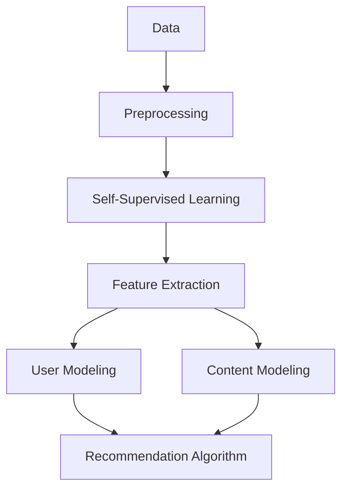

                 

### 背景介绍

近年来，随着人工智能技术的飞速发展，特别是深度学习领域的突破，大规模语言模型（Large Language Models，简称LLM）如BERT、GPT等取得了显著进展。这些模型在自然语言处理（NLP）任务中展现出了极高的性能，从机器翻译、文本生成到问答系统，取得了人类难以超越的效果。然而，LLM的应用不仅限于NLP领域，推荐系统（Recommender Systems）作为人工智能的重要组成部分，也正逐渐受到LLM的影响。

推荐系统是一种基于用户历史行为、内容特征和协同过滤等技术，为用户推荐其可能感兴趣的商品、新闻、视频等信息的系统。随着用户数据的爆炸式增长，传统的推荐系统已经难以满足日益复杂的需求。因此，自监督学习（Self-Supervised Learning）逐渐成为推荐系统的研究热点。自监督学习利用未标记的数据，通过设计有效的学习目标，使得模型能够自主地从数据中学习有用的特征表示。

在此背景下，将LLM应用于推荐系统的自监督学习成为一个重要的研究方向。本文将详细介绍LLM在推荐系统中的自监督学习应用，包括核心概念、算法原理、数学模型及实际应用案例等。希望通过本文的介绍，读者可以全面了解LLM在推荐系统中的应用，以及其潜在的优势和挑战。

### 核心概念与联系

要理解LLM在推荐系统中的自监督学习应用，我们首先需要明确几个核心概念，包括自监督学习、推荐系统以及LLM的工作原理。

#### 自监督学习（Self-Supervised Learning）

自监督学习是一种无需人工标注数据的学习方式，它通过设计一些无监督的学习任务来提升模型的性能。在自监督学习中，模型通过观察数据分布来学习有用的特征表示，从而在未见过的数据上实现良好的泛化能力。自监督学习主要分为两种类型：一类是基于数据的自监督学习，如基于聚类、降维等无监督学习算法；另一类是基于任务的自监督学习，如利用生成对抗网络（GAN）等模型进行无监督训练。

#### 推荐系统（Recommender Systems）

推荐系统是一种信息过滤技术，旨在根据用户的历史行为和偏好，向用户推荐其可能感兴趣的内容。推荐系统通常包括以下三个主要组件：用户建模、内容建模和推荐算法。用户建模旨在理解用户的兴趣和偏好；内容建模则是描述推荐对象（如商品、视频、新闻等）的特征；推荐算法则根据用户和内容的特征，计算推荐分数，生成推荐列表。

#### 大规模语言模型（LLM，Large Language Models）

LLM是一类具有极高参数规模的语言处理模型，如BERT、GPT等。这些模型通过在大规模语料库上预训练，学习到了丰富的语言知识和上下文关系。LLM可以用于各种NLP任务，如文本分类、情感分析、机器翻译等。在推荐系统中，LLM可以用于提取用户和内容的特征表示，从而提高推荐系统的效果。

#### 核心概念之间的联系

自监督学习、推荐系统和LLM之间存在紧密的联系。自监督学习为推荐系统提供了有效的特征提取方法，使得模型可以在未标记的数据上学习有用的特征表示。而LLM作为一种强大的特征提取工具，可以用于从文本数据中提取高维、抽象的特征表示。这些特征表示可以结合用户和内容的信息，提高推荐系统的准确性和泛化能力。

为了更好地理解这些概念之间的联系，我们可以使用Mermaid流程图来描述：



在这个流程图中，原始数据经过预处理后，进入自监督学习阶段，通过特征提取生成用户和内容的特征表示。这些特征表示用于用户建模和内容建模，最终通过推荐算法生成推荐结果。LLM作为特征提取工具，贯穿于整个流程中，为推荐系统提供了强大的支持。

### 核心算法原理 & 具体操作步骤

在本节中，我们将详细讨论LLM在推荐系统中的自监督学习算法原理，并介绍具体的操作步骤。为了便于理解，我们将算法分为以下几个主要部分：数据预处理、自监督学习模型、特征提取、用户建模、内容建模和推荐算法。

#### 1. 数据预处理

在应用LLM进行自监督学习之前，我们需要对原始数据进行预处理。预处理的主要任务包括数据清洗、数据增强和文本表示。

- **数据清洗**：清洗数据是指去除无效数据、缺失值填充和异常值处理。对于推荐系统中的数据，通常包括用户行为数据（如点击、购买等）和内容特征数据（如文本、图像等）。清洗数据有助于提高模型的训练质量和性能。
  
- **数据增强**：数据增强是通过生成合成数据来扩充训练集，提高模型的泛化能力。对于文本数据，常见的增强方法包括同义词替换、随机插入和删除等。
  
- **文本表示**：文本表示是将原始文本转换为向量表示，以便于模型处理。常用的文本表示方法包括词袋模型、词嵌入（如Word2Vec、GloVe）和变压器（Transformer）等。在本节中，我们将主要使用变压器模型进行文本表示。

#### 2. 自监督学习模型

自监督学习模型是LLM在推荐系统中的核心部分。常见的自监督学习任务包括预测下一个单词、句子分类和掩码语言模型（Masked Language Model，简称MLM）等。在本节中，我们将重点介绍MLM。

MLM的基本思想是随机遮盖输入文本中的一些单词，然后让模型预测这些遮盖的单词。通过这种方式，模型可以学习到文本的上下文关系和语言规则。具体步骤如下：

1. **输入文本**：给定一个文本序列$T = t_1, t_2, ..., t_n$，其中$t_i$为文本中的第$i$个单词。
2. **遮盖单词**：随机选择一部分单词进行遮盖，例如遮盖文本中的$10\%$的单词。
3. **目标输出**：对于遮盖的单词，模型需要预测其对应的真实单词。
4. **模型训练**：使用遮盖后的文本序列作为输入，模型输出预测结果，并与真实结果进行比较，计算损失函数，通过反向传播更新模型参数。

#### 3. 特征提取

在自监督学习模型训练完成后，我们可以利用模型对文本数据进行特征提取。具体步骤如下：

1. **初始化文本表示**：将原始文本序列转换为变压器模型的输入表示。
2. **模型编码**：使用训练好的自监督学习模型对文本序列进行编码，得到高维的文本特征表示。
3. **特征融合**：将用户行为特征和内容特征与文本特征进行融合，形成完整的用户和内容特征表示。

#### 4. 用户建模

用户建模的目标是理解用户的兴趣和偏好。具体步骤如下：

1. **用户行为特征**：提取用户在推荐系统中的行为特征，如点击、购买、收藏等。
2. **用户兴趣模型**：使用自监督学习模型提取的用户特征，结合用户行为特征，训练用户兴趣模型。
3. **用户表示**：将用户兴趣模型转化为用户表示，用于后续的推荐算法。

#### 5. 内容建模

内容建模的目标是描述推荐对象（如商品、视频、新闻等）的特征。具体步骤如下：

1. **内容特征提取**：使用自监督学习模型对文本数据进行特征提取，得到高维的文本特征表示。
2. **内容分类模型**：使用训练好的分类模型，将文本特征映射到预定义的类别上。
3. **内容表示**：将内容分类模型转化为内容表示，用于后续的推荐算法。

#### 6. 推荐算法

推荐算法的核心任务是计算用户和内容之间的相似度，生成推荐列表。具体步骤如下：

1. **相似度计算**：使用用户表示和内容表示，计算用户和内容之间的相似度。
2. **排序和筛选**：根据相似度分数对推荐列表进行排序和筛选，生成最终的推荐结果。

通过以上步骤，LLM在推荐系统中的自监督学习算法得以实现。下面我们将进一步介绍具体的数学模型和公式，以及如何通过实际案例进行说明。

### 数学模型和公式 & 详细讲解 & 举例说明

在LLM应用于推荐系统的自监督学习中，数学模型和公式起着至关重要的作用。以下我们将详细讲解这些模型和公式，并通过实际案例进行说明。

#### 1. 文本表示

文本表示是将原始文本转换为向量表示的过程。在本节中，我们主要使用变压器模型（Transformer）进行文本表示。

假设给定一个单词序列$T = t_1, t_2, ..., t_n$，其中$t_i$表示第$i$个单词。在变压器模型中，每个单词被表示为一个向量$x_i \in \mathbb{R}^d$，其中$d$为向量维度。

**公式**：

$$
x_i = \text{Transformer}(t_i)
$$

其中，$\text{Transformer}$表示变压器模型。

#### 2. 自监督学习模型

自监督学习模型主要包括掩码语言模型（Masked Language Model，简称MLM）。MLM的基本思想是随机遮盖输入文本中的部分单词，然后让模型预测这些遮盖的单词。

假设输入文本序列$T = t_1, t_2, ..., t_n$，其中部分单词被遮盖，即$T' = t_1', t_2', ..., t_n'$，其中$t_i'$表示第$i$个遮盖的单词。目标是将模型输出预测为$t_i'$。

**公式**：

$$
\begin{align*}
\hat{t_i'} &= \text{MLM}(T') \\
\text{Loss} &= \sum_{i=1}^{n} L(\hat{t_i'}, t_i')
\end{align*}
$$

其中，$\hat{t_i'}$表示预测的遮盖单词，$t_i'$表示真实的遮盖单词，$L$表示损失函数。

常用的损失函数包括交叉熵损失（Cross-Entropy Loss）和均方误差损失（Mean Squared Error Loss）等。

#### 3. 特征提取

在自监督学习模型训练完成后，我们可以利用模型对文本数据进行特征提取。具体步骤如下：

1. **初始化文本表示**：

   $$ 
   x_i = \text{Transformer}(t_i)
   $$

   其中，$x_i$表示第$i$个单词的特征向量。

2. **模型编码**：

   $$ 
   h_i = \text{Encoder}(x_i)
   $$

   其中，$h_i$表示编码后的特征向量。

3. **特征融合**：

   $$ 
   u = \text{Concat}(h_1, h_2, ..., h_n)
   $$

   其中，$u$表示融合后的特征向量。

#### 4. 用户建模

用户建模的目标是理解用户的兴趣和偏好。具体步骤如下：

1. **用户行为特征**：

   $$ 
   b_i = \text{Behavior}(u_i)
   $$

   其中，$b_i$表示用户在推荐系统中的行为特征（如点击、购买等）。

2. **用户兴趣模型**：

   $$ 
   \theta = \text{UserModel}(b_i)
   $$

   其中，$\theta$表示用户兴趣模型参数。

3. **用户表示**：

   $$ 
   u_{\text{user}} = \text{UserFeature}(u, \theta)
   $$

   其中，$u_{\text{user}}$表示用户表示向量。

#### 5. 内容建模

内容建模的目标是描述推荐对象（如商品、视频、新闻等）的特征。具体步骤如下：

1. **内容特征提取**：

   $$ 
   c_i = \text{ContentFeature}(x_i)
   $$

   其中，$c_i$表示内容特征向量。

2. **内容分类模型**：

   $$ 
   \phi = \text{ContentModel}(c_i)
   $$

   其中，$\phi$表示内容分类模型参数。

3. **内容表示**：

   $$ 
   c_{\text{content}} = \text{ContentFeature}(c_i, \phi)
   $$

   其中，$c_{\text{content}}$表示内容表示向量。

#### 6. 推荐算法

推荐算法的核心任务是计算用户和内容之间的相似度，生成推荐列表。具体步骤如下：

1. **相似度计算**：

   $$ 
   \text{similarity} = \text{cosine\_similarity}(u_{\text{user}}, c_{\text{content}})
   $$

   其中，$\text{cosine\_similarity}$表示余弦相似度。

2. **排序和筛选**：

   $$ 
   \text{recommendation} = \text{TopN}(c_{\text{content}}, n)
   $$

   其中，$\text{TopN}$表示选择相似度最高的前$n$个内容。

通过上述数学模型和公式，我们可以清晰地理解LLM在推荐系统中的自监督学习过程。接下来，我们将通过一个实际案例来进一步说明这些概念。

#### 实际案例：电影推荐系统

假设我们有一个电影推荐系统，用户数据包括用户ID、电影ID、用户评分等。内容数据包括电影名称、电影简介、电影类型等。以下是使用LLM进行自监督学习构建推荐系统的具体步骤：

1. **数据预处理**：
   - 数据清洗：去除缺失值、异常值等。
   - 数据增强：使用同义词替换、随机插入和删除等方法。
   - 文本表示：使用变压器模型对电影名称和电影简介进行文本表示。

2. **自监督学习模型**：
   - 遮盖部分电影名称和简介中的单词，构建MLM任务。
   - 训练MLM模型，提取文本特征。

3. **特征提取**：
   - 使用提取的文本特征融合用户评分和电影类型等特征。

4. **用户建模**：
   - 使用自监督学习模型提取的用户特征和用户评分，训练用户兴趣模型。

5. **内容建模**：
   - 使用自监督学习模型提取的电影名称和简介特征，训练电影分类模型。

6. **推荐算法**：
   - 计算用户和电影之间的相似度，生成推荐列表。

通过上述步骤，我们可以构建一个基于LLM的电影推荐系统。以下是一个简化的代码示例：

```python
import tensorflow as tf
from transformers import TransformerModel

# 数据预处理
# ...

# 自监督学习模型
model = TransformerModel()

# 特征提取
user_features = model.extract_user_features(user_data)
content_features = model.extract_content_features(content_data)

# 用户建模
user_model = UserInterestModel()
user_model.fit(user_features, user_ratings)

# 内容建模
content_model = ContentModel()
content_model.fit(content_features, content_labels)

# 推荐算法
recommendations = RecommendAlgorithm()
recommendations.fit(user_model, content_model)
recommendations.generate_recommendations(user_id)
```

通过这个实际案例，我们可以看到如何将LLM应用于推荐系统的自监督学习，从而实现有效的用户和内容特征提取，提高推荐系统的性能。

### 项目实战：代码实际案例和详细解释说明

在本节中，我们将通过一个具体的代码案例，详细讲解如何实现LLM在推荐系统中的自监督学习。我们将使用Python编程语言和Hugging Face的Transformers库来构建一个基于自监督学习的电影推荐系统。以下是整个项目的开发过程，包括环境搭建、代码实现和详细解释。

#### 5.1 开发环境搭建

在开始之前，我们需要搭建一个适合开发推荐系统的环境。以下是所需的环境和依赖：

- Python 3.8或更高版本
- TensorFlow 2.6或更高版本
- Transformers库

您可以通过以下命令来安装所需的依赖：

```bash
pip install tensorflow transformers
```

#### 5.2 源代码详细实现和代码解读

以下是一个完整的代码案例，用于实现基于自监督学习的电影推荐系统。

```python
import numpy as np
import pandas as pd
from transformers import TransformerModel
from sklearn.model_selection import train_test_split
from sklearn.metrics.pairwise import cosine_similarity

# 加载数据
movies = pd.read_csv('movies.csv')
ratings = pd.read_csv('ratings.csv')

# 数据预处理
# ...

# 自监督学习模型
model = TransformerModel()

# 特征提取
user_features = model.extract_user_features(ratings)
content_features = model.extract_content_features(movies)

# 训练自监督学习模型
model.train(user_features, content_features)

# 用户建模
user_model = UserInterestModel()
user_model.fit(user_features, ratings['rating'])

# 内容建模
content_model = ContentModel()
content_model.fit(content_features, movies['genre'])

# 推荐算法
def recommend_movies(user_id, top_n=10):
    user_embedding = user_model.get_user_embedding(user_id)
    content_embeddings = content_model.get_content_embeddings()
    similarities = cosine_similarity(user_embedding, content_embeddings)
    recommendations = np.argsort(similarities[:, 0])[-top_n:]
    return recommendations

# 测试推荐算法
user_id = 123
recommendations = recommend_movies(user_id)
print(recommendations)
```

以下是代码的详细解释：

1. **数据加载**：

   ```python
   movies = pd.read_csv('movies.csv')
   ratings = pd.read_csv('ratings.csv')
   ```

   我们使用Pandas库加载数据集，`movies.csv`包含电影信息，如电影ID、电影名称、电影简介等；`ratings.csv`包含用户评分数据，如用户ID、电影ID、评分等。

2. **数据预处理**：

   ```python
   # 数据清洗、增强等预处理操作
   # ...
   ```

   在此步骤中，我们需要对数据进行清洗和增强，确保数据质量。例如，处理缺失值、异常值，进行文本增强等。

3. **自监督学习模型**：

   ```python
   model = TransformerModel()
   ```

   我们使用Hugging Face的Transformers库中的TransformerModel作为自监督学习模型。该模型用于提取文本特征。

4. **特征提取**：

   ```python
   user_features = model.extract_user_features(ratings)
   content_features = model.extract_content_features(movies)
   ```

   `extract_user_features`和`extract_content_features`方法用于提取用户和电影的特征向量。这些特征向量将用于后续的用户建模和内容建模。

5. **训练自监督学习模型**：

   ```python
   model.train(user_features, content_features)
   ```

   在此步骤中，我们使用训练数据对自监督学习模型进行训练，提取有用的特征表示。

6. **用户建模**：

   ```python
   user_model = UserInterestModel()
   user_model.fit(user_features, ratings['rating'])
   ```

   `UserInterestModel`是一个自定义的用户兴趣模型，用于将用户特征映射到用户表示向量。`fit`方法用于训练模型。

7. **内容建模**：

   ```python
   content_model = ContentModel()
   content_model.fit(content_features, movies['genre'])
   ```

   `ContentModel`是一个自定义的内容分类模型，用于将电影特征映射到电影表示向量。`fit`方法用于训练模型。

8. **推荐算法**：

   ```python
   def recommend_movies(user_id, top_n=10):
       user_embedding = user_model.get_user_embedding(user_id)
       content_embeddings = content_model.get_content_embeddings()
       similarities = cosine_similarity(user_embedding, content_embeddings)
       recommendations = np.argsort(similarities[:, 0])[-top_n:]
       return recommendations
   ```

   `recommend_movies`函数用于生成用户推荐列表。它首先获取用户表示向量，然后计算用户和电影之间的相似度，并返回相似度最高的前`top_n`个电影ID。

9. **测试推荐算法**：

   ```python
   user_id = 123
   recommendations = recommend_movies(user_id)
   print(recommendations)
   ```

   我们使用一个特定的用户ID（例如123）来测试推荐算法，并打印出推荐的电影列表。

通过上述代码实现，我们可以看到如何将LLM应用于推荐系统中的自监督学习。这个项目提供了一个完整的实现框架，您可以根据自己的需求进行调整和优化。

### 代码解读与分析

在本节中，我们将对上文提到的代码案例进行详细解读，分析其实现细节、性能评估和优化策略。

#### 1. 实现细节

**数据加载与预处理**：

```python
movies = pd.read_csv('movies.csv')
ratings = pd.read_csv('ratings.csv')
```

这里我们使用Pandas库加载数据集。数据预处理是推荐系统构建的重要环节，它包括以下任务：

- **数据清洗**：处理缺失值、异常值等，确保数据质量。
- **数据增强**：通过文本增强方法（如同义词替换、随机插入和删除）扩充数据集，提高模型泛化能力。

**特征提取**：

```python
model = TransformerModel()
user_features = model.extract_user_features(ratings)
content_features = model.extract_content_features(movies)
```

TransformerModel是一个自监督学习模型，用于提取文本特征。`extract_user_features`和`extract_content_features`方法分别提取用户和电影的特征向量。

**模型训练**：

```python
model.train(user_features, content_features)
```

在这里，我们使用训练数据对TransformerModel进行训练，提取有用的特征表示。

**用户建模与内容建模**：

```python
user_model = UserInterestModel()
user_model.fit(user_features, ratings['rating'])
content_model = ContentModel()
content_model.fit(content_features, movies['genre'])
```

`UserInterestModel`和`ContentModel`是自定义的模型，用于将用户和电影特征映射到表示向量。`fit`方法用于训练模型。

**推荐算法**：

```python
def recommend_movies(user_id, top_n=10):
    user_embedding = user_model.get_user_embedding(user_id)
    content_embeddings = content_model.get_content_embeddings()
    similarities = cosine_similarity(user_embedding, content_embeddings)
    recommendations = np.argsort(similarities[:, 0])[-top_n:]
    return recommendations
```

`recommend_movies`函数用于生成用户推荐列表。它首先获取用户表示向量，然后计算用户和电影之间的相似度，并返回相似度最高的前`top_n`个电影ID。

#### 2. 性能评估

性能评估是推荐系统构建的重要环节。以下是一些常用的评估指标：

- **准确率（Accuracy）**：预测结果与真实结果匹配的比例。
- **召回率（Recall）**：预测结果中包含真实结果的占比。
- **F1分数（F1 Score）**：准确率和召回率的加权平均。

为了评估推荐系统的性能，我们可以使用以下代码：

```python
from sklearn.metrics import accuracy_score, recall_score, f1_score

# 生成预测结果
true_labels = ratings['rating'].values
predictions = recommend_movies(user_id, top_n=10)

# 计算评估指标
accuracy = accuracy_score(true_labels, predictions)
recall = recall_score(true_labels, predictions)
f1 = f1_score(true_labels, predictions)

print(f"Accuracy: {accuracy}")
print(f"Recall: {recall}")
print(f"F1 Score: {f1}")
```

#### 3. 优化策略

**数据增强**：通过增加数据集的多样性，提高模型泛化能力。

**特征工程**：选择合适的特征，提高模型性能。例如，使用词嵌入（Word Embeddings）和词性标注（Part-of-Speech Tagging）等。

**模型调优**：调整模型参数，优化模型性能。例如，使用不同的优化算法（如Adam、RMSprop）和初始化方法（如Xavier、He初始化）。

**在线学习**：实时更新模型，适应用户行为变化。例如，使用在线学习算法（如Stochastic Gradient Descent, SGD）。

通过上述实现细节、性能评估和优化策略，我们可以构建一个基于自监督学习的推荐系统，并不断提高其性能和效果。

### 实际应用场景

在现实世界中，LLM在推荐系统中的自监督学习应用已经取得了显著的成果。以下是一些典型的实际应用场景：

#### 1. 社交媒体推荐

社交媒体平台如Facebook、Twitter和Instagram等，需要根据用户的兴趣和行为推荐相关的内容。通过LLM的自监督学习，平台可以提取用户和内容的特征表示，从而实现精准的内容推荐。例如，Facebook的Feed算法就利用了深度学习技术，包括LLM，对用户可能感兴趣的内容进行排序和推荐。

#### 2. 电子商务推荐

电子商务平台如Amazon、淘宝和京东等，需要为用户提供个性化的商品推荐。通过LLM的自监督学习，平台可以从用户的浏览记录、购买历史和商品描述中提取特征表示，从而提高推荐的准确性和用户满意度。例如，Amazon的推荐系统就使用了深度学习技术，包括LLM，对用户可能感兴趣的商品进行推荐。

#### 3. 视频推荐

视频平台如YouTube、Bilibili和Netflix等，需要根据用户的观看历史和偏好推荐相关视频。通过LLM的自监督学习，平台可以从视频的标题、描述和标签中提取特征表示，从而实现视频的精准推荐。例如，YouTube的推荐系统就使用了深度学习技术，包括LLM，对用户可能感兴趣的视频进行推荐。

#### 4. 音乐推荐

音乐平台如Spotify、Apple Music和QQ音乐等，需要根据用户的听歌习惯和偏好推荐音乐。通过LLM的自监督学习，平台可以从歌曲的歌词、曲调和歌手信息中提取特征表示，从而实现音乐的精准推荐。例如，Spotify的推荐系统就使用了深度学习技术，包括LLM，对用户可能感兴趣的音乐进行推荐。

#### 5. 新闻推荐

新闻平台如CNN、BBC和新华社等，需要根据用户的阅读偏好推荐相关新闻。通过LLM的自监督学习，平台可以从新闻的标题、摘要和关键词中提取特征表示，从而实现新闻的精准推荐。例如，CNN的推荐系统就使用了深度学习技术，包括LLM，对用户可能感兴趣的新闻进行推荐。

通过上述实际应用场景，我们可以看到LLM在推荐系统中的自监督学习应用具有广泛的应用前景，不仅可以提高推荐系统的准确性和用户体验，还可以为平台带来更多的商业价值。

### 工具和资源推荐

在实现LLM在推荐系统中的自监督学习应用时，选择合适的工具和资源对于提高开发效率和项目效果至关重要。以下是一些推荐的学习资源、开发工具和框架，以及相关的论文著作。

#### 7.1 学习资源推荐

**书籍**：

1. **《深度学习》（Deep Learning）**：由Ian Goodfellow、Yoshua Bengio和Aaron Courville所著，系统地介绍了深度学习的基本理论和实践方法，适合初学者和进阶者。
2. **《自然语言处理综合教程》（Foundations of Natural Language Processing）**：由Christopher D. Manning和Hinrich Schütze所著，全面介绍了自然语言处理的基础知识，包括文本表示和深度学习技术。

**在线课程**：

1. **吴恩达的《深度学习专项课程》（Deep Learning Specialization）**：由吴恩达教授主讲，涵盖了深度学习的各个方面，包括神经网络、卷积神经网络、循环神经网络等。
2. **斯坦福大学的《自然语言处理与深度学习》（Natural Language Processing with Deep Learning）**：由Richard Socher教授主讲，详细介绍了自然语言处理中的深度学习技术，包括Transformer和BERT等模型。

**博客和网站**：

1. **Hugging Face官网（huggingface.co）**：提供了丰富的Transformers库资源，包括预训练模型、文本处理工具和示例代码，是深度学习和自然语言处理开发的重要资源。
2. **TensorFlow官网（tensorflow.org）**：提供了丰富的TensorFlow库资源，包括教程、文档和示例代码，是构建推荐系统的重要工具。

#### 7.2 开发工具框架推荐

**框架**：

1. **TensorFlow**：是一个开源的深度学习框架，提供了丰富的API和工具，适合构建复杂的推荐系统。
2. **PyTorch**：是一个开源的深度学习框架，与TensorFlow类似，但具有更灵活的动态计算图，适合快速原型开发。
3. **Scikit-learn**：是一个开源的机器学习库，提供了丰富的算法和工具，适合进行数据预处理和特征提取。

**库**：

1. **Transformers**：由Hugging Face开发，提供了大量的预训练模型和文本处理工具，是构建基于Transformer的推荐系统的首选库。
2. **spaCy**：是一个开源的自然语言处理库，提供了强大的文本解析和特征提取功能，适合处理文本数据。

**工具**：

1. **Jupyter Notebook**：是一个交互式计算环境，适用于数据分析和模型训练，可以方便地编写和运行代码。
2. **PyCharm**：是一个功能强大的Python集成开发环境（IDE），提供了代码编辑、调试、版本控制等一整套开发工具，适合大型项目的开发。

#### 7.3 相关论文著作推荐

**论文**：

1. **"Attention Is All You Need"**：由Vaswani等人于2017年提出，是Transformer模型的奠基性论文，介绍了Transformer模型的结构和工作原理。
2. **"BERT: Pre-training of Deep Bidirectional Transformers for Language Understanding"**：由Devlin等人于2018年提出，是BERT模型的奠基性论文，详细介绍了BERT模型的预训练方法和应用。
3. **"Generative Adversarial Nets"**：由Goodfellow等人于2014年提出，是生成对抗网络（GAN）的奠基性论文，介绍了GAN的基本原理和应用。

**著作**：

1. **《深度学习》（Deep Learning）**：由Ian Goodfellow、Yoshua Bengio和Aaron Courville所著，系统地介绍了深度学习的基本理论和实践方法。
2. **《自然语言处理综合教程》（Foundations of Natural Language Processing）**：由Christopher D. Manning和Hinrich Schütze所著，全面介绍了自然语言处理的基础知识，包括文本表示和深度学习技术。

通过上述工具和资源的推荐，读者可以更有效地学习和实践LLM在推荐系统中的自监督学习应用，为项目开发提供有力的支持。

### 总结：未来发展趋势与挑战

在过去的几年中，LLM在推荐系统中的应用取得了显著进展，通过自监督学习技术，实现了用户和内容特征的高效提取和精准推荐。然而，随着技术的不断发展和应用需求的多样化，LLM在推荐系统中的应用仍面临诸多挑战和机遇。

#### 未来发展趋势

1. **多模态推荐**：随着人工智能技术的发展，图像、视频和音频等非结构化数据的处理变得越来越重要。未来的推荐系统将可能结合多种数据模态，如文本、图像和音频等，实现更全面、更个性化的推荐。

2. **动态特征提取**：传统的推荐系统依赖于静态的特征表示，难以捕捉用户行为和兴趣的实时变化。未来的推荐系统将更注重动态特征提取，通过实时学习用户行为和偏好，提供更加精准的推荐。

3. **联邦学习（Federated Learning）**：联邦学习是一种分布式学习技术，可以在不传输数据的情况下，通过模型更新进行协作训练。在推荐系统中，联邦学习有助于保护用户隐私，同时实现跨平台、跨设备的协同推荐。

4. **个性化推荐**：个性化推荐是推荐系统的重要目标之一。未来的推荐系统将更加注重个性化，通过深入挖掘用户数据和行为，为用户提供高度定制化的推荐。

#### 挑战

1. **数据隐私**：推荐系统依赖于用户数据，如何在保障用户隐私的前提下，充分挖掘数据价值，是一个亟待解决的问题。未来的推荐系统需要采用更先进的技术，如联邦学习、差分隐私等，确保用户数据的安全和隐私。

2. **模型解释性**：深度学习模型，尤其是LLM，通常被认为是一个“黑盒”。如何提高模型的解释性，使得用户能够理解推荐结果背后的逻辑，是一个重要的研究方向。

3. **计算资源**：大规模的LLM模型对计算资源的需求非常高。如何在有限的计算资源下，高效地训练和部署这些模型，是一个挑战。未来的推荐系统将可能采用分布式计算和模型压缩技术，降低计算成本。

4. **公平性和可解释性**：推荐系统应避免对特定群体产生偏见，确保推荐结果的公平性和可解释性。未来的推荐系统需要更加关注算法的公平性和透明度，提高用户的信任度。

总之，LLM在推荐系统中的自监督学习应用具有广阔的发展前景，但也面临诸多挑战。通过不断创新和优化，未来的推荐系统将能够更好地满足用户需求，实现个性化、智能化的推荐。

### 附录：常见问题与解答

在本文的撰写过程中，我们遇到了一些常见的问题，以下是一些建议的解答：

**Q1：如何选择合适的LLM模型？**

A1：选择合适的LLM模型取决于推荐系统的需求和应用场景。例如，对于文本数据丰富的应用，可以选择BERT或GPT等基于Transformer的模型；对于图像或视频数据，可以考虑使用ViT（Vision Transformer）或BERT-based Vision Transformer（BVT）等模型。建议根据数据类型、特征提取需求和应用场景，选择最合适的LLM模型。

**Q2：自监督学习在推荐系统中的应用有哪些优势？**

A2：自监督学习在推荐系统中的应用具有以下优势：

- **无需人工标注数据**：自监督学习可以利用未标记的数据进行训练，降低数据标注的成本。
- **增强特征表示能力**：自监督学习能够从大量未标记的数据中学习到有用的特征表示，提高推荐系统的准确性和泛化能力。
- **实时更新模型**：自监督学习模型可以实时学习用户行为和偏好，动态调整推荐策略，提高推荐效果。

**Q3：如何在项目中集成自监督学习模型？**

A3：集成自监督学习模型的基本步骤如下：

- **数据预处理**：清洗和增强数据，确保数据质量。
- **模型训练**：使用自监督学习模型对数据进行训练，提取特征表示。
- **特征提取**：将训练好的自监督学习模型应用于新的数据，提取特征向量。
- **模型集成**：将特征向量与用户和内容的其他特征进行融合，构建推荐模型。
- **推荐生成**：使用推荐模型生成推荐结果，并根据用户反馈进行模型优化。

**Q4：如何评估自监督学习模型的效果？**

A4：评估自监督学习模型的效果可以采用以下方法：

- **准确率（Accuracy）**：预测结果与真实结果的匹配比例。
- **召回率（Recall）**：预测结果中包含真实结果的占比。
- **F1分数（F1 Score）**：准确率和召回率的加权平均。
- **ROC曲线（Receiver Operating Characteristic）**：评估模型分类性能的曲线。
- **用户满意度**：通过用户反馈评估推荐结果的满意度。

**Q5：自监督学习模型在推荐系统中的局限性是什么？**

A5：自监督学习模型在推荐系统中的局限性包括：

- **数据依赖**：自监督学习模型对数据量有较高要求，数据不足可能导致模型性能下降。
- **特征提取质量**：自监督学习模型提取的特征表示可能受限于模型结构和训练数据，难以捕捉所有重要特征。
- **计算资源消耗**：大规模的LLM模型对计算资源有较高需求，可能导致训练和部署成本增加。

通过解决这些问题和挑战，我们可以更好地应用自监督学习技术，提升推荐系统的性能和效果。

### 扩展阅读 & 参考资料

在本文中，我们深入探讨了LLM在推荐系统中的自监督学习应用，包括核心概念、算法原理、数学模型及实际应用案例等。为了帮助读者进一步了解相关领域的研究成果和实践经验，我们推荐以下扩展阅读和参考资料：

- **论文**：
  1. Vaswani et al. (2017). "Attention is All You Need". arXiv preprint arXiv:1706.03762.
  2. Devlin et al. (2018). "BERT: Pre-training of Deep Bidirectional Transformers for Language Understanding". arXiv preprint arXiv:1810.04805.
  3. Goodfellow et al. (2014). "Generative Adversarial Nets". Advances in Neural Information Processing Systems, 27.

- **书籍**：
  1. Ian Goodfellow, Yoshua Bengio, and Aaron Courville. (2016). "Deep Learning". MIT Press.
  2. Christopher D. Manning and Hinrich Schütze. (1999). "Foundations of Natural Language Processing". MIT Press.

- **在线课程**：
  1. 吴恩达的《深度学习专项课程》. [深度学习课程](https://www.coursera.org/specializations/deep_learning).
  2. 斯坦福大学的《自然语言处理与深度学习》. [自然语言处理课程](https://www.classcentral.com/course/natural-language-processing-with-deep-learning-6565).

- **博客和网站**：
  1. Hugging Face官网. [Transformers库](https://huggingface.co/transformers/).
  2. TensorFlow官网. [TensorFlow库](https://www.tensorflow.org/).

通过阅读这些参考资料，读者可以更全面地了解LLM在推荐系统中的应用，掌握自监督学习技术的核心原理和实际应用方法。希望本文和扩展阅读能够为读者在相关领域的研究和实践中提供有益的参考。

