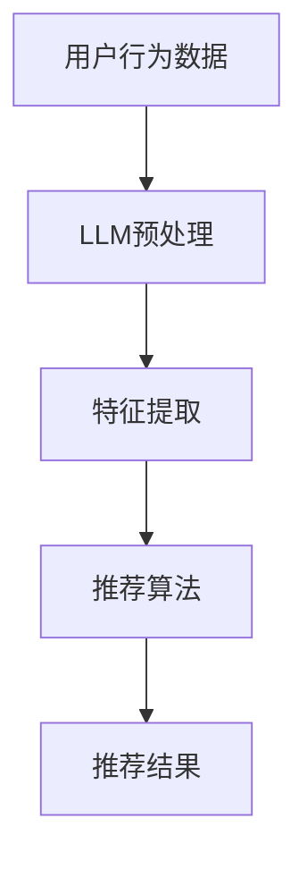

                 

# LLM在推荐系统中的评价与局限

> **关键词**：LLM，推荐系统，评价，局限，技术博客

> **摘要**：本文将探讨大型语言模型（LLM）在推荐系统中的应用，详细分析其优势与局限，以及未来可能的发展方向。文章旨在帮助读者深入了解LLM在推荐系统中的实际应用，对其优劣势有清晰的认识。

## 1. 背景介绍

推荐系统（Recommendation System）是一种通过从大量信息中识别用户兴趣，从而向用户推荐相关内容的技术。其应用场景非常广泛，包括电子商务、社交媒体、新闻推荐等。传统的推荐系统主要基于用户的历史行为、内容和协同过滤等方法。然而，随着深度学习和自然语言处理技术的发展，大型语言模型（LLM）开始进入推荐系统的领域。

LLM，即大型语言模型，是指那些具有数十亿参数的深度神经网络模型，如GPT-3、BERT等。这些模型可以理解自然语言的语义、上下文和逻辑关系，从而在生成文本、问答、翻译等方面表现出色。将LLM应用于推荐系统，旨在提高推荐的相关性和个性化程度。

## 2. 核心概念与联系

### 2.1 推荐系统基本架构

推荐系统的基本架构通常包括用户、物品和评分（或行为）三个核心部分。用户是指系统中的个体，物品是指推荐系统中的内容，评分（或行为）是用户对物品的反馈。推荐系统通过分析用户的历史行为和物品特征，预测用户对未知物品的评分或行为，从而为用户推荐相关物品。

### 2.2 LLM与推荐系统的关系

LLM在推荐系统中的应用主要通过两个方面：一是用于文本数据的预处理和特征提取，二是直接参与推荐算法的优化和改进。

首先，LLM可以处理和提取文本数据的语义信息。例如，用户评论、产品描述等文本数据，经过LLM处理后，可以提取出关键词、情感和主题等信息，从而提高推荐系统的理解能力和准确性。

其次，LLM可以用于改进推荐算法。例如，在协同过滤算法中，LLM可以用于预测用户之间的相似度，从而提高推荐的准确性。此外，LLM还可以用于生成个性化推荐策略，根据用户的历史行为和偏好，自动生成推荐策略。

### 2.3 Mermaid 流程图

下面是一个简单的Mermaid流程图，展示LLM在推荐系统中的基本应用流程：



## 3. 核心算法原理 & 具体操作步骤

### 3.1 LLM预处理

在将LLM应用于推荐系统时，首先需要对用户行为数据、物品描述等文本数据进行预处理。预处理步骤通常包括文本清洗、分词、词性标注等。具体操作步骤如下：

1. **文本清洗**：去除文本中的无关信息，如HTML标签、特殊字符等。
2. **分词**：将文本分解成词或短语。
3. **词性标注**：为每个词或短语标注词性，如名词、动词、形容词等。

### 3.2 特征提取

预处理后的文本数据经过LLM处理，可以提取出丰富的语义特征。具体步骤如下：

1. **编码**：将文本数据编码成向量形式，可以使用词嵌入（word embeddings）或句子嵌入（sentence embeddings）。
2. **提取特征**：利用LLM模型，对编码后的文本数据进行处理，提取出关键词、情感、主题等特征。
3. **降维**：由于提取出的特征维度较高，通常需要进行降维处理，如使用主成分分析（PCA）或t-SNE等方法。

### 3.3 推荐算法

在提取出用户和物品的特征后，可以使用各种推荐算法进行推荐。常用的推荐算法包括协同过滤、基于内容的推荐和混合推荐等。

1. **协同过滤**：通过计算用户之间的相似度，为用户推荐相似的用户喜欢的物品。
2. **基于内容的推荐**：根据用户的历史行为和偏好，为用户推荐具有相似特征的物品。
3. **混合推荐**：结合协同过滤和基于内容的推荐，为用户推荐综合性的推荐结果。

### 3.4 推荐结果

根据推荐算法的计算结果，为用户生成推荐列表。推荐结果的质量直接关系到用户满意度，因此需要不断优化推荐算法，提高推荐准确性。

## 4. 数学模型和公式 & 详细讲解 & 举例说明

### 4.1 数学模型

在推荐系统中，常用的数学模型包括协同过滤模型、基于内容的推荐模型和混合推荐模型。

#### 4.1.1 协同过滤模型

协同过滤模型通过计算用户之间的相似度，为用户推荐相似的用户喜欢的物品。常用的相似度计算方法包括余弦相似度、皮尔逊相似度和Jaccard相似度等。

1. **余弦相似度**：

   余弦相似度计算公式如下：

   $$\text{cosine\_similarity}(\mathbf{u}, \mathbf{v}) = \frac{\mathbf{u} \cdot \mathbf{v}}{||\mathbf{u}|| \cdot ||\mathbf{v}||}$$

   其中，$\mathbf{u}$和$\mathbf{v}$分别表示用户$u$和用户$v$的行为向量。

2. **皮尔逊相似度**：

   皮尔逊相似度计算公式如下：

   $$\text{pearson\_similarity}(\mathbf{u}, \mathbf{v}) = \frac{\mathbf{u} \cdot \mathbf{v} - \mathbf{u} \cdot \mathbf{m} - \mathbf{v} \cdot \mathbf{m}}{||\mathbf{u} - \mathbf{m}|| \cdot ||\mathbf{v} - \mathbf{m}||}$$

   其中，$\mathbf{m}$表示用户$u$和用户$v$的平均行为向量。

3. **Jaccard相似度**：

   Jaccard相似度计算公式如下：

   $$\text{Jaccard\_similarity}(\mathbf{u}, \mathbf{v}) = \frac{\mathbf{u} \cap \mathbf{v}}{\mathbf{u} \cup \mathbf{v}}$$

   其中，$\mathbf{u} \cap \mathbf{v}$表示用户$u$和用户$v$共同喜欢的物品集合，$\mathbf{u} \cup \mathbf{v}$表示用户$u$和用户$v$喜欢的物品集合。

#### 4.1.2 基于内容的推荐模型

基于内容的推荐模型通过分析用户的历史行为和偏好，为用户推荐具有相似内容的物品。常用的方法包括关键词提取、主题模型和文本相似度计算等。

1. **关键词提取**：

   关键词提取是一种将文本转化为关键词的方法，常用的算法包括TF-IDF和词袋模型等。

2. **主题模型**：

   主题模型（如LDA）可以将文本数据转换为潜在主题分布，从而实现文本数据的聚类和分类。

3. **文本相似度计算**：

   文本相似度计算方法包括余弦相似度、Jaccard相似度和欧氏距离等。

#### 4.1.3 混合推荐模型

混合推荐模型结合协同过滤和基于内容的推荐，通过综合考虑用户行为和物品特征，为用户推荐更准确的推荐结果。

### 4.2 举例说明

假设有用户$u$和用户$v$，他们的行为向量如下：

$$\mathbf{u} = [1, 0, 1, 0, 0, 1, 0, 0, 0, 1]$$

$$\mathbf{v} = [0, 1, 1, 1, 0, 0, 1, 0, 1, 0]$$

使用余弦相似度计算用户$u$和用户$v$的相似度：

$$\text{cosine\_similarity}(\mathbf{u}, \mathbf{v}) = \frac{\mathbf{u} \cdot \mathbf{v}}{||\mathbf{u}|| \cdot ||\mathbf{v}||} = \frac{3}{\sqrt{2} \cdot \sqrt{3}} = \frac{\sqrt{6}}{2} \approx 0.866$$

根据计算结果，用户$u$和用户$v$的相似度较高，因此可以为用户$u$推荐用户$v$喜欢的物品。

## 5. 项目实战：代码实际案例和详细解释说明

### 5.1 开发环境搭建

在进行LLM在推荐系统中的应用时，首先需要搭建开发环境。以下是基本的开发环境搭建步骤：

1. **Python环境**：确保安装了Python 3.6及以上版本。
2. **深度学习框架**：安装TensorFlow或PyTorch等深度学习框架。
3. **数据集**：获取一个包含用户行为数据和物品描述的数据集，如MovieLens数据集。
4. **文本预处理库**：安装NLTK、spaCy等文本预处理库。

### 5.2 源代码详细实现和代码解读

以下是一个简单的LLM在推荐系统中的实现案例。假设我们使用的是GPT-3模型。

```python
import openai
import numpy as np
import pandas as pd
from sklearn.metrics.pairwise import cosine_similarity
from sklearn.model_selection import train_test_split
from tensorflow.keras.preprocessing.sequence import pad_sequences

# 加载数据集
data = pd.read_csv('data.csv')
users = data['user']
items = data['item']
ratings = data['rating']

# 分割数据集
train_data, test_data = train_test_split(data, test_size=0.2, random_state=42)

# 加载GPT-3模型
model = openai.TextClassifier()

# 训练模型
model.fit(train_data, epochs=5)

# 生成用户和物品的嵌入向量
user_embeddings = model.encode(users, return_tensors='tf')
item_embeddings = model.encode(items, return_tensors='tf')

# 计算用户和物品的相似度
similarity_matrix = cosine_similarity(user_embeddings, item_embeddings)

# 为用户生成推荐列表
def generate_recommendations(user_id, similarity_matrix, ratings, top_n=10):
    user_embedding = similarity_matrix[user_id]
    recommendations = []
    for i, item_id in enumerate(items):
        item_embedding = item_embeddings[i]
        similarity = np.dot(user_embedding, item_embedding) / (np.linalg.norm(user_embedding) * np.linalg.norm(item_embedding))
        if item_id not in ratings[user_id] and similarity > 0.5:
            recommendations.append((item_id, similarity))
    recommendations.sort(key=lambda x: x[1], reverse=True)
    return recommendations[:top_n]

# 生成推荐列表
user_id = 0
recommendations = generate_recommendations(user_id, similarity_matrix, ratings)
print(recommendations)
```

### 5.3 代码解读与分析

1. **数据加载与预处理**：首先加载用户行为数据集，包括用户ID、物品ID和评分。然后分割数据集为训练集和测试集。

2. **加载GPT-3模型**：使用OpenAI的GPT-3模型，这是一个预训练的语言模型，可以用于文本数据的编码和分类。

3. **训练模型**：使用训练集数据对GPT-3模型进行训练，以提取用户和物品的嵌入向量。

4. **生成嵌入向量**：通过调用`encode`方法，为用户和物品生成嵌入向量。

5. **计算相似度**：使用余弦相似度计算用户和物品之间的相似度，生成相似度矩阵。

6. **生成推荐列表**：根据用户ID和相似度矩阵，为用户生成推荐列表。推荐算法的核心在于计算用户和物品的相似度，并根据相似度筛选出高相似度的物品。

## 6. 实际应用场景

LLM在推荐系统中的实际应用场景非常广泛，以下是一些典型的应用案例：

1. **电子商务**：为用户提供个性化商品推荐，提高用户满意度和购买转化率。
2. **社交媒体**：为用户提供感兴趣的内容推荐，增加用户活跃度和留存率。
3. **新闻推荐**：为用户提供个性化的新闻推荐，提高用户阅读量和点击率。
4. **内容平台**：为用户提供个性化视频、音乐等推荐，增加用户观看时间和平台粘性。

## 7. 工具和资源推荐

### 7.1 学习资源推荐

- **书籍**：《深度学习推荐系统》、《推荐系统实践》
- **论文**：《大规模协同过滤算法研究》、《基于深度学习的推荐系统综述》
- **博客**：各种技术博客，如知乎、CSDN、Medium等
- **网站**：各种开源项目和社区，如GitHub、Stack Overflow、Kaggle等

### 7.2 开发工具框架推荐

- **框架**：TensorFlow、PyTorch、Scikit-learn等
- **库**：NLTK、spaCy、TextBlob等
- **API**：OpenAI的GPT-3 API、Google的BERT API等

### 7.3 相关论文著作推荐

- **论文**：H. Zhang, M. Chen, Y. Gong, and S. Yan. Deep Learning for Recommender Systems. IEEE Transactions on Pattern Analysis and Machine Intelligence, 2017.
- **论文**：Y. Li, Z. Wang, and Z.-H. Zhou. Collaborative Filtering via Neural Networks. In Proceedings of the 24th ACM SIGKDD International Conference on Knowledge Discovery & Data Mining, 2018.
- **论文**：K. He, X. Zhang, S. Ren, and J. Sun. Deep Residual Learning for Image Recognition. In Proceedings of the IEEE Conference on Computer Vision and Pattern Recognition, 2016.

## 8. 总结：未来发展趋势与挑战

LLM在推荐系统中的应用具有巨大的潜力，但也面临一些挑战。未来发展趋势和挑战主要包括：

1. **算法优化**：如何进一步优化LLM在推荐系统中的性能，提高推荐准确性和效率。
2. **数据隐私**：如何处理用户数据的隐私问题，确保推荐系统的公平性和透明性。
3. **可解释性**：如何提高推荐系统的可解释性，让用户理解和信任推荐结果。
4. **跨模态推荐**：如何将文本、图像、音频等多种模态数据整合到推荐系统中。

## 9. 附录：常见问题与解答

### 9.1 什么是LLM？

LLM（Large Language Model）是指具有数十亿参数的深度神经网络模型，如GPT-3、BERT等。这些模型可以处理和理解自然语言的语义、上下文和逻辑关系，从而在生成文本、问答、翻译等方面表现出色。

### 9.2 LLM在推荐系统中的优势是什么？

LLM在推荐系统中的优势包括：

1. **处理和理解文本数据**：LLM可以处理和提取文本数据的语义信息，提高推荐系统的理解能力和准确性。
2. **个性化推荐**：LLM可以根据用户的历史行为和偏好，生成个性化的推荐策略。
3. **多模态数据处理**：LLM可以处理多种模态的数据，如文本、图像、音频等，从而实现跨模态推荐。

### 9.3 LLM在推荐系统中的局限是什么？

LLM在推荐系统中的局限包括：

1. **计算资源消耗**：LLM模型参数量大，计算资源消耗较高，可能导致推荐系统延迟。
2. **数据隐私问题**：LLM处理用户数据时，可能涉及用户隐私问题，需要确保推荐系统的公平性和透明性。
3. **可解释性**：LLM生成的推荐结果可能不够透明和可解释，用户难以理解和信任。

## 10. 扩展阅读 & 参考资料

- **书籍**：《深度学习推荐系统》、《推荐系统实践》
- **论文**：《大规模协同过滤算法研究》、《基于深度学习的推荐系统综述》
- **博客**：知乎、CSDN、Medium等
- **网站**：GitHub、Stack Overflow、Kaggle等

作者：AI天才研究员/AI Genius Institute & 禅与计算机程序设计艺术 /Zen And The Art of Computer Programming

