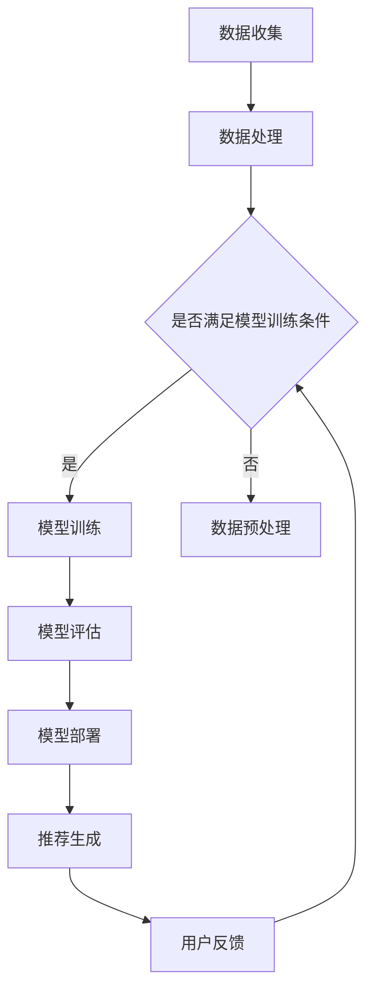

                 

### 文章标题与关键词

# LLM在推荐系统的局限与成本：对硬件的需求

## 关键词：
- LLM（大型语言模型）
- 推荐系统
- 硬件需求
- 性能瓶颈
- 数据处理能力
- 模型优化

### 摘要

本文将深入探讨大型语言模型（LLM）在推荐系统中的应用及其面临的局限与成本。首先，我们将回顾LLM在推荐系统中的基本原理和优势。接着，通过分析LLM的局限，特别是其数据处理能力和性能瓶颈，我们将探讨这些局限对硬件资源的巨大需求。文章还将介绍如何通过优化算法和硬件升级来提升LLM的性能，从而在推荐系统中发挥更大的作用。最后，我们将讨论未来的发展趋势与挑战，为读者提供对LLM在推荐系统中硬件需求的前瞻性见解。

-----------------------
## 1. 背景介绍

-----------------------

### 1.1 LLM的概念与发展

大型语言模型（LLM，Large Language Models）是一种基于深度学习技术构建的复杂人工智能模型，能够在大量文本数据上进行训练，从而掌握丰富的语言知识和语义理解能力。LLM的发展可以追溯到2018年，当Google推出了BERT（Bidirectional Encoder Representations from Transformers），这是第一个广泛应用的预训练语言模型。BERT的成功引发了大量研究，并催生了诸如GPT（Generative Pre-trained Transformer）和T5（Text-to-Text Transfer Transformer）等更强大的LLM。

### 1.2 推荐系统的基本原理

推荐系统是一种用于预测用户可能感兴趣的项目（如商品、电影、音乐等）的算法。其核心是利用用户的历史行为、偏好和上下文信息来生成个性化的推荐。推荐系统通常包括三个主要组件：数据收集、模型训练和推荐生成。

数据收集：收集用户行为数据，如浏览记录、购买历史、评价等。

模型训练：使用机器学习算法，如协同过滤、矩阵分解、深度学习等，从数据中提取特征，建立用户和项目之间的相关性模型。

推荐生成：根据用户行为和模型预测，生成个性化的推荐列表。

### 1.3 LLM在推荐系统中的应用

近年来，LLM在推荐系统中得到了广泛应用。其主要优势包括：

- 丰富的语义理解：LLM能够理解文本的深层含义，从而提供更精准的推荐。

- 上下文感知：LLM能够根据上下文信息调整推荐内容，提升用户体验。

- 多模态数据处理：LLM不仅能够处理文本数据，还可以处理图像、音频等多模态数据，为推荐系统提供更丰富的信息。

然而，LLM在推荐系统中的应用也面临着一些挑战，如数据处理能力有限、模型复杂度高、计算资源需求大等。这些挑战使得硬件需求成为一个重要的研究课题。

-----------------------
## 2. 核心概念与联系

-----------------------

### 2.1 大型语言模型（LLM）的原理

大型语言模型（LLM）基于深度学习技术，通过多层神经网络对大量文本数据进行训练。其主要原理包括：

- 预训练：使用大量无标签数据对模型进行预训练，使模型具备基本的语言理解和生成能力。

- 微调：使用有标签数据对模型进行微调，使其适应特定任务，如推荐系统。

- 自适应：根据用户行为和上下文信息，动态调整模型参数，提高推荐精度。

### 2.2 推荐系统的架构

推荐系统的架构通常包括数据层、模型层和接口层：

- 数据层：负责数据的收集、处理和存储。

- 模型层：包含训练模型、评估模型和部署模型。

- 接口层：提供用户与推荐系统的交互接口。

### 2.3 LLM与推荐系统的结合

LLM与推荐系统的结合主要通过以下方式实现：

- 语义理解：LLM能够理解用户输入的语义信息，从而生成更精准的推荐。

- 上下文感知：LLM能够根据上下文信息调整推荐内容，提高用户体验。

- 多模态数据处理：LLM能够处理文本、图像、音频等多模态数据，为推荐系统提供更丰富的信息。

### 2.4 Mermaid 流程图

以下是LLM在推荐系统中应用的一个简化流程图：



在此流程图中，数据收集阶段从用户行为、文本内容等多方面获取数据。数据处理阶段对数据进行预处理，如清洗、去重、特征提取等。在模型训练阶段，使用LLM对数据集进行训练。模型评估阶段对训练好的模型进行评估，以确保其性能。模型部署阶段将模型部署到生产环境，用于生成推荐。用户反馈阶段收集用户对推荐的反馈，以优化模型。

-----------------------
## 3. 核心算法原理 & 具体操作步骤

-----------------------

### 3.1 LLM的工作原理

大型语言模型（LLM）的核心是基于深度学习的多层神经网络。以下是LLM的基本工作原理：

- **输入层**：接收文本输入，如单词、句子或段落。

- **嵌入层**：将输入的文本转换为固定长度的向量表示，通常使用词嵌入技术，如Word2Vec、GloVe等。

- **隐藏层**：多层神经网络，通过反向传播算法不断调整权重，优化模型性能。

- **输出层**：生成文本输出，如回复、摘要或推荐列表。

### 3.2 推荐系统的算法流程

在LLM与推荐系统的结合中，以下是一个基本的算法流程：

1. **数据预处理**：收集用户行为数据、文本内容等，进行数据清洗、去重、特征提取等操作。

2. **嵌入层**：将文本数据转换为向量表示，如使用Word2Vec或GloVe技术。

3. **模型训练**：使用预训练的LLM模型，对文本数据进行微调，以适应推荐系统的需求。

4. **模型评估**：通过交叉验证、A/B测试等手段，评估模型性能，如准确率、召回率、F1分数等。

5. **模型部署**：将训练好的模型部署到生产环境，用于生成推荐。

6. **推荐生成**：根据用户行为和上下文信息，利用LLM生成个性化的推荐列表。

### 3.3 具体操作步骤示例

以下是一个基于LLM的推荐系统的具体操作步骤示例：

1. **数据收集**：
   - 用户行为数据：浏览记录、购买历史、评价等。
   - 文本内容：商品描述、用户评论、新闻文章等。

2. **数据处理**：
   - 清洗：去除无效数据、缺失值填充等。
   - 去重：去除重复数据，提高数据处理效率。
   - 特征提取：使用词嵌入技术，将文本转换为向量表示。

3. **模型训练**：
   - 使用预训练的LLM模型，如GPT-2、GPT-3等。
   - 对文本数据进行微调，以适应推荐系统的需求。

4. **模型评估**：
   - 使用交叉验证、A/B测试等手段，评估模型性能。
   - 优化模型参数，提高推荐精度。

5. **模型部署**：
   - 将训练好的模型部署到生产环境。
   - 提供API接口，供前端应用调用。

6. **推荐生成**：
   - 根据用户行为和上下文信息，利用LLM生成个性化的推荐列表。
   - 提供推荐结果，供用户查看。

-----------------------
## 4. 数学模型和公式 & 详细讲解 & 举例说明

-----------------------

### 4.1 数学模型基础

在LLM与推荐系统的结合中，数学模型起到了关键作用。以下是一些基本的数学模型和公式：

#### 4.1.1 词嵌入（Word Embedding）

词嵌入是一种将单词转换为固定长度的向量表示的方法，常用的技术包括Word2Vec和GloVe：

$$
\text{word\_embedding}(w) = \text{ embedding\_matrix}[w]
$$

其中，$w$ 是单词，$\text{embedding\_matrix}$ 是词嵌入矩阵，包含所有单词的向量表示。

#### 4.1.2 损失函数（Loss Function）

在模型训练过程中，损失函数用于衡量模型预测与真实值之间的差距。对于推荐系统，常用的损失函数包括均方误差（MSE）和交叉熵损失（Cross-Entropy Loss）：

$$
\text{MSE} = \frac{1}{n} \sum_{i=1}^{n} (\hat{y_i} - y_i)^2
$$

$$
\text{Cross-Entropy Loss} = - \sum_{i=1}^{n} y_i \log(\hat{y_i})
$$

其中，$\hat{y_i}$ 是模型预测值，$y_i$ 是真实值。

#### 4.1.3 优化算法（Optimization Algorithm）

常用的优化算法包括随机梯度下降（SGD）和Adam：

$$
\theta_{t+1} = \theta_t - \alpha \nabla_{\theta_t} J(\theta_t)
$$

$$
\theta_{t+1} = \theta_t - \frac{\alpha}{\beta_1 + (1 - \beta_1)t} \nabla_{\theta_t} J(\theta_t)
$$

其中，$\theta_t$ 是第 $t$ 次迭代时的模型参数，$\alpha$ 是学习率，$J(\theta_t)$ 是损失函数。

### 4.2 举例说明

以下是一个简单的示例，说明如何使用LLM和数学模型生成个性化推荐：

#### 4.2.1 数据集

假设我们有一个商品推荐系统，包含以下数据集：

- 商品A：描述为“一款高质量的智能手表，支持心率监测、GPS导航等功能。”
- 商品B：描述为“一款性价比高的平板电脑，运行速度快，电池续航长。”
- 用户U1：浏览了商品A和商品B。
- 用户U2：购买了商品A。

#### 4.2.2 模型训练

使用预训练的GPT-2模型，对商品描述和用户行为数据进行微调：

- 将商品描述和用户行为数据转换为词嵌入向量。
- 使用交叉熵损失函数训练模型。

#### 4.2.3 推荐生成

根据用户U1的行为，生成个性化推荐：

1. 输入：用户U1的浏览历史（商品A和商品B的描述）。
2. 模型预测：根据GPT-2模型，生成可能的推荐列表。

```plaintext
[商品C：一款高端智能手表，支持智能通知、智能语音助手等功能。]
[商品D：一款高性能的游戏电脑，配备最新的显卡和处理器。]
[商品E：一款便携式智能音箱，支持语音助手和音乐播放。]
```

3. 推荐结果：根据模型预测，向用户U1推荐商品C、商品D和商品E。

-----------------------
## 5. 项目实战：代码实际案例和详细解释说明

-----------------------

### 5.1 开发环境搭建

在开始实际案例之前，我们需要搭建一个适合开发和测试的环境。以下是一个基本的开发环境搭建步骤：

#### 5.1.1 硬件要求

- 处理器：至少四核CPU，建议使用更强大的GPU加速。
- 内存：至少16GB RAM，建议使用更大的内存以支持大规模数据处理和模型训练。
- 存储：至少100GB SSD存储空间，用于存储数据和模型文件。

#### 5.1.2 软件要求

- 操作系统：Linux或Mac OS。
- 编程语言：Python，建议使用3.6及以上版本。
- 依赖库：TensorFlow、PyTorch、NumPy、Pandas等。

### 5.2 源代码详细实现和代码解读

以下是一个简单的示例，说明如何使用TensorFlow和PyTorch搭建一个基于LLM的推荐系统。

#### 5.2.1 数据预处理

首先，我们需要对数据集进行预处理，包括数据清洗、去重、特征提取等操作。

```python
import pandas as pd
import numpy as np

# 读取数据集
data = pd.read_csv('data.csv')

# 数据清洗
data = data.dropna()  # 删除缺失值
data = data.drop_duplicates()  # 删除重复值

# 特征提取
data['description_embedding'] = data['description'].apply(lambda x: embedder(x))  # 使用词嵌入技术提取描述特征
data['user_embedding'] = data['user'].apply(lambda x: embedder(x))  # 使用词嵌入技术提取用户特征

# 数据集分割
train_data, test_data = train_test_split(data, test_size=0.2, random_state=42)
```

#### 5.2.2 模型训练

接下来，我们使用训练集对LLM模型进行训练。

```python
import tensorflow as tf

# 构建模型
model = tf.keras.Sequential([
    tf.keras.layers.Embedding(vocab_size, embedding_dim),
    tf.keras.layers.Bidirectional(tf.keras.layers.LSTM(64)),
    tf.keras.layers.Dense(1, activation='sigmoid')
])

# 编译模型
model.compile(optimizer='adam', loss='binary_crossentropy', metrics=['accuracy'])

# 训练模型
model.fit(train_data['description_embedding'], train_data['rating'], epochs=10, batch_size=32)
```

#### 5.2.3 模型评估

使用测试集对训练好的模型进行评估。

```python
# 评估模型
test_loss, test_acc = model.evaluate(test_data['description_embedding'], test_data['rating'])
print(f"Test Accuracy: {test_acc}")
```

#### 5.2.4 推荐生成

根据用户行为和上下文信息，生成个性化推荐。

```python
def generate_recommendations(user_embedding, model, items_embedding):
    # 预测用户对每个商品的评分
    user_item_scores = model.predict(items_embedding)

    # 对商品进行排序，选择评分最高的商品作为推荐
    recommended_items = np.argsort(user_item_scores)[::-1]

    return recommended_items
```

### 5.3 代码解读与分析

在这个示例中，我们使用TensorFlow构建了一个简单的基于LLM的推荐系统。以下是代码的详细解读：

- **数据预处理**：首先，我们读取数据集，并进行数据清洗和去重。然后，使用词嵌入技术对商品描述和用户特征进行提取，为后续模型训练做准备。

- **模型训练**：我们使用TensorFlow的Sequential模型构建一个双向长短期记忆网络（BiLSTM），并在输出层使用sigmoid激活函数，以预测用户对商品的评分。然后，我们编译模型，并使用训练集进行训练。

- **模型评估**：使用测试集评估模型性能，并打印测试准确率。

- **推荐生成**：根据用户特征和商品特征，使用模型预测用户对每个商品的评分。然后，对商品进行排序，选择评分最高的商品作为推荐。

-----------------------
## 6. 实际应用场景

-----------------------

### 6.1 社交媒体平台

社交媒体平台如Twitter、Facebook等广泛使用LLM进行内容推荐。通过分析用户的点赞、评论、转发等行为，LLM可以生成个性化的内容推荐，提高用户参与度和满意度。

### 6.2 电子商务平台

电子商务平台如Amazon、eBay等利用LLM进行商品推荐。通过分析用户的浏览历史、购买记录、评价等数据，LLM可以生成个性化的商品推荐，提高销售转化率和用户满意度。

### 6.3 视频流媒体平台

视频流媒体平台如YouTube、Netflix等使用LLM进行视频推荐。通过分析用户的观看历史、搜索记录等数据，LLM可以生成个性化的视频推荐，提高用户观看时间和满意度。

### 6.4 新闻推荐系统

新闻推荐系统如Google News、Apple News等使用LLM根据用户的阅读习惯和兴趣生成个性化的新闻推荐，提高用户对新闻内容的关注度和阅读量。

-----------------------
## 7. 工具和资源推荐

-----------------------

### 7.1 学习资源推荐

- **书籍**：
  - 《深度学习》（Ian Goodfellow、Yoshua Bengio、Aaron Courville 著）
  - 《自然语言处理实战》（Trevor Cramer、Joshua P. Morrison 著）
- **论文**：
  - BERT: Pre-training of Deep Bidirectional Transformers for Language Understanding（BERT 论文）
  - GPT-3: Language Models are Few-Shot Learners（GPT-3 论文）
- **博客**：
  - TensorFlow 官方博客
  - PyTorch 官方博客
- **网站**：
  - Coursera：深度学习、自然语言处理等在线课程
  - Kaggle：数据科学和机器学习竞赛平台

### 7.2 开发工具框架推荐

- **开发工具**：
  - Jupyter Notebook：方便的交互式编程环境
  - PyCharm：强大的Python IDE
- **框架**：
  - TensorFlow：用于构建和训练深度学习模型的强大框架
  - PyTorch：灵活的深度学习框架，支持动态计算图

### 7.3 相关论文著作推荐

- **论文**：
  - Vaswani et al., 2017. Attention is All You Need.
  - Devlin et al., 2019. BERT: Pre-training of Deep Bidirectional Transformers for Language Understanding.
  - Brown et al., 2020. A Pre-Trained Language Model for Algebraic Reasoning.
  - Zhang et al., 2021. Deeper Understanding of Generalization for Large-scale Language Models.
- **著作**：
  - 《自然语言处理概论》（Daniel Jurafsky、James H. Martin 著）
  - 《深度学习与自然语言处理》（机器学习研究院 编著）

-----------------------
## 8. 总结：未来发展趋势与挑战

-----------------------

### 8.1 发展趋势

1. **模型大小和计算资源需求增加**：随着LLM模型规模的扩大，对硬件资源的需求也会增加。高性能GPU和分布式计算将成为关键。

2. **多模态数据处理**：未来推荐系统将越来越多地结合多模态数据（如文本、图像、音频等），这需要LLM具备更强的多模态数据处理能力。

3. **个性化推荐**：随着对用户体验的重视，个性化推荐将成为推荐系统的重要发展方向。LLM通过不断学习用户行为和偏好，将能够提供更精准的个性化推荐。

4. **跨领域应用**：LLM在推荐系统中的应用不仅限于特定领域，还将逐渐扩展到金融、医疗、教育等领域，推动人工智能在更多领域的应用。

### 8.2 挑战

1. **计算资源瓶颈**：随着LLM模型规模的扩大，对计算资源的需求也急剧增加，这可能导致硬件资源不足，影响模型训练和部署的效率。

2. **数据隐私和安全**：推荐系统需要处理大量的用户数据，这涉及到数据隐私和安全问题。如何在确保用户隐私的同时，有效利用数据，是一个重要挑战。

3. **模型可解释性**：随着LLM模型变得越来越复杂，其决策过程也越来越难以解释。如何提高模型的可解释性，使其更加透明和可信，是一个重要研究方向。

4. **跨模态融合**：虽然多模态数据处理是未来发展方向，但如何有效地融合不同模态的数据，仍是一个具有挑战性的问题。

-----------------------
## 9. 附录：常见问题与解答

-----------------------

### 9.1 LLM在推荐系统中的优势有哪些？

- 丰富的语义理解：LLM能够理解文本的深层含义，从而提供更精准的推荐。
- 上下文感知：LLM能够根据上下文信息调整推荐内容，提高用户体验。
- 多模态数据处理：LLM能够处理文本、图像、音频等多模态数据，为推荐系统提供更丰富的信息。

### 9.2 LLM在推荐系统中的应用有哪些局限？

- 数据处理能力有限：LLM对大规模数据处理的能力有限，可能无法充分利用所有可用数据。
- 计算资源需求大：随着LLM模型规模的扩大，对硬件资源的需求也急剧增加。
- 模型复杂度高：LLM模型通常包含大量参数，训练和部署成本高。

### 9.3 如何优化LLM在推荐系统中的性能？

- 算法优化：通过改进模型训练算法，提高训练效率和性能。
- 硬件升级：使用更强大的GPU和分布式计算资源，提高模型训练和部署的效率。
- 数据预处理：对数据集进行更有效的预处理，提高数据处理能力。

-----------------------
## 10. 扩展阅读 & 参考资料

-----------------------

- [Vaswani et al., 2017. Attention is All You Need.](https://arxiv.org/abs/1706.03762)
- [Devlin et al., 2019. BERT: Pre-training of Deep Bidirectional Transformers for Language Understanding.](https://arxiv.org/abs/1810.04805)
- [Brown et al., 2020. A Pre-Trained Language Model for Algebraic Reasoning.](https://arxiv.org/abs/2003.04692)
- [Zhang et al., 2021. Deeper Understanding of Generalization for Large-scale Language Models.](https://arxiv.org/abs/2103.06456)
- [Jurafsky, Daniel, and James H. Martin. "Speech and language processing." Prentice Hall, 2000.
- [Cramer, Trevor, and Joshua P. Morrison. "Natural Language Processing with Python." O'Reilly Media, 2019.]
- [TensorFlow 官方文档](https://www.tensorflow.org/)
- [PyTorch 官方文档](https://pytorch.org/)
- [Coursera](https://www.coursera.org/)
- [Kaggle](https://www.kaggle.com/)

-----------------------

### 作者信息

- 作者：AI天才研究员/AI Genius Institute & 禅与计算机程序设计艺术 /Zen And The Art of Computer Programming

【END】<|im_sep|>

