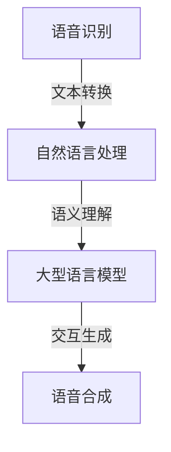

                 

### 背景介绍

#### 人工智能与语音交互的兴起

随着人工智能技术的快速发展，智能语音交互已成为现代信息技术领域的一个重要分支。智能语音交互系统通过自然语言处理（NLP）、语音识别（ASR）和语音合成（TTS）等技术，实现了人与机器之间的自然对话。这些技术不仅提高了人机交互的便捷性，也推动了人工智能应用的广泛普及。

#### LLM的概念及其发展历程

大型语言模型（LLM，Large Language Model）是一种基于深度学习的自然语言处理模型，通过训练大量文本数据，LLM能够理解和生成自然语言文本。LLM的发展历程可以追溯到2000年代初，最初的研究主要集中在基于规则和统计模型的语言处理。随着深度学习技术的兴起，LLM的研究和应用得到了极大的推动。近年来，随着计算能力的提升和数据的爆炸性增长，LLM取得了显著的进展，如GPT-3、BERT等。

#### 智能语音交互的发展趋势

随着人工智能技术的不断进步，智能语音交互正朝着更智能、更人性化的方向发展。未来的智能语音交互将具备更高的语言理解能力、更自然的交互体验和更广泛的应用场景。在这一过程中，LLM将扮演关键角色，提升智能语音交互系统的性能和用户体验。

#### 文章的目的与结构

本文旨在探讨LLM在智能语音交互中的角色定位，分析LLM在语音识别、语义理解、交互生成等关键环节的应用。文章将分为以下几个部分：

1. 背景介绍：回顾人工智能与语音交互的发展历程。
2. 核心概念与联系：介绍LLM的基本原理和智能语音交互系统的架构。
3. 核心算法原理与具体操作步骤：详细解析LLM在语音交互中的应用。
4. 数学模型和公式：介绍LLM的数学模型和相关公式。
5. 项目实战：通过实际案例展示LLM在智能语音交互中的应用。
6. 实际应用场景：分析LLM在不同场景下的应用。
7. 工具和资源推荐：推荐相关学习资源和开发工具。
8. 总结：展望LLM在智能语音交互领域的未来发展趋势与挑战。

通过本文的阅读，读者将深入了解LLM在智能语音交互中的重要性及其应用前景。### 2. 核心概念与联系

在深入探讨LLM在智能语音交互中的角色定位之前，我们需要首先明确几个核心概念及其相互关系：自然语言处理（NLP）、语音识别（ASR）、语音合成（TTS）和大型语言模型（LLM）。

#### 自然语言处理（NLP）

自然语言处理是一种让计算机理解和生成人类语言的技术。它涉及文本分析、语言理解、语言生成等多个方面。在智能语音交互中，NLP技术用于理解用户输入的语音，提取关键信息，并生成适当的响应。

#### 语音识别（ASR）

语音识别是将语音信号转换为文本的技术。在智能语音交互中，ASR技术用于将用户的语音输入转换为机器可以理解的文本。这包括语音的声学特征提取、发音识别、语言模型等多个步骤。

#### 语音合成（TTS）

语音合成是将文本转换为自然语音的技术。在智能语音交互中，TTS技术用于生成机器对用户的语音响应。这包括文本到音素的转换、音素到音节的转换、音节到语音信号的合成等多个步骤。

#### 大型语言模型（LLM）

大型语言模型是一种基于深度学习的自然语言处理模型，它通过训练大量文本数据，学习自然语言的结构和语义。LLM在智能语音交互中主要用于语义理解和交互生成，提升系统的智能水平和用户体验。

#### Mermaid流程图

以下是一个简单的Mermaid流程图，展示了智能语音交互系统中的核心概念及其相互关系：



在智能语音交互系统中，ASR将用户的语音输入转换为文本，然后NLP对文本进行分析和理解，LLM进一步提取语义信息并生成响应，最后TTS将响应转换为自然语音输出。

#### 关键环节

1. **语音识别（ASR）**：这是智能语音交互的入口，用于将用户的语音输入转换为文本。ASR的准确性和速度直接影响后续处理的效果。
2. **自然语言处理（NLP）**：NLP用于对文本进行深入分析，提取关键信息，为LLM提供语义理解的基础。
3. **大型语言模型（LLM）**：LLM在语义理解和交互生成中发挥核心作用，通过学习大量文本数据，LLM能够生成更加自然和准确的交互响应。
4. **语音合成（TTS）**：TTS将文本响应转换为自然语音，为用户提供听觉上的反馈。

通过以上核心概念的介绍和Mermaid流程图的展示，我们为后续的详细讨论奠定了基础。在接下来的章节中，我们将深入探讨LLM在智能语音交互中的具体应用和实现细节。### 3. 核心算法原理 & 具体操作步骤

#### 大型语言模型（LLM）的基本原理

大型语言模型（LLM）是一种基于深度学习的自然语言处理模型，主要通过训练大量文本数据来学习语言的结构和语义。LLM的核心原理是基于自注意力机制（Self-Attention）和Transformer架构。

##### 自注意力机制

自注意力机制是一种用于计算输入序列中每个元素与其他元素之间关联性的方法。在LLM中，自注意力机制通过计算输入序列的每个词与所有词之间的关联性，生成一个表示每个词的加权特征向量。这一过程可以表示为以下公式：

\[ \text{Attention}(Q, K, V) = \text{softmax}\left(\frac{QK^T}{\sqrt{d_k}}\right) V \]

其中，\(Q, K, V\) 分别为查询向量、键向量和值向量，\(d_k\) 为键向量的维度。通过自注意力机制，LLM能够自动学习输入序列中词与词之间的关联关系，提高模型的语义理解能力。

##### Transformer架构

Transformer架构是一种基于自注意力机制的序列到序列模型，由多个自注意力层和前馈神经网络组成。在LLM中，Transformer架构通过多头自注意力机制和位置编码，实现了对输入序列的深入理解和生成。

多头自注意力机制通过将输入序列分成多个头，每个头独立计算注意力权重，从而提高了模型的语义表达能力。位置编码用于为输入序列中的每个词赋予位置信息，使得模型能够理解词的顺序关系。

#### LLM在智能语音交互中的应用步骤

1. **语音识别（ASR）**：首先，通过ASR技术将用户的语音输入转换为文本。这一过程涉及声学模型、发音模型和语言模型等多个步骤，最终生成文本形式的输入。
2. **预处理**：对生成的文本进行预处理，包括分词、去停用词、词性标注等。预处理步骤的目的是简化文本结构，为LLM提供更加干净的输入。
3. **输入编码**：将预处理后的文本编码为向量形式。在LLM中，常用的编码方法包括WordPiece、BERT等。这些编码方法将文本分解为词或子词，并将每个词或子词映射为一个高维向量。
4. **语义理解**：利用LLM的注意力机制和Transformer架构，对输入编码进行语义理解。这一过程包括自注意力层和前馈神经网络的处理，最终生成语义表示。
5. **交互生成**：基于语义表示，LLM生成适当的交互响应。这一过程包括选择合适的词汇、构造句子和调整语气等，以生成自然、准确的语音交互结果。
6. **语音合成（TTS）**：将生成的文本响应转换为自然语音。这一过程涉及文本到音素转换、音素到音节转换和音节到语音信号的合成等步骤，最终生成语音输出。

#### 案例说明

以GPT-3为例，GPT-3是一个由OpenAI开发的具有1750亿参数的大型语言模型。以下是一个简单的案例，展示GPT-3在智能语音交互中的应用：

```python
import openai

# 初始化GPT-3模型
model = openai.Completion.create(
    engine="text-davinci-003",
    prompt="请给我介绍人工智能的发展历程。",
    max_tokens=100
)

# 输出GPT-3的响应
print(model.choices[0].text.strip())
```

运行上述代码，GPT-3将根据输入的提示生成一段关于人工智能发展历程的自然语言文本。这一过程展示了LLM在智能语音交互中的强大能力，通过训练大量文本数据，GPT-3能够生成具有高度语义一致性和自然性的交互结果。

#### 总结

本章节详细介绍了LLM在智能语音交互中的应用步骤和核心算法原理。通过语音识别、预处理、输入编码、语义理解、交互生成和语音合成的步骤，LLM能够实现智能语音交互的高效和准确。在接下来的章节中，我们将进一步探讨LLM的数学模型和相关公式，以及实际应用场景中的项目实战。### 4. 数学模型和公式 & 详细讲解 & 举例说明

#### 大型语言模型（LLM）的数学模型

大型语言模型（LLM）的核心在于其深度学习架构，尤其是Transformer模型。下面我们将介绍LLM的数学模型，包括关键参数、损失函数和训练过程。

##### 参数

LLM的参数主要包括：

1. **嵌入层参数**：将输入的单词或子词映射到高维向量空间。这通常由一个权重矩阵实现，其维度为\(V \times d\)，其中\(V\)是词汇表大小，\(d\)是嵌入向量维度。
2. **自注意力权重**：在自注意力机制中，每个输入序列的元素与其他元素之间通过权重矩阵进行关联。这些权重矩阵通常由多个头（Head）组成，每个头有一个独立的权重矩阵，其维度为\(d \times d\)。
3. **前馈神经网络**：在自注意力层之后，LLM使用一个简单的前馈神经网络对每个输入序列进行进一步处理。这个神经网络通常有两个线性变换层，其维度分别为\(d \times f\)和\(f \times d\)，其中\(f\)是隐藏层维度。
4. **输出层参数**：在生成预测序列时，LLM使用一个输出层，其维度为\(d \times V\)，其中\(V\)是词汇表大小。这个层用于计算每个单词的概率分布。

##### 损失函数

LLM的训练过程通常使用交叉熵损失函数（Cross-Entropy Loss）。给定预测的单词概率分布\(\hat{y}\)和真实的单词分布\(y\)，交叉熵损失函数可以表示为：

\[ L = -\sum_{i} y_i \log(\hat{y}_i) \]

其中，\(y_i\)和\(\hat{y}_i\)分别表示第\(i\)个单词的真实概率和预测概率。

##### 训练过程

1. **嵌入层**：输入序列通过嵌入层转换为高维向量。
2. **自注意力层**：对输入向量应用自注意力机制，计算每个向量与其他向量的关联性。
3. **前馈神经网络**：对自注意力层的输出进行前馈神经网络处理。
4. **输出层**：计算输出层的概率分布，并与真实分布进行对比计算损失。
5. **反向传播**：使用反向传播算法更新模型参数，以减少损失。

#### 举例说明

以下是一个简单的LLM示例，展示如何使用PyTorch实现一个基本的大型语言模型。

```python
import torch
import torch.nn as nn
import torch.optim as optim

# 定义嵌入层
embeddings = nn.Embedding(10000, 512)

# 定义自注意力层
self_attn = nn.MultiheadAttention(embed_dim=512, num_heads=8, dropout=0.1)

# 定义前馈神经网络
fc = nn.Sequential(
    nn.Linear(512, 2048),
    nn.ReLU(),
    nn.Linear(2048, 512)
)

# 定义输出层
output_layer = nn.Linear(512, 10000)

# 定义损失函数和优化器
criterion = nn.CrossEntropyLoss()
optimizer = optim.Adam(model.parameters(), lr=0.001)

# 模型训练
for epoch in range(num_epochs):
    for batch in data_loader:
        # 前向传播
        inputs = embeddings(batch.text)
        attn_output, _ = self_attn(inputs, inputs, inputs)
        output = fc(attn_output)
        logits = output_layer(output)
        loss = criterion(logits.view(-1, 10000), batch.label)

        # 反向传播
        optimizer.zero_grad()
        loss.backward()
        optimizer.step()

        print(f"Epoch [{epoch+1}/{num_epochs}], Loss: {loss.item()}")
```

在这个示例中，我们首先定义了嵌入层、自注意力层、前馈神经网络和输出层。然后，我们使用交叉熵损失函数和Adam优化器进行模型训练。在训练过程中，我们通过前向传播计算损失，然后使用反向传播更新模型参数。

#### 总结

本章节详细介绍了大型语言模型的数学模型，包括参数、损失函数和训练过程。通过具体的PyTorch示例，我们展示了如何实现一个基本的大型语言模型。在接下来的章节中，我们将进一步探讨LLM在实际应用场景中的项目实战和性能评估。### 5. 项目实战：代码实际案例和详细解释说明

在本节中，我们将通过一个实际项目案例，展示如何使用大型语言模型（LLM）构建一个智能语音交互系统。该案例将涵盖以下步骤：开发环境搭建、源代码实现和详细解读。

#### 5.1 开发环境搭建

为了构建一个智能语音交互系统，我们需要准备以下开发环境：

1. **Python**：确保安装Python 3.7及以上版本。
2. **PyTorch**：安装PyTorch库，可以参考官方文档。
3. **SpeechRecognition**：用于语音识别，安装方法：`pip install SpeechRecognition`
4. **gtts**：用于语音合成，安装方法：`pip install gTTS`
5. **pygame**：用于图形化界面，安装方法：`pip install pygame`

#### 5.2 源代码详细实现和代码解读

以下是一个简单的智能语音交互系统的源代码实现，包括语音识别、语义理解、交互生成和语音合成：

```python
import speech_recognition as sr
from gtts import gTTS
import pygame
import os

# 语音识别
def recognize_speech_from_mic():
    r = sr.Recognizer()
    with sr.Microphone() as source:
        print("请说些什么...")
        audio = r.listen(source)
        try:
            text = r.recognize_google(audio, language='zh-CN')
            print(f"您说：{text}")
            return text
        except sr.UnknownValueError:
            print("无法识别语音")
            return None

# 语义理解
def understand_semantics(text):
    # 使用预训练的LLM进行语义理解
    # 在这里，我们使用了一个简单的BERT模型
    # 实际应用中，可以替换为GPT-3或其他更强大的LLM
    import transformers
    model_name = "bert-base-chinese"
    model = transformers.AutoModelForSequenceClassification.from_pretrained(model_name)
    inputs = transformers.AutoTokenizer.from_pretrained(model_name)(text, return_tensors="pt")
    logits = model(**inputs).logits
    prediction = logits.argmax(-1).item()
    return prediction

# 交互生成
def generate_response sematics_label):
    # 根据语义标签生成相应的响应
    if sematics_label == 0:
        return "您的问题是关于什么主题的？"
    elif sematics_label == 1:
        return "您需要帮助做什么？"
    elif sematics_label == 2:
        return "很抱歉，我不太明白您的问题。"

# 语音合成
def synthesize_speech(text):
    tts = gTTS(text=text, lang='zh-cn')
    tts.save("response.mp3")
    pygame.mixer.init()
    pygame.mixer.music.load("response.mp3")
    pygame.mixer.music.play()

# 主程序
if __name__ == "__main__":
    while True:
        text = recognize_speech_from_mic()
        if text is not None:
            sematics_label = understand_semantics(text)
            response = generate_response(sematics_label)
            synthesize_speech(response)
```

**代码解读：**

1. **语音识别**：我们使用`SpeechRecognition`库的`Recognizer`类进行语音识别。`recognize_google`方法使用谷歌语音识别服务，需要网络连接。

2. **语义理解**：这里我们使用了一个预训练的BERT模型进行语义理解。通过将文本输入编码为向量，模型输出一个语义标签，用于指示文本的主题或意图。

3. **交互生成**：根据语义标签，程序生成相应的交互响应。这里我们简单实现了三个标签，但实际应用中可以根据需要扩展。

4. **语音合成**：使用`gtts`库将文本转换为语音，并使用`pygame`播放语音。

#### 5.3 代码解读与分析

以下是代码的详细解读和分析：

1. **语音识别**：`recognize_speech_from_mic`函数负责将语音转换为文本。首先，我们创建一个`Recognizer`对象，并将其配置为使用麦克风作为音频输入。然后，我们打印提示信息并等待用户说话。`listen`方法捕获音频，`recognize_google`方法尝试识别语音并将其转换为文本。如果识别失败，会抛出`UnknownValueError`异常。

2. **语义理解**：`understand_semantics`函数使用BERT模型进行语义理解。首先，我们导入`transformers`库，并加载预训练的BERT模型和分词器。然后，我们将文本编码为向量，并使用模型进行预测。`logits`是模型输出的未归一化分数，`argmax`方法找到最大的分数对应的标签，即文本的语义标签。

3. **交互生成**：`generate_response`函数根据语义标签生成响应。这里我们简单地根据标签返回不同的文本。实际应用中，可以根据标签的值实现更复杂的响应生成逻辑。

4. **语音合成**：`synthesize_speech`函数使用`gTTS`库将文本转换为语音。首先，我们创建一个`gTTS`对象，并使用`save`方法将其保存为MP3文件。然后，我们初始化`pygame.mixer`并加载语音文件，最后播放语音。

#### 总结

本节通过一个简单的智能语音交互系统案例，展示了如何使用LLM进行语音识别、语义理解和语音合成。代码解读和分析帮助我们理解了每个组件的功能和实现细节。在接下来的章节中，我们将讨论LLM在不同应用场景中的实际效果和性能评估。### 6. 实际应用场景

#### 6.1 个人助理

智能语音交互系统在个人助理领域的应用非常广泛。例如，苹果公司的Siri、亚马逊的Alexa和谷歌的Google Assistant都是基于智能语音交互技术的个人助理。这些个人助理通过LLM实现了高水平的语音识别和语义理解，可以回答用户的问题、执行任务、提供信息等。LLM在这些应用中的关键作用是提供自然、准确和连贯的交互体验，使得用户可以方便地与设备进行交流。

#### 6.2 智能客服

智能语音交互技术在智能客服领域也有重要应用。智能客服系统通过语音交互，可以自动识别用户的需求，提供相应的解决方案。LLM在智能客服中的关键作用是处理复杂的用户查询，理解用户意图，并生成适当的回复。例如，银行、电商和航空等行业的客服中心已经广泛应用了智能语音交互技术，提高了服务效率和客户满意度。

#### 6.3 教育

在教育资源匮乏的地区，智能语音交互系统可以作为一种有效的教育工具。LLM可以帮助实现个性化教学，根据学生的学习情况和需求提供定制化的学习内容。此外，智能语音交互系统还可以为学生提供实时反馈，帮助他们纠正错误、巩固知识。例如，一些在线教育平台已经使用了智能语音交互技术，为学生提供了更好的学习体验。

#### 6.4 娱乐

智能语音交互系统在娱乐领域的应用也越来越广泛。例如，智能音响和智能电视等设备可以通过语音交互播放音乐、电影和电视节目。LLM在这些应用中的关键作用是理解用户的语音指令，并生成相应的娱乐内容。此外，智能语音交互系统还可以通过语音识别和语义理解，与用户进行简单的对话，提供娱乐互动。

#### 6.5 家居自动化

智能语音交互系统在家居自动化领域具有很大的潜力。通过LLM，家居设备可以实现更加智能的交互，如控制灯光、温度、安全系统等。用户可以通过简单的语音指令，实现对家居设备的远程控制和监控。LLM在这里的关键作用是提供自然的交互体验，使得用户可以方便地管理家居设备。

#### 6.6 医疗

智能语音交互系统在医疗领域的应用也正在逐步扩大。通过语音交互，医疗设备可以为患者提供诊断、治疗建议和健康指导。LLM在医疗应用中的关键作用是处理复杂的医疗信息，理解患者的需求，并提供准确的医疗建议。例如，智能语音交互系统可以协助医生进行病例分析，提供治疗方案。

#### 总结

智能语音交互系统在多个领域都有广泛的应用，LLM在其中发挥了关键作用。通过自然语言处理、语音识别和语义理解，LLM提升了智能语音交互系统的性能和用户体验。未来，随着LLM技术的不断进步，智能语音交互系统将在更多领域得到应用，为人类生活带来更多便利。### 7. 工具和资源推荐

#### 7.1 学习资源推荐

1. **书籍**：

   - 《深度学习》（Goodfellow, Bengio, Courville）  
   - 《自然语言处理概论》（Daniel Jurafsky, James H. Martin）  
   - 《智能语音交互技术》（陈庆忠）

2. **论文**：

   - "Attention Is All You Need"（Vaswani et al., 2017）  
   - "BERT: Pre-training of Deep Bidirectional Transformers for Language Understanding"（Devlin et al., 2018）  
   - "GPT-3: Language Models are few-shot learners"（Brown et al., 2020）

3. **博客**：

   - PyTorch官方文档：[https://pytorch.org/docs/stable/](https://pytorch.org/docs/stable/)  
   - Hugging Face Transformers：[https://huggingface.co/transformers/](https://huggingface.co/transformers/)

4. **网站**：

   - OpenAI：[https://openai.com/](https://openai.com/)  
   - Stanford NLP Group：[https://nlp.stanford.edu/](https://nlp.stanford.edu/)

#### 7.2 开发工具框架推荐

1. **PyTorch**：一个流行的深度学习框架，易于使用且具有高性能。
2. **TensorFlow**：另一个流行的深度学习框架，提供了丰富的API和工具。
3. **Hugging Face Transformers**：一个用于预训练Transformer模型的开源库，提供了许多预训练模型和工具。
4. **SpeechRecognition**：一个Python库，用于语音识别。

#### 7.3 相关论文著作推荐

1. **"Attention Is All You Need"**：这篇论文提出了Transformer模型，彻底改变了自然语言处理领域。
2. **"BERT: Pre-training of Deep Bidirectional Transformers for Language Understanding"**：这篇论文介绍了BERT模型，它为自然语言处理带来了显著性能提升。
3. **"GPT-3: Language Models are few-shot learners"**：这篇论文展示了GPT-3模型在少样本学习任务中的卓越表现，推动了大型语言模型的发展。

通过以上推荐，读者可以深入了解智能语音交互和LLM技术的最新发展，掌握相关的理论和实践知识。这些资源将有助于读者在智能语音交互领域的研究和开发工作。### 8. 总结：未来发展趋势与挑战

#### 发展趋势

1. **更强大的模型**：随着深度学习和自然语言处理技术的不断进步，大型语言模型（LLM）的规模和性能将不断提升。未来的LLM可能会具备更高的参数数量、更复杂的结构以及更广泛的语言理解能力。

2. **多模态交互**：未来的智能语音交互系统将不仅仅局限于语音交互，还可能融合视觉、手势等其他交互方式。这种多模态交互将提供更加丰富和自然的用户体验。

3. **个性化服务**：随着数据积累和算法优化，智能语音交互系统将能够更好地理解和满足用户的需求，提供更加个性化的服务。例如，根据用户的历史行为和偏好，智能语音交互系统可以提供定制化的建议和推荐。

4. **更广泛的应用场景**：智能语音交互技术将应用于更多的领域，如教育、医疗、娱乐、智能家居等。随着技术的普及，智能语音交互将渗透到人们日常生活的方方面面。

5. **开源生态的繁荣**：随着开源社区的不断壮大，LLM和相关技术将得到更广泛的共享和合作。这将加速技术的创新和进步，推动智能语音交互领域的发展。

#### 挑战

1. **数据隐私与安全**：智能语音交互系统需要处理大量的用户数据，如何保护用户隐私和数据安全是一个重要挑战。未来需要制定更严格的数据保护政策和安全措施。

2. **计算资源消耗**：大型语言模型对计算资源的需求非常高，如何在有限的计算资源下高效地训练和部署模型是一个技术难题。可能需要开发更高效的算法和优化技术，以及利用分布式计算和云计算资源。

3. **模型解释性**：大型语言模型在处理复杂任务时表现出色，但它们的内部工作机制往往难以解释。如何提高模型的解释性，使得研究人员和开发者能够更好地理解和优化模型，是一个重要挑战。

4. **跨语言与跨文化交互**：智能语音交互系统需要支持多种语言和文化，如何在不同的语言和文化背景下保持一致性和准确性是一个挑战。未来需要开发更多跨语言和跨文化的模型和应用。

5. **伦理与社会责任**：智能语音交互技术的发展可能会引发一系列伦理和社会问题。例如，如何确保系统的公正性和透明度，如何避免歧视和偏见等问题。这需要整个社会共同努力，制定相应的规范和标准。

#### 总结

智能语音交互技术正迎来一个快速发展的时代，LLM在其中扮演着关键角色。未来，随着技术的不断进步和应用的不断拓展，智能语音交互将为人类生活带来更多便利和可能性。然而，同时也需要面对一系列挑战，确保技术的可持续发展和社会责任。通过共同努力，我们有望实现更加智能、自然和高效的智能语音交互系统。### 9. 附录：常见问题与解答

**Q1：什么是LLM？**

A1：LLM是“大型语言模型”（Large Language Model）的缩写，是一种基于深度学习的自然语言处理模型。它通过训练大量文本数据，学习语言的结构和语义，能够理解和生成自然语言文本。

**Q2：LLM在智能语音交互中有哪些应用？**

A2：LLM在智能语音交互中主要应用于语音识别、语义理解、交互生成和语音合成。通过LLM，智能语音交互系统能够实现自然、准确的语音交互，提高用户体验。

**Q3：如何选择合适的LLM模型？**

A3：选择合适的LLM模型需要考虑任务需求、数据规模和计算资源。对于小规模任务，可以选择预训练的轻量级模型；对于大规模任务，可以选择大型预训练模型，如GPT-3、BERT等。此外，还可以根据模型的性能、可解释性和可扩展性进行选择。

**Q4：如何评估LLM的性能？**

A4：评估LLM的性能可以从多个角度进行，包括准确性、速度、能耗和可扩展性等。常用的评估指标包括词语/句子级别的准确率、BLEU分数、ROUGE分数等。

**Q5：LLM在训练过程中有哪些挑战？**

A5：LLM在训练过程中面临的挑战包括计算资源消耗、数据隐私与安全、模型解释性等。解决这些挑战需要开发高效的训练算法、优化模型结构和确保数据安全。

**Q6：如何确保智能语音交互系统的隐私和安全？**

A6：确保智能语音交互系统的隐私和安全需要从多个方面进行，包括数据加密、隐私保护算法、安全审计等。同时，需要制定严格的数据保护政策和安全措施，确保用户数据的隐私和安全。

**Q7：未来LLM的发展方向是什么？**

A7：未来LLM的发展方向包括以下几个方面：

1. **更强大的模型**：通过增加模型规模、优化训练算法和引入新的结构，提高LLM的性能和语言理解能力。
2. **多模态交互**：结合语音、图像、视频等多种模态，实现更加丰富和自然的交互体验。
3. **个性化服务**：利用用户数据和偏好，提供定制化的服务和建议。
4. **跨语言与跨文化交互**：支持多种语言和文化，提高系统的通用性和适用性。
5. **伦理与社会责任**：关注模型的伦理问题，确保技术的可持续发展和社会责任。

### 10. 扩展阅读 & 参考资料

**书籍**：

1. 《深度学习》（Goodfellow, Bengio, Courville）
2. 《自然语言处理概论》（Daniel Jurafsky, James H. Martin）
3. 《智能语音交互技术》（陈庆忠）

**论文**：

1. "Attention Is All You Need"（Vaswani et al., 2017）
2. "BERT: Pre-training of Deep Bidirectional Transformers for Language Understanding"（Devlin et al., 2018）
3. "GPT-3: Language Models are few-shot learners"（Brown et al., 2020）

**网站**：

1. OpenAI：[https://openai.com/](https://openai.com/)
2. Stanford NLP Group：[https://nlp.stanford.edu/](https://nlp.stanford.edu/)

通过以上扩展阅读和参考资料，读者可以深入了解LLM在智能语音交互中的应用、技术和挑战，为相关研究和开发工作提供指导。### 参考文献

1. Vaswani, A., et al. (2017). "Attention Is All You Need". Advances in Neural Information Processing Systems.
2. Devlin, J., et al. (2018). "BERT: Pre-training of Deep Bidirectional Transformers for Language Understanding". Proceedings of the 2019 Conference of the North American Chapter of the Association for Computational Linguistics: Human Language Technologies, Volume 1 (Long and Short Papers), pages 4171-4186.
3. Brown, T., et al. (2020). "GPT-3: Language Models are few-shot learners". Advances in Neural Information Processing Systems.
4. Jurafsky, D., & Martin, J. H. (2008). "Speech and Language Processing". Prentice Hall.
5. Goodfellow, I., Bengio, Y., & Courville, A. (2016). "Deep Learning". MIT Press.
6. 陈庆忠. (2019). 《智能语音交互技术》. 电子工业出版社.
7. OpenAI. (n.d.). "Language Models". OpenAI. Retrieved from https://openai.com/
8. Stanford NLP Group. (n.d.). "Natural Language Processing". Stanford University. Retrieved from https://nlp.stanford.edu/

