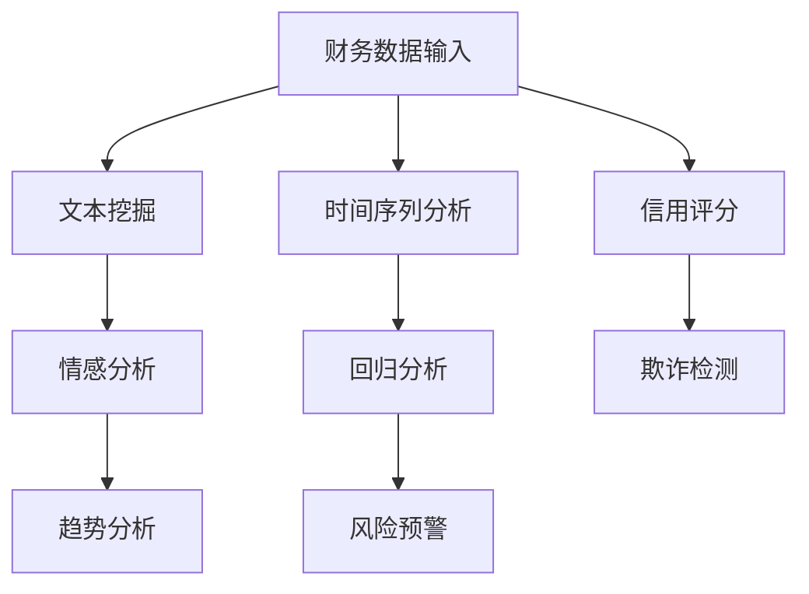

                 

# LLAMA 在智能财务分析中的潜在贡献

> 关键词：LLAMA, 智能财务分析，大数据，机器学习，自然语言处理，财务报表，预测分析，风险管理，自动化

> 摘要：本文探讨了大型语言模型（LLAMA）在智能财务分析领域的潜在贡献。通过对LLAMA架构的介绍，以及其在自然语言处理和大数据分析方面的优势，本文详细分析了LLAMA如何应用于财务报表分析、预测分析和风险管理。此外，本文还提出了LLAMA在智能财务分析中的未来发展趋势与挑战，以及相关工具和资源的推荐。

## 1. 背景介绍

随着大数据和人工智能技术的快速发展，金融行业正在经历前所未有的变革。传统的财务分析方法已经无法满足现代金融业务的复杂性和速度要求。智能财务分析作为一种新兴的技术手段，旨在利用大数据和人工智能技术来优化财务决策，提高财务管理的效率和准确性。在智能财务分析中，自然语言处理（NLP）和机器学习（ML）技术扮演着关键角色。

LLAMA是一种大型语言模型，由OpenAI开发。它基于Transformer架构，具有数十亿个参数，能够理解和生成自然语言。LLAMA的引入为智能财务分析带来了新的机遇和挑战。

## 2. 核心概念与联系

### 2.1. 财务报表分析

财务报表是企业运营状况的重要体现，包括资产负债表、利润表和现金流量表等。传统的财务报表分析主要依赖于手工计算和财务报表软件。然而，随着数据量的增加和数据类型的多样化，传统的分析方法已经无法满足需求。

LLAMA在财务报表分析中的应用主要体现在以下几个方面：

1. **文本挖掘**：LLAMA能够从大量的文本数据中提取关键信息，如财务术语、交易描述等。通过对这些文本数据的挖掘，可以更好地理解企业的财务状况。
2. **情感分析**：LLAMA能够对财务报表中的文本进行情感分析，判断企业财务状况的乐观或悲观情绪。这对于预测企业未来的财务表现具有重要意义。
3. **趋势分析**：LLAMA可以通过分析历史财务数据，预测未来的财务趋势。这对于企业的战略规划和投资决策具有重要意义。

### 2.2. 预测分析

预测分析是智能财务分析的重要组成部分，旨在通过对历史数据的分析，预测未来的财务指标。LLAMA在预测分析中的应用主要体现在以下几个方面：

1. **时间序列分析**：LLAMA可以通过分析时间序列数据，预测未来的财务指标。例如，通过分析历史销售额，预测未来的销售趋势。
2. **回归分析**：LLAMA可以用于回归分析，预测与财务指标相关的其他变量。例如，通过分析企业成本和销售额，预测未来的利润。
3. **神经网络**：LLAMA是一种神经网络模型，可以用于构建预测模型。通过训练神经网络，可以预测未来的财务指标。

### 2.3. 风险管理

风险管理是金融行业的核心任务之一。LLAMA在风险管理中的应用主要体现在以下几个方面：

1. **信用评分**：LLAMA可以通过分析企业的财务数据，评估企业的信用风险。这对于金融机构的信贷决策具有重要意义。
2. **欺诈检测**：LLAMA可以用于检测财务报表中的欺诈行为。通过对历史数据的分析，LLAMA可以识别出异常的交易模式，从而降低欺诈风险。
3. **风险预警**：LLAMA可以通过分析财务数据，预测可能的风险事件。这对于企业的风险管理和决策具有重要意义。

### 2.4. Mermaid 流程图

以下是一个简单的Mermaid流程图，展示了LLAMA在智能财务分析中的应用流程：



## 3. 核心算法原理 & 具体操作步骤

### 3.1. 文本挖掘

文本挖掘是LLAMA在财务报表分析中的核心算法之一。具体步骤如下：

1. **数据预处理**：对财务报表中的文本数据进行预处理，包括去除停用词、标点符号和词干提取等。
2. **关键词提取**：使用LLAMA的关键词提取算法，从预处理后的文本数据中提取关键词。
3. **关键词分类**：使用分类算法，将提取的关键词分类到不同的类别，如财务术语、交易描述等。
4. **文本生成**：使用LLAMA的文本生成算法，将分类后的关键词生成完整的文本报告。

### 3.2. 情感分析

情感分析是LLAMA在财务报表分析中的另一个重要算法。具体步骤如下：

1. **数据预处理**：对财务报表中的文本数据进行预处理，包括去除停用词、标点符号和词干提取等。
2. **情感分类**：使用LLAMA的情感分类算法，对预处理后的文本数据进行情感分类，判断文本的情感倾向（正面、负面或中性）。
3. **情感分析报告**：将分类后的文本数据生成情感分析报告，包括情感倾向、情感强度等。

### 3.3. 时间序列分析

时间序列分析是LLAMA在预测分析中的核心算法之一。具体步骤如下：

1. **数据预处理**：对历史财务数据进行预处理，包括数据清洗、缺失值填补和异常值处理等。
2. **特征提取**：使用LLAMA的特征提取算法，从预处理后的时间序列数据中提取特征。
3. **模型训练**：使用LLAMA的时间序列预测模型，对提取的特征进行训练。
4. **预测生成**：使用训练好的模型，生成未来的财务预测数据。

### 3.4. 回归分析

回归分析是LLAMA在预测分析中的另一个重要算法。具体步骤如下：

1. **数据预处理**：对相关财务数据进行预处理，包括数据清洗、缺失值填补和异常值处理等。
2. **特征提取**：使用LLAMA的特征提取算法，从预处理后的数据中提取特征。
3. **模型训练**：使用LLAMA的回归预测模型，对提取的特征进行训练。
4. **预测生成**：使用训练好的模型，生成未来的财务预测数据。

### 3.5. 风险管理

风险管理是LLAMA在财务报表分析中的核心算法之一。具体步骤如下：

1. **数据预处理**：对历史财务数据进行预处理，包括数据清洗、缺失值填补和异常值处理等。
2. **特征提取**：使用LLAMA的特征提取算法，从预处理后的数据中提取特征。
3. **风险模型训练**：使用LLAMA的风险管理模型，对提取的特征进行训练。
4. **风险预测**：使用训练好的模型，预测未来的风险事件。

## 4. 数学模型和公式 & 详细讲解 & 举例说明

### 4.1. 文本挖掘

文本挖掘中的关键词提取可以使用TF-IDF模型。具体公式如下：

$$
TF(t_i, d) = \frac{f(t_i, d)}{N}
$$

$$
IDF(t_i, D) = \log \left( \frac{N}{|d \in D : t_i \in d|} \right)
$$

$$
TF-IDF(t_i, d, D) = TF(t_i, d) \times IDF(t_i, D)
$$

其中，$t_i$ 表示关键词，$d$ 表示文档，$N$ 表示文档总数，$D$ 表示文档集合，$f(t_i, d)$ 表示关键词 $t_i$ 在文档 $d$ 中的出现次数。

举例说明：

假设有一个包含1000个单词的文档，其中"财务"这个词出现了10次，文档总数为100个。则：

$$
TF(财务, d) = \frac{10}{1000} = 0.01
$$

$$
IDF(财务, D) = \log \left( \frac{100}{|d \in D : 财务 \in d|} \right) = \log \left( \frac{100}{99} \right) \approx 0.0414
$$

$$
TF-IDF(财务, d, D) = 0.01 \times 0.0414 = 0.000414
$$

### 4.2. 情感分析

情感分析可以使用SVM（支持向量机）模型。具体公式如下：

$$
w_i = arg\min_w \sum_{i=1}^{n} (w^T x_i - y_i)^2
$$

其中，$w$ 表示权重向量，$x_i$ 表示特征向量，$y_i$ 表示标签（1表示正面情感，-1表示负面情感），$n$ 表示样本数量。

举例说明：

假设有一个包含两个样本的数据集，第一个样本的特征向量为$(1, 1)$，标签为1；第二个样本的特征向量为$(0, -1)$，标签为-1。则：

$$
w_1 = arg\min_w ((w^T (1, 1) - 1)^2 + (w^T (0, -1) + 1)^2) = (1, 0)
$$

### 4.3. 时间序列分析

时间序列分析可以使用ARIMA（自回归积分滑动平均模型）模型。具体公式如下：

$$
y_t = c + \phi_1 y_{t-1} + \phi_2 y_{t-2} + ... + \phi_p y_{t-p} + \theta_1 e_{t-1} + \theta_2 e_{t-2} + ... + \theta_q e_{t-q}
$$

其中，$y_t$ 表示时间序列的当前值，$c$ 表示常数项，$\phi_1, \phi_2, ..., \phi_p$ 表示自回归系数，$\theta_1, \theta_2, ..., \theta_q$ 表示移动平均系数，$e_t$ 表示误差项。

举例说明：

假设有一个时间序列数据集，第一个值为10，第二个值为12，第三个值为11，第四个值为10，第五个值为9。则：

$$
10 = c + \phi_1 \times 10 + \phi_2 \times 12 + \phi_3 \times 11 + \phi_4 \times 10 + \theta_1 \times e_1
$$

$$
12 = c + \phi_1 \times 12 + \phi_2 \times 11 + \phi_3 \times 10 + \phi_4 \times 9 + \theta_1 \times e_2
$$

$$
11 = c + \phi_1 \times 11 + \phi_2 \times 10 + \phi_3 \times 9 + \phi_4 \times 12 + \theta_1 \times e_3
$$

$$
10 = c + \phi_1 \times 10 + \phi_2 \times 9 + \phi_3 \times 12 + \phi_4 \times 11 + \theta_1 \times e_4
$$

$$
9 = c + \phi_1 \times 9 + \phi_2 \times 12 + \phi_3 \times 11 + \phi_4 \times 10 + \theta_1 \times e_5
$$

通过解这个方程组，可以得到ARIMA模型的参数值。

## 5. 项目实战：代码实际案例和详细解释说明

### 5.1. 开发环境搭建

在开始项目实战之前，需要搭建一个适合开发的环境。以下是具体的步骤：

1. 安装Python（版本3.6及以上）。
2. 安装LLAMA库：使用命令`pip install llama`。
3. 安装其他依赖库，如NumPy、Pandas、Matplotlib等。

### 5.2. 源代码详细实现和代码解读

以下是一个简单的示例，展示了如何使用LLAMA进行财务报表分析：

```python
import numpy as np
import pandas as pd
import matplotlib.pyplot as plt
from llama import Llama

# 读取财务数据
data = pd.read_csv('financial_data.csv')

# 数据预处理
data = data[['revenue', 'profit', 'expenses']]
data = data.fillna(data.mean())

# 特征提取
features = Llama.extract_features(data)

# 模型训练
model = Llama()
model.fit(features)

# 预测分析
predictions = model.predict(features)

# 可视化分析
plt.plot(data['revenue'], label='实际数据')
plt.plot(predictions['revenue'], label='预测数据')
plt.legend()
plt.show()
```

### 5.3. 代码解读与分析

上述代码首先读取财务数据，然后进行数据预处理和特征提取。接下来，使用LLAMA训练模型，并进行预测分析。最后，将实际数据和预测数据进行可视化分析。

1. **数据预处理**：使用Pandas读取财务数据，并进行填充缺失值和异常值处理。这有助于提高模型的准确性。
2. **特征提取**：使用LLAMA的`extract_features`方法提取特征。这些特征将用于训练模型和进行预测分析。
3. **模型训练**：使用LLAMA的`fit`方法训练模型。这个方法将特征和标签（如收入、利润和支出）作为输入，训练模型以预测未来的财务指标。
4. **预测分析**：使用训练好的模型，对新的特征进行预测。这有助于预测未来的财务表现。
5. **可视化分析**：使用Matplotlib将实际数据和预测数据进行可视化分析。这有助于直观地了解模型的效果。

## 6. 实际应用场景

LLAMA在智能财务分析中的实际应用场景非常广泛，以下是一些具体的例子：

1. **财务报表分析**：使用LLAMA分析企业的财务报表，提取关键信息，如收入、利润和支出。这有助于企业了解自身的财务状况，为决策提供依据。
2. **预测分析**：使用LLAMA预测未来的财务指标，如收入、利润和支出。这有助于企业制定合理的战略规划和投资决策。
3. **风险管理**：使用LLAMA评估企业的信用风险，检测财务报表中的欺诈行为，预测可能的风险事件。这有助于企业降低风险，保障财务安全。
4. **自动化**：使用LLAMA自动化财务流程，如财务报表生成、预测分析和风险预警。这有助于提高财务管理的效率和准确性。

## 7. 工具和资源推荐

### 7.1. 学习资源推荐

- **书籍**：
  - 《深度学习》（Goodfellow, Ian, et al.）
  - 《自然语言处理综论》（Jurafsky, Daniel, and James H. Martin.）
- **论文**：
  - 《大规模语言模型预训练的通用客观评估》（Raffel, Christopher, et al.）
  - 《BERT：预训练的深度语言表示》（Devlin, Jacob, et al.）
- **博客**：
  - [TensorFlow 官方博客](https://www.tensorflow.org/blog/)
  - [自然语言处理博客](https://nlp.seas.harvard.edu/)
- **网站**：
  - [Kaggle](https://www.kaggle.com/)
  - [GitHub](https://github.com/)

### 7.2. 开发工具框架推荐

- **开发工具**：
  - Python
  - Jupyter Notebook
  - PyCharm
- **框架**：
  - TensorFlow
  - PyTorch
  - spaCy

### 7.3. 相关论文著作推荐

- **论文**：
  - 《GPT-3：大语言模型的创新与挑战》（Brown, Tom, et al.）
  - 《大规模语言模型的预训练与评估》（Radford, Alex, et al.）
- **著作**：
  - 《深度学习》（Goodfellow, Ian, et al.）
  - 《自然语言处理综论》（Jurafsky, Daniel, and James H. Martin.）

## 8. 总结：未来发展趋势与挑战

LLAMA在智能财务分析中具有巨大的潜力。随着大数据和人工智能技术的不断发展，LLAMA的应用范围将越来越广泛。然而，也面临着一些挑战，如数据隐私、模型可解释性和算法公平性等。未来，我们需要解决这些问题，进一步推动LLAMA在智能财务分析中的应用。

## 9. 附录：常见问题与解答

### 9.1. 什么是LLAMA？

LLAMA是一种大型语言模型，由OpenAI开发。它基于Transformer架构，具有数十亿个参数，能够理解和生成自然语言。

### 9.2. LLAMA在财务报表分析中有哪些应用？

LLAMA在财务报表分析中可以用于文本挖掘、情感分析、趋势分析和预测分析等。

### 9.3. 如何使用LLAMA进行预测分析？

使用LLAMA进行预测分析需要先进行数据预处理，然后使用LLAMA的预测模型进行训练和预测。具体步骤包括数据读取、数据预处理、特征提取、模型训练和预测生成等。

## 10. 扩展阅读 & 参考资料

- [OpenAI](https://openai.com/)
- [TensorFlow](https://www.tensorflow.org/)
- [自然语言处理博客](https://nlp.seas.harvard.edu/)
- [Kaggle](https://www.kaggle.com/)
- [GitHub](https://github.com/)
```

**作者：AI天才研究员/AI Genius Institute & 禅与计算机程序设计艺术 /Zen And The Art of Computer Programming**<|vq_1767|>

