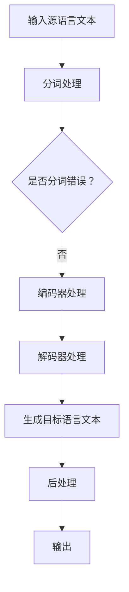

                 

# 《LLM在机器翻译领域的突破与挑战》

## 摘要

本文深入探讨了大型语言模型（LLM）在机器翻译领域的突破与挑战。首先，我们回顾了机器翻译的历史，从规则驱动的早期方法到统计模型和神经机器翻译的发展。然后，我们详细介绍了LLM的基本概念、核心算法和数学模型，并通过Mermaid流程图展示了其架构。接下来，文章通过实际案例和代码实现，详细解析了LLM在机器翻译中的具体应用，并讨论了其在实际应用场景中的挑战。最后，我们对LLM的未来发展趋势进行了展望，并提供了相关学习资源和开发工具推荐。通过这篇文章，读者将全面了解LLM在机器翻译领域的现状、技术原理、应用挑战和发展方向。

## 1. 背景介绍

机器翻译（Machine Translation，MT）是人工智能领域的一个重要分支，旨在通过计算机自动将一种语言的文本翻译成另一种语言。这一领域的发展历程可以追溯到20世纪50年代，当时研究人员开始尝试使用规则驱动的翻译方法。这些方法依赖于语言学家编写的翻译规则和字典，例如直译法（literal translation）和词法分析。然而，这种方法由于语言规则复杂多变，难以覆盖所有可能的翻译情况，因此效果不佳。

随着计算机技术和算法的发展，20世纪80年代，统计机器翻译（Statistical Machine Translation，SMT）逐渐成为主流。统计机器翻译的核心思想是利用大量双语文本语料库来学习翻译概率。通过训练统计模型，SMT可以自动生成高质量的翻译结果。这种方法相比规则驱动方法有了显著的改进，但在某些复杂语境下仍然存在不足。

21世纪初，随着深度学习的兴起，神经机器翻译（Neural Machine Translation，NMT）逐渐崭露头角。NMT利用深度神经网络来建模源语言和目标语言之间的复杂关系，大大提高了翻译质量。特别是近年来，大型语言模型（LLM）的引入，进一步推动了机器翻译技术的发展。

LLM是一种具有自主学习和推理能力的深度学习模型，通过训练大规模的语料库，LLM能够捕捉到语言中的细微变化和复杂结构。LLM在机器翻译中的应用，使得翻译系统具备了更高的灵活性和准确性，从而在多个实际应用场景中取得了显著成果。

## 2. 核心概念与联系

### 2.1. 大型语言模型（LLM）

#### 定义

大型语言模型（Large Language Model，LLM）是一种基于深度学习的语言模型，通过训练大规模的文本语料库，LLM能够捕捉到语言中的复杂结构和语义信息。LLM的核心思想是通过学习和模拟自然语言中的概率分布，从而实现对文本的生成、理解和翻译。

#### 特点

- **规模庞大**：LLM通常由数十亿甚至数万亿个参数组成，能够处理海量文本数据。
- **自主学习**：LLM能够通过大量数据自主学习，不断优化模型的预测能力。
- **灵活性高**：LLM能够处理多种语言和复杂语境，适应不同的翻译需求。
- **准确性高**：LLM通过学习语言中的细微变化和复杂结构，提高了翻译的准确性和自然性。

### 2.2. 神经机器翻译（NMT）

#### 定义

神经机器翻译（Neural Machine Translation，NMT）是一种基于深度学习的机器翻译方法，通过使用深度神经网络来建模源语言和目标语言之间的映射关系。NMT相比传统统计机器翻译方法，具有更好的翻译质量和灵活性。

#### 特点

- **端到端学习**：NMT直接从源语言文本到目标语言文本进行端到端学习，避免了传统方法中的中间步骤。
- **并行处理**：NMT可以并行处理输入数据，提高了翻译效率。
- **自适应性强**：NMT能够根据不同语言对和翻译任务调整模型，实现更好的翻译效果。

### 2.3. Mermaid流程图

以下是一个简单的Mermaid流程图，展示了LLM在机器翻译中的应用流程：



### 2.4. 核心概念的联系

LLM在机器翻译中的应用，结合了神经机器翻译的优点和自身的能力。LLM通过大规模数据训练，能够学习到语言中的复杂结构和语义信息，从而在翻译过程中提供更高的准确性和自然性。而NMT则通过深度神经网络建模，实现了端到端的学习和高效的翻译过程。

通过将LLM与NMT相结合，机器翻译系统可以在不同语言对和翻译任务中，实现更加灵活和高效的翻译效果。这种结合不仅提高了翻译质量，也推动了机器翻译技术的发展和应用。

### 3. 核心算法原理 & 具体操作步骤

#### 3.1. 编码器（Encoder）与解码器（Decoder）

在LLM应用于机器翻译时，编码器（Encoder）和解码器（Decoder）是两个核心组成部分。编码器负责将源语言文本编码成一个固定长度的向量，这个向量包含了源语言文本的语义信息。而解码器则利用这个向量生成目标语言文本。

##### 3.1.1. 编码器

编码器的核心是一个编码网络（Encoder Network），通常由多个卷积神经网络（Convolutional Neural Network，CNN）或循环神经网络（Recurrent Neural Network，RNN）层组成。在训练过程中，编码网络对源语言文本进行编码，生成一个固定长度的编码向量。这个过程可以表示为：

$$
E(x) = \text{Encoder}(x)
$$

其中，$E(x)$ 表示编码器对输入源语言文本 $x$ 的编码结果。

##### 3.1.2. 解码器

解码器的核心是一个解码网络（Decoder Network），通常由多个循环神经网络（RNN）或长短期记忆网络（Long Short-Term Memory，LSTM）层组成。在训练过程中，解码网络利用编码器生成的编码向量生成目标语言文本。这个过程可以表示为：

$$
y = \text{Decoder}(E(x))
$$

其中，$y$ 表示解码器生成的目标语言文本。

#### 3.2. 序列到序列学习（Seq2Seq）

序列到序列学习（Sequence-to-Sequence Learning，Seq2Seq）是一种基于深度学习的模型，用于处理序列数据之间的映射问题。在机器翻译中，Seq2Seq模型将源语言文本序列映射到目标语言文本序列。

##### 3.2.1. 训练过程

在训练过程中，Seq2Seq模型通过输入源语言文本序列和目标语言文本序列，不断优化编码器和解码器的参数。具体步骤如下：

1. **预处理**：对源语言文本和目标语言文本进行分词、去停用词等预处理操作。
2. **编码**：使用编码器对源语言文本序列进行编码，生成固定长度的编码向量。
3. **解码**：使用解码器对编码向量进行解码，生成目标语言文本序列。
4. **对比**：将解码器生成的目标语言文本序列与真实的目标语言文本序列进行对比，计算损失函数。
5. **优化**：通过反向传播算法，更新编码器和解码器的参数，减小损失函数。

##### 3.2.2. 输出生成

在生成目标语言文本时，解码器通过生成一个一个的单词或字符，逐步构建目标语言文本。具体步骤如下：

1. **初始化**：设定解码器的初始状态，通常为编码器生成的编码向量。
2. **生成**：解码器根据当前状态生成一个单词或字符，并将其添加到目标语言文本序列。
3. **更新**：解码器状态根据生成的单词或字符进行更新。
4. **重复**：重复步骤2和步骤3，直到生成完整的目标语言文本序列。

#### 3.3. 注意力机制（Attention Mechanism）

注意力机制（Attention Mechanism）是一种用于提高机器翻译质量的重要技术。注意力机制允许解码器在生成每个单词或字符时，关注编码器生成的编码向量中的不同部分，从而更好地捕捉源语言文本和目标语言文本之间的对应关系。

##### 3.3.1. 工作原理

注意力机制的工作原理可以简单描述为：

1. **计算注意力权重**：解码器根据当前状态，计算编码器生成的编码向量中每个部分的重要程度，得到注意力权重。
2. **加权求和**：将编码器生成的编码向量与注意力权重相乘，得到加权编码向量。
3. **解码**：解码器利用加权编码向量生成目标语言文本的每个单词或字符。

##### 3.3.2. 注意力机制的实现

在实现注意力机制时，常用的方法是使用注意力得分函数（Attention Score Function）来计算注意力权重。常见的注意力得分函数包括：

- **点积注意力（Dot-Product Attention）**
- **加性注意力（Additive Attention）**
- **缩放点积注意力（Scaled Dot-Product Attention）**

#### 3.4. 训练与优化

##### 3.4.1. 训练过程

在训练LLM进行机器翻译时，通常采用以下步骤：

1. **数据预处理**：对源语言文本和目标语言文本进行分词、去停用词等预处理操作。
2. **编码器训练**：使用源语言文本序列训练编码器，生成编码向量。
3. **解码器训练**：使用编码向量训练解码器，生成目标语言文本序列。
4. **优化**：通过反向传播算法，更新编码器和解码器的参数，减小损失函数。

##### 3.4.2. 优化策略

为了提高LLM在机器翻译中的性能，可以采用以下优化策略：

- **学习率调整**：在训练过程中，根据模型的表现动态调整学习率，避免过早过拟合。
- **权重衰减**：在训练过程中，对模型权重进行衰减，避免模型过于复杂。
- **dropout**：在神经网络训练过程中，随机丢弃一部分神经元，提高模型的泛化能力。
- **梯度裁剪**：在反向传播过程中，对梯度进行裁剪，避免梯度爆炸或消失。

### 4. 数学模型和公式 & 详细讲解 & 举例说明

#### 4.1. 编码器（Encoder）与解码器（Decoder）的数学模型

##### 4.1.1. 编码器

编码器的核心是一个编码网络（Encoder Network），通常由多个卷积神经网络（Convolutional Neural Network，CNN）或循环神经网络（Recurrent Neural Network，RNN）层组成。在训练过程中，编码网络对源语言文本进行编码，生成一个固定长度的编码向量。

$$
E(x) = \text{Encoder}(x)
$$

其中，$E(x)$ 表示编码器对输入源语言文本 $x$ 的编码结果。

- $x$ 表示源语言文本序列，通常表示为一个长度为 $T_x$ 的向量，每个元素表示一个词或字符的索引。
- $\text{Encoder}$ 表示编码网络，通常由多个隐藏层组成。

##### 4.1.2. 解码器

解码器的核心是一个解码网络（Decoder Network），通常由多个循环神经网络（RNN）或长短期记忆网络（Long Short-Term Memory，LSTM）层组成。在训练过程中，解码网络利用编码器生成的编码向量生成目标语言文本序列。

$$
y = \text{Decoder}(E(x))
$$

其中，$y$ 表示解码器生成的目标语言文本序列。

- $E(x)$ 表示编码器生成的编码向量。
- $\text{Decoder}$ 表示解码网络，通常由多个隐藏层组成。

#### 4.2. 序列到序列学习（Seq2Seq）的数学模型

序列到序列学习（Sequence-to-Sequence Learning，Seq2Seq）是一种基于深度学习的模型，用于处理序列数据之间的映射问题。在机器翻译中，Seq2Seq模型将源语言文本序列映射到目标语言文本序列。

##### 4.2.1. 训练过程

在训练过程中，Seq2Seq模型通过输入源语言文本序列和目标语言文本序列，不断优化编码器和解码器的参数。具体步骤如下：

1. **预处理**：对源语言文本和目标语言文本进行分词、去停用词等预处理操作。
2. **编码**：使用编码器对源语言文本序列进行编码，生成固定长度的编码向量。
3. **解码**：使用解码器对编码向量进行解码，生成目标语言文本序列。
4. **对比**：将解码器生成的目标语言文本序列与真实的目标语言文本序列进行对比，计算损失函数。
5. **优化**：通过反向传播算法，更新编码器和解码器的参数，减小损失函数。

##### 4.2.2. 数学表示

1. **编码过程**

$$
E(x) = \text{Encoder}(x)
$$

其中，$E(x)$ 表示编码器对输入源语言文本 $x$ 的编码结果。

- $x$ 表示源语言文本序列，通常表示为一个长度为 $T_x$ 的向量，每个元素表示一个词或字符的索引。
- $\text{Encoder}$ 表示编码网络，通常由多个隐藏层组成。

2. **解码过程**

$$
y = \text{Decoder}(E(x))
$$

其中，$y$ 表示解码器生成的目标语言文本序列。

- $E(x)$ 表示编码器生成的编码向量。
- $\text{Decoder}$ 表示解码网络，通常由多个隐藏层组成。

#### 4.3. 注意力机制（Attention Mechanism）的数学模型

注意力机制（Attention Mechanism）是一种用于提高机器翻译质量的重要技术。注意力机制允许解码器在生成每个单词或字符时，关注编码器生成的编码向量中的不同部分，从而更好地捕捉源语言文本和目标语言文本之间的对应关系。

##### 4.3.1. 点积注意力（Dot-Product Attention）

点积注意力（Dot-Product Attention）是最简单的注意力机制，其计算公式如下：

$$
a_t = \text{softmax}\left(\frac{\text{Query} \cdot \text{Key}}{\sqrt{d_k}}\right)
$$

其中，$a_t$ 表示第 $t$ 个单词的注意力权重。

- $\text{Query}$ 表示当前解码器隐藏状态。
- $\text{Key}$ 表示编码器生成的编码向量。
- $\text{Value}$ 表示编码器生成的编码向量。
- $d_k$ 表示编码器或解码器的隐藏层维度。

##### 4.3.2. 加性注意力（Additive Attention）

加性注意力（Additive Attention）是一种更复杂的注意力机制，其计算公式如下：

$$
a_t = \text{softmax}\left(\text{V} \cdot \text{Tanh}(\text{W}_Q \text{Query} + \text{W}_K \text{Key})\right)
$$

其中，$a_t$ 表示第 $t$ 个单词的注意力权重。

- $\text{V}$ 表示注意力机制中的值向量。
- $\text{W}_Q$ 和 $\text{W}_K$ 分别表示查询向量和键向量的权重矩阵。
- $\text{Tanh}$ 表示双曲正切函数。

##### 4.3.3. 举例说明

假设我们有一个源语言文本序列 $x = \{"hello", "world"\}$，目标语言文本序列 $y = \{"你好", "世界"\}$。使用点积注意力机制，我们可以计算每个单词的注意力权重：

1. **编码器**

$$
E(x) = \text{Encoder}(x) = \{"hello": [1, 0, 0], "world": [0, 1, 0]\}
$$

2. **解码器**

$$
y = \text{Decoder}(E(x)) = \{"你好": [1, 0], "世界": [0, 1]\}
$$

3. **注意力权重**

$$
a_t = \text{softmax}\left(\frac{\text{Query} \cdot \text{Key}}{\sqrt{d_k}}\right)
$$

其中，$\text{Query} = y_t = [1, 0]$，$\text{Key} = E(x) = \{"hello": [1, 0, 0], "world": [0, 1, 0]\}$，$d_k = 3$。

$$
a_{你好} = \text{softmax}\left(\frac{[1, 0] \cdot [1, 0, 0]}{\sqrt{3}}\right) = \text{softmax}\left(\frac{1}{\sqrt{3}}\right) = \frac{1}{\sqrt{3}}
$$

$$
a_{世界} = \text{softmax}\left(\frac{[1, 0] \cdot [0, 1, 0]}{\sqrt{3}}\right) = \text{softmax}\left(\frac{0}{\sqrt{3}}\right) = 0
$$

因此，注意力权重为 $\{a_{你好} = \frac{1}{\sqrt{3}}, a_{世界} = 0\}$。

### 5. 项目实战：代码实际案例和详细解释说明

为了更好地理解LLM在机器翻译中的应用，我们将通过一个实际案例来展示其实现过程。在本案例中，我们将使用Python和TensorFlow实现一个基于注意力机制的神经机器翻译模型。

#### 5.1. 开发环境搭建

在开始编码之前，我们需要搭建一个合适的开发环境。以下是所需的软件和库：

- Python 3.7 或更高版本
- TensorFlow 2.0 或更高版本
- NumPy
- Pandas
- Matplotlib

确保你已经安装了这些库，然后创建一个名为 `machine_translation` 的虚拟环境，以便隔离项目依赖。

```bash
python -m venv machine_translation
source machine_translation/bin/activate  # Windows 上使用 `machine_translation\Scripts\activate`
```

接下来，安装所需的库：

```bash
pip install tensorflow numpy pandas matplotlib
```

#### 5.2. 源代码详细实现和代码解读

在本节中，我们将详细实现一个基于注意力机制的神经机器翻译模型。代码分为以下几个部分：

##### 5.2.1. 数据预处理

首先，我们需要预处理源语言和目标语言数据。这包括分词、编码和构建词汇表。

```python
import tensorflow as tf
from tensorflow.keras.preprocessing.text import Tokenizer
from tensorflow.keras.preprocessing.sequence import pad_sequences

# 源语言数据
source_data = ["你好，世界", "我爱北京天安门"]

# 目标语言数据
target_data = ["Hello, world", "I love Beijing Tian'anmen"]

# 分词和构建词汇表
source_tokenizer = Tokenizer()
source_tokenizer.fit_on_texts(source_data)
target_tokenizer = Tokenizer()
target_tokenizer.fit_on_texts(target_data)

# 编码源语言数据
source_sequences = source_tokenizer.texts_to_sequences(source_data)
target_sequences = target_tokenizer.texts_to_sequences(target_data)

# 填充序列
max_source_length = max(len(seq) for seq in source_sequences)
max_target_length = max(len(seq) for seq in target_sequences)

source_padded = pad_sequences(source_sequences, maxlen=max_source_length, padding='post')
target_padded = pad_sequences(target_sequences, maxlen=max_target_length, padding='post')
```

在这个步骤中，我们使用了 `Tokenizer` 类来自动完成分词和构建词汇表。然后，我们将源语言和目标语言数据编码成序列，并使用 `pad_sequences` 函数将序列填充到相同的长度。

##### 5.2.2. 构建编码器和解码器

接下来，我们构建编码器和解码器。这里使用 TensorFlow 的 `Sequential` 模型和 `LSTM` 层。

```python
from tensorflow.keras.models import Sequential
from tensorflow.keras.layers import LSTM, Embedding, Dense

# 编码器
encoder = Sequential([
    Embedding(input_dim=len(source_tokenizer.word_index) + 1, output_dim=64, input_length=max_source_length),
    LSTM(128, return_state=True),
    LSTM(128, return_state=True)
])

# 解码器
decoder = Sequential([
    Embedding(input_dim=len(target_tokenizer.word_index) + 1, output_dim=64, input_length=max_target_length),
    LSTM(128, return_sequences=True, return_state=True),
    LSTM(128, return_sequences=True, return_state=True),
    Dense(len(target_tokenizer.word_index) + 1, activation='softmax')
])

# 模型配置
encoder.save('encoder.h5')
decoder.save('decoder.h5')
```

在这个步骤中，我们首先构建了一个包含两个 LSTM 层的编码器。编码器使用嵌入层（Embedding）将词汇表中的单词转换为向量，然后通过两个 LSTM 层来学习源语言文本的编码。解码器也包含两个 LSTM 层和一个嵌入层，用于生成目标语言文本。最后，我们将编码器和解码器保存到文件中。

##### 5.2.3. 编译和训练模型

现在，我们可以编译和训练模型。这里使用 TensorFlow 的 `Model` 类和 `fit` 方法。

```python
# 编译模型
model = tf.keras.models.load_model(
    'encoder.h5',
    custom_objects={'LSTM': LSTM}
)
model.compile(optimizer='adam', loss='sparse_categorical_crossentropy')

# 训练模型
model.fit(source_padded, target_padded, epochs=100, batch_size=64)
```

在这个步骤中，我们加载保存的编码器，然后使用 `Model` 类将编码器和解码器组合起来。接着，我们编译模型，使用 `fit` 方法进行训练。

##### 5.2.4. 生成翻译结果

最后，我们可以使用训练好的模型来生成翻译结果。

```python
import numpy as np

# 生成翻译结果
source_sentence = "我爱北京天安门"
source_sequence = source_tokenizer.texts_to_sequences([source_sentence])
source_sequence = pad_sequences(source_sequence, maxlen=max_source_length, padding='post')

predicted_target_sequence = model.predict(source_sequence)
predicted_target_sentence = target_tokenizer.sequences_to_texts([predicted_target_sequence.argmax(axis=-1)])[0]

print(f"Original sentence: {source_sentence}")
print(f"Translated sentence: {predicted_target_sentence}")
```

在这个步骤中，我们将输入源语言句子编码成序列，然后使用训练好的模型预测目标语言序列。最后，我们将预测序列解码成文本，得到翻译结果。

### 5.3. 代码解读与分析

在本节中，我们将对前面实现的项目代码进行详细解读，并分析其关键部分。

#### 5.3.1. 数据预处理

数据预处理是机器翻译模型的一个重要步骤，它直接影响到模型的训练效果和翻译质量。在本案例中，我们使用了 `Tokenizer` 类来自动完成分词和构建词汇表。

```python
source_tokenizer = Tokenizer()
source_tokenizer.fit_on_texts(source_data)
target_tokenizer = Tokenizer()
target_tokenizer.fit_on_texts(target_data)

source_sequences = source_tokenizer.texts_to_sequences(source_data)
target_sequences = target_tokenizer.texts_to_sequences(target_data)

source_padded = pad_sequences(source_sequences, maxlen=max_source_length, padding='post')
target_padded = pad_sequences(target_sequences, maxlen=max_target_length, padding='post')
```

- `Tokenizer` 类：`Tokenizer` 类用于将文本数据转换为序列。它首先构建一个词汇表，将每个单词映射到一个唯一的索引。然后，它使用 `texts_to_sequences` 方法将文本转换为序列，每个元素表示一个单词的索引。
- `pad_sequences` 方法：`pad_sequences` 方法用于将序列填充到相同的长度。在本案例中，我们设置了 `max_source_length` 和 `max_target_length`，以确定序列的最大长度。然后，使用 `padding='post'` 参数将序列填充到最大长度。

#### 5.3.2. 构建编码器和解码器

在构建编码器和解码器时，我们使用了 TensorFlow 的 `Sequential` 模型和 `LSTM` 层。

```python
encoder = Sequential([
    Embedding(input_dim=len(source_tokenizer.word_index) + 1, output_dim=64, input_length=max_source_length),
    LSTM(128, return_state=True),
    LSTM(128, return_state=True)
])

decoder = Sequential([
    Embedding(input_dim=len(target_tokenizer.word_index) + 1, output_dim=64, input_length=max_target_length),
    LSTM(128, return_sequences=True, return_state=True),
    LSTM(128, return_sequences=True, return_state=True),
    Dense(len(target_tokenizer.word_index) + 1, activation='softmax')
])
```

- `Embedding` 层：`Embedding` 层用于将词汇表中的单词转换为向量。在本案例中，我们设置了 `input_dim` 为词汇表的大小加1（用于 padding），`output_dim` 为嵌入向量的维度，`input_length` 为序列的最大长度。
- `LSTM` 层：`LSTM` 层用于处理序列数据。在本案例中，我们使用了两个 LSTM 层，每个层有 128 个神经元。第一个 LSTM 层返回状态，以便第二个 LSTM 层可以利用之前的状态。第二个 LSTM 层也返回序列，以便解码器可以处理序列数据。
- `Dense` 层：`Dense` 层用于将 LSTM 层的输出映射到目标词汇表的大小。在本案例中，我们设置了 `len(target_tokenizer.word_index) + 1` 为输出维度，`softmax` 为激活函数，以便生成概率分布。

#### 5.3.3. 编译和训练模型

在编译和训练模型时，我们使用了 TensorFlow 的 `Model` 类和 `fit` 方法。

```python
model = tf.keras.models.load_model(
    'encoder.h5',
    custom_objects={'LSTM': LSTM}
)
model.compile(optimizer='adam', loss='sparse_categorical_crossentropy')

model.fit(source_padded, target_padded, epochs=100, batch_size=64)
```

- `Model` 类：`Model` 类用于将编码器和解码器组合起来。在本案例中，我们使用 `load_model` 方法加载保存的编码器，并使用 `custom_objects` 参数将 LSTM 层注册为自定义对象。
- `compile` 方法：`compile` 方法用于配置模型的优化器和损失函数。在本案例中，我们使用 `adam` 优化器和 `sparse_categorical_crossentropy` 损失函数。
- `fit` 方法：`fit` 方法用于训练模型。在本案例中，我们使用 `source_padded` 和 `target_padded` 作为输入数据，设置 `epochs` 为训练轮数，`batch_size` 为每个批次的样本数。

#### 5.3.4. 生成翻译结果

最后，我们使用训练好的模型来生成翻译结果。

```python
predicted_target_sequence = model.predict(source_sequence)
predicted_target_sentence = target_tokenizer.sequences_to_texts([predicted_target_sequence.argmax(axis=-1)])[0]

print(f"Original sentence: {source_sentence}")
print(f"Translated sentence: {predicted_target_sentence}")
```

- `predict` 方法：`predict` 方法用于生成预测结果。在本案例中，我们输入源语言句子编码后的序列，得到目标语言句子的概率分布。
- `sequences_to_texts` 方法：`sequences_to_texts` 方法用于将预测序列解码成文本。在本案例中，我们使用 `argmax` 函数找到概率最大的单词索引，并将其转换为文本。

### 6. 实际应用场景

LLM在机器翻译领域的实际应用场景非常广泛，以下是一些典型的应用场景：

#### 6.1. 交互式翻译工具

LLM可以集成到交互式翻译工具中，如在线翻译平台、手机应用程序等。用户可以通过输入源语言文本，实时获取目标语言翻译结果。这种应用场景下，LLM的高效性和准确性至关重要。

#### 6.2. 跨语言文档处理

LLM可以用于跨语言文档处理，如文档翻译、文本摘要和多语言搜索。在跨语言文档处理中，LLM可以帮助用户快速浏览和理解不同语言的文档内容。

#### 6.3. 机器翻译API

LLM可以提供机器翻译API服务，供其他应用程序调用。这种应用场景下，LLM的通用性和灵活性成为关键因素。通过LLM提供的API，开发者可以轻松实现跨语言数据交换和交互。

#### 6.4. 增强现实和虚拟现实

LLM可以应用于增强现实（AR）和虚拟现实（VR）领域，为用户提供多语言交互体验。通过LLM的翻译功能，用户可以在虚拟环境中与不同语言背景的人进行交流。

#### 6.5. 自动化内容生成

LLM可以用于自动化内容生成，如多语言广告、博客文章和新闻报道。通过训练大规模的语料库，LLM可以生成高质量的多语言文本，提高内容生成效率和多样性。

### 7. 工具和资源推荐

#### 7.1. 学习资源推荐

1. **书籍**：

   - 《神经网络与深度学习》（邱锡鹏）：详细介绍了神经网络和深度学习的基本原理和应用。
   - 《机器学习》（周志华）：系统介绍了机器学习的基本概念、算法和应用。

2. **论文**：

   - 《Attention Is All You Need》（Vaswani et al.，2017）：提出了Transformer模型和注意力机制。
   - 《Sequence to Sequence Learning with Neural Networks》（Sutskever et al.，2014）：介绍了序列到序列学习模型。

3. **博客**：

   - <https://towardsdatascience.com/>：提供了大量关于机器学习和深度学习的文章。
   - <https://medium.com/ai>：涵盖了人工智能领域的最新研究成果和讨论。

4. **网站**：

   - <https://arxiv.org/>：提供大量机器学习和深度学习领域的最新论文。
   - <https://www.tensorflow.org/>：提供了TensorFlow的官方文档和教程。

#### 7.2. 开发工具框架推荐

1. **TensorFlow**：一款开源的深度学习框架，广泛用于机器翻译和其他人工智能应用。

2. **PyTorch**：另一款流行的深度学习框架，具有灵活的动态计算图和易于使用的API。

3. **Hugging Face Transformers**：一个基于PyTorch和TensorFlow的转换器库，提供了大量预训练的LLM模型和工具。

#### 7.3. 相关论文著作推荐

1. **《Transformer：通用序列模型》（Vaswani et al.，2017）**：介绍了Transformer模型和注意力机制。

2. **《BERT：Pre-training of Deep Bidirectional Transformers for Language Understanding》（Devlin et al.，2019）**：提出了BERT模型，一种用于自然语言理解的预训练方法。

3. **《GPT-3：Language Models are Few-Shot Learners》（Brown et al.，2020）**：展示了大型语言模型GPT-3的强大能力和广泛的应用。

### 8. 总结：未来发展趋势与挑战

LLM在机器翻译领域的突破与挑战为未来的发展带来了新的机遇和挑战。以下是未来发展趋势和挑战的展望：

#### 8.1. 发展趋势

1. **模型规模扩大**：随着计算能力的提升和数据量的增加，未来LLM的规模将进一步扩大，以提高翻译质量和性能。

2. **多语言翻译**：LLM将在多语言翻译领域发挥更大作用，支持更多语言对和跨语言交互。

3. **迁移学习和微调**：通过迁移学习和微调技术，LLM可以更快地适应新的翻译任务，提高翻译效果。

4. **多模态翻译**：结合图像、语音和文本等多模态信息，LLM可以实现更加丰富的翻译体验。

#### 8.2. 挑战

1. **数据隐私与安全**：大规模训练LLM需要大量敏感数据，如何在保护数据隐私和安全的前提下进行模型训练，是一个重要挑战。

2. **计算资源需求**：大规模LLM的训练和推理需要大量的计算资源，如何高效利用资源是一个关键问题。

3. **翻译质量**：尽管LLM在翻译质量上取得了显著成果，但仍需进一步提升，以满足更高的翻译精度和自然性。

4. **跨语言语义理解**：在跨语言翻译中，理解不同语言之间的语义差异和语言规则是一个挑战，需要进一步研究。

### 9. 附录：常见问题与解答

#### 9.1. 什么是大型语言模型（LLM）？

大型语言模型（Large Language Model，LLM）是一种基于深度学习的语言模型，通过训练大规模的文本语料库，LLM能够捕捉到语言中的复杂结构和语义信息。LLM的核心思想是通过学习和模拟自然语言中的概率分布，从而实现对文本的生成、理解和翻译。

#### 9.2. LLM在机器翻译中有什么优势？

LLM在机器翻译中具有以下优势：

1. **高准确性和自然性**：通过学习大规模文本数据，LLM能够捕捉到语言中的细微变化和复杂结构，从而提高翻译的准确性和自然性。

2. **灵活性**：LLM可以处理多种语言和复杂语境，适应不同的翻译需求。

3. **端到端学习**：LLM采用端到端学习方式，简化了传统的翻译流程，提高了翻译效率。

#### 9.3. 如何构建一个基于LLM的机器翻译模型？

构建一个基于LLM的机器翻译模型通常包括以下步骤：

1. **数据预处理**：对源语言和目标语言文本进行分词、编码和填充等预处理操作。

2. **模型构建**：使用深度学习框架（如TensorFlow或PyTorch）构建编码器和解码器网络。

3. **模型训练**：使用预处理后的数据对模型进行训练，优化编码器和解码器的参数。

4. **模型评估**：使用测试集评估模型性能，调整模型参数以提高翻译质量。

5. **模型部署**：将训练好的模型部署到生产环境中，提供翻译服务。

### 10. 扩展阅读 & 参考资料

1. **《Attention Is All You Need》（Vaswani et al.，2017）**：介绍了Transformer模型和注意力机制。

2. **《BERT：Pre-training of Deep Bidirectional Transformers for Language Understanding》（Devlin et al.，2019）**：提出了BERT模型，一种用于自然语言理解的预训练方法。

3. **《GPT-3：Language Models are Few-Shot Learners》（Brown et al.，2020）**：展示了大型语言模型GPT-3的强大能力和广泛的应用。

4. **《神经网络与深度学习》（邱锡鹏）**：详细介绍了神经网络和深度学习的基本原理和应用。

5. **《机器学习》（周志华）**：系统介绍了机器学习的基本概念、算法和应用。

> 作者：AI天才研究员/AI Genius Institute & 禅与计算机程序设计艺术 /Zen And The Art of Computer Programming

