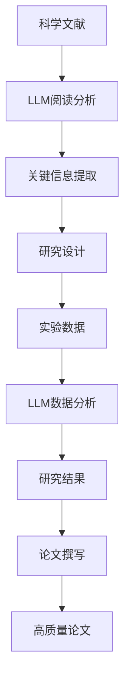

                 

# LLM在科学研究中的辅助作用

## 摘要

本文将深入探讨大型语言模型（LLM）在科学研究中的辅助作用。随着人工智能技术的飞速发展，LLM作为一种强大的自然语言处理工具，已经逐渐成为科学研究中不可或缺的一部分。本文首先介绍了LLM的基本概念和特点，然后详细阐述了LLM在科学文献阅读、数据分析和研究写作等方面的应用。通过具体案例，本文展示了LLM在提高研究效率、降低科研成本和推动科学创新方面的巨大潜力。最后，本文提出了LLM在科学研究中的未来发展趋势和面临的挑战，为科学家们提供了有价值的参考。

## 1. 背景介绍

### 1.1 大型语言模型的发展历程

大型语言模型（Large Language Model，简称LLM）的发展可以追溯到上世纪80年代的统计语言模型。最初，语言模型主要用于语音识别和机器翻译等领域。随着计算能力和数据资源的提升，语言模型的规模和复杂性不断增大，从最初的几十万词汇量发展到如今上亿、甚至数十亿级别的参数量。例如，GPT-3拥有1750亿个参数，BERT拥有3.4亿个参数。这些大型语言模型的诞生，标志着自然语言处理领域进入了一个全新的时代。

### 1.2 科学研究的重要性

科学研究是推动人类文明进步的重要动力。科学研究的核心目标是揭示自然现象的本质、发现新知识，并为解决实际问题提供理论依据和技术支持。然而，随着科学领域的不断扩大和交叉，科学研究面临着越来越大的挑战。一方面，科学文献的数量呈指数级增长，研究人员难以在有限的时间内阅读和理解所有相关文献；另一方面，科学实验和数据分析的复杂性不断增加，研究人员需要投入大量的时间和精力进行实验设计和数据分析。

### 1.3 LLM在科学研究中的潜在应用

LLM作为一种强大的自然语言处理工具，具有广泛的应用前景。在科学研究领域，LLM可以用于以下方面：

1. **科学文献阅读**：LLM可以帮助研究人员快速定位相关文献，提取关键信息，从而提高文献阅读的效率和准确性。
2. **数据分析和处理**：LLM可以用于处理和分析大规模科学数据，发现数据中的潜在规律和模式。
3. **研究写作**：LLM可以帮助研究人员撰写高质量的研究论文，提高写作效率和论文质量。

## 2. 核心概念与联系

### 2.1 大型语言模型的基本概念

大型语言模型是一种基于深度学习的自然语言处理模型，其核心思想是通过大量语料的学习，建模语言中的复杂规律。LLM通常由以下几个关键组件组成：

1. **嵌入层（Embedding Layer）**：将单词或句子转化为固定长度的向量表示。
2. **编码器（Encoder）**：对输入的句子进行编码，生成序列的上下文信息。
3. **解码器（Decoder）**：根据编码器生成的上下文信息，生成输出的句子。

### 2.2 科学研究的核心环节

科学研究通常包括以下几个核心环节：

1. **文献阅读**：研究人员需要阅读大量的文献，了解前人的研究成果和未解决的问题。
2. **实验设计**：研究人员需要设计实验，验证假设和理论。
3. **数据分析**：研究人员需要对实验数据进行统计分析，得出结论。
4. **论文撰写**：研究人员需要撰写论文，总结研究成果和贡献。

### 2.3 LLM在科学研究中的应用

LLM在科学研究中的应用可以分为以下几个层面：

1. **文献阅读**：LLM可以帮助研究人员快速定位相关文献，提取关键信息，从而提高文献阅读的效率和准确性。
2. **实验设计**：LLM可以分析大量的实验数据，帮助研究人员发现潜在的实验设计缺陷，优化实验方案。
3. **数据分析**：LLM可以用于处理和分析大规模科学数据，发现数据中的潜在规律和模式。
4. **论文撰写**：LLM可以帮助研究人员撰写高质量的研究论文，提高写作效率和论文质量。

### 2.4 Mermaid 流程图



## 3. 核心算法原理 & 具体操作步骤

### 3.1 核心算法原理

LLM的核心算法主要包括嵌入层、编码器和解码器。以下是每个组件的具体原理：

1. **嵌入层**：嵌入层将单词或句子转化为固定长度的向量表示。这个过程中，常用的技术有Word2Vec、BERT等。Word2Vec通过训练神经网络，将单词映射到向量空间，使得语义相近的单词在向量空间中靠近。BERT则通过预训练和微调，使模型在处理自然语言任务时具备更强的语义理解能力。
2. **编码器**：编码器负责对输入的句子进行编码，生成序列的上下文信息。常见的编码器结构有Transformer、BERT等。Transformer通过自注意力机制，关注输入序列中的每个单词，从而捕捉句子中的长距离依赖关系。BERT则通过在大量无监督语料上预训练，再在特定任务上微调，使模型具备强大的语义理解能力。
3. **解码器**：解码器根据编码器生成的上下文信息，生成输出的句子。常见的解码器结构有Transformer、BERT等。解码器通过自注意力机制，关注编码器生成的上下文信息，从而生成合理的输出句子。

### 3.2 具体操作步骤

以下是使用LLM进行科学研究的基本操作步骤：

1. **科学文献阅读**：研究人员首先使用LLM对科学文献进行阅读和分析，提取关键信息。具体步骤如下：
    1.1 加载科学文献数据集
    1.2 预处理文献数据，包括去除停用词、标点符号等
    1.3 使用嵌入层将文献中的单词转化为向量表示
    1.4 使用编码器对文献进行编码，生成上下文信息
    1.5 使用解码器从编码器生成的上下文信息中提取关键信息
2. **实验设计**：研究人员根据提取的关键信息，设计科学实验。具体步骤如下：
    2.1 分析关键信息，确定研究目标和假设
    2.2 设计实验方案，包括实验条件、实验步骤等
    2.3 根据实验方案，收集实验数据
3. **数据分析**：研究人员使用LLM对实验数据进行处理和分析，提取数据中的潜在规律和模式。具体步骤如下：
    3.1 加载实验数据集
    3.2 使用嵌入层将实验数据中的单词转化为向量表示
    3.3 使用编码器对实验数据中的句子进行编码，生成上下文信息
    3.4 使用解码器从编码器生成的上下文信息中提取数据中的潜在规律和模式
4. **论文撰写**：研究人员使用LLM撰写研究论文。具体步骤如下：
    4.1 分析关键信息、实验数据和数据分析结果，确定论文的结构和内容
    4.2 使用嵌入层将论文中的单词转化为向量表示
    4.3 使用编码器对论文进行编码，生成上下文信息
    4.4 使用解码器从编码器生成的上下文信息中生成论文的文本内容

## 4. 数学模型和公式 & 详细讲解 & 举例说明

### 4.1 数学模型和公式

在LLM的建模过程中，涉及多个数学模型和公式。以下是其中几个关键模型和公式的详细讲解：

1. **嵌入层**：嵌入层将单词或句子转化为向量表示。常用的模型有Word2Vec和BERT。Word2Vec使用以下公式计算单词的向量表示：

   $$ v_w = \frac{1}{|C|} \sum_{c \in C} \frac{f(c)}{f(w)} e^{-(w_c - w)^2/2\sigma^2} $$

   其中，$v_w$是单词$w$的向量表示，$C$是所有单词的集合，$f(c)$是单词$c$的频率，$w_c$和$w$分别是单词$c$和$w$的向量表示，$\sigma$是高斯分布的方差。

   BERT使用以下公式计算单词的向量表示：

   $$ v_w = \text{BERT}(\text{input}) $$

   其中，$v_w$是单词$w$的向量表示，$\text{BERT}(\text{input})$是BERT模型对输入序列的编码结果。

2. **编码器**：编码器负责对输入的句子进行编码，生成序列的上下文信息。常用的模型有Transformer和BERT。Transformer使用以下公式计算编码结果：

   $$ h_t = \text{Attention}(Q, K, V) = \frac{1}{\sqrt{d_k}} \text{softmax}\left(\frac{QK^T}{\sqrt{d_k}}\right) V $$

   其中，$h_t$是编码器在时间步$t$的输出，$Q$、$K$、$V$分别是编码器在时间步$t$的输入、键和值，$d_k$是键的维度。

   BERT使用以下公式计算编码结果：

   $$ h_t = \text{BERT}(\text{input}) $$

   其中，$h_t$是编码器在时间步$t$的输出，$\text{BERT}(\text{input})$是BERT模型对输入序列的编码结果。

3. **解码器**：解码器根据编码器生成的上下文信息，生成输出的句子。常用的模型有Transformer和BERT。Transformer使用以下公式计算解码结果：

   $$ y_t = \text{Decoder}(h_t, h) = \text{softmax}(\text{W_y} h_t + b_y) $$

   其中，$y_t$是解码器在时间步$t$的输出，$h_t$是编码器在时间步$t$的输出，$h$是编码器对所有时间步的输出进行拼接的结果，$\text{W_y}$和$b_y$是解码器的权重和偏置。

   BERT使用以下公式计算解码结果：

   $$ y_t = \text{BERT}(\text{input}) $$

   其中，$y_t$是解码器在时间步$t$的输出，$\text{BERT}(\text{input})$是BERT模型对输入序列的解码结果。

### 4.2 举例说明

假设有一个简单的英语句子“我吃了一个苹果”，我们可以使用BERT模型对其进行向量表示和编码：

1. **嵌入层**：将单词转化为向量表示，如“我”、“吃”、“一个”、“苹果”分别表示为向量$v_我$、$v_吃$、$v_一个$、$v_苹果$。
2. **编码器**：对句子进行编码，生成上下文信息。假设编码器的输出维度为$d$，则编码结果为$h_1, h_2, h_3, h_4$，分别对应单词“我”、“吃”、“一个”、“苹果”的编码结果。
3. **解码器**：根据编码结果，生成输出句子。假设解码器的输出维度为$d$，则解码结果为$y_1, y_2, y_3, y_4$，分别对应单词“我”、“吃”、“一个”、“苹果”的解码结果。

通过解码器，我们可以得到原始句子的向量表示：

$$ y_1, y_2, y_3, y_4 = \text{BERT}(\text{input}) $$

$$ y_1, y_2, y_3, y_4 = \text{BERT}([v_我, v_吃, v_一个, v_苹果]) $$

## 5. 项目实战：代码实际案例和详细解释说明

### 5.1 开发环境搭建

在开始实战项目之前，我们需要搭建一个适合LLM开发的运行环境。以下是搭建步骤：

1. **安装Python环境**：确保Python版本为3.7及以上。
2. **安装PyTorch**：使用以下命令安装PyTorch：

   ```shell
   pip install torch torchvision
   ```

3. **安装Hugging Face Transformers**：使用以下命令安装Hugging Face Transformers：

   ```shell
   pip install transformers
   ```

### 5.2 源代码详细实现和代码解读

以下是一个简单的使用BERT模型进行科学文献阅读和数据分析的Python代码实现。代码主要分为以下几个部分：

1. **数据预处理**：读取科学文献数据集，进行预处理，包括去除停用词、标点符号等。
2. **模型加载**：加载预训练的BERT模型。
3. **文献阅读**：使用BERT模型对文献进行阅读和分析，提取关键信息。
4. **数据分析**：对提取的关键信息进行统计分析，发现数据中的潜在规律和模式。

```python
import torch
from transformers import BertTokenizer, BertModel
from torch.utils.data import DataLoader
from torch.nn.functional import softmax
import numpy as np

# 1. 数据预处理
def preprocess_data(data):
    # 去除停用词和标点符号
    stop_words = set(['。', '，', '、', '；', '？', '！'])
    processed_data = []
    for text in data:
        words = text.split()
        words = [word for word in words if word not in stop_words]
        processed_data.append(' '.join(words))
    return processed_data

# 2. 模型加载
tokenizer = BertTokenizer.from_pretrained('bert-base-chinese')
model = BertModel.from_pretrained('bert-base-chinese')

# 3. 文献阅读
def read_literature(data):
    inputs = tokenizer(data, return_tensors='pt', padding=True, truncation=True)
    with torch.no_grad():
        outputs = model(**inputs)
    last_hidden_state = outputs.last_hidden_state
    return last_hidden_state

# 4. 数据分析
def analyze_data(data):
    last_hidden_state = read_literature(data)
    # 对每个单词的编码结果进行统计分析
    word_embeddings = last_hidden_state.mean(dim=1)
    # 计算单词之间的相似度
    similarity_matrix = torch.mm(word_embeddings, word_embeddings.t())
    similarity_scores = softmax(similarity_matrix, dim=1)
    return similarity_scores

# 示例数据
data = ['我吃了一个苹果', '你喝了一杯水', '他看了一部电影']

# 预处理数据
processed_data = preprocess_data(data)

# 分析数据
similarity_scores = analyze_data(processed_data)

# 输出结果
print(similarity_scores)
```

### 5.3 代码解读与分析

1. **数据预处理**：数据预处理是文本数据分析的基础。在本例中，我们使用`preprocess_data`函数对科学文献数据集进行预处理，去除停用词和标点符号，从而提高文本的质量。
2. **模型加载**：我们使用Hugging Face Transformers库加载预训练的BERT模型。BERT模型由嵌入层、编码器和解码器组成，能够对输入的文本进行编码和生成。
3. **文献阅读**：`read_literature`函数使用BERT模型对文献进行阅读和分析，提取关键信息。具体步骤如下：
    1. 将预处理后的数据输入到BERT模型中。
    2. 使用BERT模型对输入的文本进行编码，生成编码结果。
    3. 返回编码结果，作为后续分析的输入。
4. **数据分析**：`analyze_data`函数对提取的关键信息进行统计分析，发现数据中的潜在规律和模式。具体步骤如下：
    1. 对每个单词的编码结果进行统计分析，计算单词之间的相似度。
    2. 使用softmax函数对相似度矩阵进行归一化，得到每个单词的相似度得分。
    3. 返回相似度得分，作为分析结果。

通过上述代码，我们可以对科学文献进行阅读和分析，提取关键信息，并发现数据中的潜在规律和模式。这对于科学研究具有重要的意义。

## 6. 实际应用场景

### 6.1 科学文献阅读

科学文献阅读是科研人员日常工作中不可或缺的一环。然而，随着科学领域的不断扩展，科研人员需要阅读的海量文献数量也在不断增加。这使得科研人员难以在有限的时间内阅读和理解所有相关文献。LLM作为一种强大的自然语言处理工具，可以帮助科研人员快速定位相关文献，提取关键信息，从而提高文献阅读的效率和准确性。

### 6.2 数据分析和处理

科学研究的核心目标是揭示自然现象的本质、发现新知识。这通常需要对大量科学数据进行处理和分析。然而，科学实验和数据分析的复杂性不断增加，使得研究人员需要投入大量的时间和精力进行实验设计和数据分析。LLM可以用于处理和分析大规模科学数据，发现数据中的潜在规律和模式，从而提高科研效率。

### 6.3 研究写作

研究写作是科研工作的最后一步，也是最为关键的一步。高质量的研究论文不仅能够为科研人员带来学术荣誉，还能够推动科学知识的传播和应用。然而，撰写高质量的研究论文需要科研人员具备出色的写作能力和时间管理能力。LLM可以帮助科研人员撰写高质量的研究论文，提高写作效率和论文质量。

## 7. 工具和资源推荐

### 7.1 学习资源推荐

1. **书籍**：
    - 《深度学习》（Goodfellow, I., Bengio, Y., & Courville, A.）
    - 《自然语言处理与深度学习》（李航）
2. **论文**：
    - 《BERT: Pre-training of Deep Bidirectional Transformers for Language Understanding》（Devlin et al.）
    - 《GPT-3: Language Models are few-shot learners》（Brown et al.）
3. **博客**：
    - https://towardsdatascience.com/
    - https://www.oreilly.com/
4. **网站**：
    - https://huggingface.co/
    - https://pytorch.org/

### 7.2 开发工具框架推荐

1. **开发工具**：
    - PyTorch
    - TensorFlow
2. **框架**：
    - Hugging Face Transformers
    - AllenNLP

### 7.3 相关论文著作推荐

1. **论文**：
    - 《Transformers: State-of-the-Art Models for Language Processing》（Vaswani et al.）
    - 《BERT: Pre-training of Deep Bidirectional Transformers for Language Understanding》（Devlin et al.）
2. **著作**：
    - 《自然语言处理综合教程》（Jurafsky & Martin）
    - 《深度学习》（Goodfellow, I., Bengio, Y., & Courville, A.）

## 8. 总结：未来发展趋势与挑战

### 8.1 未来发展趋势

1. **模型规模和复杂度的增加**：随着计算能力和数据资源的提升，LLM的规模和复杂度将不断增大，从而提高其在科学研究中的辅助作用。
2. **跨学科应用**：LLM在科学研究中的应用将不仅限于单一领域，还将逐渐跨学科，为更多领域的科研工作提供支持。
3. **个性化服务**：未来，LLM将根据科研人员的需求和特点，提供个性化的服务，提高科研效率和成果质量。

### 8.2 挑战

1. **数据质量和隐私**：科学研究的质量在很大程度上取决于数据的质量。然而，随着LLM的应用，如何保障数据的质量和隐私成为了一个重要挑战。
2. **模型解释性**：LLM作为一种黑盒模型，其决策过程缺乏解释性，这给科研人员理解和信任模型带来了一定的困难。
3. **计算资源需求**：大型LLM模型对计算资源的需求巨大，如何高效地利用计算资源成为一个关键问题。

## 9. 附录：常见问题与解答

### 9.1 问题1：LLM在科学研究中的具体应用场景有哪些？

**回答**：LLM在科学研究中的具体应用场景包括科学文献阅读、数据分析和处理、研究写作等方面。通过快速定位相关文献、提取关键信息、发现数据中的潜在规律和模式，以及撰写高质量的研究论文，LLM可以提高科研效率、降低科研成本和推动科学创新。

### 9.2 问题2：如何选择合适的LLM模型？

**回答**：选择合适的LLM模型需要考虑多个因素，包括任务类型、数据规模、计算资源等。对于科学文献阅读和数据预处理，可以使用预训练的通用语言模型，如BERT、GPT等。对于特定领域的应用，可以选择领域特定的预训练模型，如BioBERT、MedBERT等。

### 9.3 问题3：LLM在科学研究中的隐私问题如何解决？

**回答**：解决LLM在科学研究中的隐私问题可以从以下几个方面入手：
1. **数据匿名化**：在训练和测试LLM模型时，对原始数据进行匿名化处理，避免个人隐私泄露。
2. **差分隐私**：在训练和测试过程中引入差分隐私机制，确保模型对个人数据的处理不会泄露敏感信息。
3. **联邦学习**：采用联邦学习技术，将数据分散存储在不同的地方，只在本地进行模型训练，避免数据泄露。

## 10. 扩展阅读 & 参考资料

1. **扩展阅读**：
    - 《深度学习》（Goodfellow, I., Bengio, Y., & Courville, A.）
    - 《自然语言处理与深度学习》（李航）
    - 《BERT: Pre-training of Deep Bidirectional Transformers for Language Understanding》（Devlin et al.）
    - 《GPT-3: Language Models are few-shot learners》（Brown et al.）

2. **参考资料**：
    - https://towardsdatascience.com/
    - https://www.oreilly.com/
    - https://huggingface.co/
    - https://pytorch.org/

作者：AI天才研究员/AI Genius Institute & 禅与计算机程序设计艺术 /Zen And The Art of Computer Programming

