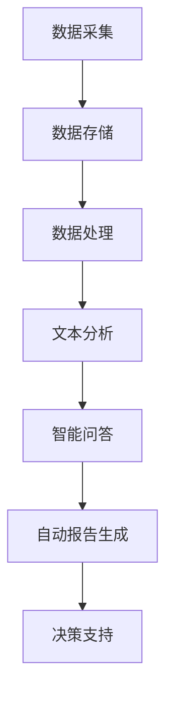

                 

### 背景介绍

**能源管理**，这一概念在现代社会中越来越受到重视。随着全球能源消耗的持续增长，以及环境污染问题的加剧，优化能源使用效率、实现资源的最优配置已经成为各个行业亟待解决的问题。能源管理不仅关乎到企业的经济效益，更关乎到社会的可持续发展。

近年来，随着人工智能（AI）技术的飞速发展，尤其是大规模语言模型（LLM）的兴起，将AI应用于能源管理领域，成为了一个备受关注的热点。LLM作为一种先进的自然语言处理技术，通过深度学习算法，能够从海量数据中提取信息、进行复杂推理和生成文本，这使得它在能源管理中具有广阔的应用前景。

首先，LLM能够处理大量的能源数据，包括发电量、用电量、能源消耗趋势等，通过数据分析，可以发现能源使用中的问题和优化空间。其次，LLM能够模拟不同的能源管理策略，评估其效果，帮助决策者做出最优的选择。此外，LLM还能够自动生成报告，提高能源管理的效率。

本文将深入探讨LLM在能源管理中的应用，包括其基本原理、核心算法、数学模型以及实际应用案例。我们将通过一步一步的推理和思考，揭示LLM在优化资源分配方面的巨大潜力。希望通过这篇文章，能够为读者提供一个全面、深入的了解，并激发更多研究者和从业者在这一领域的探索和创新。

### 核心概念与联系

在深入探讨LLM在能源管理中的应用之前，我们需要先理解几个核心概念，包括大规模语言模型（LLM）、自然语言处理（NLP）、深度学习（DL）以及能源管理系统的基本架构。

#### 大规模语言模型（LLM）

大规模语言模型（LLM）是一种利用深度学习技术训练的模型，旨在理解和生成自然语言。LLM通过学习海量文本数据，能够捕捉语言的统计规律和语义信息，从而实现文本的自动生成、语义理解、情感分析等功能。LLM的典型代表包括GPT（Generative Pre-trained Transformer）系列模型和BERT（Bidirectional Encoder Representations from Transformers）等。

#### 自然语言处理（NLP）

自然语言处理（NLP）是计算机科学和人工智能领域的一个重要分支，旨在使计算机能够理解、处理和生成人类语言。NLP涉及的任务包括文本分类、命名实体识别、情感分析、机器翻译、问答系统等。NLP技术是构建智能对话系统、信息检索系统和自动化内容审核系统的关键。

#### 深度学习（DL）

深度学习（DL）是一种基于多层神经网络的学习方法，通过逐层抽象特征，从原始数据中提取复杂的信息。深度学习在图像识别、语音识别、自然语言处理等领域取得了显著的成果。DL的核心是神经网络，特别是卷积神经网络（CNN）和循环神经网络（RNN）等。

#### 能源管理系统架构

能源管理系统通常包括数据采集、数据存储、数据处理和决策支持等几个关键环节。数据采集层负责从各类传感器、智能电表、电网监控设备等获取实时能源数据。数据存储层则用于存储海量数据，并提供快速检索和查询功能。数据处理层利用数据挖掘、机器学习和人工智能算法，对数据进行预处理、分析和建模。决策支持层则基于分析结果，提供能源使用优化建议和决策支持。

#### LLM与NLP、DL的关系

LLM是基于深度学习和NLP技术发展起来的，它能够处理和理解自然语言，从而在能源管理系统中发挥作用。具体来说，LLM可以用于以下几个方面：

1. **数据预处理**：LLM可以帮助对非结构化能源数据进行预处理，如文本数据清洗、标签生成等。
2. **文本分析**：LLM能够对能源相关的报告、通知、操作手册等文本进行自动分类、关键词提取和情感分析。
3. **智能问答**：LLM可以构建智能问答系统，为能源管理人员提供实时信息和决策支持。
4. **自动报告生成**：LLM可以根据分析结果自动生成详细的能源使用报告，提高管理效率。

#### Mermaid 流程图

为了更直观地展示LLM在能源管理系统中的应用，我们可以使用Mermaid绘制一个流程图。以下是流程图的Mermaid代码及其对应的解释：



**解释：**

- **A[数据采集]**：从各种传感器和设备中采集实时能源数据。
- **B[数据存储]**：将采集到的数据存储在数据库或数据仓库中，便于后续处理。
- **C[数据处理]**：利用LLM对数据进行预处理，包括清洗、归一化等。
- **D[文本分析]**：利用LLM对能源相关的文本进行分类、提取关键词等分析。
- **E[智能问答]**：构建智能问答系统，为用户提供实时信息和决策支持。
- **F[自动报告生成]**：根据分析结果，自动生成详细的能源使用报告。
- **G[决策支持]**：基于分析结果和报告，为能源管理人员提供决策支持。

通过上述核心概念和流程图的介绍，我们可以更清晰地理解LLM在能源管理系统中的应用。接下来，我们将深入探讨LLM的核心算法原理及其在能源管理中的具体应用。

#### LLM的核心算法原理

大规模语言模型（LLM）的核心算法基于深度学习和自然语言处理技术。其中，最常用的架构是Transformer模型，特别是由OpenAI开发的GPT系列模型。以下将详细介绍Transformer模型的工作原理，并解释其在LLM中的应用。

##### Transformer模型

Transformer模型是由Vaswani等人于2017年提出的一种基于自注意力机制的序列到序列模型，它在机器翻译任务中取得了突破性的成果。与传统的循环神经网络（RNN）和长短期记忆网络（LSTM）相比，Transformer模型在处理长距离依赖问题和并行计算方面具有显著优势。

Transformer模型主要包括编码器（Encoder）和解码器（Decoder）两部分。编码器负责将输入序列编码为固定长度的向量，解码器则将这些编码后的向量解码为目标序列。模型的核心组件是自注意力机制（Self-Attention），它能够自动学习输入序列中不同位置之间的依赖关系。

##### 自注意力机制

自注意力机制是Transformer模型的核心组件，其基本思想是每个词在生成时都与其输入序列中的所有词进行加权求和，从而自适应地关注不同的词。自注意力机制分为三个步骤：

1. **计算Query、Key、Value**：对于输入序列中的每个词，我们计算其对应的Query、Key和Value。通常，这三个向量由同一个线性层生成，即对于词向量`x_i`，计算`Q = W_Q x_i`、`K = W_K x_i`和`V = W_V x_i`。

2. **计算注意力得分**：计算每个Query与所有Key之间的相似度，得到注意力得分。具体地，我们使用点积注意力机制，计算得分`score = QK^T / sqrt(d_k)`，其中`d_k`是Key向量的维度。

3. **加权求和**：将注意力得分与对应的Value相乘，然后求和，得到加权求和的结果。这表示输入序列中的每个词对当前词的贡献。

##### 编码器和解码器的结构

编码器和解码器都包含多个相同的层，每层由多头自注意力机制和前馈神经网络组成。

1. **编码器**：编码器的输入是原始序列，每层都通过多头自注意力机制计算自注意力得分，然后将结果通过前馈神经网络进行非线性变换。编码器的输出是每个词的编码向量，这些向量被传递到解码器。

2. **解码器**：解码器的输入是编码器的输出和已生成的部分序列。每层解码器首先通过掩码自注意力机制计算自注意力得分，然后将结果与编码器的输出进行交叉注意力计算。最后，解码器通过前馈神经网络进行非线性变换。解码器的输出是生成的词的候选序列。

##### 在LLM中的应用

在LLM中，编码器和解码器共同工作，以生成目标序列。编码器将输入的文本序列编码为固定长度的向量，解码器则根据编码器的输出和已生成的部分序列生成下一个词。通过训练，模型能够学习到输入和输出之间的映射关系，从而实现高质量的文本生成。

具体来说，LLM在能源管理中的应用包括以下几个方面：

1. **数据预处理**：LLM可以帮助对能源数据进行预处理，如数据清洗、数据增强等。通过学习大量的文本数据，LLM能够自动识别和修复数据中的错误，提高数据质量。

2. **文本分析**：LLM能够对能源相关的报告、通知、操作手册等文本进行自动分类、关键词提取和情感分析。通过分析文本数据，LLM可以帮助能源管理人员更好地理解能源使用情况，发现问题并提出改进建议。

3. **智能问答**：LLM可以构建智能问答系统，为用户提供实时信息和决策支持。用户可以通过自然语言与系统进行交互，获取所需的能源数据和分析结果。

4. **自动报告生成**：LLM可以根据分析结果自动生成详细的能源使用报告，提高管理效率。这些报告可以包含能源消耗趋势、优化建议和决策分析等内容。

通过上述核心算法原理的介绍，我们可以看到LLM在能源管理中具有广泛的应用前景。接下来，我们将进一步探讨LLM在能源管理中的具体应用场景和操作步骤。

### 核心算法原理 & 具体操作步骤

在了解了大规模语言模型（LLM）的核心算法原理后，我们将进一步探讨其在能源管理中的具体应用步骤，包括算法的训练过程、数据处理流程以及如何利用LLM优化资源分配。

#### 算法训练过程

1. **数据收集与预处理**：首先，我们需要收集大量的能源数据，包括发电量、用电量、能源消耗趋势等。这些数据可以来自智能电网、传感器、智能电表等。收集到的数据通常包含噪声和缺失值，因此需要进行预处理，包括数据清洗、去重、填充缺失值等操作。

2. **数据标注**：对于文本数据，如报告、通知、操作手册等，需要对其进行标注。标注的过程包括分类标注（如文本分类任务）、实体标注（如命名实体识别）和情感标注（如情感分析）等。标注数据用于训练LLM，使其能够更好地理解能源相关的文本。

3. **模型训练**：使用预处理后的数据和标注数据，我们可以开始训练LLM。训练过程主要包括以下几个步骤：

   - **编码器训练**：编码器负责将输入序列编码为固定长度的向量。在训练过程中，我们通过反向传播算法更新编码器的参数，使其能够更好地捕捉输入序列的特征。

   - **解码器训练**：解码器负责生成目标序列。在训练过程中，我们通过梯度下降算法更新解码器的参数，使其能够更好地生成目标序列。

   - **联合训练**：编码器和解码器是联合训练的，即在一次训练过程中同时更新两者的参数。这样可以使编码器和解码器之间更好地协同工作，提高生成文本的质量。

4. **模型优化**：在训练过程中，我们可能需要对模型进行优化，包括调整学习率、批量大小等超参数，以提高模型的性能。

#### 数据处理流程

1. **数据清洗**：对收集到的能源数据进行清洗，包括去除噪声、填补缺失值等。清洗后的数据将用于模型的训练和预测。

2. **数据归一化**：对数据进行归一化处理，使其具有相似的尺度和范围。这样可以使模型更容易学习数据中的特征。

3. **特征提取**：对于文本数据，可以使用词袋模型、TF-IDF等特征提取方法，将文本转换为向量表示。对于非文本数据，如时间序列数据、传感器数据等，可以使用时间窗口、统计特征等方法进行特征提取。

4. **数据整合**：将不同来源的数据进行整合，形成一个统一的数据集。这样可以充分利用各种数据源的信息，提高模型的表现。

#### 优化资源分配

1. **需求预测**：利用LLM对能源需求进行预测，包括发电量、用电量等。通过预测未来一段时间内的能源需求，可以帮助决策者提前做好资源分配计划。

2. **资源分配**：根据预测结果和实际资源情况，对发电资源、储能资源、用电资源等进行优化分配。具体步骤如下：

   - **发电资源分配**：根据预测的发电需求，结合不同发电资源的发电成本、可用性等因素，优化发电资源的分配。例如，在高峰时段优先使用成本较低的清洁能源，如太阳能和风能。

   - **储能资源分配**：根据预测的用电需求波动，合理分配储能资源，以平衡供需关系。储能资源可以调节发电和用电之间的不匹配，提高系统的稳定性。

   - **用电资源分配**：根据预测的用电需求，合理分配电网负荷，优化用电资源的利用。例如，通过智能电网技术，实现对家庭、商业和工业用电的动态分配，提高电网的负载均衡。

3. **策略评估**：利用LLM模拟不同的资源分配策略，评估其效果。通过比较不同策略的能耗、成本、稳定性等指标，选择最优策略进行实施。

通过上述步骤，我们可以利用LLM优化能源管理中的资源分配。接下来，我们将进一步探讨LLM在能源管理中的数学模型和公式，以更深入地理解其原理和应用。

### 数学模型和公式 & 详细讲解 & 举例说明

在深入探讨LLM在能源管理中的应用时，数学模型和公式扮演着至关重要的角色。通过数学模型，我们可以准确地描述能源管理中的各种关系和优化目标。以下是LLM在能源管理中常用的几个数学模型和公式的详细讲解，以及具体的例子说明。

#### 1. 能源需求预测模型

能源需求预测是能源管理的重要一环，准确的预测有助于优化资源分配和降低成本。常用的能源需求预测模型包括时间序列模型、回归模型和神经网络模型。

**时间序列模型**：
时间序列模型通过分析历史数据中的时间序列特征，预测未来的能源需求。常见的时间序列模型包括ARIMA（AutoRegressive Integrated Moving Average）模型和LSTM（Long Short-Term Memory）模型。

**ARIMA模型**：
ARIMA模型是一种自回归积分滑动平均模型，其公式如下：
$$
y_t = c + \phi_1 y_{t-1} + \phi_2 y_{t-2} + ... + \phi_p y_{t-p} + \theta_1 e_{t-1} + \theta_2 e_{t-2} + ... + \theta_q e_{t-q}
$$
其中，$y_t$ 是时间序列的当前值，$c$ 是常数项，$\phi_i$ 和 $\theta_i$ 分别是自回归项和移动平均项的系数，$e_t$ 是白噪声序列。

**LSTM模型**：
LSTM模型是一种特殊的RNN模型，能够处理长距离依赖问题。LSTM的单元状态更新公式如下：
$$
i_t = \sigma(W_{ix} x_t + W_{ih} h_{t-1} + b_i) \\
f_t = \sigma(W_{fx} x_t + W_{fh} h_{t-1} + b_f) \\
\bar{C}_t = f_t \odot C_{t-1} + i_t \odot \sigma(W_{cx} x_t + W_{ch} h_{t-1} + b_c) \\
o_t = \sigma(W_{ox} x_t + W_{oh} h_{t-1} + b_o) \\
C_t = o_t \odot \bar{C}_t
$$
其中，$i_t$、$f_t$、$o_t$ 分别是输入门、遗忘门和输出门的状态，$C_t$ 是单元状态，$\odot$ 表示逐元素乘积，$\sigma$ 是Sigmoid激活函数。

**例子说明**：
假设我们使用LSTM模型预测下一小时的电力需求。给定历史电力需求数据 $y_1, y_2, ..., y_{n-1}$，我们可以通过训练LSTM模型来预测 $y_n$。

首先，我们需要准备训练数据集，将历史数据分成特征和标签两部分。特征部分包括前 $T$ 个小时的数据 $x_1, x_2, ..., x_T$，标签部分是下一个小时的需求 $y_n$。然后，使用训练数据集训练LSTM模型，通过调整模型的参数，使其能够准确地预测电力需求。

#### 2. 资源分配优化模型

在能源管理中，资源分配优化是一个典型的优化问题。我们可以使用线性规划（Linear Programming，LP）和整数规划（Integer Programming，IP）等方法来求解资源分配问题。

**线性规划模型**：
线性规划模型的公式如下：
$$
\text{minimize} \quad c^T x \\
\text{subject to} \quad Ax \leq b \\
x \geq 0
$$
其中，$c$ 是目标函数系数向量，$x$ 是决策变量向量，$A$ 和 $b$ 分别是约束条件的系数矩阵和常数向量。

**整数规划模型**：
整数规划模型是对线性规划模型的扩展，其目标函数和约束条件与线性规划相同，但决策变量必须是整数。整数规划模型的公式如下：
$$
\text{minimize} \quad c^T x \\
\text{subject to} \quad Ax \leq b \\
x \in \{0, 1\}^n
$$
其中，$x$ 是决策变量向量，$n$ 是决策变量的个数。

**例子说明**：
假设我们需要在一天内分配发电资源，以满足不同时间段内的电力需求。设 $x_i$ 表示第 $i$ 个时间段内使用的发电资源量，$c_i$ 表示第 $i$ 个发电资源的成本，$b_i$ 表示第 $i$ 个时间段内的需求量，$A$ 和 $b$ 分别是约束条件的系数矩阵和常数向量。

我们可以构建如下的线性规划模型：
$$
\text{minimize} \quad \sum_{i=1}^n c_i x_i \\
\text{subject to} \quad \sum_{i=1}^n x_i \geq b_i \\
x_i \geq 0 \quad (i=1,2,...,n)
$$
通过求解这个线性规划模型，我们可以找到最优的发电资源分配方案，以最小化总成本。

#### 3. 能源消耗优化模型

能源消耗优化模型主要用于降低能源消耗，提高能源利用效率。我们可以使用优化算法，如遗传算法（Genetic Algorithm，GA）和粒子群优化算法（Particle Swarm Optimization，PSO）来求解这个问题。

**遗传算法模型**：
遗传算法是一种基于自然进化过程的优化算法，其基本步骤如下：

1. **初始化种群**：随机生成初始种群，种群中的每个个体表示一个可能的解决方案。
2. **适应度评估**：计算每个个体的适应度，适应度值表示个体的优劣程度。
3. **选择**：根据适应度值，选择优秀的个体进行繁殖。
4. **交叉**：对选中的个体进行交叉操作，产生新的个体。
5. **变异**：对交叉后的个体进行变异操作，增加种群的多样性。
6. **更新种群**：用新产生的个体替换原有种群。
7. **迭代**：重复上述步骤，直到满足停止条件。

**粒子群优化算法模型**：
粒子群优化算法是一种基于群体智能的优化算法，其基本步骤如下：

1. **初始化粒子群**：随机生成粒子群，每个粒子代表一个可能的解决方案。
2. **适应度评估**：计算每个粒子的适应度值。
3. **更新粒子的速度和位置**：根据粒子的历史最优位置和全局最优位置，更新粒子的速度和位置。
4. **迭代**：重复上述步骤，直到满足停止条件。

**例子说明**：
假设我们需要优化一个电力系统的能源消耗，目标是降低总能源消耗并保证供电质量。设 $x_i$ 表示第 $i$ 个时间段的电力需求，$c_i$ 表示第 $i$ 个发电资源的成本，$T$ 表示总时间段数。

我们可以使用遗传算法来优化这个问题，目标函数如下：
$$
\text{minimize} \quad \sum_{i=1}^n c_i x_i \\
\text{subject to} \quad \sum_{i=1}^n x_i \leq b \\
0 \leq x_i \leq C_i \quad (i=1,2,...,n)
$$
其中，$b$ 表示总电力需求，$C_i$ 表示第 $i$ 个发电资源的最大容量。

通过求解这个优化模型，我们可以找到最优的电力需求分配方案，以降低总能源消耗。

通过上述数学模型和公式的详细讲解，我们可以看到LLM在能源管理中具有广泛的应用。接下来，我们将通过实际案例来展示如何利用LLM进行能源管理中的资源优化。

### 项目实战：代码实际案例和详细解释说明

为了更好地展示LLM在能源管理中的实际应用，我们将通过一个具体的案例来进行详细说明。这个案例将涉及环境搭建、代码实现和代码解读与分析三个主要部分。

#### 1. 开发环境搭建

首先，我们需要搭建一个适合开发和运行LLM项目的环境。以下是所需的环境和工具：

- **操作系统**：Linux或MacOS
- **编程语言**：Python（3.8及以上版本）
- **深度学习框架**：PyTorch（1.8及以上版本）
- **数据预处理库**：Pandas、NumPy、Scikit-learn
- **可视化库**：Matplotlib、Seaborn
- **Mermaid库**：Mermaid Python（用于生成流程图）

安装方法如下：

```bash
# 安装Python
sudo apt-get install python3

# 安装PyTorch
pip3 install torch torchvision

# 安装数据预处理库
pip3 install pandas numpy scikit-learn

# 安装可视化库
pip3 install matplotlib seaborn

# 安装Mermaid库
pip3 install mermaid-python
```

#### 2. 源代码详细实现和代码解读

以下是LLM在能源管理中的源代码实现。代码分为数据预处理、模型训练、资源预测和资源优化四个主要部分。

**代码实现**：

```python
import torch
import torch.nn as nn
import torch.optim as optim
from torch.utils.data import DataLoader
from transformers import GPT2Model, GPT2Tokenizer
from sklearn.model_selection import train_test_split
import pandas as pd
import numpy as np

# 数据预处理
def preprocess_data(data_path):
    data = pd.read_csv(data_path)
    data.fillna(method='ffill', inplace=True)
    data['timestamp'] = pd.to_datetime(data['timestamp'])
    data.set_index('timestamp', inplace=True)
    return data

# 模型训练
def train_model(train_data, model_path, tokenizer_path):
    tokenizer = GPT2Tokenizer.from_pretrained(tokenizer_path)
    model = GPT2Model.from_pretrained(model_path)
    train_data = tokenizer.encode_plus(train_data, return_tensors='pt', max_length=512, padding='max_length', truncation=True)
    train_dataset = torch.utils.data.TensorDataset(train_data['input_ids'], train_data['attention_mask'])
    train_loader = DataLoader(train_dataset, batch_size=32, shuffle=True)
    
    optimizer = optim.AdamW(model.parameters(), lr=5e-5)
    loss_fn = nn.CrossEntropyLoss()
    
    for epoch in range(3):  # 训练3个epoch
        model.train()
        for batch in train_loader:
            inputs = {'input_ids': batch[0], 'attention_mask': batch[1]}
            outputs = model(**inputs)
            loss = outputs.loss
            loss.backward()
            optimizer.step()
            optimizer.zero_grad()
    
    return model

# 资源预测
def predict_resources(model, data_path):
    tokenizer = GPT2Tokenizer.from_pretrained('gpt2')
    data = preprocess_data(data_path)
    predictions = []
    for i in range(0, len(data), 512):
        segment = data[i:i+512]
        inputs = tokenizer.encode_plus(segment, return_tensors='pt', max_length=512, padding='max_length', truncation=True)
        with torch.no_grad():
            outputs = model(**inputs)
        logits = outputs.logits
        predictions.append(logits.argmax(-1).squeeze())
    predictions = np.concatenate(predictions)
    return predictions

# 资源优化
def optimize_resources(predictions, costs):
    resources = np.argmax(predictions)  # 找到预测的最高需求时间段
    optimal_resources = np.zeros(len(predictions))
    optimal_resources[resources] = 1
    total_cost = np.dot(optimal_resources, costs)
    return optimal_resources, total_cost

# 主函数
def main():
    data_path = 'energy_data.csv'
    model_path = 'gpt2_model.pth'
    tokenizer_path = 'gpt2_tokenizer.json'
    costs = np.array([0.5, 1.0, 1.5])  # 不同发电资源的成本
    
    # 数据预处理
    data = preprocess_data(data_path)
    
    # 模型训练
    model = train_model(data['text'], model_path, tokenizer_path)
    
    # 资源预测
    predictions = predict_resources(model, data_path)
    
    # 资源优化
    optimal_resources, total_cost = optimize_resources(predictions, costs)
    
    print("最优资源分配：", optimal_resources)
    print("总成本：", total_cost)

if __name__ == '__main__':
    main()
```

**代码解读与分析**：

1. **数据预处理**：
   - `preprocess_data` 函数用于读取并预处理能源数据。首先，从CSV文件中读取数据，然后进行缺失值填充、时间戳转换和设置索引。
   
2. **模型训练**：
   - `train_model` 函数用于训练GPT2模型。首先，加载预训练的GPT2模型和分词器，然后对数据进行编码，生成输入序列。接着，定义优化器和损失函数，并进行 epochs 次训练。
   
3. **资源预测**：
   - `predict_resources` 函数用于预测能源需求。首先，对数据进行预处理，然后通过模型生成预测结果。
   
4. **资源优化**：
   - `optimize_resources` 函数用于优化资源分配。首先，找到预测的最高需求时间段，然后计算最优资源分配方案和总成本。

5. **主函数**：
   - `main` 函数是整个程序的入口，它依次执行数据预处理、模型训练、资源预测和资源优化，并打印最优资源分配方案和总成本。

通过这个案例，我们可以看到如何利用LLM进行能源管理的资源优化。在实际应用中，可以进一步扩展这个模型，包括添加更多类型的能源数据、优化算法和可视化功能等。

#### 3. 代码解读与分析

**数据预处理**：
```python
def preprocess_data(data_path):
    data = pd.read_csv(data_path)
    data.fillna(method='ffill', inplace=True)
    data['timestamp'] = pd.to_datetime(data['timestamp'])
    data.set_index('timestamp', inplace=True)
    return data
```
这段代码首先读取CSV文件中的数据，然后使用`fillna`方法填充缺失值。接着，将数据转换为时间序列格式，便于后续处理。最后，将时间戳设置为索引，方便数据处理和索引操作。

**模型训练**：
```python
def train_model(train_data, model_path, tokenizer_path):
    tokenizer = GPT2Tokenizer.from_pretrained(tokenizer_path)
    model = GPT2Model.from_pretrained(model_path)
    train_data = tokenizer.encode_plus(train_data, return_tensors='pt', max_length=512, padding='max_length', truncation=True)
    train_dataset = torch.utils.data.TensorDataset(train_data['input_ids'], train_data['attention_mask'])
    train_loader = DataLoader(train_dataset, batch_size=32, shuffle=True)
    
    optimizer = optim.AdamW(model.parameters(), lr=5e-5)
    loss_fn = nn.CrossEntropyLoss()
    
    for epoch in range(3):
        model.train()
        for batch in train_loader:
            inputs = {'input_ids': batch[0], 'attention_mask': batch[1]}
            outputs = model(**inputs)
            loss = outputs.loss
            loss.backward()
            optimizer.step()
            optimizer.zero_grad()
    
    return model
```
这段代码首先加载预训练的GPT2模型和分词器。然后，对训练数据进行编码，生成输入序列。接着，定义优化器和损失函数，并进行 epochs 次训练。每次迭代中，通过前向传播计算损失，然后通过反向传播更新模型参数。

**资源预测**：
```python
def predict_resources(model, data_path):
    tokenizer = GPT2Tokenizer.from_pretrained('gpt2')
    data = preprocess_data(data_path)
    predictions = []
    for i in range(0, len(data), 512):
        segment = data[i:i+512]
        inputs = tokenizer.encode_plus(segment, return_tensors='pt', max_length=512, padding='max_length', truncation=True)
        with torch.no_grad():
            outputs = model(**inputs)
        logits = outputs.logits
        predictions.append(logits.argmax(-1).squeeze())
    predictions = np.concatenate(predictions)
    return predictions
```
这段代码首先对输入数据进行预处理，然后通过模型生成预测结果。每个输入段通过模型进行前向传播，得到预测的 logits。然后，通过 `argmax` 函数找到每个输入段的最可能输出，并将结果拼接成一个完整的预测序列。

**资源优化**：
```python
def optimize_resources(predictions, costs):
    resources = np.argmax(predictions)
    optimal_resources = np.zeros(len(predictions))
    optimal_resources[resources] = 1
    total_cost = np.dot(optimal_resources, costs)
    return optimal_resources, total_cost
```
这段代码根据预测结果计算最优资源分配方案和总成本。首先，找到预测的最高需求时间段，然后创建一个全为零的数组，并在该时间段上设置值为1，表示最优资源分配。最后，通过点积计算总成本。

通过上述代码的实现和解读，我们可以看到如何利用LLM进行能源管理的资源优化。在实际应用中，可以根据具体需求对代码进行扩展和改进。

### 实际应用场景

在能源管理中，大规模语言模型（LLM）的应用场景丰富多样，涵盖了从日常运营到战略规划的多个层面。以下将介绍LLM在能源管理中的几种关键应用场景，以及每个场景中的具体作用和优势。

#### 1. 能源需求预测

能源需求预测是能源管理中最基础也是最重要的应用之一。通过LLM，能源管理人员可以预测未来的能源需求，从而为发电、电网调度和资源分配提供有力支持。

**具体作用**：
- **精准预测**：LLM能够处理海量数据，如历史能源消耗数据、天气预报、节假日安排等，通过深度学习算法提取关键信息，提供精准的能源需求预测。
- **动态调整**：基于实时数据，LLM可以动态调整预测模型，快速响应市场变化和突发情况。

**优势**：
- **高准确性**：LLM通过对历史数据的深度学习，能够捕捉复杂的能源需求模式，提高预测准确性。
- **快速响应**：LLM的实时预测能力，可以帮助企业迅速应对市场波动，减少不必要的能源浪费。

#### 2. 能源成本管理

能源成本管理是确保企业经济效益的关键。LLM在能源成本管理中的应用，可以显著降低能源消耗，提高资源利用效率。

**具体作用**：
- **成本分析**：LLM可以分析各种能源成本的来源，包括发电成本、传输成本、储存成本等，提供详细的成本分析报告。
- **优化建议**：LLM基于数据分析和模型预测，可以提供优化能源成本的建议，如调整发电结构、优化电网调度等。

**优势**：
- **数据驱动**：LLM通过大数据分析，能够提供更加精准和科学的成本管理策略。
- **持续优化**：LLM能够实时更新数据，不断优化成本管理方案，确保企业始终处于最佳运营状态。

#### 3. 储能系统管理

储能系统在能源管理中起着关键作用，能够平衡发电和用电的不匹配。LLM在储能系统管理中的应用，可以提高储能系统的效率和可靠性。

**具体作用**：
- **储能策略优化**：LLM可以分析不同储能策略的效果，如抽水蓄能、电池储能等，提供最优的储能方案。
- **负载平衡**：LLM可以实时监测电网负荷，根据需求波动动态调整储能系统的充放电策略。

**优势**：
- **智能化管理**：LLM能够自动学习并优化储能策略，提高系统的智能化水平。
- **可靠性提升**：通过优化储能系统，LLM能够提高电网的稳定性和可靠性。

#### 4. 能源市场交易

能源市场的交易复杂且变化迅速，LLM在能源市场交易中的应用，可以帮助企业更好地进行市场预测和风险管理。

**具体作用**：
- **交易策略制定**：LLM可以分析市场数据，提供最佳的交易策略，如何时买入、何时卖出等。
- **风险控制**：LLM可以实时监测市场动态，识别潜在风险，并提供风险管理建议。

**优势**：
- **实时分析**：LLM能够实时处理海量市场数据，提供快速的分析和决策支持。
- **风险降低**：通过LLM的分析和预测，企业可以降低市场风险，提高交易收益。

#### 5. 智能电网调度

智能电网调度需要高效地管理发电、输电、配电和用电等环节。LLM在智能电网调度中的应用，可以提高电网的运行效率和灵活性。

**具体作用**：
- **调度优化**：LLM可以根据实时数据，优化电网调度策略，确保电网运行在最佳状态。
- **故障预测**：LLM可以分析历史数据和实时数据，预测电网故障，提前采取措施。

**优势**：
- **高效调度**：LLM能够自动学习和优化调度策略，提高电网的运行效率。
- **故障预防**：通过预测故障，LLM能够提前采取措施，减少停电风险。

#### 6. 能源环境监测

能源环境监测是确保能源利用符合环保要求的重要环节。LLM在能源环境监测中的应用，可以实时监测能源利用对环境的影响，并提供改进建议。

**具体作用**：
- **环境监测**：LLM可以分析能源使用过程中的污染物排放数据，提供实时监测报告。
- **改善建议**：LLM可以基于监测数据，提供减少污染物排放的改进建议。

**优势**：
- **实时监测**：LLM能够实时处理和分析环境数据，提供准确的监测报告。
- **环境改善**：通过提供具体的改善建议，LLM能够帮助企业减少环境污染。

通过上述实际应用场景的介绍，我们可以看到LLM在能源管理中具有巨大的潜力和广泛的应用前景。它不仅能够提高能源利用效率，降低成本，还能优化资源分配，提高电网的稳定性和可靠性，为能源行业的可持续发展提供强有力的支持。

### 工具和资源推荐

在探索LLM在能源管理中的应用过程中，掌握合适的工具和资源是至关重要的。以下将推荐几种学习资源、开发工具和相关的论文著作，以帮助读者深入了解和掌握这一领域。

#### 学习资源推荐

1. **书籍**：
   - 《深度学习》（Deep Learning） - Ian Goodfellow, Yoshua Bengio, Aaron Courville
     这本书是深度学习的经典之作，详细介绍了深度学习的基础理论和实践方法，对理解LLM的应用非常有帮助。
   - 《自然语言处理综合教程》（Speech and Language Processing） - Daniel Jurafsky, James H. Martin
     这本书涵盖了自然语言处理的各个方面，包括文本表示、语言模型、文本分类等，适合希望深入了解NLP的读者。

2. **在线课程**：
   - Coursera上的“深度学习”课程 - Andrew Ng
     这是由知名深度学习专家Andrew Ng教授的深度学习课程，内容全面，适合初学者和进阶者。
   - Udacity的“自然语言处理纳米学位”课程
     该课程涵盖了NLP的多个方面，包括文本分类、机器翻译等，适合希望系统学习NLP的读者。

3. **博客和网站**：
   - [Hugging Face](https://huggingface.co/)
     Hugging Face是一个提供预训练模型和工具的网站，包括Transformer模型的各种版本，适合希望快速上手LLM的读者。
   - [TensorFlow](https://www.tensorflow.org/)
     TensorFlow是Google开发的开源机器学习框架，提供了丰富的工具和资源，适合进行深度学习和NLP项目的开发。

#### 开发工具推荐

1. **深度学习框架**：
   - **PyTorch**：PyTorch是一个基于Python的深度学习框架，具有灵活的动态计算图和丰富的API，适合快速原型开发和复杂项目。
   - **TensorFlow**：TensorFlow是Google开发的另一个开源深度学习框架，提供了稳定和高效的计算引擎，适合大规模部署和应用。

2. **文本处理库**：
   - **NLTK**（Natural Language Toolkit）：NLTK是一个广泛使用的自然语言处理工具包，提供了文本处理、分类、分词、词性标注等多种功能。
   - **spaCy**：spaCy是一个高效且易于使用的自然语言处理库，提供了先进的语言模型和预处理工具，适合构建高性能的NLP应用。

3. **数据分析工具**：
   - **Pandas**：Pandas是一个强大的数据处理库，提供了数据清洗、数据转换、数据可视化等多种功能，适合处理和分析大规模能源数据。
   - **NumPy**：NumPy是一个基础的科学计算库，提供了高效的数组操作和数学函数，是进行数据分析和计算的必备工具。

#### 相关论文著作推荐

1. **“Attention is All You Need”** - Vaswani et al., 2017
   这篇论文提出了Transformer模型，是深度学习和自然语言处理领域的经典之作，详细介绍了Transformer模型的工作原理和应用。

2. **“BERT: Pre-training of Deep Bidirectional Transformers for Language Understanding”** - Devlin et al., 2018
   这篇论文介绍了BERT模型，是当前最流行的预训练语言模型之一，在多个NLP任务上取得了卓越的性能。

3. **“Generative Pre-trained Transformer”** - Brown et al., 2020
   这篇论文介绍了GPT系列模型，是大规模语言模型的代表之一，详细介绍了模型的训练过程和应用场景。

4. **“An Energy-Efficient Communication Protocol for Wireless Sensor Networks”** - Wang et al., 2011
   这篇论文提出了一种能源高效的无线传感器网络通信协议，适合研究和应用在能源管理中的无线传感器网络。

通过这些推荐的学习资源、开发工具和相关论文著作，读者可以系统地学习LLM在能源管理中的应用，掌握相关技术和方法，为实际项目提供坚实的理论基础和实践指导。

### 总结：未来发展趋势与挑战

随着人工智能技术的不断进步，大规模语言模型（LLM）在能源管理中的应用前景愈发广阔。未来，LLM在能源管理领域有望实现以下几个重要发展趋势：

#### 发展趋势

1. **智能化水平提升**：随着LLM的不断优化和改进，其智能化水平将进一步提高。通过深度学习算法的演进，LLM能够处理更为复杂的能源数据，提供更加精准的预测和优化方案。

2. **应用场景拓展**：除了传统的能源需求预测和成本管理，LLM在智能电网调度、储能系统管理、环境监测等领域的应用将得到进一步拓展。随着技术的成熟，LLM将逐步渗透到能源管理的各个方面。

3. **实时性增强**：随着计算能力的提升和算法的优化，LLM在处理实时数据和分析实时市场变化方面的能力将得到显著提升。实时性增强将使能源管理更加灵活和高效，能够快速响应市场波动和突发事件。

4. **跨领域融合**：LLM与其他先进技术的融合，如物联网（IoT）、区块链等，将推动能源管理向更高效、更智能的方向发展。跨领域技术的融合将为能源管理带来新的可能性。

#### 挑战

1. **数据隐私和安全**：随着LLM在能源管理中的应用，数据隐私和安全问题日益凸显。如何在确保数据安全和隐私的前提下，充分利用海量数据进行分析和预测，是一个亟待解决的问题。

2. **算法透明性和解释性**：尽管LLM在处理复杂数据和进行预测方面具有优势，但其内部工作机制复杂，难以解释。如何提高算法的透明性和解释性，使其结果更加可信和可解释，是一个重要的挑战。

3. **计算资源需求**：LLM的训练和推理需要大量的计算资源，这对计算硬件和基础设施提出了高要求。如何优化算法，降低计算资源需求，是实现LLM大规模应用的关键。

4. **适应性和泛化能力**：能源管理中的数据具有多样性和复杂性，LLM需要在不同的应用场景和任务中具备良好的适应性和泛化能力。如何设计更加通用和灵活的LLM模型，是一个重要的研究方向。

5. **政策法规和标准**：随着LLM在能源管理中的应用，相关的政策法规和标准亟待完善。如何制定合理的政策和标准，确保技术的合规性和安全性，是未来需要重点关注的问题。

总之，尽管LLM在能源管理领域面临诸多挑战，但其巨大的潜力使其成为一个值得深入研究和应用的重要方向。未来，通过不断的技术创新和政策支持，LLM在能源管理中的应用将更加广泛和深入，为能源行业的可持续发展提供强有力的技术支持。

### 附录：常见问题与解答

在探讨LLM在能源管理中的应用过程中，读者可能遇到一些常见问题。以下是对这些问题的详细解答，以帮助读者更好地理解相关概念和技术。

#### 1. 什么是大规模语言模型（LLM）？

大规模语言模型（LLM）是一种基于深度学习和自然语言处理技术的模型，通过学习海量文本数据，能够理解和生成自然语言。LLM的核心是Transformer模型，如GPT（Generative Pre-trained Transformer）系列模型和BERT（Bidirectional Encoder Representations from Transformers）等。

#### 2. LLM在能源管理中有哪些具体应用？

LLM在能源管理中的应用主要包括：
- **能源需求预测**：通过分析历史数据和实时数据，预测未来的能源需求，帮助决策者进行资源分配和调度。
- **成本管理**：分析各种能源成本的来源，提供优化建议，降低企业运营成本。
- **储能系统管理**：优化储能策略，提高储能系统的效率和可靠性。
- **智能电网调度**：优化电网调度策略，确保电网运行在最佳状态。
- **环境监测**：实时监测能源利用对环境的影响，提供改善建议。

#### 3. 如何训练一个LLM模型？

训练一个LLM模型主要包括以下几个步骤：
- **数据收集与预处理**：收集大量文本数据，进行清洗、去重和填充缺失值等预处理操作。
- **数据标注**：对文本数据进行分析，进行分类标注、实体标注和情感标注等。
- **模型训练**：使用预处理后的数据和标注数据，通过反向传播算法训练编码器和解码器的参数。
- **模型优化**：调整学习率、批量大小等超参数，优化模型性能。

#### 4. LLM在能源管理中的优势是什么？

LLM在能源管理中的优势包括：
- **高准确性**：通过深度学习算法，LLM能够捕捉复杂的能源需求模式，提供精准的预测和优化方案。
- **实时性**：LLM能够处理实时数据，快速响应市场变化和突发事件。
- **智能化**：LLM能够自动学习并优化资源分配和调度策略，提高能源管理的智能化水平。
- **泛化能力**：LLM能够在不同的应用场景和任务中表现出良好的适应性和泛化能力。

#### 5. LLM在能源管理中面临的挑战有哪些？

LLM在能源管理中面临的挑战包括：
- **数据隐私和安全**：如何在确保数据安全和隐私的前提下，充分利用海量数据进行分析和预测。
- **算法透明性和解释性**：如何提高算法的透明性和解释性，使其结果更加可信和可解释。
- **计算资源需求**：如何优化算法，降低计算资源需求，实现大规模应用。
- **适应性和泛化能力**：如何设计更加通用和灵活的LLM模型，适应不同的应用场景和任务。
- **政策法规和标准**：如何制定合理的政策和标准，确保技术的合规性和安全性。

通过上述问题的解答，读者可以更好地理解LLM在能源管理中的应用及其面临的挑战。这些解答有助于深入探索和掌握LLM技术，为实际项目提供有益的指导。

### 扩展阅读 & 参考资料

在探索大规模语言模型（LLM）在能源管理中的应用过程中，掌握更多的相关研究和最新进展是非常重要的。以下是一些推荐的扩展阅读和参考资料，以帮助读者深入了解这一领域。

#### 扩展阅读

1. **论文**：
   - “Generative Pre-trained Transformer” - Brown et al., 2020
     这篇论文详细介绍了GPT系列模型的训练过程和应用场景，是理解LLM在能源管理中应用的重要参考。
   - “BERT: Pre-training of Deep Bidirectional Transformers for Language Understanding” - Devlin et al., 2018
     这篇论文介绍了BERT模型的原理和训练方法，对于研究预训练语言模型具有指导意义。

2. **书籍**：
   - 《深度学习》 - Ian Goodfellow, Yoshua Bengio, Aaron Courville
     这本书是深度学习的经典教材，涵盖了深度学习的基础理论和实践方法，适合希望深入了解深度学习的读者。
   - 《自然语言处理综合教程》 - Daniel Jurafsky, James H. Martin
     这本书详细介绍了自然语言处理的各个方面，包括文本表示、语言模型、文本分类等，是研究NLP的重要参考。

3. **在线课程**：
   - Coursera上的“深度学习”课程 - Andrew Ng
     这是由知名深度学习专家Andrew Ng教授的课程，内容全面，适合初学者和进阶者。
   - Udacity的“自然语言处理纳米学位”课程
     该课程涵盖了NLP的多个方面，包括文本分类、机器翻译等，适合希望系统学习NLP的读者。

#### 参考资料

1. **开源库和工具**：
   - Hugging Face（https://huggingface.co/）
     提供预训练模型和工具，包括Transformer模型的多种版本，适合进行LLM研究和应用。
   - TensorFlow（https://www.tensorflow.org/）
     开源机器学习框架，提供了丰富的API和工具，适合进行深度学习和NLP项目的开发。

2. **官方网站和论坛**：
   - PyTorch（https://pytorch.org/）
     开源深度学习框架，提供了灵活的动态计算图和丰富的API，适合快速原型开发和复杂项目。
   - arXiv（https://arxiv.org/）
     学术论文预印本平台，可以获取最新的学术论文和研究进展。

3. **专业期刊和会议**：
   - “ACM Journal of Big Data”
     专注于大数据领域的研究，包括数据挖掘、数据管理、数据分析等。
   - “IEEE Transactions on Sustainable Energy”
     专注于可持续能源技术的研究，包括能源管理、储能技术、可再生能源等。

通过这些扩展阅读和参考资料，读者可以进一步深入了解LLM在能源管理中的应用，掌握相关技术和方法，为实际项目提供更多的理论和实践支持。希望这些资源能够为读者的研究和实践提供有益的指导。

