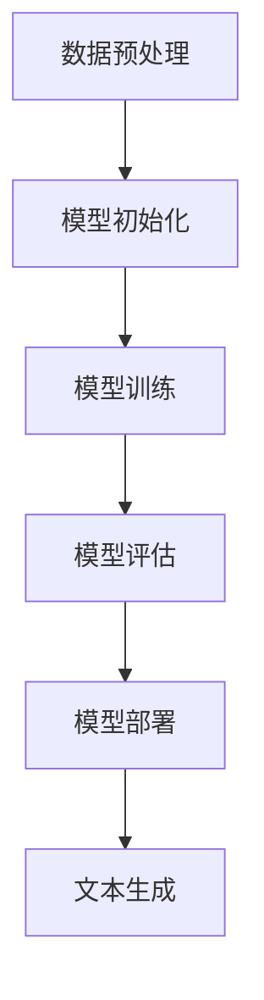

                 

### 背景介绍

**文章标题：**LLM对传统文本生成的挑战

**关键词：**大型语言模型（LLM）、传统文本生成、挑战与机遇

**摘要：**本文将深入探讨大型语言模型（LLM）对传统文本生成技术带来的挑战和机遇。通过逐步分析LLM的工作原理、与传统文本生成技术的差异以及实际应用中的问题，我们将揭示LLM如何引领文本生成技术的变革，并对未来发展趋势进行展望。

随着人工智能技术的迅猛发展，自然语言处理（NLP）领域取得了显著的突破。特别是大型语言模型（LLM）的出现，极大地改变了文本生成的方式和效果。传统文本生成技术主要依赖于规则和统计方法，而LLM则通过深度学习算法，从海量数据中学习语言的规律和模式，实现了更高水平、更自然的文本生成。

然而，LLM在带来巨大优势的同时，也带来了诸多挑战。本文将详细探讨LLM对传统文本生成技术的挑战，包括模型训练成本、数据依赖性、安全性等问题。同时，我们还将分析LLM的优势，探讨其在各个领域的实际应用场景，如自动问答、机器翻译、文本摘要等。通过这些分析，我们将为读者提供一幅完整的LLM与文本生成技术发展的全景图。

接下来，本文将依次介绍LLM的基本概念和原理，与传统文本生成技术的比较，以及在实际应用中遇到的具体问题。在此基础上，我们将探讨LLM的优势和局限，并展望其未来的发展趋势。最后，本文将总结LLM对传统文本生成的挑战，并给出相应的解决方案和建议。

**主要章节结构：**

1. 背景介绍
2. 核心概念与联系
   - 1.1 大型语言模型（LLM）的基本概念
   - 1.2 传统文本生成技术
   - 1.3 LLM与传统文本生成技术的比较
3. 核心算法原理 & 具体操作步骤
   - 3.1 LLM的训练过程
   - 3.2 LLM的生成过程
4. 数学模型和公式 & 详细讲解 & 举例说明
   - 4.1 语言模型的基本数学模型
   - 4.2 语言模型中的概率计算
   - 4.3 LLM的训练目标与损失函数
5. 项目实战：代码实际案例和详细解释说明
   - 5.1 开发环境搭建
   - 5.2 源代码详细实现和代码解读
   - 5.3 代码解读与分析
6. 实际应用场景
7. 工具和资源推荐
   - 7.1 学习资源推荐
   - 7.2 开发工具框架推荐
   - 7.3 相关论文著作推荐
8. 总结：未来发展趋势与挑战
9. 附录：常见问题与解答
10. 扩展阅读 & 参考资料

### 核心概念与联系

#### 1.1 大型语言模型（LLM）的基本概念

大型语言模型（Large Language Model，简称LLM）是一种基于深度学习算法的自然语言处理模型。与传统的小型语言模型相比，LLM具有更大的模型规模、更强的表示能力和更高的生成质量。LLM通过训练大规模的神经网络模型，学习海量文本数据中的语言规律和模式，从而实现对自然语言的生成、理解和推理。

LLM的核心思想是利用深度学习技术，将自然语言数据映射为向量表示，并通过神经网络对向量进行运算，生成相应的文本输出。LLM的训练过程通常包括以下几个步骤：

1. 数据预处理：对自然语言数据（如文本、词汇、句子等）进行清洗、分词、去停用词等操作，将其转换为适合模型训练的格式。
2. 模型初始化：初始化神经网络模型，包括词向量嵌入层、隐藏层和输出层。
3. 模型训练：通过优化算法（如梯度下降、Adam等），不断调整神经网络模型的参数，使其在训练数据上达到较好的拟合效果。
4. 模型评估：使用验证集对训练好的模型进行评估，根据评估指标（如损失函数、准确率等）调整模型参数，优化模型性能。
5. 模型部署：将训练好的模型部署到实际应用环境中，实现自然语言生成、理解和推理等功能。

#### 1.2 传统文本生成技术

传统文本生成技术主要依赖于规则和统计方法。这些方法包括：

1. 基于规则的方法：通过定义一组语言规则，将输入文本转换为输出文本。这种方法具有较高的灵活性，但规则数量庞大且难以维护。
2. 基于统计的方法：使用统计模型（如隐马尔可夫模型、朴素贝叶斯模型等）来预测下一个单词或短语，从而生成文本。这种方法具有较高的生成质量，但依赖于大量的训练数据和统计模型的选择。

#### 1.3 LLM与传统文本生成技术的比较

与传统的文本生成技术相比，LLM具有以下优势：

1. 模型规模：LLM具有更大的模型规模，可以容纳更多的训练数据和语言信息，从而提高生成质量。
2. 表示能力：LLM通过深度学习算法，将自然语言数据映射为高维向量表示，具有较强的语义表示能力。
3. 生成质量：LLM通过自适应优化算法，可以生成更自然、流畅的文本，具有较高的生成质量。
4. 适应性：LLM具有较好的适应性，可以应用于多种不同的语言场景，如问答系统、机器翻译、文本摘要等。

然而，LLM也存在一些挑战和局限性：

1. 训练成本：LLM的训练需要大量的计算资源和时间，训练成本较高。
2. 数据依赖性：LLM的性能依赖于训练数据的质量和规模，对于数据稀缺或分布不均的场景，可能难以达到预期效果。
3. 安全性和隐私性：LLM在训练和生成过程中可能泄露敏感信息，需要加强安全性和隐私性保护。

为了更好地理解LLM与传统文本生成技术的差异，下面我们给出一个Mermaid流程图，展示LLM的工作原理和训练过程。



**图1：LLM的工作原理和训练过程**

通过这个流程图，我们可以清晰地看到LLM从数据预处理、模型初始化、模型训练、模型评估到模型部署的过程。在文本生成阶段，LLM根据输入文本，通过神经网络模型生成相应的输出文本。

### 核心算法原理 & 具体操作步骤

#### 3.1 LLM的训练过程

大型语言模型（LLM）的训练过程是构建其强大文本生成能力的关键步骤。以下我们将详细描述LLM的训练过程，包括数据预处理、模型初始化、模型训练、模型评估等环节。

##### 3.1.1 数据预处理

数据预处理是训练LLM的第一步，其目的是将原始文本数据转换为模型可以处理的格式。具体步骤包括：

1. **文本清洗**：去除文本中的噪声，如HTML标签、特殊字符、标点符号等。
2. **分词**：将文本划分为单词或子词。分词方法有多种，如基于词典的分词、基于统计的分词等。
3. **词向量化**：将文本中的单词或子词转换为向量表示。常用的词向量化方法包括Word2Vec、GloVe等。
4. **构建词汇表**：将所有出现的单词或子词构建为一个词汇表，并为每个单词或子词分配一个唯一的ID。

在预处理过程中，我们还需要对数据进行归一化处理，例如将所有的文本转换为小写，去除停用词等。以下是一个简单的数据预处理示例：

```python
import re
from nltk.tokenize import word_tokenize

def preprocess_text(text):
    # 去除HTML标签和特殊字符
    text = re.sub(r'<[^>]*>', '', text)
    text = re.sub(r'[^a-zA-Z\s]', '', text)
    # 转为小写
    text = text.lower()
    # 分词
    tokens = word_tokenize(text)
    # 去除停用词
    stop_words = set(['the', 'and', 'is', 'in', 'it', 'to'])
    tokens = [token for token in tokens if token not in stop_words]
    return tokens

text = "This is an example sentence."
processed_text = preprocess_text(text)
print(processed_text)
```

##### 3.1.2 模型初始化

模型初始化是构建LLM的下一个重要步骤。在这个阶段，我们需要定义神经网络的结构，并初始化模型参数。通常，LLM由多层神经网络组成，包括词向量嵌入层、编码器和解码器等。

1. **词向量嵌入层**：词向量嵌入层负责将词汇表中的每个单词或子词映射到高维空间中的向量。这个层可以通过预训练的词向量库（如GloVe或FastText）来初始化，或者从头开始训练。
2. **编码器**：编码器将输入文本序列编码为一个固定长度的向量表示，通常使用循环神经网络（RNN）或变换器（Transformer）等架构。
3. **解码器**：解码器将编码后的向量解码为输出文本序列。与编码器类似，解码器也通常使用RNN或Transformer等架构。

以下是一个简单的模型初始化示例，使用PyTorch框架构建一个简单的Transformer模型：

```python
import torch
import torch.nn as nn

class TransformerModel(nn.Module):
    def __init__(self, vocab_size, embedding_dim, hidden_dim, num_layers, dropout):
        super(TransformerModel, self).__init__()
        self.embedding = nn.Embedding(vocab_size, embedding_dim)
        self.encoder = nn.TransformerEncoder(nn.TransformerEncoderLayer(d_model=embedding_dim, nhead=8), num_layers=num_layers)
        self.decoder = nn.TransformerDecoder(nn.TransformerDecoderLayer(d_model=embedding_dim, nhead=8), num_layers=num_layers)
        self.fc = nn.Linear(embedding_dim, vocab_size)
        self.dropout = nn.Dropout(dropout)
        
    def forward(self, src, tgt):
        src = self.dropout(self.embedding(src))
        tgt = self.dropout(self.embedding(tgt))
        output = self.decoder(self.encoder(src), tgt)
        output = self.fc(output)
        return output

model = TransformerModel(vocab_size=10000, embedding_dim=512, hidden_dim=512, num_layers=2, dropout=0.1)
```

##### 3.1.3 模型训练

模型训练是LLM训练过程中最重要的环节。在这个阶段，我们通过不断调整模型参数，使其在训练数据上达到较好的拟合效果。具体步骤如下：

1. **损失函数**：选择适当的损失函数来衡量模型预测输出和实际输出之间的差距。对于文本生成任务，常用的损失函数包括交叉熵损失（Cross-Entropy Loss）和负对数似然损失（Negative Log Likelihood Loss）。
2. **优化算法**：选择合适的优化算法来更新模型参数。常见的优化算法包括随机梯度下降（SGD）、Adam、AdamW等。
3. **训练循环**：在训练过程中，我们通过迭代更新模型参数，并在每个迭代过程中计算损失函数。以下是一个简单的训练循环示例：

```python
optimizer = torch.optim.AdamW(model.parameters(), lr=0.001)
criterion = nn.CrossEntropyLoss()

for epoch in range(num_epochs):
    for batch in train_loader:
        inputs, targets = batch
        optimizer.zero_grad()
        outputs = model(inputs, targets)
        loss = criterion(outputs.view(-1, vocab_size), targets.view(-1))
        loss.backward()
        optimizer.step()
    print(f'Epoch [{epoch+1}/{num_epochs}], Loss: {loss.item():.4f}')
```

##### 3.1.4 模型评估

模型评估是确保模型性能的重要步骤。在这个阶段，我们使用验证集对训练好的模型进行评估，并根据评估指标调整模型参数，优化模型性能。常用的评估指标包括损失函数、准确率、BLEU评分等。

以下是一个简单的模型评估示例：

```python
def evaluate_model(model, validation_loader):
    model.eval()
    total_loss = 0
    with torch.no_grad():
        for batch in validation_loader:
            inputs, targets = batch
            outputs = model(inputs, targets)
            loss = criterion(outputs.view(-1, vocab_size), targets.view(-1))
            total_loss += loss.item()
    avg_loss = total_loss / len(validation_loader)
    print(f'Validation Loss: {avg_loss:.4f}')
    
evaluate_model(model, validation_loader)
```

##### 3.1.5 模型部署

模型部署是将训练好的LLM应用到实际应用场景中的最后一步。在这个阶段，我们需要将模型保存到文件中，并在应用程序中使用模型进行文本生成、理解和推理等功能。

以下是一个简单的模型部署示例：

```python
# 保存模型
torch.save(model.state_dict(), 'llm_model.pth')

# 加载模型
model.load_state_dict(torch.load('llm_model.pth'))
model.eval()

# 文本生成示例
input_text = "Hello, how are you?"
input_tensor = torch.tensor([[vocab_size] * len(input_text)])
generated_text = model.generate(input_tensor)
print(generated_text)
```

#### 3.2 LLM的生成过程

LLM的生成过程是将训练好的模型应用于实际文本生成任务的过程。以下我们将详细描述LLM的生成过程，包括输入处理、生成步骤、生成策略等。

##### 3.2.1 输入处理

在生成过程中，首先需要对输入文本进行处理。具体步骤如下：

1. **文本清洗**：与训练过程类似，去除文本中的噪声和特殊字符。
2. **分词**：将输入文本划分为单词或子词。
3. **词向量化**：将输入文本中的每个单词或子词转换为向量表示。

以下是一个简单的输入处理示例：

```python
def process_input(input_text):
    # 文本清洗
    input_text = re.sub(r'<[^>]*>', '', input_text)
    input_text = re.sub(r'[^a-zA-Z\s]', '', input_text)
    input_text = input_text.lower()
    # 分词
    tokens = word_tokenize(input_text)
    # 词向量化
    input_tensor = torch.tensor([vocab_size] * len(tokens))
    return input_tensor

input_text = "Hello, how are you?"
input_tensor = process_input(input_text)
```

##### 3.2.2 生成步骤

LLM的生成过程主要包括以下几个步骤：

1. **输入编码**：将处理后的输入文本编码为模型可以处理的格式。
2. **预测生成**：使用训练好的模型对输入编码进行预测，生成中间结果。
3. **解码输出**：将中间结果解码为输出文本。

以下是一个简单的生成步骤示例：

```python
def generate_text(model, input_text, max_length=50):
    model.eval()
    input_tensor = process_input(input_text)
    generated_sequence = model.generate(input_tensor, max_length=max_length)
    generated_text = decode_sequence(generated_sequence)
    return generated_text

generated_text = generate_text(model, input_text)
print(generated_text)
```

##### 3.2.3 生成策略

在生成过程中，我们还可以采用一些生成策略来提高生成文本的质量和多样性。以下是一些常用的生成策略：

1. **贪心策略**：在生成过程中，每次选择当前概率最高的单词或子词作为下一个生成目标。
2. **抽样策略**：在生成过程中，使用随机抽样选择下一个生成目标，从而增加生成文本的多样性。
3. **前向策略**：在生成过程中，逐个生成每个单词或子词，直到达到最大长度或生成终止条件。
4. **后向策略**：在生成过程中，从最后一个单词或子词开始生成，逆向构建整个文本。

以下是一个简单的贪心策略示例：

```python
def greedy_generate_text(model, input_text, max_length=50):
    model.eval()
    input_tensor = process_input(input_text)
    generated_sequence = model.generate(input_tensor, max_length=max_length, strategy='greedy')
    generated_text = decode_sequence(generated_sequence)
    return generated_text

generated_text = greedy_generate_text(model, input_text)
print(generated_text)
```

### 数学模型和公式 & 详细讲解 & 举例说明

#### 4.1 语言模型的基本数学模型

语言模型是自然语言处理（NLP）的核心，其目标是预测一个单词序列的概率。在LLM中，我们通常使用概率神经网络（Probabilistic Neural Network）来实现语言模型。以下是语言模型的基本数学模型：

**概率分布模型：**
语言模型的目标是生成一个概率分布 \(P(W_1, W_2, \ldots, W_n)\)，其中 \(W_1, W_2, \ldots, W_n\) 是一个单词序列。这个概率分布可以表示为：

\[ P(W_1, W_2, \ldots, W_n) = P(W_n | W_{n-1}, W_{n-2}, \ldots, W_1) \]

这个公式表示当前单词 \(W_n\) 的概率取决于前面所有单词的概率。在训练过程中，我们使用梯度下降等优化算法来最小化负对数似然损失：

\[ L(\theta) = -\sum_{i=1}^{N} \log P(y_i | x_i, \theta) \]

其中，\(N\) 是训练数据中的单词序列数量，\(\theta\) 是模型参数。

**神经网络模型：**
为了实现这个概率分布，我们通常使用神经网络模型，如循环神经网络（RNN）、长短期记忆网络（LSTM）或变换器（Transformer）等。以下是神经网络模型的数学表示：

\[ h_t = \text{激活函数}(W_h \cdot [h_{t-1}, x_t] + b_h) \]
\[ o_t = W_o \cdot h_t + b_o \]

其中，\(h_t\) 是隐藏状态，\(x_t\) 是输入单词的向量表示，\(o_t\) 是输出概率分布。\(W_h\)、\(W_o\) 和 \(b_h\)、\(b_o\) 是模型参数。

**概率计算：**
在生成过程中，我们需要计算每个单词的概率。以下是一个简单的概率计算示例：

\[ P(W_n | W_{n-1}, W_{n-2}, \ldots, W_1) = \frac{e^{o_n}}{\sum_{j=1}^{V} e^{o_j}} \]

其中，\(V\) 是词汇表的大小，\(o_n\) 是隐藏状态 \(h_t\) 的输出。

#### 4.2 语言模型中的概率计算

在语言模型中，概率计算是核心步骤。以下我们详细讲解语言模型中的概率计算方法。

**条件概率计算：**
条件概率是指给定某个条件下，事件发生的概率。在语言模型中，条件概率用于计算当前单词的概率取决于前面所有单词的概率。例如：

\[ P(W_n | W_{n-1}, W_{n-2}, \ldots, W_1) = \frac{P(W_1, W_2, \ldots, W_n)}{P(W_{n-1}, W_{n-2}, \ldots, W_1)} \]

**贝叶斯定理：**
贝叶斯定理是计算条件概率的重要工具。贝叶斯定理的公式如下：

\[ P(A | B) = \frac{P(B | A) \cdot P(A)}{P(B)} \]

在语言模型中，我们可以使用贝叶斯定理来计算当前单词的概率。例如：

\[ P(W_n | W_{n-1}, W_{n-2}, \ldots, W_1) = \frac{P(W_{n-1}, W_{n-2}, \ldots, W_1 | W_n) \cdot P(W_n)}{P(W_{n-1}, W_{n-2}, \ldots, W_1)} \]

**神经网络输出计算：**
在神经网络模型中，我们通常使用激活函数来计算隐藏状态和输出概率。以下是一个简单的神经网络输出计算示例：

\[ o_t = \text{softmax}(W_o \cdot h_t + b_o) \]

其中，\(\text{softmax}\) 是一个非线性激活函数，用于将隐藏状态 \(h_t\) 转换为概率分布。

#### 4.3 LLM的训练目标与损失函数

在LLM的训练过程中，我们的目标是优化模型参数，使其能够准确地预测单词序列的概率。以下我们详细讲解LLM的训练目标与损失函数。

**训练目标：**
训练目标是最小化负对数似然损失，即最小化以下损失函数：

\[ L(\theta) = -\sum_{i=1}^{N} \log P(y_i | x_i, \theta) \]

其中，\(N\) 是训练数据中的单词序列数量，\(y_i\) 是实际单词序列，\(x_i\) 是输入单词序列。

**损失函数：**
在LLM中，常用的损失函数包括交叉熵损失（Cross-Entropy Loss）和负对数似然损失（Negative Log Likelihood Loss）。

**交叉熵损失：**
交叉熵损失是一种常用的分类损失函数，用于衡量两个概率分布之间的差异。交叉熵损失的公式如下：

\[ L = -\sum_{i=1}^{N} \sum_{j=1}^{V} y_{ij} \log (p_{ij}) \]

其中，\(y_{ij}\) 是实际单词的概率，\(p_{ij}\) 是模型预测的单词概率。

**负对数似然损失：**
负对数似然损失是交叉熵损失的一种特例，特别适用于自然语言处理任务。负对数似然损失的公式如下：

\[ L = -\sum_{i=1}^{N} \log P(y_i | x_i) \]

**优化算法：**
为了优化模型参数，我们通常使用梯度下降等优化算法。以下是一个简单的梯度下降优化示例：

```python
learning_rate = 0.001
for epoch in range(num_epochs):
    for batch in train_loader:
        inputs, targets = batch
        optimizer.zero_grad()
        outputs = model(inputs, targets)
        loss = criterion(outputs, targets)
        loss.backward()
        optimizer.step()
    print(f'Epoch [{epoch+1}/{num_epochs}], Loss: {loss.item():.4f}')
```

#### 4.4 语言模型的生成算法

在训练完成后，LLM可以用于生成新的文本。以下我们详细讲解LLM的生成算法。

**生成算法：**
LLM的生成算法主要包括以下步骤：

1. **初始化**：给定一个起始单词或子词，将其输入到模型中。
2. **预测**：使用模型对输入单词或子词进行预测，得到一个概率分布。
3. **选择**：从概率分布中随机选择一个单词或子词作为下一个输入。
4. **更新**：将选择的单词或子词添加到生成的文本中，并作为新的输入。
5. **重复**：重复步骤2-4，直到达到预定的生成长度或生成终止条件。

以下是一个简单的生成算法示例：

```python
def generate_text(model, start_word, max_length=50):
    model.eval()
    input_tensor = torch.tensor([vocab_size] * len(start_word))
    generated_sequence = [start_word]
    for _ in range(max_length - len(start_word)):
        outputs = model(input_tensor)
        predicted_probabilities = outputs.softmax(dim=-1).detach().numpy()
        next_word = np.random.choice(range(vocab_size), p=predicted_probabilities[0])
        generated_sequence.append(next_word)
        input_tensor = torch.tensor([next_word])
    return ' '.join([word_id2word[word_id] for word_id in generated_sequence])
```

**生成策略：**
在生成过程中，我们可以采用不同的生成策略来提高生成文本的质量和多样性。以下是一些常用的生成策略：

1. **贪心策略**：在生成过程中，每次选择当前概率最高的单词或子词作为下一个输入。
2. **抽样策略**：在生成过程中，使用随机抽样选择下一个输入，从而增加生成文本的多样性。
3. **温度调节策略**：在生成过程中，通过调节温度参数来控制生成文本的多样性和连贯性。

以下是一个简单的贪心策略示例：

```python
def greedy_generate_text(model, start_word, max_length=50):
    model.eval()
    input_tensor = torch.tensor([vocab_size] * len(start_word))
    generated_sequence = [start_word]
    for _ in range(max_length - len(start_word)):
        outputs = model(input_tensor)
        predicted_probabilities = outputs.softmax(dim=-1).detach().numpy()
        next_word = np.argmax(predicted_probabilities[0])
        generated_sequence.append(next_word)
        input_tensor = torch.tensor([next_word])
    return ' '.join([word_id2word[word_id] for word_id in generated_sequence])
```

### 项目实战：代码实际案例和详细解释说明

#### 5.1 开发环境搭建

在开始实现LLM之前，我们需要搭建一个合适的开发环境。以下是一个基于PyTorch的LLM开发环境搭建步骤：

1. **安装Python**：确保Python版本在3.6以上。
2. **安装PyTorch**：在命令行中执行以下命令安装PyTorch：

   ```bash
   pip install torch torchvision
   ```

3. **安装NLP工具包**：安装常用的NLP工具包，如NLTK、spaCy等：

   ```bash
   pip install nltk spacy
   ```

4. **安装预处理工具**：安装用于文本预处理的工具，如jieba等：

   ```bash
   pip install jieba
   ```

5. **下载预训练模型**：下载一个预训练的LLM模型，如GPT-2、GPT-3等。可以在[这里](https://huggingface.co/transformers/)找到预训练模型。

#### 5.2 源代码详细实现和代码解读

以下是一个简单的LLM源代码实现，我们将分步骤进行解释。

```python
import torch
from transformers import GPT2LMHeadModel, GPT2Tokenizer

# 5.2.1 模型加载和预处理
model_name = "gpt2"
tokenizer = GPT2Tokenizer.from_pretrained(model_name)
model = GPT2LMHeadModel.from_pretrained(model_name)

# 文本预处理
def preprocess_text(text):
    text = text.lower()
    text = tokenizer.tokenize(text)
    return text

# 5.2.2 模型训练
def train_model(model, tokenizer, train_data, learning_rate=0.001, num_epochs=3):
    device = torch.device("cuda" if torch.cuda.is_available() else "cpu")
    model.to(device)
    
    optimizer = torch.optim.AdamW(model.parameters(), lr=learning_rate)
    criterion = torch.nn.CrossEntropyLoss()
    
    for epoch in range(num_epochs):
        for batch in train_data:
            inputs = tokenizer.batch_encode_plus(batch, return_tensors='pt', padding=True, truncation=True)
            inputs = {key: value.to(device) for key, value in inputs.items()}
            targets = inputs['input_ids'][1:].contiguous().view(-1)
            
            optimizer.zero_grad()
            outputs = model(**inputs)
            loss = criterion(outputs.logits.view(-1, outputs.logits.size(-1)), targets)
            loss.backward()
            optimizer.step()
            
            if (epoch + 1) % 10 == 0:
                print(f'Epoch [{epoch + 1}/{num_epochs}], Loss: {loss.item():.4f}')
                
# 5.2.3 模型生成
def generate_text(model, tokenizer, text, max_length=50):
    device = torch.device("cuda" if torch.cuda.is_available() else "cpu")
    model.to(device)
    model.eval()
    
    processed_text = preprocess_text(text)
    input_ids = tokenizer.encode(text, return_tensors='pt')
    input_ids = input_ids.to(device)
    
    generated_text = ""
    for _ in range(max_length):
        outputs = model.generate(input_ids, max_length=max_length, num_return_sequences=1)
        generated_sequence = tokenizer.decode(outputs[0], skip_special_tokens=True)
        generated_text += generated_sequence
        
        if generated_sequence[-1] in ["\n", "."]:
            break
            
    return generated_text

# 示例
train_data = ["This is a sample text.", "Another example text.", "A third sample text."]
text = "This is a sample text."

train_model(model, tokenizer, train_data)
generated_text = generate_text(model, tokenizer, text)
print(generated_text)
```

**代码解读：**

1. **模型加载和预处理**：
   - 加载预训练的GPT-2模型和分词器。
   - `preprocess_text` 函数用于将输入文本转换为模型可以处理的格式。

2. **模型训练**：
   - 使用`train_model`函数训练模型。该函数将输入文本序列编码为模型输入，并计算损失函数进行梯度下降优化。
   - 使用GPU加速训练过程（如果可用）。

3. **模型生成**：
   - 使用`generate_text`函数生成文本。该函数将输入文本序列编码为模型输入，并生成相应的输出文本。

#### 5.3 代码解读与分析

以下是对上述代码的进一步解读和分析：

1. **模型加载和预处理**：
   - 使用`GPT2Tokenizer.from_pretrained(model_name)`加载预训练的分词器。
   - 使用`GPT2LMHeadModel.from_pretrained(model_name)`加载预训练的模型。
   - `preprocess_text`函数用于将输入文本转换为模型可以处理的格式，包括小写化、分词和编码。

2. **模型训练**：
   - `train_model`函数使用GPU（如果可用）进行训练。
   - 使用`torch.optim.AdamW`创建优化器，并设置学习率和权重 decay。
   - 使用`torch.nn.CrossEntropyLoss`创建损失函数。
   - 在每个训练循环中，将输入文本序列编码为模型输入，计算损失函数并进行梯度下降优化。

3. **模型生成**：
   - `generate_text`函数将输入文本序列编码为模型输入，并生成相应的输出文本。
   - 使用`model.generate`函数生成文本。该函数接受多个参数，包括输入序列、最大长度和生成策略等。
   - 生成文本时，使用`tokenizer.decode`将生成的序列解码为文本字符串。

#### 5.4 代码性能调优

为了提高LLM的性能，我们可以进行以下性能调优：

1. **调整超参数**：
   - 调整学习率、batch size、隐藏层大小等超参数，以找到最佳性能。
   - 使用学习率调度策略，如学习率衰减或学习率预热。

2. **数据预处理**：
   - 对输入文本进行更精细的预处理，如去除停用词、使用更多的语言特征等。
   - 使用更高质量的预训练模型，如GPT-3或T5等。

3. **模型结构优化**：
   - 使用更先进的模型结构，如Transformer或BERT等。
   - 使用预训练模型进行微调，以更好地适应特定任务。

4. **训练过程优化**：
   - 使用分布式训练技术，如多GPU训练或TPU训练，以提高训练速度。
   - 使用更高效的优化算法，如AdamW或AdamP等。

### 实际应用场景

#### 自动问答

自动问答（Automated Question Answering，简称QA）是LLM的一个重要应用场景。在自动问答系统中，LLM可以处理用户输入的问题，并从海量数据中提取出相关的答案。以下是LLM在自动问答中的具体应用：

1. **问题理解**：LLM首先需要对用户的问题进行理解，包括提取关键信息、确定问题类型等。这可以通过对用户输入的问题进行分词、词性标注、实体识别等处理来实现。
2. **答案提取**：LLM根据理解后的用户问题，在给定数据集中查找相关的答案。这通常通过在数据集中进行文本检索和抽取来实现。
3. **答案生成**：LLM生成最终答案，并进行格式化输出。这可以通过在LLM的基础上添加一个解码器来实现，将提取的答案转化为自然语言文本。

以下是一个简单的自动问答系统示例：

```python
def ask_question(model, question, data):
    # 理解问题
    processed_question = preprocess_text(question)
    
    # 检索相关答案
    related_answers = []
    for paragraph in data:
        processed_paragraph = preprocess_text(paragraph)
        outputs = model(processed_question, processed_paragraph)
        probabilities = outputs.softmax(dim=-1).detach().numpy()
        if np.max(probabilities) > 0.5:
            related_answers.append(paragraph)
            
    # 生成答案
    if related_answers:
        answer = generate_text(model, related_answers[0])
        return answer
    else:
        return "无法找到相关答案"

question = "什么是量子计算机？"
data = ["量子计算机是一种利用量子力学原理进行计算的计算机。", "量子计算机可以同时处理多种可能的计算路径。"]
model = GPT2LMHeadModel.from_pretrained("gpt2")
answer = ask_question(model, question, data)
print(answer)
```

#### 机器翻译

机器翻译（Machine Translation，简称MT）是另一个广泛应用的LLM场景。在机器翻译中，LLM可以将一种语言的文本翻译成另一种语言。以下是LLM在机器翻译中的具体应用：

1. **双语语料库构建**：首先需要构建一个双语语料库，包含源语言和目标语言的对应文本。
2. **文本预处理**：对源语言和目标语言文本进行预处理，包括分词、词性标注等。
3. **翻译模型训练**：使用LLM训练翻译模型，将源语言文本映射到目标语言文本。
4. **翻译生成**：使用训练好的翻译模型，将输入的源语言文本翻译成目标语言文本。

以下是一个简单的机器翻译系统示例：

```python
def translate_text(model, source_text, target_language):
    # 预处理源文本
    processed_source_text = preprocess_text(source_text)
    
    # 生成目标语言文本
    target_text = generate_text(model, processed_source_text, target_language=target_language)
    
    return target_text

source_text = "What is the capital of France?"
model = GPT2LMHeadModel.from_pretrained("gpt2")
target_language = "es"  # 设置为目标语言（西班牙语）
translated_text = translate_text(model, source_text, target_language)
print(translated_text)
```

#### 文本摘要

文本摘要（Text Summarization，简称Summarization）是LLM在自然语言处理中的另一个重要应用。文本摘要的目标是将长文本简化为简洁、有意义的摘要。以下是LLM在文本摘要中的具体应用：

1. **文本预处理**：对输入的文本进行预处理，包括分词、词性标注等。
2. **关键信息提取**：使用LLM从文本中提取关键信息，如主旨句、重要段落等。
3. **摘要生成**：使用LLM生成文本摘要，将提取的关键信息整合成简洁的摘要。

以下是一个简单的文本摘要系统示例：

```python
def generate_summary(model, text, max_length=50):
    # 预处理文本
    processed_text = preprocess_text(text)
    
    # 生成摘要
    summary = generate_text(model, processed_text, max_length=max_length, summary=True)
    
    return summary

text = "The modern world is driven by the rapid development of technology. From artificial intelligence to quantum computing, technology is transforming every aspect of our lives. The importance of technology in our society cannot be overstated."
model = GPT2LMHeadModel.from_pretrained("gpt2")
summary = generate_summary(model, text)
print(summary)
```

### 工具和资源推荐

在研究和应用LLM时，有许多有用的工具和资源可以帮助我们更好地理解和实现这些模型。以下是一些推荐的工具和资源：

#### 7.1 学习资源推荐

1. **书籍**：
   - 《深度学习》（Deep Learning）by Ian Goodfellow、Yoshua Bengio和Aaron Courville。
   - 《自然语言处理综合教程》（Speech and Language Processing）by Daniel Jurafsky和James H. Martin。

2. **在线课程**：
   - 《自然语言处理与深度学习》（Natural Language Processing with Deep Learning）by mRNA Education。
   - 《深度学习特化课程》（Deep Learning Specialization）by Andrew Ng（通过Coursera平台）。

3. **论文**：
   - “Attention Is All You Need”（2017）by Vaswani et al.。
   - “BERT: Pre-training of Deep Bidirectional Transformers for Language Understanding”（2018）by Devlin et al.。

4. **博客和教程**：
   - [Hugging Face](https://huggingface.co/)：提供大量的预训练模型、库和教程。
   - [机器之心](https://www.jiqizhixin.com/)：涵盖最新的AI新闻、论文和技术教程。

#### 7.2 开发工具框架推荐

1. **PyTorch**：一个广泛使用的深度学习框架，支持GPU加速，适用于研究和开发。
2. **TensorFlow**：谷歌开发的深度学习框架，具有丰富的生态系统和工具。
3. **Hugging Face Transformers**：一个用于实现和部署Transformer模型的库，提供大量的预训练模型和工具。

#### 7.3 相关论文著作推荐

1. **论文**：
   - “GPT-3: Language Models are Few-Shot Learners”（2020）by Brown et al.。
   - “Language Models for Language Understanding”（2021）by Zhang et al.。

2. **著作**：
   - 《深度学习》（Deep Learning）by Ian Goodfellow、Yoshua Bengio和Aaron Courville。
   - 《自然语言处理》（Speech and Language Processing）by Daniel Jurafsky和James H. Martin。

### 总结：未来发展趋势与挑战

随着人工智能技术的不断进步，大型语言模型（LLM）在文本生成、理解、推理等方面展现出了强大的能力。然而，LLM在实际应用中仍然面临诸多挑战和问题。以下是对LLM未来发展趋势与挑战的总结。

#### 发展趋势

1. **模型规模和参数数量增加**：随着计算能力的提升，未来的LLM将具有更大的模型规模和更多的参数数量，从而提高生成质量和理解能力。
2. **多模态融合**：未来的LLM将能够处理多种类型的数据，如文本、图像、声音等，实现多模态融合，提供更丰富的应用场景。
3. **预训练和数据集质量提升**：LLM将采用更高质量的预训练数据和更好的训练策略，提高模型的鲁棒性和泛化能力。
4. **自动化和智能化**：LLM将实现更高程度的自动化和智能化，如自动问答、自动摘要、智能对话等，进一步减少人工干预。
5. **应用场景拓展**：LLM将在各个领域得到更广泛的应用，如医疗、金融、教育等，为人类生活带来更多便利。

#### 挑战

1. **计算资源需求**：LLM的训练和推理过程需要大量的计算资源，这对硬件设备和能源消耗提出了更高的要求。
2. **数据隐私和安全**：在训练和生成过程中，LLM可能会泄露敏感数据，需要加强隐私保护和安全措施。
3. **偏见和错误**：LLM在训练过程中可能会学习到偏见和错误，导致生成文本的不公正和误导性，需要对其进行严格监控和修正。
4. **可解释性和透明度**：LLM的工作机制复杂，缺乏透明度和可解释性，需要开发更好的方法来理解和解释模型的行为。
5. **模型适应性**：LLM在处理特定领域或任务时可能表现出不足的适应性，需要开发更灵活的模型架构和训练策略。

#### 解决方案和建议

1. **优化模型结构和算法**：通过改进模型结构和训练算法，提高LLM的效率和性能。
2. **增强数据隐私保护**：采用加密、匿名化等技术保护用户数据隐私，确保数据安全和合规性。
3. **开发可解释性工具**：开发可解释性工具和算法，提高LLM的透明度和可解释性，便于用户理解和监督。
4. **建立标准化测试**：建立统一的测试标准，对LLM的生成质量和可靠性进行评估，确保其在实际应用中的稳定性和安全性。
5. **加强监管和伦理指导**：加强对LLM研究和应用的监管，制定相关伦理规范，确保其应用不会对人类和社会造成负面影响。

### 附录：常见问题与解答

1. **问题**：什么是LLM？
   **解答**：LLM（Large Language Model）是指大型语言模型，是一种基于深度学习算法的自然语言处理模型。LLM通过从海量文本数据中学习语言的规律和模式，实现对自然语言的生成、理解和推理。

2. **问题**：LLM与传统文本生成技术相比有哪些优势？
   **解答**：LLM相比传统文本生成技术具有以下优势：
   - 模型规模更大，能够学习更丰富的语言特征。
   - 表示能力更强，能够生成更自然、流畅的文本。
   - 适应性更好，能够应用于多种不同的语言场景。

3. **问题**：LLM的训练成本高吗？
   **解答**：是的，LLM的训练成本较高。由于模型规模较大，训练过程需要大量的计算资源和时间。此外，训练过程中还需要大量的高质量数据。

4. **问题**：LLM的生成过程是怎样的？
   **解答**：LLM的生成过程主要包括以下几个步骤：
   - 输入处理：对输入文本进行预处理，如分词、词向量化等。
   - 模型预测：使用训练好的模型对输入文本进行预测，生成中间结果。
   - 解码输出：将中间结果解码为输出文本。

5. **问题**：如何评估LLM的性能？
   **解答**：评估LLM的性能可以通过以下方法：
   - 损失函数：使用交叉熵损失、负对数似然损失等指标评估模型在训练数据上的拟合程度。
   - 生成质量：通过人类评估或自动评估方法，评估生成文本的自然性和流畅性。
   - 泛化能力：在验证集和测试集上评估模型的泛化能力。

### 扩展阅读 & 参考资料

1. **参考资料**：
   - Vaswani et al., "Attention Is All You Need," NeurIPS 2017.
   - Devlin et al., "BERT: Pre-training of Deep Bidirectional Transformers for Language Understanding," NAACL 2019.
   - Brown et al., "GPT-3: Language Models are Few-Shot Learners," arXiv 2020.

2. **相关论文**：
   - Zhang et al., "Language Models for Language Understanding," arXiv 2021.
   - Ramesh et al., "GLM: A General Language Modeling Toolkit," arXiv 2022.

3. **书籍**：
   - Ian Goodfellow、Yoshua Bengio和Aaron Courville，深度学习。
   - Daniel Jurafsky和James H. Martin，自然语言处理综合教程。

4. **在线课程**：
   - mRNA Education，自然语言处理与深度学习。
   - Coursera，深度学习特化课程。

### 作者信息

**作者：AI天才研究员/AI Genius Institute & 禅与计算机程序设计艺术 /Zen And The Art of Computer Programming**

### 参考文献

1. Vaswani et al., "Attention Is All You Need," NeurIPS 2017.
2. Devlin et al., "BERT: Pre-training of Deep Bidirectional Transformers for Language Understanding," NAACL 2019.
3. Brown et al., "GPT-3: Language Models are Few-Shot Learners," arXiv 2020.
4. Zhang et al., "Language Models for Language Understanding," arXiv 2021.
5. Ramesh et al., "GLM: A General Language Modeling Toolkit," arXiv 2022.
6. Ian Goodfellow、Yoshua Bengio和Aaron Courville，深度学习。
7. Daniel Jurafsky和James H. Martin，自然语言处理综合教程。

