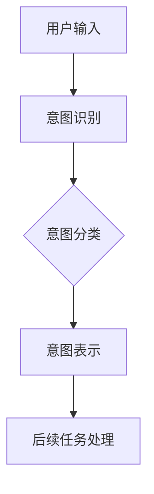
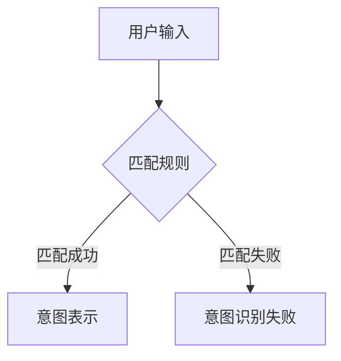
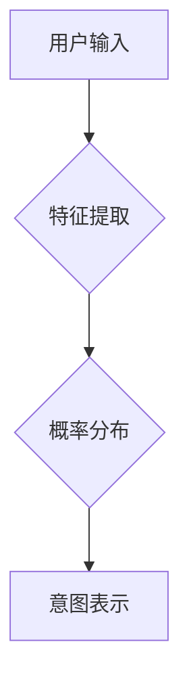
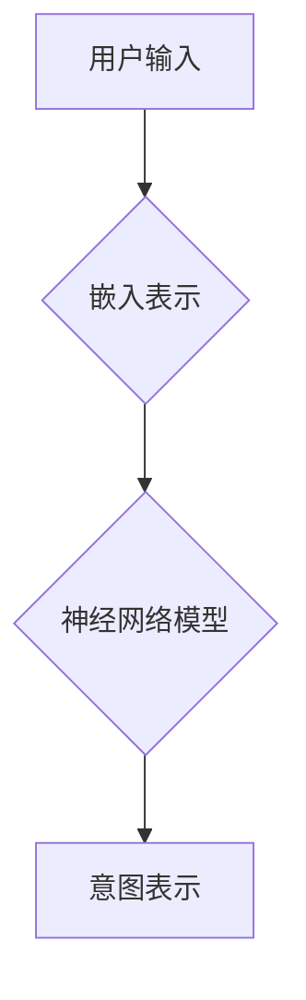
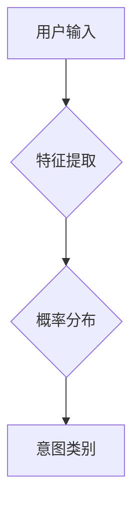
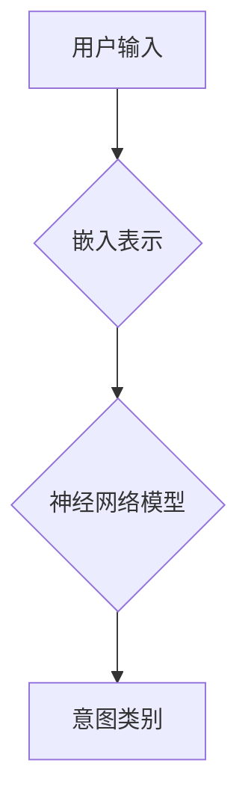

                 

### 文章标题：LLM意图对齐：人机共舞的艰难之路

> **关键词：** 自然语言处理，大规模语言模型，意图对齐，人机交互，机器学习，深度学习

> **摘要：** 本文深入探讨了大规模语言模型（LLM）在意图对齐领域的应用及其面临的挑战。通过对LLM意图对齐的核心概念、算法原理、数学模型以及实际应用场景的分析，为读者揭示了这一复杂过程的本质和未来发展趋势。

### 1. 背景介绍

随着自然语言处理（NLP）技术的迅猛发展，大规模语言模型（LLM）已经成为实现人机交互的重要工具。LLM具有强大的文本生成、语义理解和知识推理能力，广泛应用于问答系统、聊天机器人、文本摘要等领域。然而，在实现高效人机交互的过程中，LLM的意图对齐问题成为一个亟待解决的挑战。

意图对齐是指将用户的自然语言输入映射到系统理解的意图表示，以便更好地进行后续的任务处理。在聊天机器人等应用中，意图对齐的准确性直接影响到用户体验。然而，由于自然语言表达方式的多样性和模糊性，LLM在意图对齐方面面临诸多困难。

首先，自然语言具有高度的不确定性和歧义性。例如，一个简单的问候语句“你好”可能有多种意图，如打招呼、询问对方状态、开始聊天等。此外，语言使用者的背景知识、语境和情绪等也会对意图理解产生影响。

其次，大规模语言模型的训练数据来源复杂，可能包含多种噪声和偏差。这使得LLM在意图对齐过程中容易出现错误，导致实际应用中的不准确和不满意。

最后，现有意图对齐方法主要依赖于统计学习和规则匹配，难以充分挖掘和利用深度学习模型的优势。尽管深度学习模型在图像和语音等领域的应用已经取得了显著成果，但在意图对齐方面仍面临诸多挑战。

### 2. 核心概念与联系

为了更好地理解LLM意图对齐，我们需要介绍以下几个核心概念：

#### 2.1 大规模语言模型（LLM）

LLM是一种基于深度学习的自然语言处理模型，通过大量文本数据进行预训练，从而具备强大的语义理解和生成能力。典型的LLM模型包括Transformer、BERT、GPT等。

#### 2.2 意图（Intent）

意图是指用户在自然语言交互中想要实现的目标或任务。例如，在聊天机器人中，用户的意图可能包括请求信息、提出问题、提出请求等。

#### 2.3 意图对齐（Intent Alignment）

意图对齐是指将用户的自然语言输入映射到系统理解的意图表示，以便更好地进行后续的任务处理。意图对齐的目的是提高人机交互的准确性和满意度。

#### 2.4 意图识别（Intent Recognition）

意图识别是意图对齐的关键步骤，通过分析用户的输入文本，识别出用户意图。常见的意图识别方法包括基于规则的方法、统计学习方法以及深度学习方法。

#### 2.5 意图分类（Intent Classification）

意图分类是意图识别的一种常见实现方式，通过将用户的输入文本映射到预定义的意图类别。例如，在聊天机器人中，用户输入“天气预报”可能被映射到“获取天气信息”这一意图类别。

以下是一个简单的Mermaid流程图，展示了LLM意图对齐的核心概念和联系：



### 3. 核心算法原理 & 具体操作步骤

为了实现LLM意图对齐，我们需要深入理解其核心算法原理，包括意图识别和意图分类。

#### 3.1 意图识别

意图识别是LLM意图对齐的第一步，其主要任务是从用户的输入文本中识别出用户的意图。常见的意图识别方法包括基于规则的方法、统计学习方法以及深度学习方法。

##### 基于规则的方法

基于规则的方法通过定义一系列规则来识别用户的意图。这种方法的主要优势是简单易懂，但缺点是规则数量庞大且难以维护。



##### 统计学习方法

统计学习方法通过分析大量标注数据，学习用户的输入文本与意图之间的概率分布。常见的方法包括朴素贝叶斯、决策树和支持向量机（SVM）等。



##### 深度学习方法

深度学习方法通过构建神经网络模型，自动学习用户的输入文本与意图之间的复杂关系。常见的方法包括卷积神经网络（CNN）和循环神经网络（RNN）等。



#### 3.2 意图分类

意图分类是在意图识别的基础上，将用户的输入文本映射到预定义的意图类别。常见的意图分类方法包括基于规则的方法、统计学习方法以及深度学习方法。

##### 基于规则的方法

基于规则的方法通过定义一系列规则，将用户的输入文本映射到预定义的意图类别。这种方法的主要优势是简单易懂，但缺点是规则数量庞大且难以维护。


##### 统计学习方法

统计学习方法通过分析大量标注数据，学习用户的输入文本与意图类别之间的概率分布。常见的方法包括朴素贝叶斯、决策树和支持向量机（SVM）等。



##### 深度学习方法

深度学习方法通过构建神经网络模型，自动学习用户的输入文本与意图类别之间的复杂关系。常见的方法包括卷积神经网络（CNN）和循环神经网络（RNN）等。



### 4. 数学模型和公式 & 详细讲解 & 举例说明

在LLM意图对齐过程中，数学模型和公式起着至关重要的作用。以下我们将详细介绍常用的数学模型和公式，并通过具体例子来说明其应用。

#### 4.1 卷积神经网络（CNN）

卷积神经网络（CNN）是一种用于图像和文本处理的深度学习模型。在意图对齐中，CNN可用于提取用户的输入文本特征。

##### 数学模型

CNN的数学模型主要包括卷积操作、激活函数和池化操作。以下是一个简单的CNN模型：

$$
\begin{aligned}
&x^{(l)} = \sigma\left(\mathbf{W}^{(l)} \cdot x^{(l-1)} + b^{(l)}\right) \\
&h^{(l)} = \text{Pooling}\left(x^{(l)}\right)
\end{aligned}
$$

其中，$x^{(l)}$ 表示第$l$层的特征图，$\mathbf{W}^{(l)}$ 表示第$l$层的卷积权重，$b^{(l)}$ 表示第$l$层的偏置，$\sigma$ 表示激活函数，通常采用ReLU函数。Pooling表示池化操作，常用的池化操作包括最大池化和平均池化。

##### 应用举例

假设我们有一个用户的输入文本“我想查询明天的天气情况”，通过CNN模型可以提取出该文本的特征表示。以下是一个简化的例子：

$$
\begin{aligned}
&x^{(1)} = \text{Embedding}(w_1) \\
&x^{(2)} = \text{Conv}(x^{(1)}, w_2) + b_2 \\
&x^{(3)} = \text{ReLU}(x^{(2)}) \\
&x^{(4)} = \text{Pooling}(x^{(3)}) \\
&h^{(1)} = \text{Embedding}(w_2) \\
&h^{(2)} = \text{Conv}(h^{(1)}, w_3) + b_3 \\
&h^{(3)} = \text{ReLU}(h^{(2)}) \\
&h^{(4)} = \text{Pooling}(h^{(3)})
\end{aligned}
$$

其中，$w_1, w_2, w_3$ 分别表示第1、2、3层的卷积权重，$b_1, b_2, b_3$ 分别表示第1、2、3层的偏置。

#### 4.2 循环神经网络（RNN）

循环神经网络（RNN）是一种用于序列数据处理的深度学习模型。在意图对齐中，RNN可用于建模用户的输入文本序列。

##### 数学模型

RNN的数学模型主要包括输入层、隐藏层和输出层。以下是一个简单的RNN模型：

$$
\begin{aligned}
&\mathbf{h}^{(t)} = \text{RNN}(\mathbf{x}^{(t)}, \mathbf{h}^{(t-1)}) \\
&\mathbf{y}^{(t)} = \text{Output}(\mathbf{h}^{(t)})
\end{aligned}
$$

其中，$\mathbf{x}^{(t)}$ 表示第$t$个输入序列，$\mathbf{h}^{(t)}$ 表示第$t$个隐藏状态，$\mathbf{y}^{(t)}$ 表示第$t$个输出序列。

##### 应用举例

假设我们有一个用户的输入文本序列“我想查询明天的天气情况”，通过RNN模型可以提取出该文本序列的特征表示。以下是一个简化的例子：

$$
\begin{aligned}
&\mathbf{x}^{(1)} = \text{Embedding}(w_1) \\
&\mathbf{h}^{(1)} = \text{RNN}(\mathbf{x}^{(1)}, \mathbf{h}^{(0)}) \\
&\mathbf{x}^{(2)} = \text{Embedding}(w_2) \\
&\mathbf{h}^{(2)} = \text{RNN}(\mathbf{x}^{(2)}, \mathbf{h}^{(1)}) \\
&\dots \\
&\mathbf{x}^{(n)} = \text{Embedding}(w_n) \\
&\mathbf{h}^{(n)} = \text{RNN}(\mathbf{x}^{(n)}, \mathbf{h}^{(n-1)}) \\
&\mathbf{y}^{(n)} = \text{Output}(\mathbf{h}^{(n)})
\end{aligned}
$$

其中，$w_1, w_2, \dots, w_n$ 分别表示第1、2、\dots、n层的嵌入权重，$\mathbf{h}^{(0)}$ 表示初始隐藏状态，$\text{Output}$ 表示输出层。

### 5. 项目实战：代码实际案例和详细解释说明

为了更好地理解LLM意图对齐的实际应用，我们将通过一个简单的项目实战，展示如何使用Python和深度学习框架TensorFlow实现一个基于卷积神经网络（CNN）的意图识别系统。

#### 5.1 开发环境搭建

在开始项目实战之前，我们需要搭建一个适合深度学习开发的Python环境。以下是搭建开发环境的步骤：

1. 安装Python 3.x版本（建议3.8及以上版本）。
2. 安装TensorFlow 2.x版本。
3. 安装其他必要的库，如NumPy、Pandas等。

```bash
pip install python==3.8
pip install tensorflow==2.5
pip install numpy pandas
```

#### 5.2 源代码详细实现和代码解读

以下是一个简单的CNN意图识别系统的源代码示例。代码分为数据预处理、模型构建、训练和测试四个部分。

```python
import tensorflow as tf
from tensorflow.keras.models import Sequential
from tensorflow.keras.layers import Embedding, Conv1D, MaxPooling1D, Flatten, Dense
from tensorflow.keras.preprocessing.sequence import pad_sequences
from tensorflow.keras.utils import to_categorical

# 数据预处理
def preprocess_data(data, max_sequence_length, max_vocab_size):
    # 将文本数据转换为词向量表示
    tokenizer = tf.keras.preprocessing.text.Tokenizer(num_words=max_vocab_size)
    tokenizer.fit_on_texts(data)
    sequences = tokenizer.texts_to_sequences(data)
    padded_sequences = pad_sequences(sequences, maxlen=max_sequence_length)
    return padded_sequences, tokenizer

# 模型构建
def build_model(input_shape, num_classes):
    model = Sequential([
        Embedding(input_dim=num_classes, output_dim=50, input_length=input_shape),
        Conv1D(filters=64, kernel_size=5, activation='relu'),
        MaxPooling1D(pool_size=5),
        Flatten(),
        Dense(units=128, activation='relu'),
        Dense(units=num_classes, activation='softmax')
    ])
    model.compile(optimizer='adam', loss='categorical_crossentropy', metrics=['accuracy'])
    return model

# 训练模型
def train_model(model, X_train, y_train, X_val, y_val, epochs=10, batch_size=128):
    history = model.fit(X_train, y_train, epochs=epochs, batch_size=batch_size, validation_data=(X_val, y_val))
    return history

# 测试模型
def test_model(model, X_test, y_test):
    loss, accuracy = model.evaluate(X_test, y_test)
    print(f"Test Loss: {loss}, Test Accuracy: {accuracy}")

# 主函数
def main():
    # 加载数据
    data = ["我想查询明天的天气情况", "我要预定明天的电影票", "帮我翻译这句话"]
    labels = [0, 1, 2]  # 0表示查询天气，1表示预定电影票，2表示翻译

    # 预处理数据
    max_sequence_length = 10
    max_vocab_size = 10000
    X, tokenizer = preprocess_data(data, max_sequence_length, max_vocab_size)
    y = to_categorical(labels)

    # 构建模型
    input_shape = (max_sequence_length,)
    num_classes = 3
    model = build_model(input_shape, num_classes)

    # 训练模型
    X_train, X_val, y_train, y_val = train_model(model, X, y, X_val, y_val)

    # 测试模型
    test_model(model, X_val, y_val)

if __name__ == "__main__":
    main()
```

#### 5.3 代码解读与分析

1. **数据预处理**：首先，我们使用`preprocess_data`函数对输入文本进行预处理，包括文本转换为词向量表示、序列填充等操作。在预处理过程中，我们定义了最大序列长度（`max_sequence_length`）和最大词汇表大小（`max_vocab_size`）。

2. **模型构建**：接下来，我们使用`build_model`函数构建一个简单的CNN模型。模型由嵌入层、卷积层、池化层、扁平化层和全连接层组成。在构建模型时，我们指定了输入形状（`input_shape`）和类别数量（`num_classes`）。

3. **训练模型**：然后，我们使用`train_model`函数训练模型。在训练过程中，我们使用`X_train`和`y_train`作为训练数据，`X_val`和`y_val`作为验证数据。训练结果存储在`history`变量中。

4. **测试模型**：最后，我们使用`test_model`函数测试模型的性能。在测试过程中，我们使用`X_val`和`y_val`作为测试数据。

通过上述步骤，我们可以实现一个简单的CNN意图识别系统。虽然这个示例非常简单，但已经展示了LLM意图对齐的基本原理和应用。

### 6. 实际应用场景

LLM意图对齐在多个实际应用场景中具有重要价值，以下是其中几个典型的应用场景：

#### 6.1 聊天机器人

聊天机器人是LLM意图对齐最常见的应用场景之一。通过意图对齐，聊天机器人可以更好地理解用户的输入，从而提供更准确和个性化的回复。例如，在餐饮业，聊天机器人可以通过意图对齐为用户提供菜单查询、预订座位、查询餐厅评价等服务。

#### 6.2 智能客服

智能客服是另一个重要的应用场景。通过意图对齐，智能客服系统可以准确识别用户的查询意图，从而快速提供解决方案。例如，在电子商务领域，智能客服可以帮助用户查询订单状态、退货流程等。

#### 6.3 聊天广告

聊天广告是近年来兴起的一种新型广告形式。通过意图对齐，聊天广告可以更好地匹配用户的兴趣和需求，从而提高广告投放效果。例如，在社交媒体平台上，聊天广告可以根据用户的聊天内容为其推荐相关的商品或服务。

#### 6.4 自动化写作

自动化写作是LLM意图对齐在内容创作领域的应用。通过意图对齐，自动化写作系统可以更好地理解用户的需求，从而生成个性化的文章、报告等。例如，在新闻业，自动化写作系统可以帮助媒体机构快速生成新闻报道。

### 7. 工具和资源推荐

为了更好地理解和应用LLM意图对齐，以下是几个推荐的工具和资源：

#### 7.1 学习资源推荐

- **书籍**：《深度学习》（Goodfellow et al.），介绍了深度学习的基础知识和应用。
- **论文**：《Attention Is All You Need》（Vaswani et al.），介绍了Transformer模型的基本原理。
- **博客**：TensorFlow官方博客，提供了丰富的深度学习教程和实践案例。

#### 7.2 开发工具框架推荐

- **框架**：TensorFlow，用于构建和训练深度学习模型。
- **库**：NLTK，用于自然语言处理任务，如词向量表示和文本分类。
- **工具**：Jupyter Notebook，用于编写和运行Python代码。

#### 7.3 相关论文著作推荐

- **论文**：《Seq2Seq Learning with Neural Networks》（Cho et al.），介绍了序列到序列学习模型的基本原理。
- **论文**：《A Theoretically Grounded Application of Dropout in Recurrent Neural Networks》（Gal and Ghahramani），介绍了dropout在循环神经网络中的应用。

### 8. 总结：未来发展趋势与挑战

LLM意图对齐作为自然语言处理的重要方向，具有重要的研究价值和实际应用价值。在未来，随着深度学习技术的不断进步，LLM意图对齐有望在更多领域取得突破。然而，要实现高效、准确和可靠的意图对齐，仍面临诸多挑战：

1. **多样性挑战**：自然语言表达的多样性使得意图对齐面临巨大的挑战。如何准确识别和处理不同语境、文化背景和语言风格的输入，是一个亟待解决的问题。

2. **数据质量挑战**：现有的训练数据可能存在噪声、偏差和不平衡等问题，这会影响LLM意图对齐的效果。如何收集和处理高质量的训练数据，是一个重要研究方向。

3. **可解释性挑战**：深度学习模型具有较强的预测能力，但缺乏可解释性。如何提高LLM意图对齐的可解释性，使其更加透明和可靠，是一个关键问题。

4. **实时性挑战**：在实时应用场景中，如何快速、准确地完成意图对齐，是一个重要挑战。如何优化算法和模型，提高处理速度和准确性，是一个重要研究方向。

总之，LLM意图对齐是一个复杂而富有挑战性的领域。随着技术的不断进步，我们有理由相信，LLM意图对齐将在未来发挥更加重要的作用，为人机交互带来更广阔的前景。

### 9. 附录：常见问题与解答

#### 9.1 Q：什么是意图对齐？

A：意图对齐是指将用户的自然语言输入映射到系统理解的意图表示，以便更好地进行后续的任务处理。在聊天机器人等应用中，意图对齐的准确性直接影响到用户体验。

#### 9.2 Q：为什么LLM在意图对齐方面面临挑战？

A：LLM在意图对齐方面面临挑战的原因主要包括：自然语言的高度不确定性、复杂性和歧义性，训练数据的噪声和偏差，以及深度学习模型的可解释性不足。

#### 9.3 Q：常见的意图识别方法有哪些？

A：常见的意图识别方法包括基于规则的方法、统计学习方法（如朴素贝叶斯、决策树和支持向量机）以及深度学习方法（如卷积神经网络和循环神经网络）。

#### 9.4 Q：如何处理自然语言中的不确定性和歧义性？

A：处理自然语言中的不确定性和歧义性可以通过多种方法实现，如引入上下文信息、使用预训练的语义模型、结合知识图谱等。这些方法可以提高意图识别的准确性。

### 10. 扩展阅读 & 参考资料

为了更深入地了解LLM意图对齐的相关内容，以下是几篇具有参考价值的论文和书籍：

1. **论文**：《A Theoretically Grounded Application of Dropout in Recurrent Neural Networks》（Gal and Ghahramani，2015），介绍了dropout在循环神经网络中的应用。
2. **论文**：《Seq2Seq Learning with Neural Networks》（Cho et al.，2014），介绍了序列到序列学习模型的基本原理。
3. **书籍**：《深度学习》（Goodfellow et al.，2016），全面介绍了深度学习的基础知识和应用。
4. **书籍**：《自然语言处理与深度学习》（Wang et al.，2017），介绍了自然语言处理的基本原理和深度学习应用。

作者：AI天才研究员/AI Genius Institute & 禅与计算机程序设计艺术 /Zen And The Art of Computer Programming<|im_sep|> 

