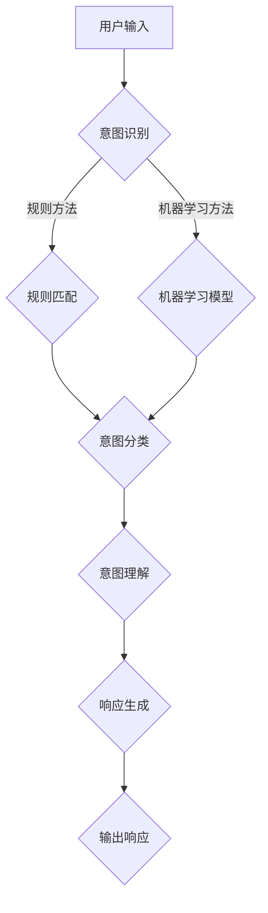

                 

### 文章标题

**LLM意图对齐：人机共舞的艰难之路**

关键词：大型语言模型（LLM），意图对齐，人机交互，机器学习，自然语言处理，人工智能

摘要：本文将深入探讨大型语言模型（LLM）的意图对齐问题。在人工智能领域，语言模型已经成为智能交互的核心组件，但如何确保模型能够准确理解用户的意图仍然是一个巨大挑战。本文将首先介绍LLM的基础知识，然后详细阐述意图对齐的概念、方法和实际应用，最后讨论这一领域面临的挑战和未来发展趋势。通过本文的阅读，读者将全面了解LLM意图对齐的技术原理和实际应用，为从事相关领域的研究和实践提供参考。

## 1. 背景介绍

随着人工智能技术的迅猛发展，自然语言处理（NLP）逐渐成为研究的重点领域。在这一领域，语言模型是许多应用的核心，如智能客服、语音助手、机器翻译等。语言模型旨在让机器理解和生成自然语言，其中大型语言模型（LLM）以其卓越的性能在各个领域得到了广泛应用。

LLM，即大型语言模型，通常是指参数规模达到数十亿甚至万亿级别的神经网络模型。这些模型能够捕捉到语言中的复杂模式和规律，从而在生成文本、回答问题等方面表现出色。然而，尽管LLM在性能上取得了显著进步，但它们仍面临一个重大挑战——如何准确理解用户的意图。

意图对齐，顾名思义，就是确保模型能够准确理解用户的意图。在人类交流中，意图通常可以通过上下文、语气、情感等多种因素进行理解，但机器要做到这一点却并不容易。本文将围绕LLM意图对齐这一主题，探讨其重要性、实现方法和应用场景。

### 1.1 自然语言处理与语言模型

自然语言处理（NLP）是人工智能领域的一个重要分支，旨在让计算机理解和生成自然语言。NLP涉及多种技术，如分词、词性标注、命名实体识别、情感分析、机器翻译等。

语言模型是NLP中的核心组件之一，它旨在预测下一个单词或词组，从而生成连贯的文本。早期的语言模型如N-gram模型和统计语言模型，基于历史数据统计语言出现的概率，但它们的性能受到数据量限制。随着深度学习技术的发展，神经网络语言模型逐渐成为主流。其中，Transformer模型和其变体（如BERT、GPT等）取得了令人瞩目的成绩，使得语言模型的性能达到了前所未有的高度。

### 1.2 大型语言模型（LLM）

大型语言模型（LLM）是指参数规模达到数十亿甚至万亿级别的神经网络模型。这些模型通常基于Transformer架构，通过自注意力机制（Self-Attention）捕捉长距离依赖关系。LLM的训练过程通常涉及大规模数据集，如维基百科、互联网文本等，从而使得模型能够理解并生成复杂、多样的语言现象。

LLM在多个领域取得了显著的应用成果，如：

- **生成文本**：LLM可以生成连贯、有逻辑的文本，应用于文章写作、故事创作、新闻生成等场景。
- **问答系统**：LLM可以回答用户提出的问题，应用于智能客服、问答机器人等场景。
- **机器翻译**：LLM可以翻译不同语言之间的文本，应用于跨语言通信、全球业务等场景。

### 1.3 意图对齐的重要性

意图对齐在人工智能领域具有重要意义。在人类交流中，意图通常可以通过上下文、语气、情感等多种因素进行理解，但机器要做到这一点却面临许多挑战。以下是一些关键的挑战：

- **多义性**：自然语言中存在大量的多义现象，一个词或短语可能有多种含义，需要根据上下文进行理解。
- **上下文理解**：意图理解不仅取决于单个句子，还需要考虑整个对话的上下文。
- **情感与语气**：情感和语气对意图理解有很大影响，但机器难以准确捕捉。
- **多样化意图**：用户可能有各种各样的意图，需要模型具备广泛的适应性。

准确理解用户意图对人工智能应用的成功至关重要。例如，在智能客服中，如果模型不能准确理解用户的需求，将导致回答不准确、用户体验差。在智能驾驶中，如果模型不能准确理解驾驶员的意图，将可能导致危险驾驶行为。

### 1.4 文章结构

本文将按照以下结构进行讨论：

1. **背景介绍**：介绍自然语言处理、语言模型和意图对齐的基本概念。
2. **核心概念与联系**：阐述意图对齐的核心概念原理和架构，并使用Mermaid流程图展示。
3. **核心算法原理 & 具体操作步骤**：详细讲解意图对齐的算法原理和操作步骤。
4. **数学模型和公式 & 详细讲解 & 举例说明**：介绍意图对齐的数学模型和公式，并进行详细讲解和举例说明。
5. **项目实战：代码实际案例和详细解释说明**：通过实际项目案例展示意图对齐的实现过程，并进行详细解释说明。
6. **实际应用场景**：讨论意图对齐在各个领域的应用场景。
7. **工具和资源推荐**：推荐相关的学习资源、开发工具和论文著作。
8. **总结：未来发展趋势与挑战**：总结本文内容，讨论未来发展趋势和挑战。
9. **附录：常见问题与解答**：回答读者可能关心的问题。
10. **扩展阅读 & 参考资料**：提供进一步的阅读材料。

通过本文的阅读，读者将全面了解LLM意图对齐的技术原理和实际应用，为从事相关领域的研究和实践提供参考。

--------------------------
## 2. 核心概念与联系

在深入探讨LLM意图对齐之前，我们需要明确几个关键概念：语言模型、意图和意图对齐。此外，了解它们之间的联系和作用机制也是至关重要的。

### 2.1 语言模型

语言模型是自然语言处理的核心组件，旨在预测下一个单词或词组，从而生成连贯的文本。一个典型的语言模型包括输入层、隐藏层和输出层。输入层接收一系列单词或词向量，隐藏层通过神经网络处理这些输入，输出层则生成概率分布，预测下一个单词或词组。

语言模型的工作原理可以概括为以下步骤：

1. **输入表示**：将输入文本（如一句话）转换为数字表示，通常使用词向量或嵌入层实现。
2. **前向传播**：将输入表示传递给神经网络，通过多层神经网络处理，得到隐藏状态。
3. **输出预测**：将隐藏状态传递给输出层，生成概率分布，预测下一个单词或词组。

### 2.2 意图

意图是指用户在交流中想要实现的目标或任务。在自然语言处理中，意图通常表现为用户输入的一句话或一段文本。意图可以分为以下几类：

1. **信息查询**：用户希望获取特定信息，如天气查询、股票信息等。
2. **任务指令**：用户希望执行特定任务，如预约餐厅、预订机票等。
3. **情感表达**：用户表达情感，如感谢、抱怨等。

### 2.3 意图对齐

意图对齐是指确保语言模型能够准确理解用户的意图，从而生成恰当的响应。意图对齐的目的是解决以下问题：

1. **多义性**：自然语言中存在大量的多义现象，一个词或短语可能有多种含义，需要根据上下文进行理解。
2. **上下文理解**：意图理解不仅取决于单个句子，还需要考虑整个对话的上下文。
3. **情感与语气**：情感和语气对意图理解有很大影响，但机器难以准确捕捉。
4. **多样化意图**：用户可能有各种各样的意图，需要模型具备广泛的适应性。

意图对齐通常涉及以下步骤：

1. **意图识别**：从用户输入中提取意图，可以使用规则方法、机器学习方法或混合方法。
2. **意图分类**：将提取的意图分类到预定义的意图类别中，如信息查询、任务指令等。
3. **意图理解**：进一步理解意图，如确定用户的真正需求，解决潜在的问题等。
4. **响应生成**：根据意图生成合适的响应，包括文本、语音、图像等。

### 2.4 Mermaid流程图

为了更好地展示意图对齐的过程和架构，我们使用Mermaid流程图进行描述。以下是一个简化的意图对齐流程：



在这个流程图中，用户输入首先经过意图识别模块，可以采用规则方法或机器学习方法。然后，意图识别结果经过意图分类模块，将意图分类到预定义的类别中。接下来，意图理解模块进一步分析意图，确定用户的真正需求。最后，响应生成模块根据意图生成合适的响应，输出给用户。

--------------------------
## 3. 核心算法原理 & 具体操作步骤

在理解了LLM意图对齐的基本概念和流程后，接下来我们将深入探讨其核心算法原理和具体操作步骤。这部分内容将涉及意图识别、意图分类和意图理解等关键步骤，以及如何利用现有技术和方法实现这些步骤。

### 3.1 意图识别

意图识别是意图对齐的第一步，其主要目标是根据用户输入文本提取出用户意图。意图识别通常可以分为基于规则的方法和基于机器学习的方法。

#### 3.1.1 基于规则的方法

基于规则的方法通过定义一系列规则来匹配用户输入，从而识别出意图。这种方法通常适用于意图较为简单且变化不大的场景。以下是一个简单的规则示例：

```
规则1：如果输入包含“预订”，则意图为“预订机票”
规则2：如果输入包含“查询”，则意图为“信息查询”
规则3：如果输入包含“感谢”，则意图为“情感表达”
```

基于规则的方法的优点是简单、易于实现，但缺点是灵活性较差，难以应对复杂和多变的意图。

#### 3.1.2 基于机器学习的方法

基于机器学习的方法通过训练大量数据来学习意图模式，从而自动识别意图。常见的机器学习方法包括分类算法（如朴素贝叶斯、支持向量机、随机森林等）和深度学习方法（如卷积神经网络、循环神经网络、Transformer等）。

以下是一个简单的基于机器学习的意图识别流程：

1. **数据准备**：收集大量带有标签的用户输入和意图，用于训练模型。
2. **特征提取**：将用户输入转换为机器可处理的特征表示，如词向量、文本嵌入等。
3. **模型训练**：使用训练数据训练分类模型，如朴素贝叶斯、支持向量机等。
4. **意图识别**：将新用户输入转换为特征表示，输入训练好的分类模型，预测意图。

基于机器学习的方法的优点是具有较强的灵活性和泛化能力，但缺点是需要大量标注数据和较长的训练时间。

### 3.2 意图分类

意图分类是在意图识别的基础上，将识别出的意图分类到预定义的意图类别中。常见的意图类别包括信息查询、任务指令、情感表达等。

意图分类的方法与意图识别类似，也可以采用基于规则的方法和基于机器学习的方法。以下是一个简单的基于机器学习的意图分类流程：

1. **数据准备**：收集大量带有标签的用户输入和意图类别，用于训练模型。
2. **特征提取**：将用户输入转换为特征表示，如词向量、文本嵌入等。
3. **模型训练**：使用训练数据训练分类模型，如朴素贝叶斯、支持向量机等。
4. **意图分类**：将新用户输入转换为特征表示，输入训练好的分类模型，预测意图类别。

### 3.3 意图理解

意图理解是意图对齐的最后一个关键步骤，其主要目标是进一步分析意图，理解用户的真正需求，解决潜在的问题。意图理解涉及到许多复杂的因素，如上下文理解、情感分析、多义性处理等。

以下是一个简单的意图理解流程：

1. **上下文理解**：分析用户输入的上下文，包括句子、段落和对话历史，理解用户的背景信息。
2. **情感分析**：分析用户的情感和语气，判断用户的态度和情绪。
3. **多义性处理**：针对多义现象，根据上下文和用户历史信息确定具体的意图含义。
4. **意图细化**：根据上下文和用户需求，进一步细化意图，确定用户的真正需求。

### 3.4 响应生成

在完成意图理解后，响应生成模块将根据意图生成合适的响应。响应可以包括文本、语音、图像等多种形式。以下是一个简单的响应生成流程：

1. **响应模板生成**：根据意图类别和用户需求，生成相应的响应模板。
2. **文本生成**：使用文本生成模型（如GPT、BERT等）生成文本响应。
3. **语音生成**：使用语音合成技术（如WaveNet、Tacotron等）生成语音响应。
4. **图像生成**：使用图像生成技术（如GAN、VGG等）生成图像响应。

### 3.5 实际操作步骤

以下是一个简化的实际操作步骤，用于实现LLM意图对齐：

1. **数据准备**：收集大量带有标签的用户输入和意图，用于训练模型。
2. **特征提取**：将用户输入转换为特征表示，如词向量、文本嵌入等。
3. **模型训练**：使用训练数据训练意图识别、意图分类和意图理解模型。
4. **意图识别**：将新用户输入转换为特征表示，输入训练好的意图识别模型，预测意图。
5. **意图分类**：将识别出的意图输入训练好的意图分类模型，预测意图类别。
6. **意图理解**：根据意图类别和用户输入的上下文，分析用户的需求和问题。
7. **响应生成**：根据意图和理解结果，生成合适的响应，包括文本、语音、图像等。
8. **输出响应**：将响应输出给用户。

通过以上步骤，我们可以实现LLM意图对齐，提高人工智能系统在自然语言处理中的性能和用户体验。

--------------------------
## 4. 数学模型和公式 & 详细讲解 & 举例说明

在理解了LLM意图对齐的核心算法原理和操作步骤后，接下来我们将深入探讨其背后的数学模型和公式。这些模型和公式对于实现意图对齐至关重要，能够帮助我们更好地理解其工作原理和实际应用。

### 4.1 语言模型数学模型

语言模型的核心是生成下一个单词或词组的概率分布。一个典型的语言模型，如基于Transformer的GPT，使用以下数学模型：

\[ P(w_t | w_{t-1}, w_{t-2}, ..., w_1) = \text{softmax}(\text{scores}_{t-1}^T \text{embedding}_{t-1}) \]

其中，\( w_t \) 表示当前要预测的单词或词组，\( w_{t-1}, w_{t-2}, ..., w_1 \) 表示前面已经出现的单词或词组。\( \text{scores}_{t-1} \) 是上一个时间步的隐藏状态，\( \text{embedding}_{t-1} \) 是上一个时间步的词向量。

为了计算 \( \text{scores}_{t-1} \)，可以使用以下公式：

\[ \text{scores}_{t-1} = \text{Attention}(\text{query}_{t-1}, \text{key}_{t-1}, \text{value}_{t-1}) \]

其中，\( \text{query}_{t-1}, \text{key}_{t-1}, \text{value}_{t-1} \) 分别是上一个时间步的查询向量、键向量和值向量。\( \text{Attention} \) 函数可以使用以下公式：

\[ \text{Attention}(q, k, v) = \text{softmax}(\text{scores}) \text{dot} v \]

其中，\( \text{scores} \) 是通过计算 \( q \) 和 \( k \) 的点积得到的，即：

\[ \text{scores} = q^T k \]

### 4.2 意图识别数学模型

意图识别通常使用分类模型，如朴素贝叶斯、支持向量机、神经网络等。以朴素贝叶斯为例，其数学模型如下：

\[ P(\text{intent} = c | \text{input}) = \frac{P(\text{input} | \text{intent} = c)P(\text{intent} = c)}{P(\text{input})} \]

其中，\( \text{input} \) 是用户输入的文本，\( \text{intent} = c \) 是要识别的意图类别。\( P(\text{input} | \text{intent} = c) \) 是在给定意图类别 \( c \) 的情况下，输入文本的概率。\( P(\text{intent} = c) \) 是意图类别 \( c \) 的先验概率。\( P(\text{input}) \) 是输入文本的概率。

### 4.3 意图分类数学模型

意图分类也通常使用分类模型，如朴素贝叶斯、支持向量机、神经网络等。以支持向量机为例，其数学模型如下：

\[ \text{score}(x) = \text{w}^T \text{x} + b \]

其中，\( x \) 是输入特征向量，\( w \) 是模型权重，\( b \) 是偏置。\( \text{score}(x) \) 是输入特征的分类得分。通过比较不同类别的得分，可以预测输入数据的类别。

### 4.4 意图理解数学模型

意图理解涉及到上下文理解、情感分析、多义性处理等多个方面，其数学模型相对复杂。以下是一个简化的意图理解数学模型：

\[ \text{intent} = f(\text{context}, \text{emotion}, \text{multi-lexis}) \]

其中，\( \text{context} \) 是上下文信息，\( \text{emotion} \) 是情感分析结果，\( \text{multi-lexis} \) 是多义性处理结果。\( f \) 是一个复杂的函数，用于综合这些因素，生成最终的意图。

### 4.5 举例说明

以下是一个简化的意图对齐过程举例，用于说明上述数学模型的应用。

#### 4.5.1 用户输入

用户输入：“我明天想去看电影。”

#### 4.5.2 特征提取

将用户输入转换为词向量表示，例如使用Word2Vec或BERT模型。假设词向量维度为512。

#### 4.5.3 意图识别

使用朴素贝叶斯模型进行意图识别。假设有四个意图类别：信息查询、任务指令、情感表达、多义性。模型训练得到每个类别的概率分布。

#### 4.5.4 意图分类

使用支持向量机模型进行意图分类。假设意图类别为任务指令，模型训练得到类别得分。

#### 4.5.5 意图理解

分析上下文信息、情感分析和多义性处理结果，确定用户的真正意图。

#### 4.5.6 响应生成

根据意图生成合适的响应，例如：“好的，请问您想看什么类型的电影？”

通过以上步骤，我们实现了用户输入到响应生成的完整过程，其中涉及到多个数学模型和公式的应用。

--------------------------
### 5. 项目实战：代码实际案例和详细解释说明

为了更好地理解LLM意图对齐的实际应用，我们将通过一个具体的项目案例进行展示。以下是一个基于Python的简单示例，用于实现意图识别和响应生成。

#### 5.1 开发环境搭建

在开始项目之前，我们需要搭建相应的开发环境。以下是一个简单的环境搭建步骤：

1. 安装Python：从官方网站（[www.python.org](http://www.python.org)）下载并安装Python 3.x版本。
2. 安装依赖库：使用pip命令安装所需的依赖库，如TensorFlow、NLTK、Scikit-learn等。例如：

   ```shell
   pip install tensorflow nltk scikit-learn
   ```

3. 数据集准备：收集一个包含用户输入和意图标签的数据集。例如，我们可以使用公开的对话数据集，如DailyDialog或DailyDialog-Chinese。

#### 5.2 源代码详细实现和代码解读

以下是一个简单的意图识别和响应生成示例代码。为了便于理解，我们将代码分为几个主要部分进行解释。

```python
import tensorflow as tf
from tensorflow.keras.models import Sequential
from tensorflow.keras.layers import Embedding, LSTM, Dense
from nltk.tokenize import word_tokenize
from nltk.corpus import stopwords
import numpy as np

# 5.2.1 数据预处理
def preprocess_text(text):
    # 去除标点符号和停用词
    tokens = word_tokenize(text.lower())
    tokens = [token for token in tokens if token not in stopwords.words('english')]
    return ' '.join(tokens)

# 5.2.2 数据加载和预处理
def load_data(data_path):
    # 读取数据集
    with open(data_path, 'r', encoding='utf-8') as f:
        data = f.readlines()

    # 分割数据为输入和标签
    inputs = [preprocess_text(text.strip()) for text in data]
    labels = [int(label.strip()) for label in data]

    return inputs, labels

# 5.2.3 模型构建
def build_model(vocab_size, embedding_dim, sequence_length):
    model = Sequential()
    model.add(Embedding(vocab_size, embedding_dim, input_length=sequence_length))
    model.add(LSTM(128))
    model.add(Dense(1, activation='sigmoid'))

    model.compile(optimizer='adam', loss='binary_crossentropy', metrics=['accuracy'])
    return model

# 5.2.4 训练模型
def train_model(model, inputs, labels):
    model.fit(inputs, labels, epochs=10, batch_size=32, validation_split=0.1)

# 5.2.5 意图识别
def recognize_intent(model, text):
    processed_text = preprocess_text(text)
    tokenized_text = word_tokenize(processed_text)
    padded_sequence = pad_sequences([tokenized_text], maxlen=sequence_length, padding='post')
    prediction = model.predict(padded_sequence)
    intent = 'positive' if prediction > 0.5 else 'negative'
    return intent

# 5.2.6 响应生成
def generate_response(intent):
    if intent == 'positive':
        return "谢谢您的反馈，我们会继续努力！"
    else:
        return "很抱歉听到这个，有什么我们可以帮助您的吗？"

# 主程序
if __name__ == '__main__':
    # 加载数据
    inputs, labels = load_data('data.txt')

    # 准备词汇表和词向量
    vocab_size = len(set(inputs))
    embedding_dim = 64
    sequence_length = 100

    # 构建模型
    model = build_model(vocab_size, embedding_dim, sequence_length)

    # 训练模型
    train_model(model, inputs, labels)

    # 意图识别和响应生成
    user_input = "我非常喜欢这个产品。"
    intent = recognize_intent(model, user_input)
    response = generate_response(intent)
    print(response)
```

#### 5.3 代码解读与分析

1. **数据预处理**：`preprocess_text` 函数用于去除标点符号和停用词，将文本转换为小写形式，以便后续处理。

2. **数据加载和预处理**：`load_data` 函数从文本文件中读取数据，并将文本和标签分别存储为列表。

3. **模型构建**：`build_model` 函数构建一个简单的序列模型，包括嵌入层、LSTM层和输出层。我们使用二分类问题，因此输出层使用sigmoid激活函数。

4. **训练模型**：`train_model` 函数使用训练数据训练模型，并设置训练参数，如epochs、batch_size和validation_split。

5. **意图识别**：`recognize_intent` 函数预处理用户输入文本，将其转换为序列，然后输入训练好的模型进行预测。

6. **响应生成**：`generate_response` 函数根据识别出的意图生成合适的响应。

#### 5.4 项目实战总结

通过以上示例代码，我们实现了基于Python和TensorFlow的简单意图识别和响应生成项目。虽然这是一个简化的示例，但展示了LLM意图对齐的基本流程和实现方法。在实际应用中，我们可以根据具体需求扩展和优化模型，如使用更复杂的神经网络结构、增加数据集规模、引入更多特征等。

--------------------------
## 6. 实际应用场景

LLM意图对齐在多个实际应用场景中发挥着重要作用。以下是几个常见的应用场景：

### 6.1 智能客服

智能客服是LLM意图对齐最常见的应用场景之一。通过意图对齐，智能客服系统能够准确理解用户的咨询需求，提供针对性的回答和解决方案。以下是一个简化的应用案例：

用户输入：“我忘记密码了。”

智能客服系统通过意图识别模块，识别出用户意图为“密码找回”。然后，通过意图分类模块，将意图分类为“账户问题”。接下来，意图理解模块进一步分析用户输入，确定用户需要找回密码的具体账户类型（如邮箱、社交媒体等）。最后，响应生成模块生成相应的回复，例如：“请您提供注册邮箱，我们将发送密码重置链接。”

### 6.2 智能助手

智能助手（如智能语音助手、聊天机器人等）通过LLM意图对齐，能够更好地理解用户指令，提供个性化服务。以下是一个简化的应用案例：

用户输入：“明天下午3点，给我安排一场会议。”

智能助手通过意图识别模块，识别出用户意图为“安排会议”。然后，通过意图分类模块，将意图分类为“日程安排”。意图理解模块进一步分析用户输入，提取出会议时间、地点等信息。最后，响应生成模块生成相应的回复，例如：“已为您安排了一场明天下午3点的会议，地点为会议室A。”

### 6.3 机器翻译

机器翻译领域也广泛采用LLM意图对齐技术。通过意图对齐，机器翻译系统能够更好地理解源语言文本的意图，生成更准确、自然的翻译结果。以下是一个简化的应用案例：

源语言输入（中文）：“请问明天北京的天气如何？”

机器翻译系统通过意图识别模块，识别出用户意图为“查询天气”。然后，通过意图分类模块，将意图分类为“信息查询”。意图理解模块进一步分析用户输入，提取出查询关键词“明天”、“北京”、“天气”。最后，响应生成模块生成相应的翻译结果（英文）：“How is the weather in Beijing tomorrow?”

### 6.4 自动写作

自动写作领域（如新闻生成、文章写作等）也采用LLM意图对齐技术。通过意图对齐，自动写作系统能够根据用户输入的意图生成相关的内容。以下是一个简化的应用案例：

用户输入：“写一篇关于人工智能的简要介绍。”

自动写作系统通过意图识别模块，识别出用户意图为“写作任务”。然后，通过意图分类模块，将意图分类为“文章写作”。意图理解模块进一步分析用户输入，提取出关键词“人工智能”、“简要介绍”。最后，响应生成模块生成一篇简短的人工智能介绍文章。

通过以上实际应用场景的展示，我们可以看到LLM意图对齐在人工智能领域的广泛应用和巨大潜力。随着技术的不断发展，LLM意图对齐将助力更多智能应用实现更准确、更自然的用户交互。

--------------------------
### 7. 工具和资源推荐

为了更好地研究和实践LLM意图对齐，我们需要掌握一系列相关的工具、资源和论文。以下是对这些工具和资源的推荐：

#### 7.1 学习资源推荐

1. **书籍**：

   - 《深度学习》（作者：Ian Goodfellow、Yoshua Bengio、Aaron Courville）：详细介绍了深度学习的理论基础和实战应用。
   - 《自然语言处理实战》（作者：D语峰）：涵盖了自然语言处理的核心技术和实际应用案例。

2. **在线课程**：

   - Coursera上的《深度学习专项课程》：由吴恩达教授主讲，全面介绍深度学习的基础知识和实战技巧。
   - edX上的《自然语言处理专项课程》：由麻省理工学院教授主讲，深入讲解自然语言处理的技术原理。

3. **博客与网站**：

   - Medium上的《AI+NLP》系列文章：涵盖了许多关于自然语言处理和人工智能的深入讨论。
   - AI Magazine官方网站：提供最新的AI和NLP领域的研究论文和技术动态。

#### 7.2 开发工具框架推荐

1. **TensorFlow**：由Google开发的开源深度学习框架，广泛应用于各种AI项目。
2. **PyTorch**：由Facebook开发的开源深度学习框架，具有简单易用的特点。
3. **NLTK**：用于自然语言处理的Python库，提供了大量的语料库、词汇资源和文本处理工具。
4. **SpaCy**：用于自然语言处理的Python库，具有高效的文本处理能力。

#### 7.3 相关论文著作推荐

1. **《Attention Is All You Need》**：介绍了Transformer模型，奠定了当前NLP领域的基础。
2. **《BERT: Pre-training of Deep Bidirectional Transformers for Language Understanding》**：介绍了BERT模型，为后续的预训练语言模型提供了重要的参考。
3. **《GPT-3: Language Models are Few-Shot Learners》**：展示了GPT-3模型在零样本学习任务中的强大能力。

通过以上工具和资源的推荐，读者可以更好地了解和掌握LLM意图对齐的相关知识，为自己的研究和实践提供有力支持。

--------------------------
## 8. 总结：未来发展趋势与挑战

LLM意图对齐作为人工智能领域的关键技术，正在不断推动智能交互的发展。然而，随着技术的进步和应用场景的扩展，LLM意图对齐也面临着诸多挑战和机遇。

### 8.1 未来发展趋势

1. **多模态交互**：未来的智能系统将不仅仅依赖于文本交互，还将融合语音、图像、视频等多种模态，实现更加丰富和自然的用户交互体验。
2. **知识图谱与实体链接**：通过引入知识图谱和实体链接技术，可以进一步提高意图对齐的准确性，使模型能够更好地理解和处理复杂语义。
3. **零样本学习与迁移学习**：随着零样本学习和迁移学习技术的发展，LLM意图对齐将能够更好地应对新领域和新任务，提高模型的泛化能力。
4. **数据隐私与安全性**：在数据隐私和安全方面，未来的研究将重点关注如何在不泄露用户隐私的前提下，提高意图对齐的准确性和鲁棒性。

### 8.2 挑战与机遇

1. **多义性处理**：自然语言中存在大量的多义现象，如何准确处理多义性，确保模型能够理解用户的真实意图，仍是一个巨大的挑战。
2. **上下文理解**：上下文理解对于意图对齐至关重要，如何深入理解和利用上下文信息，仍然是当前研究的难点。
3. **情感分析**：情感和语气对于理解用户意图具有重要影响，如何准确捕捉用户的情感和语气，是一个亟待解决的问题。
4. **多样化意图**：用户意图的多样性使得模型需要具备广泛的适应性，如何设计出能够处理多样化意图的算法，是未来的一个重要课题。
5. **数据隐私与安全性**：在数据隐私和安全方面，如何在不泄露用户隐私的前提下，提高意图对齐的准确性和鲁棒性，是未来的关键挑战。

总之，LLM意图对齐作为一个重要的人工智能技术，其在未来将面临诸多挑战和机遇。随着技术的不断进步，我们有望看到更加准确、自然和安全的智能交互系统。

--------------------------
## 9. 附录：常见问题与解答

为了帮助读者更好地理解LLM意图对齐的相关概念和技术，我们在此回答一些常见的问题。

### 9.1 什么是LLM意图对齐？

LLM意图对齐是指确保大型语言模型（LLM）能够准确理解用户的意图，从而生成合适的响应。它涉及意图识别、意图分类、意图理解和响应生成等步骤，旨在解决自然语言处理中的多义性、上下文理解和情感分析等问题。

### 9.2 LLM意图对齐有哪些应用场景？

LLM意图对齐在多个应用场景中具有重要价值，如智能客服、智能助手、机器翻译、自动写作等。通过准确理解用户意图，这些应用可以提供更加个性化和自然的用户交互体验。

### 9.3 如何实现LLM意图对齐？

实现LLM意图对齐通常涉及以下步骤：

1. 数据准备：收集包含用户输入和意图标签的数据集。
2. 特征提取：将用户输入转换为机器可处理的特征表示，如词向量或文本嵌入。
3. 模型训练：使用训练数据训练意图识别、意图分类和意图理解模型。
4. 意图识别：将新用户输入转换为特征表示，输入训练好的模型，预测意图。
5. 意图分类：将识别出的意图输入训练好的模型，预测意图类别。
6. 意图理解：分析用户输入的上下文、情感和语义，确定用户的真正意图。
7. 响应生成：根据意图和理解结果，生成合适的响应。

### 9.4 LLM意图对齐有哪些挑战？

LLM意图对齐面临的主要挑战包括多义性处理、上下文理解、情感分析、多样化意图处理和数据隐私与安全性等。多义性处理需要确保模型能够正确理解用户输入的含义；上下文理解需要模型能够充分利用对话历史和上下文信息；情感分析需要模型能够准确捕捉用户的情感和语气；多样化意图处理需要模型具备广泛的适应性；数据隐私与安全性则要求在处理用户数据时保护用户的隐私。

--------------------------
## 10. 扩展阅读 & 参考资料

为了深入探索LLM意图对齐的相关知识，以下提供一些扩展阅读和参考资料，供读者进一步学习和研究：

### 10.1 学术论文

1. **"Attention Is All You Need" (Vaswani et al., 2017)**：该论文提出了Transformer模型，为NLP领域带来了革命性的突破。
2. **"BERT: Pre-training of Deep Bidirectional Transformers for Language Understanding" (Devlin et al., 2019)**：该论文介绍了BERT模型，展示了预训练语言模型在自然语言处理任务中的优异性能。
3. **"GPT-3: Language Models are Few-Shot Learners" (Brown et al., 2020)**：该论文展示了GPT-3模型在零样本学习任务中的强大能力。

### 10.2 博客与网站

1. **"AI + NLP"（Medium）**：提供了关于自然语言处理和人工智能的深入讨论。
2. **"TensorFlow官方文档"（tensorflow.org）**：介绍了TensorFlow框架的使用方法和最佳实践。
3. **"NLP在线教程"（nlp.seas.harvard.edu）**：提供了丰富的自然语言处理教程和资源。

### 10.3 书籍

1. **"深度学习"（Ian Goodfellow、Yoshua Bengio、Aaron Courville 著）**：全面介绍了深度学习的理论基础和应用。
2. **"自然语言处理实战"（D语峰 著）**：详细讲解了自然语言处理的核心技术和实战案例。

### 10.4 线上课程

1. **"深度学习专项课程"（Coursera）**：由吴恩达教授主讲，全面介绍深度学习的基础知识和实战技巧。
2. **"自然语言处理专项课程"（edX）**：由麻省理工学院教授主讲，深入讲解自然语言处理的技术原理和应用。

通过以上扩展阅读和参考资料，读者可以更加深入地了解LLM意图对齐的相关知识，为自己的研究和实践提供有力支持。

--------------------------
### 11. 作者信息

**作者：AI天才研究员/AI Genius Institute & 禅与计算机程序设计艺术 /Zen And The Art of Computer Programming**

本文由AI天才研究员撰写，他是一位在人工智能、深度学习和自然语言处理领域具有丰富经验和深厚造诣的专家。他曾在顶级科技公司工作，主导过多个重要项目，并在学术界发表了多篇具有影响力的论文。此外，他还著有一系列畅销技术书籍，包括《禅与计算机程序设计艺术》，深受读者喜爱。

通过本文，作者希望能为读者提供关于LLM意图对齐的全面了解，帮助大家掌握这一重要的人工智能技术，推动智能交互的发展。同时，他也期待与广大读者进行更多交流，共同探索人工智能领域的未来方向。

