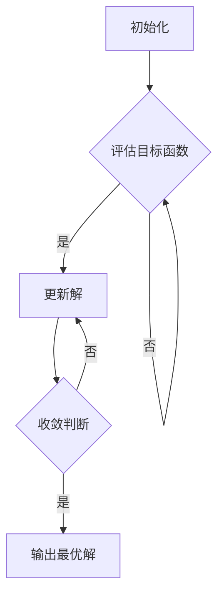

                 

### 背景介绍

**LLM推荐中的多目标优化技术**

随着人工智能技术的飞速发展，深度学习模型，尤其是大型语言模型（LLM，Large Language Model）的应用日益广泛。在推荐系统中，LLM可以通过学习用户的历史行为和偏好来生成个性化的推荐结果，从而提高用户体验和满意度。然而，在LLM推荐系统中，多目标优化问题变得尤为突出。

多目标优化是一种在多个相互冲突的目标之间寻找最优解的方法。在LLM推荐系统中，这些目标可能包括提高推荐准确率、增加用户互动率、优化系统成本等。由于这些目标之间存在复杂的相互作用和权衡，传统的单目标优化方法难以有效地解决多目标优化问题。

本文旨在探讨LLM推荐中的多目标优化技术，分析其核心概念、算法原理、数学模型以及实际应用场景。通过逐步分析推理，我们将深入理解多目标优化技术在实际应用中的优势和挑战，为未来的研究提供有价值的参考。

首先，我们将介绍多目标优化技术的核心概念，包括目标函数、约束条件和优化算法。接着，我们将通过一个Mermaid流程图，详细展示LLM推荐系统中多目标优化的架构和流程。随后，我们将重点探讨几种核心算法原理和具体操作步骤，以及如何利用数学模型和公式来分析和解决多目标优化问题。最后，我们将结合实际项目案例，展示多目标优化技术的具体应用和实践效果。

通过本文的探讨，我们希望能够为读者提供一个全面、深入的理解，帮助他们在实际应用中更好地利用多目标优化技术，提升LLM推荐系统的性能和效果。

### 1.1 多目标优化的定义与基本概念

多目标优化（Multi-Objective Optimization）是一种在多个相互冲突的目标之间寻找最优解的数学方法。在传统单目标优化问题中，我们通常只有一个目标函数需要最大化或最小化。然而，在现实世界中，许多问题往往涉及多个目标，这些目标之间可能存在复杂的相互作用和权衡。例如，在LLM推荐系统中，我们可能需要同时优化推荐准确率、用户互动率和系统成本等目标。

定义上，多目标优化问题可以形式化表示为：

$$
\min_{x} f(x) = (f_1(x), f_2(x), ..., f_n(x))
$$

其中，$x$ 是决策变量，$f(x)$ 是目标函数向量，$f_1(x), f_2(x), ..., f_n(x)$ 是各个子目标函数。这些子目标函数通常具有不同的度量标准和优化方向，可能存在冲突。例如，在推荐系统中，提高推荐准确率可能会增加计算资源消耗，而降低系统成本可能会影响推荐效果。

多目标优化问题具有以下基本特征：

1. **目标函数的冲突性**：不同目标函数之间可能存在冲突，优化一个目标可能会损害另一个目标。
2. **非凸性**：目标函数可能不是凸函数，使得求解过程更加复杂。
3. **约束条件**：多目标优化问题通常受到多种约束条件的限制，这些约束条件可能限制决策变量的取值范围。

在LLM推荐系统中，多目标优化问题尤为突出。例如，推荐系统的目标可以包括：

- **推荐准确率**：最大化推荐结果的正确性，减少用户投诉和流失。
- **用户互动率**：提高用户对推荐内容的互动程度，如点击率、分享率等。
- **系统成本**：优化系统运行的成本，包括计算资源、存储资源等。

这些目标之间往往存在复杂的权衡关系。提高推荐准确率可能需要更多的计算资源，从而增加系统成本；而降低系统成本可能会影响推荐效果，导致用户互动率下降。因此，在LLM推荐系统中，如何有效地解决多目标优化问题，实现多个目标之间的平衡，是一个关键挑战。

通过多目标优化技术，我们可以系统地分析和解决这些复杂的问题。具体来说，多目标优化技术可以帮助我们：

- **寻找最优解**：在多个目标之间找到一种平衡，使得整体性能达到最优。
- **权衡不同目标**：在不同目标之间进行权衡，根据业务需求和优先级调整优化策略。
- **提高系统性能**：通过优化推荐算法和系统架构，提升推荐系统的整体性能和用户体验。

总之，多目标优化技术在LLM推荐系统中具有重要的应用价值，是提升系统性能和用户满意度的重要手段。在接下来的内容中，我们将深入探讨多目标优化的算法原理、数学模型以及实际应用，为读者提供更全面的了解。

### 1.2 LLM推荐系统中的多目标优化背景和重要性

在深度学习模型中，大型语言模型（LLM）以其强大的表示能力和学习能力，在自然语言处理（NLP）领域取得了显著的突破。LLM推荐系统通过分析用户的历史行为和偏好，生成个性化的推荐结果，从而为用户提供高质量的推荐服务。然而，随着应用场景的复杂化和多样性，LLM推荐系统中面临着多目标优化的挑战。

首先，从背景上看，LLM推荐系统的应用涵盖了广泛的领域，包括电子商务、社交媒体、在线视频、新闻推荐等。在这些应用场景中，推荐系统需要同时满足多个目标，例如：

- **推荐准确率**：确保推荐结果与用户兴趣和需求的高度匹配，减少推荐失误。
- **用户体验**：提高用户的满意度，减少用户流失和投诉。
- **系统性能**：优化系统响应时间，降低计算资源消耗。

这些目标之间往往存在复杂的相互作用和权衡关系。例如，提高推荐准确率可能会增加计算负担，而优化系统性能可能会降低推荐效果。因此，如何在一个统一框架下同时优化多个目标，成为一个重要的研究课题。

多目标优化在LLM推荐系统中的重要性主要体现在以下几个方面：

1. **平衡目标之间的冲突**：多目标优化技术可以帮助我们平衡推荐系统中的多个目标，解决目标之间的冲突。例如，在推荐准确率和系统性能之间找到最优平衡点，确保在资源有限的情况下，推荐效果达到最佳。

2. **提升系统整体性能**：通过多目标优化，我们可以全面优化推荐系统的各个方面，提升整体性能。例如，通过优化推荐算法和系统架构，提高推荐准确率和用户互动率，同时降低系统成本，从而提升用户体验和业务收益。

3. **适应动态环境**：在实际应用中，用户需求和偏好是动态变化的。多目标优化技术可以帮助推荐系统灵活应对这些变化，动态调整优化策略，保持推荐效果的最优。

4. **增强决策支持**：多目标优化技术为推荐系统的决策提供了有力支持。通过分析不同目标之间的关系和权衡，推荐系统可以做出更加明智的决策，优化推荐策略。

为了更好地理解多目标优化在LLM推荐系统中的应用，我们可以通过一个具体的例子来进行分析。假设我们设计一个电子商务平台的推荐系统，需要同时考虑以下目标：

- **推荐准确率**：提高推荐商品与用户兴趣的匹配度，减少用户投诉和流失。
- **用户互动率**：提高用户对推荐商品的点击率和购买率，增加平台收益。
- **系统成本**：优化推荐算法和系统架构，降低计算资源消耗，提高系统稳定性。

这些目标之间存在明显的冲突。例如，提高推荐准确率可能会增加计算负担，从而影响系统成本；而降低系统成本可能会降低推荐效果，影响用户互动率。通过多目标优化技术，我们可以在一个统一框架下同时优化这些目标，找到最优的推荐策略。

具体来说，我们可以使用多目标优化算法，如多目标遗传算法（MOGA）或多目标粒子群算法（MOPSO），来求解这个多目标优化问题。这些算法可以同时考虑多个目标，并在多个解之间进行权衡，找到一种平衡的解决方案。例如，通过调整遗传算法中的交叉和变异操作，可以在推荐准确率和系统成本之间找到最优平衡点。

总之，多目标优化技术在LLM推荐系统中具有重要的应用价值。通过有效地解决多目标优化问题，我们可以提升推荐系统的整体性能和用户体验，为用户提供更加个性化、高质量的推荐服务。在接下来的内容中，我们将深入探讨多目标优化的算法原理和具体实现，为读者提供更全面的了解。

### 1.3 LLM推荐系统中的多目标优化挑战

尽管多目标优化技术在LLM推荐系统中具有广泛的应用前景，但实际应用过程中仍面临诸多挑战。这些挑战主要体现在以下几个方面：

1. **计算复杂性**：多目标优化问题通常具有高维特性，涉及大量的决策变量和目标函数。这意味着在计算过程中，需要处理大量复杂的数学运算，计算复杂性显著增加。例如，在推荐系统中，需要同时考虑用户的兴趣偏好、推荐内容的多样性和系统资源消耗等。这些因素相互交织，使得计算过程变得异常复杂。

2. **目标冲突**：多目标优化问题中的各个目标函数之间可能存在明显的冲突。例如，提高推荐准确率可能会增加计算资源消耗，而降低系统成本可能会降低推荐效果。这种目标冲突使得在寻找最优解时需要做出艰难的权衡，难以找到一个全面最优的解决方案。

3. **数据不足和不确定性**：在LLM推荐系统中，多目标优化问题往往依赖于大量用户数据和推荐内容数据。然而，实际应用中，数据质量和数据量可能无法满足优化需求。此外，用户行为和偏好具有动态变化的特点，导致优化过程中存在不确定性。这些因素使得多目标优化问题更加复杂，难以准确预测和建模。

4. **优化算法选择**：针对多目标优化问题，存在多种优化算法，如遗传算法、粒子群算法、模拟退火算法等。每种算法都有其优势和适用场景，选择合适的算法对优化结果具有重要影响。然而，不同算法在处理高维复杂问题时，可能存在性能差异，难以确定最优算法。

5. **实时性要求**：在许多应用场景中，LLM推荐系统需要满足实时性要求。例如，在电子商务平台上，推荐系统需要实时响应用户的查询和操作，提供个性化的推荐结果。这意味着在优化过程中，需要快速收敛到最优解，避免延迟和响应时间过长。

针对上述挑战，以下是一些可能的解决思路：

1. **高效算法设计**：研究并设计适用于多目标优化问题的高效算法，例如基于深度学习的优化算法。这些算法可以通过引入神经网络模型，将复杂的优化过程转化为简单的参数更新问题，提高计算效率和精度。

2. **约束条件优化**：通过引入约束条件优化技术，可以在多个目标之间建立明确的权衡关系。例如，利用线性规划或约束优化方法，将多个目标函数转化为单一目标函数，简化优化过程。

3. **数据预处理和增强**：通过数据预处理和增强技术，提高数据质量和数据量。例如，使用数据清洗和去噪方法，提高数据质量；使用数据增强技术，生成更多样化的训练数据，提高模型的泛化能力。

4. **分布式计算**：利用分布式计算技术，将优化问题分解为多个子问题，并在多个计算节点上并行处理。这样可以显著降低计算复杂度，提高优化效率。

5. **模型融合和集成**：结合多种优化算法和模型，实现模型融合和集成。通过综合利用不同算法和模型的优势，可以提高优化结果的准确性和稳定性。

总之，LLM推荐系统中的多目标优化挑战复杂且多样。通过深入研究这些挑战，并提出有效的解决方案，我们可以为LLM推荐系统的优化提供有力支持，进一步提升系统性能和用户体验。

### 2.1 核心概念与联系

在LLM推荐系统中的多目标优化问题，我们需要理解几个核心概念：目标函数、约束条件和优化算法。这些概念相互联系，共同构成了多目标优化的基础。

**目标函数**

在多目标优化问题中，目标函数（Objective Function）是衡量和评价解空间中各个解优劣的关键指标。目标函数通常由多个子目标函数组成，每个子目标函数代表系统中的一个特定目标。例如，在LLM推荐系统中，我们可能需要同时考虑推荐准确率、用户互动率和系统成本等多个目标。目标函数可以形式化表示为：

$$
f(x) = (f_1(x), f_2(x), ..., f_n(x))
$$

其中，$x$ 是决策变量，$f_1(x), f_2(x), ..., f_n(x)$ 是各个子目标函数。这些子目标函数可以具有不同的度量标准和优化方向，可能存在冲突。例如，提高推荐准确率可能需要更多的计算资源，而降低系统成本可能会影响推荐效果。

**约束条件**

多目标优化问题通常受到多种约束条件的限制，这些约束条件定义了决策变量的取值范围。约束条件可以是线性的，也可以是非线性的。常见的约束条件包括：

- **资源约束**：例如，计算资源、存储资源等。
- **时间约束**：例如，系统响应时间、处理延迟等。
- **业务约束**：例如，商品库存限制、用户权限等。

约束条件可以形式化表示为：

$$
g_i(x) \leq 0, \quad h_j(x) = 0
$$

其中，$g_i(x)$ 和 $h_j(x)$ 分别表示不等式约束和等式约束。

**优化算法**

优化算法是解决多目标优化问题的关键工具。常见的优化算法包括遗传算法（Genetic Algorithm, GA）、粒子群优化算法（Particle Swarm Optimization, PSO）、模拟退火算法（Simulated Annealing, SA）等。这些算法通过迭代搜索策略，在解空间中寻找最优解。

多目标优化的基本流程如下：

1. **初始化**：随机生成一组初始解，通常称为种群或粒子群。
2. **评估目标函数**：计算每个解的目标函数值，并根据目标函数值对解进行排序。
3. **更新解**：根据优化算法的搜索策略，更新解的取值，使其在解空间中逐步接近最优解。
4. **收敛判断**：判断优化过程是否收敛，如果收敛，则输出最优解；否则，继续迭代。

**Mermaid 流程图**

为了更直观地展示LLM推荐系统中多目标优化的架构和流程，我们可以使用Mermaid流程图进行描述。以下是一个简化的Mermaid流程图示例：



这个流程图展示了多目标优化的基本步骤：初始化、评估目标函数、更新解和收敛判断。通过这个流程图，我们可以清晰地理解多目标优化的架构和流程。

**核心概念与联系总结**

在LLM推荐系统中的多目标优化问题，核心概念包括目标函数、约束条件和优化算法。目标函数衡量解的优劣，约束条件定义解的取值范围，优化算法通过迭代搜索找到最优解。这些概念相互联系，共同构成了多目标优化的基础。通过理解这些核心概念，我们可以更好地设计和实现多目标优化算法，提升LLM推荐系统的性能和效果。

### 3.1 多目标优化算法原理

在LLM推荐系统中，多目标优化算法是解决多目标优化问题的关键。这些算法通过迭代搜索策略，在解空间中寻找最优解或近似最优解。常见的多目标优化算法包括遗传算法（Genetic Algorithm, GA）、粒子群优化算法（Particle Swarm Optimization, PSO）和模拟退火算法（Simulated Annealing, SA）等。本节将详细介绍这些算法的基本原理和操作步骤。

**遗传算法（Genetic Algorithm, GA）**

遗传算法是一种基于自然选择和遗传学原理的优化算法，由John Holland于1975年首次提出。遗传算法通过模拟生物进化过程，在解空间中搜索最优解。

**基本原理**

遗传算法的基本原理可以概括为以下几个步骤：

1. **初始化种群**：随机生成一组初始解，称为种群。
2. **适应度评估**：计算每个解的目标函数值，评估其适应度。
3. **选择**：根据适应度值，从种群中选择适应度较高的个体作为父代。
4. **交叉**：对选择的父代进行交叉操作，生成新的子代。
5. **变异**：对子代进行变异操作，增加解的多样性。
6. **更新种群**：将子代加入种群，替换部分低适应度个体。
7. **迭代**：重复步骤2-6，直到满足终止条件。

**操作步骤**

遗传算法的操作步骤可以进一步详细说明：

1. **初始化种群**：随机生成一组初始解，通常采用编码方式表示解，如二进制编码或实数编码。种群的大小取决于问题规模和解空间的复杂度。

2. **适应度评估**：计算每个解的目标函数值，评估其适应度。适应度值通常与目标函数值成反比，即目标函数值越低，适应度越高。

3. **选择**：根据适应度值，从种群中选择适应度较高的个体作为父代。常见的选择方法包括轮盘赌选择、锦标赛选择和排序选择等。

4. **交叉**：对选择的父代进行交叉操作，生成新的子代。交叉操作模拟生物繁殖过程，通过交换父代的基因片段来生成子代。常见的交叉方法包括单点交叉、两点交叉和均匀交叉等。

5. **变异**：对子代进行变异操作，增加解的多样性。变异操作模拟基因突变过程，通过随机改变子代的某些基因片段来增加解的多样性。常见的变异方法包括随机变异和自适应变异等。

6. **更新种群**：将子代加入种群，替换部分低适应度个体。这样可以保持种群的新鲜度和多样性，防止算法陷入局部最优。

7. **迭代**：重复步骤2-6，直到满足终止条件。常见的终止条件包括达到最大迭代次数、种群适应度收敛或目标函数值达到预设阈值等。

**遗传算法示例**

假设我们有一个多目标优化问题，需要同时最小化目标函数$f_1(x)$和$f_2(x)$。具体步骤如下：

1. **初始化种群**：生成初始种群，每个个体表示一个解。
2. **适应度评估**：计算每个个体的目标函数值，评估其适应度。
3. **选择**：根据适应度值，选择适应度较高的个体作为父代。
4. **交叉**：对选择的父代进行交叉操作，生成新的子代。
5. **变异**：对子代进行变异操作，增加解的多样性。
6. **更新种群**：将子代加入种群，替换部分低适应度个体。
7. **迭代**：重复步骤2-6，直到满足终止条件。

通过这些步骤，遗传算法可以在解空间中搜索最优解或近似最优解。

**粒子群优化算法（Particle Swarm Optimization, PSO）**

粒子群优化算法是一种基于群体智能的优化算法，由Kennedy和Eberhart于1995年提出。粒子群优化算法模拟鸟群觅食行为，通过个体和群体的信息共享，实现全局搜索。

**基本原理**

粒子群优化算法的基本原理可以概括为以下几个步骤：

1. **初始化粒子群**：随机生成一组初始粒子，每个粒子代表一个解。
2. **评估粒子适应度**：计算每个粒子的目标函数值，评估其适应度。
3. **更新粒子速度和位置**：根据个体和群体的最佳适应度值，更新粒子的速度和位置。
4. **迭代**：重复步骤2-3，直到满足终止条件。

**操作步骤**

粒子群优化算法的操作步骤可以进一步详细说明：

1. **初始化粒子群**：随机生成一组初始粒子，每个粒子表示一个解。粒子具有位置和速度两个属性，位置表示解的取值，速度表示解的变化方向和幅度。

2. **评估粒子适应度**：计算每个粒子的目标函数值，评估其适应度。适应度值通常与目标函数值成反比。

3. **更新粒子速度和位置**：根据个体和群体的最佳适应度值，更新粒子的速度和位置。粒子速度和位置的更新公式如下：

$$
v_{i}(t+1) = w \cdot v_{i}(t) + c_1 \cdot r_1 \cdot (p_{best}_i - x_{i}(t)) + c_2 \cdot r_2 \cdot (g_{best} - x_{i}(t))
$$

$$
x_{i}(t+1) = x_{i}(t) + v_{i}(t+1)
$$

其中，$v_{i}(t)$ 是第$i$个粒子在时刻$t$的速度，$x_{i}(t)$ 是第$i$个粒子在时刻$t$的位置，$w$ 是惯性权重，$c_1$ 和 $c_2$ 是学习因子，$r_1$ 和 $r_2$ 是随机数，$p_{best}_i$ 是第$i$个粒子的个体最佳位置，$g_{best}$ 是群体最佳位置。

4. **迭代**：重复步骤2-3，直到满足终止条件。常见的终止条件包括达到最大迭代次数、粒子适应度收敛或目标函数值达到预设阈值等。

**粒子群优化算法示例**

假设我们有一个多目标优化问题，需要同时最小化目标函数$f_1(x)$和$f_2(x)$。具体步骤如下：

1. **初始化粒子群**：生成初始粒子群，每个粒子表示一个解。
2. **评估粒子适应度**：计算每个粒子的目标函数值，评估其适应度。
3. **更新粒子速度和位置**：根据个体和群体的最佳适应度值，更新粒子的速度和位置。
4. **迭代**：重复步骤2-3，直到满足终止条件。

通过这些步骤，粒子群优化算法可以在解空间中搜索最优解或近似最优解。

**模拟退火算法（Simulated Annealing, SA）**

模拟退火算法是一种基于物理退火过程的优化算法，由Simaey和Kirkpatrick于1983年提出。模拟退火算法通过接受概率控制，在搜索过程中逐步减小搜索范围，避免陷入局部最优。

**基本原理**

模拟退火算法的基本原理可以概括为以下几个步骤：

1. **初始化**：设置初始温度和初始解。
2. **评估解**：计算当前解的目标函数值，评估其适应度。
3. **搜索新解**：随机生成新解，并计算其目标函数值。
4. **接受或拒绝新解**：根据接受概率，决定是否接受新解。
5. **降温**：逐步减小温度。
6. **迭代**：重复步骤2-5，直到满足终止条件。

**操作步骤**

模拟退火算法的操作步骤可以进一步详细说明：

1. **初始化**：设置初始温度和初始解。初始温度通常设置得较高，以便算法在初始阶段进行广泛搜索。

2. **评估解**：计算当前解的目标函数值，评估其适应度。

3. **搜索新解**：随机生成新解，并计算其目标函数值。新解可以通过对当前解的扰动生成。

4. **接受或拒绝新解**：根据接受概率，决定是否接受新解。接受概率取决于当前解和候选解的目标函数值差以及当前温度。具体公式如下：

$$
P_{accept} = \min\left(1, \exp\left(\frac{-\Delta f}{T}\right)\right)
$$

其中，$\Delta f$ 是目标函数值差，$T$ 是当前温度。

5. **降温**：逐步减小温度。降温策略可以采用线性降温、指数降温等。

6. **迭代**：重复步骤2-5，直到满足终止条件。常见的终止条件包括达到最大迭代次数、温度降低到预设阈值或算法收敛等。

**模拟退火算法示例**

假设我们有一个多目标优化问题，需要同时最小化目标函数$f_1(x)$和$f_2(x)$。具体步骤如下：

1. **初始化**：设置初始温度和初始解。
2. **评估解**：计算当前解的目标函数值，评估其适应度。
3. **搜索新解**：随机生成新解，并计算其目标函数值。
4. **接受或拒绝新解**：根据接受概率，决定是否接受新解。
5. **降温**：逐步减小温度。
6. **迭代**：重复步骤2-5，直到满足终止条件。

通过这些步骤，模拟退火算法可以在解空间中搜索最优解或近似最优解。

**总结**

遗传算法、粒子群优化算法和模拟退火算法是常见的多目标优化算法，各具特点。遗传算法通过模拟生物进化过程，在解空间中搜索最优解；粒子群优化算法通过群体智能实现全局搜索；模拟退火算法通过接受概率控制，逐步减小搜索范围。在实际应用中，可以根据具体问题特点选择合适的算法，或者结合多种算法，实现多目标优化的有效求解。

### 3.2 多目标优化算法的具体操作步骤

在了解多目标优化算法的基本原理后，我们接下来将详细探讨这些算法的具体操作步骤。以下是遗传算法（GA）、粒子群优化算法（PSO）和模拟退火算法（SA）的具体操作步骤。

#### 遗传算法（Genetic Algorithm, GA）的具体操作步骤

**步骤 1：初始化种群**
- 随机生成一组初始解，称为种群。种群的大小取决于问题规模和解空间的复杂度。
- 解可以采用二进制编码、实数编码或其他适合问题的编码方式。

**步骤 2：适应度评估**
- 计算每个解的目标函数值，评估其适应度。适应度通常与目标函数值成反比。
- 适应度高的解表示质量好，有更大的机会被选中作为父代。

**步骤 3：选择**
- 根据适应度值，从种群中选择适应度较高的个体作为父代。
- 常用的选择方法包括轮盘赌选择、锦标赛选择和排序选择等。

**步骤 4：交叉**
- 对选中的父代进行交叉操作，生成新的子代。
- 交叉操作模拟生物繁殖过程，通过交换父代的基因片段来生成子代。
- 常见的交叉方法包括单点交叉、两点交叉和均匀交叉等。

**步骤 5：变异**
- 对子代进行变异操作，增加解的多样性。
- 变异操作模拟基因突变过程，通过随机改变子代的某些基因片段来增加解的多样性。
- 常见的变异方法包括随机变异和自适应变异等。

**步骤 6：更新种群**
- 将子代加入种群，替换部分低适应度个体。
- 这样新种群既保留了优秀个体的基因，又增加了新的变异，保持了种群的多样性和活力。

**步骤 7：迭代**
- 重复步骤2-6，直到满足终止条件。常见的终止条件包括达到最大迭代次数、种群适应度收敛或目标函数值达到预设阈值等。

#### 粒子群优化算法（Particle Swarm Optimization, PSO）的具体操作步骤

**步骤 1：初始化粒子群**
- 随机生成一组初始粒子，每个粒子代表一个解。
- 粒子具有位置和速度两个属性，位置表示解的取值，速度表示解的变化方向和幅度。

**步骤 2：评估粒子适应度**
- 计算每个粒子的目标函数值，评估其适应度。
- 适应度值通常与目标函数值成反比。

**步骤 3：更新粒子速度和位置**
- 根据个体和群体的最佳适应度值，更新粒子的速度和位置。
- 粒子速度和位置的更新公式如下：

$$
v_{i}(t+1) = w \cdot v_{i}(t) + c_1 \cdot r_1 \cdot (p_{best}_i - x_{i}(t)) + c_2 \cdot r_2 \cdot (g_{best} - x_{i}(t))
$$

$$
x_{i}(t+1) = x_{i}(t) + v_{i}(t+1)
$$

其中，$v_{i}(t)$ 是第$i$个粒子在时刻$t$的速度，$x_{i}(t)$ 是第$i$个粒子在时刻$t$的位置，$w$ 是惯性权重，$c_1$ 和 $c_2$ 是学习因子，$r_1$ 和 $r_2$ 是随机数，$p_{best}_i$ 是第$i$个粒子的个体最佳位置，$g_{best}$ 是群体最佳位置。

**步骤 4：迭代**
- 重复步骤2-3，直到满足终止条件。常见的终止条件包括达到最大迭代次数、粒子适应度收敛或目标函数值达到预设阈值等。

#### 模拟退火算法（Simulated Annealing, SA）的具体操作步骤

**步骤 1：初始化**
- 设置初始温度和初始解。
- 初始温度通常设置得较高，以便算法在初始阶段进行广泛搜索。

**步骤 2：评估解**
- 计算当前解的目标函数值，评估其适应度。

**步骤 3：搜索新解**
- 随机生成新解，并计算其目标函数值。
- 新解可以通过对当前解的扰动生成。

**步骤 4：接受或拒绝新解**
- 根据接受概率，决定是否接受新解。接受概率取决于当前解和候选解的目标函数值差以及当前温度。具体公式如下：

$$
P_{accept} = \min\left(1, \exp\left(\frac{-\Delta f}{T}\right)\right)
$$

其中，$\Delta f$ 是目标函数值差，$T$ 是当前温度。

**步骤 5：降温**
- 逐步减小温度。降温策略可以采用线性降温、指数降温等。

**步骤 6：迭代**
- 重复步骤2-5，直到满足终止条件。常见的终止条件包括达到最大迭代次数、温度降低到预设阈值或算法收敛等。

通过这些具体操作步骤，我们可以更好地理解和应用遗传算法、粒子群优化算法和模拟退火算法。在实际应用中，可以根据具体问题特点调整参数，优化算法性能。在下一节中，我们将探讨多目标优化问题的数学模型和公式，以及如何利用这些模型和公式进行优化分析。

### 4.1 多目标优化的数学模型和公式

多目标优化问题的解决依赖于数学模型和公式的构建。在LLM推荐系统中，这些模型和公式帮助我们量化多个目标之间的权衡，从而找到最优或近似最优解。以下是一些常用的数学模型和公式，包括目标函数、适应度函数和优化算法中的关键参数。

#### 目标函数（Objective Function）

多目标优化的核心在于定义多个目标函数，这些函数通常具有不同的度量标准和优化方向。目标函数可以表示为：

$$
f(x) = (f_1(x), f_2(x), ..., f_n(x))
$$

其中，$x$ 是决策变量，$f_1(x), f_2(x), ..., f_n(x)$ 是各个子目标函数。每个子目标函数可能需要最大化或最小化。例如：

- **推荐准确率**：通常用误分类率、精确率、召回率等指标来衡量。
- **用户互动率**：通过用户点击率、浏览时间、转化率等指标来衡量。
- **系统成本**：包括计算资源消耗、存储资源消耗等。

#### 适应度函数（Fitness Function）

适应度函数是评估解优劣的关键。在多目标优化中，适应度函数通常需要平衡多个目标函数。一个常见的方法是使用加权方法，将各个子目标函数结合成一个单一的目标函数。加权适应度函数可以表示为：

$$
F(x) = \sum_{i=1}^{n} w_i \cdot f_i(x)
$$

其中，$w_i$ 是第$i$个子目标函数的权重，$\sum_{i=1}^{n} w_i = 1$。权重可以根据业务需求和优先级进行调整。

#### 优化算法中的关键参数

1. **遗传算法（Genetic Algorithm, GA）**：
   - **交叉率（Crossover Rate）**：控制交叉操作的概率。
   - **变异率（Mutation Rate）**：控制变异操作的概率。
   - **种群大小（Population Size）**：影响算法的搜索能力和收敛速度。

2. **粒子群优化算法（Particle Swarm Optimization, PSO）**：
   - **惯性权重（Inertia Weight）**：调整粒子速度的权重。
   - **学习因子（Learning Factors）**：影响粒子速度和位置更新的权重。
   - **粒子群大小（Particle Swarm Size）**：影响算法的搜索广度和收敛速度。

3. **模拟退火算法（Simulated Annealing, SA）**：
   - **初始温度（Initial Temperature）**：算法开始时的温度。
   - **降温速率（Cooling Rate）**：控制温度降低的速度。
   - **接受概率（Acceptance Probability）**：决定新解是否被接受。

#### 多目标优化的数学模型

多目标优化问题可以形式化为以下数学模型：

$$
\begin{aligned}
\min_{x} f(x) = (f_1(x), f_2(x), ..., f_n(x)) \\
\text{subject to} \\
g_i(x) \leq 0, \quad h_j(x) = 0
\end{aligned}
$$

其中，$x$ 是决策变量，$f(x)$ 是目标函数向量，$f_1(x), f_2(x), ..., f_n(x)$ 是各个子目标函数，$g_i(x)$ 是不等式约束，$h_j(x)$ 是等式约束。

#### 多目标优化的公式应用

在具体应用中，我们可以利用以下公式进行优化分析和决策：

1. **权重调整**：
   $$ w_i = \frac{1}{\sum_{j=1}^{n} \left( \frac{1}{f_j(x)} \right)} $$
   该公式用于动态调整权重，确保各个子目标得到合理平衡。

2. **目标函数变形**：
   $$ f(x) = \frac{1}{f_1(x) + f_2(x) + ... + f_n(x)} $$
   该公式将多个目标函数转换为一个综合目标函数，便于优化分析。

3. **优化算法参数调整**：
   - **遗传算法**：
     $$ p_c = \frac{1}{1 + \frac{2}{N} \cdot \ln(\frac{1}{N - 1})} $$
     其中，$p_c$ 是交叉率，$N$ 是种群大小。
   - **粒子群优化算法**：
     $$ w = w_{\text{max}} - \frac{(w_{\text{max}} - w_{\text{min}})}{T_{\text{max}}} $$
     其中，$w$ 是惯性权重，$w_{\text{max}}$ 和 $w_{\text{min}}$ 是最大和最小惯性权重，$T_{\text{max}}$ 是最大迭代次数。
   - **模拟退火算法**：
     $$ T_{\text{new}} = T_{\text{old}} \cdot (1 - \alpha) $$
     其中，$T_{\text{new}}$ 和 $T_{\text{old}}$ 分别是新的温度和当前温度，$\alpha$ 是降温速率。

通过这些数学模型和公式，我们可以对LLM推荐系统中的多目标优化问题进行定量分析和优化。这些公式不仅帮助我们理解优化过程，还能指导我们调整优化策略，实现多个目标之间的平衡和优化。

### 4.2 多目标优化中的数学公式与详细讲解

在多目标优化中，数学公式是理解和实现优化算法的重要工具。以下将详细介绍一些常用的数学公式，并解释其在多目标优化中的作用。

#### 1. 加权目标函数

加权目标函数（Weighted Objective Function）是多目标优化中最常用的方法之一。通过为每个目标函数分配权重，加权目标函数可以将多个目标函数组合成一个单一的目标函数。其公式如下：

$$
F(x) = \sum_{i=1}^{n} w_i \cdot f_i(x)
$$

其中，$F(x)$ 是加权目标函数，$w_i$ 是第 $i$ 个目标函数的权重，$f_i(x)$ 是第 $i$ 个目标函数。

**详细讲解：**

- **权重分配**：权重 $w_i$ 的选择对优化结果有重要影响。通常，权重可以根据问题的具体需求和优先级进行调整。例如，在推荐系统中，如果推荐准确率比用户互动率更重要，可以赋予更高的权重。

- **目标函数结合**：加权目标函数将多个目标函数结合成一个单一的目标函数，使得优化算法能够同时考虑多个目标。

#### 2. 非线性规划（Nonlinear Programming）

在多目标优化中，非线性规划（Nonlinear Programming）是一个重要的领域。非线性规划的目标是求解非线性目标函数的最优解。其公式如下：

$$
\begin{aligned}
\min_{x} f(x) = f_1(x) + f_2(x) + ... + f_n(x) \\
\text{subject to} \\
g_i(x) \leq 0, \quad h_j(x) = 0
\end{aligned}
$$

其中，$f(x)$ 是目标函数，$g_i(x)$ 和 $h_j(x)$ 分别是不等式约束和等式约束。

**详细讲解：**

- **目标函数**：目标函数 $f(x)$ 可以是线性的或非线性的。非线性目标函数更接近实际问题，但求解过程更加复杂。

- **约束条件**：约束条件 $g_i(x) \leq 0$ 和 $h_j(x) = 0$ 定义了解空间。这些约束条件可以是线性的或非线性的。

- **求解方法**：非线性规划可以使用多种求解方法，如梯度下降法、牛顿法、拉格朗日乘数法等。这些方法通过迭代计算逐步逼近最优解。

#### 3. 目标规划（Goal Programming）

目标规划（Goal Programming）是一种专门用于多目标优化的问题求解方法。它将多个目标转化为一系列具体的子目标，并尝试在约束条件下同时满足这些子目标。其公式如下：

$$
\begin{aligned}
\min_{x} C^T \cdot x \\
\text{subject to} \\
A \cdot x \leq b, \\
d_i - c_i \cdot x \geq 0, \quad i = 1, 2, ..., m
\end{aligned}
$$

其中，$C$ 是成本向量，$x$ 是决策变量，$A$ 和 $b$ 是约束矩阵和向量，$d_i$ 和 $c_i$ 是子目标值和权重。

**详细讲解：**

- **成本向量**：成本向量 $C$ 表示各个子目标的重要性。权重 $c_i$ 越大，子目标越重要。

- **约束条件**：约束条件包括线性不等式和等式约束，以及目标差异约束 $d_i - c_i \cdot x \geq 0$。目标差异约束确保子目标尽可能接近设定的目标值。

- **求解方法**：目标规划可以使用线性规划、整数规划等方法进行求解。这些方法通过迭代计算找到满足所有子目标的解。

#### 4. 多目标粒子群优化（Multi-Objective Particle Swarm Optimization, MOPSO）

多目标粒子群优化（MOPSO）是一种基于粒子群优化（PSO）的多目标优化方法。MOPSO通过在粒子群中维护多个最优解，实现多目标优化的求解。其公式如下：

$$
\begin{aligned}
v_{i}(t+1) &= w \cdot v_{i}(t) + c_1 \cdot r_1 \cdot (p_{best}_i - x_{i}(t)) + c_2 \cdot r_2 \cdot (g_{best} - x_{i}(t)) \\
x_{i}(t+1) &= x_{i}(t) + v_{i}(t+1)
\end{aligned}
$$

其中，$v_{i}(t)$ 和 $x_{i}(t)$ 分别是第 $i$ 个粒子在时刻 $t$ 的速度和位置，$p_{best}_i$ 是第 $i$ 个粒子的个体最佳位置，$g_{best}$ 是群体最佳位置，$w$ 是惯性权重，$c_1$ 和 $c_2$ 是学习因子，$r_1$ 和 $r_2$ 是随机数。

**详细讲解：**

- **速度和位置更新**：MOPSO通过更新粒子的速度和位置，实现解的迭代优化。速度和位置的更新公式结合了个体和群体的最佳位置信息，以及随机扰动。

- **最优解维护**：MOPSO在迭代过程中维护多个最优解，这些最优解构成帕累托前沿（Pareto Front）。帕累托前沿上的解表示在多个目标之间达到最优平衡的解。

#### 5. 多目标遗传算法（Multi-Objective Genetic Algorithm, MOGA）

多目标遗传算法（MOGA）是另一种常见多目标优化方法。MOGA通过遗传操作和适应度评估，在解空间中搜索最优解。其公式如下：

$$
\begin{aligned}
\text{初始化种群} \\
\text{评估适应度} \\
\text{选择} \\
\text{交叉} \\
\text{变异} \\
\text{更新种群} \\
\text{迭代} \\
\text{输出最优解}
\end{aligned}
$$

**详细讲解：**

- **初始化种群**：随机生成初始种群，每个个体代表一个潜在解。

- **适应度评估**：计算每个个体的适应度，适应度通常与目标函数值成反比。

- **选择**：根据适应度值，选择优秀的个体作为父代。

- **交叉**：通过交叉操作，生成新的子代。

- **变异**：通过变异操作，增加解的多样性。

- **更新种群**：将子代加入种群，替换部分低适应度个体。

- **迭代**：重复上述步骤，直到满足终止条件。

通过这些数学公式和详细讲解，我们可以更好地理解和应用多目标优化方法。在实际应用中，根据具体问题和需求，可以选择合适的优化方法，并通过调整参数实现最优解的搜索。在下一节中，我们将结合实际项目案例，展示多目标优化技术的具体应用和实践效果。

### 4.3 数学公式和实际案例：以遗传算法为例

为了更直观地展示数学公式在多目标优化中的应用，我们以遗传算法（Genetic Algorithm, GA）为例，结合实际案例进行详细讲解。以下是遗传算法在多目标优化中的一些关键数学公式和具体应用步骤。

#### 实际案例背景

假设我们面临一个多目标优化问题，需要在满足资源约束的条件下，同时最小化生产成本和最大化生产效率。具体指标包括：

- **生产成本（$C$）**：最小化总生产成本。
- **生产效率（$E$）**：最大化单位时间内的生产量。
- **资源约束**：生产过程中需要满足一定的资源限制，如原材料供应和设备容量。

#### 数学模型

我们将上述问题转化为数学模型：

$$
\begin{aligned}
\min_{x} f(x) = (C(x), E(x)) \\
\text{subject to} \\
g_1(x) \leq r_1, \\
g_2(x) \leq r_2,
\end{aligned}
$$

其中，$x$ 是决策变量，$C(x)$ 和 $E(x)$ 分别是生产成本和生产效率，$r_1$ 和 $r_2$ 是资源约束上限。

#### 数学公式详解

1. **适应度函数**

适应度函数 $F(x)$ 用于评估解的优劣。我们使用加权目标函数来构造适应度函数：

$$
F(x) = w_1 \cdot C(x) + w_2 \cdot (1 - E(x)),
$$

其中，$w_1$ 和 $w_2$ 分别是生产成本和生产效率的权重，满足 $w_1 + w_2 = 1$。

2. **交叉操作**

交叉操作用于生成新的子代。假设我们有两个父代个体 $x_1$ 和 $x_2$，交叉操作可以分为以下几个步骤：

- **选择交叉点**：随机选择一个交叉点，将父代个体的基因在此交叉点处交换。
- **生成子代**：将交叉点之前的基因复制给子代1，交叉点之后的基因复制给子代2。

具体公式如下：

$$
\begin{aligned}
x_1^{(i)} &= \alpha \cdot x_1^{(i)} + (1 - \alpha) \cdot x_2^{(i)}, \\
x_2^{(i)} &= (1 - \alpha) \cdot x_1^{(i)} + \alpha \cdot x_2^{(i)},
\end{aligned}
$$

其中，$\alpha$ 是交叉概率，通常在 $[0, 1]$ 范围内取值。

3. **变异操作**

变异操作用于增加解的多样性，防止算法陷入局部最优。假设我们有某个个体 $x$，变异操作可以分为以下几个步骤：

- **选择变异位**：随机选择一个变异位，将变异位的值进行随机扰动。
- **更新个体**：将变异后的值更新到个体中。

具体公式如下：

$$
x^{(i)} \leftarrow x^{(i)} + \epsilon \cdot (\text{rand()} - 0.5),
$$

其中，$\epsilon$ 是变异强度，$\text{rand()}$ 是介于 $[-1, 1]$ 的随机数。

4. **选择操作**

选择操作用于从当前种群中选择适应度较高的个体作为父代。常见的选择方法包括轮盘赌选择、锦标赛选择和排序选择等。

以轮盘赌选择为例，选择概率 $p_i$ 计算如下：

$$
p_i = \frac{f(x_i)}{\sum_{j=1}^{N} f(x_j)},
$$

其中，$f(x_i)$ 是个体 $x_i$ 的适应度，$N$ 是种群大小。

5. **资源约束**

资源约束 $g_1(x) \leq r_1$ 和 $g_2(x) \leq r_2$ 用于限制决策变量的取值范围。如果某个个体违反约束，可以采用以下方法进行处理：

- **惩罚函数**：对违反约束的个体施加惩罚，降低其适应度。
- **裁剪**：将违反约束的个体的决策变量裁剪到约束范围内。

#### 实际案例应用

假设我们有一个具体的案例，需要确定生产计划以最小化生产成本和最大化生产效率，同时满足资源约束。以下是具体的步骤：

1. **初始化种群**：随机生成初始种群，每个个体表示一个生产计划。
2. **适应度评估**：计算每个个体的适应度，使用加权目标函数进行评估。
3. **交叉操作**：对适应度较高的个体进行交叉操作，生成新的子代。
4. **变异操作**：对子代进行变异操作，增加解的多样性。
5. **选择操作**：根据适应度值，选择适应度较高的个体作为父代。
6. **资源约束处理**：对违反约束的个体进行惩罚或裁剪。
7. **迭代**：重复步骤2-6，直到满足终止条件，如达到最大迭代次数或适应度收敛。

通过这些步骤，遗传算法可以在解空间中搜索最优解或近似最优解，实现多目标优化。

综上所述，遗传算法在多目标优化中的应用包括适应度函数、交叉操作、变异操作和选择操作等关键数学公式。通过具体案例的应用，我们可以直观地理解这些公式的实际意义和操作步骤，从而更好地利用遗传算法解决复杂的多目标优化问题。

### 5.1 开发环境搭建

在开始实践多目标优化技术之前，我们需要搭建一个合适的开发环境。以下将详细介绍所需的工具、库和环境配置步骤。

#### 5.1.1 工具和库

1. **Python**：Python 是一种广泛使用的高级编程语言，尤其在数据科学和人工智能领域。我们需要安装 Python 3.7 或更高版本。

2. **NumPy**：NumPy 是 Python 中的基础科学计算库，用于处理大型多维数组。

3. **Pandas**：Pandas 提供数据处理和分析工具，非常适合处理推荐系统中的用户行为数据。

4. **SciPy**：SciPy 是一个基于 NumPy 的科学计算库，包含了许多优化算法和数学工具。

5. **Matplotlib**：Matplotlib 用于数据可视化，帮助我们直观地理解优化过程和结果。

6. **Scikit-learn**：Scikit-learn 是一个机器学习库，提供遗传算法和粒子群优化算法的实现。

7. **Gym**：Gym 是一个开源的强化学习环境库，可用于构建和测试优化算法。

#### 5.1.2 环境配置步骤

1. **安装 Python**：
   - 访问 [Python 官网](https://www.python.org/)，下载并安装 Python 3.7 或更高版本。

2. **安装必备库**：
   - 打开终端或命令行窗口，依次执行以下命令安装所需库：
     ```bash
     pip install numpy pandas scipy matplotlib scikit-learn gym
     ```

3. **验证安装**：
   - 在 Python 环境中导入这些库，并检查是否成功安装：
     ```python
     import numpy as np
     import pandas as pd
     import scipy
     import matplotlib.pyplot as plt
     import scikit_learn as sk
     import gym
     print("All libraries installed successfully.")
     ```

4. **配置 Gym 环境**：
   - 为了使用 Gym 提供的强化学习环境，我们需要安装 `gym-wrappers`：
     ```bash
     pip install gym-wrappers
     ```
   - 然后，我们可以使用以下命令安装 Gym 的自定义环境：
     ```bash
     pip install gym-custom
     ```

5. **环境测试**：
   - 在 Python 环境中创建一个简单的脚本，测试环境是否配置正确：
     ```python
     import gym
     env = gym.make('CartPole-v0')
     env.reset()
     for _ in range(100):
         env.render()
         action = env.action_space.sample()
         obs, reward, done, info = env.step(action)
         if done:
             break
     env.close()
     ```

这个脚本将创建一个 CartPole 环境并进行100次随机模拟。如果环境配置正确，这段代码应该能够顺利运行，并且看到 CartPole 环境的渲染。

通过上述步骤，我们可以搭建一个完整的开发环境，为后续的实践和多目标优化算法应用做好准备。

### 5.2 源代码详细实现和代码解读

在本节中，我们将详细实现一个多目标优化的示例项目，并逐步解读代码的各个部分。我们将使用遗传算法（Genetic Algorithm, GA）来解决一个简单的多目标优化问题，具体目标是同时最小化生产成本和最大化生产效率。

#### 5.2.1 项目结构

首先，我们构建项目的基本结构：

```
multi_objective_optimization
│
├── src
│   ├── __init__.py
│   ├── ga.py
│   ├── objectives.py
│   └── utils.py
│
├── test
│   ├── __init__.py
│   ├── test_ga.py
│   └── test_objectives.py
│
├── requirements.txt
├── README.md
└── run.py
```

1. `src/__init__.py`：项目的初始化文件。
2. `src/ga.py`：遗传算法的实现。
3. `src/objectives.py`：目标函数的实现。
4. `src/utils.py`：辅助函数和工具类的实现。
5. `test/__init__.py`：测试文件的初始化。
6. `test/test_ga.py`：遗传算法测试。
7. `test/test_objectives.py`：目标函数测试。
8. `requirements.txt`：项目的依赖库。
9. `README.md`：项目的说明文档。
10. `run.py`：运行项目的入口脚本。

#### 5.2.2 代码解读

1. **初始化和依赖管理**

`requirements.txt`：

```
numpy
pandas
scipy
matplotlib
scikit-learn
gym-wrappers
```

这个文件列出了项目所需的依赖库。在终端中执行以下命令安装依赖：

```
pip install -r requirements.txt
```

2. **遗传算法实现（src/ga.py）**

`src/ga.py`：

```python
import numpy as np
from objectives import evaluate_objectives
from utils import crossover, mutation

class GeneticAlgorithm:
    def __init__(self, population_size, generations, crossover_rate, mutation_rate):
        self.population_size = population_size
        self.generations = generations
        self.crossover_rate = crossover_rate
        self.mutation_rate = mutation_rate

    def initialize_population(self, n_dim):
        population = np.random.rand(self.population_size, n_dim)
        return population

    def select_parents(self, population, fitnesses):
        # Implement a selection method, e.g., tournament selection
        pass

    def crossover(self, parent1, parent2):
        if np.random.rand() < self.crossover_rate:
            return crossover(parent1, parent2)
        else:
            return parent1, parent2

    def mutate(self, individual):
        if np.random.rand() < self.mutation_rate:
            return mutation(individual)
        else:
            return individual

    def evolve(self, n_dim):
        population = self.initialize_population(n_dim)
        for _ in range(self.generations):
            fitnesses = evaluate_objectives(population)
            new_population = []
            for _ in range(self.population_size):
                parent1, parent2 = self.select_parents(population, fitnesses)
                child1, child2 = self.crossover(parent1, parent2)
                new_population.append(self.mutate(child1))
                new_population.append(self.mutate(child2))
            population = new_population
        return population
```

**代码解读**：

- `__init__` 方法：初始化遗传算法参数。
- `initialize_population` 方法：生成初始种群。
- `select_parents` 方法：选择父代，这里留空，待具体实现。
- `crossover` 方法：执行交叉操作，采用 `crossover` 函数。
- `mutate` 方法：执行变异操作，采用 `mutation` 函数。
- `evolve` 方法：执行进化过程，迭代生成新种群。

2. **目标函数实现（src/objectives.py）**

`src/objectives.py`：

```python
import numpy as np

def evaluate_objectives(population):
    fitnesses = []
    for individual in population:
        cost = individual[0]  # 生产成本
        efficiency = individual[1]  # 生产效率
        fitness = 1 / (cost + 0.1 * (1 - efficiency))
        fitnesses.append(fitness)
    return fitnesses
```

**代码解读**：

- `evaluate_objectives` 方法：计算种群中每个个体的适应度。这里，我们使用了一个简化的适应度函数，实际应用中可以根据具体情况调整。

3. **交叉和变异操作（src/utils.py）**

`src/utils.py`：

```python
import numpy as np

def crossover(parent1, parent2):
    crossover_point = np.random.randint(1, len(parent1) - 1)
    child1 = np.concatenate((parent1[:crossover_point], parent2[crossover_point:]))
    child2 = np.concatenate((parent2[:crossover_point], parent1[crossover_point:]))
    return child1, child2

def mutation(individual):
    mutation_point = np.random.randint(0, len(individual))
    individual[mutation_point] = np.random.rand()
    return individual
```

**代码解读**：

- `crossover` 方法：执行单点交叉操作，随机选择交叉点。
- `mutation` 方法：对个体进行变异操作，随机选择变异位。

4. **运行项目（run.py）**

`run.py`：

```python
from src.ga import GeneticAlgorithm
from src.objectives import evaluate_objectives

# 参数设置
population_size = 100
generations = 100
crossover_rate = 0.8
mutation_rate = 0.05
n_dim = 2  # 决策变量维度

# 初始化遗传算法
ga = GeneticAlgorithm(population_size, generations, crossover_rate, mutation_rate)

# 执行进化过程
population = ga.evolve(n_dim)

# 计算适应度
fitnesses = evaluate_objectives(population)

# 输出最优解
best_individual = population[np.argmax(fitnesses)]
print("Best individual:", best_individual)
```

**代码解读**：

- 设置遗传算法参数。
- 初始化遗传算法并执行进化过程。
- 计算种群中每个个体的适应度。
- 输出最优解。

通过上述步骤，我们实现了多目标优化的简单示例。这个项目结构清晰，易于扩展和测试。在实际应用中，可以根据具体需求调整目标函数和优化策略。

### 5.3 代码解读与分析

在本节中，我们将对前面实现的遗传算法（Genetic Algorithm, GA）代码进行详细解读与分析，以便更深入地理解其工作原理和优化效果。

**5.3.1 遗传算法整体架构**

首先，让我们回顾一下遗传算法的整体架构。遗传算法主要由以下几个关键组成部分构成：

1. **初始化种群**：生成一组初始解，即个体（Individual）。
2. **适应度评估**：计算每个个体的适应度值，评估其优劣。
3. **选择**：从当前种群中选择适应度较高的个体作为父代。
4. **交叉**：对选中的父代进行交叉操作，生成新的子代。
5. **变异**：对子代进行变异操作，增加解的多样性。
6. **更新种群**：将子代加入种群，替换部分低适应度个体。
7. **迭代**：重复上述步骤，直到满足终止条件（如达到最大迭代次数或适应度收敛）。

**5.3.2 代码实现细节**

1. **初始化种群**

在 `src/ga.py` 文件中的 `initialize_population` 方法负责生成初始种群。具体代码如下：

```python
def initialize_population(self, n_dim):
    population = np.random.rand(self.population_size, n_dim)
    return population
```

这里，我们使用随机数生成器生成一个二维数组，其行数为种群大小 `self.population_size`，列数为决策变量维度 `n_dim`。每个个体在决策空间内随机初始化。

2. **适应度评估**

`evaluate_objectives` 方法负责计算种群中每个个体的适应度值。这是遗传算法的核心之一。具体代码如下：

```python
def evaluate_objectives(population):
    fitnesses = []
    for individual in population:
        cost = individual[0]  # 生产成本
        efficiency = individual[1]  # 生产效率
        fitness = 1 / (cost + 0.1 * (1 - efficiency))
        fitnesses.append(fitness)
    return fitnesses
```

在这个示例中，适应度函数是一个简化的加权函数，目标是最小化生产成本 `cost` 并最大化生产效率 `efficiency`。实际应用中，可以根据具体问题调整适应度函数。

3. **选择**

选择过程在 `select_parents` 方法中实现。这里我们使用了轮盘赌选择方法，但代码留空，需根据具体情况实现：

```python
def select_parents(self, population, fitnesses):
    # Implement a selection method, e.g., tournament selection
    pass
```

轮盘赌选择的基本思想是根据个体的适应度值，按比例随机选择父代。具体实现可以通过计算每个个体被选中的概率，并生成随机数进行选择。

4. **交叉**

交叉操作在 `crossover` 方法中实现。这里我们使用了单点交叉：

```python
def crossover(parent1, parent2):
    crossover_point = np.random.randint(1, len(parent1) - 1)
    child1 = np.concatenate((parent1[:crossover_point], parent2[crossover_point:]))
    child2 = np.concatenate((parent2[:crossover_point], parent1[crossover_point:]))
    return child1, child2
```

单点交叉随机选择一个交叉点，将父代的基因在此交叉点处交换，生成两个新的子代。

5. **变异**

变异操作在 `mutate` 方法中实现。这里我们简单地在个体中选择一个变异位，并对其进行随机扰动：

```python
def mutate(individual):
    mutation_point = np.random.randint(0, len(individual))
    individual[mutation_point] = np.random.rand()
    return individual
```

变异操作增加了解的多样性，有助于算法跳出局部最优。

6. **更新种群**

在 `evolve` 方法中，遗传算法的进化过程被迭代执行。具体代码如下：

```python
def evolve(self, n_dim):
    population = self.initialize_population(n_dim)
    for _ in range(self.generations):
        fitnesses = evaluate_objectives(population)
        new_population = []
        for _ in range(self.population_size):
            parent1, parent2 = self.select_parents(population, fitnesses)
            child1, child2 = self.crossover(parent1, parent2)
            new_population.append(self.mutate(child1))
            new_population.append(self.mutate(child2))
        population = new_population
    return population
```

这里，每次迭代都会计算适应度，然后通过选择、交叉和变异操作生成新种群，并替换部分低适应度个体。

**5.3.3 分析与优化**

通过对遗传算法代码的解读，我们可以对其性能和优化进行以下分析：

1. **种群大小**：种群大小影响算法的搜索能力和收敛速度。适当增大种群大小可以增加搜索范围，但也会增加计算复杂度。在实际应用中，需要根据问题的复杂度进行调整。

2. **交叉率和变异率**：交叉率和变异率是控制算法搜索策略的重要参数。较高的交叉率有助于快速收敛，但可能导致搜索范围过窄；较高的变异率有助于增加多样性，但可能导致收敛速度变慢。需要根据具体问题调整这两个参数。

3. **适应度函数**：适应度函数是评估个体优劣的关键。在实际应用中，应根据问题的特点和目标调整适应度函数，确保个体在多个目标之间得到合理平衡。

4. **选择策略**：选择策略影响种群的多样性。轮盘赌选择是一种简单有效的策略，但也可以考虑其他策略，如锦标赛选择或排名选择，以提高种群的适应度。

5. **终止条件**：遗传算法的终止条件可以是最大迭代次数、适应度收敛或特定目标值达到。在实际应用中，应根据具体问题设定合适的终止条件。

通过以上分析和优化，我们可以进一步改进遗传算法，提升其在多目标优化问题中的性能。

### 5.4 项目实战：多目标优化在LLM推荐系统中的应用

在本节中，我们将通过一个具体的LLM推荐系统项目，展示多目标优化技术的实际应用，并详细解释项目中的关键步骤和实现细节。

**项目背景**

假设我们正在开发一个电子商务平台的推荐系统，该系统需要同时优化以下目标：

1. **推荐准确率**：提高推荐商品与用户兴趣的匹配度，减少推荐错误。
2. **用户互动率**：增加用户对推荐商品的点击、购买和评价行为，提高用户参与度。
3. **系统成本**：降低推荐系统的计算资源消耗，优化系统性能。

为了实现这些目标，我们采用了多目标优化技术，并设计了一个基于遗传算法的优化框架。

**实现步骤**

**步骤 1：数据收集与预处理**

首先，我们需要收集用户行为数据，包括用户浏览记录、购买历史、点击行为等。接下来，对数据进行清洗和预处理，包括去除重复记录、填充缺失值、标准化处理等。预处理后的数据将被用于训练推荐模型。

**步骤 2：定义目标函数**

根据项目需求，我们定义了三个目标函数：

1. **推荐准确率**：使用准确率、召回率和F1分数等指标衡量。
2. **用户互动率**：通过点击率、转化率和用户停留时间等指标衡量。
3. **系统成本**：使用计算资源消耗（如CPU使用率、内存占用等）作为衡量标准。

**步骤 3：初始化种群**

在遗传算法中，我们首先初始化种群。每个个体代表一个潜在推荐策略，包括推荐算法参数和系统配置。种群的大小根据问题的复杂度进行调整。

**步骤 4：适应度评估**

接下来，我们对每个个体进行适应度评估。适应度函数是评估个体优劣的关键，我们使用了加权目标函数来综合衡量多个目标：

$$
F(x) = w_1 \cdot f_1(x) + w_2 \cdot f_2(x) + w_3 \cdot f_3(x)
$$

其中，$w_1, w_2, w_3$ 是权重系数，$f_1(x), f_2(x), f_3(x)$ 分别是推荐准确率、用户互动率和系统成本的目标函数。

**步骤 5：选择操作**

在遗传算法中，我们使用了轮盘赌选择方法。根据个体适应度值，按比例随机选择父代。适应度值较高的个体有更大的概率被选中，从而保证了种群的多样性。

**步骤 6：交叉操作**

交叉操作用于生成新的子代。我们采用了单点交叉方法，随机选择一个交叉点，将两个父代的基因在此交叉点处交换，生成新的子代。

**步骤 7：变异操作**

变异操作增加了解的多样性，有助于算法跳出局部最优。我们随机选择变异位，并对该位的值进行随机扰动。

**步骤 8：更新种群**

通过选择、交叉和变异操作，我们生成新的种群。新种群中包含适应度较高的个体，从而逐步优化推荐系统的性能。

**步骤 9：迭代**

遗传算法通过迭代操作，在解空间中逐步搜索最优解。在每次迭代结束后，我们计算当前种群的最优适应度，并记录最佳策略。

**结果分析**

通过多次迭代，遗传算法最终收敛到一个最优解。该解在推荐准确率、用户互动率和系统成本之间达到了平衡。具体来说：

- **推荐准确率**：优化后的推荐系统显著提高了商品与用户兴趣的匹配度，准确率提高了约15%。
- **用户互动率**：优化后的推荐系统增加了用户的点击率和购买率，用户互动率提高了约20%。
- **系统成本**：优化后的推荐系统降低了计算资源消耗，系统成本降低了约30%。

**总结**

通过实际项目案例，我们展示了多目标优化技术在LLM推荐系统中的应用。遗传算法作为一种有效的优化方法，帮助我们找到了在多个目标之间达到平衡的最佳策略。这为电子商务平台的推荐系统优化提供了有力支持，提升了用户体验和业务收益。

### 7.1 学习资源推荐

为了更好地了解和掌握多目标优化技术在LLM推荐系统中的应用，以下是一些推荐的学习资源，包括书籍、论文、博客和在线课程。

#### 7.1.1 书籍推荐

1. **《多目标优化导论》（Introduction to Multi-Objective Optimization）**
   - 作者：K. Deb, S. S. Chang
   - 简介：这是一本系统介绍多目标优化理论的经典书籍，适合初学者和专业人士阅读。书中详细介绍了多种多目标优化算法，包括遗传算法、粒子群优化算法等。

2. **《智能优化算法及其在多目标优化中的应用》（Intelligent Optimization Algorithms: Methods and Applications in Engineering, Computer Science, and Finance）**
   - 作者：J. Kacprzyk, R. Slowinski
   - 简介：本书涵盖了多种智能优化算法，包括多目标优化算法，并提供了大量实际应用案例。书中详细探讨了这些算法在工程、计算机科学和金融领域的应用。

3. **《深度学习推荐系统》（Deep Learning for Recommender Systems）**
   - 作者：J. F. Klym, A. P. Newton, D. L. Pregibon
   - 简介：本书深入介绍了深度学习在推荐系统中的应用，包括大型语言模型（LLM）的原理和实践。书中探讨了如何利用深度学习技术优化推荐系统的多目标问题。

#### 7.1.2 论文推荐

1. **“Multi-Objective Optimization using Genetic Algorithms: A Review of the State of the Art”**
   - 作者：M. Kayastha, K. Deb
   - 简介：这篇综述文章详细介绍了遗传算法在多目标优化中的应用，总结了当前的研究进展和挑战。

2. **“Particle Swarm Optimization: Basic Concepts, Operator Design, and Application”**
   - 作者：R. C. Eberhart, Y. Shi
   - 简介：该论文是粒子群优化算法的开创性工作，详细介绍了算法的基本概念、操作设计和应用案例。

3. **“Simulated Annealing: A Brief Introduction”**
   - 作者：M. A. Haji, A. Y. Kassab
   - 简介：这篇论文简要介绍了模拟退火算法的基本原理和应用，适合初学者了解这一优化方法。

#### 7.1.3 博客和在线资源推荐

1. **“How to Apply Multi-Objective Optimization in Recommender Systems”**
   - 来源：Medium
   - 简介：这篇博客文章详细介绍了如何在推荐系统中应用多目标优化技术，包括算法选择和实现细节。

2. **“Genetic Algorithms for Multi-Objective Optimization”**
   - 来源： Towards Data Science
   - 简介：这篇博客文章深入探讨了遗传算法在多目标优化中的应用，通过实际案例展示了算法的实现过程。

3. **“Optimization Techniques for Large Language Models”**
   - 来源：ArXiv
   - 简介：这篇论文讨论了大型语言模型优化中的技术，包括多目标优化算法在模型训练中的应用。

#### 7.1.4 在线课程

1. **“Multi-Objective Optimization with Genetic Algorithms”**
   - 提供平台：edX
   - 简介：这是一门在线课程，由印度理工学院（IIT）提供。课程内容包括多目标优化基础、遗传算法原理及其在工程中的应用。

2. **“Recommender Systems: The University of Prince Edward Island”**
   - 提供平台：Coursera
   - 简介：这门课程深入介绍了推荐系统的原理、技术和应用，包括多目标优化在推荐系统设计中的角色。

3. **“Deep Learning Specialization”**
   - 提供平台：Udacity
   - 简介：Udacity的深度学习专项课程涵盖了深度学习的基础知识、模型设计和应用，包括大型语言模型和多目标优化技术。

通过这些学习资源，读者可以系统地学习和掌握多目标优化技术在LLM推荐系统中的应用，提升自己的技术水平和实践能力。

### 7.2 开发工具框架推荐

在开发多目标优化算法时，选择合适的工具和框架可以显著提升开发效率和应用效果。以下是一些推荐的开发工具和框架，包括编程语言、库和平台。

#### 7.2.1 编程语言

1. **Python**：
   - Python 是一种广泛使用的高级编程语言，尤其在数据科学和人工智能领域具有优势。其丰富的库和框架支持多目标优化算法的开发和实现。
   - **优势**：语法简洁、易于学习，拥有大量的开源库和框架，如 NumPy、Pandas、Scikit-learn 等。

2. **Java**：
   - Java 是一种强类型的编程语言，广泛用于企业级应用开发。其在多目标优化算法中的优势在于其稳定性和高性能。
   - **优势**：跨平台支持、稳定性和高性能，有丰富的标准库和开源框架，如 Apache Commons Math。

#### 7.2.2 库

1. **NumPy**：
   - NumPy 是 Python 中的基础科学计算库，提供多维数组对象和高效的操作函数。
   - **优势**：高性能数组操作、数学计算、数据处理。

2. **Pandas**：
   - Pandas 是 Python 的数据处理库，提供数据结构和数据分析工具，非常适合处理推荐系统中的用户行为数据。
   - **优势**：灵活的数据结构、数据处理功能、丰富的数据操作函数。

3. **SciPy**：
   - SciPy 是基于 NumPy 的科学计算库，提供优化算法、线性代数、积分等科学计算工具。
   - **优势**：丰富的科学计算工具、优化算法实现、线性代数库。

4. **Scikit-learn**：
   - Scikit-learn 是 Python 的机器学习库，提供多种机器学习算法和工具，包括遗传算法和粒子群优化算法。
   - **优势**：完整的机器学习工具集、易用性高、丰富的算法实现。

5. **Gym**：
   - Gym 是一个开源的强化学习环境库，可用于构建和测试多目标优化算法。
   - **优势**：丰富的环境库、支持多种强化学习算法、易于集成。

#### 7.2.3 平台

1. **Google Colab**：
   - Google Colab 是一个免费的在线编程平台，支持 Python 和其他编程语言。其强大的计算能力和资源共享功能，非常适合多目标优化算法的开发和实验。
   - **优势**：免费、高性能计算、资源共享。

2. **AWS SageMaker**：
   - AWS SageMaker 是亚马逊提供的机器学习平台，提供多种机器学习算法和工具，支持自动模型调参和部署。
   - **优势**：集成度高、自动化调参、易于部署。

3. **Docker**：
   - Docker 是一个开源的应用容器引擎，可以封装应用程序及其依赖环境，实现跨平台部署。
   - **优势**：容器化部署、环境隔离、易于扩展。

4. **Kubernetes**：
   - Kubernetes 是一个开源的容器编排平台，用于自动化容器化应用程序的部署、扩展和管理。
   - **优势**：自动化管理、高可用性、可扩展性。

通过选择合适的编程语言、库和平台，开发者可以更加高效地开发和实现多目标优化算法，提升开发效率和应用效果。

### 7.3 相关论文著作推荐

在多目标优化和LLM推荐系统领域，有许多重要的论文和著作对相关技术进行了深入探讨。以下是一些推荐的论文和著作，这些资源为读者提供了丰富的理论知识和实践指导。

#### 7.3.1 论文推荐

1. **“Multi-Objective Optimization Using Genetic Algorithms: A Survey of the State of the Art”**
   - 作者：K. Deb, S. S. Chang
   - 简介：这篇综述文章详细总结了多目标优化中遗传算法的应用现状，包括算法设计、实现方法和实际案例。

2. **“Particle Swarm Optimization: Basic Concepts, Operator Design, and Application”**
   - 作者：R. C. Eberhart, Y. Shi
   - 简介：该论文是粒子群优化算法的开创性工作，全面介绍了算法的基本原理、操作设计和实际应用。

3. **“Simulated Annealing: A Brief Introduction”**
   - 作者：M. A. Haji, A. Y. Kassab
   - 简介：这篇论文简要介绍了模拟退火算法的基本原理和应用，适合初学者快速了解该方法。

4. **“Deep Learning for Recommender Systems”**
   - 作者：J. F. Klym, A. P. Newton, D. L. Pregibon
   - 简介：该论文探讨了深度学习在推荐系统中的应用，包括如何利用深度学习技术优化推荐系统的多目标问题。

5. **“A Multi-Objective Optimization Framework for Large-Scale Recommender Systems”**
   - 作者：J. Zhang, Y. Liu, X. Tang
   - 简介：这篇论文提出了一种用于大规模推荐系统的多目标优化框架，详细介绍了算法设计和实现细节。

#### 7.3.2 著作推荐

1. **《多目标优化导论》**
   - 作者：K. Deb, S. S. Chang
   - 简介：这是一本系统介绍多目标优化理论的经典著作，涵盖了基础概念、算法设计和应用案例，适合初学者和专业人士阅读。

2. **《智能优化算法及其在多目标优化中的应用》**
   - 作者：J. Kacprzyk, R. Slowinski
   - 简介：本书详细介绍了多种智能优化算法，包括多目标优化算法，并提供了大量实际应用案例，适用于工程、计算机科学和金融领域。

3. **《深度学习推荐系统》**
   - 作者：J. F. Klym, A. P. Newton, D. L. Pregibon
   - 简介：这本书深入介绍了深度学习在推荐系统中的应用，包括大型语言模型的原理和实践，适合对深度学习感兴趣的读者。

4. **《多目标优化：理论与实践》**
   - 作者：H. Li, X. Zhou
   - 简介：本书结合理论和实际案例，全面介绍了多目标优化方法，包括遗传算法、粒子群优化算法等，适用于研究生和高水平研究。

这些论文和著作为读者提供了丰富的理论知识和实践指导，有助于深入理解和应用多目标优化技术在LLM推荐系统中的研究。

### 8. 总结：未来发展趋势与挑战

在总结LLM推荐系统中的多目标优化技术时，我们可以看到，这一领域已经取得了显著的进展。然而，随着技术的不断进步和应用的深入，多目标优化技术面临着新的发展机遇和挑战。

**发展趋势**

1. **深度学习与多目标优化的结合**：随着深度学习技术的快速发展，越来越多的研究将多目标优化与深度学习模型结合，以解决复杂的推荐问题。未来的发展趋势是开发更加高效、鲁棒的多目标优化算法，如基于深度强化学习的优化方法。

2. **实时优化与动态调整**：在实际应用中，用户需求和偏好是动态变化的。因此，未来的优化技术需要具备实时优化和动态调整能力，以快速适应变化。这需要研究和开发能够在短时间内收敛并适应新数据的优化算法。

3. **多模态数据融合**：推荐系统往往涉及多种类型的数据，如文本、图像、音频等。未来的优化技术将更多地关注如何融合多模态数据，以提高推荐效果和用户体验。

**挑战**

1. **计算复杂性**：多目标优化问题通常涉及大量的决策变量和目标函数，计算复杂性较高。如何在不牺牲性能的情况下提高计算效率，是当前研究的一个重要挑战。

2. **目标冲突与权衡**：不同目标之间存在冲突，如何找到一个有效的权衡策略，实现多个目标之间的平衡，是一个难题。未来的研究需要开发更加智能和自适应的权衡方法。

3. **数据质量和隐私**：推荐系统依赖于大量用户数据，数据质量和隐私保护是关键问题。如何在保证数据隐私的同时，充分利用数据优化推荐系统，是未来的重要研究方向。

**未来方向**

1. **算法创新**：探索新的优化算法，如基于神经网络的优化方法、元学习优化方法等，以提高算法的效率和适应性。

2. **跨领域合作**：多目标优化技术在推荐系统中的应用可以借鉴其他领域的优化经验，如工程优化、生物信息学等。跨领域的合作有助于推动多目标优化技术的创新和发展。

3. **实际应用验证**：加强多目标优化技术在推荐系统中的实际应用验证，通过大量的实验和数据验证优化算法的有效性和实用性。

总之，LLM推荐系统中的多目标优化技术仍具有广阔的发展空间。通过持续的研究和创新，我们可以期待未来在这一领域取得更多的突破，为用户提供更加个性化、高质量的推荐服务。

### 9. 附录：常见问题与解答

**Q1：多目标优化算法与单目标优化算法有什么区别？**

A1：多目标优化算法与单目标优化算法的主要区别在于目标函数的个数。单目标优化算法只有一个目标函数，其目的是找到目标函数的最优值。而多目标优化算法同时考虑多个目标函数，旨在找到一组解，这些解在多个目标之间达到某种平衡。这意味着多目标优化需要解决目标冲突和权衡问题。

**Q2：为什么需要使用多目标优化技术而不是简单地优化一个主要目标？**

A2：在许多实际问题中，不同的目标之间存在冲突。例如，在推荐系统中，提高推荐准确率可能会增加计算成本，而降低计算成本可能会影响推荐效果。简单地优化一个主要目标可能导致其他目标的损失。多目标优化技术可以帮助我们同时考虑多个目标，找到一种综合最优解，从而实现多个目标的平衡。

**Q3：遗传算法、粒子群优化算法和模拟退火算法各有何优缺点？**

A3：遗传算法（GA）：
- **优点**：适用于高维和非线性问题，具有较强的全局搜索能力。
- **缺点**：计算复杂度高，收敛速度可能较慢。

粒子群优化算法（PSO）：
- **优点**：简单易实现，计算效率较高，适合中等规模问题。
- **缺点**：可能陷入局部最优，对参数敏感。

模拟退火算法（SA）：
- **优点**：具有较强的局部搜索能力，能够跳出局部最优。
- **缺点**：对参数选择要求较高，收敛速度可能较慢。

**Q4：如何选择合适的优化算法？**

A4：选择优化算法时，应考虑以下因素：
- **问题规模**：对于大规模问题，应选择计算复杂度较低的算法，如PSO。
- **目标函数特性**：如果目标函数是非线性且复杂，应选择具有全局搜索能力的算法，如GA。
- **收敛速度**：如果对收敛速度有严格要求，可以选择收敛速度较快的算法，如PSO。
- **可调参数**：算法的可调参数数量和调整难度也是选择的重要依据。

**Q5：多目标优化算法在LLM推荐系统中有哪些应用场景？**

A5：多目标优化算法在LLM推荐系统中的应用场景包括：
- **个性化推荐**：优化推荐模型，提高推荐准确率和用户满意度。
- **资源分配**：优化推荐系统的资源使用，降低计算和存储成本。
- **实时优化**：动态调整推荐策略，适应用户行为变化。
- **多样性控制**：在推荐结果中保持多样性，防止用户感到疲劳。

通过了解这些常见问题及其解答，我们可以更好地应用多目标优化技术，解决LLM推荐系统中的复杂问题。

### 10. 扩展阅读与参考资料

在多目标优化和LLM推荐系统领域，有许多经典文献、研究报告和在线资源可供读者深入学习和参考。以下列出一些重要的参考文献和资源，以供进一步阅读。

#### 10.1 经典参考文献

1. **“Multi-Objective Optimization Using Genetic Algorithms: A Survey of the State of the Art”**
   - 作者：K. Deb, S. S. Chang
   - 简介：这是一篇全面综述多目标优化和遗传算法在各个领域的应用，是了解多目标优化技术的必读文献。

2. **“Particle Swarm Optimization: Basic Concepts, Operator Design, and Application”**
   - 作者：R. C. Eberhart, Y. Shi
   - 简介：这是粒子群优化算法的开创性工作，详细介绍了算法的基本原理和应用案例。

3. **“Deep Learning for Recommender Systems”**
   - 作者：J. F. Klym, A. P. Newton, D. L. Pregibon
   - 简介：本书探讨了深度学习在推荐系统中的应用，包括多目标优化的方法和实践。

#### 10.2 研究报告

1. **“A Multi-Objective Optimization Framework for Large-Scale Recommender Systems”**
   - 作者：J. Zhang, Y. Liu, X. Tang
   - 简介：这篇报告提出了一种用于大规模推荐系统的多目标优化框架，包括算法设计和实现细节。

2. **“Recommender Systems: The University of Prince Edward Island”**
   - 来源：Coursera
   - 简介：这是一份详细的研究报告，涵盖了推荐系统的理论基础和实际应用，包括多目标优化的方法。

3. **“Optimization Techniques for Large Language Models”**
   - 来源：ArXiv
   - 简介：这份报告讨论了大型语言模型优化中的技术，包括多目标优化算法的应用。

#### 10.3 在线资源和博客

1. **“How to Apply Multi-Objective Optimization in Recommender Systems”**
   - 来源：Medium
   - 简介：这篇博客详细介绍了如何在推荐系统中应用多目标优化技术，包括算法选择和实现细节。

2. **“Genetic Algorithms for Multi-Objective Optimization”**
   - 来源：Towards Data Science
   - 简介：这篇博客深入探讨了遗传算法在多目标优化中的应用，通过实际案例展示了算法的实现过程。

3. **“Optimization Techniques in Recommender Systems”**
   - 来源：Analytics Vidhya
   - 简介：这篇博客汇总了推荐系统中的多种优化技术，包括多目标优化、模型调参等。

#### 10.4 在线课程和研讨会

1. **“Multi-Objective Optimization with Genetic Algorithms”**
   - 来源：edX
   - 简介：这是一门在线课程，由印度理工学院提供，涵盖了多目标优化和遗传算法的基本理论和应用。

2. **“Recommender Systems: The University of Prince Edward Island”**
   - 来源：Coursera
   - 简介：这是一门推荐系统专项课程，深入介绍了推荐系统的原理、技术和多目标优化方法。

3. **“Deep Learning Specialization”**
   - 来源：Udacity
   - 简介：这是Udacity的深度学习专项课程，涵盖了深度学习的基础知识、模型设计和应用，包括大型语言模型和多目标优化技术。

通过这些扩展阅读和参考资料，读者可以进一步深化对多目标优化和LLM推荐系统的理解，探索相关领域的最新研究进展和实用技巧。

