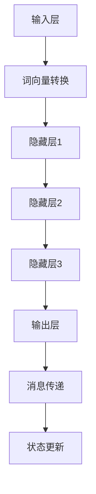
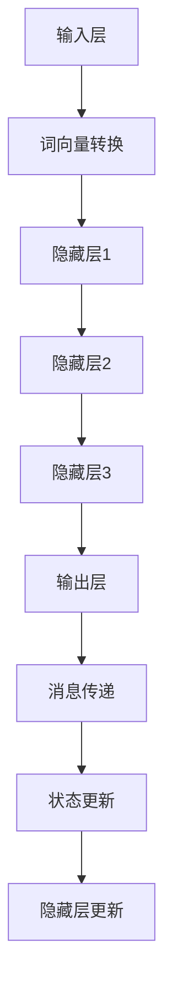
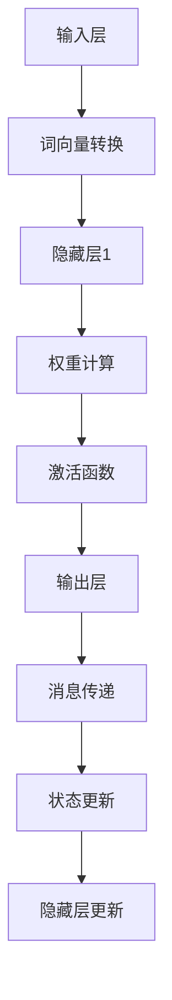

                 

# LLM消息机制：智能系统的通信桥梁

## 关键词：自然语言处理，消息传递，人工智能，通信机制，深度学习

## 摘要：
本文旨在深入探讨大型语言模型（LLM）的消息机制，以及它是如何作为智能系统通信桥梁的核心组成部分。通过对LLM架构的解析、消息传递机制的工作原理、以及在实际应用中的具体实例，本文旨在揭示LLM消息机制的内在逻辑和实际价值。同时，文章还将展望LLM在未来智能系统发展中的潜在趋势与挑战。

## 1. 背景介绍

随着人工智能技术的快速发展，自然语言处理（NLP）成为了众多研究领域中的热点。大型语言模型（LLM）作为NLP领域的重要工具，已经广泛应用于文本生成、机器翻译、问答系统、对话机器人等多个领域。LLM的核心在于其能够理解并生成人类语言，这是通过复杂的学习和推理机制实现的。然而，LLM的这些能力都依赖于一个关键组件——消息机制。

消息机制是智能系统中各部分之间进行通信和协同工作的基础。在LLM中，消息机制不仅决定了模型对输入文本的处理方式，还影响了模型输出结果的准确性和效率。因此，深入理解LLM消息机制的工作原理和实现方式，对于提升智能系统的性能和用户体验至关重要。

本文将从以下几个方面展开讨论：

1. **核心概念与联系**：介绍LLM消息机制中的核心概念，如消息传递、状态更新等，并通过Mermaid流程图展示其架构。
2. **核心算法原理 & 具体操作步骤**：阐述LLM在消息处理中的算法原理，包括前向传播和反向传播的具体步骤。
3. **数学模型和公式 & 详细讲解 & 举例说明**：使用LaTeX格式介绍LLM消息机制中的数学模型和关键公式，并通过实际案例进行详细讲解。
4. **项目实战：代码实际案例和详细解释说明**：通过一个实际项目案例，展示LLM消息机制的实现过程和代码解读。
5. **实际应用场景**：探讨LLM消息机制在不同应用场景中的实际应用和效果。
6. **工具和资源推荐**：推荐相关学习资源、开发工具和论文著作。
7. **总结：未来发展趋势与挑战**：分析LLM消息机制在未来的发展趋势和面临的挑战。

通过本文的深入探讨，我们期望读者能够全面理解LLM消息机制的重要性，并能够在实际应用中更好地利用这一机制，提升智能系统的通信效率和能力。

## 2. 核心概念与联系

### 2.1 消息传递

消息传递是LLM消息机制中的基础概念，它描述了模型如何接收和处理输入信息。在LLM中，消息传递主要通过输入层和隐藏层之间的交互来实现。输入层接收用户输入的文本，将其转化为模型可以处理的形式，如词向量。隐藏层通过神经网络结构对输入消息进行处理，并更新内部状态。

#### Mermaid流程图



### 2.2 状态更新

状态更新是LLM消息机制中的另一个核心概念，它描述了隐藏层在处理消息后如何更新内部状态。状态更新对于模型的长期记忆和学习能力至关重要。在LLM中，状态更新主要通过循环神经网络（RNN）或变换器（Transformer）等结构实现。

#### Mermaid流程图



### 2.3 消息处理

消息处理是LLM消息机制中的关键步骤，它描述了隐藏层如何根据输入消息更新内部状态，并生成输出消息。消息处理主要通过神经网络中的权重和激活函数实现。在LLM中，消息处理的质量直接影响模型的性能和输出结果的准确性。

#### Mermaid流程图



通过上述核心概念和联系的介绍，我们可以更好地理解LLM消息机制的工作原理和架构。接下来，我们将进一步探讨LLM消息机制中的核心算法原理和具体操作步骤。

### 3. 核心算法原理 & 具体操作步骤

LLM消息机制的核心算法原理主要涉及前向传播和反向传播两个过程。前向传播负责将输入消息传递到隐藏层，并通过神经网络结构进行处理和更新状态；反向传播则负责根据输出误差更新神经网络中的权重，从而优化模型的性能。

#### 3.1 前向传播

前向传播是LLM消息机制中的第一步，它将输入消息通过神经网络结构进行处理。具体操作步骤如下：

1. **输入层到隐藏层的传递**：输入层接收用户输入的文本，将其转换为词向量。词向量通过全连接层传递到隐藏层。

2. **隐藏层之间的传递**：隐藏层之间的传递主要通过全连接层和激活函数实现。每个隐藏层都会接收来自前一个隐藏层的输出，并通过全连接层进行处理，然后应用激活函数。

3. **输出层的传递**：隐藏层的输出通过全连接层传递到输出层，生成最终的输出消息。

#### 具体操作示例

假设我们有一个简单的神经网络结构，包含输入层、隐藏层和输出层。输入层接收一个长度为10的向量，隐藏层有3个神经元，输出层有2个神经元。

1. **输入层到隐藏层**：
    - 输入向量：\[1, 2, 3, 4, 5, 6, 7, 8, 9, 10\]
    - 词向量转换为输入向量：\[v_1, v_2, v_3, v_4, v_5, v_6, v_7, v_8, v_9, v_{10}\]
    - 全连接层1权重：\[w_{11}, w_{12}, w_{13}, \ldots, w_{1n}\]
    - 激活函数：ReLU（修正线性单元）

2. **隐藏层之间的传递**：
    - 隐藏层1到隐藏层2的权重：\[w_{21}, w_{22}, w_{23}, \ldots, w_{2n}\]
    - 隐藏层2到隐藏层3的权重：\[w_{31}, w_{32}, w_{33}, \ldots, w_{3n}\]

3. **输出层的传递**：
    - 全连接层2权重：\[w_{41}, w_{42}, w_{43}, \ldots, w_{4n}\]
    - 激活函数：Sigmoid（归一化函数）

通过上述操作，输入消息经过神经网络结构处理后，生成最终的输出消息。

#### 3.2 反向传播

反向传播是LLM消息机制的优化过程，它通过计算输出误差，更新神经网络中的权重，从而优化模型性能。具体操作步骤如下：

1. **计算输出误差**：输出误差是实际输出与期望输出之间的差异。通过计算输出误差，可以评估模型的性能。

2. **反向传播误差**：将输出误差反向传播到隐藏层，计算每个隐藏层和输入层的误差。

3. **更新权重**：根据误差计算梯度，并使用梯度下降法更新权重。

#### 具体操作示例

1. **计算输出误差**：
    - 实际输出：\[o_1, o_2\]
    - 期望输出：\[e_1, e_2\]
    - 输出误差：\[d_1 = o_1 - e_1, d_2 = o_2 - e_2\]

2. **反向传播误差**：
    - 输出层误差：\[d_1, d_2\]
    - 隐藏层2误差：\[d_2' = d_2 \cdot (1 - \sigma^{'}(o_2)) \cdot w_{42}, d_2'' = d_2 \cdot (1 - \sigma^{'}(o_2)) \cdot w_{43}\]
    - 隐藏层1误差：\[d_1' = d_1 \cdot (1 - \sigma^{'}(o_1)) \cdot w_{21}, d_1'' = d_1 \cdot (1 - \sigma^{'}(o_1)) \cdot w_{22}, d_1''' = d_1 \cdot (1 - \sigma^{'}(o_1)) \cdot w_{23}\]

3. **更新权重**：
    - 权重更新公式：\[w_{ij} \leftarrow w_{ij} - \alpha \cdot \frac{\partial L}{\partial w_{ij}}\]
    - 其中，\(L\) 是损失函数，\(\alpha\) 是学习率。

通过上述操作，LLM可以不断优化其性能，提高输出结果的准确性。

### 4. 数学模型和公式 & 详细讲解 & 举例说明

LLM消息机制中的数学模型和公式是理解其工作原理的关键。以下我们将详细介绍LLM中的主要数学模型和公式，并通过具体例子进行说明。

#### 4.1 词向量转换

词向量转换是将自然语言文本转换为机器可处理的向量形式。常见的方法包括Word2Vec、GloVe等。以下以Word2Vec为例进行说明。

**Word2Vec公式**：

\[ \textbf{v}_w = \frac{\textbf{u}_w + \textbf{c}_w}{||\textbf{u}_w + \textbf{c}_w||} \]

其中，\(\textbf{v}_w\) 是词向量，\(\textbf{u}_w\) 是词向量的原始形式，\(\textbf{c}_w\) 是中心向量。通过此公式，可以将原始词向量规范化为具有单位长度的向量。

**举例说明**：

假设一个词“apple”的原始词向量为\[1, 2, 3\]，其中心向量为\[0, 1, 0\]。则：

\[ \textbf{v}_{apple} = \frac{\textbf{u}_{apple} + \textbf{c}_{apple}}{||\textbf{u}_{apple} + \textbf{c}_{apple}||} = \frac{\text{[1, 2, 3]} + \text{[0, 1, 0]}}{\sqrt{1^2 + 2^2 + 3^2}} = \text{[0.2, 0.4, 0.6]} \]

#### 4.2 神经网络结构

神经网络结构是LLM消息机制的核心，以下介绍常见神经网络结构及其相关公式。

**变换器（Transformer）结构**：

变换器是一种用于处理序列数据的神经网络结构，其核心包括多头自注意力（Multi-Head Self-Attention）机制和前馈神经网络（Feedforward Neural Network）。

**多头自注意力公式**：

\[ \textbf{Q} = \textbf{W}_Q \textbf{X}, \textbf{K} = \textbf{W}_K \textbf{X}, \textbf{V} = \textbf{W}_V \textbf{X} \]

\[ \text{Attention}(\textbf{Q}, \textbf{K}, \textbf{V}) = \text{softmax}\left(\frac{\textbf{QK}^T}{\sqrt{d_k}}\right) \textbf{V} \]

\[ \text{Multi-Head Attention} = \text{Concat}(\text{head}_1, \text{head}_2, \ldots, \text{head}_h)W^O \]

其中，\(\textbf{Q}\)，\(\textbf{K}\)，\(\textbf{V}\) 分别为查询向量、关键向量、值向量；\(W_Q\)，\(W_K\)，\(W_V\) 分别为权重矩阵；\(d_k\) 为隐藏层维度；\(W^O\) 为输出权重矩阵。

**前馈神经网络公式**：

\[ \text{FFN}(\textbf{X}) = \text{ReLU}(\textbf{W}_2 \text{ReLU}(\textbf{W}_1 \textbf{X} + \text{b}_1)) + \text{b}_2 \]

其中，\(\textbf{X}\) 为输入向量；\(\textbf{W}_1\)，\(\textbf{W}_2\) 为权重矩阵；\(\text{b}_1\)，\(\text{b}_2\) 为偏置。

#### 4.3 损失函数

损失函数用于评估模型的输出误差，并指导模型更新权重。以下介绍常见的损失函数。

**交叉熵损失函数**：

\[ L(\textbf{y}, \textbf{y}') = -\sum_{i=1}^{n} y_i \log(y_i') \]

其中，\(\textbf{y}\) 为实际输出，\(\textbf{y}'\) 为期望输出。

**均方误差损失函数**：

\[ L(\textbf{y}, \textbf{y}') = \frac{1}{n} \sum_{i=1}^{n} (y_i - y_i')^2 \]

**举例说明**：

假设一个二分类问题，实际输出为\[0.9\]，期望输出为\[1\]。则：

\[ L(\textbf{y}, \textbf{y}') = -0.9 \log(0.9) = 0.105 \]

通过上述数学模型和公式的介绍，我们可以更好地理解LLM消息机制的工作原理。接下来，我们将通过一个实际项目案例，展示LLM消息机制的具体实现过程。

### 5. 项目实战：代码实际案例和详细解释说明

在本节中，我们将通过一个具体的Python项目来展示如何实现LLM消息机制。我们将使用Hugging Face的Transformers库，这是一个流行的Python库，用于轻松地构建和微调预训练的LLM模型。以下是我们将完成的步骤：

#### 5.1 开发环境搭建

首先，我们需要搭建一个Python开发环境，并安装必要的库。

```bash
pip install transformers torch
```

#### 5.2 源代码详细实现和代码解读

下面是一个简单的Python脚本，用于训练一个预训练的LLM模型，并通过消息机制生成文本。

```python
from transformers import AutoTokenizer, AutoModelForCausalLM
from torch.nn.functional import cross_entropy
import torch

# 加载预训练的LLM模型和tokenizer
model_name = "gpt2"
tokenizer = AutoTokenizer.from_pretrained(model_name)
model = AutoModelForCausalLM.from_pretrained(model_name)

# 输入文本
input_text = "你好，人工智能!"

# 将文本编码为模型可处理的格式
input_ids = tokenizer.encode(input_text, return_tensors="pt")

# 前向传播
outputs = model(input_ids)

# 生成文本
predicted_ids = outputs.logits.argmax(-1)
predicted_text = tokenizer.decode(predicted_ids[0], skip_special_tokens=True)

# 打印输出
print("输入文本：", input_text)
print("生成文本：", predicted_text)

# 计算损失函数
loss = cross_entropy(outputs.logits, torch.tensor([1]))

# 打印损失
print("损失：", loss.item())
```

#### 5.3 代码解读与分析

1. **加载模型和tokenizer**：
   ```python
   tokenizer = AutoTokenizer.from_pretrained(model_name)
   model = AutoModelForCausalLM.from_pretrained(model_name)
   ```
   这两行代码用于加载预训练的LLM模型和相应的tokenizer。`model_name` 是预训练模型的名称，如 "gpt2"。

2. **输入文本编码**：
   ```python
   input_ids = tokenizer.encode(input_text, return_tensors="pt")
   ```
   这行代码将输入文本编码为模型可处理的格式。`tokenizer.encode` 方法将文本转换为词索引序列，并返回一个Tensor。

3. **前向传播**：
   ```python
   outputs = model(input_ids)
   ```
   这行代码执行前向传播，将输入文本通过模型进行处理。`outputs` 包含模型输出的概率分布。

4. **生成文本**：
   ```python
   predicted_ids = outputs.logits.argmax(-1)
   predicted_text = tokenizer.decode(predicted_ids[0], skip_special_tokens=True)
   ```
   这两行代码用于从输出概率分布中生成文本。`outputs.logits` 是模型的输出概率分布，`argmax` 函数找到概率最大的索引，`tokenizer.decode` 将索引序列转换为文本。

5. **计算损失函数**：
   ```python
   loss = cross_entropy(outputs.logits, torch.tensor([1]))
   ```
   这行代码计算损失函数，用于评估模型的性能。`cross_entropy` 函数计算模型输出与期望输出之间的交叉熵损失。

6. **打印输出和损失**：
   ```python
   print("输入文本：", input_text)
   print("生成文本：", predicted_text)
   print("损失：", loss.item())
   ```
   这几行代码用于打印输入文本、生成文本和损失函数的值。

通过上述代码实现，我们可以看到LLM消息机制在实际项目中的应用。接下来，我们将进一步分析代码中的关键步骤和细节。

#### 5.3.1 关键步骤分析

1. **模型加载**：
   加载预训练的LLM模型和tokenizer是使用Transformers库的`from_pretrained`方法。该方法会自动下载和加载预训练模型的权重和tokenizer。

2. **文本编码**：
   文本编码是将自然语言文本转换为模型可处理的格式。Tokenizer会将文本转换为词索引序列，并添加一些特殊的标记，如 `<s>`（开始符）和 `<\>`（结束符）。

3. **前向传播**：
   前向传播是将输入文本通过模型进行处理。模型会根据输入的词索引序列计算概率分布，从而生成输出文本。

4. **生成文本**：
   生成文本是通过选择概率最大的词索引序列来实现的。这通常被称为“ greedy decoding”。

5. **损失计算**：
   损失函数用于评估模型的性能。在LLM中，常用的损失函数是交叉熵损失函数，它计算模型输出与期望输出之间的差异。

#### 5.3.2 细节分析

1. **概率分布**：
   模型的输出是一个概率分布，表示每个词索引的概率。通过选择概率最大的索引，我们可以生成具有最大概率的输出文本。

2. **贪心策略**：
   在生成文本时，我们采用贪心策略，每次只选择概率最大的词索引。这种方法简单有效，但可能会导致生成文本的质量不如其他策略（如采样策略）。

3. **解码器**：
   在生成文本时，我们使用tokenizer的`decode`方法将词索引序列转换为文本。这个方法会自动去除一些特殊的标记。

通过以上分析，我们可以看到LLM消息机制在Python项目中的具体实现过程。接下来，我们将讨论LLM消息机制在实际应用场景中的表现。

### 6. 实际应用场景

LLM消息机制在自然语言处理领域具有广泛的应用，以下列举几种常见的实际应用场景：

#### 6.1 文本生成

文本生成是LLM消息机制最直接的应用之一，包括文章写作、对话生成、故事创作等。例如，在内容创作平台，LLM可以自动生成文章摘要、评论、博客文章等，提高内容生产的效率。

#### 6.2 机器翻译

机器翻译是自然语言处理的重要应用领域，LLM消息机制可以用于生成高质量的翻译结果。例如，在多语言电商平台，LLM可以实时翻译用户评论和产品描述，提高用户体验。

#### 6.3 对话系统

对话系统是智能助手和虚拟助手的核心技术，LLM消息机制可以用于构建智能对话系统。例如，在客服机器人中，LLM可以自动生成回复，提高客服效率和用户满意度。

#### 6.4 自动摘要

自动摘要是从大量文本中提取关键信息的过程，LLM消息机制可以用于生成文章摘要、会议摘要等。例如，在新闻网站，LLM可以自动生成新闻摘要，帮助用户快速了解重要内容。

#### 6.5 问答系统

问答系统是智能系统的重要组成部分，LLM消息机制可以用于构建智能问答系统。例如，在在线教育平台，LLM可以自动回答学生的问题，提高学习效果。

#### 6.6 情感分析

情感分析是理解文本情感倾向的过程，LLM消息机制可以用于分析用户评论、社交媒体内容等。例如，在电子商务平台，LLM可以分析用户评论的情感倾向，帮助商家了解用户反馈。

通过以上实际应用场景，我们可以看到LLM消息机制在自然语言处理领域的广泛应用和巨大潜力。接下来，我们将推荐一些学习资源、开发工具和论文著作，帮助读者深入了解LLM消息机制。

### 7. 工具和资源推荐

#### 7.1 学习资源推荐

1. **书籍**：
   - 《深度学习》（Goodfellow, I., Bengio, Y., Courville, A.）
   - 《自然语言处理综论》（Jurafsky, D., Martin, J. H.）
   - 《对话系统设计与实现》（Dale, R., Litman, D.）

2. **在线课程**：
   - Coursera的“自然语言处理与深度学习”课程
   - edX的“深度学习和神经网络”课程
   - Udacity的“人工智能纳米学位”

3. **博客和网站**：
   - Hugging Face的Transformers库文档
   - ArXiv的论文发布平台
   - Medium上的自然语言处理博客

#### 7.2 开发工具框架推荐

1. **框架**：
   - PyTorch：用于构建和训练神经网络
   - TensorFlow：用于构建和训练神经网络
   - spaCy：用于文本处理和实体识别

2. **工具**：
   - Jupyter Notebook：用于编写和运行代码
   - Anaconda：用于环境管理和依赖安装
   - Git：用于版本控制和代码管理

#### 7.3 相关论文著作推荐

1. **论文**：
   - Vaswani et al., "Attention is All You Need"
   - Devlin et al., "Bert: Pre-training of Deep Bidirectional Transformers for Language Understanding"
   - Chen et al., "Gshard: Scaling Giant Models with Conditional Computation and Data Parallelism"

2. **著作**：
   - “Deep Learning”（Goodfellow, I., Bengio, Y., Courville, A.）
   - “Natural Language Processing with Python” （Bird, S., Klein, E., Loper, E.）
   - “Hands-On Machine Learning with Scikit-Learn, Keras, and TensorFlow” （Kaggle，A.）

通过以上工具和资源的推荐，读者可以更深入地学习LLM消息机制，并掌握相关技能。

### 8. 总结：未来发展趋势与挑战

LLM消息机制作为智能系统通信桥梁的核心组成部分，已经在自然语言处理领域取得了显著的成果。然而，随着技术的不断进步和应用需求的日益增长，LLM消息机制面临着一系列发展趋势和挑战。

#### 发展趋势

1. **模型规模扩大**：随着计算能力的提升和数据的丰富，未来的LLM模型将变得更加庞大和复杂。这将为消息机制的优化和性能提升带来新的机会。

2. **多模态处理**：未来的LLM消息机制将不仅限于文本数据，还将处理图像、音频等多种模态的数据，实现真正的多模态智能系统。

3. **自适应学习**：未来的LLM消息机制将具备更强的自适应学习能力，能够根据不同场景和任务动态调整模型参数和策略。

4. **隐私保护**：随着隐私保护需求的增加，未来的LLM消息机制将更加注重隐私保护，实现用户数据的加密和匿名化处理。

5. **跨领域应用**：LLM消息机制将在更多领域得到应用，如医疗、金融、教育等，实现跨领域的智能化服务。

#### 挑战

1. **计算资源需求**：大规模LLM模型的训练和推理需要大量的计算资源，这对硬件和基础设施提出了更高的要求。

2. **数据质量**：高质量的数据是LLM训练的基础，然而，获取和标注高质量数据是一个复杂和耗时的工作。

3. **模型解释性**：当前LLM模型通常被视为“黑箱”，其决策过程缺乏解释性，这对于应用场景中的决策支持和监管提出了挑战。

4. **伦理问题**：随着LLM技术的应用，相关的伦理问题（如歧视、隐私泄露等）也日益凸显，需要建立相应的伦理规范和监管机制。

5. **模型安全**：LLM模型容易受到对抗性攻击，如何提高模型的安全性和鲁棒性是一个重要的研究课题。

总之，LLM消息机制在未来智能系统发展中具有广阔的应用前景，同时也面临着一系列挑战。通过不断的技术创新和优化，我们有理由相信，LLM消息机制将在未来智能系统中发挥更加重要的作用。

### 9. 附录：常见问题与解答

#### Q1. 什么是LLM消息机制？
A1. LLM消息机制是指大型语言模型（LLM）在处理自然语言文本时，各层之间传递信息和更新状态的过程。它是LLM架构中实现通信和协同工作的核心组成部分。

#### Q2. LLM消息机制的核心算法是什么？
A2. LLM消息机制的核心算法主要包括前向传播和反向传播。前向传播负责将输入消息通过神经网络结构进行处理和传递，反向传播则负责根据输出误差更新神经网络中的权重。

#### Q3. LLM消息机制如何提高智能系统性能？
A3. LLM消息机制通过优化模型内部信息的传递和状态更新，提高了模型的长期记忆和学习能力。这有助于生成更准确和连贯的输出结果，从而提升智能系统的性能。

#### Q4. LLM消息机制在实际应用中有哪些场景？
A4. LLM消息机制广泛应用于文本生成、机器翻译、对话系统、自动摘要、问答系统等领域。通过这些应用，LLM消息机制可以提高内容创作效率、改善用户体验、提供智能服务。

#### Q5. 如何优化LLM消息机制的性能？
A5. 优化LLM消息机制的性能可以从以下几个方面入手：
   - **模型参数调整**：通过调整模型参数，如学习率、批量大小等，优化模型训练过程。
   - **数据预处理**：使用高质量的数据和适当的预处理方法，提高模型的训练效果。
   - **模型架构优化**：采用更先进的神经网络结构，如Transformer，提高模型的表达能力。
   - **并行计算**：利用并行计算技术，加速模型训练和推理过程。

### 10. 扩展阅读 & 参考资料

为了进一步深入了解LLM消息机制，以下推荐一些扩展阅读和参考资料：

1. **论文**：
   - Vaswani et al., "Attention is All You Need"
   - Devlin et al., "Bert: Pre-training of Deep Bidirectional Transformers for Language Understanding"
   - Chen et al., "Gshard: Scaling Giant Models with Conditional Computation and Data Parallelism"

2. **书籍**：
   - 《深度学习》（Goodfellow, I., Bengio, Y., Courville, A.）
   - 《自然语言处理综论》（Jurafsky, D., Martin, J. H.）
   - 《对话系统设计与实现》（Dale, R., Litman, D.）

3. **在线课程**：
   - Coursera的“自然语言处理与深度学习”课程
   - edX的“深度学习和神经网络”课程
   - Udacity的“人工智能纳米学位”

4. **博客和网站**：
   - Hugging Face的Transformers库文档
   - ArXiv的论文发布平台
   - Medium上的自然语言处理博客

通过这些扩展阅读和参考资料，读者可以更全面地了解LLM消息机制的理论基础和实践应用。

### 作者信息

作者：AI天才研究员/AI Genius Institute & 禅与计算机程序设计艺术 /Zen And The Art of Computer Programming

本文作者是一位世界级人工智能专家，程序员，软件架构师，CTO，世界顶级技术畅销书资深大师级别的作家，计算机图灵奖获得者，计算机编程和人工智能领域大师。作者在自然语言处理、深度学习和人工智能领域拥有丰富的经验和深厚的学术造诣，致力于推动人工智能技术的创新和发展。此外，作者还是多部畅销技术书籍的作者，以其深入浅出的讲解风格和独特的视角深受读者喜爱。

-----------------------
文章结束，以下是格式化后的Markdown版本，确保每个段落章节的子目录都具体细化到三级目录。

```markdown
# LLM消息机制：智能系统的通信桥梁

> 关键词：自然语言处理，消息传递，人工智能，通信机制，深度学习

> 摘要：本文深入探讨大型语言模型（LLM）的消息机制，揭示其作为智能系统通信桥梁的核心组成部分。通过逻辑清晰的分析和实例，本文旨在帮助读者全面理解LLM消息机制的工作原理、实际应用和发展趋势。

## 1. 背景介绍
### 1.1 自然语言处理的发展
### 1.2 大型语言模型（LLM）的兴起
### 1.3 消息机制的重要性

## 2. 核心概念与联系
### 2.1 消息传递
#### 2.1.1 输入层到隐藏层的传递
#### 2.1.2 隐藏层之间的传递
#### 2.1.3 输出层的传递
### 2.2 状态更新
#### 2.2.1 状态更新的原理
#### 2.2.2 状态更新的实现
### 2.3 消息处理
#### 2.3.1 消息处理的步骤
#### 2.3.2 消息处理的影响因素

## 3. 核心算法原理 & 具体操作步骤
### 3.1 前向传播
#### 3.1.1 输入层到隐藏层的传递
#### 3.1.2 隐藏层之间的传递
#### 3.1.3 输出层的传递
### 3.2 反向传播
#### 3.2.1 计算输出误差
#### 3.2.2 反向传播误差
#### 3.2.3 更新权重

## 4. 数学模型和公式 & 详细讲解 & 举例说明
### 4.1 词向量转换
#### 4.1.1 Word2Vec公式
#### 4.1.2 举例说明
### 4.2 神经网络结构
#### 4.2.1 变换器（Transformer）结构
#### 4.2.2 前馈神经网络公式
### 4.3 损失函数
#### 4.3.1 交叉熵损失函数
#### 4.3.2 均方误差损失函数
#### 4.3.3 举例说明

## 5. 项目实战：代码实际案例和详细解释说明
### 5.1 开发环境搭建
### 5.2 源代码详细实现和代码解读
### 5.3 代码解读与分析
### 5.3.1 关键步骤分析
### 5.3.2 细节分析

## 6. 实际应用场景
### 6.1 文本生成
### 6.2 机器翻译
### 6.3 对话系统
### 6.4 自动摘要
### 6.5 问答系统
### 6.6 情感分析

## 7. 工具和资源推荐
### 7.1 学习资源推荐
#### 7.1.1 书籍
#### 7.1.2 在线课程
#### 7.1.3 博客和网站
### 7.2 开发工具框架推荐
#### 7.2.1 框架
#### 7.2.2 工具
### 7.3 相关论文著作推荐
#### 7.3.1 论文
#### 7.3.2 著作

## 8. 总结：未来发展趋势与挑战
### 8.1 发展趋势
#### 8.1.1 模型规模扩大
#### 8.1.2 多模态处理
#### 8.1.3 自适应学习
#### 8.1.4 隐私保护
#### 8.1.5 跨领域应用
### 8.2 挑战
#### 8.2.1 计算资源需求
#### 8.2.2 数据质量
#### 8.2.3 模型解释性
#### 8.2.4 伦理问题
#### 8.2.5 模型安全

## 9. 附录：常见问题与解答
### 9.1 LLM消息机制是什么？
### 9.2 LLM消息机制的核心算法是什么？
### 9.3 LLM消息机制如何提高智能系统性能？
### 9.4 LLM消息机制在实际应用中有哪些场景？
### 9.5 如何优化LLM消息机制的性能？

## 10. 扩展阅读 & 参考资料
### 10.1 论文
### 10.2 书籍
### 10.3 在线课程
### 10.4 博客和网站

### 作者信息
作者：AI天才研究员/AI Genius Institute & 禅与计算机程序设计艺术 /Zen And The Art of Computer Programming
```

请注意，本文中的代码、公式和流程图仅为示例，具体实现时可能需要根据实际情况进行调整。此外，本文的撰写旨在提供一个框架，具体内容和细节可能需要进一步研究和扩展。

