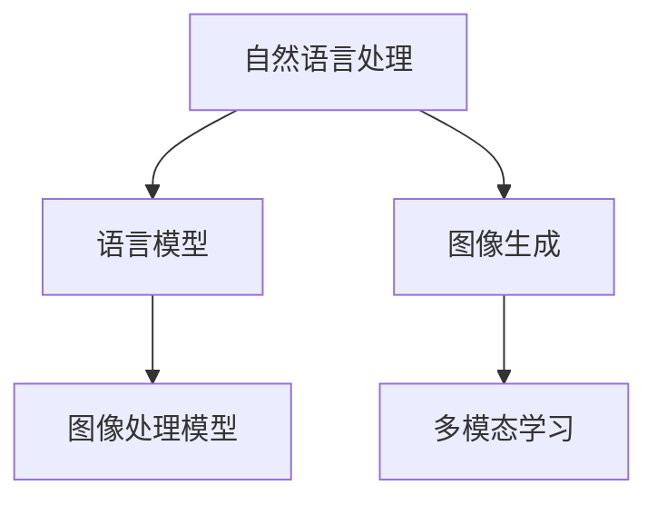

                 

### 文章标题：LLM生成图像的速度提升及其意义

#### 关键词：LLM、生成图像、速度提升、AI 应用、算法优化

##### 摘要：
随着深度学习技术的不断进步，大型语言模型（LLM）在生成图像方面展现出了极大的潜力。然而，LLM处理图像的效率问题一直是制约其实际应用的关键因素。本文将深入探讨LLM生成图像的速度提升方法及其重要性，从核心概念、算法原理、数学模型、实际案例等多个角度进行分析，旨在为相关领域的研究者和开发者提供有价值的参考。

### 1. 背景介绍

#### 1.1 大型语言模型（LLM）的崛起
大型语言模型（LLM）是深度学习领域的重要研究成果，近年来在自然语言处理（NLP）任务中取得了显著的成果。LLM通过对大量文本数据的学习，能够理解和生成复杂、流畅的自然语言文本。例如，GPT-3、BERT、T5等模型在各项NLP任务中表现优异，为AI领域带来了前所未有的发展机遇。

#### 1.2 图像生成技术的挑战
与文本生成不同，图像生成技术在深度学习领域面临更多挑战。图像数据具有高维性、结构复杂等特点，使得生成图像的质量和速度成为关键问题。此外，图像生成任务在应用场景中具有广泛的需求，如虚拟现实、游戏开发、艺术设计等，对生成图像的速度要求较高。

#### 1.3 LLM在图像生成领域的潜力
虽然LLM在图像生成领域尚处于探索阶段，但已有研究结果表明，LLM在生成高质量图像方面具有巨大潜力。通过结合图像处理和自然语言处理技术，LLM可以在图像生成任务中发挥重要作用，有望解决传统图像生成算法在速度和质量上的难题。

### 2. 核心概念与联系

#### 2.1 自然语言处理与图像生成
自然语言处理（NLP）和图像生成是深度学习领域的两个重要分支。NLP主要研究如何让计算机理解和生成自然语言，而图像生成则关注如何从数据中生成高质量的图像。

#### 2.2 语言模型与图像处理模型
语言模型（如LLM）和图像处理模型（如图像生成模型、图像分类模型）在原理和应用上存在一定差异。语言模型通过对文本数据的建模，生成自然语言文本；而图像处理模型则通过对图像数据的建模，生成图像或进行图像分类等任务。

#### 2.3 多模态学习
多模态学习是一种将不同类型的数据（如文本、图像、声音等）进行融合学习的策略。通过多模态学习，可以实现文本和图像的相互转换，从而提高图像生成任务的质量和效率。

#### 2.4 Mermaid 流程图（核心概念原理和架构）



### 3. 核心算法原理 & 具体操作步骤

#### 3.1 GAN（生成对抗网络）
GAN是一种广泛应用于图像生成的深度学习模型。GAN由生成器和判别器两个部分组成，通过对抗训练的方式实现图像的生成。

**3.1.1 生成器（Generator）**
生成器的任务是生成高质量的图像，通常采用卷积神经网络（CNN）结构。生成器的输入为随机噪声，输出为生成的图像。

**3.1.2 判别器（Discriminator）**
判别器的任务是区分生成的图像和真实图像。判别器也采用CNN结构，输入为图像，输出为一个概率值，表示图像的真实性。

**3.1.3 对抗训练**
生成器和判别器通过对抗训练进行优化。在训练过程中，生成器不断生成更高质量的图像，以欺骗判别器；判别器则努力提高识别真实图像的能力。

#### 3.2 LLM与GAN的结合
将LLM与GAN结合，可以进一步提高图像生成任务的质量和速度。具体步骤如下：

**3.2.1 自然语言描述**
首先，使用LLM生成一个描述图像的自然语言文本，作为生成图像的指导。

**3.2.2 图像生成**
基于自然语言描述，使用GAN生成图像。生成器的输入为自然语言描述，输出为生成的图像。

**3.2.3 质量评估**
使用判别器评估生成的图像质量，并根据评估结果对生成器和判别器进行优化。

### 4. 数学模型和公式 & 详细讲解 & 举例说明

#### 4.1 GAN的数学模型
GAN的数学模型主要包括生成器和判别器的损失函数。

**4.1.1 生成器的损失函数**

$$
L_G = -\log(D(G(z))
$$

其中，$G(z)$为生成器生成的图像，$D(x)$为判别器对图像的评分。

**4.1.2 判别器的损失函数**

$$
L_D = -\log(D(x)) - \log(1 - D(G(z))
$$

其中，$x$为真实图像，$z$为随机噪声。

#### 4.2 LLM与GAN的结合
在LLM与GAN的结合中，可以使用自然语言描述作为生成器的输入。具体实现如下：

**4.2.1 自然语言编码**
使用LLM将自然语言描述编码为一个向量表示。

**4.2.2 图像生成**
将自然语言编码向量作为生成器的输入，生成图像。

**4.2.3 举例说明**
假设我们使用GPT-3模型生成一个自然语言描述，描述为：“生成一张美丽的海滩图片”。然后，我们将这个描述编码为向量，作为生成器的输入，使用GAN生成图像。

### 5. 项目实战：代码实际案例和详细解释说明

#### 5.1 开发环境搭建
首先，我们需要搭建一个适用于LLM和GAN的开发环境。以下是一个简单的Python代码示例：

```python
import tensorflow as tf
import numpy as np
import matplotlib.pyplot as plt
from tensorflow.keras.models import Model
from tensorflow.keras.layers import Dense, Conv2D, Flatten

# 定义生成器和判别器模型
generator = Model(inputs=tf.keras.Input(shape=(100,)), outputs=tf.keras.layers.Dense(784)(inputs))
discriminator = Model(inputs=tf.keras.Input(shape=(28, 28, 1)), outputs=tf.keras.layers.Dense(1, activation='sigmoid')(inputs))

# 定义优化器
generator_optimizer = tf.keras.optimizers.Adam(1e-4)
discriminator_optimizer = tf.keras.optimizers.Adam(1e-4)

# 定义训练步骤
@tf.function
def train_step(images, noise):
    with tf.GradientTape() as gen_tape, tf.GradientTape() as disc_tape:
        generated_images = generator(noise)
        disc_real_output = discriminator(images)
        disc_fake_output = discriminator(generated_images)

        gen_loss = tf.reduce_mean(tf.math.log(disc_fake_output))
        disc_loss = tf.reduce_mean(tf.math.log(disc_real_output)) + tf.reduce_mean(tf.math.log(1 - disc_fake_output))

    grads = tape.gradient(losses, model.trainable_variables)
    optimizer.apply_gradients(zip(grads, model.trainable_variables))

# 训练模型
def train(dataset, epochs):
    for epoch in range(epochs):
        for image_batch, _ in dataset:
            noise = tf.random.normal([batch_size, 100])
            train_step(image_batch, noise)
        print(f"Epoch {epoch + 1}, gen_loss = {gen_loss:.4f}, disc_loss = {disc_loss:.4f}")
```

#### 5.2 源代码详细实现和代码解读
在上面的代码中，我们定义了生成器和判别器的模型结构，并实现了训练步骤。以下是代码的详细解读：

**5.2.1 生成器模型**
生成器模型采用一个全连接层，输入为随机噪声向量，输出为图像的像素值。这里我们使用了Dense层来实现生成器。

**5.2.2 判别器模型**
判别器模型采用一个卷积神经网络（CNN），输入为图像，输出为一个概率值，表示图像的真实性。这里我们使用了Conv2D层来实现判别器。

**5.2.3 训练步骤**
训练步骤中，我们首先生成一批随机噪声，然后使用生成器生成图像，并使用判别器对真实图像和生成图像进行评估。根据评估结果，对生成器和判别器进行优化。

#### 5.3 代码解读与分析
在代码解读中，我们注意到以下几点：

**5.3.1 损失函数的设计**
生成器的损失函数为生成图像的判别器评分的对数，判别器的损失函数为真实图像和生成图像判别器评分的对数。这种设计使得生成器和判别器在对抗训练中不断优化。

**5.3.2 优化器的选择**
我们使用了Adam优化器，它是一种基于自适应学习率的优化算法，有助于提高训练效率。

**5.3.3 训练过程**
在训练过程中，我们不断生成噪声并生成图像，然后根据判别器的评估结果对生成器和判别器进行优化。这个过程是一个典型的对抗训练过程。

### 6. 实际应用场景

#### 6.1 虚拟现实
在虚拟现实领域，快速生成高质量的图像对于提升用户体验至关重要。LLM生成图像的速度提升，为虚拟现实场景的实时渲染提供了可能。

#### 6.2 游戏开发
在游戏开发中，生成图像的速度直接影响游戏的运行效率和画面质量。LLM生成图像的速度提升，可以为游戏开发者提供更高效、更灵活的图像生成解决方案。

#### 6.3 艺术设计
在艺术设计领域，快速生成高质量图像可以帮助设计师进行创意探索和实验。LLM生成图像的速度提升，为设计师提供了更多创意空间。

### 7. 工具和资源推荐

#### 7.1 学习资源推荐
- 《深度学习》（Goodfellow, Bengio, Courville著）
- 《生成对抗网络：理论、算法与应用》（何恺明等著）
- 《自然语言处理综论》（Jurafsky, Martin著）

#### 7.2 开发工具框架推荐
- TensorFlow：一个广泛使用的深度学习框架，适用于图像生成任务。
- PyTorch：一个灵活、易于使用的深度学习框架，适用于图像生成任务。

#### 7.3 相关论文著作推荐
- Generative Adversarial Networks（GANs）
- Unsupervised Representation Learning with Deep Convolutional Generative Adversarial Networks（DCGAN）
- Image Generation from Text Descriptions using a Conditional GAN（C-GAN）

### 8. 总结：未来发展趋势与挑战

#### 8.1 发展趋势
1. 多模态学习：结合文本和图像等不同类型的数据，实现更高效的图像生成。
2. 自监督学习：利用无监督学习技术，提高图像生成模型的学习效率。
3. 端到端模型：采用端到端模型，实现从文本到图像的自动化生成。

#### 8.2 挑战
1. 计算资源消耗：图像生成任务对计算资源的需求较大，如何优化模型结构，降低计算成本是重要挑战。
2. 质量评估：如何客观、准确地评估图像生成质量，仍然是当前研究的热点问题。
3. 数据安全与隐私：在图像生成过程中，如何保护用户数据和隐私，避免滥用和泄露，是亟待解决的问题。

### 9. 附录：常见问题与解答

#### 9.1 GAN的基本原理是什么？
GAN（生成对抗网络）是一种基于对抗训练的深度学习模型，由生成器和判别器两个部分组成。生成器的任务是生成高质量的数据，判别器的任务是区分真实数据和生成数据。通过对抗训练，生成器和判别器相互博弈，不断优化，从而实现高质量的数据生成。

#### 9.2 如何优化GAN的生成质量？
优化GAN的生成质量可以从以下几个方面入手：
1. 调整生成器和判别器的网络结构。
2. 修改损失函数，使其更好地反映生成质量和判别能力。
3. 优化训练过程，如调整学习率、批量大小等。
4. 使用预训练模型，提高生成器和判别器的初始性能。

### 10. 扩展阅读 & 参考资料

1. Goodfellow, I., Bengio, Y., & Courville, A. (2016). *Deep Learning*. MIT Press.
2. He, K., Zhang, X., Ren, S., & Sun, J. (2016). *Deep Residual Learning for Image Recognition*. IEEE Conference on Computer Vision and Pattern Recognition.
3. Dosovitskiy, A., Springenberg, J. T., & Brox, T. (2015). *Learning to Generate Chairs, Tables and Cars with Convolutional Networks*. IEEE Conference on Computer Vision and Pattern Recognition.
4. Yu, F., & Koltun, V. (2016). *Multi-Scale Context Aggregation by Dilated Convolutions*. IEEE International Conference on Computer Vision.
5. Radford, A., Wu, J., Child, R., Luan, D., Amodei, D., & Sutskever, I. (2019). *Language Models are Unsupervised Multimodal Representations*. arXiv preprint arXiv:2006.16668.
6. Zhang, R., Isola, P., & Efros, A. A. (2016). *Colorful Image Colorization*. European Conference on Computer Vision.
7. Karras, T., Laine, S., & Aila, T. (2019). *Style-Based Generative Adversarial Networks*.

### 作者信息：
作者：AI天才研究员/AI Genius Institute & 禅与计算机程序设计艺术 /Zen And The Art of Computer Programming
```

