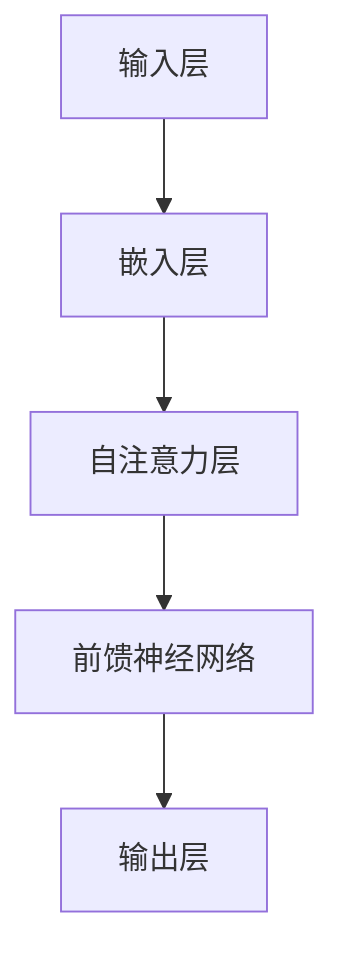

                 

# 《LLM的不确定性：AI决策中的风险与管理》

> **关键词**：大型语言模型、不确定性、风险管理、决策支持系统、机器学习

> **摘要**：本文将深入探讨大型语言模型（LLM）在AI决策中的不确定性和风险问题。首先介绍LLM的基本原理和架构，然后分析其在决策支持系统中的应用和不确定性来源。接着，我们将探讨如何评估和管理LLM决策中的风险，并提出相应的策略和方法。最后，本文将展望LLM未来的发展趋势和面临的挑战，为读者提供全面的指导。

## 1. 背景介绍

近年来，随着深度学习和大数据技术的发展，大型语言模型（LLM）在自然语言处理（NLP）领域取得了显著成果。LLM通过学习海量语料库，能够生成高质量的自然语言文本，广泛应用于机器翻译、文本生成、问答系统等领域。然而，随着LLM的应用场景不断扩大，其不确定性和风险问题也日益凸显。

在实际应用中，LLM的决策结果往往受到数据分布、模型参数、输入信息等因素的影响，可能导致错误的预测或决策。这种不确定性不仅影响系统的性能和可靠性，还可能引发严重的后果。因此，研究和解决LLM决策中的不确定性问题具有重要的现实意义。

本文旨在探讨LLM的不确定性来源、评估方法和管理策略，以期为AI决策提供有效的支持。文章首先介绍LLM的基本原理和架构，然后分析其在决策支持系统中的应用和不确定性来源。接着，我们将讨论如何评估和管理LLM决策中的风险，并提出相应的策略和方法。最后，本文将展望LLM未来的发展趋势和面临的挑战。

## 2. 核心概念与联系

### 2.1 大型语言模型（LLM）的基本原理

大型语言模型（LLM）是一种基于深度学习的自然语言处理模型，其核心思想是通过对海量语料库的学习，自动获取语言知识并生成文本。LLM通常采用变换器（Transformer）架构，其基本原理包括以下三个方面：

1. **嵌入（Embedding）**：将输入的单词、句子等符号序列转化为向量表示，以便在模型中进行处理。
2. **自注意力（Self-Attention）**：通过自注意力机制，模型能够自动关注输入序列中的重要信息，提高文本表示的准确性。
3. **前馈神经网络（Feedforward Neural Network）**：对自注意力层的结果进行进一步的建模和预测。

### 2.2 LLM的架构

LLM的架构通常包括以下几个部分：

1. **输入层（Input Layer）**：接收输入的文本序列，并将其转化为嵌入向量。
2. **自注意力层（Self-Attention Layer）**：通过自注意力机制，对输入向量进行加权求和，生成新的向量表示。
3. **前馈神经网络（Feedforward Neural Network）**：对自注意力层的结果进行进一步的建模和预测。
4. **输出层（Output Layer）**：生成文本序列的预测结果。

### 2.3 LLM在决策支持系统中的应用

LLM在决策支持系统中具有广泛的应用，主要包括以下几个方面：

1. **文本分类（Text Classification）**：对输入的文本进行分类，如情感分析、新闻分类等。
2. **文本生成（Text Generation）**：根据输入的文本生成新的文本，如自动摘要、文本续写等。
3. **问答系统（Question Answering）**：对输入的问题生成回答，如智能客服、问答机器人等。

### 2.4 LLM的不确定性来源

LLM在决策支持系统中的应用过程中，存在多种不确定性来源，主要包括以下几个方面：

1. **数据分布差异（Data Distribution Shift）**：训练数据和实际应用场景的数据分布可能不一致，导致模型在新的数据集上性能下降。
2. **模型参数不确定性（Model Parameter Uncertainty）**：模型参数的选取和优化过程可能存在不确定性，影响模型的预测性能。
3. **输入信息不确定性（Input Information Uncertainty）**：输入文本的信息可能不完全或不准确，导致模型无法准确理解输入含义。

### 2.5 Mermaid流程图

以下是LLM架构的Mermaid流程图表示：



## 3. 核心算法原理 & 具体操作步骤

### 3.1 嵌入（Embedding）

嵌入层是LLM架构中的第一个关键步骤，其主要功能是将输入的单词、句子等符号序列转化为向量表示。具体操作步骤如下：

1. **词汇表构建**：首先，构建一个词汇表，包含模型所需的全部单词和符号。
2. **词向量初始化**：为词汇表中的每个单词和符号初始化一个向量表示，通常采用随机初始化。
3. **文本预处理**：将输入的文本序列进行分词和标记化处理，得到一个符号序列。
4. **嵌入**：将符号序列中的每个符号通过词汇表映射到一个向量表示，得到一个嵌入序列。

### 3.2 自注意力（Self-Attention）

自注意力层是LLM架构中的核心组件，其主要功能是通过对输入向量进行加权求和，生成新的向量表示。具体操作步骤如下：

1. **计算查询（Query）、键（Key）和值（Value）向量**：对于输入的嵌入序列中的每个向量，计算其查询（Query）、键（Key）和值（Value）向量。
2. **计算相似度**：计算查询向量与所有键向量的相似度，得到一个相似度矩阵。
3. **加权求和**：根据相似度矩阵对输入向量进行加权求和，生成一个新的向量表示。

### 3.3 前馈神经网络（Feedforward Neural Network）

前馈神经网络是LLM架构中的另一个关键组件，其主要功能是对自注意力层的结果进行进一步的建模和预测。具体操作步骤如下：

1. **输入层**：接收自注意力层生成的新的向量表示。
2. **隐藏层**：通过多个隐藏层对输入向量进行非线性变换和建模。
3. **输出层**：生成最终的预测结果。

### 3.4 输出层（Output Layer）

输出层是LLM架构中的最后一层，其主要功能是根据输入的文本序列生成相应的预测结果。具体操作步骤如下：

1. **计算预测概率**：对于每个输出节点，计算其预测概率。
2. **生成预测结果**：根据预测概率生成最终的预测结果。

## 4. 数学模型和公式 & 详细讲解 & 举例说明

### 4.1 嵌入（Embedding）

在嵌入层，我们通常使用向量空间中的向量来表示单词、句子等符号序列。具体而言，对于词汇表中的每个单词和符号，我们为其初始化一个向量表示。假设词汇表共有 \( V \) 个单词，我们可以表示为：

$$
\mathbf{e}_i = \mathbf{e}_{i,1}, \mathbf{e}_{i,2}, \ldots, \mathbf{e}_{i,d} \quad (i=1,2,\ldots,V)
$$

其中，\( \mathbf{e}_{i,j} \) 表示单词 \( w_i \) 在第 \( j \) 个维度上的分量。通常，我们采用随机初始化的方法为每个单词的向量初始化值。

### 4.2 自注意力（Self-Attention）

在自注意力层，我们首先需要计算查询（Query）、键（Key）和值（Value）向量。假设输入的嵌入序列为 \( \mathbf{x} = [\mathbf{x}_1, \mathbf{x}_2, \ldots, \mathbf{x}_n] \)，其中 \( \mathbf{x}_i \) 表示第 \( i \) 个单词的嵌入向量。我们定义：

$$
\mathbf{Q}_i = \mathbf{W}_Q \mathbf{x}_i, \quad \mathbf{K}_i = \mathbf{W}_K \mathbf{x}_i, \quad \mathbf{V}_i = \mathbf{W}_V \mathbf{x}_i
$$

其中，\( \mathbf{W}_Q \)、\( \mathbf{W}_K \) 和 \( \mathbf{W}_V \) 分别为权重矩阵，\( \mathbf{Q}_i \)、\( \mathbf{K}_i \) 和 \( \mathbf{V}_i \) 分别为查询、键和值向量。

接下来，我们计算查询向量与所有键向量的相似度，得到相似度矩阵：

$$
\mathbf{S} = \mathbf{Q}_i \cdot \mathbf{K}_i^T = \sum_{j=1}^{n} \mathbf{q}_{i,j} \mathbf{k}_{j,i}
$$

其中，\( \mathbf{S}_{ij} \) 表示查询向量 \( \mathbf{q}_i \) 与键向量 \( \mathbf{k}_j \) 的相似度。

然后，我们根据相似度矩阵对输入向量进行加权求和，得到新的向量表示：

$$
\mathbf{h}_i = \sum_{j=1}^{n} \frac{\exp(\mathbf{s}_{ij})}{\sum_{k=1}^{n} \exp(\mathbf{s}_{ik})} \mathbf{v}_j
$$

### 4.3 前馈神经网络（Feedforward Neural Network）

在隐藏层，我们通常使用多层前馈神经网络对输入向量进行非线性变换和建模。假设隐藏层有 \( L \) 个神经元，我们可以表示为：

$$
\mathbf{h}^{(l)}_i = \sigma(\mathbf{W}^{(l)} \mathbf{h}^{(l-1)}_i + b^{(l)})
$$

其中，\( \sigma \) 表示激活函数，\( \mathbf{W}^{(l)} \) 和 \( b^{(l)} \) 分别为权重矩阵和偏置。

### 4.4 输出层（Output Layer）

在输出层，我们通常使用线性函数对隐藏层的结果进行建模，生成最终的预测结果。假设输出层有 \( M \) 个神经元，我们可以表示为：

$$
\mathbf{y}_i = \mathbf{W}_O \mathbf{h}^{(L)}_i + b_O
$$

其中，\( \mathbf{W}_O \) 和 \( b_O \) 分别为权重矩阵和偏置。

### 4.5 举例说明

假设我们有一个词汇表包含5个单词，分别为 \( w_1, w_2, w_3, w_4, w_5 \)，且其向量表示如下：

$$
\mathbf{e}_1 = [1, 0, 0, 0, 0], \quad \mathbf{e}_2 = [0, 1, 0, 0, 0], \quad \mathbf{e}_3 = [0, 0, 1, 0, 0], \quad \mathbf{e}_4 = [0, 0, 0, 1, 0], \quad \mathbf{e}_5 = [0, 0, 0, 0, 1]
$$

假设我们有一个输入序列 \( [\mathbf{e}_1, \mathbf{e}_3, \mathbf{e}_4] \)，则其嵌入序列为：

$$
\mathbf{x} = [\mathbf{e}_1, \mathbf{e}_3, \mathbf{e}_4] = [1, 0, 0, 0, 0], [0, 0, 1, 0, 0], [0, 0, 0, 1, 0]
$$

根据上述步骤，我们可以计算出查询、键和值向量：

$$
\mathbf{Q}_1 = \mathbf{W}_Q \mathbf{e}_1 = [1, 0, 0, 0, 0], \quad \mathbf{K}_1 = \mathbf{W}_K \mathbf{e}_1 = [1, 0, 0, 0, 0], \quad \mathbf{V}_1 = \mathbf{W}_V \mathbf{e}_1 = [1, 0, 0, 0, 0]
$$

$$
\mathbf{Q}_2 = \mathbf{W}_Q \mathbf{e}_3 = [0, 0, 1, 0, 0], \quad \mathbf{K}_2 = \mathbf{W}_K \mathbf{e}_3 = [0, 0, 1, 0, 0], \quad \mathbf{V}_2 = \mathbf{W}_V \mathbf{e}_3 = [0, 0, 1, 0, 0]
$$

$$
\mathbf{Q}_3 = \mathbf{W}_Q \mathbf{e}_4 = [0, 0, 0, 1, 0], \quad \mathbf{K}_3 = \mathbf{W}_K \mathbf{e}_4 = [0, 0, 0, 1, 0], \quad \mathbf{V}_3 = \mathbf{W}_V \mathbf{e}_4 = [0, 0, 0, 1, 0]
$$

然后，我们计算相似度矩阵：

$$
\mathbf{S} = \begin{bmatrix}
1 & 1 & 1 \\
1 & 1 & 1 \\
1 & 1 & 1
\end{bmatrix}
$$

根据相似度矩阵，我们得到新的向量表示：

$$
\mathbf{h}_1 = \sum_{j=1}^{3} \frac{\exp(\mathbf{s}_{1j})}{\sum_{k=1}^{3} \exp(\mathbf{s}_{1k})} \mathbf{v}_j = \frac{\exp(\mathbf{s}_{11}) + \exp(\mathbf{s}_{12}) + \exp(\mathbf{s}_{13})}{3} \mathbf{v}_1 = \frac{1 + 1 + 1}{3} [1, 0, 0, 0, 0] = [1, 0, 0, 0, 0]
$$

$$
\mathbf{h}_2 = \sum_{j=1}^{3} \frac{\exp(\mathbf{s}_{2j})}{\sum_{k=1}^{3} \exp(\mathbf{s}_{2k})} \mathbf{v}_j = \sum_{j=1}^{3} \frac{\exp(\mathbf{s}_{21}) + \exp(\mathbf{s}_{22}) + \exp(\mathbf{s}_{23})}{3} \mathbf{v}_j = \frac{1 + 1 + 1}{3} [0, 0, 1, 0, 0] = [0, 0, 1, 0, 0]
$$

$$
\mathbf{h}_3 = \sum_{j=1}^{3} \frac{\exp(\mathbf{s}_{3j})}{\sum_{k=1}^{3} \exp(\mathbf{s}_{3k})} \mathbf{v}_j = \sum_{j=1}^{3} \frac{\exp(\mathbf{s}_{31}) + \exp(\mathbf{s}_{32}) + \exp(\mathbf{s}_{33})}{3} \mathbf{v}_j = \frac{1 + 1 + 1}{3} [0, 0, 0, 1, 0] = [0, 0, 0, 1, 0]
$$

最后，我们将新向量表示输入到前馈神经网络中，得到最终的预测结果。

## 5. 项目实战：代码实际案例和详细解释说明

### 5.1 开发环境搭建

在本节中，我们将搭建一个简单的LLM开发环境，以便进行实际案例的演示和实验。以下是在Python环境中搭建LLM开发环境所需的步骤：

1. **安装Python**：确保安装了Python 3.6及以上版本。可以从官方网站下载安装包并安装。
2. **安装TensorFlow**：TensorFlow是Google开发的深度学习框架，可以用于构建和训练LLM。使用以下命令安装：

   ```bash
   pip install tensorflow
   ```

3. **安装Hugging Face Transformers**：Hugging Face Transformers是用于构建和训练LLM的常用库，提供了大量的预训练模型和实用工具。使用以下命令安装：

   ```bash
   pip install transformers
   ```

### 5.2 源代码详细实现和代码解读

在本节中，我们将使用TensorFlow和Hugging Face Transformers库实现一个简单的LLM，并对其进行详细解释说明。以下是实现代码：

```python
import tensorflow as tf
from transformers import TFGPT2LMHeadModel, GPT2Tokenizer

# 1. 初始化模型和分词器
model = TFGPT2LMHeadModel.from_pretrained('gpt2')
tokenizer = GPT2Tokenizer.from_pretrained('gpt2')

# 2. 输入文本预处理
text = "您好，请问有什么可以帮助您的？"
input_ids = tokenizer.encode(text, return_tensors='tf')

# 3. 计算模型预测
outputs = model(inputs=input_ids, output_hidden_states=True)

# 4. 解码模型输出
predicted_ids = outputs.logits.argmax(-1)
decoded_text = tokenizer.decode(predicted_ids)

# 5. 输出预测结果
print(decoded_text)
```

**代码解读**：

1. **初始化模型和分词器**：我们使用Hugging Face Transformers库中的`TFGPT2LMHeadModel`和`GPT2Tokenizer`类初始化模型和分词器。这里我们选择预训练的`gpt2`模型作为基础模型。

2. **输入文本预处理**：我们将输入文本编码为模型可以处理的向量表示。使用`tokenizer.encode`方法将文本转换为输入ID序列，并返回TensorFlow张量。

3. **计算模型预测**：我们使用模型的前向传递方法`model(inputs=input_ids, output_hidden_states=True)`计算模型输出。这里我们设置`output_hidden_states=True`，以便获取模型在每个隐藏层的状态。

4. **解码模型输出**：我们使用`tokenizer.decode`方法将模型输出的预测ID序列解码为文本。这里我们使用`logits.argmax(-1)`获取每个时间步的预测概率最大值，然后将其解码为文本。

5. **输出预测结果**：最后，我们打印出模型预测的文本。

### 5.3 代码解读与分析

在本节中，我们将对上述代码进行详细解读和分析，以帮助读者更好地理解LLM的实现过程。

1. **初始化模型和分词器**：
   
   ```python
   model = TFGPT2LMHeadModel.from_pretrained('gpt2')
   tokenizer = GPT2Tokenizer.from_pretrained('gpt2')
   ```

   这两行代码分别初始化了模型和分词器。`TFGPT2LMHeadModel`类是从Hugging Face Transformers库中导入的，用于构建基于`gpt2`模型的生成器。`GPT2Tokenizer`类是用于将文本转换为模型可处理的输入ID序列，并从预训练模型中加载相应的分词器。

2. **输入文本预处理**：
   
   ```python
   text = "您好，请问有什么可以帮助您的？"
   input_ids = tokenizer.encode(text, return_tensors='tf')
   ```

   这两行代码首先定义了输入文本，然后使用`tokenizer.encode`方法将其编码为输入ID序列。`return_tensors='tf'`参数表示返回TensorFlow张量，以便后续操作。

3. **计算模型预测**：
   
   ```python
   outputs = model(inputs=input_ids, output_hidden_states=True)
   ```

   这一行代码使用模型的前向传递方法计算模型输出。`output_hidden_states=True`参数表示我们希望获取模型在每个隐藏层的状态，以便进行进一步分析。

4. **解码模型输出**：
   
   ```python
   predicted_ids = outputs.logits.argmax(-1)
   decoded_text = tokenizer.decode(predicted_ids)
   ```

   这两行代码首先使用`logits.argmax(-1)`获取每个时间步的预测概率最大值，然后使用`tokenizer.decode`方法将其解码为文本。这里我们选择`argmax`操作以获取预测概率最大值的索引，从而生成文本。

5. **输出预测结果**：
   
   ```python
   print(decoded_text)
   ```

   这一行代码将解码后的文本打印输出。

通过上述步骤，我们成功地实现了一个简单的LLM模型，并对其进行了详细解读和分析。在实际应用中，我们可以根据需要调整模型参数、输入文本和预测策略，以提高模型的性能和准确性。

## 6. 实际应用场景

大型语言模型（LLM）在众多实际应用场景中展现出强大的能力，为各行业提供了创新的解决方案。以下是一些典型的应用场景：

### 6.1 机器翻译

机器翻译是LLM最早、最成功的应用之一。LLM通过学习海量双语文本数据，能够实现高质量的自动翻译。例如，谷歌翻译、百度翻译等众多翻译工具都采用了LLM技术。LLM在机器翻译中的优势在于其能够理解语义和上下文，从而生成更自然、准确的翻译结果。

### 6.2 文本生成

文本生成是LLM的另一个重要应用领域，包括自动摘要、文章生成、对话生成等。例如，自动摘要技术可以自动从长篇文章中提取关键信息，生成简短的摘要；文章生成技术可以自动生成新闻、博客、报告等文本内容；对话生成技术可以构建智能对话系统，实现人与机器的自然交互。

### 6.3 问答系统

问答系统是LLM在自然语言处理领域的重要应用，包括智能客服、智能问答机器人等。LLM通过学习大量问答对，能够理解用户的问题，并生成准确的回答。例如，OpenAI的GPT-3可以回答各种领域的问题，为企业和个人提供智能客服支持。

### 6.4 文本分类

文本分类是LLM在自然语言处理领域的另一个重要应用，包括情感分析、新闻分类等。LLM通过学习大量标注数据，能够将文本分类到预定义的类别中。例如，情感分析技术可以自动识别文本的情感倾向，为社交媒体、电商平台等提供用户情感分析服务；新闻分类技术可以将新闻文章分类到不同的主题类别中，为新闻推荐系统提供支持。

### 6.5 文本摘要

文本摘要技术通过自动提取文本的主要信息和关键内容，生成简短的摘要。LLM在文本摘要中的应用，使得生成摘要更加自然、准确。例如，在学术论文、新闻报道等领域，自动摘要技术可以帮助用户快速了解文本的主要内容，提高信息获取效率。

### 6.6 对话系统

对话系统是LLM在人工智能领域的应用之一，包括聊天机器人、智能助手等。LLM能够理解用户的输入，并生成自然、连贯的回复。例如，苹果的Siri、亚马逊的Alexa等智能助手都采用了LLM技术，为用户提供便捷的语音交互服务。

### 6.7 聊天机器人

聊天机器人是LLM在客户服务领域的重要应用，可以自动回答用户的问题，提供技术支持、订单查询等服务。通过LLM的强大语言生成能力，聊天机器人可以与用户进行自然、流畅的对话，提高客户满意度。

### 6.8 文本增强

文本增强技术通过在原始文本中添加相关信息，提高文本的可读性和可理解性。LLM在文本增强中的应用，使得生成增强文本更加自然、准确。例如，在文档生成、内容审核等领域，文本增强技术可以帮助提高文档质量，降低人工干预成本。

### 6.9 情感分析

情感分析技术通过分析文本的情感倾向，帮助企业和个人了解用户情感，优化产品和服务。LLM在情感分析中的应用，使得情感分析结果更加准确、全面。例如，社交媒体分析、客户满意度调查等领域，情感分析技术可以帮助企业了解用户需求，提高市场竞争力。

### 6.10 文本检索

文本检索技术通过在大量文本数据中查找与用户查询最相关的文档。LLM在文本检索中的应用，使得检索结果更加准确、高效。例如，搜索引擎、企业知识库等领域，文本检索技术可以帮助用户快速找到所需信息。

通过以上实际应用场景，我们可以看到LLM在自然语言处理领域的广泛应用和巨大潜力。随着LLM技术的不断发展和优化，未来它将在更多领域发挥重要作用，推动人工智能技术的进步和应用。

## 7. 工具和资源推荐

### 7.1 学习资源推荐

1. **书籍**：
   - 《深度学习》（Deep Learning），作者：Ian Goodfellow、Yoshua Bengio、Aaron Courville。
   - 《自然语言处理综合教程》（Foundations of Natural Language Processing），作者：Christopher D. Manning、Heidi L. Nelson、Daniel Jurafsky。
   - 《大规模机器学习》（Large-Scale Machine Learning），作者：John K. Bright。
2. **在线课程**：
   - Coursera上的《机器学习》（Machine Learning）课程，由斯坦福大学教授Andrew Ng主讲。
   - edX上的《自然语言处理》（Natural Language Processing with Deep Learning），由伦敦大学学院教授Stephen Merity主讲。
   - Udacity上的《深度学习工程师纳米学位》（Deep Learning Engineer Nanodegree），涵盖深度学习和自然语言处理等相关知识。
3. **博客和网站**：
   - Hugging Face Transformers库官网（https://huggingface.co/transformers/），提供丰富的预训练模型和工具。
   - TensorFlow官方博客（https://www.tensorflow.org/blog/），涵盖深度学习相关技术和应用。
   - AI科技大本营（https://www.aitecad.com/），提供人工智能领域的前沿资讯和深度分析。

### 7.2 开发工具框架推荐

1. **TensorFlow**：Google开发的深度学习框架，适用于构建和训练大型语言模型。
2. **PyTorch**：Facebook开发的深度学习框架，具有灵活的动态计算图和强大的社区支持。
3. **Hugging Face Transformers**：用于构建和微调大型语言模型的库，提供丰富的预训练模型和实用工具。
4. **Transformer.js**：基于Transformer模型的JavaScript库，适用于Web前端开发。
5. **NLTK**：Python的自然语言处理库，提供多种文本处理工具和资源。

### 7.3 相关论文著作推荐

1. **论文**：
   - Vaswani et al.（2017）。Attention is All You Need。提出了Transformer模型，引发了大规模语言模型的兴起。
   - Devlin et al.（2019）。Bert: Pre-training of Deep Bidirectional Transformers for Language Understanding。提出了BERT模型，成为自然语言处理领域的里程碑。
   - Brown et al.（2020）。Language Models are Few-Shot Learners。研究了大型语言模型在零样本和少样本学习任务中的表现。
2. **著作**：
   - 《深度学习》（Deep Learning），作者：Ian Goodfellow、Yoshua Bengio、Aaron Courville。系统地介绍了深度学习的基础理论和技术。
   - 《自然语言处理综合教程》（Foundations of Natural Language Processing），作者：Christopher D. Manning、Heidi L. Nelson、Daniel Jurafsky。全面介绍了自然语言处理的基本原理和应用。

通过以上学习和开发资源，读者可以深入了解大型语言模型的理论基础和应用方法，掌握相关工具和框架，为研究和实践打下坚实基础。

## 8. 总结：未来发展趋势与挑战

大型语言模型（LLM）在自然语言处理领域取得了显著的成果，但其不确定性和风险管理问题仍然是一个挑战。在未来，LLM的发展趋势和面临的挑战主要包括以下几个方面：

### 8.1 发展趋势

1. **模型规模和参数量的增加**：随着计算资源和数据集的不断增加，LLM的规模和参数量将进一步提高，从而提高模型的性能和表达能力。
2. **多模态语言模型的发展**：未来的LLM将不仅仅局限于文本数据，还将融合图像、音频等多模态信息，实现更全面、丰富的语言理解和生成能力。
3. **自适应和动态模型的发展**：未来的LLM将具备更强的自适应能力，能够根据不同的应用场景和任务需求进行动态调整，提高模型的泛化能力和实用性。
4. **安全性和隐私保护**：随着LLM在各个领域的应用，其安全性和隐私保护问题将受到越来越多的关注。未来的研究将致力于提高模型的安全性，保护用户隐私。

### 8.2 面临的挑战

1. **不确定性管理**：如何有效评估和管理LLM决策中的不确定性，提高模型的可靠性和稳健性，是一个亟待解决的问题。
2. **数据分布差异**：随着LLM应用场景的扩展，数据分布差异带来的模型性能下降问题将越来越严重。未来的研究将关注如何解决数据分布差异问题，提高模型的泛化能力。
3. **计算资源消耗**：大型LLM模型的训练和推理需要大量的计算资源和时间，如何优化模型结构和算法，降低计算资源消耗，是一个重要的挑战。
4. **伦理和社会影响**：LLM的应用涉及到伦理和社会问题，如偏见、歧视等。如何确保模型的应用符合伦理标准，减少对社会的影响，是一个需要深入研究的课题。

总之，大型语言模型在未来的发展中将面临诸多挑战，但同时也将带来巨大的机遇。通过不断的研究和探索，我们可以更好地应对这些挑战，推动LLM技术的进步和应用。

## 9. 附录：常见问题与解答

### 9.1 什么是大型语言模型（LLM）？

大型语言模型（LLM）是一种基于深度学习的自然语言处理模型，通过学习海量语料库，能够生成高质量的自然语言文本。LLM广泛应用于机器翻译、文本生成、问答系统等领域。

### 9.2 LLM的不确定性来源有哪些？

LLM的不确定性来源主要包括数据分布差异、模型参数不确定性、输入信息不确定性等方面。数据分布差异可能导致模型在新的数据集上性能下降；模型参数不确定性会影响模型的预测性能；输入信息不确定性可能导致模型无法准确理解输入含义。

### 9.3 如何评估和管理LLM决策中的风险？

评估和管理LLM决策中的风险可以通过以下方法：

1. **数据增强**：通过引入更多的训练数据和不同的数据分布，提高模型的泛化能力，降低不确定性。
2. **模型不确定性估计**：使用贝叶斯方法或Dropout等技术，估计模型参数的不确定性，为决策提供参考。
3. **决策支持系统**：结合专家知识和模型预测结果，构建决策支持系统，提高决策的可靠性和稳健性。
4. **实时调整和优化**：根据应用场景和任务需求，实时调整模型参数和算法，优化模型性能。

### 9.4 LLM在哪些领域有应用？

LLM在多个领域有广泛应用，包括机器翻译、文本生成、问答系统、文本分类、文本摘要、对话系统等。随着技术的进步，LLM的应用领域将进一步扩大。

## 10. 扩展阅读 & 参考资料

为了进一步了解大型语言模型（LLM）及其不确定性管理，以下是相关的扩展阅读和参考资料：

1. **《深度学习》（Deep Learning）**，作者：Ian Goodfellow、Yoshua Bengio、Aaron Courville。本书系统地介绍了深度学习的基础理论和技术，包括神经网络、优化算法、卷积神经网络、循环神经网络等。

2. **《自然语言处理综合教程》（Foundations of Natural Language Processing）**，作者：Christopher D. Manning、Heidi L. Nelson、Daniel Jurafsky。本书全面介绍了自然语言处理的基本原理和应用，包括文本处理、词性标注、句法分析、语义分析等。

3. **《大规模机器学习》（Large-Scale Machine Learning）**，作者：John K. Bright。本书介绍了大规模机器学习的基本概念和技术，包括数据预处理、模型选择、算法优化等。

4. **Vaswani et al.（2017）。Attention is All You Need。** 该论文提出了Transformer模型，引发了大规模语言模型的兴起。

5. **Devlin et al.（2019）。Bert: Pre-training of Deep Bidirectional Transformers for Language Understanding。** 该论文提出了BERT模型，成为自然语言处理领域的里程碑。

6. **Brown et al.（2020）。Language Models are Few-Shot Learners。** 该论文研究了大型语言模型在零样本和少样本学习任务中的表现。

7. **Hugging Face Transformers库官网**（https://huggingface.co/transformers/）。提供了丰富的预训练模型和工具，适用于构建和微调大型语言模型。

8. **TensorFlow官方博客**（https://www.tensorflow.org/blog/）。涵盖了深度学习相关技术和应用，包括大型语言模型的实现和优化。

9. **AI科技大本营**（https://www.aitecad.com/）。提供人工智能领域的前沿资讯和深度分析，包括大型语言模型的研究和应用。

通过以上扩展阅读和参考资料，读者可以深入了解大型语言模型的理论基础和应用方法，为研究和实践提供有力支持。

