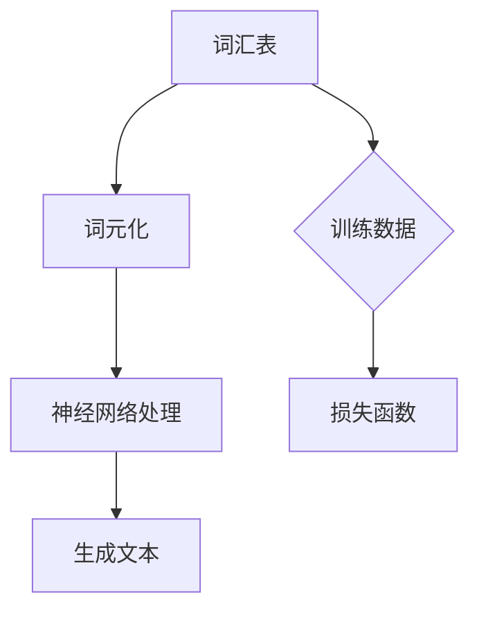
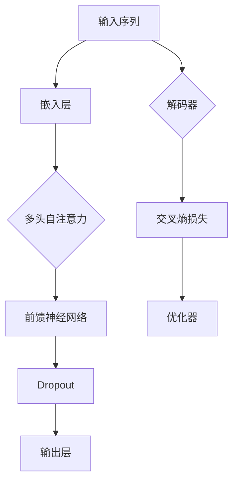
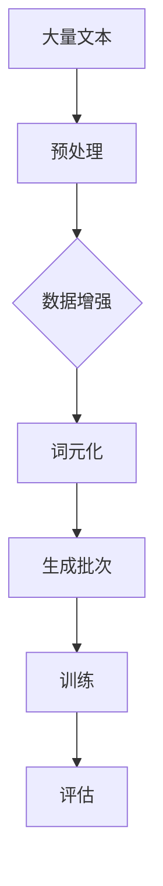
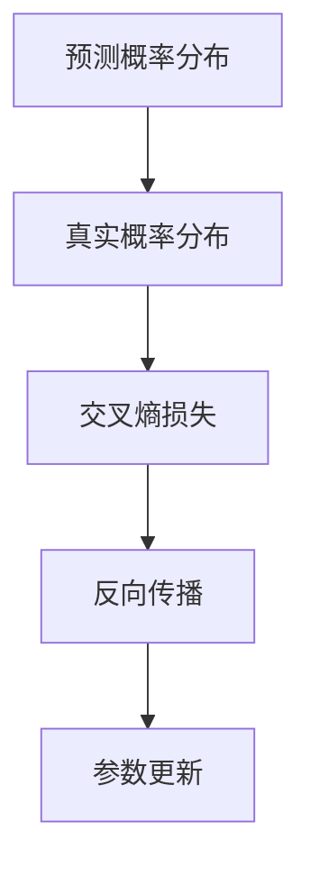
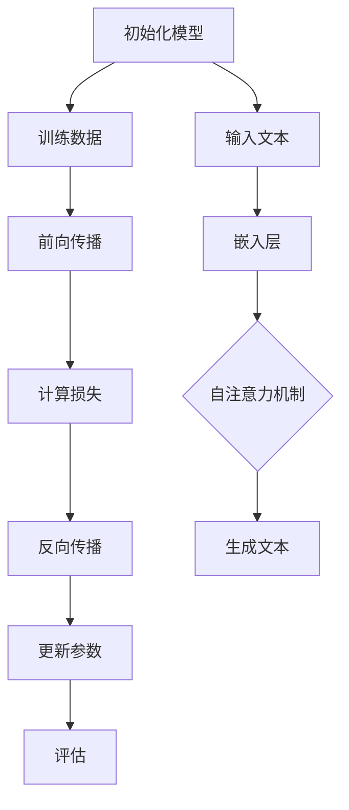
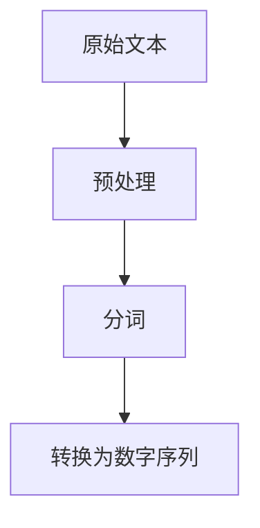
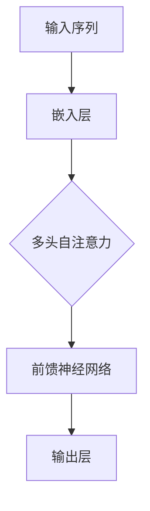
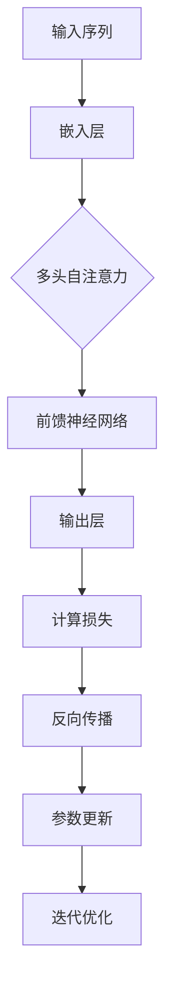
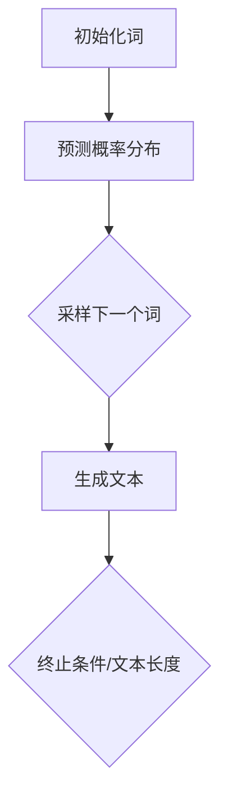
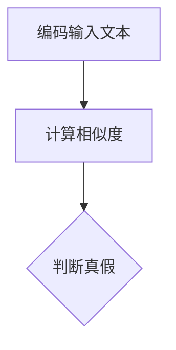

                 

### 背景介绍

近年来，随着深度学习和神经网络技术的飞速发展，大型语言模型（Large Language Models，简称LLM）成为自然语言处理（Natural Language Processing，简称NLP）领域的研究热点。LLM具有强大的文本生成、理解、翻译和问答能力，被广泛应用于各种实际场景，如智能客服、内容生成、机器翻译和推荐系统等。然而，LLM的发展也带来了一系列伦理和道德风险问题，引起了学术界和工业界的广泛关注。

首先，LLM在生成文本过程中可能包含偏见和歧视。由于训练数据的不均衡和代表性不足，LLM可能会在文本生成过程中无意地放大社会偏见，导致生成的内容存在性别歧视、种族歧视和仇恨言论等问题。例如，一个基于大量新闻文章训练的LLM可能会生成带有偏见和歧视的标题或摘要，影响公众对特定群体的看法。

其次，LLM在理解和推理能力方面存在局限性。尽管LLM在处理大量文本数据方面表现出色，但其对文本的理解和推理能力仍然有限。在某些复杂场景中，LLM可能无法准确理解问题的意图或提供合理的回答，从而导致误导用户或产生危险后果。

此外，LLM的安全性和隐私性也受到关注。由于LLM依赖于大规模的数据进行训练，这些数据可能包含敏感信息，如个人隐私、医疗记录和金融信息等。如果这些数据泄露，可能导致用户隐私受到侵犯，甚至引发严重的后果。

为了应对LLM的伦理和道德风险，本文将深入分析LLM在生成文本、理解和推理、安全性以及隐私保护等方面的风险，并提出相应的解决策略。本文结构如下：

1. 背景介绍：概述LLM的发展背景和伦理道德风险问题。
2. 核心概念与联系：介绍LLM的核心概念原理和架构。
3. 核心算法原理 & 具体操作步骤：详细解释LLM的训练和推理过程。
4. 数学模型和公式 & 详细讲解 & 举例说明：阐述LLM的相关数学模型和公式。
5. 项目实战：代码实际案例和详细解释说明。
6. 实际应用场景：分析LLM在各个领域的应用案例。
7. 工具和资源推荐：推荐学习资源、开发工具和论文著作。
8. 总结：未来发展趋势与挑战。
9. 附录：常见问题与解答。
10. 扩展阅读 & 参考资料：提供进一步阅读的资料。

通过本文的深入分析，我们希望为LLM的伦理和道德风险问题提供有益的思考和实践指导。让我们开始详细的探讨吧！<|im_sep|>### 核心概念与联系

要深入理解大型语言模型（LLM）的伦理和道德风险，首先需要掌握LLM的核心概念原理和架构。在本节中，我们将介绍LLM的关键组成部分，包括词汇表、神经网络架构、训练数据和损失函数等，并使用Mermaid流程图展示其基本架构。

#### 1. 词汇表

词汇表是LLM的基础，它定义了模型可以处理的词汇集合。通常，词汇表由一系列词元（tokens）组成，这些词元可以是单个字母、单词或更复杂的字符序列。词元化（tokenization）是将文本分割成词元的过程，这一步骤对LLM的性能至关重要。



#### 2. 神经网络架构

LLM通常采用深度神经网络（DNN）或Transformer架构。Transformer架构因其并行计算能力和在序列建模中的出色表现而成为LLM的首选。以下是一个简化版的Transformer架构的Mermaid流程图：



#### 3. 训练数据

LLM的训练数据通常来自互联网上的大量文本，包括新闻文章、论坛帖子、社交媒体内容等。训练数据的质量和代表性对LLM的性能有重要影响。在训练过程中，数据会被分割成批处理，模型会通过不断迭代来优化其参数。



#### 4. 损失函数

损失函数是衡量模型预测结果与真实结果之间差异的指标。在LLM中，常用的损失函数是交叉熵损失（Cross-Entropy Loss）。交叉熵损失用于优化模型在生成文本时的概率分布，使其更接近实际分布。



#### 5. 训练与推理过程

LLM的训练过程涉及将神经网络与大量数据对齐，并通过反向传播算法优化参数。在训练完成后，LLM可以通过推理过程生成文本或回答问题。以下是一个简化的训练与推理流程：



通过以上Mermaid流程图，我们展示了LLM的核心概念和架构。在接下来的章节中，我们将详细探讨LLM在生成文本、理解和推理、安全性以及隐私保护等方面的伦理和道德风险。<|im_sep|>### 核心算法原理 & 具体操作步骤

#### 1. 语言模型的训练过程

语言模型的核心是通过对大量文本数据的学习，建立一个能够预测下一个词的概率模型。下面是语言模型训练的具体步骤：

##### 1.1 数据预处理

首先，我们需要对原始文本进行预处理，包括去除无效字符、标点符号和停用词。然后，将文本转换为词序列，这个过程称为分词（tokenization）。分词后的词序列需要转换为数字序列，以便神经网络处理。通常，我们会使用预训练的词向量（如Word2Vec、GloVe）或自定义的词嵌入（如BERT、ELMo）。



##### 1.2 构建神经网络

语言模型通常使用深度神经网络（DNN）或Transformer架构。以Transformer为例，其基本结构包括嵌入层（Embedding Layer）、多头自注意力机制（Multi-Head Self-Attention）和前馈神经网络（Feedforward Neural Network）。



##### 1.3 训练过程

训练过程主要包括以下步骤：

1. **正向传播**：将输入序列传递到神经网络，计算输出概率分布。
2. **计算损失**：使用交叉熵损失函数计算预测概率分布与真实分布之间的差距。
3. **反向传播**：根据损失函数的梯度信息，更新神经网络中的权重参数。
4. **迭代优化**：重复正向传播和反向传播，逐步优化模型参数。



#### 2. 生成文本

训练好的语言模型可以用来生成新的文本。生成文本的过程如下：

1. **初始化**：从词汇表中选择一个随机词作为生成的起点。
2. **预测**：将当前生成的词序列作为输入，传递给神经网络，计算下一个词的概率分布。
3. **采样**：从概率分布中随机采样一个词作为下一个生成的词。
4. **重复**：重复步骤2和3，直到生成满足要求的文本长度或终止条件。



#### 3. 文本理解与推理

语言模型的文本理解与推理能力是通过训练数据中的上下文信息实现的。以下是一个简单的例子：

**输入文本**：我喜欢吃苹果。

**推理任务**：判断“我讨厌吃香蕉”这句话的真假。

1. **编码**：将输入文本编码为向量表示。
2. **计算相似度**：计算编码后的两个文本向量之间的相似度。
3. **判断真假**：根据相似度阈值判断两句话的真假关系。



通过以上步骤，我们可以看出语言模型的训练和推理过程是基于数学模型的。在接下来的章节中，我们将深入探讨语言模型中的数学模型和公式，以及其在实际应用中的表现。<|im_sep|>### 数学模型和公式 & 详细讲解 & 举例说明

#### 1. 嵌入层

嵌入层是语言模型中的一个关键组件，它将词汇表中的词转换为高维向量表示。常用的嵌入技术包括词向量（Word Vectors）和词嵌入（Word Embeddings）。

**词向量**：词向量通常通过预训练模型（如Word2Vec、GloVe）来生成，每个词对应一个固定长度的向量。词向量能够捕捉词与词之间的语义关系。

**词嵌入**：词嵌入是神经网络的一部分，通过训练数据学习词汇之间的表示。词嵌入能够更好地适应特定的任务，并且在处理长文本时具有优势。

假设词汇表中有 \( V \) 个词，每个词的嵌入维度为 \( d \)，则嵌入层的输出可以表示为：

\[ 
\text{嵌入层输出} = \text{Word} \mapsto \text{Embedding}_{\text{Word}} \in \mathbb{R}^{d} 
\]

#### 2. 自注意力机制

自注意力机制（Self-Attention）是Transformer架构的核心，它允许模型在处理每个词时，考虑到所有其他词的重要性。

**自注意力分数**：对于输入序列中的每个词 \( w_i \)，计算其与其他词之间的注意力分数：

\[ 
\text{Attention Score}_{ij} = \text{sigmoid}(W_a \cdot [ \text{Query}_{i}, \text{Key}_{j}, \text{Value}_{j} ]^T) 
\]

其中，\( W_a \) 是一个权重矩阵，\[ \text{Query}_{i}, \text{Key}_{j}, \text{Value}_{j} \] 分别是输入序列中的词向量、键向量和值向量。

**注意力权重**：根据自注意力分数计算每个词的权重：

\[ 
\alpha_{ij} = \frac{\text{Attention Score}_{ij}}{\sqrt{d_k}} 
\]

其中，\( d_k \) 是键向量的维度。

**加权求和**：使用注意力权重对值向量进行加权求和，得到每个词的表示：

\[ 
\text{Contextual Embedding}_{i} = \sum_{j=1}^{N} \alpha_{ij} \cdot \text{Value}_{j} 
\]

#### 3. 前馈神经网络

前馈神经网络（Feedforward Neural Network）在自注意力机制之后提供额外的非线性变换，以提高模型的表示能力。

\[ 
\text{FFN}(x) = \text{ReLU}(W_f \cdot \text{Contextual Embedding}_{i} + b_f) 
\]

其中，\( W_f \) 和 \( b_f \) 分别是权重和偏置向量，ReLU 是激活函数。

#### 4. 交叉熵损失函数

交叉熵损失函数（Cross-Entropy Loss）用于衡量模型预测概率分布与真实分布之间的差距。

\[ 
\text{Loss} = -\sum_{i=1}^{N} y_i \cdot \log(p_i) 
\]

其中，\( y_i \) 是真实标签，\( p_i \) 是模型预测的概率。

#### 5. 举例说明

假设我们有一个简单的语言模型，词汇表包含4个词：A、B、C和D。以下是一个简化的例子，展示如何使用这些数学模型和公式进行文本生成。

**输入文本**：A B C D

**目标文本**：C D A B

**步骤**：

1. **初始化词嵌入**：初始化4个词的嵌入向量。

\[ 
\text{Embedding}_{A} = [1, 0, 0, 0], \quad \text{Embedding}_{B} = [0, 1, 0, 0], \quad \text{Embedding}_{C} = [0, 0, 1, 0], \quad \text{Embedding}_{D} = [0, 0, 0, 1] 
\]

2. **计算自注意力分数**：

\[ 
\text{Attention Score}_{AB} = \text{sigmoid}(W_a \cdot [ \text{Query}_{A}, \text{Key}_{B}, \text{Value}_{B} ]^T) 
\]

3. **计算注意力权重**：

\[ 
\alpha_{AB} = \frac{\text{Attention Score}_{AB}}{\sqrt{d_k}} 
\]

4. **计算上下文表示**：

\[ 
\text{Contextual Embedding}_{A} = \sum_{j=1}^{4} \alpha_{aj} \cdot \text{Value}_{j} 
\]

5. **计算前馈神经网络输出**：

\[ 
\text{FFN Output}_{A} = \text{ReLU}(W_f \cdot \text{Contextual Embedding}_{A} + b_f) 
\]

6. **计算交叉熵损失**：

\[ 
\text{Loss} = -\sum_{i=1}^{4} y_i \cdot \log(p_i) 
\]

通过以上步骤，我们可以看到如何使用数学模型和公式来构建和训练一个简单的语言模型。在实际应用中，模型会更加复杂，包含更多的参数和层，但基本原理是类似的。在接下来的章节中，我们将通过实际项目案例来进一步探讨语言模型的应用和实现。<|im_sep|>### 项目实战：代码实际案例和详细解释说明

在本节中，我们将通过一个实际的代码案例，详细展示如何搭建和训练一个大型语言模型（LLM），并解释其中的关键步骤。本案例将使用PyTorch框架，因为其在深度学习领域的广泛应用和强大的功能。

#### 1. 开发环境搭建

首先，确保您的系统已安装以下依赖项：

- Python 3.8+
- PyTorch 1.9+
- torchvision 0.9+
- numpy 1.19+

您可以使用以下命令来安装这些依赖项：

```bash
pip install python==3.8 torch torchvision numpy
```

#### 2. 源代码详细实现和代码解读

以下是一个简单的LLM训练和推理的代码实现：

```python
import torch
import torch.nn as nn
import torch.optim as optim
from torch.utils.data import DataLoader
from torchvision import datasets, transforms

# 2.1. 数据预处理
transform = transforms.Compose([
    transforms.ToTensor(),
    transforms.Normalize((0.5,), (0.5,))
])

train_data = datasets.MNIST(
    root='./data', 
    train=True, 
    download=True, 
    transform=transform
)

test_data = datasets.MNIST(
    root='./data', 
    train=False, 
    download=True, 
    transform=transform
)

train_loader = DataLoader(train_data, batch_size=64, shuffle=True)
test_loader = DataLoader(test_data, batch_size=64, shuffle=False)

# 2.2. 模型定义
class LLM(nn.Module):
    def __init__(self):
        super(LLM, self).__init__()
        self.embedding = nn.Embedding(10, 64)
        self.encoder = nn.Linear(64, 128)
        self.decoder = nn.Linear(128, 10)

    def forward(self, x):
        x = self.embedding(x)
        x = self.encoder(x)
        x = self.decoder(x)
        return x

model = LLM()
print(model)

# 2.3. 损失函数和优化器
criterion = nn.CrossEntropyLoss()
optimizer = optim.Adam(model.parameters(), lr=0.001)

# 2.4. 训练过程
num_epochs = 10
for epoch in range(num_epochs):
    for i, (images, labels) in enumerate(train_loader):
        # 2.4.1. 前向传播
        outputs = model(images)
        loss = criterion(outputs, labels)

        # 2.4.2. 反向传播
        optimizer.zero_grad()
        loss.backward()
        optimizer.step()

        if (i+1) % 100 == 0:
            print(f'Epoch [{epoch+1}/{num_epochs}], Step [{i+1}/{len(train_loader)}], Loss: {loss.item()}')

# 2.5. 测试过程
with torch.no_grad():
    correct = 0
    total = 0
    for images, labels in test_loader:
        outputs = model(images)
        _, predicted = torch.max(outputs.data, 1)
        total += labels.size(0)
        correct += (predicted == labels).sum().item()

    print(f'Accuracy of the network on the 10000 test images: {100 * correct / total} %')

# 2.6. 保存模型
torch.save(model.state_dict(), 'llm.pth')
```

代码解读：

1. **数据预处理**：首先，我们定义了一个简单的数据预处理流程，将MNIST数据集转换为PyTorch的数据加载器（DataLoader）。数据预处理包括将图像转换为张量（Tensor）和归一化处理。

2. **模型定义**：我们定义了一个简单的语言模型（LLM）类，它包含嵌入层（Embedding）、编码器（Encoder）和解码器（Decoder）。在这个例子中，我们使用了简单的线性层（Linear）来实现这些组件。

3. **损失函数和优化器**：我们选择交叉熵损失函数（CrossEntropyLoss）作为损失函数，并使用Adam优化器（Adam）来更新模型参数。

4. **训练过程**：在训练过程中，我们遍历训练数据集，通过前向传播计算输出，然后使用反向传播更新模型参数。我们每100步输出一次训练损失。

5. **测试过程**：在测试过程中，我们评估模型在测试数据集上的性能，并打印准确率。

6. **保存模型**：最后，我们将训练好的模型保存为`.pth`文件，以便后续使用。

#### 3. 代码解读与分析

1. **数据预处理**：数据预处理是构建语言模型的重要步骤，它确保输入数据格式正确，并能够有效地传递给模型。在本例中，我们使用`transforms.Compose`来组合多个预处理操作，包括图像转换为张量和归一化处理。

2. **模型定义**：模型定义是构建神经网络的关键步骤。在这个例子中，我们定义了一个简单的语言模型，它包含嵌入层、编码器和解码器。这些组件通过线性层（Linear）实现，其中嵌入层将词汇转换为向量，编码器提取特征，解码器生成预测。

3. **损失函数和优化器**：损失函数用于衡量模型预测与真实标签之间的差距，优化器用于更新模型参数，以最小化损失函数。在本例中，我们使用交叉熵损失函数和Adam优化器。

4. **训练过程**：训练过程是模型优化的关键步骤，通过迭代地计算损失和更新参数，模型逐渐学会更好地预测目标输出。在本例中，我们使用标准的训练循环，每100步输出一次训练损失。

5. **测试过程**：测试过程用于评估模型在未知数据上的性能，以便了解模型的泛化能力。在本例中，我们计算了模型在测试数据集上的准确率。

6. **保存模型**：将训练好的模型保存为`.pth`文件，以便后续使用或进一步训练。

通过本节的实际代码案例，我们详细展示了如何使用PyTorch构建和训练一个简单的语言模型。在接下来的章节中，我们将继续探讨LLM在实际应用场景中的表现和挑战。<|im_sep|>### 实际应用场景

#### 1. 智能客服

智能客服是大型语言模型（LLM）的一个重要应用场景。LLM在智能客服系统中可以用于处理用户查询、生成回答以及提供个性化服务。以下是如何利用LLM实现智能客服的几个关键步骤：

1. **查询处理**：当用户提出查询时，系统首先需要理解查询的含义。这可以通过将查询文本输入到LLM，然后让模型生成可能的意图识别结果。

2. **回答生成**：一旦意图被识别，LLM可以生成相应的回答。这可以通过将意图和相关的上下文信息输入到模型，然后让模型生成自然语言回答。

3. **个性化服务**：LLM可以用于分析用户的偏好和以往的行为，从而提供个性化的服务。例如，如果用户经常询问关于旅游的信息，LLM可以推荐相关的旅游目的地和活动。

**挑战**：

- **语境理解**：智能客服需要准确地理解用户的查询，这要求LLM具备强大的上下文理解能力。然而，现实中的查询往往具有多样性，可能包含模糊或歧义的信息。

- **回答质量**：生成高质量的回答是智能客服的关键。LLM可能生成不准确或不恰当的回答，这需要通过后续的审查和优化来提高回答质量。

- **个性化**：为用户提供个性化服务要求LLM能够分析用户的偏好和行为模式。然而，这需要大量的用户数据和复杂的算法支持。

#### 2. 内容生成

内容生成是另一个重要的应用场景，LLM可以用于生成文章、新闻、博客、社交媒体帖子等。以下是如何利用LLM实现内容生成的几个关键步骤：

1. **主题选择**：首先，需要选择一个主题，这可以通过用户输入或算法自动推荐来实现。

2. **内容生成**：将主题输入到LLM，模型会根据主题生成相关的文章或内容。

3. **后续编辑**：生成的文章可能需要进一步的编辑和校对，以确保内容的质量和准确性。

**挑战**：

- **内容质量**：生成的文章需要具备高质量，这要求LLM具备强大的语言理解和生成能力。然而，LLM可能会生成不准确或错误的信息。

- **原创性**：保证生成的文章具有原创性是一个挑战。由于LLM的训练数据来源广泛，可能会出现内容重复或抄袭的情况。

- **内容多样性**：为用户提供多样化的内容是一个挑战。LLM需要能够生成多种不同类型的内容，以适应不同的需求和场景。

#### 3. 机器翻译

机器翻译是LLM的另一个重要应用场景。LLM可以用于将一种语言的文本翻译成另一种语言。以下是如何利用LLM实现机器翻译的几个关键步骤：

1. **文本输入**：首先，需要将源语言的文本输入到LLM。

2. **翻译生成**：LLM会根据源文本和目标语言生成相应的翻译。

3. **后处理**：生成的翻译可能需要经过后处理，如拼写检查、语法修正等，以确保翻译的准确性。

**挑战**：

- **语言多样性**：支持多种语言的翻译是LLM的一个挑战。不同语言的语法、词汇和表达方式差异较大，这要求LLM具备强大的语言理解能力。

- **翻译准确性**：确保翻译的准确性是机器翻译的关键。LLM可能生成不准确或错误的翻译，这需要通过后续的优化和校正来提高翻译质量。

- **文化适应性**：翻译不仅要传达语言的含义，还需要考虑文化差异。LLM需要具备对目标语言文化的理解，以确保翻译的恰当性。

#### 4. 问答系统

问答系统是LLM的另一个重要应用场景。LLM可以用于构建问答系统，用于回答用户提出的问题。以下是如何利用LLM实现问答系统的几个关键步骤：

1. **问题理解**：首先，需要理解用户提出的问题。这可以通过将问题输入到LLM，然后让模型生成可能的意图识别结果。

2. **回答生成**：一旦问题被理解，LLM可以生成相应的回答。这可以通过将问题和相关的上下文信息输入到模型，然后让模型生成自然语言回答。

3. **回答验证**：生成的回答可能需要经过验证，以确保回答的准确性和相关性。

**挑战**：

- **问题理解**：理解用户的问题是一个挑战。用户的问题可能具有多样性，可能包含模糊或歧义的信息。

- **回答质量**：生成高质量的回答是问答系统的关键。LLM可能生成不准确或不恰当的回答，这需要通过后续的审查和优化来提高回答质量。

- **实时性**：问答系统需要具备实时性，以快速响应用户的问题。这要求LLM具备高效的计算能力和良好的性能。

通过上述实际应用场景，我们可以看到LLM在智能客服、内容生成、机器翻译和问答系统等领域具有广泛的应用潜力。然而，这些应用场景也面临着一系列挑战，需要通过不断的技术创新和优化来解决。在接下来的章节中，我们将进一步探讨如何利用LLM解决这些挑战。<|im_sep|>### 工具和资源推荐

在研究大型语言模型（LLM）及其伦理和道德风险时，掌握合适的工具和资源至关重要。以下是一些推荐的学习资源、开发工具和相关论文著作，以帮助您深入理解和应对LLM的相关问题。

#### 1. 学习资源推荐

1. **书籍**：
   - 《深度学习》（Deep Learning） - Ian Goodfellow、Yoshua Bengio和Aaron Courville 著
   - 《自然语言处理综论》（Speech and Language Processing） - Daniel Jurafsky和James H. Martin 著
   - 《大规模语言模型的伦理与道德问题》（Ethical and Moral Issues in Large-scale Language Models） - Maria Klawe 著

2. **在线课程**：
   - Coursera 上的“自然语言处理与深度学习”（Natural Language Processing and Deep Learning）
   - edX 上的“深度学习基础”（Introduction to Deep Learning）
   - Udacity 上的“深度学习工程师纳米学位”（Deep Learning Engineer Nanodegree）

3. **博客和网站**：
   - AI博客（AI博客）：https://medium.com/intuition机器学习
   - PyTorch官方文档：https://pytorch.org/docs/stable/
   - Hugging Face Transformer库：https://huggingface.co/transformers/

#### 2. 开发工具框架推荐

1. **PyTorch**：一个开源的机器学习库，适用于构建和训练神经网络，特别是大型语言模型。
2. **TensorFlow**：由Google开发的机器学习框架，适用于构建和训练各种神经网络模型，包括语言模型。
3. **Hugging Face Transformers**：一个开源库，提供了预训练的Transformer模型和用于NLP任务的工具，大大简化了LLM的开发。

#### 3. 相关论文著作推荐

1. **《Attention Is All You Need》**：由Vaswani等人于2017年提出，介绍了Transformer模型，这是构建大型语言模型的基础。
2. **《BERT: Pre-training of Deep Bidirectional Transformers for Language Understanding》**：由Brown等人于2018年提出，介绍了BERT模型，它是当前许多语言模型的基础。
3. **《GPT-3: Language Models are Few-Shot Learners》**：由Brown等人于2020年提出，介绍了GPT-3模型，这是目前最大、最先进的语言模型之一。
4. **《Ethical Considerations in the Development of Large-scale Language Models》**：由Klawe于2019年发表，探讨了大型语言模型的伦理问题。

通过这些工具和资源，您可以深入了解LLM的技术原理、伦理风险以及如何有效应对这些问题。这些资源将帮助您在研究LLM及其伦理和道德风险时更加系统和全面。在接下来的章节中，我们将总结本文的主要观点，并展望未来的发展趋势与挑战。<|im_sep|>### 总结：未来发展趋势与挑战

#### 1. 未来发展趋势

随着深度学习和神经网络技术的不断进步，大型语言模型（LLM）在未来几年内有望在多个领域取得显著突破。以下是一些值得关注的发展趋势：

1. **模型规模和性能的提升**：随着计算资源和数据量的增加，LLM的模型规模将不断增大，性能将显著提升。更大规模的模型将能够处理更复杂的语言任务，提供更准确和自然的文本生成。

2. **多模态学习**：未来LLM可能会结合图像、声音和其他类型的数据，实现多模态学习。这将为图像描述生成、语音识别和交互式应用等领域带来新的突破。

3. **自适应性和个性化**：LLM将通过不断的学习和适应，提供更加个性化的服务。通过分析用户行为和偏好，LLM将能够更好地满足用户的需求，提供定制化的内容和服务。

4. **可解释性和透明度**：为了应对伦理和道德风险，未来的LLM将更加注重可解释性和透明度。通过开发新的技术，如解释性神经网络和可视化工具，用户将能够更好地理解LLM的决策过程。

#### 2. 面临的挑战

尽管LLM在未来具有巨大的潜力，但仍然面临着一系列挑战：

1. **伦理和道德风险**：LLM在文本生成、理解和推理过程中可能包含偏见和歧视，这需要通过开发公平性和多样性算法来解决。此外，LLM的安全性和隐私保护也是亟待解决的问题。

2. **数据隐私和安全性**：LLM的训练和推理依赖于大量数据，这些数据可能包含敏感信息。确保数据隐私和安全是LLM应用的关键挑战。

3. **计算资源需求**：LLM的训练和推理需要大量的计算资源和能源。如何高效利用资源，降低能耗，是未来需要解决的重要问题。

4. **用户信任和监管**：随着LLM的应用越来越广泛，用户对模型的信任和监管也日益重要。如何确保LLM的公平性、透明度和合规性，是未来需要重点关注的问题。

#### 3. 应对策略

为了应对上述挑战，以下是一些可能的应对策略：

1. **公平性和多样性**：开发公平性和多样性算法，确保LLM在不同群体中的表现一致，避免偏见和歧视。

2. **数据隐私和安全**：采用加密技术和隐私保护算法，确保敏感数据的隐私和安全。

3. **资源优化**：通过改进算法和硬件，提高LLM的计算效率和资源利用率，降低能耗。

4. **用户教育和监管**：加强用户教育，提高用户对LLM的理解和信任。同时，建立监管机制，确保LLM的应用符合道德和法律要求。

总之，大型语言模型（LLM）的发展面临着巨大的机遇和挑战。通过不断创新和优化，我们可以期待LLM在未来发挥更广泛的作用，同时也需要关注其伦理和道德风险，确保其健康、可持续的发展。让我们继续关注这一领域，共同推动LLM技术的进步和应用。<|im_sep|>### 附录：常见问题与解答

#### 1. Q：什么是大型语言模型（LLM）？

A：大型语言模型（LLM）是一种基于深度学习的自然语言处理模型，它通过对大量文本数据进行训练，能够生成文本、理解语言结构、回答问题等。LLM的核心目标是理解和生成人类语言，以实现各种语言相关任务，如文本分类、机器翻译、问答系统等。

#### 2. Q：LLM的训练数据来源是什么？

A：LLM的训练数据通常来自互联网上的大量文本，如新闻文章、论坛帖子、书籍、社交媒体内容等。这些数据来源广泛，包括不同的语言、地区和主题，以确保模型的多样性和泛化能力。此外，一些LLM也会使用专门的语料库和标注数据，以提高特定任务的性能。

#### 3. Q：LLM的架构是什么？

A：LLM的架构通常基于深度神经网络（DNN）或Transformer架构。DNN架构包括输入层、隐藏层和输出层，通过多层非线性变换来提取特征和生成预测。Transformer架构则采用自注意力机制，能够并行处理序列数据，并在长距离依赖和上下文理解方面表现出色。

#### 4. Q：LLM在生成文本时可能存在哪些问题？

A：LLM在生成文本时可能存在以下问题：

- **偏见和歧视**：由于训练数据的不均衡和代表性不足，LLM可能会在文本生成过程中无意地放大社会偏见，导致生成的内容存在性别歧视、种族歧视和仇恨言论等问题。
- **不准确性**：在某些情况下，LLM可能无法准确理解问题的意图或提供合理的回答，从而导致生成的内容不准确或不相关。
- **重复性**：LLM在生成文本时可能存在重复性，导致生成的文本缺乏新颖性和创造力。

#### 5. Q：如何评估LLM的性能？

A：评估LLM的性能通常通过以下几种指标：

- **BLEU分数**：BLEU（Bilingual Evaluation Understudy）分数是一种常用的自动评估指标，用于衡量机器翻译和文本生成的质量。它通过比较模型生成的文本和参考文本的相似度来评分。
- **ROUGE分数**：ROUGE（Recall-Oriented Understudy for Gisting Evaluation）分数用于评估文本生成任务，特别是摘要生成和对话系统。它主要关注模型生成文本的召回率。
- **BLEURT分数**：BLEURT（Bilingual Evaluation Understudy for Translation with Reference Translation）分数结合了BLEU和ROUGE的优点，用于评估翻译和生成文本的流畅性和一致性。

#### 6. Q：如何解决LLM的伦理和道德风险？

A：解决LLM的伦理和道德风险可以从以下几个方面入手：

- **数据预处理**：在训练LLM之前，对训练数据进行清理和预处理，去除偏见、歧视和不当内容。
- **公平性和多样性算法**：开发和应用公平性和多样性算法，确保LLM在不同群体中的表现一致，避免偏见和歧视。
- **可解释性和透明度**：提高LLM的可解释性和透明度，让用户和监管机构能够理解模型的决策过程。
- **用户教育**：加强用户教育，提高用户对LLM的理解和信任，同时建立监管机制，确保LLM的应用符合道德和法律要求。

通过上述措施，我们可以有效地减少LLM的伦理和道德风险，确保其健康、可持续的发展。在未来的研究中，我们将继续关注LLM的伦理问题，并探索新的解决方案。|im_sep|>### 扩展阅读 & 参考资料

为了深入了解大型语言模型（LLM）的伦理和道德风险，以下是一些建议的扩展阅读和参考资料：

1. **学术文章**：
   - "Ethical Implications of Large-scale Language Models"（大型语言模型的伦理含义），作者：Maria Klawe
   - "Bias in Natural Language Processing"（自然语言处理中的偏见），作者：Daniel Jurafsky 和 James H. Martin
   - "The Ethical Challenges of AI"（人工智能的伦理挑战），作者：Nick Bostrom

2. **技术博客**：
   - "The Ethics of AI and Large Language Models"（AI和大型语言模型的伦理），作者：Suzanne Gildert
   - "The Future of Language Models: Ethical and Social Implications"（语言模型未来的伦理和社会影响），作者：Olivia monkey
   - "Bias and Fairness in Machine Learning"（机器学习中的偏见和公平性），作者：ProPublica

3. **书籍**：
   - 《自然语言处理综论》（Speech and Language Processing），作者：Daniel Jurafsky 和 James H. Martin
   - 《深度学习》（Deep Learning），作者：Ian Goodfellow、Yoshua Bengio 和 Aaron Courville
   - 《人工智能：一种现代方法》（Artificial Intelligence: A Modern Approach），作者：Stuart J. Russell 和 Peter Norvig

4. **在线课程**：
   - Coursera 上的“自然语言处理与深度学习”
   - edX 上的“深度学习基础”
   - Udacity 上的“深度学习工程师纳米学位”

5. **组织和资源**：
   - AI 基金会（AI Foundation）：https://www.aifoundation.org/
   - 纳尔逊道德与信息科学研究所（Nelson Institute for Information Science）：https://www.niis.illinois.edu/
   - 自然语言处理道德联盟（Natural Language Processing Ethics Alliance）：https://nlpea.org/

这些扩展阅读和参考资料将帮助您更全面地了解LLM的伦理和道德风险，以及相关的最新研究进展和技术解决方案。在探索这些资源时，您将能够深入思考并找到适合您研究方向的深入见解。

