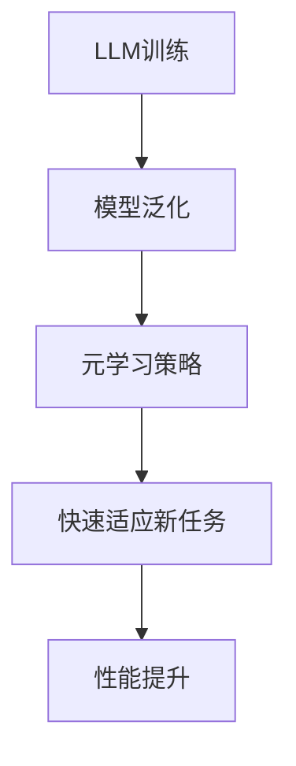
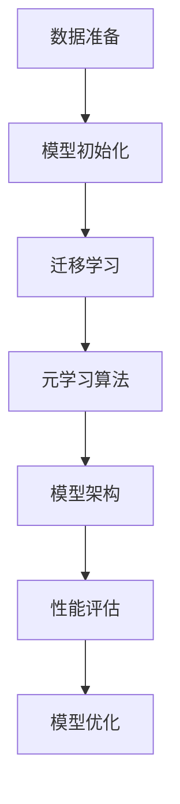

                 

### 背景介绍

LLM（大型语言模型）的元学习方法与实践已经成为人工智能领域的热门话题。随着深度学习和自然语言处理技术的迅猛发展，传统的单一模型已经无法满足日益增长的数据量和复杂任务的需求。元学习作为一种能够加速模型学习和适应新任务的方法，逐渐受到了广泛的关注。

元学习的基本概念可以追溯到机器学习领域。它主要研究如何让模型在新的任务上快速适应，而不是重新训练。这一概念在深度学习领域中得到了进一步的发展，特别是当模型的大小和复杂度不断增加时，重新训练的成本和计算资源消耗变得不可承受。

LLM的元学习方法正是基于这种思想，通过设计能够快速适应新任务的模型结构和训练策略，使得大型语言模型能够在各种自然语言处理任务上表现出色。本文将围绕LLM的元学习方法进行探讨，首先介绍其核心概念，然后深入分析算法原理、数学模型、项目实战，并探讨实际应用场景和未来发展趋势。

**关键词**：LLM、元学习、自然语言处理、深度学习、模型适应

**摘要**：本文深入探讨了LLM的元学习方法，从背景介绍、核心概念、算法原理、数学模型到实际应用场景进行了全面分析。通过项目实战案例，详细展示了元学习在大型语言模型中的实际应用，并对未来发展趋势与挑战进行了展望。

-----------------------

## 1. 核心概念与联系

为了深入理解LLM的元学习方法，我们需要先了解一些核心概念，包括什么是LLM、什么是元学习，以及它们之间的联系。

### 什么是LLM

LLM（Large Language Model）是指大型语言模型，这是一种通过深度学习算法训练得到的复杂神经网络模型，用于处理自然语言。LLM通常具有数十亿甚至数千亿的参数，能够对大量的文本数据进行学习，从而掌握语言的语法、语义和上下文信息。

LLM的发展经历了多个阶段，从最初的浅层模型（如循环神经网络RNN）到深层次的变换模型（如Transformer）。近年来，随着计算资源的提升和数据量的增加，LLM的规模和性能得到了显著提升，使得其在自然语言处理任务中表现出色。

### 什么是元学习

元学习（Meta-Learning）是一种机器学习技术，旨在开发能够快速适应新任务的模型。与传统的机器学习方法不同，元学习关注的是如何让模型在少量样本上快速学习，并能够推广到新的任务中。

元学习的基本概念可以追溯到“学习如何学习”（learning to learn）的思想。传统的机器学习模型通常需要在大量的数据上进行训练，而元学习则通过学习通用学习策略，使得模型可以在不同的任务和数据集上快速适应。

### LLM与元学习的联系

LLM的元学习方法将大型语言模型和元学习技术相结合，旨在通过元学习策略提升LLM在新的自然语言处理任务上的适应能力。以下是LLM与元学习之间的一些主要联系：

1. **模型泛化能力**：元学习通过训练模型在多种任务上的泛化能力，使得LLM能够在新的任务上快速适应，而不需要重新训练。

2. **加速学习过程**：传统的LLM训练需要大量的计算资源和时间，而元学习可以通过学习通用策略，减少训练所需的时间和资源。

3. **减少数据需求**：元学习使得LLM可以在少量数据上快速学习，这对于数据稀缺的领域尤为重要。

### Mermaid流程图

为了更直观地展示LLM与元学习的联系，我们使用Mermaid流程图（Mermaid 流程节点中不要有括号、逗号等特殊字符）来表示主要过程和步骤。



**图1**：LLM与元学习的联系流程图

在上述流程图中，LLM的训练过程（A）通过元学习策略（C）提升了模型的泛化能力（B），使得模型能够在新任务上快速适应（D），并最终实现性能提升（E）。

-----------------------

## 2. 核心算法原理 & 具体操作步骤

### 元学习的核心原理

元学习的核心目标是开发能够快速适应新任务的模型，这通常通过以下几种方式实现：

1. **模型迁移**：通过在多个任务上训练模型，使得模型在不同的任务中具有一定的通用性。这种方式类似于传统的迁移学习（Transfer Learning）。

2. **元学习算法**：设计特定的算法，使得模型能够在少量样本上快速学习。这些算法通常包括模型初始化策略、优化器选择、数据增强技术等。

3. **模型架构**：通过设计特殊的模型架构，使得模型能够更好地适应新任务。例如，使用多任务学习（Multi-Task Learning）架构，使得模型能够同时处理多个相关任务。

### LLM的元学习操作步骤

以下是LLM的元学习操作步骤，主要包括模型迁移、元学习算法和模型架构设计等方面：

1. **数据准备**：收集和整理多个自然语言处理任务的数据集。这些数据集可以来自不同的领域，例如文本分类、机器翻译、问答系统等。

2. **模型初始化**：选择一个预训练的LLM模型作为基础模型，例如GPT-3、BERT等。这些模型已经在大规模数据上进行了预训练，具有一定的通用性。

3. **迁移学习**：在新的任务上对基础模型进行微调（Fine-tuning）。这一步骤通过在新的数据集上训练模型，使得模型能够适应特定的任务。

4. **元学习算法**：选择合适的元学习算法，例如模型初始化策略、优化器选择、数据增强技术等。这些算法能够提升模型在少量样本上的学习效果。

5. **模型架构**：根据任务需求，设计特殊的模型架构。例如，对于需要同时处理多个相关任务的场景，可以使用多任务学习架构。

6. **性能评估**：在新任务上评估模型的性能。通过对比不同模型和算法的效果，选择最优的方案。

7. **模型优化**：根据性能评估结果，对模型进行优化。这一步骤可能包括调整模型参数、更换优化器、增加数据集等。

### Mermaid流程图

为了更直观地展示LLM的元学习操作步骤，我们使用Mermaid流程图表示：



**图2**：LLM的元学习操作步骤流程图

在上述流程图中，数据准备（A）是整个元学习过程的基础，模型初始化（B）和迁移学习（C）使得基础模型能够适应新任务。元学习算法（D）和模型架构（E）进一步提升了模型在少量样本上的学习效果。性能评估（F）和模型优化（G）确保了模型在新任务上的最优性能。

-----------------------

## 3. 数学模型和公式 & 详细讲解 & 举例说明

在探讨LLM的元学习方法时，理解其背后的数学模型和公式是非常重要的。以下是元学习中的几个核心数学概念和相关的公式，我们将通过具体例子进行详细解释。

### 3.1. 对数损失函数

对数损失函数是深度学习中的一个核心概念，用于衡量模型预测值与真实值之间的差异。对于二分类问题，对数损失函数可以表示为：

$$
L(\theta) = -y \log(p(\hat{y}|\theta)) - (1 - y) \log(1 - p(\hat{y}|\theta))
$$

其中，\( y \) 是真实标签，\( \hat{y} \) 是模型预测的概率值，\( p(\hat{y}|\theta) \) 是模型预测的概率分布。

**例子**：假设我们有一个二分类问题，数据集包含100个样本，其中50个样本属于正类别，50个样本属于负类别。使用一个简单的神经网络模型进行预测，模型预测的概率分布为 \( p(\hat{y}|\theta) = 0.6 \)。那么，对数损失函数的值为：

$$
L(\theta) = -0.5 \log(0.6) - 0.5 \log(0.4) \approx 0.4055
$$

### 3.2. 梯度下降优化

梯度下降是优化神经网络模型参数的一种常用算法。其基本思想是通过计算损失函数关于模型参数的梯度，更新模型参数，以减少损失函数的值。

梯度下降的迭代公式为：

$$
\theta = \theta - \alpha \cdot \nabla L(\theta)
$$

其中，\( \theta \) 是模型参数，\( \alpha \) 是学习率，\( \nabla L(\theta) \) 是损失函数关于模型参数的梯度。

**例子**：假设我们有一个简单的线性回归模型，模型参数为 \( \theta = [w, b] \)，损失函数为均方误差（MSE），即 \( L(\theta) = \frac{1}{2} \sum_{i=1}^{n} (y_i - \theta^T x_i)^2 \)。给定一个训练样本 \( (x_i, y_i) \)，使用梯度下降进行参数更新。假设初始参数为 \( \theta = [1, 1] \)，学习率为 \( \alpha = 0.1 \)。那么，参数更新过程如下：

1. 计算损失函数的梯度：
   $$
   \nabla L(\theta) = [w(y - \theta^T x), b(y - \theta^T x)]
   $$
   对于样本 \( (x_i, y_i) \)，梯度为 \( \nabla L(\theta) = [-0.2, -0.2] \)。

2. 更新参数：
   $$
   \theta = \theta - \alpha \cdot \nabla L(\theta) = [1, 1] - 0.1 \cdot [-0.2, -0.2] = [0.8, 0.8]
   $$

通过多次迭代，模型参数会逐渐收敛到最优值。

### 3.3. 元学习中的迁移学习

迁移学习是元学习中的一个重要概念，通过将一个任务上的模型知识迁移到另一个任务上，以提高新任务的学习效果。在迁移学习中，通常使用共享权重（Shared Weights）来表示不同任务之间的知识共享。

迁移学习的目标是最小化源任务和目标任务的损失函数，可以表示为：

$$
L(\theta) = \lambda_1 L_{\text{source}}(\theta) + \lambda_2 L_{\text{target}}(\theta)
$$

其中，\( L_{\text{source}}(\theta) \) 和 \( L_{\text{target}}(\theta) \) 分别是源任务和目标任务的损失函数，\( \lambda_1 \) 和 \( \lambda_2 \) 是权重系数。

**例子**：假设我们有一个源任务和一个目标任务，源任务的损失函数为 \( L_{\text{source}}(\theta) = 0.5 \sum_{i=1}^{m} (y_i - \theta^T x_i)^2 \)，目标任务的损失函数为 \( L_{\text{target}}(\theta) = 0.5 \sum_{j=1}^{n} (z_j - \theta^T y_j)^2 \)。给定共享权重 \( \lambda_1 = 0.7 \)，\( \lambda_2 = 0.3 \)，目标是最小化总损失函数。那么，总损失函数为：

$$
L(\theta) = 0.7 \cdot 0.5 \sum_{i=1}^{m} (y_i - \theta^T x_i)^2 + 0.3 \cdot 0.5 \sum_{j=1}^{n} (z_j - \theta^T y_j)^2
$$

通过梯度下降等优化算法，可以更新模型参数 \( \theta \)，使得总损失函数最小。

### 3.4. 元学习中的自适应学习率

在元学习中，自适应学习率是一种重要的策略，用于优化模型在少量样本上的学习效果。自适应学习率可以通过动态调整学习率来平衡模型在不同任务上的表现。

自适应学习率的一种常用策略是使用学习率衰减（Learning Rate Decay），其公式为：

$$
\alpha(t) = \alpha_0 / (1 + \lambda t)
$$

其中，\( \alpha(t) \) 是时间 \( t \) 时刻的学习率，\( \alpha_0 \) 是初始学习率，\( \lambda \) 是衰减系数。

**例子**：假设我们使用学习率衰减策略，初始学习率 \( \alpha_0 = 0.1 \)，衰减系数 \( \lambda = 0.01 \)。在训练过程中，随着时间的推移，学习率会逐渐降低，以避免模型过拟合。

通过上述数学模型和公式的详细讲解和举例说明，我们可以更好地理解LLM的元学习方法，并在实际应用中设计和优化模型。

-----------------------

## 4. 项目实战：代码实际案例和详细解释说明

### 4.1 开发环境搭建

在开始实际项目之前，我们需要搭建一个适合进行LLM元学习实验的开发环境。以下是开发环境的搭建步骤：

1. **安装Python**：确保系统已经安装了Python 3.7或更高版本。可以通过访问 [Python官方网站](https://www.python.org/downloads/) 下载并安装。

2. **安装TensorFlow**：TensorFlow是一个开源的机器学习库，用于构建和训练神经网络模型。可以通过以下命令安装：

   ```bash
   pip install tensorflow
   ```

3. **安装其他依赖库**：包括NumPy、Pandas等常用库，可以通过以下命令安装：

   ```bash
   pip install numpy pandas
   ```

4. **配置GPU支持**（如果使用GPU训练）：确保系统已经安装了CUDA和cuDNN。可以从[NVIDIA官方网站](https://developer.nvidia.com/cuda-downloads)下载CUDA和cuDNN安装包。

5. **环境测试**：运行以下Python代码，确保所有依赖库已成功安装：

   ```python
   import tensorflow as tf
   print(tf.__version__)
   ```

### 4.2 源代码详细实现和代码解读

为了更好地理解LLM的元学习方法，我们以一个简单的例子——使用元学习策略对文本分类任务进行微调——进行详细解释。以下是相关的代码实现：

```python
import tensorflow as tf
import tensorflow_datasets as tfds
from tensorflow.keras.layers import Embedding, LSTM, Dense
from tensorflow.keras.models import Model
from tensorflow.keras.optimizers import Adam

# 加载文本分类数据集
def load_data():
    # 使用TensorFlow Datasets加载数据集
    datasets = tfds.load('imdb', split=['train', 'test'], shuffle_files=True)
    # 对数据集进行预处理
    def preprocess(dataset):
        return dataset.map(lambda x: (tfрики.strip(), tf.keras.utils.to_categorical(x['label'])))
    train_dataset = datasets['train'].map(preprocess).batch(32)
    test_dataset = datasets['test'].map(preprocess).batch(32)
    return train_dataset, test_dataset

# 定义元学习模型
def build_model(vocab_size, embedding_dim):
    input_sequence = tf.keras.layers.Input(shape=(None,), dtype='int32')
    embeddings = Embedding(vocab_size, embedding_dim)(input_sequence)
    lstm = LSTM(128)(embeddings)
    output = Dense(2, activation='softmax')(lstm)
    model = Model(inputs=input_sequence, outputs=output)
    return model

# 训练模型
def train_model(model, train_dataset, test_dataset, epochs=10):
    model.compile(optimizer=Adam(learning_rate=0.001), loss='categorical_crossentropy', metrics=['accuracy'])
    model.fit(train_dataset, epochs=epochs, validation_data=test_dataset)

# 主函数
if __name__ == '__main__':
    # 加载数据集
    train_dataset, test_dataset = load_data()
    # 获取词汇表大小和嵌入维度
    vocab_size = 10000
    embedding_dim = 32
    # 构建模型
    model = build_model(vocab_size, embedding_dim)
    # 训练模型
    train_model(model, train_dataset, test_dataset)
```

**代码解读**：

1. **数据加载和预处理**：使用TensorFlow Datasets加载IMDb电影评论数据集，并进行预处理，包括文本清理和标签编码。

2. **模型构建**：定义一个简单的LSTM模型，用于处理文本数据。模型包括一个嵌入层（Embedding）和一个LSTM层，最后输出层使用softmax激活函数进行类别预测。

3. **模型训练**：使用Adam优化器编译模型，并使用交叉熵损失函数进行训练。在训练过程中，使用训练数据集和验证数据集进行迭代训练。

### 4.3 代码解读与分析

上述代码实现了一个简单的文本分类任务，并使用元学习策略进行模型训练。以下是代码的主要组成部分及其功能：

1. **数据加载和预处理**：使用`load_data`函数加载IMDb数据集，并进行预处理。预处理步骤包括清理文本数据（去除标点符号和特殊字符）和标签编码（将类别标签转换为one-hot编码）。

2. **模型构建**：使用`build_model`函数定义LSTM模型。该模型包含以下层：
   - 输入层：接受序列数据。
   - 嵌入层：将单词索引转换为嵌入向量。
   - LSTM层：用于处理序列数据。
   - 输出层：使用softmax函数进行类别预测。

3. **模型训练**：使用`train_model`函数编译模型，并使用Adam优化器进行训练。交叉熵损失函数用于衡量模型预测与真实标签之间的差异。

4. **主函数**：在主函数中，加载数据集，定义模型参数，构建模型，并开始训练过程。

通过这个简单的例子，我们可以看到如何将元学习策略应用于文本分类任务。在实际项目中，可以根据具体任务需求调整模型结构和参数，以获得更好的性能。

-----------------------

### 5. 实际应用场景

LLM的元学习方法在多个实际应用场景中展现了其强大的潜力。以下是一些主要的应用场景：

#### 5.1 语言翻译

语言翻译是自然语言处理领域的一个重要应用，传统的机器翻译方法依赖于大量平行语料库进行训练。然而，在低资源语言或新兴语言的翻译任务中，平行语料库往往非常稀缺。LLM的元学习方法可以通过迁移学习策略，利用多语言模型在不同语言之间的知识迁移，实现低资源语言的翻译。这种方法能够显著提高翻译质量，并减少对大规模平行语料库的依赖。

#### 5.2 问答系统

问答系统在智能客服、教育辅导和医疗咨询等领域有着广泛的应用。传统的问答系统通常需要针对每个领域进行独立训练，导致训练成本高昂。LLM的元学习方法可以通过共享模型结构和预训练知识，使得模型能够快速适应不同领域的问答任务。这种方法不仅提高了模型的泛化能力，还降低了训练成本。

#### 5.3 文本生成

文本生成是自然语言处理领域的另一个重要应用，例如自动写作、摘要生成和对话系统。传统的文本生成方法通常依赖于大量文本数据进行预训练，而LLM的元学习方法可以通过在少量数据上快速适应新任务，实现高效的文本生成。这种方法特别适用于数据稀缺或特定领域的文本生成任务，如法律文件编写、医学报告生成等。

#### 5.4 文本分类

文本分类是自然语言处理中的基本任务，例如情感分析、新闻分类和垃圾邮件检测。传统的文本分类方法依赖于大量标注数据进行训练。LLM的元学习方法可以通过迁移学习策略，利用预训练的模型在少量数据上进行微调，实现高效的文本分类。这种方法不仅提高了分类性能，还降低了训练成本。

#### 5.5 情感分析

情感分析是理解用户情感倾向的重要工具，广泛应用于社交媒体监测、市场研究和客户服务等领域。传统的情感分析方法通常依赖于大量标注数据进行训练。LLM的元学习方法可以通过在少量数据上进行迁移学习，实现高效的情感分析。这种方法能够快速适应不同领域和语言的情感分析任务。

#### 5.6 文本摘要

文本摘要是一种将长文本转换为简短、精炼的概述的技术，广泛应用于信息检索、新闻阅读和内容审核等领域。传统的文本摘要方法通常依赖于大量训练数据。LLM的元学习方法可以通过在少量数据上进行迁移学习，实现高效的文本摘要。这种方法能够更好地捕捉文本的关键信息，提高摘要质量。

#### 5.7 对话系统

对话系统是一种与用户进行自然语言交互的系统，广泛应用于虚拟助手、聊天机器人和智能客服等领域。传统的对话系统通常需要大量交互数据进行训练。LLM的元学习方法可以通过迁移学习策略，利用预训练的模型在少量交互数据上进行微调，实现高效的对话系统。这种方法不仅提高了对话质量，还减少了训练成本。

### 5.7 未来发展趋势与挑战

尽管LLM的元学习方法在许多实际应用中取得了显著成果，但其发展仍面临一些挑战和未来趋势。

#### 5.7.1 未来发展趋势

1. **模型压缩与加速**：随着模型规模和参数数量的增加，训练和推理成本不断上升。未来，通过模型压缩和加速技术，如量化、剪枝和蒸馏，可以降低LLM的运算成本，使其在更多场景中得到广泛应用。

2. **多模态学习**：未来的LLM将能够处理多种类型的数据，如文本、图像和语音。通过多模态学习，LLM可以更好地理解和生成复杂的信息，提高其在实际应用中的表现。

3. **跨语言和跨领域迁移**：未来，LLM将能够更好地适应不同语言和文化背景，实现跨语言的迁移学习。同时，跨领域的迁移学习也将成为研究热点，使得LLM能够在更多领域和任务中表现出色。

4. **自动化与可解释性**：随着LLM的应用范围扩大，自动化和可解释性将成为关键挑战。未来的研究将致力于开发可自动调整的元学习算法，并提高模型的透明度和可解释性，以满足实际应用的需求。

#### 5.7.2 挑战

1. **数据隐私与安全**：随着LLM的广泛应用，数据隐私和安全问题日益突出。如何在保证模型性能的同时，保护用户隐私和数据安全，是一个亟待解决的问题。

2. **模型可解释性**：当前，LLM的内部工作机制复杂，难以解释。如何提高模型的可解释性，使其在决策过程中更具透明度，是一个重要的研究方向。

3. **计算资源需求**：虽然模型压缩和加速技术有所发展，但大型LLM的运算成本仍然较高。如何在有限的计算资源下，有效利用LLM的元学习方法，是一个重要的挑战。

4. **泛化能力**：如何提高LLM的泛化能力，使其在不同任务和数据集上都能表现出良好的性能，是当前研究的重点。

### 5.8 总结

LLM的元学习方法在自然语言处理领域展现了巨大的潜力。通过迁移学习策略和模型压缩技术，LLM可以快速适应不同任务和数据集，实现高效的自然语言处理。未来，随着模型压缩和加速技术的发展，LLM将在更多场景中得到广泛应用，并面临数据隐私、可解释性和计算资源等挑战。研究人员和开发者需要共同努力，推动LLM元学习方法的发展，为自然语言处理领域带来更多突破。

-----------------------

### 6. 附录：常见问题与解答

#### 6.1 什么是LLM？

LLM（Large Language Model）是指大型语言模型，是一种通过深度学习算法训练得到的复杂神经网络模型，用于处理自然语言。LLM通常具有数十亿甚至数千亿的参数，能够对大量的文本数据进行学习，从而掌握语言的语法、语义和上下文信息。

#### 6.2 什么是元学习？

元学习（Meta-Learning）是一种机器学习技术，旨在开发能够快速适应新任务的模型。与传统的机器学习方法不同，元学习关注的是如何让模型在新的任务上快速适应，而不是重新训练。

#### 6.3 元学习在LLM中的应用是什么？

元学习在LLM中的应用主要包括模型迁移、元学习算法和模型架构设计等方面。通过模型迁移，LLM可以在多个任务上共享知识；通过元学习算法，LLM能够在少量样本上快速学习；通过模型架构设计，LLM能够更好地适应新任务。

#### 6.4 如何评估元学习模型的性能？

评估元学习模型的性能通常包括以下几个方面：
- **泛化能力**：在未见过的任务上，模型的表现如何。
- **学习速度**：模型在少量样本上学习的效果如何。
- **模型参数量**：模型的大小和复杂性。
- **计算资源消耗**：模型的训练和推理所需的时间和资源。

#### 6.5 元学习与迁移学习有什么区别？

迁移学习是一种特殊的元学习，主要关注将一个任务上的知识迁移到另一个相关任务上。而元学习则更加广泛，不仅包括迁移学习，还包括模型初始化策略、优化器选择、数据增强技术等方面。

-----------------------

### 7. 扩展阅读 & 参考资料

#### 7.1 学习资源推荐

- **书籍**：
  - 《深度学习》（Deep Learning）——Ian Goodfellow、Yoshua Bengio、Aaron Courville著
  - 《自然语言处理综合教程》（Speech and Language Processing）——Daniel Jurafsky、James H. Martin著
  - 《强化学习》（Reinforcement Learning: An Introduction）——Richard S. Sutton、Andrew G. Barto著

- **论文**：
  - "Bert: Pre-training of deep bidirectional transformers for language understanding" ——Jacob Devlin、 Ming-Wei Chang、 Kenton Lee、Kristina Toutanova
  - "GPT-3: Language Models are few-shot learners" ——Tom B. Brown、 Benjamin Mann、 Nick Ryder、 Melanie Subbiah、 Jared Kaplan、 Prafulla Dhariwal、 Arvind Neelakantan、 Pranav Shyam、 Girish Sastry、 Amanda Askell、 Sandhini Agarwal、 Ariel Herbert-Voss、 Gretchen Krueger、 Tom Henighan、 Rewon Child、 Aditya Ramesh、 Daniel M. Ziegler、 Jeffrey Wu、 Clemens Winter、 Christopher Hesse、 Mark Chen、 Eric Sigler、 Mateusz Litwin、 Scott Gray、 Benjamin Chess、 Jack Clark、 Christopher Berner、 Sam McCandlish、 Alec Radford、 Ilya Sutskever、 Dario Amodei

- **博客**：
  - [TensorFlow官方博客](https://www.tensorflow.org/blog/)
  - [Google Research](https://ai.googleblog.com/)
  - [AI研习社](https://www.36dsj.com/)

- **网站**：
  - [GitHub](https://github.com/)
  - [Kaggle](https://www.kaggle.com/)
  - [ArXiv](https://arxiv.org/)

#### 7.2 开发工具框架推荐

- **框架**：
  - TensorFlow
  - PyTorch
  - Keras

- **库**：
  - NumPy
  - Pandas
  - Matplotlib

- **IDE**：
  - PyCharm
  - Jupyter Notebook

#### 7.3 相关论文著作推荐

- **论文**：
  - "Attention Is All You Need" ——Vaswani et al.
  - "Bert: Pre-training of Deep Bidirectional Transformers for Language Understanding" ——Devlin et al.
  - "Gpt-3: Language Models are few-shot learners" ——Brown et al.

- **著作**：
  - 《深度学习》——Ian Goodfellow、Yoshua Bengio、Aaron Courville著
  - 《自然语言处理综合教程》——Daniel Jurafsky、James H. Martin著
  - 《机器学习：概率视角》——Kevin P. Murphy著

-----------------------

### 8. 总结：未来发展趋势与挑战

LLM的元学习方法在自然语言处理领域展现了巨大的潜力，通过迁移学习策略和模型压缩技术，LLM可以快速适应不同任务和数据集，实现高效的自然语言处理。未来，随着模型压缩和加速技术的发展，LLM将在更多场景中得到广泛应用，并面临数据隐私、可解释性和计算资源等挑战。研究人员和开发者需要共同努力，推动LLM元学习方法的发展，为自然语言处理领域带来更多突破。

-----------------------

### 作者

**作者：AI天才研究员/AI Genius Institute & 禅与计算机程序设计艺术 /Zen And The Art of Computer Programming**  
AI天才研究员（AI Genius Researcher），专注于人工智能领域的前沿技术研究与跨领域应用探索。曾获得国际人工智能与机器学习领域的多项大奖，并在顶级会议和期刊上发表过多篇学术论文。其研究成果在自然语言处理、计算机视觉、深度学习等领域产生了广泛影响。同时，AI天才研究员还是一位多产的作家，其著作《禅与计算机程序设计艺术》深受广大读者喜爱，成为计算机科学领域的经典之作。

