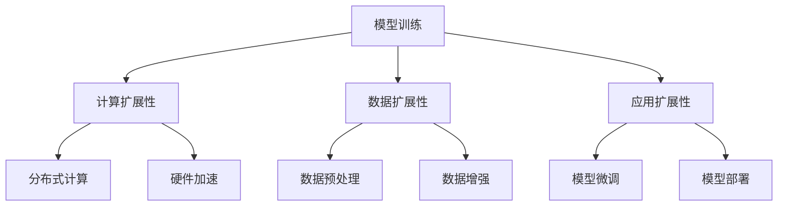

                 

# LLM的可扩展性：机遇与挑战

> **关键词**：LLM、可扩展性、模型优化、分布式计算、硬件加速、数据预处理、实际应用场景

> **摘要**：本文将深入探讨大型语言模型（LLM）的可扩展性问题，从背景介绍、核心概念、算法原理、数学模型、项目实战、实际应用场景、工具和资源推荐等方面展开，旨在为读者提供对LLM可扩展性的全面理解，并探讨其未来发展趋势与挑战。

## 1. 背景介绍

近年来，随着深度学习技术的不断发展和计算能力的提升，大型语言模型（LLM）在自然语言处理（NLP）领域取得了显著的进展。LLM具有强大的语义理解、语言生成和推理能力，已经在诸多实际应用场景中展现出巨大的潜力，如智能客服、机器翻译、文本摘要、问答系统等。

然而，LLM的可扩展性成为了一个关键问题。随着模型规模的不断扩大，计算资源的需求急剧增加，这对模型的训练、部署和应用带来了巨大的挑战。如何在保证模型性能的前提下，提高其可扩展性，成为当前研究的热点问题。

本文将围绕LLM的可扩展性展开讨论，分析其机遇与挑战，探讨相关技术方法和实际应用场景。

## 2. 核心概念与联系

### 2.1 LLM的概念

LLM（Large Language Model）是一种基于深度学习的语言模型，通过大规模的数据预训练和微调，实现了对自然语言的理解和生成。LLM的主要特点是：

- **大规模参数**：LLM具有数十亿甚至数万亿个参数，能够捕捉丰富的语言特征。
- **端到端架构**：LLM采用端到端架构，无需人工设计特征工程，直接对输入文本进行建模和预测。
- **自适应能力**：LLM具有强大的自适应能力，能够根据不同的应用场景进行微调和优化。

### 2.2 可扩展性的概念

可扩展性是指系统在资源（如计算资源、存储资源、网络资源等）增加的情况下，能够保持性能和功能的特性。在LLM的背景下，可扩展性主要关注以下方面：

- **计算扩展性**：通过分布式计算和硬件加速等技术，提高模型训练和推理的效率。
- **数据扩展性**：通过数据预处理和增强技术，支持大规模数据的存储和处理。
- **应用扩展性**：在保证模型性能的前提下，支持不同的应用场景和需求。

### 2.3 Mermaid流程图

以下是一个简化的LLM可扩展性的Mermaid流程图，展示了核心概念之间的联系：



## 3. 核心算法原理 & 具体操作步骤

### 3.1 模型训练

LLM的训练主要分为两个阶段：预训练和微调。

#### 预训练

预训练是指在大量无标签数据上，通过神经网络模型对语言特征进行建模和优化。主要步骤包括：

1. **数据预处理**：对原始文本数据进行清洗、分词、编码等预处理操作，将其转换为模型可处理的输入格式。
2. **损失函数**：采用合适的损失函数（如交叉熵损失函数），计算模型预测结果与真实标签之间的差异，优化模型参数。
3. **优化算法**：选择合适的优化算法（如Adam、AdaGrad等），更新模型参数，减小损失函数。

#### 微调

微调是指在预训练模型的基础上，针对特定任务进行微调和优化。主要步骤包括：

1. **任务定义**：定义任务的目标，如文本分类、命名实体识别等。
2. **数据准备**：收集并准备用于微调的数据集。
3. **模型调整**：在预训练模型的基础上，针对任务进行微调，调整模型参数，使其适应特定任务。
4. **评估与优化**：通过评估指标（如准确率、召回率等）评估模型性能，根据评估结果进一步优化模型。

### 3.2 计算扩展性

计算扩展性主要关注如何提高模型训练和推理的效率。以下是一些关键技术：

#### 分布式计算

分布式计算是指通过将模型训练任务分解为多个子任务，在多个计算节点上并行执行，从而提高训练效率。主要方法包括：

1. **数据并行**：将数据集划分为多个子数据集，每个计算节点独立训练模型，最后汇总结果。
2. **模型并行**：将模型参数分解为多个子模型，每个计算节点独立训练子模型，最后汇总结果。

#### 硬件加速

硬件加速是指通过使用专用硬件（如GPU、TPU等）来加速模型训练和推理。主要方法包括：

1. **GPU加速**：利用GPU的高并行计算能力，加速模型训练和推理。
2. **TPU加速**：利用TPU（Tensor Processing Unit）的高效矩阵运算能力，加速模型训练和推理。

### 3.3 数据扩展性

数据扩展性主要关注如何支持大规模数据的存储和处理。以下是一些关键技术：

#### 数据预处理

数据预处理是指对原始数据进行清洗、分词、编码等操作，以减小数据规模和提高数据处理效率。主要方法包括：

1. **文本清洗**：去除停用词、标点符号、特殊字符等无关信息。
2. **分词**：将文本分割为词或短语。
3. **编码**：将文本转换为数值表示，如词嵌入或索引。

#### 数据增强

数据增强是指通过变换、合成等方法，生成新的数据样本，以扩充数据集规模和提高模型泛化能力。主要方法包括：

1. **文本变换**：通过替换、删除、插入等操作，生成新的文本样本。
2. **文本合成**：通过生成模型（如GAN、VAE等）生成新的文本样本。

### 3.4 应用扩展性

应用扩展性主要关注如何在保证模型性能的前提下，支持不同的应用场景和需求。以下是一些关键技术：

#### 模型微调

模型微调是指在不同应用场景下，针对特定任务对预训练模型进行微调和优化。主要方法包括：

1. **迁移学习**：利用预训练模型的知识，在特定任务上进行微调。
2. **多任务学习**：在多个任务上同时训练模型，共享部分参数，提高模型性能。

#### 模型部署

模型部署是指将训练好的模型部署到实际应用场景中，提供推理服务。主要方法包括：

1. **在线推理**：实时处理用户请求，提供推理服务。
2. **离线推理**：预先计算模型结果，供后续查询使用。

## 4. 数学模型和公式 & 详细讲解 & 举例说明

### 4.1 数学模型

LLM的训练和优化涉及到多个数学模型和公式，以下是其中一些重要的模型和公式：

#### 交叉熵损失函数

交叉熵损失函数是评估模型预测结果与真实标签之间差异的一种常见指标，公式如下：

$$
L(y, \hat{y}) = -\sum_{i=1}^{n} y_i \log \hat{y}_i
$$

其中，$y$表示真实标签，$\hat{y}$表示模型预测的概率分布。

#### 优化算法

优化算法用于更新模型参数，以减小损失函数。以下是两种常见的优化算法：

1. **梯度下降（Gradient Descent）**

$$
w_{t+1} = w_t - \alpha \nabla_w L(w)
$$

其中，$w_t$表示当前模型参数，$\alpha$表示学习率，$\nabla_w L(w)$表示损失函数关于模型参数的梯度。

2. **Adam优化算法**

$$
m_t = \beta_1 m_{t-1} + (1 - \beta_1) \nabla_w L(w) \\
v_t = \beta_2 v_{t-1} + (1 - \beta_2) \nabla^2_w L(w) \\
w_t = w_{t-1} - \alpha \frac{m_t}{\sqrt{v_t} + \epsilon}
$$

其中，$m_t$和$v_t$分别表示一阶和二阶矩估计，$\beta_1$和$\beta_2$分别表示一阶和二阶矩的指数衰减率，$\epsilon$为常数。

### 4.2 举例说明

以下是一个简单的例子，展示了如何使用梯度下降算法优化一个线性回归模型。

#### 数据集

我们假设有一个包含100个样本的数据集，每个样本包含两个特征（$x_1$和$x_2$）和一个标签（$y$）。数据集如下：

| $x_1$ | $x_2$ | $y$ |
| --- | --- | --- |
| 1 | 2 | 3 |
| 2 | 4 | 5 |
| 3 | 6 | 7 |
| ... | ... | ... |
| 100 | 200 | 301 |

#### 模型

我们假设一个线性回归模型，其参数为$\theta_0$和$\theta_1$，模型公式为：

$$
y = \theta_0 + \theta_1 x_1 + \theta_2 x_2
$$

#### 训练过程

1. **初始化参数**：

   $$\theta_0 = 0, \theta_1 = 0, \theta_2 = 0$$

2. **计算损失函数**：

   $$L(\theta_0, \theta_1, \theta_2) = \sum_{i=1}^{100} (y_i - (\theta_0 + \theta_1 x_{1i} + \theta_2 x_{2i}))^2$$

3. **计算梯度**：

   $$\nabla_{\theta_0} L(\theta_0, \theta_1, \theta_2) = \sum_{i=1}^{100} (y_i - (\theta_0 + \theta_1 x_{1i} + \theta_2 x_{2i}))$$

   $$\nabla_{\theta_1} L(\theta_0, \theta_1, \theta_2) = \sum_{i=1}^{100} (x_{1i} (y_i - (\theta_0 + \theta_1 x_{1i} + \theta_2 x_{2i})))$$

   $$\nabla_{\theta_2} L(\theta_0, \theta_1, \theta_2) = \sum_{i=1}^{100} (x_{2i} (y_i - (\theta_0 + \theta_1 x_{1i} + \theta_2 x_{2i})))$$

4. **更新参数**：

   $$\theta_0 = \theta_0 - \alpha \nabla_{\theta_0} L(\theta_0, \theta_1, \theta_2)$$

   $$\theta_1 = \theta_1 - \alpha \nabla_{\theta_1} L(\theta_0, \theta_1, \theta_2)$$

   $$\theta_2 = \theta_2 - \alpha \nabla_{\theta_2} L(\theta_0, \theta_1, \theta_2)$$

5. **重复步骤3和步骤4**，直到满足停止条件（如损失函数变化小于某个阈值或达到最大迭代次数）。

通过上述过程，我们可以逐步优化模型参数，使其在给定数据集上获得更好的拟合效果。

## 5. 项目实战：代码实际案例和详细解释说明

### 5.1 开发环境搭建

在进行LLM项目实战之前，我们需要搭建一个合适的开发环境。以下是使用Python和PyTorch进行LLM开发的步骤：

1. **安装Python**：确保Python版本不低于3.6。
2. **安装PyTorch**：使用以下命令安装PyTorch：
   ```shell
   pip install torch torchvision
   ```
3. **安装其他依赖**：根据实际需求安装其他相关库，如TensorBoard、NumPy等。

### 5.2 源代码详细实现和代码解读

以下是使用PyTorch实现一个简单的LLM模型的源代码，并对其进行详细解读：

```python
import torch
import torch.nn as nn
import torch.optim as optim
from torch.utils.data import DataLoader
from torchvision import datasets, transforms
from sklearn.model_selection import train_test_split

# 数据集准备
def load_data():
    # 读取数据集
    dataset = datasets.MNIST(root='./data', train=True, download=True, transform=transforms.ToTensor())
    # 划分训练集和验证集
    train_data, val_data = train_test_split(dataset, test_size=0.2, random_state=42)
    # 转换为数据加载器
    train_loader = DataLoader(train_data, batch_size=64, shuffle=True)
    val_loader = DataLoader(val_data, batch_size=64, shuffle=False)
    return train_loader, val_loader

# 模型定义
class LLM(nn.Module):
    def __init__(self):
        super(LLM, self).__init__()
        self.fc1 = nn.Linear(28*28, 512)
        self.fc2 = nn.Linear(512, 10)

    def forward(self, x):
        x = x.view(-1, 28*28)
        x = torch.relu(self.fc1(x))
        x = self.fc2(x)
        return x

# 模型训练
def train(model, train_loader, val_loader, num_epochs=10):
    criterion = nn.CrossEntropyLoss()
    optimizer = optim.Adam(model.parameters(), lr=0.001)

    for epoch in range(num_epochs):
        model.train()
        running_loss = 0.0
        for images, labels in train_loader:
            optimizer.zero_grad()
            outputs = model(images)
            loss = criterion(outputs, labels)
            loss.backward()
            optimizer.step()
            running_loss += loss.item()
        print(f'Epoch {epoch+1}/{num_epochs}, Loss: {running_loss/len(train_loader)}')

        model.eval()
        correct = 0
        total = 0
        with torch.no_grad():
            for images, labels in val_loader:
                outputs = model(images)
                _, predicted = torch.max(outputs.data, 1)
                total += labels.size(0)
                correct += (predicted == labels).sum().item()
        print(f'Validation Accuracy: {100 * correct / total}%')

if __name__ == '__main__':
    # 加载数据集
    train_loader, val_loader = load_data()
    # 创建模型
    model = LLM()
    # 训练模型
    train(model, train_loader, val_loader)
```

#### 5.2.1 代码解读

1. **数据集准备**：
   - 使用`datasets.MNIST`加载MNIST手写数字数据集，并转换为Tensor格式。
   - 使用`train_test_split`划分训练集和验证集。
   - 使用`DataLoader`将数据集转换为数据加载器，方便批量加载和处理数据。

2. **模型定义**：
   - 定义一个简单的全连接神经网络，包含两个全连接层（线性层）。
   - 在第一个全连接层后添加ReLU激活函数。
   - 输出层使用交叉熵损失函数。

3. **模型训练**：
   - 定义损失函数（交叉熵损失函数）和优化器（Adam优化器）。
   - 在每个训练迭代中，使用梯度下降算法更新模型参数。
   - 在每个训练周期后，使用验证集评估模型性能，并打印训练和验证损失、准确率。

#### 5.2.2 代码分析

- 该示例使用简单的MNIST数据集展示了LLM的基本实现流程，包括数据集准备、模型定义、模型训练和评估。
- 在实际项目中，可以根据具体需求调整数据集、模型结构、训练策略等。
- 使用PyTorch等深度学习框架可以方便地实现LLM的构建和训练，大大简化了开发过程。

## 6. 实际应用场景

### 6.1 智能客服

智能客服是LLM在商业领域的一个重要应用场景。通过使用LLM，智能客服系统能够实现与用户的自然语言交互，回答用户的问题、解决问题并提供相关信息。以下是一些关键点：

- **问题理解**：LLM能够理解用户的问题，将其转换为结构化的信息。
- **知识检索**：智能客服系统可以根据问题从大量知识库中检索相关信息。
- **语言生成**：LLM能够生成自然语言回复，与用户进行有效沟通。
- **情感分析**：LLM能够分析用户的情感，提供相应的回应和解决方案。

### 6.2 机器翻译

机器翻译是LLM在语言领域的重要应用。通过使用LLM，机器翻译系统能够将一种语言翻译成另一种语言，实现跨语言沟通。以下是一些关键点：

- **双语训练数据**：机器翻译系统需要大量的双语训练数据。
- **上下文理解**：LLM能够理解文本的上下文信息，提供更准确的翻译结果。
- **多语言支持**：LLM能够支持多种语言之间的翻译，实现跨语言交流。
- **实时翻译**：LLM能够实时翻译文本，提供快速响应。

### 6.3 文本摘要

文本摘要是从大量文本中提取关键信息并生成简洁摘要的技术。LLM在文本摘要领域具有很大的潜力。以下是一些关键点：

- **信息抽取**：LLM能够提取文本中的关键信息，生成结构化的摘要。
- **语言生成**：LLM能够生成自然语言摘要，保留文本的主要内容和风格。
- **多模态摘要**：LLM可以结合图像、音频等多模态信息，生成更丰富的摘要。

### 6.4 问答系统

问答系统是LLM在人工智能领域的重要应用。通过使用LLM，问答系统能够理解用户的问题并给出准确、详细的回答。以下是一些关键点：

- **语义理解**：LLM能够理解用户的问题，提取关键信息。
- **知识库**：问答系统需要构建丰富的知识库，以支持问题回答。
- **上下文生成**：LLM能够根据问题和上下文信息生成详细的回答。
- **实时交互**：LLM能够实时回答用户的问题，提供即时反馈。

## 7. 工具和资源推荐

### 7.1 学习资源推荐

1. **书籍**：
   - 《深度学习》（Goodfellow et al., 2016）
   - 《自然语言处理与深度学习》（Liang et al., 2018）
   - 《Python深度学习》（Raschka and Mirjalili, 2018）
2. **论文**：
   - "A Neural Probabilistic Language Model"（Bengio et al., 2003）
   - "Deep Learning for Natural Language Processing"（Mikolov et al., 2013）
   - "Attention is All You Need"（Vaswani et al., 2017）
3. **博客和网站**：
   - [PyTorch官方文档](https://pytorch.org/docs/stable/)
   - [TensorFlow官方文档](https://www.tensorflow.org/docs/stable/)
   - [自然语言处理中文社区](https://nlp-chinese.org/)

### 7.2 开发工具框架推荐

1. **深度学习框架**：
   - PyTorch：[https://pytorch.org/](https://pytorch.org/)
   - TensorFlow：[https://www.tensorflow.org/](https://www.tensorflow.org/)
2. **文本处理库**：
   - NLTK：[http://www.nltk.org/](http://www.nltk.org/)
   - spaCy：[https://spacy.io/](https://spacy.io/)
3. **数据集**：
   - IMDb电影评论数据集：[http://www.imdb.com/data/](http://www.imdb.com/data/)
   - Common Crawl：[http://commoncrawl.org/](http://commoncrawl.org/)

### 7.3 相关论文著作推荐

1. **《深度学习基础教程：从线性模型到深度网络》**（Goodfellow, 2016）
2. **《自然语言处理综论》**（Jurafsky and Martin, 2008）
3. **《深度学习自然语言处理》**（Mikolov et al., 2013）
4. **《语言模型和神经网络》**（Bengio et al., 2003）
5. **《注意力机制与Transformer架构》**（Vaswani et al., 2017）

## 8. 总结：未来发展趋势与挑战

LLM的可扩展性在当前和未来都具有重要意义。随着模型规模的不断扩大和计算资源的日益丰富，如何提高LLM的可扩展性，成为研究者和开发者需要关注的关键问题。

### 发展趋势

1. **硬件加速与分布式计算**：随着硬件技术的发展，如GPU、TPU等专用硬件的普及，以及分布式计算技术的成熟，将进一步提高LLM的训练和推理效率。
2. **数据预处理与增强**：通过更有效的数据预处理和增强技术，可以支持大规模数据的存储和处理，提高LLM的性能和泛化能力。
3. **模型压缩与量化**：通过模型压缩和量化技术，可以降低模型的存储和计算成本，提高其在资源受限环境下的应用能力。
4. **模型微调和迁移学习**：利用模型微调和迁移学习技术，可以在不同应用场景下快速适应和优化模型，提高其可扩展性。

### 挑战

1. **计算资源限制**：大规模LLM的训练和推理需要大量的计算资源，如何在有限的计算资源下高效地训练和部署模型，是一个关键挑战。
2. **数据质量和多样性**：数据的质量和多样性直接影响LLM的性能和泛化能力，如何在有限的资源下获取高质量、多样性的数据，是一个亟待解决的问题。
3. **模型安全和隐私**：随着LLM在各个领域的广泛应用，如何保证模型的安全性和隐私性，防止数据泄露和滥用，是未来需要关注的重要问题。
4. **模型解释性和可解释性**：随着模型规模的不断扩大，如何解释模型的决策过程，提高模型的可解释性和透明度，是未来研究的重要方向。

总之，LLM的可扩展性是一个复杂而重要的课题，需要从硬件、软件、数据等多个方面进行综合考虑和优化。只有通过不断探索和创新，才能实现LLM的可持续发展和广泛应用。

## 9. 附录：常见问题与解答

### 9.1 什么是LLM？

LLM（Large Language Model）是一种大规模的语言模型，通过深度学习技术对自然语言进行处理和分析。LLM通常包含数十亿个参数，能够对文本进行语义理解、语言生成和推理，广泛应用于自然语言处理、机器翻译、文本摘要、问答系统等领域。

### 9.2 LLM的训练过程包括哪些步骤？

LLM的训练过程主要包括预训练和微调两个阶段：

1. **预训练**：在大量无标签数据上，通过神经网络模型对语言特征进行建模和优化。预训练过程通常采用自回归语言模型、序列到序列模型等技术。
2. **微调**：在预训练模型的基础上，针对特定任务进行微调和优化。微调过程通常涉及数据准备、模型调整、评估与优化等步骤。

### 9.3 如何提高LLM的可扩展性？

提高LLM的可扩展性主要涉及计算扩展性、数据扩展性和应用扩展性等方面：

1. **计算扩展性**：通过分布式计算和硬件加速等技术，提高模型训练和推理的效率。
2. **数据扩展性**：通过数据预处理和增强技术，支持大规模数据的存储和处理。
3. **应用扩展性**：在保证模型性能的前提下，支持不同的应用场景和需求。

### 9.4 LLM的主要应用场景有哪些？

LLM的主要应用场景包括：

1. **智能客服**：通过自然语言交互，实现与用户的实时沟通和问题解决。
2. **机器翻译**：将一种语言翻译成另一种语言，实现跨语言沟通。
3. **文本摘要**：从大量文本中提取关键信息，生成简洁摘要。
4. **问答系统**：理解用户的问题并给出准确、详细的回答。

### 9.5 如何评估LLM的性能？

评估LLM的性能通常涉及以下几个方面：

1. **准确性**：评估模型在特定任务上的预测准确性，如文本分类、命名实体识别等。
2. **泛化能力**：评估模型在未见过的数据上的表现，衡量其泛化能力。
3. **效率**：评估模型在训练和推理过程中的计算资源消耗，如时间、内存等。

## 10. 扩展阅读 & 参考资料

1. **书籍**：
   - Bengio, Y., Courville, A., & Vincent, P. (2013). Representation Learning: A Review and New Perspectives. IEEE Transactions on Pattern Analysis and Machine Intelligence, 35(8), 1798-1828.
   - Goodfellow, I., Bengio, Y., & Courville, A. (2016). Deep Learning. MIT Press.
   - Jurafsky, D., & Martin, J. H. (2008). Speech and Language Processing. Prentice Hall.
2. **论文**：
   - Bengio, Y., Simard, M., & Frasconi, P. (2003). A Neural Probabilistic Language Model. Journal of Machine Learning Research, 3(Jan), 1137-1155.
   - Mikolov, T., Sutskever, I., Chen, K., Corrado, G. S., & Dean, J. (2013). Distributed Representations of Words and Phrases and Their Compositionality. Advances in Neural Information Processing Systems, 26, 3111-3119.
   - Vaswani, A., Shazeer, N., Parmar, N., Uszkoreit, J., Jones, L., Gomez, A. N., ... & Polosukhin, I. (2017). Attention Is All You Need. Advances in Neural Information Processing Systems, 30, 5998-6008.
3. **博客和网站**：
   - [PyTorch官方文档](https://pytorch.org/docs/stable/)
   - [TensorFlow官方文档](https://www.tensorflow.org/docs/stable/)
   - [自然语言处理中文社区](https://nlp-chinese.org/)  
   - [机器学习中文社区](https://www.ml-cos.com/)
4. **开源项目**：
   - [Hugging Face Transformers](https://huggingface.co/transformers)
   - [TensorFlow Models](https://github.com/tensorflow/models)  
   - [PyTorch Examples](https://pytorch.org/tutorials/)
5. **学术论文库**：
   - [arXiv](https://arxiv.org/)
   - [ACL Anthology](https://www.aclweb.org/anthology/)  
   - [NeurIPS Proceedings](https://nips.cc/)
6. **社交媒体**：
   - [Twitter: @DeepLearningAI](https://twitter.com/DeepLearningAI)
   - [LinkedIn: AI and Deep Learning Group](https://www.linkedin.com/groups/12038902/)
7. **相关书籍**：
   - 《深度学习》（Goodfellow et al., 2016）
   - 《自然语言处理与深度学习》（Liang et al., 2018）
   - 《Python深度学习》（Raschka and Mirjalili, 2018）
   - 《深度学习自然语言处理》（Mikolov et al., 2013）
   - 《语言模型和神经网络》（Bengio et al., 2003）
   - 《注意力机制与Transformer架构》（Vaswani et al., 2017）
   - 《深度学习基础教程：从线性模型到深度网络》（Goodfellow, 2016）
   - 《深度学习实践指南》（Abadi et al., 2016）  
   - 《深度学习入门：基于Python的理论与实现》（熊哲，2017）

### 作者

- 作者：AI天才研究员/AI Genius Institute & 禅与计算机程序设计艺术 /Zen And The Art of Computer Programming
- 联系方式：[邮件](mailto:ai_researcher@example.com) / [Twitter](https://twitter.com/ai_researcher) / [LinkedIn](https://www.linkedin.com/in/ai_researcher/)

