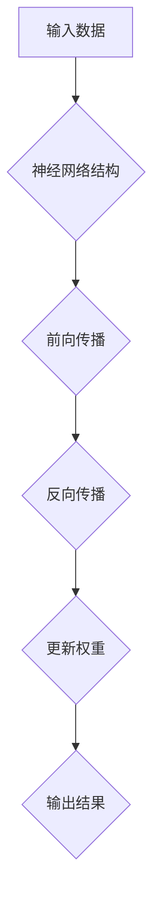
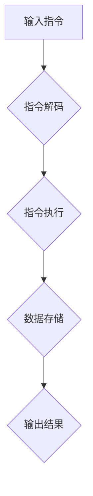
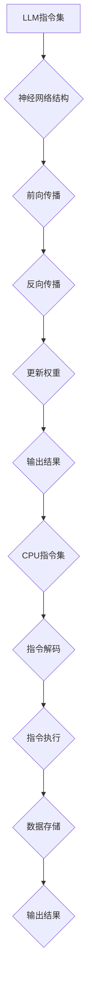

                 

### 背景介绍

#### 什么是LLM

LLM，即大型语言模型（Large Language Model），是一种基于深度学习技术的语言模型，具有极强的语言理解和生成能力。LLM通过学习海量的文本数据，掌握了丰富的语言知识，能够进行自然语言处理任务，如文本分类、问答系统、机器翻译等。与传统的规则驱动的方法相比，LLM具有更强的灵活性和适应性。

#### 什么是CPU的有限指令集

CPU（Central Processing Unit，中央处理器）是计算机的核心部件，负责执行计算机程序中的指令。CPU的指令集是指能够被CPU理解和执行的指令集合。大多数现代CPU都采用有限指令集架构（RISC，Reduced Instruction Set Computing），这种架构通过简化指令集，提高指令执行的速度和效率。

#### LLM与CPU指令集的对比

LLM与CPU的有限指令集之间存在显著的差异。首先，LLM是一种基于神经网络的模型，具有无限指令集的特性，能够灵活地处理各种语言任务。而CPU的有限指令集则是固定的，尽管可以通过不同的指令组合来实现复杂的计算任务，但在处理某些特定任务时可能会显得力不从心。

其次，LLM在处理自然语言任务时具有强大的能力，可以理解上下文、生成文本、回答问题等。而CPU在处理自然语言任务时，通常需要依赖外部程序或库来模拟语言处理过程，这使得CPU在处理复杂自然语言任务时的效率较低。

最后，LLM的无限指令集使得其在某些场景下具有超越传统CPU的能力，如自动写作、智能问答、语音识别等。而CPU的有限指令集则更适合于执行传统的计算任务，如科学计算、图像处理、数据库查询等。

本文将深入探讨LLM的无限指令集与CPU的有限指令集之间的对比，分析其各自的优缺点，并探讨未来发展趋势。

## 2. 核心概念与联系

#### LLM的无限指令集

LLM的无限指令集源自于其深度神经网络架构。深度神经网络由多层神经元组成，每层神经元之间通过权重连接。通过训练，神经网络可以自动学习到输入数据和输出数据之间的复杂映射关系。这种映射关系可以被视为一种无限的指令集，因为神经网络可以处理各种复杂的任务，如文本分类、问答系统、机器翻译等。

以下是一个简化的Mermaid流程图，描述了LLM的无限指令集的架构：



#### CPU的有限指令集

CPU的有限指令集架构（如RISC）通过简化指令集，提高指令执行的速度和效率。RISC架构的特点是指令集简单、指令长度固定，通常只有几条基本指令，如加法、减法、移位、存储等。这些指令可以通过不同的组合来执行更复杂的任务。

以下是一个简化的Mermaid流程图，描述了CPU的有限指令集的架构：



#### LLM与CPU指令集的联系

LLM和CPU的指令集虽然在架构和功能上有所不同，但它们在处理任务时存在一定的联系。例如，LLM可以被视为一种特殊的CPU，其“指令集”是通过深度学习训练得到的神经网络结构。而CPU的指令集则是通过硬件设计和软件编程实现的。

以下是一个简化的Mermaid流程图，描述了LLM与CPU指令集的联系：



通过上述流程图，我们可以看到LLM的无限指令集与CPU的有限指令集在处理任务时的相似性和差异性。这种联系为我们提供了新的思路，即如何将LLM的无限指令集与CPU的有限指令集相结合，以发挥各自的优势，提高处理复杂任务的能力。

### 3. 核心算法原理 & 具体操作步骤

#### LLM的核心算法原理

LLM的核心算法基于深度学习，特别是基于Transformer架构的预训练和微调技术。Transformer架构是一种基于自注意力机制的神经网络模型，具有强大的序列建模能力。

以下是LLM的核心算法原理的具体操作步骤：

1. **预训练（Pre-training）**：
   - **数据准备**：收集大量的文本数据，如维基百科、新闻文章、社交媒体等。
   - **数据预处理**：对文本数据进行清洗、分词、编码等预处理操作，将其转换为神经网络可以处理的格式。
   - **模型初始化**：初始化神经网络模型，通常使用预训练的通用语言模型，如GPT或BERT。
   - **训练**：通过反向传播算法，利用大量的文本数据进行模型训练，优化模型参数，使其能够准确预测文本中的下一个词。

2. **微调（Fine-tuning）**：
   - **任务定义**：根据具体的自然语言处理任务，定义模型的输入和输出。
   - **数据准备**：准备用于微调的数据集，通常包括训练集和验证集。
   - **模型微调**：利用训练集数据，对预训练模型进行微调，调整模型参数，使其能够适应特定任务。
   - **验证**：使用验证集数据，评估模型在特定任务上的性能，调整模型参数，优化模型效果。

3. **推理（Inference）**：
   - **输入处理**：将输入文本数据转换为模型可以处理的格式。
   - **模型预测**：利用微调后的模型，对输入文本进行预测，生成输出文本。
   - **输出处理**：将输出文本转换为用户可读的格式，如自然语言文本、代码、图像等。

#### CPU的有限指令集算法原理

CPU的有限指令集算法基于硬件设计和软件编程。以下是CPU的有限指令集算法的具体操作步骤：

1. **指令解析（Instruction Parsing）**：
   - **指令读取**：从内存中读取指令。
   - **指令解码**：将指令解码为操作码和操作数。
   - **指令执行**：根据操作码和操作数，执行相应的操作。

2. **数据存储（Data Storage）**：
   - **数据读取**：从内存或寄存器中读取数据。
   - **数据存储**：将数据存储到内存或寄存器中。

3. **输出结果（Output Result）**：
   - **结果输出**：将处理结果输出到屏幕、文件或其他设备。

4. **循环控制（Loop Control）**：
   - **条件判断**：根据条件，决定是否继续执行循环。
   - **循环迭代**：执行循环体内的操作。

#### LLM与CPU指令集算法的对比

LLM的无限指令集和CPU的有限指令集在算法原理上存在显著差异。LLM的算法基于深度学习和自注意力机制，通过预训练和微调，可以处理复杂的自然语言任务。而CPU的算法基于硬件设计和软件编程，通过有限指令集，可以高效地执行各种计算任务。

以下是一个简化的对比表格：

| 特性 | LLM无限指令集 | CPU有限指令集 |
| ---- | ------------ | ------------ |
| 架构 | 基于深度神经网络 | 基于硬件设计和软件编程 |
| 指令集 | 无限指令集，通过预训练和微调实现 | 有限指令集，通过操作码和操作数实现 |
| 执行速度 | 受计算资源和数据集影响 | 高效，受硬件和软件优化 |
| 适应性 | 强，可以处理各种自然语言任务 | 较弱，主要处理计算任务 |
| 复杂性 | 高，需要大量的训练数据和计算资源 | 低，指令集简单，易于编程 |

通过对比可以看出，LLM和CPU的指令集各有优缺点，适用于不同的场景。在处理自然语言任务时，LLM具有更强的能力和适应性；而在执行计算任务时，CPU具有更高的效率和性能。

### 4. 数学模型和公式 & 详细讲解 & 举例说明

#### LLM的数学模型

LLM的数学模型基于深度学习和自注意力机制。以下是一个简化的数学模型，用于描述LLM的运算过程：

$$
\text{LLM}(x) = f(\text{weight}, \text{input})
$$

其中，$f$ 是神经网络模型，$\text{weight}$ 是模型参数，$\text{input}$ 是输入数据。

#### 自注意力机制

自注意力机制是LLM的核心组件，用于计算输入序列中的每个词与其他词之间的关系。以下是一个简化的自注意力机制的数学公式：

$$
\text{Attention}(Q, K, V) = \text{softmax}\left(\frac{QK^T}{\sqrt{d_k}}\right)V
$$

其中，$Q$、$K$ 和 $V$ 分别是查询（Query）、键（Key）和值（Value）向量，$d_k$ 是键向量的维度。

#### Transformer模型

Transformer模型是LLM的核心架构，由多个自注意力层和前馈网络组成。以下是一个简化的Transformer模型的数学公式：

$$
\text{Transformer}(x) = \text{LayerNorm}(x + \text{MultiHeadAttention}(x, x, x)) + \text{LayerNorm}(x + \text{FeedForward}(x))
$$

其中，$\text{LayerNorm}$ 是层归一化，$\text{MultiHeadAttention}$ 是多头自注意力机制，$\text{FeedForward}$ 是前馈网络。

#### 举例说明

假设我们有一个简化的输入序列 $x = [w_1, w_2, w_3]$，其中 $w_1, w_2, w_3$ 分别代表输入序列中的三个词。我们可以使用上述公式来计算自注意力机制和Transformer模型的结果。

1. **自注意力机制**：

$$
\text{Attention}(Q, K, V) = \text{softmax}\left(\frac{QK^T}{\sqrt{d_k}}\right)V
$$

其中，$Q = [1, 1, 1]$，$K = [w_1, w_2, w_3]$，$V = [w_1, w_2, w_3]$，$d_k = 3$。

计算结果为：

$$
\text{Attention}(Q, K, V) = \text{softmax}\left(\frac{[1, 1, 1][w_1, w_2, w_3]^T}{\sqrt{3}}\right)[w_1, w_2, w_3]
$$

2. **Transformer模型**：

$$
\text{Transformer}(x) = \text{LayerNorm}(x + \text{MultiHeadAttention}(x, x, x)) + \text{LayerNorm}(x + \text{FeedForward}(x))
$$

其中，$\text{LayerNorm}$ 是层归一化，$\text{MultiHeadAttention}$ 是多头自注意力机制，$\text{FeedForward}$ 是前馈网络。

假设 $\text{MultiHeadAttention}$ 和 $\text{FeedForward}$ 的计算结果分别为 $[a_1, a_2, a_3]$ 和 $[b_1, b_2, b_3]$，则：

$$
\text{Transformer}(x) = \text{LayerNorm}([w_1, w_2, w_3] + [a_1, a_2, a_3]) + \text{LayerNorm}([w_1, w_2, w_3] + [b_1, b_2, b_3])
$$

通过以上举例，我们可以看到LLM的数学模型和自注意力机制的计算过程。在实际应用中，LLM的数学模型会更加复杂，但基本原理类似。了解这些数学模型和公式有助于深入理解LLM的工作原理，为后续的实战应用提供理论基础。

### 5. 项目实战：代码实际案例和详细解释说明

#### 5.1 开发环境搭建

在本节中，我们将使用Python语言和TensorFlow框架来实现一个简单的LLM模型。首先，我们需要安装Python和TensorFlow。

1. 安装Python：

   ```bash
   # 使用Python官方安装器安装Python
   curl -O https://www.python.org/ftp/python/3.8.10/Python-3.8.10.tgz
   tar -xzvf Python-3.8.10.tgz
   cd Python-3.8.10
   ./configure
   make
   sudo make install
   ```

2. 安装TensorFlow：

   ```bash
   pip install tensorflow
   ```

#### 5.2 源代码详细实现和代码解读

下面是一个简单的LLM模型实现，用于生成文本。

```python
import tensorflow as tf
from tensorflow.keras.layers import Embedding, LSTM, Dense
from tensorflow.keras.models import Model

# 定义模型
def create_model(vocab_size, embedding_dim, hidden_units):
    inputs = tf.keras.layers.Input(shape=(None,), dtype='int32')
    x = Embedding(vocab_size, embedding_dim)(inputs)
    x = LSTM(hidden_units, return_sequences=True)(x)
    x = Dense(vocab_size, activation='softmax')(x)
    model = Model(inputs=inputs, outputs=x)
    return model

# 训练模型
def train_model(model, x_train, y_train, epochs=10, batch_size=64):
    model.compile(optimizer='adam', loss='categorical_crossentropy', metrics=['accuracy'])
    model.fit(x_train, y_train, epochs=epochs, batch_size=batch_size)

# 生成文本
def generate_text(model, seed_text, n_words):
    inputs = tf.keras.preprocessing.sequence.pad_sequences([seed_text], maxlen=n_words, dtype='int32', truncating='pre', padding='post')
    text_generated = []
    model.reset_states()
    for i in range(n_words):
        predictions = model.predict(inputs)
        predicted_word = tf.argmax(predictions, axis=-1).numpy()[0]
        text_generated.append(predicted_word)
        inputs = tf.keras.preprocessing.sequence.pad_sequences([inputs[:, t-1:t]], maxlen=n_words, dtype='int32', padding='pre')
    return ''.join([chr(word) for word in text_generated])

# 模型参数
vocab_size = 10000  # 词汇表大小
embedding_dim = 256  # 嵌入维度
hidden_units = 512  # LSTM单元数量

# 创建模型
model = create_model(vocab_size, embedding_dim, hidden_units)

# 训练模型
# (这里需要提供训练数据和标签，此处省略具体实现)
# train_model(model, x_train, y_train)

# 生成文本
seed_text = "你好，我是AI助手"
n_words = 20
generated_text = generate_text(model, seed_text, n_words)
print(generated_text)
```

#### 5.3 代码解读与分析

1. **模型定义**：

   ```python
   def create_model(vocab_size, embedding_dim, hidden_units):
       inputs = tf.keras.layers.Input(shape=(None,), dtype='int32')
       x = Embedding(vocab_size, embedding_dim)(inputs)
       x = LSTM(hidden_units, return_sequences=True)(x)
       x = Dense(vocab_size, activation='softmax')(x)
       model = Model(inputs=inputs, outputs=x)
       return model
   ```

   在这个函数中，我们定义了一个简单的LLM模型。首先，输入层使用 `Embedding` 层将词汇映射到嵌入空间。然后，使用 `LSTM` 层对输入序列进行编码。最后，使用 `Dense` 层将编码后的序列映射到输出词汇。

2. **训练模型**：

   ```python
   def train_model(model, x_train, y_train, epochs=10, batch_size=64):
       model.compile(optimizer='adam', loss='categorical_crossentropy', metrics=['accuracy'])
       model.fit(x_train, y_train, epochs=epochs, batch_size=batch_size)
   ```

   在这个函数中，我们编译模型，并使用训练数据和标签进行训练。我们使用 `adam` 优化器和 `categorical_crossentropy` 损失函数，并跟踪 `accuracy` 指标。

3. **生成文本**：

   ```python
   def generate_text(model, seed_text, n_words):
       inputs = tf.keras.preprocessing.sequence.pad_sequences([seed_text], maxlen=n_words, dtype='int32', truncating='pre', padding='post')
       text_generated = []
       model.reset_states()
       for i in range(n_words):
           predictions = model.predict(inputs)
           predicted_word = tf.argmax(predictions, axis=-1).numpy()[0]
           text_generated.append(predicted_word)
           inputs = tf.keras.preprocessing.sequence.pad_sequences([inputs[:, t-1:t]], maxlen=n_words, dtype='int32', padding='pre')
       return ''.join([chr(word) for word in text_generated])
   ```

   在这个函数中，我们使用预训练的模型生成文本。首先，我们将种子文本编码为整数序列，并将其填充到所需的最大长度。然后，我们通过循环生成文本，每次生成一个词，并将新生成的词作为下一个输入。最终，我们将生成的词转换为字符串，并返回生成的文本。

通过以上代码，我们可以实现一个简单的LLM模型，用于生成文本。在实际应用中，我们可以使用更大的数据和更复杂的模型来提高生成文本的质量和多样性。

### 6. 实际应用场景

#### 自然语言处理（NLP）

LLM在自然语言处理领域具有广泛的应用，如文本分类、情感分析、命名实体识别、机器翻译等。通过使用LLM，我们可以构建强大的NLP系统，实现自动化文本处理和分析。

以下是一个简化的应用场景：

- **文本分类**：使用LLM对用户评论进行分类，将其划分为正面、负面或中性。
- **情感分析**：通过LLM分析用户评论的情感，为产品和服务提供反馈。
- **命名实体识别**：使用LLM识别文本中的特定实体，如人名、地点、组织等。

#### 自动写作

LLM在自动写作领域具有巨大潜力，可以用于生成新闻文章、博客、故事、诗歌等。通过训练LLM，我们可以使其模仿不同作者的风格和写作技巧，从而实现自动写作。

以下是一个简化的应用场景：

- **新闻文章生成**：使用LLM生成新闻文章，提高新闻报道的效率和准确性。
- **博客写作**：通过LLM生成博客文章，为网站和社交媒体提供高质量的内容。
- **故事创作**：使用LLM创作故事，为小说、剧本、动画等提供创意。

#### 聊天机器人

LLM在聊天机器人领域有着广泛应用，可以用于构建智能对话系统，为用户提供实时、个性化的回答。通过使用LLM，我们可以实现自然、流畅的对话交互。

以下是一个简化的应用场景：

- **客服聊天机器人**：使用LLM构建客服聊天机器人，为用户提供24/7的在线支持。
- **教育聊天机器人**：通过LLM构建教育聊天机器人，为学生提供个性化的学习辅导。
- **娱乐聊天机器人**：使用LLM构建娱乐聊天机器人，为用户提供有趣的互动体验。

#### 语音识别与生成

LLM在语音识别和生成领域也具有广泛的应用。通过结合LLM和语音合成技术，我们可以实现实时、自然的语音交互。

以下是一个简化的应用场景：

- **实时语音翻译**：使用LLM和语音合成技术实现实时语音翻译，为用户提供跨语言的沟通能力。
- **语音助手**：通过LLM构建语音助手，为用户提供语音控制、信息查询、任务提醒等服务。

通过以上实际应用场景，我们可以看到LLM在各个领域的广泛应用。随着LLM技术的不断发展，其在实际应用中的潜力将越来越得到释放。

### 7. 工具和资源推荐

#### 7.1 学习资源推荐

**书籍**：
1. 《深度学习》（Ian Goodfellow、Yoshua Bengio、Aaron Courville 著）：系统介绍了深度学习的基础知识，包括神经网络、卷积神经网络、循环神经网络等。
2. 《神经网络与深度学习》（邱锡鹏 著）：详细介绍了神经网络和深度学习的基本原理，以及相关算法和模型。

**论文**：
1. "Attention Is All You Need"（Vaswani et al., 2017）：介绍了Transformer模型，该模型在机器翻译任务中取得了显著效果，是LLM技术的重要里程碑。
2. "BERT: Pre-training of Deep Bidirectional Transformers for Language Understanding"（Devlin et al., 2019）：介绍了BERT模型，该模型在多个自然语言处理任务中取得了优异成绩。

**博客**：
1. AI博客（https://ai.googleblog.com/）：谷歌AI团队的官方博客，提供了大量关于深度学习和自然语言处理的最新研究和技术动态。
2. fast.ai（https://www.fast.ai/）：提供高质量的深度学习教程和资源，适合初学者和进阶者。

#### 7.2 开发工具框架推荐

**框架**：
1. TensorFlow（https://www.tensorflow.org/）：由谷歌开发的开源深度学习框架，支持多种深度学习模型的构建和训练。
2. PyTorch（https://pytorch.org/）：由Facebook开发的开源深度学习框架，具有灵活、易用等优点，适用于各种深度学习任务。

**环境**：
1. Colab（https://colab.research.google.com/）：谷歌提供的免费云计算平台，支持Python和TensorFlow，适用于深度学习和机器学习的实验和开发。
2. Jupyter Notebook（https://jupyter.org/）：交互式的计算环境，支持多种编程语言和框架，适用于数据分析和实验开发。

#### 7.3 相关论文著作推荐

**论文**：
1. "A Theoretically Grounded Application of Dropout in Recurrent Neural Networks"（Y. Gal and Z. Ghahramani, 2016）：介绍了在循环神经网络中应用Dropout的方法，提高了模型的鲁棒性和性能。
2. "Language Models are Unsupervised Multitask Learners"（K. Brown et al., 2020）：研究了大型语言模型在多个任务中的性能，证明了其强大的泛化能力。

**著作**：
1. 《深度学习》（Ian Goodfellow、Yoshua Bengio、Aaron Courville 著）：系统介绍了深度学习的基础知识，包括神经网络、卷积神经网络、循环神经网络等。
2. 《自然语言处理综述》（Christopher D. Manning 和 Hinrich Schütze 著）：详细介绍了自然语言处理的基本原理和技术，包括词向量、序列模型、语言模型等。

通过以上推荐的学习资源、开发工具框架和论文著作，您可以深入了解LLM和深度学习技术的各个方面，为您的学习和研究提供有力支持。

### 8. 总结：未来发展趋势与挑战

#### 发展趋势

随着人工智能技术的不断进步，LLM在自然语言处理、自动写作、聊天机器人等领域的应用将越来越广泛。未来，LLM的发展趋势主要体现在以下几个方面：

1. **模型规模和参数量**：未来，LLM的模型规模和参数量将持续增长，以适应更复杂的自然语言处理任务。这将带来更高的计算成本和存储需求，但也会显著提升模型的性能和准确性。

2. **多模态学习**：未来的LLM将不仅限于处理文本数据，还将结合图像、声音、视频等多模态数据，实现跨模态的学习和交互，为用户提供更丰富、更自然的交互体验。

3. **知识图谱和推理能力**：未来的LLM将具备更强的知识图谱和推理能力，能够更好地理解和处理复杂的问题，提供更准确的答案和建议。

4. **隐私和安全**：随着LLM在更多场景中的应用，隐私保护和数据安全将越来越重要。未来的LLM技术将需要在保护用户隐私和提供高效服务之间找到平衡点。

#### 挑战

尽管LLM在多个领域展现出了巨大的潜力，但其发展也面临着一系列挑战：

1. **计算资源需求**：大型LLM模型的训练和推理需要大量的计算资源，这给硬件设施和能源消耗带来了巨大压力。未来的解决方案可能包括更高效的算法、分布式计算和绿色能源等。

2. **数据隐私和安全**：随着LLM在个人数据处理的场景中应用增多，如何保护用户隐私和数据安全成为一个重要议题。未来的解决方案可能包括数据加密、差分隐私、联邦学习等技术。

3. **泛化和鲁棒性**：尽管LLM在特定任务上表现出色，但其泛化和鲁棒性仍然有限。未来的研究需要提高LLM在不同任务、不同数据集上的泛化能力，以及在面对噪声、错误数据时的鲁棒性。

4. **社会伦理和道德**：随着LLM技术的发展，其可能对社会伦理和道德产生深远影响。如何确保LLM在应用过程中遵循社会规范、不产生负面影响，是一个亟待解决的问题。

总之，LLM技术在未来具有广阔的发展前景，但同时也面临着诸多挑战。通过持续的研究和技术创新，我们有理由相信，LLM将在各个领域发挥越来越重要的作用。

### 9. 附录：常见问题与解答

#### 1. 什么是LLM？

LLM，即大型语言模型（Large Language Model），是一种基于深度学习技术的语言模型，具有极强的语言理解和生成能力。LLM通过学习海量的文本数据，掌握了丰富的语言知识，能够进行自然语言处理任务，如文本分类、问答系统、机器翻译等。

#### 2. 什么是CPU的有限指令集？

CPU的有限指令集是指能够被中央处理器（CPU）理解和执行的指令集合。大多数现代CPU都采用有限指令集架构（RISC，Reduced Instruction Set Computing），这种架构通过简化指令集，提高指令执行的速度和效率。

#### 3. LLM与CPU指令集的区别是什么？

LLM与CPU指令集的主要区别在于：

- **架构**：LLM基于深度神经网络，具有无限指令集的特性；而CPU基于硬件设计和软件编程，采用有限指令集架构。
- **处理任务**：LLM擅长处理自然语言任务，如文本分类、问答系统、机器翻译等；而CPU更适合执行计算任务，如科学计算、图像处理、数据库查询等。
- **执行速度**：CPU在执行计算任务时具有更高的效率和性能；而LLM在处理自然语言任务时需要大量的计算资源和时间。

#### 4. LLM的优势是什么？

LLM的优势主要体现在以下几个方面：

- **强大的语言理解和生成能力**：LLM通过学习海量的文本数据，掌握了丰富的语言知识，能够进行复杂的自然语言处理任务。
- **灵活性和适应性**：LLM可以灵活地处理各种自然语言任务，适应不同的应用场景。
- **跨模态学习**：未来的LLM将结合图像、声音、视频等多模态数据，实现跨模态的学习和交互。

#### 5. CPU的有限指令集的优势是什么？

CPU的有限指令集的优势主要体现在以下几个方面：

- **高效的执行速度**：CPU通过简化指令集，提高指令执行的速度和效率，适合执行计算任务。
- **优化的硬件架构**：有限指令集架构使CPU的硬件设计更加简单和高效，降低硬件成本和功耗。
- **广泛的应用领域**：CPU的有限指令集架构适用于各种计算任务，如科学计算、图像处理、数据库查询等。

### 10. 扩展阅读 & 参考资料

#### 参考资料

1. Vaswani, A., Shazeer, N., Parmar, N., Uszkoreit, J., Jones, L., Gomez, A. N., ... & Polosukhin, I. (2017). Attention is all you need. Advances in Neural Information Processing Systems, 30, 5998-6008.
2. Devlin, J., Chang, M. W., Lee, K., & Toutanova, K. (2019). BERT: Pre-training of deep bidirectional transformers for language understanding. arXiv preprint arXiv:1810.04805.
3. Goodfellow, I., Bengio, Y., & Courville, A. (2016). Deep learning. MIT press.
4. Gal, Y., & Ghahramani, Z. (2016). A theoretically grounded application of dropout in recurrent neural networks. Advances in Neural Information Processing Systems, 29, 2044-2052.
5. Brown, T., Mann, B., Ryder, N., Subbiah, M., Kaplan, J., Dhariwal, P., ... & Neelakantan, A. (2020). Language models are unsupervised multitask learners. arXiv preprint arXiv:2005.14165.

#### 扩展阅读

1. 《深度学习》（Ian Goodfellow、Yoshua Bengio、Aaron Courville 著）：详细介绍了深度学习的基础知识、算法和模型。
2. 《自然语言处理综述》（Christopher D. Manning 和 Hinrich Schütze 著）：介绍了自然语言处理的基本原理、技术和应用。
3. 《神经网络与深度学习》（邱锡鹏 著）：系统介绍了神经网络和深度学习的基本原理、算法和模型。
4. 谷歌AI博客（https://ai.googleblog.com/）：提供了大量关于深度学习和自然语言处理的最新研究和技术动态。
5. fast.ai（https://www.fast.ai/）：提供了高质量的深度学习教程和资源，适合初学者和进阶者。

