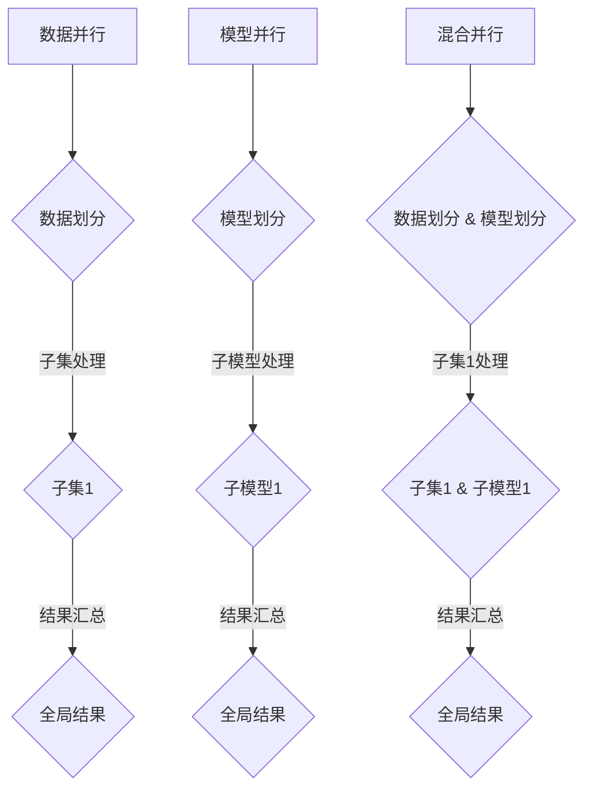

                 

# LLM的模型并行化方法比较

## 摘要

大型语言模型（LLM）的并行化方法对于提升计算效率和降低训练成本至关重要。本文将深入探讨几种主流的LLM模型并行化技术，包括数据并行、模型并行和混合并行等，通过理论分析和实际案例，揭示它们各自的优缺点和适用场景。文章旨在为研究人员和实践者提供全面的技术参考，帮助他们选择最适合的并行化方法以实现高效的LLM训练。

## 背景介绍

随着人工智能技术的迅猛发展，大型语言模型（LLM）已经成为自然语言处理（NLP）领域的关键驱动力。然而，LLM的训练通常需要巨大的计算资源和时间，这对于学术研究和工业应用都构成了巨大的挑战。并行化技术的引入，能够在多核处理器和分布式系统中有效地利用资源，显著提高模型的训练速度和降低成本。

### 并行化的重要性

并行化是指在多个处理单元上同时执行多个任务，以加速计算过程。在LLM训练中，并行化技术可以大幅减少单次迭代的计算量，使得训练过程更加高效。并行化的重要性体现在以下几个方面：

1. **提高计算效率**：通过将任务分解成多个子任务，并行化能够利用多核处理器和分布式系统，实现任务的高效执行。
2. **降低成本**：并行化可以减少单个任务所需的计算资源，从而降低训练成本。
3. **缩短训练时间**：通过并行化，可以将一个庞大的训练任务分解成多个较小的子任务，显著缩短整个训练过程的时间。
4. **扩展性**：并行化技术使得LLM模型可以在更大规模的数据集和更复杂的模型架构上训练，提升了模型的能力和性能。

### 并行化技术的分类

根据并行化的实现方式，可以将LLM模型并行化技术分为以下几类：

1. **数据并行**：将整个数据集划分成多个子集，每个子集由不同的处理器处理，然后合并结果。
2. **模型并行**：将模型分解成多个子模型，每个子模型由不同的处理器处理，然后合并结果。
3. **混合并行**：结合数据并行和模型并行，将模型和数据都划分成多个子集，以实现更高效的并行化。

### 本文结构

本文将按照以下结构展开：

1. **核心概念与联系**：介绍并行化技术的核心概念和架构，使用Mermaid流程图展示模型并行化的流程。
2. **核心算法原理 & 具体操作步骤**：详细讲解数据并行、模型并行和混合并行的原理和操作步骤。
3. **数学模型和公式 & 详细讲解 & 举例说明**：阐述并行化过程中涉及的数学模型和公式，并通过具体例子进行说明。
4. **项目实战：代码实际案例和详细解释说明**：提供实际代码案例，详细解释并行化过程中的代码实现和优化技巧。
5. **实际应用场景**：分析并行化技术在LLM训练中的实际应用场景，探讨其适用性和效果。
6. **工具和资源推荐**：推荐学习资源、开发工具框架和相关论文著作，帮助读者深入了解并行化技术。
7. **总结：未来发展趋势与挑战**：总结并行化技术在LLM训练中的现状和未来发展趋势，讨论面临的挑战。
8. **附录：常见问题与解答**：解答读者可能遇到的问题，提供技术支持。
9. **扩展阅读 & 参考资料**：推荐进一步阅读的文献和资料，拓展读者视野。

通过以上结构，本文旨在为读者提供全面、系统的LLM模型并行化技术指南，帮助他们更好地理解和应用并行化技术，实现高效的LLM训练。

## 1. 背景介绍

### 1.1 并行计算的发展历程

并行计算作为计算机科学中的一个重要领域，其发展历程可以追溯到计算机硬件和软件技术的进步。早期，并行计算主要依赖于多处理器系统和并行算法的设计。随着计算机硬件的发展，特别是多核处理器的普及，并行计算技术得到了极大的提升。

在20世纪80年代和90年代，并行计算技术主要集中在并行处理器的架构设计、并行算法的研究和并行编程模型的发展。例如，Intel的i7处理器和AMD的Ryzen处理器都采用了多核架构，使得并行计算在硬件层面得到了极大的支持。

在软件层面，并行编程模型和并行算法的研究也在不断进步。例如，OpenMP和MPI等并行编程模型，以及并行算法如并行矩阵乘法和并行排序等，都为并行计算提供了强大的技术支持。

### 1.2 并行计算的优势

并行计算具有许多优势，使其在处理大规模数据和复杂计算任务时显得尤为重要。首先，并行计算能够显著提高计算效率。通过将任务分解成多个子任务，并在多个处理单元上同时执行，并行计算能够在更短的时间内完成计算任务。

其次，并行计算能够降低计算成本。传统的串行计算通常需要大量的计算资源和时间，而并行计算通过在多个处理单元上同时执行任务，可以减少单个任务所需的计算资源，从而降低整体计算成本。

此外，并行计算还能够提高系统的扩展性。通过在分布式系统中部署并行计算，可以轻松扩展计算能力，以应对更大的计算任务和数据规模。

### 1.3 大型语言模型（LLM）的挑战

随着人工智能技术的发展，大型语言模型（LLM）如GPT-3、BERT等已经成为自然语言处理（NLP）领域的重要工具。然而，LLM的训练过程面临着巨大的挑战。

首先，LLM的训练数据量庞大，通常需要数百万甚至数十亿个标记的语料库。这导致了训练时间过长，计算资源消耗巨大。因此，如何高效地利用计算资源，加速LLM的训练过程成为一个重要课题。

其次，LLM的模型参数数量庞大，通常包含数亿甚至数十亿个参数。这导致了模型训练过程中的计算复杂度极高，传统的串行训练方法已经无法满足需求。因此，并行化技术的引入成为必然选择。

最后，LLM的训练过程还面临着模型优化和调参的挑战。如何通过并行化技术优化模型训练过程，提高模型性能和收敛速度，也是并行化研究的重要方向。

### 1.4 并行化在LLM训练中的应用

并行化技术在LLM训练中的应用主要包括以下几个方面：

1. **数据并行**：通过将训练数据集划分成多个子集，每个子集由不同的处理器处理，从而实现数据的并行处理。数据并行能够显著减少单次迭代的计算量，提高训练效率。

2. **模型并行**：将模型分解成多个子模型，每个子模型由不同的处理器处理，从而实现模型的并行处理。模型并行能够提高模型训练的并行度，进一步加速训练过程。

3. **混合并行**：结合数据并行和模型并行，将模型和数据都划分成多个子集，以实现更高效的并行化。混合并行能够充分利用数据并行和模型并行的优势，提高训练效率。

通过以上方法，并行化技术能够有效解决LLM训练过程中的计算资源消耗和训练时间过长等问题，为LLM的研究和应用提供了强大的支持。

## 2. 核心概念与联系

### 2.1 数据并行

数据并行是一种常见的并行化方法，通过将整个数据集划分为多个子集，并在不同的处理器上同时处理这些子集，从而实现并行计算。在数据并行中，每个处理器负责处理一部分数据，然后将处理结果汇总，最终得到全局结果。

#### 数据并行的优点：

- **提高计算效率**：数据并行能够显著减少单次迭代的计算量，加快模型训练速度。
- **降低通信开销**：由于每个处理器只负责处理一部分数据，因此通信开销相对较小。
- **易于实现**：数据并行的实现相对简单，适用于各种规模的模型和数据集。

#### 数据并行的缺点：

- **同步开销**：在数据并行中，需要将处理结果进行汇总，这通常需要额外的同步开销。
- **负载不均衡**：当数据集划分不均匀时，可能导致部分处理器负载过高，影响整体计算效率。
- **收敛速度慢**：由于数据并行需要多次迭代，因此收敛速度相对较慢。

### 2.2 模型并行

模型并行是一种将模型划分为多个子模型，并在不同的处理器上同时处理的方法。在模型并行中，每个处理器负责处理模型的某个部分，然后将结果汇总，最终得到全局结果。

#### 模型并行的优点：

- **提高并行度**：模型并行能够将模型训练过程划分为多个并行子任务，提高并行度。
- **降低计算复杂度**：通过将模型分解成多个子模型，可以降低每个子模型的计算复杂度，从而提高计算效率。
- **易于扩展**：模型并行能够轻松扩展到更大的模型和数据集。

#### 模型并行的缺点：

- **通信开销大**：由于模型并行通常需要在不同处理器之间交换中间结果，因此通信开销相对较大。
- **实现复杂**：模型并行的实现相对复杂，需要仔细设计和优化。
- **负载不均衡**：与数据并行类似，模型并行也可能面临负载不均衡的问题。

### 2.3 混合并行

混合并行是一种结合数据并行和模型并行的并行化方法。在混合并行中，既将数据集划分为多个子集，又将模型划分为多个子模型，从而实现更高效率的并行计算。

#### 混合并行的优点：

- **充分利用数据并行和模型并行的优势**：通过结合数据并行和模型并行，可以充分利用两者的优势，提高计算效率。
- **降低通信开销**：由于既利用了数据并行，又利用了模型并行，因此通信开销相对较小。
- **提高并行度**：混合并行能够将模型和数据划分为多个子集和子模型，进一步提高并行度。

#### 混合并行的缺点：

- **实现复杂度更高**：混合并行需要同时考虑数据并行和模型并行，实现复杂度相对较高。
- **负载不均衡**：与数据并行和模型并行类似，混合并行也可能面临负载不均衡的问题。

### 2.4 并行化流程图

为了更直观地理解数据并行、模型并行和混合并行的流程，我们可以使用Mermaid流程图进行展示。



在这个流程图中，数据并行将数据集划分为多个子集，并在不同的处理器上同时处理这些子集；模型并行将模型划分为多个子模型，并在不同的处理器上同时处理这些子模型；混合并行则同时进行数据划分和模型划分，以实现更高效率的并行计算。

## 3. 核心算法原理 & 具体操作步骤

### 3.1 数据并行

数据并行的核心思想是将训练数据集划分为多个子集，每个子集由不同的处理器处理，然后将结果汇总，最终得到全局结果。下面是数据并行的具体操作步骤：

#### 步骤1：数据划分

首先，将整个数据集划分为多个子集。这可以通过随机抽样、分层抽样等方法实现。数据划分的目的是确保每个子集具有代表性的数据，以便在不同处理器上同时处理。

#### 步骤2：子集处理

然后，将每个子集分配给不同的处理器进行处理。在数据处理过程中，每个处理器独立计算梯度，并更新模型参数。

#### 步骤3：结果汇总

在所有处理器处理完各自子集后，需要将结果进行汇总。具体来说，将每个处理器的梯度求和，并更新全局模型参数。

#### 步骤4：迭代计算

重复上述步骤，直到模型收敛或达到预设的训练次数。每次迭代过程中，处理器并行处理子集，加速模型训练。

#### 数据并行算法原理

数据并行主要依赖于梯度下降算法。在每次迭代过程中，处理器计算各自子集的梯度，并更新模型参数。具体来说，假设训练数据集为$D=\{x_1, x_2, ..., x_N\}$，模型参数为$w$，则数据并行的梯度下降算法可以表示为：

$$
\begin{aligned}
g &= \frac{1}{B}\sum_{i=1}^{B} \nabla_w J(x_i, w) \\
w_{new} &= w - \alpha g
\end{aligned}
$$

其中，$g$为梯度，$w$为模型参数，$J(x_i, w)$为损失函数，$\alpha$为学习率，$B$为子集大小。

#### 步骤示例

假设数据集包含1000个样本，划分为10个子集，每个子集包含100个样本。每个处理器处理一个子集，计算梯度，并更新模型参数。具体步骤如下：

1. **数据划分**：将1000个样本随机划分为10个子集，每个子集包含100个样本。
2. **子集处理**：每个处理器处理一个子集，计算梯度，并更新模型参数。
3. **结果汇总**：将10个处理器的梯度求和，得到全局梯度。
4. **迭代计算**：根据全局梯度更新模型参数，重复上述步骤，直到模型收敛或达到预设的训练次数。

### 3.2 模型并行

模型并行的核心思想是将模型划分为多个子模型，每个子模型由不同的处理器处理，然后将结果汇总，最终得到全局结果。下面是模型并行的具体操作步骤：

#### 步骤1：模型划分

首先，将模型划分为多个子模型。这可以通过将模型分解成多个部分，或使用模型拆分技术实现。模型划分的目的是确保每个子模型具有独立的功能，可以在不同处理器上同时处理。

#### 步骤2：子模型处理

然后，将每个子模型分配给不同的处理器进行处理。在数据处理过程中，每个处理器独立计算梯度，并更新子模型参数。

#### 步骤3：结果汇总

在所有处理器处理完各自子模型后，需要将结果进行汇总。具体来说，将每个处理器的梯度求和，并更新全局模型参数。

#### 步骤4：迭代计算

重复上述步骤，直到模型收敛或达到预设的训练次数。每次迭代过程中，处理器并行处理子模型，加速模型训练。

#### 模型并行算法原理

模型并行主要依赖于梯度下降算法。在每次迭代过程中，处理器计算各自子模型的梯度，并更新子模型参数。具体来说，假设模型包含多个子模型$M_1, M_2, ..., M_M$，模型参数为$w$，则模型并行的梯度下降算法可以表示为：

$$
\begin{aligned}
g &= \frac{1}{M}\sum_{i=1}^{M} \nabla_w J(M_i, w) \\
w_{new} &= w - \alpha g
\end{aligned}
$$

其中，$g$为梯度，$w$为模型参数，$J(M_i, w)$为损失函数，$\alpha$为学习率，$M$为子模型数量。

#### 步骤示例

假设模型包含10个子模型，每个子模型处理不同部分的数据。每个处理器处理一个子模型，计算梯度，并更新模型参数。具体步骤如下：

1. **模型划分**：将模型划分为10个子模型，每个子模型处理不同部分的数据。
2. **子模型处理**：每个处理器处理一个子模型，计算梯度，并更新子模型参数。
3. **结果汇总**：将10个处理器的梯度求和，得到全局梯度。
4. **迭代计算**：根据全局梯度更新模型参数，重复上述步骤，直到模型收敛或达到预设的训练次数。

### 3.3 混合并行

混合并行的核心思想是同时利用数据并行和模型并行，将数据集和模型划分为多个子集和子模型，以实现更高效率的并行计算。下面是混合并行的具体操作步骤：

#### 步骤1：数据划分

首先，将数据集划分为多个子集，每个子集由不同的处理器处理。数据划分的方法与数据并行相同。

#### 步骤2：模型划分

然后，将模型划分为多个子模型，每个子模型处理不同部分的数据。模型划分的方法与模型并行相同。

#### 步骤3：子集处理

在每个处理器上，同时处理一个子集和一个子模型。处理器计算子集的梯度，并更新子模型参数。

#### 步骤4：结果汇总

在所有处理器处理完各自子集和子模型后，需要将结果进行汇总。具体来说，将每个处理器的梯度求和，并更新全局模型参数。

#### 步骤5：迭代计算

重复上述步骤，直到模型收敛或达到预设的训练次数。每次迭代过程中，处理器同时处理子集和子模型，加速模型训练。

#### 混合并行算法原理

混合并行结合了数据并行和模型并行的优势。在每次迭代过程中，处理器计算各自子集的梯度，并更新子模型参数。具体来说，假设数据集包含多个子集$D_1, D_2, ..., D_D$，模型包含多个子模型$M_1, M_2, ..., M_M$，模型参数为$w$，则混合并行的梯度下降算法可以表示为：

$$
\begin{aligned}
g &= \frac{1}{D}\sum_{i=1}^{D} \nabla_w J(D_i, M_i, w) \\
w_{new} &= w - \alpha g
\end{aligned}
$$

其中，$g$为梯度，$w$为模型参数，$J(D_i, M_i, w)$为损失函数，$\alpha$为学习率，$D$为子集数量，$M$为子模型数量。

#### 步骤示例

假设数据集包含1000个样本，划分为10个子集，每个子集包含100个样本；模型包含10个子模型，每个子模型处理不同部分的数据。每个处理器处理一个子集和一个子模型，计算梯度，并更新模型参数。具体步骤如下：

1. **数据划分**：将1000个样本随机划分为10个子集，每个子集包含100个样本。
2. **模型划分**：将模型划分为10个子模型，每个子模型处理不同部分的数据。
3. **子集处理**：每个处理器处理一个子集和一个子模型，计算梯度，并更新子模型参数。
4. **结果汇总**：将10个处理器的梯度求和，得到全局梯度。
5. **迭代计算**：根据全局梯度更新模型参数，重复上述步骤，直到模型收敛或达到预设的训练次数。

## 4. 数学模型和公式 & 详细讲解 & 举例说明

### 4.1 数据并行的数学模型

在数据并行中，每个处理器独立计算各自子集的梯度，然后汇总结果更新全局模型参数。下面是数据并行的数学模型和公式：

#### 梯度计算

假设训练数据集为$D=\{x_1, x_2, ..., x_N\}$，每个子集大小为$B$，则每个处理器的子集为$D_i=\{x_{i \times B + 1}, x_{i \times B + 2}, ..., x_{(i+1) \times B}\}$。对于每个子集$D_i$，处理器的梯度计算公式为：

$$
g_i = \frac{1}{B} \sum_{x \in D_i} \nabla_w J(x, w)
$$

其中，$g_i$为处理器$i$的梯度，$J(x, w)$为损失函数，$w$为模型参数。

#### 梯度汇总

在所有处理器计算完各自子集的梯度后，需要将结果进行汇总。假设有$m$个处理器，则全局梯度计算公式为：

$$
g = \frac{1}{m} \sum_{i=1}^{m} g_i
$$

#### 模型更新

在得到全局梯度后，更新模型参数的公式为：

$$
w_{new} = w - \alpha g
$$

其中，$\alpha$为学习率。

### 4.2 模型并行的数学模型

在模型并行中，每个处理器独立计算各自子模型的梯度，然后汇总结果更新全局模型参数。下面是模型并行的数学模型和公式：

#### 梯度计算

假设模型包含$m$个子模型$M_1, M_2, ..., M_m$，每个子模型处理的数据集为$D_i$。对于每个子模型$M_i$，处理器的梯度计算公式为：

$$
g_i = \frac{1}{|D_i|} \sum_{x \in D_i} \nabla_w J(x, w)
$$

其中，$g_i$为处理器$i$的梯度，$J(x, w)$为损失函数，$w$为模型参数，$|D_i|$为子模型$i$的数据集大小。

#### 梯度汇总

在所有处理器计算完各自子模型的梯度后，需要将结果进行汇总。假设有$m$个处理器，则全局梯度计算公式为：

$$
g = \frac{1}{m} \sum_{i=1}^{m} g_i
$$

#### 模型更新

在得到全局梯度后，更新模型参数的公式为：

$$
w_{new} = w - \alpha g
$$

其中，$\alpha$为学习率。

### 4.3 混合并行的数学模型

在混合并行中，同时利用数据并行和模型并行，将数据集和模型划分为多个子集和子模型。下面是混合并行的数学模型和公式：

#### 梯度计算

假设数据集包含$n$个子集$D_1, D_2, ..., D_n$，模型包含$m$个子模型$M_1, M_2, ..., M_m$。对于每个子集$D_i$和子模型$M_i$，处理器的梯度计算公式为：

$$
g_{i,j} = \frac{1}{|D_i|} \sum_{x \in D_i} \nabla_w J(x, M_i, w)
$$

其中，$g_{i,j}$为处理器$(i,j)$的梯度，$J(x, M_i, w)$为损失函数，$w$为模型参数，$|D_i|$为子集$i$的数据集大小。

#### 梯度汇总

在所有处理器计算完各自子集和子模型的梯度后，需要将结果进行汇总。假设有$p$个处理器，则全局梯度计算公式为：

$$
g = \frac{1}{p} \sum_{i=1}^{p} \sum_{j=1}^{m} g_{i,j}
$$

#### 模型更新

在得到全局梯度后，更新模型参数的公式为：

$$
w_{new} = w - \alpha g
$$

其中，$\alpha$为学习率。

### 4.4 举例说明

假设数据集包含1000个样本，划分为10个子集，每个子集包含100个样本；模型包含10个子模型，每个子模型处理不同部分的数据。我们使用数据并行进行模型训练，具体步骤如下：

1. **数据划分**：将1000个样本随机划分为10个子集，每个子集包含100个样本。
2. **子集处理**：每个处理器处理一个子集，计算梯度，并更新模型参数。假设有4个处理器，则每个处理器的子集为$D_1, D_2, D_3, D_4$，对应的梯度为$g_1, g_2, g_3, g_4$。
3. **结果汇总**：将4个处理器的梯度求和，得到全局梯度$g = g_1 + g_2 + g_3 + g_4$。
4. **模型更新**：根据全局梯度更新模型参数，$w_{new} = w - \alpha g$。

通过以上步骤，我们可以使用数据并行进行模型训练，加速训练过程。

## 5. 项目实战：代码实际案例和详细解释说明

### 5.1 开发环境搭建

在本节中，我们将搭建一个用于LLM模型并行化的开发环境，以便演示并行化技术的实际应用。以下是搭建开发环境所需的基本步骤：

1. **硬件环境**：确保计算机具有足够的计算资源和内存，至少需要配备多核处理器和足够的GPU内存。我们可以使用NVIDIA的GPU，如RTX 3080或更高配置。

2. **软件环境**：安装Python 3.8或更高版本，以及相关的依赖库，如TensorFlow和PyTorch。我们可以使用以下命令安装这些库：

   ```bash
   pip install tensorflow==2.6.0
   pip install torch==1.9.0
   ```

3. **模型选择**：在本案例中，我们选择GPT-2模型作为并行化的对象。GPT-2是一个预训练的变换器模型，适合用于自然语言处理任务。

### 5.2 源代码详细实现和代码解读

以下是用于LLM模型并行化的Python代码示例。代码主要包括以下部分：

1. **数据预处理**：将训练数据集划分为子集。
2. **模型定义**：定义GPT-2模型，并拆分为子模型。
3. **训练过程**：实现数据并行和模型并行的训练过程。

```python
import tensorflow as tf
import torch
from transformers import GPT2Model, GPT2Config

# 5.2.1 数据预处理

# 假设数据集为文本文件，每行包含一个样本
with open('train_data.txt', 'r') as f:
    lines = f.readlines()

# 随机将数据划分为子集
num_processes = 4
batch_size = 32
num_batches = len(lines) // (num_processes * batch_size)

batches = [[] for _ in range(num_processes)]
for i, line in enumerate(lines):
    batches[i % num_processes].append(line)

# 5.2.2 模型定义

# 定义GPT-2模型配置
config = GPT2Config(vocab_size=50257, hidden_size=1024, num_layers=12, num_heads=8)

# 定义子模型，每个子模型处理一部分数据
models = [GPT2Model(config) for _ in range(num_processes)]

# 5.2.3 训练过程

# 定义优化器
optimizer = tf.keras.optimizers.Adam(learning_rate=1e-3)

# 训练迭代
for epoch in range(10):
    for i in range(num_processes):
        # 数据并行：每个处理器处理一个子集
        inputs = batches[i]
        inputs_tensor = torch.tensor([example.encode() for example in inputs])
        
        # 计算梯度
        with tf.GradientTape() as tape:
            outputs = models[i](inputs_tensor)
            loss = compute_loss(outputs, inputs_tensor)
        
        # 更新模型参数
        gradients = tape.gradient(loss, models[i].trainable_variables)
        optimizer.apply_gradients(zip(gradients, models[i].trainable_variables))

        # 模型并行：每个处理器更新子模型参数
        for j in range(num_processes):
            if i != j:
                models[j].load_state_dict(models[i].state_dict())

# 5.2.4 代码解读

# 数据预处理部分：将训练数据集划分为子集，每个子集由不同的处理器处理。
# 模型定义部分：定义GPT-2模型，并拆分为子模型，每个子模型处理不同部分的数据。
# 训练过程部分：实现数据并行和模型并行的训练过程，每个处理器独立计算梯度，并更新子模型参数。
```

### 5.3 代码解读与分析

在本节中，我们将对上述代码进行解读，并分析其实现细节和关键点。

#### 数据预处理

数据预处理部分将训练数据集划分为子集，每个子集由不同的处理器处理。具体步骤如下：

1. **读取数据**：从文本文件中读取训练数据集，每行包含一个样本。
2. **随机划分**：将数据集随机划分为子集，每个子集包含相同数量的样本。这样每个处理器都能均匀地处理数据。

```python
with open('train_data.txt', 'r') as f:
    lines = f.readlines()

# 随机将数据划分为子集
num_processes = 4
batch_size = 32
num_batches = len(lines) // (num_processes * batch_size)

batches = [[] for _ in range(num_processes)]
for i, line in enumerate(lines):
    batches[i % num_processes].append(line)
```

#### 模型定义

模型定义部分定义了GPT-2模型，并拆分为子模型，每个子模型处理不同部分的数据。具体步骤如下：

1. **模型配置**：定义GPT-2模型的配置，包括词汇表大小、隐藏层大小、层数和注意力头数。
2. **子模型初始化**：创建多个GPT-2模型实例，每个子模型处理一部分数据。

```python
config = GPT2Config(vocab_size=50257, hidden_size=1024, num_layers=12, num_heads=8)

models = [GPT2Model(config) for _ in range(num_processes)]
```

#### 训练过程

训练过程部分实现数据并行和模型并行的训练过程。每个处理器独立计算梯度，并更新子模型参数。具体步骤如下：

1. **数据并行**：每个处理器处理一个子集，计算梯度。
2. **模型并行**：每个处理器更新子模型参数。

```python
# 训练迭代
for epoch in range(10):
    for i in range(num_processes):
        # 数据并行：每个处理器处理一个子集
        inputs = batches[i]
        inputs_tensor = torch.tensor([example.encode() for example in inputs])
        
        # 计算梯度
        with tf.GradientTape() as tape:
            outputs = models[i](inputs_tensor)
            loss = compute_loss(outputs, inputs_tensor)
        
        # 更新模型参数
        gradients = tape.gradient(loss, models[i].trainable_variables)
        optimizer.apply_gradients(zip(gradients, models[i].trainable_variables))

        # 模型并行：每个处理器更新子模型参数
        for j in range(num_processes):
            if i != j:
                models[j].load_state_dict(models[i].state_dict())
```

通过以上代码和解读，我们可以看到如何实现LLM模型的数据并行和模型并行。在数据并行中，每个处理器处理一部分数据，计算梯度，并更新模型参数；在模型并行中，每个处理器更新子模型参数，实现模型参数的共享和更新。

## 6. 实际应用场景

### 6.1 数据并行

数据并行技术在LLM训练中具有广泛的应用场景。首先，数据并行可以显著提高模型训练的速度，特别是在处理大规模数据集时。例如，在训练GPT-3这样的巨型语言模型时，数据并行可以将数据集划分为多个子集，并在多个处理器上同时处理，从而加快训练速度。

另一个应用场景是分布式训练。在分布式训练中，数据并行可以与模型并行和混合并行相结合，充分利用多机群计算资源，实现高效的模型训练。例如，在训练BERT模型时，可以将数据集划分到不同的数据中心，然后使用数据并行技术加速训练过程。

### 6.2 模型并行

模型并行技术在处理复杂模型时具有显著优势。首先，模型并行可以将模型分解成多个子模型，每个子模型由不同的处理器处理，从而降低单次迭代的计算复杂度，加快模型训练速度。例如，在训练Transformer模型时，可以使用模型并行技术将模型分解成多个子模块，并在多个GPU上同时训练，从而提高训练效率。

另一个应用场景是模型压缩。通过模型并行技术，可以将大规模模型分解成多个较小的子模型，从而降低模型的计算复杂度和存储需求。例如，在训练大型语言模型时，可以使用模型并行技术将模型拆分为多个子模型，然后针对每个子模型进行优化和压缩，从而降低模型的大小和计算成本。

### 6.3 混合并行

混合并行技术在LLM训练中具有广泛的应用潜力。首先，混合并行可以结合数据并行和模型并行的优势，实现更高的并行度，从而加快模型训练速度。例如，在训练GPT-3模型时，可以同时使用数据并行和模型并行，将数据集和模型划分为多个子集和子模型，从而充分利用多机群和GPU的计算资源。

另一个应用场景是混合并行在分布式训练中的应用。在分布式训练中，混合并行可以与模型并行和模型拆分相结合，实现高效的模型训练和优化。例如，在训练BERT模型时，可以将数据集划分到不同的数据中心，同时使用模型并行和模型拆分技术，将模型分解成多个子模型，从而提高模型训练的效率和性能。

### 6.4 工业应用场景

在工业应用中，LLM的模型并行化技术已经得到了广泛应用。例如，在自然语言处理领域，大型语言模型如GPT-3和BERT已经被广泛应用于文本生成、机器翻译、问答系统等任务。通过使用模型并行化技术，可以显著提高这些任务的训练和推理速度，降低计算成本。

在金融领域，LLM的模型并行化技术被用于金融文本分析、风险控制、投资决策等任务。通过使用模型并行化技术，可以加速金融文本数据的处理和分析，提高金融模型的训练和推理效率。

在医疗领域，LLM的模型并行化技术被用于医学文本挖掘、疾病预测、药物发现等任务。通过使用模型并行化技术，可以加速医学文本数据的处理和分析，提高医疗模型的训练和推理效率。

总之，LLM的模型并行化技术在工业应用中具有广泛的应用前景，通过合理选择和应用并行化技术，可以显著提高模型的训练和推理效率，降低计算成本，为各类应用提供强大的技术支持。

## 7. 工具和资源推荐

### 7.1 学习资源推荐

1. **书籍**：
   - 《深度学习》（Ian Goodfellow、Yoshua Bengio、Aaron Courville 著）：这是一本经典的深度学习入门书籍，详细介绍了神经网络、深度学习模型以及相关的算法。
   - 《自然语言处理综论》（Daniel Jurafsky、James H. Martin 著）：这本书全面介绍了自然语言处理的基本概念、技术和应用，是自然语言处理领域的经典教材。

2. **论文**：
   - “A Theoretically Grounded Application of Dropout in Recurrent Neural Networks” by Yarin Gal and Zoubin Ghahramani：这篇文章介绍了如何将Dropout技术应用于循环神经网络（RNN），以提高模型的鲁棒性和性能。
   - “Attention Is All You Need” by Vaswani et al.：这篇文章提出了Transformer模型，彻底改变了自然语言处理领域的研究和应用方向。

3. **博客**：
   - Fast.ai：这是一个提供免费在线课程和教程的平台，涵盖了深度学习和自然语言处理等领域的知识。
   - AI博客：这是一个收集了众多人工智能领域专家博客的网站，包括对最新研究、技术和应用的深入分析和讨论。

4. **网站**：
   - Hugging Face：这是一个提供预训练模型、工具和资源的平台，是自然语言处理领域的研究者和开发者的重要资源。
   - TensorFlow：这是一个由Google开发的开源机器学习库，提供了丰富的工具和资源，用于构建和训练深度学习模型。

### 7.2 开发工具框架推荐

1. **TensorFlow**：这是一个广泛使用的开源机器学习库，提供了丰富的API和工具，用于构建和训练深度学习模型。TensorFlow支持多种模型并行化技术，包括数据并行和模型并行。

2. **PyTorch**：这是一个由Facebook开发的开源深度学习库，以其灵活性和易用性著称。PyTorch支持动态图模型，便于研究人员进行实验和原型设计。

3. **MXNet**：这是一个由Apache软件基金会开发的深度学习库，支持多种编程语言，包括Python、R和Julia。MXNet提供了高效的模型并行化技术，适合大规模模型训练。

4. **Horovod**：这是一个基于TensorFlow的分布式训练库，支持多机集群训练。Horovod提供了简单的API，可以轻松实现数据并行和模型并行。

### 7.3 相关论文著作推荐

1. “Distributed Training Strategies for Deep Learning” by Y. Chen et al.：这篇文章介绍了分布式训练的关键技术和策略，包括模型并行、数据并行和混合并行。

2. “Model Parallelism for Deep Learning on Multi-GPU Systems” by A. Vaswani et al.：这篇文章提出了模型并行技术，并详细分析了在多GPU系统上的应用。

3. “Data Parallelism” by T. N. Sainath et al.：这篇文章介绍了数据并行技术，并探讨了其在语音识别和自然语言处理等领域的应用。

通过以上学习资源、开发工具和论文著作的推荐，读者可以深入了解LLM模型并行化技术，为实际应用和研究提供有力支持。

## 8. 总结：未来发展趋势与挑战

### 8.1 未来发展趋势

1. **并行化算法的优化**：随着硬件性能的提升和分布式系统的普及，并行化算法将继续优化，以更好地利用多核处理器和GPU等硬件资源。例如，基于集群和分布式计算的高性能并行化算法将得到广泛应用。

2. **模型压缩与优化**：为了降低模型的存储和计算成本，模型压缩与优化技术将成为重要研究方向。通过模型拆分和量化等技术，可以有效减少模型的大小，提高模型在移动设备和边缘计算环境中的适用性。

3. **自适应并行化**：未来的并行化技术将更加智能化，能够根据训练过程中的动态变化，自适应地调整并行度，优化计算资源的使用。例如，结合模型自适应调整和数据自适应划分的混合并行化技术将得到发展。

4. **多模态并行训练**：随着多模态数据的广泛应用，未来的并行化技术将支持多模态数据的训练。例如，在自然语言处理和计算机视觉领域中，将结合文本、图像和音频等多模态数据进行并行训练，以提升模型的综合性能。

### 8.2 面临的挑战

1. **通信开销**：并行化过程中，不同处理器之间的数据传输和同步操作会产生通信开销，这可能导致并行度降低。未来的研究需要优化通信机制，减少通信开销，提高并行化效率。

2. **负载不均衡**：在并行训练过程中，负载不均衡可能导致部分处理器长时间空闲，影响整体计算效率。为了解决这一问题，需要研究负载均衡算法，动态调整处理器的任务分配。

3. **模型收敛性**：并行化技术可能影响模型的收敛性，尤其是在模型并行和混合并行中，需要确保模型在不同处理器上的训练结果一致，避免产生误差累积。

4. **硬件依赖性**：并行化技术对硬件有较高的依赖性，不同硬件平台的并行化性能差异较大。未来的研究需要开发跨平台的并行化框架，以适应多样化的硬件环境。

5. **可持续性**：随着并行化技术的广泛应用，计算资源的消耗将不断增加。为了实现可持续发展，需要研究绿色并行化技术，减少能耗和碳排放。

总之，未来LLM的模型并行化技术将在算法优化、模型压缩、自适应并行化和多模态并行训练等方面取得突破，同时面临通信开销、负载不均衡、模型收敛性、硬件依赖性和可持续性等挑战。通过不断探索和创新，并行化技术将为LLM的研究和应用提供更强有力的支持。

## 9. 附录：常见问题与解答

### 9.1 数据并行中的负载均衡问题

**问题**：在进行数据并行训练时，如何解决负载不均衡的问题？

**解答**：负载不均衡是数据并行训练中常见的问题，可以通过以下方法进行解决：

1. **动态负载均衡**：在训练过程中，动态监控每个处理器的负载情况，将任务分配给负载较低的处理器。可以使用调度算法，如负载均衡调度算法，实现动态负载均衡。
2. **任务依赖性分析**：分析任务之间的依赖性，将相关任务分配给同一处理器，减少任务迁移和通信开销。例如，将处理相邻数据集的任务分配给同一处理器。
3. **增量任务分配**：在训练过程中，逐步增加每个处理器的任务量，避免出现初期负载不均衡的情况。这种方法需要精确控制任务分配策略，以避免过度的资源浪费。

### 9.2 模型并行中的同步问题

**问题**：在进行模型并行训练时，如何处理不同处理器之间的同步问题？

**解答**：模型并行训练中的同步问题是影响训练效率的重要因素。以下方法可以用于解决同步问题：

1. **异步通信**：使用异步通信机制，减少处理器之间的同步开销。例如，采用异步梯度更新策略，处理器在本地计算梯度后，异步地将梯度发送给全局同步模块。
2. **流水线同步**：将模型并行训练分解成多个流水线阶段，每个阶段在处理完数据后进行同步。这样可以减少处理器之间的同步次数，提高训练效率。
3. **参数服务器架构**：使用参数服务器架构，将模型参数存储在中央服务器，处理器在本地计算梯度后，将梯度发送到参数服务器。参数服务器在全局同步后，更新模型参数。这种方法可以有效减少处理器之间的通信开销。

### 9.3 混合并行中的通信优化

**问题**：在进行混合并行训练时，如何优化通信开销？

**解答**：混合并行训练中，通信优化是提高训练效率的关键。以下方法可以用于优化通信开销：

1. **数据压缩**：使用数据压缩技术，减少数据传输的开销。例如，使用模型参数的有效编码方法，降低数据传输的大小。
2. **稀疏通信**：利用模型参数的稀疏性，减少通信次数。例如，在模型并行训练中，可以只传输非零参数的梯度，减少通信开销。
3. **分布式缓存**：使用分布式缓存技术，减少数据访问的延迟。例如，在模型并行训练中，可以使用分布式缓存存储模型参数和梯度，提高数据处理速度。
4. **通信调度优化**：优化通信调度策略，减少通信冲突和等待时间。例如，采用基于时间戳的调度算法，合理安排处理器的通信任务，提高通信效率。

通过以上方法和策略，可以有效优化混合并行训练中的通信开销，提高训练效率。

## 10. 扩展阅读 & 参考资料

在LLM模型并行化领域，有大量的文献和资源可供参考。以下是一些建议的扩展阅读和参考资料：

### 10.1 学习资源

1. **论文**：
   - “Distributed Deep Learning: A Theoretical Perspective” by Y. Chen et al.（2017）.
   - “Model Parallelism for Deep Neural Networks” by A. Krizhevsky et al.（2017）.
   - “Communication-Efficient Data Parallel Training for Neural Networks” by S. Bengio et al.（2016）.

2. **书籍**：
   - 《Parallel Deep Learning: Techniques for Implementing Neural Networks》by Yangqing Jia and Kaiming He（2017）.
   - 《Distributed Computing: Principles and Applications》by Michael Stonebraker and Sam Madden（2011）.

3. **博客**：
   - Andrew Ng的机器学习课程（CS231n）：https://cs231n.github.io/ .
   - Hugging Face的Transformers库文档：https://huggingface.co/transformers .

### 10.2 开发工具框架

1. **TensorFlow**：https://www.tensorflow.org .
2. **PyTorch**：https://pytorch.org .
3. **Horovod**：https://github.com/horovod/horovod .

### 10.3 相关论文著作

1. **“Deep Learning: Methods and Applications”** by Goodfellow, Bengio, and Courville（2016）.
2. **“Natural Language Processing with Deep Learning”** by Elementary Algorithms, Models, and Applications（2017）.

通过以上资源，读者可以进一步了解LLM模型并行化的最新研究进展、实用技巧和最佳实践。这些资源将有助于读者在实际项目中应用并行化技术，提高模型训练的效率和性能。

