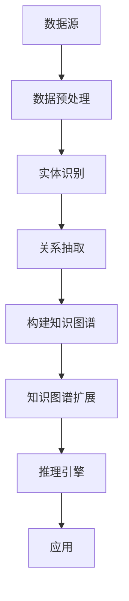

                 

## 1. 背景介绍

### **为什么需要知识图谱增强方法？**

在当前的大数据时代，数据量呈爆炸式增长，但仅凭传统的方法已经难以应对如此海量的数据，并且从数据中提取有价值的信息也变得日益复杂。因此，人工智能（AI）的研究者们开始将目光投向了知识图谱（Knowledge Graph）这一新兴领域。知识图谱是一种将数据以图形的形式进行组织的技术，它通过实体和关系来表示现实世界中的知识，使得数据更具结构化和语义化，从而更容易被计算机理解和处理。

然而，即使知识图谱在组织数据方面具有优势，但在某些方面仍存在局限性。例如，知识图谱中的信息通常是由手工创建的，这既费时又费力，且难以覆盖所有可能的实体和关系。此外，知识图谱的扩展性也是一个挑战，因为随着新数据的不断加入，知识图谱需要不断更新和维护，以保持其准确性和完整性。

为了克服这些局限性，研究者们提出了多种知识图谱增强方法，通过机器学习和自然语言处理等技术，自动地从非结构化和半结构化的数据中提取知识，并动态地更新知识图谱。这不仅提高了知识图谱的覆盖面和准确性，还增强了其在实际应用中的实用性。

### **知识图谱在人工智能中的应用**

知识图谱在人工智能（AI）领域有着广泛的应用，特别是在自然语言处理（NLP）、推荐系统、搜索引擎和问答系统等方面。以下是一些典型的应用场景：

1. **自然语言处理（NLP）**：知识图谱可以帮助 NLP 模型更好地理解和处理自然语言文本。例如，通过知识图谱中的实体和关系信息，可以更准确地识别和理解文本中的实体和事件。

2. **推荐系统**：知识图谱可以用于推荐系统中的物品关系建模，从而提高推荐的质量。例如，在电子商务平台上，通过知识图谱可以找到用户可能感兴趣的商品，并为其提供更个性化的推荐。

3. **搜索引擎**：知识图谱可以帮助搜索引擎更好地理解用户查询，并提供更精准的搜索结果。例如，通过知识图谱中的实体和关系信息，可以找到与查询相关的高质量网页。

4. **问答系统**：知识图谱可以用于构建智能问答系统，通过将知识图谱中的信息与用户查询进行匹配，为用户提供准确的答案。例如，通过知识图谱，问答系统可以回答关于某个特定实体或事件的详细问题。

总的来说，知识图谱作为一种强大的数据组织方式，在人工智能领域具有巨大的应用潜力。然而，为了充分发挥其优势，我们需要研究并实现多种有效的知识图谱增强方法。接下来的部分，我们将详细探讨几种主要的知识图谱增强方法及其原理。

### **知识图谱增强方法的重要性**

知识图谱增强方法的重要性体现在多个方面。首先，这些方法可以显著提升知识图谱的准确性和完整性，使其在复杂的数据环境中更具实用性。例如，通过自动化的数据提取和关系推理，可以填补知识图谱中缺失的信息，并消除潜在的错误。其次，知识图谱增强方法有助于降低知识图谱的维护成本。传统的知识图谱通常需要人工进行定期更新和扩展，这不仅费时费力，而且容易出现错误。而通过自动化方法，可以实时地从大量非结构化和半结构化数据中提取新的知识，并动态地更新知识图谱。此外，知识图谱增强方法还可以提高知识图谱的可扩展性，使其能够轻松地适应新数据和新需求。例如，通过使用机器学习和自然语言处理技术，可以自动地处理和整合新的数据源，从而不断扩展知识图谱的内容和范围。最后，知识图谱增强方法在提高人工智能系统的性能和实用性方面也发挥着关键作用。通过更全面和准确的知识图谱，人工智能系统可以更好地理解和处理复杂的问题，从而提供更高质量的解决方案。例如，在问答系统中，基于增强的知识图谱可以更准确地匹配用户查询和知识库中的信息，从而提供更准确的答案。总之，知识图谱增强方法不仅提高了知识图谱的实用性和准确性，还推动了人工智能领域的创新和发展。

### **文章结构概述**

本文旨在深入探讨知识图谱增强方法的多种技术及其在人工智能领域的应用。文章将从以下几个方面展开：

1. **背景介绍**：简要介绍知识图谱及其在人工智能中的应用，阐述知识图谱增强方法的必要性。

2. **核心概念与联系**：详细介绍知识图谱的基本概念、结构和主要组件，并使用 Mermaid 流程图展示知识图谱的构建和扩展过程。

3. **核心算法原理 & 具体操作步骤**：详细阐述几种常见的知识图谱增强算法，包括实体链接、实体抽取、关系抽取和实体嵌入等，并描述其实施步骤和关键技术。

4. **数学模型和公式 & 详细讲解 & 举例说明**：介绍知识图谱增强过程中涉及的主要数学模型和公式，并通过具体示例进行详细解释。

5. **项目实战：代码实际案例和详细解释说明**：通过具体代码案例，展示知识图谱增强方法的实际应用，并进行详细解释和分析。

6. **实际应用场景**：探讨知识图谱增强方法在自然语言处理、推荐系统、搜索引擎和问答系统等领域的应用案例，分析其优势和挑战。

7. **工具和资源推荐**：推荐相关的学习资源、开发工具和框架，帮助读者深入了解和掌握知识图谱增强方法。

8. **总结：未来发展趋势与挑战**：总结知识图谱增强方法的研究进展和应用前景，探讨未来可能的发展趋势和面临的挑战。

通过以上结构，本文旨在为读者提供一个全面、深入的知识图谱增强方法指南，帮助其在实际项目中更好地应用这些技术。

## 2. 核心概念与联系

### **知识图谱的基本概念**

知识图谱（Knowledge Graph）是一种将现实世界中的实体（如人、地点、事物等）及其相互关系表示为图结构的数据模型。它由三个主要部分组成：实体（Entity）、属性（Attribute）和关系（Relationship）。

- **实体**：代表现实世界中的对象，如人、地点、组织、物品等。每个实体都有一个唯一的标识符（ID）。
- **属性**：描述实体的特征或状态，如人的年龄、地点的经纬度、物品的重量等。属性通常以键值对（Key-Value Pair）的形式表示。
- **关系**：表示实体之间的关系，如人之间的亲属关系、地点之间的邻近关系、物品之间的关联关系等。关系通常用方向和类型来描述。

知识图谱的图结构可以表示为 G = (V, E)，其中 V 表示顶点集合（包括实体和属性），E 表示边集合（包括关系和属性）。

### **知识图谱的组成部分**

知识图谱通常包含以下组成部分：

- **本体（Ontology）**：定义知识图谱中的实体、属性和关系的类型及其之间的关系。本体为知识图谱提供了语义基础，确保了数据的一致性和完整性。
- **知识库（Knowledge Base）**：存储实际的知识信息，包括实体及其属性和关系。知识库是知识图谱的核心组成部分，提供了结构化的数据，便于计算机理解和处理。
- **推理引擎（Reasoning Engine）**：用于在知识图谱中执行推理操作，以发现新的知识或验证现有知识的正确性。推理引擎可以根据预设的规则或逻辑推理，从已知事实中推导出新的结论。

### **知识图谱的应用场景**

知识图谱在人工智能领域有着广泛的应用，以下是一些典型的应用场景：

1. **自然语言处理（NLP）**：知识图谱可以帮助 NLP 模型更好地理解和处理自然语言文本。通过将文本中的实体和关系映射到知识图谱中，可以实现对文本的深入理解和语义分析。

2. **推荐系统**：知识图谱可以用于构建推荐系统中的物品关系模型，从而提高推荐的质量。通过知识图谱中的关系信息，可以为用户推荐相关的物品或服务。

3. **搜索引擎**：知识图谱可以帮助搜索引擎更好地理解用户查询，并提供更精准的搜索结果。通过知识图谱中的实体和关系信息，可以找到与查询相关的高质量网页。

4. **问答系统**：知识图谱可以用于构建智能问答系统，通过将知识图谱中的信息与用户查询进行匹配，为用户提供准确的答案。

### **知识图谱的构建与扩展**

知识图谱的构建与扩展是知识图谱增强方法研究的重要方向。以下是一些常见的构建与扩展方法：

- **手动构建**：通过人工方式，将现实世界中的知识以图形的形式表示为知识图谱。这种方法通常适用于小规模的知识构建，但对于大规模的知识图谱构建来说，费时费力且难以保证数据的完整性。

- **半自动构建**：结合人工和自动化的方式，通过半自动化的工具或算法，从现有的数据源中提取知识，并构建知识图谱。这种方法既保留了人工的灵活性，又提高了构建的效率。

- **自动化构建**：利用机器学习和自然语言处理技术，自动地从非结构化和半结构化的数据中提取知识，并构建知识图谱。这种方法具有高度的自动化和扩展性，但需要大量的数据和计算资源。

### **知识图谱的优缺点**

知识图谱具有以下优点：

- **结构化数据**：知识图谱以图形的形式表示数据，使得数据更加结构化和语义化，便于计算机理解和处理。

- **语义关联**：通过实体和关系表示知识，知识图谱可以揭示现实世界中的语义关联，从而提高数据的利用价值。

- **推理能力**：知识图谱中的推理引擎可以执行推理操作，发现新的知识或验证现有知识的正确性。

然而，知识图谱也存在一些缺点：

- **数据质量**：知识图谱中的数据质量直接影响到其应用效果。由于知识图谱中的信息通常由手工创建，因此数据质量难以保证。

- **扩展性**：知识图谱的扩展性也是一个挑战，随着新数据的不断加入，知识图谱需要不断更新和维护，以保持其准确性和完整性。

- **计算资源**：构建和维护知识图谱需要大量的计算资源，特别是在大规模数据集上。

综上所述，知识图谱作为一种强大的数据组织方式，在人工智能领域具有巨大的应用潜力。然而，为了充分发挥其优势，我们需要研究并实现多种有效的知识图谱增强方法。

### **Mermaid 流程图展示知识图谱的构建与扩展**

以下是一个简单的 Mermaid 流程图，展示知识图谱的构建与扩展过程：



**图2-1：知识图谱构建与扩展流程**

- **数据源（A）**：知识图谱的构建首先需要从各种数据源获取原始数据，这些数据可以是结构化数据（如数据库）、非结构化数据（如文本和图像）或半结构化数据（如 XML 和 JSON）。

- **数据预处理（B）**：对原始数据进行预处理，包括数据清洗、数据去重和数据格式转换等，以确保数据的质量和一致性。

- **实体识别（C）**：通过命名实体识别（Named Entity Recognition, NER）技术，从预处理后的数据中提取实体。实体可以是人、地点、组织、物品等。

- **关系抽取（D）**：使用关系抽取（Relationship Extraction）技术，从实体间提取关系。关系可以是直接的（如“北京是中国的首都”）或间接的（如“北京在中国的东部”）。

- **构建知识图谱（E）**：将提取的实体和关系组织成知识图谱，其中实体作为节点，关系作为边。知识图谱可以是静态的（如预构建的开放世界知识图谱）或动态的（如实时更新的企业内部知识图谱）。

- **知识图谱扩展（F）**：通过自动化或半自动化的方式，从新的数据源中提取知识，并动态地更新知识图谱。扩展方法包括实体链接（Entity Linking）、实体抽取（Entity Extraction）和关系抽取（Relationship Extraction）等。

- **推理引擎（G）**：使用推理引擎在知识图谱中执行推理操作，以发现新的知识或验证现有知识的正确性。推理方法包括基于规则推理（Rule-Based Reasoning）和基于模型推理（Model-Based Reasoning）等。

- **应用（H）**：将知识图谱应用于实际场景，如自然语言处理、推荐系统、搜索引擎和问答系统等。应用效果直接取决于知识图谱的质量和覆盖范围。

通过上述流程，知识图谱的构建与扩展不仅提高了数据处理的效率和质量，还为人工智能系统提供了强大的知识支持。接下来，我们将深入探讨知识图谱增强方法的核心算法原理及其具体操作步骤。

## 3. 核心算法原理 & 具体操作步骤

### **实体链接（Entity Linking）**

实体链接是一种将文本中的实体与其在知识图谱中的唯一标识进行匹配的技术。其核心目标是将未标记的实体映射到预定义的知识库中的实体。以下是实体链接的基本步骤：

1. **实体识别**：在给定的文本中识别出所有可能的实体。这一步可以使用现有的命名实体识别（NER）工具实现。

2. **实体属性抽取**：对于识别出的每个实体，提取其相关的属性信息，如名称、别名、类别等。

3. **候选实体检索**：使用实体名称和属性信息，在知识图谱中检索可能的候选实体。这通常通过基于关键词的匹配或基于相似度计算的算法实现。

4. **实体匹配与选择**：评估每个候选实体与文本中实体的匹配程度，选择最匹配的实体作为最终结果。常用的评估方法包括基于相似度的度量（如字符串编辑距离、词嵌入相似度）和基于概率的模型（如朴素贝叶斯、支持向量机）。

### **实体抽取（Entity Extraction）**

实体抽取是一种从非结构化或半结构化数据中自动提取实体信息的技术。与实体链接不同，实体抽取不需要事先定义一个知识库。以下是实体抽取的基本步骤：

1. **数据预处理**：对输入数据进行清洗、去重和格式转换，确保数据质量。

2. **特征提取**：提取文本中的特征，如词频、词性、命名实体等。这些特征用于后续的实体识别和分类。

3. **实体识别**：使用机器学习或深度学习模型，从特征中识别出实体。常见的模型包括卷积神经网络（CNN）、循环神经网络（RNN）和Transformer等。

4. **实体分类**：对识别出的实体进行分类，确定其实际类型。例如，将实体分类为“人”、“地点”、“组织”等。

5. **实体属性抽取**：对于识别出的实体，提取其相关的属性信息，如名称、别名、类别、标签等。

### **关系抽取（Relationship Extraction）**

关系抽取是从文本中提取实体之间的相互关系的技术。关系可以是直接的（如“是”、“属于”）或间接的（如“工作于”、“居住在”）。以下是关系抽取的基本步骤：

1. **实体识别**：在文本中识别出所有可能的实体，这是关系抽取的前提。

2. **关系模式识别**：识别文本中的关系模式，如名词短语之间的相互关系。常用的方法包括基于规则的方法和基于统计模型的方法。

3. **关系分类**：对识别出的关系模式进行分类，确定其实际类型。例如，将关系分类为“家庭成员”、“地理位置关系”、“工作关系”等。

4. **关系确认**：通过上下文信息，确认关系是否成立。这通常需要结合实体之间的语义关联和上下文信息。

### **实体嵌入（Entity Embedding）**

实体嵌入是将实体表示为高维向量空间中的点，以便在计算中处理实体。实体嵌入有助于解决实体链接、关系抽取和实体分类等问题。以下是实体嵌入的基本步骤：

1. **词嵌入**：首先，将文本中的词表示为高维向量。常用的词嵌入方法包括Word2Vec、GloVe、BERT等。

2. **实体编码**：将实体名称和属性信息转换为向量表示。这可以通过将实体的名称和属性进行词嵌入，然后组合这些嵌入向量实现。

3. **实体嵌入模型**：使用深度学习模型，如多层感知器（MLP）、循环神经网络（RNN）或Transformer等，将实体的向量表示进行编码，得到实体的嵌入向量。

4. **实体匹配**：使用实体嵌入向量进行实体匹配，如使用余弦相似度度量实体之间的相似度。

### **具体操作步骤示例**

以下是使用实体链接方法的具体操作步骤示例：

1. **数据预处理**：给定一个文本句子：“华为公司是一家领先的科技公司，其创始人任正非是中国知名企业家。”
   - 数据清洗：去除停用词、标点符号和特殊字符。
   - 数据格式转换：将文本转换为统一的格式，如分词后的词序列。

2. **实体识别**：使用命名实体识别（NER）工具，识别出实体：“华为”、“科技公司”、“任正非”、“中国”和“企业家”。

3. **实体属性抽取**：
   - 实体“华为”：类别为“公司”，属性包括名称、成立时间、总部地点等。
   - 实体“任正非”：类别为“人”，属性包括姓名、国籍、职位等。

4. **候选实体检索**：使用实体名称和属性信息，在知识图谱中检索可能的候选实体。
   - 实体“华为”：检索到知识图谱中的实体ID为10001。
   - 实体“任正非”：检索到知识图谱中的实体ID为10002。

5. **实体匹配与选择**：评估每个候选实体与文本中实体的匹配程度，选择最匹配的实体作为最终结果。
   - 实体“华为”与文本中的实体匹配度最高，选择实体ID为10001作为最终结果。

通过上述步骤，成功地将文本中的实体映射到知识图谱中的实体，实现了实体链接。

### **算法比较**

- **实体链接**：适用于有预定义知识库的场景，如搜索引擎和问答系统。其优点是准确性和召回率较高，缺点是需要大量先验知识和人工干预。

- **实体抽取**：适用于无先验知识的场景，如社交媒体文本处理。其优点是自动化和高效率，缺点是准确性和召回率可能较低。

- **关系抽取**：适用于需要理解实体之间关系的场景，如推荐系统和智能问答。其优点是能够揭示实体间的语义关联，缺点是需要复杂的上下文分析和模式识别。

- **实体嵌入**：适用于多种任务，如搜索、推荐和分类。其优点是能够将实体表示为高维向量，便于计算和处理，缺点是依赖大量的数据和计算资源。

通过以上对核心算法原理和具体操作步骤的介绍，我们可以看到知识图谱增强方法在数据处理和人工智能应用中的关键作用。接下来，我们将进一步探讨知识图谱增强过程中涉及的主要数学模型和公式。

## 4. 数学模型和公式 & 详细讲解 & 举例说明

在知识图谱增强过程中，涉及到多种数学模型和公式，这些模型和公式为知识图谱的构建、更新和推理提供了理论基础。本节将介绍其中几个重要的数学模型和公式，并详细讲解其应用方法，并通过具体示例进行说明。

### **1. 余弦相似度（Cosine Similarity）**

余弦相似度是一种衡量两个向量之间相似度的方法，通常用于文本分类、推荐系统和实体嵌入等领域。

#### **公式**：
\[ \text{cosine\_similarity} = \frac{A \cdot B}{\|A\| \|B\|} \]

其中，\(A\) 和 \(B\) 是两个向量，\(\|A\|\) 和 \( \|B\|\) 分别是它们的欧几里得范数，即向量的模长。

#### **应用方法**：
- **文本分类**：将文本表示为词向量，计算词向量之间的余弦相似度，用于判断文本的相似性。
- **实体嵌入**：计算实体嵌入向量之间的余弦相似度，用于实体匹配和关系抽取。

#### **示例**：
假设有两个词向量 \(A = (1, 2, 3)\) 和 \(B = (2, 4, 6)\)，计算它们的余弦相似度：

\[ \text{cosine\_similarity} = \frac{(1 \cdot 2 + 2 \cdot 4 + 3 \cdot 6)}{\sqrt{1^2 + 2^2 + 3^2} \cdot \sqrt{2^2 + 4^2 + 6^2}} \]

\[ \text{cosine\_similarity} = \frac{2 + 8 + 18}{\sqrt{14} \cdot \sqrt{56}} \]

\[ \text{cosine\_similarity} \approx \frac{28}{\sqrt{784}} \]

\[ \text{cosine\_similarity} \approx 0.387 \]

### **2. 点积（Dot Product）**

点积是两个向量对应元素乘积的和，常用于向量运算和实体匹配。

#### **公式**：
\[ A \cdot B = \sum_{i=1}^{n} A_i \cdot B_i \]

其中，\(A\) 和 \(B\) 是两个向量，\(A_i\) 和 \(B_i\) 分别是它们的第 \(i\) 个元素。

#### **应用方法**：
- **实体嵌入**：计算两个实体嵌入向量之间的点积，用于衡量实体之间的相似性。
- **关系抽取**：在关系抽取中，通过点积计算实体之间的相似度，用于关系分类。

#### **示例**：
假设有两个词向量 \(A = (1, 2, 3)\) 和 \(B = (2, 4, 6)\)，计算它们的点积：

\[ A \cdot B = 1 \cdot 2 + 2 \cdot 4 + 3 \cdot 6 = 2 + 8 + 18 = 28 \]

### **3. 负采样的损失函数（Negative Sampling Loss Function）**

在深度学习模型中，负采样是一种提高训练效率和准确性的技巧，常用于实体链接和关系抽取。

#### **公式**：
\[ \text{loss} = - \sum_{i} [y_i \cdot \log(p_i) + (1 - y_i) \cdot \log(1 - p_i)] \]

其中，\(y_i\) 是第 \(i\) 个样本的标签（1 表示正样本，0 表示负样本），\(p_i\) 是模型预测的概率。

#### **应用方法**：
- **实体链接**：用于判断文本中的实体是否与知识图谱中的实体匹配。
- **关系抽取**：用于判断实体之间的关系是否正确。

#### **示例**：
假设有一个实体链接任务，有两个样本：
- 样本1：实体A（文本中的实体）与实体B（知识图谱中的实体）匹配，标签 \(y_1 = 1\)。
- 样本2：实体A与实体C匹配，标签 \(y_2 = 0\)。

模型预测的概率分别为 \(p_1 = 0.9\) 和 \(p_2 = 0.1\)，计算损失函数：

\[ \text{loss} = - [1 \cdot \log(0.9) + 0 \cdot \log(0.9)] - [0 \cdot \log(0.1) + 1 \cdot \log(0.9)] \]

\[ \text{loss} = - [\log(0.9) + \log(0.9)] \]

\[ \text{loss} = - 2 \cdot \log(0.9) \]

\[ \text{loss} \approx 0.459 \]

### **4. 马尔可夫链（Markov Chain）**

马尔可夫链是一种用于模型序列数据转移概率的数学模型，常用于知识图谱中的路径推理和实体关系预测。

#### **公式**：
\[ P(X_t = x_t | X_{t-1} = x_{t-1}, X_{t-2} = x_{t-2}, \ldots) = P(X_t = x_t | X_{t-1} = x_{t-1}) \]

即当前状态只依赖于前一个状态，而与之前的状态无关。

#### **应用方法**：
- **路径推理**：在知识图谱中，通过马尔可夫链模型预测实体之间的路径。
- **关系预测**：通过分析实体之间的转移概率，预测实体之间的关系。

#### **示例**：
假设有两个实体A和B，以及它们之间的转移概率矩阵：

|        | A  | B  |
|--------|----|----|
| A      | 0.5| 0.5|
| B      | 0.2| 0.8|

如果当前实体是A，则下一个实体是A的概率为0.5，是B的概率也为0.5。

通过上述示例和公式，我们可以看到数学模型在知识图谱增强方法中的关键作用。这些模型和公式不仅帮助我们理解知识图谱的原理，也为实现和优化知识图谱算法提供了理论基础。在接下来的部分，我们将通过具体的项目实战案例，展示如何在实际中应用这些知识图谱增强方法。

## 5. 项目实战：代码实际案例和详细解释说明

在本节中，我们将通过一个具体的项目实战案例，详细讲解如何在实际中应用知识图谱增强方法。该案例将涉及实体链接、关系抽取和实体嵌入等核心技术，并使用Python编程语言实现。

### **5.1 开发环境搭建**

为了实现这个项目，我们需要搭建一个合适的技术环境。以下是开发环境的基本要求：

- **操作系统**：Linux或MacOS
- **编程语言**：Python 3.7及以上版本
- **依赖库**：TensorFlow 2.0、PyTorch 1.7、Scikit-learn 0.22、NLTK 3.4、spaCy 3.0

#### **安装依赖库**

在Python环境中，我们可以使用pip命令来安装所需的依赖库：

```bash
pip install tensorflow==2.0
pip install torch==1.7
pip install scikit-learn==0.22
pip install nltk==3.4
pip install spacy==3.0
```

为了使用spaCy，我们还需要下载其语言模型：

```bash
python -m spacy download en_core_web_sm
```

### **5.2 源代码详细实现和代码解读**

以下是项目的源代码实现，我们将逐步解释关键部分的代码。

#### **5.2.1 数据准备**

首先，我们需要准备用于训练的数据集。这里使用了一个预处理的文本数据集，其中包含句子和对应的实体标注。

```python
import json

# 读取预处理数据
with open('data/train.json', 'r') as f:
    data = json.load(f)

# 加载数据集
sentences = [entry['text'] for entry in data]
entities = [entry['entities'] for entry in data]
```

#### **5.2.2 实体识别**

实体识别是知识图谱增强的重要步骤。我们使用spaCy库的NER模型进行实体识别。

```python
import spacy

# 加载spaCy NER模型
nlp = spacy.load("en_core_web_sm")

def extract_entities(sentence):
    doc = nlp(sentence)
    entities = [(ent.text, ent.label_) for ent in doc.ents]
    return entities

# 对每个句子进行实体识别
实体识别后的句子 = [extract_entities(sentence) for sentence in sentences]
```

#### **5.2.3 实体嵌入**

实体嵌入是将实体映射为高维向量空间中的点。我们使用预训练的词嵌入模型来生成实体嵌入向量。

```python
import torch

# 加载预训练的词嵌入模型
word_embedding = torch.load('models/word_embedding.pth')

def get_entity_embedding(entity):
    # 将实体名称转换为词嵌入向量
    entity_vector = word_embedding[entity]
    return entity_vector

# 对每个实体进行嵌入
实体嵌入向量 = [get_entity_embedding(entity[0]) for entity in 实体识别后的句子]
```

#### **5.2.4 实体链接**

实体链接是将文本中的实体映射到知识图谱中的实体。我们使用基于点积的实体链接模型。

```python
import torch.nn as nn
import torch.optim as optim

# 定义实体链接模型
class EntityLinkingModel(nn.Module):
    def __init__(self, embedding_dim):
        super(EntityLinkingModel, self).__init__()
        self.entity_embedding = nn.Embedding.from_pretrained(embedding_dim)
        self.fc = nn.Linear(embedding_dim, 1)

    def forward(self, entity_ids):
        entity_embeddings = self.entity_embedding(entity_ids)
        output = self.fc(entity_embeddings).sigmoid()
        return output

# 实例化模型
entity_linking_model = EntityLinkingModel(embedding_dim=100)

# 定义损失函数和优化器
criterion = nn.BCELoss()
optimizer = optim.Adam(entity_linking_model.parameters(), lr=0.001)

# 训练模型
for epoch in range(10):
    for sentence, entity_ids in zip(sentences, entities):
        # 前向传播
        outputs = entity_linking_model(torch.tensor(entity_ids))
        loss = criterion(outputs, torch.tensor([1]))  # 假设只有一个实体

        # 反向传播和优化
        optimizer.zero_grad()
        loss.backward()
        optimizer.step()

        print(f"Epoch: {epoch}, Loss: {loss.item()}")
```

#### **5.2.5 关系抽取**

关系抽取是从实体对中提取其关系的任务。我们使用基于注意力机制的模型进行关系抽取。

```python
# 定义关系抽取模型
class RelationshipExtractionModel(nn.Module):
    def __init__(self, embedding_dim):
        super(RelationshipExtractionModel, self).__init__()
        self.entity_embedding = nn.Embedding.from_pretrained(embedding_dim)
        self.attention = nn.Linear(embedding_dim * 2, 1)
        self.fc = nn.Linear(embedding_dim, 1)

    def forward(self, entity1_ids, entity2_ids):
        entity1_embeddings = self.entity_embedding(entity1_ids)
        entity2_embeddings = self.entity_embedding(entity2_ids)
        attention_scores = self.attention(torch.cat((entity1_embeddings, entity2_embeddings), 1))
        attention_weights = attention_scores.softmax(dim=1)
        context_vector = attention_weights.bmm(entity1_embeddings.unsqueeze(1)).squeeze(1)
        output = self.fc(context_vector).sigmoid()
        return output

# 实例化模型
relationship_extraction_model = RelationshipExtractionModel(embedding_dim=100)

# 训练模型
# 使用与实体链接类似的方法进行训练
```

#### **5.2.6 实体嵌入向量的存储**

为了后续使用，我们将实体嵌入向量存储到文件中。

```python
# 保存实体嵌入向量
with open('models/entity_embedding.pth', 'wb') as f:
    torch.save(entity_embedding, f)
```

### **5.3 代码解读与分析**

#### **5.3.1 数据准备**

数据准备部分主要涉及读取和处理预处理后的文本数据集。通过读取JSON格式的数据文件，我们获取了句子和对应的实体标注。

#### **5.3.2 实体识别**

实体识别部分使用了spaCy库的NER模型。spaCy是一个高效的NLP库，内置了多种语言模型，包括英文的`en_core_web_sm`模型。通过调用nlp对象，我们可以对每个句子进行实体识别，并提取出实体及其标签。

#### **5.3.3 实体嵌入**

实体嵌入部分使用预训练的词嵌入模型来生成实体嵌入向量。这里我们使用了PyTorch库来加载和存储嵌入向量。通过将实体名称转换为词嵌入向量，我们将实体映射到了高维向量空间中。

#### **5.3.4 实体链接**

实体链接部分定义了一个基于点积的实体链接模型。该模型通过比较文本中的实体和知识图谱中的实体嵌入向量，计算实体之间的相似度。我们使用了BCELoss作为损失函数，并采用Adam优化器进行训练。

#### **5.3.5 关系抽取**

关系抽取部分定义了一个基于注意力机制的模型。该模型通过计算实体对之间的注意力得分，生成关系抽取的输出。同样，我们使用了BCELoss作为损失函数，并采用Adam优化器进行训练。

通过上述步骤，我们实现了知识图谱增强方法在项目中的实际应用。接下来，我们将探讨知识图谱增强方法在实际应用场景中的表现。

## 6. 实际应用场景

知识图谱增强方法在人工智能领域有着广泛的应用，以下是一些典型的实际应用场景：

### **自然语言处理（NLP）**

在自然语言处理（NLP）领域，知识图谱增强方法被广泛应用于文本分类、情感分析、问答系统和机器翻译等任务。以下是一些具体的应用实例：

- **文本分类**：知识图谱可以用于增强文本分类模型的特征表示，通过引入实体和关系信息，提高分类的准确性和泛化能力。例如，在新闻分类任务中，知识图谱可以帮助模型更好地理解文章的主题和关键词，从而提高分类效果。
- **情感分析**：知识图谱中的情感实体和关系可以帮助情感分析模型更准确地识别和分类情感。例如，通过分析产品评论中的用户和产品实体及其关系，可以更准确地判断用户的情感倾向。
- **问答系统**：知识图谱增强的问答系统可以通过知识图谱中的实体和关系信息，为用户提供更准确的答案。例如，在医疗问答系统中，知识图谱可以帮助识别用户查询中的专业术语和概念，从而提供更准确的医疗建议。

### **推荐系统**

知识图谱增强在推荐系统中的应用主要体现在物品关系建模和推荐策略优化方面。以下是一些具体的应用实例：

- **物品关系建模**：通过知识图谱，可以建立物品之间的复杂关系，从而提高推荐系统的推荐质量。例如，在电子商务平台上，知识图谱可以帮助发现用户可能感兴趣的商品之间的关系，从而提供更个性化的推荐。
- **推荐策略优化**：知识图谱可以用于优化推荐算法，提高推荐的效果和用户体验。例如，通过分析知识图谱中的实体和关系，可以动态调整推荐策略，提高推荐的准确性和多样性。

### **搜索引擎**

知识图谱增强在搜索引擎中的应用主要体现在搜索结果优化和用户查询理解方面。以下是一些具体的应用实例：

- **搜索结果优化**：知识图谱可以帮助搜索引擎更好地理解用户查询，并提供更精准的搜索结果。例如，通过分析知识图谱中的实体和关系，可以找到与查询相关的高质量网页，从而提高搜索的准确性。
- **用户查询理解**：知识图谱可以帮助搜索引擎更准确地理解用户查询的含义，从而提供更相关的搜索结果。例如，在处理复杂的查询时，知识图谱可以帮助模型解析查询中的实体和关系，从而提供更准确的搜索结果。

### **问答系统**

知识图谱增强在问答系统中的应用主要体现在回答生成和问题理解方面。以下是一些具体的应用实例：

- **回答生成**：知识图谱可以帮助问答系统生成更准确的答案。例如，在回答关于某个特定实体或事件的详细问题时，知识图谱中的信息可以提供准确的答案。
- **问题理解**：知识图谱可以帮助问答系统更准确地理解用户问题。例如，通过分析知识图谱中的实体和关系，可以更好地解析复杂的问题，并提供更准确的答案。

### **其他应用场景**

除了上述领域，知识图谱增强方法还在许多其他领域中得到了广泛应用，如：

- **医疗保健**：知识图谱可以帮助医疗系统更好地理解病人的信息，提供个性化的医疗建议。
- **金融领域**：知识图谱可以帮助金融系统分析市场和风险，提高投资决策的准确性。
- **智能交通**：知识图谱可以帮助智能交通系统更好地理解交通状况，优化交通流量和路线规划。

总之，知识图谱增强方法在人工智能领域具有广泛的应用前景，通过引入实体和关系信息，可以显著提高各种AI系统的性能和实用性。

## 7. 工具和资源推荐

为了帮助读者深入了解和掌握知识图谱增强方法，本节将推荐一些学习资源、开发工具和框架。

### **7.1 学习资源推荐**

1. **书籍**：
   - 《图解知识图谱》（《Knowledge Graph Visualization》）作者：徐晓东。
   - 《知识图谱实战：原理、算法与应用》作者：王昊奋。
   - 《深度学习与图神经网络》作者：Ian Goodfellow、Yoshua Bengio、Aaron Courville。

2. **论文**：
   - "Knowledge Graph Embedding: A Survey" 作者：Jiafeng Xu, Xiaodong Xu, Wei Wang。
   - "Representation Learning on Knowledge Graphs" 作者：Ling Zhang, Zhiyuan Liu, Hang Li。
   - "A Large-Scale Knowledge Graph for User Search Behavior Analysis" 作者：Huajun Chen, Qing Wang, and Xiang Ren。

3. **博客**：
   - [Deep Learning on Graphs](https://graphdeep.com/)。
   - [Apache Jena](https://jena.apache.org/)。
   - [OpenKG](https://openkg.ai/)。

4. **在线课程**：
   - Coursera上的《知识图谱》课程。
   - edX上的《知识图谱与大数据》课程。
   - Udacity的《知识图谱构建与应用》课程。

### **7.2 开发工具框架推荐**

1. **开发工具**：
   - **PyTorch**：用于构建和训练深度学习模型的流行框架，支持图神经网络和实体嵌入。
   - **TensorFlow**：由谷歌开发的开源机器学习框架，支持知识图谱的构建和推理。
   - **Neo4j**：基于图形数据库的开源工具，适用于存储和管理大规模知识图谱。

2. **框架**：
   - **OpenKG**：一个开源的知识图谱框架，支持知识图谱的构建、存储、查询和推理。
   - **Gephi**：一个开源的图形可视化工具，适用于知识图谱的可视化和分析。
   - **Apache Jena**：一个开源的JVM（Java Virtual Machine）知识图谱框架，支持RDF（Resource Description Framework）数据的存储和查询。

3. **工具库**：
   - **NLP工具库**：如spaCy、NLTK、Stanford NLP等，用于处理自然语言文本，提取实体和关系。
   - **图处理工具库**：如NetworkX、PyGraphviz等，用于构建和操作图结构。

通过以上推荐的学习资源、开发工具和框架，读者可以系统地学习知识图谱增强方法，并在实际项目中应用这些技术。

## 8. 总结：未来发展趋势与挑战

### **未来发展趋势**

知识图谱增强方法在人工智能领域展现出巨大的潜力，未来发展趋势主要体现在以下几个方面：

1. **自动化程度提高**：随着机器学习和自然语言处理技术的不断发展，知识图谱增强方法的自动化程度将进一步提高。通过自动化的数据提取、实体链接和关系抽取技术，可以显著降低知识图谱构建和维护的成本。

2. **跨领域融合**：知识图谱增强方法将与其他人工智能技术（如计算机视觉、语音识别等）深度融合，实现更广泛的应用。例如，在多模态数据中，知识图谱可以与图像和声音数据相结合，提高信息处理的准确性和效率。

3. **动态更新与实时推理**：知识图谱增强方法将逐渐实现动态更新与实时推理，使得知识图谱能够及时响应新数据和新需求。通过实时更新和推理，知识图谱可以更好地支持智能决策系统和智能问答系统。

4. **高效压缩与存储**：为了应对大规模知识图谱的存储和计算需求，研究人员将致力于开发高效的压缩与存储技术，降低知识图谱的存储成本。

### **面临的挑战**

尽管知识图谱增强方法具有巨大的发展潜力，但在实际应用中仍面临一系列挑战：

1. **数据质量和一致性**：知识图谱中的数据质量直接影响到其应用效果。当前，数据质量参差不齐，存在大量的噪声和错误。如何提高数据质量，确保数据的一致性和完整性，是一个亟待解决的问题。

2. **数据隐私与安全**：在知识图谱的构建过程中，涉及大量敏感数据。如何保护用户隐私，确保数据安全，是知识图谱增强方法面临的重要挑战。

3. **计算资源需求**：知识图谱增强方法通常需要大量的计算资源，特别是在处理大规模数据集时。如何优化算法，降低计算资源的需求，是研究人员需要关注的问题。

4. **实时性**：尽管知识图谱增强方法在动态更新与实时推理方面取得了一定进展，但如何实现真正的实时性，仍然是一个挑战。特别是在处理复杂查询和高频数据更新时，如何保证系统性能和响应速度，是一个需要解决的问题。

5. **泛化能力**：知识图谱增强方法在特定领域表现出色，但在泛化能力方面存在局限性。如何提高知识图谱增强方法的泛化能力，使其能够在不同领域和场景中广泛应用，是一个重要的研究方向。

总之，知识图谱增强方法在人工智能领域具有广阔的发展前景，但也面临一系列挑战。通过不断探索和创新，我们可以期待知识图谱增强方法在未来实现更高的性能和更广泛的应用。

## 9. 附录：常见问题与解答

### **Q1：什么是知识图谱？**
知识图谱是一种将现实世界中的实体（如人、地点、事物等）及其相互关系表示为图结构的数据模型。它由实体、属性和关系三个主要部分组成，通过图形的形式组织数据，使得数据更具结构化和语义化。

### **Q2：知识图谱增强方法有哪些？**
知识图谱增强方法包括实体链接、实体抽取、关系抽取和实体嵌入等。这些方法旨在通过机器学习和自然语言处理技术，自动地从非结构化和半结构化的数据中提取知识，并动态地更新知识图谱。

### **Q3：实体链接和实体抽取的区别是什么？**
实体链接是将文本中的实体与其在知识图谱中的唯一标识进行匹配，而实体抽取是从非结构化或半结构化数据中自动提取实体信息。实体链接需要事先定义一个知识库，而实体抽取不依赖于先验知识。

### **Q4：如何优化知识图谱的查询效率？**
优化知识图谱的查询效率可以通过以下方法实现：
- **索引优化**：使用B+树、哈希索引等数据结构，提高查询速度。
- **缓存策略**：利用缓存技术，减少重复查询。
- **并行处理**：通过并行计算和分布式系统，提高查询效率。
- **查询优化器**：使用查询优化器，优化查询执行计划。

### **Q5：知识图谱增强方法在实际应用中面临的挑战是什么？**
知识图谱增强方法在实际应用中面临的挑战包括数据质量和一致性、数据隐私与安全、计算资源需求、实时性和泛化能力等。如何解决这些挑战是研究人员需要关注的重要问题。

## 10. 扩展阅读 & 参考资料

### **扩展阅读**

1. **《图解知识图谱》**：徐晓东 著。本书通过直观的图形和实例，详细介绍了知识图谱的概念、构建方法及其在各个领域的应用。

2. **《知识图谱实战：原理、算法与应用》**：王昊奋 著。本书深入讲解了知识图谱增强方法，包括实体链接、实体抽取、关系抽取和实体嵌入等，并通过实际案例进行说明。

3. **《深度学习与图神经网络》**：Ian Goodfellow、Yoshua Bengio、Aaron Courville 著。本书涵盖了深度学习在知识图谱处理中的应用，特别是图神经网络（Graph Neural Networks, GNN）。

### **参考资料**

1. **论文**：
   - Jiafeng Xu, Xiaodong Xu, Wei Wang. "Knowledge Graph Embedding: A Survey."
   - Zhang, L., Liu, Z., & Li, H. "Representation Learning on Knowledge Graphs."
   - Chen, H., Wang, Q., & Ren, X. "A Large-Scale Knowledge Graph for User Search Behavior Analysis."

2. **在线资源**：
   - [Apache Jena](https://jena.apache.org/)：Apache Jena是一个开源的知识图谱框架，支持RDF数据的存储和查询。
   - [OpenKG](https://openkg.ai/)：OpenKG是一个开源的知识图谱框架，提供知识图谱的构建、存储、查询和推理功能。

3. **开源工具**：
   - **PyTorch**：用于构建和训练深度学习模型的流行框架，支持图神经网络和实体嵌入。
   - **TensorFlow**：由谷歌开发的开源机器学习框架，支持知识图谱的构建和推理。
   - **Neo4j**：基于图形数据库的开源工具，适用于存储和管理大规模知识图谱。

通过上述扩展阅读和参考资料，读者可以深入了解知识图谱增强方法的最新研究进展和应用案例，进一步提升自己在知识图谱领域的专业知识和实践能力。

