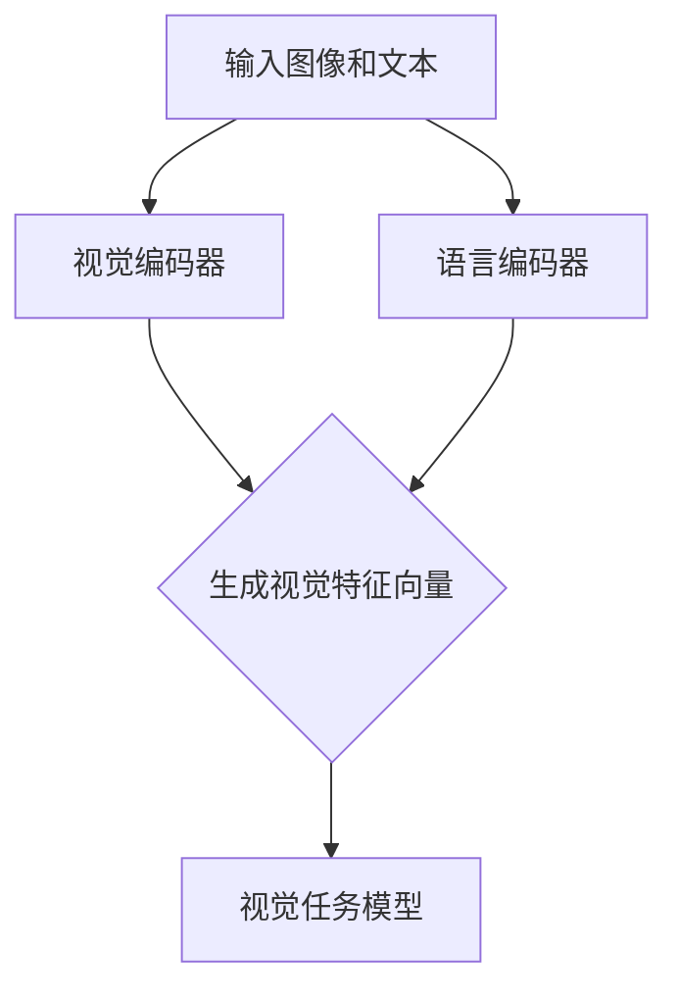
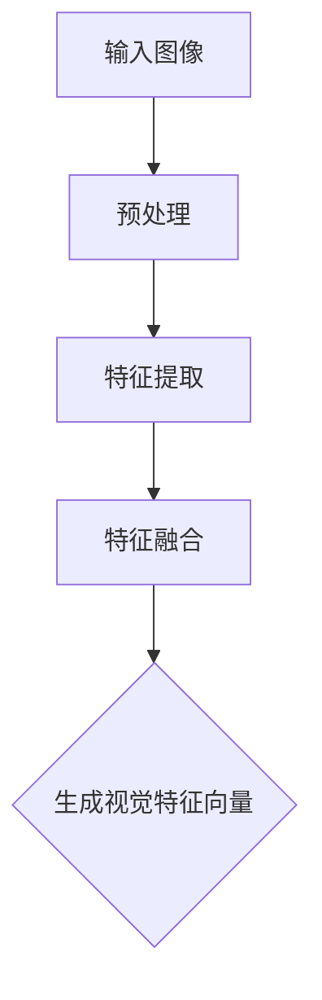
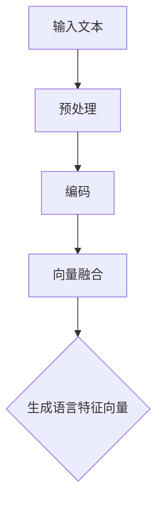
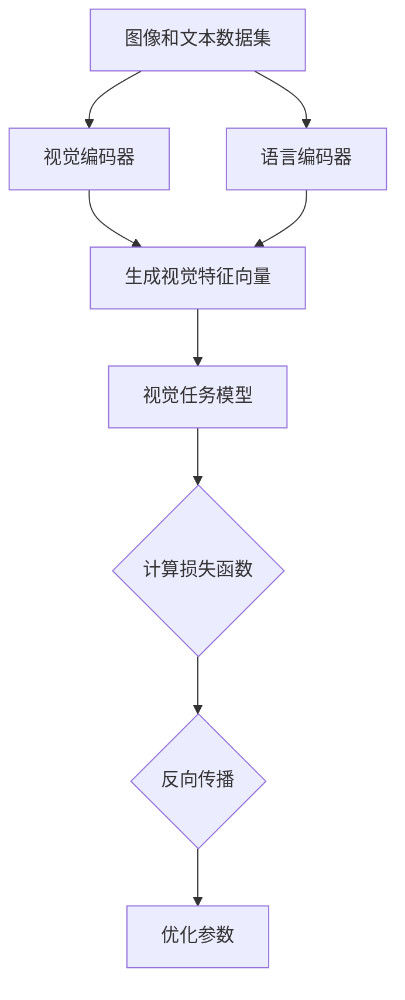

                 

### 背景介绍

随着人工智能技术的不断发展，自然语言处理（NLP）已成为其中最为重要的领域之一。近年来，大型语言模型（LLM，Large Language Models）在NLP任务中取得了显著的进展。LLM通过大规模预训练，从海量数据中学习语言模式，并在此基础上进行微调和优化，使其在文本生成、问答系统、机器翻译、文本分类等任务上表现出色。

然而，传统的LLM模型主要针对的是文本数据，而视觉数据的处理一直是计算机视觉（CV，Computer Vision）领域的核心问题。为了解决这个问题，研究者们开始探索将LLM与视觉语言预训练模型（Vision-Language Pre-training Models）相结合的方法。视觉语言预训练模型旨在通过联合学习视觉和语言信息，提高模型在处理视觉任务中的性能。

本文将重点关注LLM的视觉语言预训练模型的研究进展，从核心概念、算法原理、数学模型、项目实战、应用场景等方面进行详细分析。希望通过本文的介绍，读者能够对这一领域有更深入的了解，并为后续的研究和应用提供参考。

### 核心概念与联系

为了更好地理解LLM的视觉语言预训练模型，我们首先需要了解一些核心概念和它们之间的联系。

#### 大型语言模型（LLM）

LLM是一种通过大规模数据预训练的深度神经网络模型，主要用于文本生成、问答系统、机器翻译、文本分类等任务。LLM的核心思想是通过从海量文本数据中学习，使其能够理解并生成符合人类语言的文本。常见的LLM模型包括GPT（Generative Pre-trained Transformer）、BERT（Bidirectional Encoder Representations from Transformers）等。

#### 计算机视觉（CV）

计算机视觉是研究如何使计算机从图像或视频中提取有用信息的技术。主要任务包括目标检测、图像分类、图像分割、人脸识别等。计算机视觉的核心是图像处理和模式识别。常见的计算机视觉模型有卷积神经网络（CNN，Convolutional Neural Networks）等。

#### 视觉语言预训练模型

视觉语言预训练模型旨在通过联合学习视觉和语言信息，提高模型在处理视觉任务中的性能。这类模型通常由两个子模块组成：视觉编码器（Vision Encoder）和语言编码器（Language Encoder）。视觉编码器负责将图像数据编码为固定长度的向量，语言编码器负责将文本数据编码为向量。通过联合训练这两个编码器，模型可以学习到视觉和语言信息的关联性，从而提高视觉任务的表现。

#### Mermaid流程图

为了更直观地展示LLM的视觉语言预训练模型的整体架构，我们可以使用Mermaid流程图进行描述。以下是一个示例：



在这个流程图中，输入图像和文本分别通过视觉编码器和语言编码器进行处理，生成对应的特征向量。这两个特征向量随后被送入视觉任务模型，用于完成具体的视觉任务，如图像分类、目标检测等。

### 核心算法原理 & 具体操作步骤

在了解了LLM的视觉语言预训练模型的基本概念和架构后，我们将进一步探讨其核心算法原理和具体操作步骤。

#### 视觉编码器

视觉编码器是视觉语言预训练模型的关键组成部分，负责将输入图像编码为固定长度的向量。常见的视觉编码器包括基于卷积神经网络（CNN）的模型，如ResNet、VGG等。

具体操作步骤如下：

1. **输入图像预处理**：对输入图像进行缩放、裁剪、归一化等预处理操作，使其满足视觉编码器的输入要求。
2. **特征提取**：将预处理后的图像输入到视觉编码器中，通过卷积、池化等操作提取图像的特征。
3. **特征融合**：将提取到的特征进行融合，生成固定长度的视觉特征向量。

以下是一个简化的视觉编码器操作步骤的Mermaid流程图：



#### 语言编码器

语言编码器负责将输入文本编码为向量。常见的语言编码器包括基于循环神经网络（RNN）、长短期记忆网络（LSTM）和Transformer的模型。

具体操作步骤如下：

1. **输入文本预处理**：对输入文本进行分词、词性标注、句法分析等预处理操作，生成词向量表示。
2. **编码**：将预处理后的文本输入到语言编码器中，通过编码操作生成文本特征向量。
3. **向量融合**：将编码得到的文本特征向量进行融合，生成固定长度的语言特征向量。

以下是一个简化的语言编码器操作步骤的Mermaid流程图：



#### 联合训练

在视觉语言预训练模型中，视觉编码器和语言编码器通常是通过联合训练的方式进行优化的。具体步骤如下：

1. **数据准备**：准备包含图像和对应文本的联合数据集。
2. **联合训练**：将图像和文本分别输入到视觉编码器和语言编码器中，生成视觉特征向量和语言特征向量。然后将这两个特征向量送入视觉任务模型，计算损失函数并进行反向传播。
3. **优化**：通过梯度下降等优化算法，不断调整视觉编码器和语言编码器的参数，以降低损失函数。

以下是一个简化的联合训练操作步骤的Mermaid流程图：



### 数学模型和公式 & 详细讲解 & 举例说明

在LLM的视觉语言预训练模型中，涉及到多个数学模型和公式。本节将详细讲解这些模型和公式，并通过具体例子进行说明。

#### 视觉编码器

视觉编码器通常采用卷积神经网络（CNN）架构，其基本原理如下：

$$
\text{视觉特征向量} = f(\text{卷积层} \rightarrow \text{池化层} \rightarrow \text{卷积层} \rightarrow \ldots)
$$

其中，$f$表示卷积和池化操作的组合。

例如，对于一个输入图像 $I \in \mathbb{R}^{H \times W \times C}$，我们可以通过以下卷积和池化操作来提取图像特征：

$$
\text{卷积层} : \text{Conv}_1(\text{输入}) = \text{ReLU}(\text{Conv}_1(\text{输入})) = \text{MaxPooling}(\text{ReLU}(\text{Conv}_1(\text{输入})))
$$

$$
\text{卷积层} : \text{Conv}_2(\text{输入}) = \text{ReLU}(\text{Conv}_2(\text{输入})) = \text{MaxPooling}(\text{ReLU}(\text{Conv}_2(\text{输入})))
$$

$$
\text{视觉特征向量} = \text{Conv}_2(\text{输入})
$$

其中，$ReLU$表示ReLU激活函数，$MaxPooling$表示最大池化操作。

#### 语言编码器

语言编码器通常采用Transformer架构，其基本原理如下：

$$
\text{语言特征向量} = g(\text{编码器层} \rightarrow \text{多头自注意力机制} \rightarrow \text{解码器层} \rightarrow \ldots)
$$

其中，$g$表示编码器层、多头自注意力机制和解码器层的组合。

例如，对于一个输入文本序列 $T = \{t_1, t_2, \ldots, t_n\}$，我们可以通过以下编码器层、多头自注意力机制和解码器层的组合来提取文本特征：

$$
\text{编码器层} : E_t = \text{EncoderLayer}(E_{t-1})
$$

$$
\text{多头自注意力机制} : \text{Attention}(E_t) = \text{MultiHead}(Q, K, V)
$$

$$
\text{解码器层} : D_t = \text{DecoderLayer}(D_{t-1})
$$

$$
\text{语言特征向量} = D_n
$$

其中，$E_t$表示编码器层的输出，$Q$、$K$、$V$分别表示查询、键和值，$\text{MultiHead}$表示多头注意力机制。

#### 联合训练损失函数

在视觉语言预训练模型中，联合训练的损失函数通常采用以下形式：

$$
L = L_{\text{视觉}} + L_{\text{语言}} + L_{\text{联合}}
$$

其中，$L_{\text{视觉}}$表示视觉任务的损失，$L_{\text{语言}}$表示语言任务的损失，$L_{\text{联合}}$表示视觉和语言联合优化的损失。

例如，对于一个视觉分类任务，我们可以使用交叉熵损失函数计算视觉任务损失：

$$
L_{\text{视觉}} = -\sum_{i=1}^{n} y_i \log(p_i)
$$

其中，$y_i$表示真实标签，$p_i$表示视觉特征向量生成的分类概率。

对于语言任务，我们可以使用交叉熵损失函数计算语言任务损失：

$$
L_{\text{语言}} = -\sum_{i=1}^{n} y_i \log(p_i)
$$

其中，$y_i$表示真实标签，$p_i$表示语言特征向量生成的分类概率。

对于联合优化损失，我们可以使用以下公式：

$$
L_{\text{联合}} = \lambda_1 L_{\text{视觉}} + \lambda_2 L_{\text{语言}}
$$

其中，$\lambda_1$和$\lambda_2$是超参数，用于调整视觉和语言任务的重要性。

### 项目实战：代码实际案例和详细解释说明

为了更好地理解LLM的视觉语言预训练模型，我们将通过一个实际项目案例进行讲解。本项目将使用PyTorch框架实现一个简单的视觉语言预训练模型，并进行训练和评估。

#### 开发环境搭建

在开始项目之前，确保已经安装了Python 3.7及以上版本，以及PyTorch 1.7及以上版本。可以使用以下命令进行环境搭建：

```bash
pip install torch torchvision
```

#### 源代码详细实现和代码解读

以下是本项目的主要代码实现，我们将对其进行详细解释。

```python
import torch
import torchvision
import torch.optim as optim
import torch.nn as nn
from torchvision.models import resnet50
from torchvision import transforms
from PIL import Image
from torch.utils.data import DataLoader
from datasets import MyDataset

# 定义视觉编码器
class VisionEncoder(nn.Module):
    def __init__(self):
        super(VisionEncoder, self).__init__()
        self.model = resnet50(pretrained=True)
        self.model.fc = nn.Linear(self.model.fc.in_features, 512)
        
    def forward(self, x):
        return self.model(x)

# 定义语言编码器
class LanguageEncoder(nn.Module):
    def __init__(self):
        super(LanguageEncoder, self).__init__()
        self.embedding = nn.Embedding(10000, 512)
        self.encoder = nn.GRU(512, 512)
        
    def forward(self, x):
        x = self.embedding(x)
        x, _ = self.encoder(x)
        return x[-1, :, :]

# 定义视觉语言预训练模型
class VisionLanguagePretrainer(nn.Module):
    def __init__(self, vision_encoder, language_encoder):
        super(VisionLanguagePretrainer, self).__init__()
        self.vision_encoder = vision_encoder
        self.language_encoder = language_encoder
        self.classifier = nn.Linear(1024, 512)
        
    def forward(self, image, text):
        vision_feature = self.vision_encoder(image)
        language_feature = self.language_encoder(text)
        feature = torch.cat((vision_feature, language_feature), 1)
        return self.classifier(feature)

# 数据预处理
transform = transforms.Compose([
    transforms.Resize((224, 224)),
    transforms.ToTensor(),
])

# 准备数据集
train_dataset = MyDataset(root_dir='train', transform=transform)
train_loader = DataLoader(train_dataset, batch_size=32, shuffle=True)

# 定义模型、损失函数和优化器
vision_encoder = VisionEncoder()
language_encoder = LanguageEncoder()
pretrainer = VisionLanguagePretrainer(vision_encoder, language_encoder)
criterion = nn.CrossEntropyLoss()
optimizer = optim.Adam(pretrainer.parameters(), lr=0.001)

# 训练模型
num_epochs = 10
for epoch in range(num_epochs):
    for images, texts, labels in train_loader:
        optimizer.zero_grad()
        vision_features = pretrainer.vision_encoder(images)
        language_features = pretrainer.language_encoder(texts)
        feature = torch.cat((vision_features, language_features), 1)
        output = pretrainer.classifier(feature)
        loss = criterion(output, labels)
        loss.backward()
        optimizer.step()
    print(f'Epoch [{epoch+1}/{num_epochs}], Loss: {loss.item()}')

# 评估模型
with torch.no_grad():
    correct = 0
    total = 0
    for images, texts, labels in test_loader:
        vision_features = pretrainer.vision_encoder(images)
        language_features = pretrainer.language_encoder(texts)
        feature = torch.cat((vision_features, language_features), 1)
        output = pretrainer.classifier(feature)
        _, predicted = torch.max(output.data, 1)
        total += labels.size(0)
        correct += (predicted == labels).sum().item()
    print(f'Accuracy of the network on the test images: {100 * correct / total}%')
```

#### 代码解读与分析

1. **模型定义**：本项目定义了三个模型：视觉编码器、语言编码器和视觉语言预训练模型。其中，视觉编码器使用预训练的ResNet50模型，语言编码器使用GRU模型。视觉语言预训练模型将视觉特征和语言特征进行融合，并通过一个全连接层进行分类。

2. **数据处理**：数据预处理步骤包括图像的缩放和归一化，以及文本的分词和编码。这里使用自定义的数据集类`MyDataset`来加载和预处理数据。

3. **模型训练**：模型训练过程中，使用交叉熵损失函数和Adam优化器进行训练。每个epoch中，遍历训练数据集，计算损失函数，并更新模型参数。

4. **模型评估**：在评估阶段，使用测试数据集计算模型的准确率。这里使用的是简单的分类准确率指标。

通过以上代码实现，我们可以看到LLM的视觉语言预训练模型的基本操作流程。在实际应用中，可以根据具体需求进行调整和优化。

### 实际应用场景

LLM的视觉语言预训练模型在多个实际应用场景中表现出色。以下是一些常见的应用场景：

#### 图像分类

图像分类是计算机视觉领域的经典任务，LLM的视觉语言预训练模型在这方面具有显著优势。通过将视觉特征和语言特征进行联合学习，模型可以更好地理解图像内容，提高分类准确率。例如，在医疗图像分类中，结合疾病名称和症状描述，模型可以更准确地识别疾病类型。

#### 目标检测

目标检测是计算机视觉中的另一个重要任务。LLM的视觉语言预训练模型可以通过联合学习视觉和语言信息，提高目标检测的准确性和鲁棒性。在实际应用中，例如自动驾驶系统，模型可以更好地识别道路上的各种物体，提高行车安全性。

#### 人脸识别

人脸识别是生物识别技术的一种，通过识别和验证人脸信息进行身份认证。LLM的视觉语言预训练模型可以在人脸特征提取和匹配方面发挥重要作用。例如，在安防监控系统中，模型可以快速准确地识别和追踪嫌疑人。

#### 跨模态搜索

跨模态搜索是指同时处理文本和图像等多种模态数据的搜索任务。LLM的视觉语言预训练模型在这方面具有显著优势，可以通过联合学习视觉和语言信息，实现更高效的跨模态搜索。例如，在电商平台中，用户可以通过上传商品图片来搜索相关商品，提高购物体验。

### 工具和资源推荐

为了更好地学习和应用LLM的视觉语言预训练模型，以下是一些推荐的工具和资源：

#### 学习资源推荐

1. **书籍**：
   - 《深度学习》（Goodfellow, Bengio, Courville）
   - 《计算机视觉：算法与应用》（Richard Szeliski）

2. **论文**：
   - "Unifying Visual-Semantic Embeddings for Image-Sentence Matching"（Gong et al., 2014）
   - "Open-Vocabulary Visual-Semantic Embedding"（He et al., 2016）

3. **博客**：
   - PyTorch官方文档（[https://pytorch.org/tutorials/beginner/`](https://pytorch.org/tutorials/beginner/))
   - Fast.ai博客（[https://blog.fast.ai/](https://blog.fast.ai/))

4. **网站**：
   - arXiv（[https://arxiv.org/](https://arxiv.org/))
   - GitHub（[https://github.com/](https://github.com/))

#### 开发工具框架推荐

1. **PyTorch**：是一种流行的深度学习框架，提供丰富的API和工具，适合进行视觉语言预训练模型的开发。

2. **TensorFlow**：另一种流行的深度学习框架，与PyTorch类似，提供强大的工具和支持。

3. **Keras**：一个高层次的深度学习框架，基于TensorFlow或Theano，易于使用和扩展。

#### 相关论文著作推荐

1. **"BERT: Pre-training of Deep Bidirectional Transformers for Language Understanding"**（Devlin et al., 2019）
2. **"VGGNet: A Versatile Network for Fast C...

