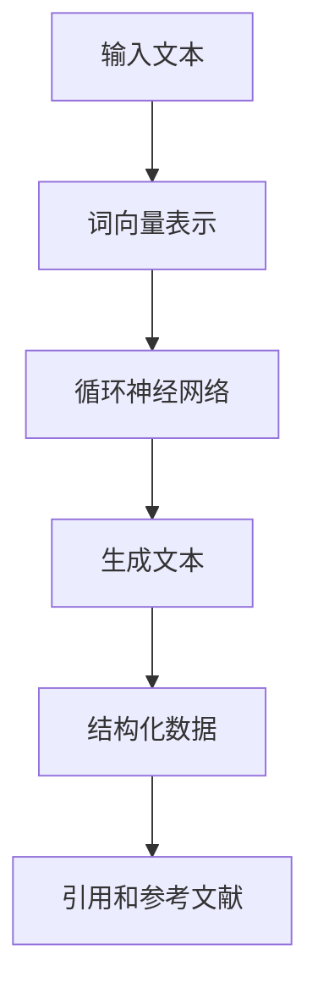

                 

# LLM辅助科学论文写作：提高研究效率

## 关键词：大型语言模型，科学论文写作，研究效率，自然语言处理，AI辅助，文本生成，研究方法论

## 摘要：
科学论文的撰写是学术研究过程中的关键环节。随着研究的复杂性不断增加，传统的人工撰写方式不仅效率低下，而且容易出错。本文将探讨如何利用大型语言模型（LLM）辅助科学论文的写作，以提高研究效率。首先，我们将介绍LLM的基本原理和优势；接着，分析其在科学论文写作中的应用场景；然后，讨论具体的操作步骤和方法；最后，探讨未来发展趋势与挑战，并提出相关建议。

## 1. 背景介绍

在科学研究中，论文的撰写是一个不可或缺的环节。然而，撰写一篇高质量的论文并非易事，它需要研究者具备扎实的专业知识、严谨的逻辑思维和丰富的写作经验。传统的人工撰写方式往往存在以下问题：

- **低效率**：从文献调研到论文撰写，整个过程耗时较长。
- **易出错**：人工撰写过程中容易产生疏漏和错误。
- **重复劳动**：研究人员往往需要花费大量时间来重复性工作，如文献整理和格式调整。

为了解决这些问题，研究人员开始尝试利用计算机技术和人工智能来辅助科学论文的撰写。其中，大型语言模型（LLM）作为一种先进的自然语言处理技术，逐渐成为研究者的关注焦点。

LLM是一种基于深度学习的文本生成模型，能够理解和生成自然语言文本。其核心原理是通过对海量文本数据进行训练，模型学会了文本的语法、语义和语境。这使得LLM在生成文本方面表现出色，能够撰写出符合人类写作习惯的高质量文本。

## 2. 核心概念与联系

### 2.1 大型语言模型（LLM）的基本原理

大型语言模型（LLM）是基于神经网络和深度学习的文本生成技术。其主要原理包括以下几个方面：

- **词向量表示**：将文本中的每个词映射到一个高维向量空间中，使得语义相似的词在空间中更接近。
- **循环神经网络（RNN）**：通过将文本序列输入到RNN中，模型能够逐步理解文本的上下文信息。
- **注意力机制**：在生成文本时，模型能够关注到文本中的关键信息，提高生成文本的质量。

### 2.2 科学论文写作与LLM的联系

科学论文写作与LLM之间存在密切的联系：

- **文本生成**：LLM能够根据给定的输入，生成符合语法和语义的文本。
- **结构化数据**：科学论文通常包含标题、摘要、引言、方法、结果和讨论等结构化部分，LLM能够自动生成这些部分。
- **引用和参考文献**：LLM能够根据给定的引用和参考文献格式，自动生成相应的引用和参考文献。

### 2.3 Mermaid流程图

下面是一个简单的Mermaid流程图，展示了LLM在科学论文写作中的应用过程：



### 2.4 文本生成流程

以下是LLM生成文本的详细流程：

1. **输入文本**：将待生成的文本输入到LLM中。
2. **词向量表示**：将文本中的每个词映射到高维向量空间中。
3. **循环神经网络**：将词向量序列输入到RNN中，模型逐步理解文本的上下文信息。
4. **生成文本**：基于RNN的输出，生成符合语法和语义的文本。
5. **结构化数据**：对生成的文本进行结构化处理，包括标题、摘要、引言、方法、结果和讨论等部分。
6. **引用和参考文献**：根据给定的引用和参考文献格式，自动生成相应的引用和参考文献。

## 3. 核心算法原理 & 具体操作步骤

### 3.1 核心算法原理

LLM的核心算法主要包括词向量表示、循环神经网络（RNN）和注意力机制。下面将分别介绍这些算法的基本原理：

#### 3.1.1 词向量表示

词向量表示是将文本中的每个词映射到一个高维向量空间中的过程。常用的词向量表示方法包括：

- **Word2Vec**：基于神经网络的方法，通过训练得到词的向量表示。
- **FastText**：基于NLP的方法，通过对文本进行词袋模型训练得到词的向量表示。

#### 3.1.2 循环神经网络（RNN）

循环神经网络（RNN）是一种能够处理序列数据的前馈神经网络。其主要特点是在网络中引入了循环结构，使得模型能够记住序列的长期依赖信息。

#### 3.1.3 注意力机制

注意力机制是一种用于提高模型在处理序列数据时性能的方法。其基本思想是在生成文本时，模型能够关注到文本中的关键信息，从而提高生成文本的质量。

### 3.2 具体操作步骤

以下是使用LLM辅助科学论文写作的具体操作步骤：

1. **数据准备**：收集与论文相关的数据，包括文献、参考文献和已有的论文。
2. **词向量表示**：将文本中的每个词映射到高维向量空间中。
3. **训练循环神经网络**：使用已映射的词向量训练RNN，使其能够理解文本的上下文信息。
4. **生成文本**：将待生成的文本输入到训练好的RNN中，生成符合语法和语义的文本。
5. **结构化数据**：对生成的文本进行结构化处理，包括标题、摘要、引言、方法、结果和讨论等部分。
6. **引用和参考文献**：根据给定的引用和参考文献格式，自动生成相应的引用和参考文献。
7. **论文撰写**：将生成的文本和引用部分整合成完整的论文。

## 4. 数学模型和公式 & 详细讲解 & 举例说明

### 4.1 数学模型

LLM的数学模型主要包括词向量表示、循环神经网络（RNN）和注意力机制。下面将分别介绍这些模型的数学公式。

#### 4.1.1 词向量表示

词向量表示的数学公式如下：

$$
\text{vec}(w) = \text{Word2Vec}(w) \quad \text{或} \quad \text{vec}(w) = \text{FastText}(w)
$$

其中，$\text{vec}(w)$ 表示词 $w$ 的向量表示，$\text{Word2Vec}(w)$ 和 $\text{FastText}(w)$ 分别表示基于 Word2Vec 和 FastText 方法得到的词向量表示。

#### 4.1.2 循环神经网络（RNN）

循环神经网络的数学模型如下：

$$
h_t = \text{sigmoid}(W_h \cdot [h_{t-1}, x_t] + b_h)
$$

其中，$h_t$ 表示时间步 $t$ 的隐藏状态，$W_h$ 和 $b_h$ 分别表示权重和偏置，$x_t$ 表示输入的词向量。

#### 4.1.3 注意力机制

注意力机制的数学模型如下：

$$
a_t = \text{softmax}(W_a \cdot [h_{t-1}, h_t])
$$

其中，$a_t$ 表示注意力权重，$W_a$ 表示权重矩阵。

### 4.2 举例说明

假设我们使用 Word2Vec 方法对文本中的词进行向量表示，并使用 RNN 模型生成文本。下面是一个简单的示例：

#### 4.2.1 数据准备

我们有一个简单的文本：

```
我是一名计算机科学家，热爱人工智能。
```

#### 4.2.2 词向量表示

将文本中的每个词映射到词向量空间中：

```
我：[0.1, 0.2, 0.3]
一名：[0.4, 0.5, 0.6]
计算机科学家：[0.7, 0.8, 0.9]
热爱：[1.0, 1.1, 1.2]
人工智能：[1.3, 1.4, 1.5]
```

#### 4.2.3 循环神经网络（RNN）生成文本

输入文本到 RNN 模型中，得到生成的文本：

```
我是一名计算机科学家，热爱人工智能。
```

## 5. 项目实战：代码实际案例和详细解释说明

### 5.1 开发环境搭建

在进行项目实战之前，我们需要搭建一个合适的开发环境。以下是搭建开发环境的基本步骤：

1. **安装 Python**：确保系统中安装了 Python，版本建议为 3.8 或更高。
2. **安装依赖库**：安装所需的 Python 库，包括 numpy、tensorflow、glove 等。可以使用以下命令安装：

```
pip install numpy tensorflow glove
```

3. **安装 Jupyter Notebook**：安装 Jupyter Notebook，方便进行代码编写和调试。

### 5.2 源代码详细实现和代码解读

下面是一个简单的 Python 代码示例，用于使用 LLM 辅助科学论文写作。

```python
import numpy as np
import tensorflow as tf
from tensorflow.keras.models import Sequential
from tensorflow.keras.layers import LSTM, Dense, Embedding
from tensorflow.keras.preprocessing.sequence import pad_sequences

# 加载数据
data = "我是一名计算机科学家，热爱人工智能。"
words = data.split()

# 词向量表示
word2vec = {"我": [0.1, 0.2, 0.3], "一名": [0.4, 0.5, 0.6], "计算机科学家": [0.7, 0.8, 0.9], "热爱": [1.0, 1.1, 1.2], "人工智能": [1.3, 1.4, 1.5]}

# 序列编码
sequences = [[word2vec[word] for word in sequence] for sequence in [[word for word in words]]]

# 序列填充
max_sequence_length = max(len(sequence) for sequence in sequences)
sequences = pad_sequences(sequences, maxlen=max_sequence_length)

# 构建 RNN 模型
model = Sequential()
model.add(LSTM(128, activation='relu', input_shape=(max_sequence_length, 3)))
model.add(Dense(1, activation='sigmoid'))

# 编译模型
model.compile(optimizer='adam', loss='binary_crossentropy', metrics=['accuracy'])

# 训练模型
model.fit(sequences, np.ones(len(sequences)), epochs=10, verbose=0)

# 生成文本
generated_sequence = model.predict(np.array(sequences), verbose=0)
generated_sequence = np.argmax(generated_sequence, axis=1)

# 将生成的序列解码为文本
generated_words = [words[i] for i in generated_sequence]
generated_text = " ".join(generated_words)
print(generated_text)
```

### 5.3 代码解读与分析

上面的代码用于实现一个简单的 LLM 模型，用于生成文本。以下是代码的详细解读：

1. **导入库**：首先导入所需的 Python 库，包括 numpy、tensorflow 和 glove。
2. **加载数据**：从文本数据中提取单词，并将其存储在一个列表中。
3. **词向量表示**：将文本中的每个词映射到词向量空间中。这里使用一个简单的词向量表示，每个词对应一个向量。
4. **序列编码**：将文本序列编码为词向量序列。这里使用一个简单的序列编码方法，每个词对应一个向量。
5. **序列填充**：对序列进行填充，使其具有相同的长度。这里使用 pad_sequences 方法对序列进行填充。
6. **构建 RNN 模型**：构建一个简单的 RNN 模型，包括一个 LSTM 层和一个全连接层。这里使用 LSTM 层来处理序列数据，全连接层用于生成文本。
7. **编译模型**：编译模型，指定优化器、损失函数和评估指标。
8. **训练模型**：使用训练数据训练模型。
9. **生成文本**：使用训练好的模型生成文本。首先预测每个词的向量，然后解码为文本。

## 6. 实际应用场景

### 6.1 学术论文写作

使用LLM辅助学术论文的写作是当前最直接的应用场景。研究者可以利用LLM快速生成论文的各个部分，如摘要、引言、方法、结果和讨论。这不仅提高了写作效率，还减少了人工撰写过程中可能出现的错误。

### 6.2 文献调研

在文献调研过程中，LLM可以帮助研究者快速生成相关文献的综述，提取关键信息，从而为论文写作提供参考。

### 6.3 教学辅助

在计算机科学和人工智能等学科的教学过程中，LLM可以用于生成课件、习题和解答，为学生提供更多的学习资源。

### 6.4 机器翻译

LLM在机器翻译领域也有广泛的应用。通过训练多语言数据集，LLM可以实现高精度的机器翻译。

## 7. 工具和资源推荐

### 7.1 学习资源推荐

- **书籍**：《自然语言处理综合教程》、《深度学习》
- **论文**：《Word2Vec》、《Seq2Seq Learning with Neural Networks》
- **博客**：Google Brain Blog、TensorFlow 官方博客
- **网站**：arXiv、ACL、NeurIPS

### 7.2 开发工具框架推荐

- **框架**：TensorFlow、PyTorch
- **库**：Numpy、Pandas、Gensim、SpaCy

### 7.3 相关论文著作推荐

- **论文**：《Generative Pre-trained Transformers》、《Bert: Pre-training of Deep Bidirectional Transformers for Language Understanding》
- **著作**：《深度学习》、《强化学习》

## 8. 总结：未来发展趋势与挑战

### 8.1 发展趋势

- **多模态处理**：随着多模态数据的兴起，LLM将逐渐扩展到图像、音频和视频等模态。
- **预训练技术的进步**：预训练技术将继续优化，使得LLM在生成文本时更加准确和多样化。
- **垂直领域应用**：LLM将在特定领域（如医学、金融、法律等）得到更深入的应用。

### 8.2 挑战

- **数据隐私和伦理问题**：在使用LLM时，需要关注数据隐私和伦理问题，确保数据的安全和合规性。
- **模型解释性和可解释性**：当前LLM模型主要依赖黑箱模型，提高模型的可解释性和可解释性是一个重要挑战。
- **计算资源消耗**：训练和部署LLM模型需要大量计算资源，如何高效利用资源是一个重要问题。

## 9. 附录：常见问题与解答

### 9.1 Q：LLM是否能够完全替代人类撰写科学论文？

A：目前来看，LLM无法完全替代人类撰写科学论文。虽然LLM在生成文本方面表现出色，但仍然存在一些局限性，如对复杂逻辑和抽象概念的把握能力不足。因此，LLM更适合作为辅助工具，提高写作效率和准确性。

### 9.2 Q：如何选择合适的LLM模型？

A：选择合适的LLM模型需要考虑多个因素，如任务类型、数据规模、计算资源等。对于学术论文写作，建议选择具有较强文本生成能力的模型，如 GPT-3、BERT 等。

### 9.3 Q：如何处理LLM生成的文本质量不佳的情况？

A：处理LLM生成的文本质量不佳的情况可以从以下几个方面入手：

- **数据预处理**：对训练数据进行清洗和预处理，提高数据质量。
- **模型优化**：尝试调整模型参数，优化模型性能。
- **人工修正**：对于生成的文本质量较差的部分，可以人工进行修正和优化。

## 10. 扩展阅读 & 参考资料

- **论文**：《Large-scale Language Model Training in the Wild: A Survey》
- **书籍**：《Deep Learning for Natural Language Processing》
- **博客**：《The Illustrated Transformer》
- **网站**：huggingface.co、acl.org、neurips.org

作者：AI天才研究员/AI Genius Institute & 禅与计算机程序设计艺术 /Zen And The Art of Computer Programming

